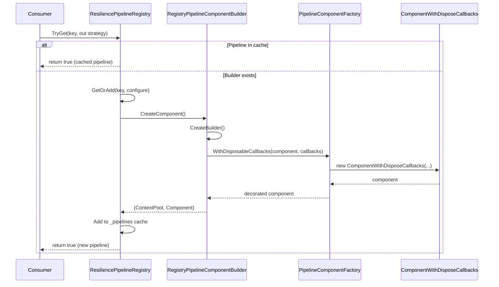
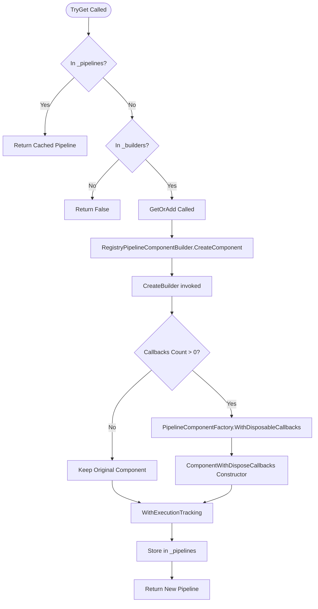

# Pipeline Component Retrieval and Disposal

Relevant source files

The following files were used as context for generating this wiki page:

- [src/Polly.Core/Registry/ResiliencePipelineRegistry.TResult.cs](https://github.com/App-vNext/Polly/blob/main/src/Polly.Core/Registry/ResiliencePipelineRegistry.TResult.cs)
- [src/Polly.Core/Registry/RegistryPipelineComponentBuilder.cs](https://github.com/App-vNext/Polly/blob/main/src/Polly.Core/Registry/RegistryPipelineComponentBuilder.cs)
- [src/Polly.Core/Utils/Pipeline/PipelineComponentFactory.cs](https://github.com/App-vNext/Polly/blob/main/src/Polly.Core/Utils/Pipeline/PipelineComponentFactory.cs)
- [src/Polly.Core/Utils/Pipeline/ComponentWithDisposeCallbacks.cs](https://github.com/App-vNext/Polly/blob/main/src/Polly.Core/Utils/Pipeline/ComponentWithDisposeCallbacks.cs)

## Overview

The `TryGet` to `ComponentWithDisposeCallbacks` execution flow describes how Polly's resilience pipeline registry resolves, builds, and decorates a resilience pipeline instance upon request. When a consumer requests a pipeline via `TryGet`, the registry checks its active cache. If the pipeline is not cached, it triggers the builder component workflow, constructs the underlying resilience strategies, attaches disposal callbacks, tracks execution metrics, and caches the result for future retrievals.

Sources: [src/Polly.Core/Registry/ResiliencePipelineRegistry.TResult.cs:31-46](https://github.com/App-vNext/Polly/blob/main/src/Polly.Core/Registry/ResiliencePipelineRegistry.TResult.cs#L31-L46)

---

### Step-by-Step Execution Flow

#### 1. TryGet
The execution begins when `TryGet` is called on the generic registry with a specific `key`. The method first checks whether the pipeline has already been created and stored in the `_pipelines` concurrent dictionary. If found, it immediately returns `true` with the cached strategy. If the pipeline is missing from the cache but a builder configuration action exists in `_builders`, it delegates pipeline creation to `GetOrAdd`.

Sources: [src/Polly.Core/Registry/ResiliencePipelineRegistry.TResult.cs:31-46](https://github.com/App-vNext/Polly/blob/main/src/Polly.Core/Registry/ResiliencePipelineRegistry.TResult.cs#L31-L46)

#### 2. GetOrAdd
Upon a cache miss in `TryGet`, `GetOrAdd` ensures thread-safe creation of the pipeline. It double-checks the `_pipelines` dictionary. If still absent, it instantiates a `RegistryPipelineComponentBuilder`, invokes its `CreateComponent` method, and adds the resulting `ResiliencePipeline` to the `_pipelines` dictionary.

Sources: [src/Polly.Core/Registry/ResiliencePipelineRegistry.TResult.cs:48-65](https://github.com/App-vNext/Polly/blob/main/src/Polly.Core/Registry/ResiliencePipelineRegistry.TResult.cs#L48-L65)

#### 3. CreateComponent
The component builder's `CreateComponent` method calls `CreateBuilder` to construct the initial builder instance, telemetry sources, and pipeline components. If reload tokens are registered during configuration, it wraps the component in a reloadable structure via `PipelineComponentFactory.CreateReloadable`. Otherwise, it returns the component and context pool directly from the builder instance.

Sources: [src/Polly.Core/Registry/RegistryPipelineComponentBuilder.cs:24-42](https://github.com/App-vNext/Polly/blob/main/src/Polly.Core/Registry/RegistryPipelineComponentBuilder.cs#L24-L42)

#### 4. CreateBuilder
Inside `CreateBuilder`, a new `ConfigureBuilderContext` is created, and the user's pipeline activator function (`_activator`) provisions the underlying builder. The configuration action is applied, telemetry sources are initialized, and the pipeline component is built. It then decorates the raw pipeline component using `PipelineComponentFactory.WithDisposableCallbacks` and tracks execution metrics via `PipelineComponentFactory.WithExecutionTracking`.

Sources: [src/Polly.Core/Registry/RegistryPipelineComponentBuilder.cs:44-61](https://github.com/App-vNext/Polly/blob/main/src/Polly.Core/Registry/RegistryPipelineComponentBuilder.cs#L44-L61)

#### 5. WithDisposableCallbacks
The `PipelineComponentFactory.WithDisposableCallbacks` helper inspects the list of collected disposal callbacks. If the list is empty, it returns the original component unmodified. If callbacks are present, it wraps the pipeline component inside a `ComponentWithDisposeCallbacks` instance.

Sources: [src/Polly.Core/Utils/Pipeline/PipelineComponentFactory.cs:15-16](https://github.com/App-vNext/Polly/blob/main/src/Polly.Core/Utils/Pipeline/PipelineComponentFactory.cs#L15-L16)

#### 6. ComponentWithDisposeCallbacks
The constructor of `ComponentWithDisposeCallbacks` receives the underlying `PipelineComponent` and the list of disposal actions. When the pipeline later undergoes asynchronous disposal, `ComponentWithDisposeCallbacks` executes all registered callbacks sequentially and clears the list before propagating disposal down to the inner component.

Sources: [src/Polly.Core/Utils/Pipeline/ComponentWithDisposeCallbacks.cs:3-36](https://github.com/App-vNext/Polly/blob/main/src/Polly.Core/Utils/Pipeline/ComponentWithDisposeCallbacks.cs#L3-L36)

---

### Sequence Diagram

Sources: [src/Polly.Core/Registry/ResiliencePipelineRegistry.TResult.cs:31-65](https://github.com/App-vNext/Polly/blob/main/src/Polly.Core/Registry/ResiliencePipelineRegistry.TResult.cs#L31-L65), [src/Polly.Core/Registry/RegistryPipelineComponentBuilder.cs:24-61](https://github.com/App-vNext/Polly/blob/main/src/Polly.Core/Registry/RegistryPipelineComponentBuilder.cs#L24-L61), [src/Polly.Core/Utils/Pipeline/PipelineComponentFactory.cs:15-16](https://github.com/App-vNext/Polly/blob/main/src/Polly.Core/Utils/Pipeline/PipelineComponentFactory.cs#L15-L16), [src/Polly.Core/Utils/Pipeline/ComponentWithDisposeCallbacks.cs:7-20](https://github.com/App-vNext/Polly/blob/main/src/Polly.Core/Utils/Pipeline/ComponentWithDisposeCallbacks.cs#L7-L20)

---

### Flowchart

Sources: [src/Polly.Core/Registry/ResiliencePipelineRegistry.TResult.cs:31-65](https://github.com/App-vNext/Polly/blob/main/src/Polly.Core/Registry/ResiliencePipelineRegistry.TResult.cs#L31-L65), [src/Polly.Core/Registry/RegistryPipelineComponentBuilder.cs:24-61](https://github.com/App-vNext/Polly/blob/main/src/Polly.Core/Registry/RegistryPipelineComponentBuilder.cs#L24-L61), [src/Polly.Core/Utils/Pipeline/PipelineComponentFactory.cs:15-18](https://github.com/App-vNext/Polly/blob/main/src/Polly.Core/Utils/Pipeline/PipelineComponentFactory.cs#L15-L18), [src/Polly.Core/Utils/Pipeline/ComponentWithDisposeCallbacks.cs:7-20](https://github.com/App-vNext/Polly/blob/main/src/Polly.Core/Utils/Pipeline/ComponentWithDisposeCallbacks.cs#L7-L20)

---

### Key Observations

- **Cross-Module Boundaries:** The flow bridges the public registry namespace (`Polly.Registry`) with internal pipeline utilities (`Polly.Utils.Pipeline`), decoupling high-level key-based pipeline management from low-level component composition and lifecycle management.
- **Conditional Decorators:** Disposal callback wrappers and execution tracking components are conditionally applied only when necessary (e.g., when callbacks are present), avoiding unnecessary wrapper overhead.
- **Thread Safety:** The registry utilizes `ConcurrentDictionary` and synchronization primitives within `GetOrAdd` to ensure pipelines are built exactly once per key, even under concurrent multi-threaded access.
