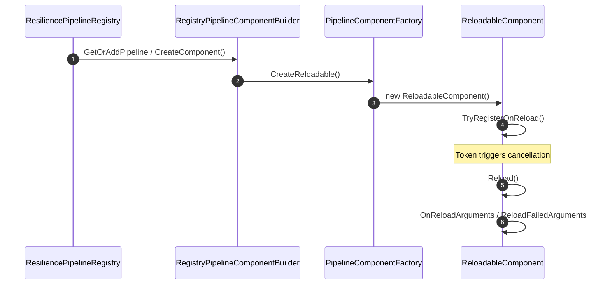
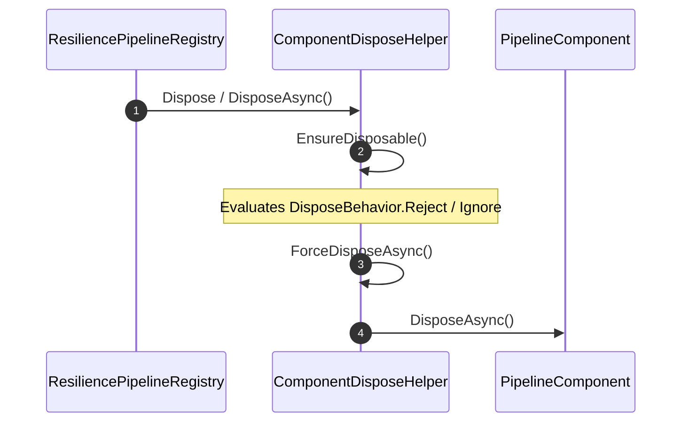

# Pipeline Registry

<details>
<summary>Relevant source files</summary>

The following files were used as context for generating this wiki page:

- [src/Polly.Core/Registry/ResiliencePipelineRegistry.cs](https://github.com/App-vNext/Polly/blob/main/src/Polly.Core/Registry/ResiliencePipelineRegistry.cs)
- [src/Snippets/Docs/ResiliencePipelineRegistry.cs](https://github.com/App-vNext/Polly/blob/main/src/Snippets/Docs/ResiliencePipelineRegistry.cs)
- [docs/pipelines/resilience-pipeline-registry.md](https://github.com/App-vNext/Polly/blob/main/docs/pipelines/resilience-pipeline-registry.md)
- [docs/advanced/dependency-injection.md](https://github.com/App-vNext/Polly/blob/main/docs/advanced/dependency-injection.md)
- [src/Snippets/Docs/DependencyInjection.cs](https://github.com/App-vNext/Polly/blob/main/src/Snippets/Docs/DependencyInjection.cs)
- [docs/pipelines/index.md](https://github.com/App-vNext/Polly/blob/main/docs/pipelines/index.md)
- [src/Polly.Core/Registry/ResiliencePipelineRegistry.TResult.cs](https://github.com/App-vNext/Polly/blob/main/src/Polly.Core/Registry/ResiliencePipelineRegistry.TResult.cs)
- [src/Snippets/Docs/Migration.Registry.cs](https://github.com/App-vNext/Polly/blob/main/src/Snippets/Docs/Migration.Registry.cs)
- [src/Polly.Core/Registry/RegistryPipelineComponentBuilder.cs](https://github.com/App-vNext/Polly/blob/main/src/Polly.Core/Registry/RegistryPipelineComponentBuilder.cs)
- [src/Polly.Core/ResiliencePipeline.cs](https://github.com/App-vNext/Polly/blob/main/src/Polly.Core/ResiliencePipeline.cs)
- [src/Polly.Core/Registry/ResiliencePipelineRegistryOptions.cs](https://github.com/App-vNext/Polly/blob/main/src/Polly.Core/Registry/ResiliencePipelineRegistryOptions.cs)
- [src/Polly.Extensions/DependencyInjection/ConfigureResiliencePipelineRegistryOptions.cs](https://github.com/App-vNext/Polly/blob/main/src/Polly.Extensions/DependencyInjection/ConfigureResiliencePipelineRegistryOptions.cs)
- [src/Polly.Core/Registry/ResiliencePipelineProvider.cs](https://github.com/App-vNext/Polly/blob/main/src/Polly.Core/Registry/ResiliencePipelineProvider.cs)
- [src/Polly.Core/Registry/ConfigureBuilderContext.cs](https://github.com/App-vNext/Polly/blob/main/src/Polly.Core/Registry/ConfigureBuilderContext.cs)
- [src/Polly.Core/Utils/Pipeline/ComponentDisposeHelper.cs](https://github.com/App-vNext/Polly/blob/main/src/Polly.Core/Utils/Pipeline/ComponentDisposeHelper.cs)
- [src/Polly.Core/Utils/Pipeline/PipelineComponentFactory.cs](https://github.com/App-vNext/Polly/blob/main/src/Polly.Core/Utils/Pipeline/PipelineComponentFactory.cs)
- [src/Polly.Core/Utils/Pipeline/ReloadableComponent.cs](https://github.com/App-vNext/Polly/blob/main/src/Polly.Core/Utils/Pipeline/ReloadableComponent.cs)
</details>

## Overview

### Overview

The `ResiliencePipelineRegistry<TKey>` provides a robust mechanism for creating, caching, and managing resilience pipelines keyed by type `TKey`. Designed to decouple pipeline configuration from runtime consumption, the registry allows applications to centralize pipeline definitions at startup while supporting thread-safe retrieval, dynamic reloading upon configuration changes, and automated lifecycle and resource disposal.

Sources: [src/Polly.Core/Registry/ResiliencePipelineRegistry.cs:6-17](https://github.com/App-vNext/Polly/blob/main/src/Polly.Core/Registry/ResiliencePipelineRegistry.cs#L6-L17), [docs/pipelines/resilience-pipeline-registry.md:3-11](https://github.com/App-vNext/Polly/blob/main/docs/pipelines/resilience-pipeline-registry.md#L3-L11)

## Registry Public API Surface

### Overview

The resilience pipeline registry exposes its core read operations through the abstract base class `ResiliencePipelineProvider<TKey>`. This provider abstraction decouples pipeline consumption from concrete registry storage implementations, providing both generic and non-generic lookup contracts. Consumers interact with pipelines using keys of type `TKey`, which must satisfy the `notnull` constraint.

Sources: [src/Polly.Core/Registry/ResiliencePipelineProvider.cs:5-11](https://github.com/App-vNext/Polly/blob/main/src/Polly.Core/Registry/ResiliencePipelineProvider.cs#L5-L11)

### Provider Abstraction and Lookup Methods

The `ResiliencePipelineProvider<TKey>` defines four primary lookup methods: two throwing variants (`GetPipeline`) and two boolean-returning variants (`TryGetPipeline`). When a requested pipeline cannot be located in the provider cache or registered builders, `GetPipeline` throws a `KeyNotFoundException` indicating that neither the pipeline nor its builder is registered.

Sources: [src/Polly.Core/Registry/ResiliencePipelineProvider.cs:18-62](https://github.com/App-vNext/Polly/blob/main/src/Polly.Core/Registry/ResiliencePipelineProvider.cs#L18-L62)

The concrete `ResiliencePipelineRegistry<TKey>` implementation inherits from `ResiliencePipelineProvider<TKey>` and manages separate internal dictionaries for non-generic pipelines alongside a lazily-initialized `ConcurrentDictionary<Type, object>` (`_genericRegistry`) holding type-specific generic registries (`GenericRegistry<TResult>`). Because generic and non-generic pipelines occupy separate lookup domains, identical keys can be utilized independently for non-generic and generic pipelines without collision.

Sources: [src/Polly.Core/Registry/ResiliencePipelineRegistry.cs:18-24](https://github.com/App-vNext/Polly/blob/main/src/Polly.Core/Registry/ResiliencePipelineRegistry.cs#L18-L24), [docs/pipelines/resilience-pipeline-registry.md:35-41](https://github.com/App-vNext/Polly/blob/main/docs/pipelines/resilience-pipeline-registry.md#L35-L41)

When `TryGetPipeline(TKey key, out ResiliencePipeline? pipeline)` is invoked, the registry first validates that it has not been disposed by calling `EnsureNotDisposed()`. It then inspects the `_pipelines` collection (`ConcurrentDictionary<TKey, ResiliencePipeline>`). If a cached pipeline is found, it returns `true`. If the pipeline is missing from the cache but a builder callback was registered via `TryAddBuilder`, the registry intercepts the lookup, invokes the builder to materialize the pipeline via `GetOrAddPipeline(key, configure)`, caches the result, and returns `true`. If neither cache nor builder exists, it assigns `null` to the pipeline parameter and returns `false`.

Sources: [src/Polly.Core/Registry/ResiliencePipelineRegistry.cs:64-89](https://github.com/App-vNext/Polly/blob/main/src/Polly.Core/Registry/ResiliencePipelineRegistry.cs#L64-L89)

```csharp
var registry = new ResiliencePipelineRegistry<string>();

// Try get a non-generic pipeline
if (registry.TryGetPipeline("my-pipeline", out ResiliencePipeline? pipeline))
{
    pipeline.Execute(() => { });
}

// Try get a generic pipeline handling HttpResponseMessage
if (registry.TryGetPipeline<HttpResponseMessage>("my-pipeline", out ResiliencePipeline<HttpResponseMessage>? genericPipeline))
{
    await genericPipeline.ExecuteAsync(async token => await httpClient.GetAsync(endpoint, token), cancellationToken);
}
```
Sources: [src/Polly.Core/Registry/ResiliencePipelineRegistry.cs:64-89](https://github.com/App-vNext/Polly/blob/main/src/Polly.Core/Registry/ResiliencePipelineRegistry.cs#L64-L89), [docs/pipelines/resilience-pipeline-registry.md:43-50](https://github.com/App-vNext/Polly/blob/main/docs/pipelines/resilience-pipeline-registry.md#L43-L50)

> [!NOTE]
> All lookup and mutation methods verify disposal state before execution; attempting to query or register pipelines on a disposed registry immediately throws an `ObjectDisposedException`.
Sources: [src/Polly.Core/Registry/ResiliencePipelineRegistry.cs:66-68](https://github.com/App-vNext/Polly/blob/main/src/Polly.Core/Registry/ResiliencePipelineRegistry.cs#L66-L68), [src/Polly.Core/Registry/ResiliencePipelineRegistry.cs:264-270](https://github.com/App-vNext/Polly/blob/main/src/Polly.Core/Registry/ResiliencePipelineRegistry.cs#L264-L270)

## Registry Configuration and Options

### Overview

Registry behavior and component construction are governed by the `ResiliencePipelineRegistryOptions<TKey>` class, which exposes configurable properties controlling builder factories, key comparers, and string formatters for telemetry. When integrating with Microsoft Dependency Injection, option actions are accumulated in `ConfigureResiliencePipelineRegistryOptions<TKey>` and executed during container setup.

Sources: [src/Polly.Core/Registry/ResiliencePipelineRegistryOptions.cs:9-19](https://github.com/App-vNext/Polly/blob/main/src/Polly.Core/Registry/ResiliencePipelineRegistryOptions.cs#L9-L19), [src/Polly.Extensions/DependencyInjection/ConfigureResiliencePipelineRegistryOptions.cs:5-9](https://github.com/App-vNext/Polly/blob/main/src/Polly.Extensions/DependencyInjection/ConfigureResiliencePipelineRegistryOptions.cs#L5-L9)

### Registry Options and Configuration Reference

The options class provides several properties decorated with `[Required]` validation attributes alongside optional delegates for telemetry formatting.

| Option Property | Type | Default Value | Purpose |
| :--- | :--- | :--- | :--- |
| `BuilderFactory` | `Func<ResiliencePipelineBuilder>` | `static () => new ResiliencePipelineBuilder()` | Factory method creating new resilience pipeline builder instances. |
| `PipelineComparer` | `IEqualityComparer<TKey>` | `EqualityComparer<TKey>.Default` | Comparer used by the registry to retrieve stored resilience pipelines. |
| `BuilderComparer` | `IEqualityComparer<TKey>` | `EqualityComparer<TKey>.Default` | Comparer used by the registry to retrieve resilience pipeline builders. |
| `InstanceNameFormatter` | `Func<TKey, string>?` | `null` | Formats `TKey` into an instance name string for telemetry reporting. |
| `BuilderNameFormatter` | `Func<TKey, string>` | `key => key?.ToString() ?? string.Empty` | Formats `TKey` into a builder name string for telemetry reporting. |

Sources: [src/Polly.Core/Registry/ResiliencePipelineRegistryOptions.cs:17-63](https://github.com/App-vNext/Polly/blob/main/src/Polly.Core/Registry/ResiliencePipelineRegistryOptions.cs#L17-L63)

### Custom Key Comparers and Formatters

When dealing with complex composite keys—such as a record struct containing both a pipeline identifier and an instance qualifier—default equality checks are insufficient. Assigning a custom `IEqualityComparer<TKey>` to `BuilderComparer` or `PipelineComparer` ensures that lookups match on specific sub-properties like `PipelineName` while ignoring instance-level variants during builder resolution.

Sources: [docs/advanced/dependency-injection.md:287-323](https://github.com/App-vNext/Polly/blob/main/docs/advanced/dependency-injection.md#L287-L323), [src/Snippets/Docs/DependencyInjection.cs:224-247](https://github.com/App-vNext/Polly/blob/main/src/Snippets/Docs/DependencyInjection.cs#L224-L247)

```csharp
public sealed class PipelineNameComparer : IEqualityComparer<MyPipelineKey>
{
    public bool Equals(MyPipelineKey x, MyPipelineKey y) => x.PipelineName == y.PipelineName;

    public int GetHashCode(MyPipelineKey obj) => obj.PipelineName.GetHashCode(StringComparison.Ordinal);
}

services.AddResiliencePipelineRegistry<MyPipelineKey>(options =>
{
    options.BuilderComparer = new PipelineNameComparer();
    options.InstanceNameFormatter = key => key.InstanceName;
    options.BuilderNameFormatter = key => key.PipelineName;
});
```
Sources: [docs/advanced/dependency-injection.md:287-313](https://github.com/App-vNext/Polly/blob/main/docs/advanced/dependency-injection.md#L287-L313), [src/Snippets/Docs/DependencyInjection.cs:224-247](https://github.com/App-vNext/Polly/blob/main/src/Snippets/Docs/DependencyInjection.cs#L224-L247)

> [!NOTE]
> The `ConfigureBuilderContext<TKey>` instance initializes with the strategy key, builder name, and builder instance name, maintaining internal collections (`ReloadTokens` and `DisposeCallbacks`) that coordinate dynamic reloading and resource cleanup.
Sources: [src/Polly.Core/Registry/ConfigureBuilderContext.cs:10-35](https://github.com/App-vNext/Polly/blob/main/src/Polly.Core/Registry/ConfigureBuilderContext.cs#L10-L35)

## Pipeline Component Building Flow

### Overview

The construction and assembly of pipeline components inside the registry are managed by `RegistryPipelineComponentBuilder<TBuilder, TKey>` in conjunction with `PipelineComponentFactory`. This builder orchestrates the instantiation of resilience pipeline builders, executes configuration callbacks, sets up telemetry sources, and decorates components with execution tracking and disposable callbacks.

Sources: [src/Polly.Core/Registry/RegistryPipelineComponentBuilder.cs:6-62](https://github.com/App-vNext/Polly/blob/main/src/Polly.Core/Registry/RegistryPipelineComponentBuilder.cs#L6-L62), [src/Polly.Core/Utils/Pipeline/PipelineComponentFactory.cs:5-28](https://github.com/App-vNext/Polly/blob/main/src/Polly.Core/Utils/Pipeline/PipelineComponentFactory.cs#L5-L28)

### Component Building Flow Walkthrough

The creation flow executes through a series of internal method calls when a component is requested or reloaded:

`CreateComponent()` → `CreateBuilder()` → `_activator()` → `_configure(builder, context)` → `builder.BuildPipelineComponent()` → `PipelineComponentFactory.WithDisposableCallbacks()` → `PipelineComponentFactory.WithExecutionTracking()`

1. `CreateComponent()` checks whether `reloadTokens` were registered during configuration. If none exist, it directly returns the component and context pool.
Sources: [src/Polly.Core/Registry/RegistryPipelineComponentBuilder.cs:24-31](https://github.com/App-vNext/Polly/blob/main/src/Polly.Core/Registry/RegistryPipelineComponentBuilder.cs#L24-L31)
2. If reload tokens are present, `PipelineComponentFactory.CreateReloadable()` wraps the component in a `ReloadableComponent` that re-invokes the builder when tokens trigger.
Sources: [src/Polly.Core/Registry/RegistryPipelineComponentBuilder.cs:33-39](https://github.com/App-vNext/Polly/blob/main/src/Polly.Core/Registry/RegistryPipelineComponentBuilder.cs#L33-L39), [src/Polly.Core/Utils/Pipeline/PipelineComponentFactory.cs:25-27](https://github.com/App-vNext/Polly/blob/main/src/Polly.Core/Utils/Pipeline/PipelineComponentFactory.cs#L25-L27)
3. `CreateBuilder()` initializes a `ConfigureBuilderContext<TKey>`, invokes the `_activator()` delegate to create the builder instance, and assigns `builder.Name` and `builder.InstanceName`.
Sources: [src/Polly.Core/Registry/RegistryPipelineComponentBuilder.cs:44-49](https://github.com/App-vNext/Polly/blob/main/src/Polly.Core/Registry/RegistryPipelineComponentBuilder.cs#L44-L49)
4. The `_configure` action runs against the builder and context, populating reload tokens and dispose callbacks.
Sources: [src/Polly.Core/Registry/RegistryPipelineComponentBuilder.cs:50-50](https://github.com/App-vNext/Polly/blob/main/src/Polly.Core/Registry/RegistryPipelineComponentBuilder.cs#L50-L50)
5. Telemetry is constructed via `ResilienceStrategyTelemetry` using the builder's telemetry listener and source metadata.
Sources: [src/Polly.Core/Registry/RegistryPipelineComponentBuilder.cs:52-56](https://github.com/App-vNext/Polly/blob/main/src/Polly.Core/Registry/RegistryPipelineComponentBuilder.cs#L52-L56)
6. `PipelineComponentFactory.WithDisposableCallbacks()` attaches any registered cleanup actions, and `PipelineComponentFactory.WithExecutionTracking()` wraps the component with execution telemetry tied to the builder's `TimeProvider`.
Sources: [src/Polly.Core/Registry/RegistryPipelineComponentBuilder.cs:57-58](https://github.com/App-vNext/Polly/blob/main/src/Polly.Core/Registry/RegistryPipelineComponentBuilder.cs#L57-L58)

### Pipeline Component Factory Methods

The `PipelineComponentFactory` static class provides centralized creation methods for wrapping external pipelines, strategies, disposable callbacks, execution tracking, composites, and reloadable entries.

| Method | Parameters | Return Type | Purpose |
| :--- | :--- | :--- | :--- |
| `FromPipeline` | `ResiliencePipeline pipeline` | `PipelineComponent` | Wraps a non-generic resilience pipeline into an external component. |
| `FromPipeline<T>` | `ResiliencePipeline<T> pipeline` | `PipelineComponent` | Wraps a generic resilience pipeline into an external component. |
| `FromStrategy` | `ResilienceStrategy strategy` | `PipelineComponent` | Wraps a non-generic resilience strategy into a bridge component. |
| `FromStrategy<T>` | `ResilienceStrategy<T> strategy` | `PipelineComponent` | Wraps a generic resilience strategy into a generic bridge component. |
| `WithDisposableCallbacks` | `PipelineComponent component, List<Action> callbacks` | `PipelineComponent` | Attaches disposable callbacks if the callback list is non-empty. |
| `WithExecutionTracking` | `PipelineComponent component, TimeProvider timeProvider` | `PipelineComponent` | Adds execution tracking telemetry using the specified time provider. |
| `CreateComposite` | `IReadOnlyListipelineComponent> components, ResilienceStrategyTelemetry telemetry, TimeProvider timeProvider` | `PipelineComponent` | Creates a composite component execution chain. |
| `CreateReloadable` | `ReloadableComponent.Entry initial, Func<ReloadableComponent.Entry> factory` | `PipelineComponent` | Creates a dynamic reloadable component wrapper. |

Sources: [src/Polly.Core/Utils/Pipeline/PipelineComponentFactory.cs:5-28](https://github.com/App-vNext/Polly/blob/main/src/Polly.Core/Utils/Pipeline/PipelineComponentFactory.cs#L5-L28)

> [!NOTE]
> If `reloadTokens.Count` is zero, `CreateComponent()` bypasses `ReloadableComponent` allocation entirely, returning the raw component and context pool directly to optimize performance for static pipelines.
Sources: [src/Polly.Core/Registry/RegistryPipelineComponentBuilder.cs:28-31](https://github.com/App-vNext/Polly/blob/main/src/Polly.Core/Registry/RegistryPipelineComponentBuilder.cs#L28-L31)

## Dynamic Reloading and Cache Management

### Overview

Dynamic reloading allows resilience pipelines to adapt to configuration updates at runtime without restarting the application or invalidating external references. When configuring a pipeline via `ConfigureBuilderContext<TKey>`, developers can register one or more `CancellationToken` instances using the `AddReloadToken` method. If any registered token is canceled, the `ReloadableComponent` automatically tears down the outdated pipeline component, executes a fresh builder factory callback to generate a replacement, and re-registers the reload listeners.

Sources: [src/Snippets/Docs/ResiliencePipelineRegistry.cs:109-111](https://github.com/App-vNext/Polly/blob/main/src/Snippets/Docs/ResiliencePipelineRegistry.cs#L109-L111), [src/Polly.Core/Registry/ConfigureBuilderContext.cs:43-51](https://github.com/App-vNext/Polly/blob/main/src/Polly.Core/Registry/ConfigureBuilderContext.cs#L43-L51), [src/Polly.Core/Utils/Pipeline/ReloadableComponent.cs:42-81](https://github.com/App-vNext/Polly/blob/main/src/Polly.Core/Utils/Pipeline/ReloadableComponent.cs#L42-L81)

### Pipeline Reloading Call-Chain Execution Walkthrough

When a registered change token triggers a reload, execution flows through the reloadable component lifecycle and telemetry reporting steps: `GetOrAddPipeline()` → `CreateComponent()` → `CreateReloadable()` → `ReloadableComponent()` → `TryRegisterOnReload()` → `Reload()` → `OnReloadArguments()`.

1. `GetOrAddPipeline` initiates pipeline resolution or creation within `ResiliencePipelineRegistry`.
Sources: [src/Polly.Core/Registry/ResiliencePipelineRegistry.cs:161-168](https://github.com/App-vNext/Polly/blob/main/src/Polly.Core/Registry/ResiliencePipelineRegistry.cs#L161-L168)
2. `CreateComponent` instantiates the builder and wraps it in a `ReloadableComponent` if reload tokens are present.
Sources: [src/Polly.Core/Registry/RegistryPipelineComponentBuilder.cs:23-41](https://github.com/App-vNext/Polly/blob/main/src/Polly.Core/Registry/RegistryPipelineComponentBuilder.cs#L23-L41)
3. `CreateReloadable` constructs the `ReloadableComponent` passing the initial entry and factory delegate.
Sources: [src/Polly.Core/Utils/Pipeline/PipelineComponentFactory.cs:24-26](https://github.com/App-vNext/Polly/blob/main/src/Polly.Core/Utils/Pipeline/PipelineComponentFactory.cs#L24-L26)
4. `ReloadableComponent` constructor invokes `TryRegisterOnReload` to bind cancellation callbacks.
Sources: [src/Polly.Core/Utils/Pipeline/ReloadableComponent.cs:18-26](https://github.com/App-vNext/Polly/blob/main/src/Polly.Core/Utils/Pipeline/ReloadableComponent.cs#L18-L26)
5. `TryRegisterOnReload` creates a linked token source across all provided reload tokens and registers an asynchronous trigger calling `Reload()`.
Sources: [src/Polly.Core/Utils/Pipeline/ReloadableComponent.cs:41-54](https://github.com/App-vNext/Polly/blob/main/src/Polly.Core/Utils/Pipeline/ReloadableComponent.cs#L41-L54)
6. `Reload` disposes of the old token source, reports an informational telemetry event (`OnReload`), and invokes the factory to build a new component entry.
Sources: [src/Polly.Core/Utils/Pipeline/ReloadableComponent.cs:56-80](https://github.com/App-vNext/Polly/blob/main/src/Polly.Core/Utils/Pipeline/ReloadableComponent.cs#L56-L80)
7. `OnReloadArguments` (or `ReloadFailedArguments` if an exception occurs during factory execution) carries telemetry arguments for the reload event.
Sources: [src/Polly.Core/Utils/Pipeline/ReloadableComponent.cs:95-101](https://github.com/App-vNext/Polly/blob/main/src/Polly.Core/Utils/Pipeline/ReloadableComponent.cs#L95-L101)



Sources: [src/Polly.Core/Registry/ResiliencePipelineRegistry.cs:161-168](https://github.com/App-vNext/Polly/blob/main/src/Polly.Core/Registry/ResiliencePipelineRegistry.cs#L161-L168), [src/Polly.Core/Registry/RegistryPipelineComponentBuilder.cs:23-41](https://github.com/App-vNext/Polly/blob/main/src/Polly.Core/Registry/RegistryPipelineComponentBuilder.cs#L23-L41), [src/Polly.Core/Utils/Pipeline/PipelineComponentFactory.cs:24-26](https://github.com/App-vNext/Polly/blob/main/src/Polly.Core/Utils/Pipeline/PipelineComponentFactory.cs#L24-L26), [src/Polly.Core/Utils/Pipeline/ReloadableComponent.cs:18-101](https://github.com/App-vNext/Polly/blob/main/src/Polly.Core/Utils/Pipeline/ReloadableComponent.cs#L18-L101)

### Reload Telemetry Constants and Arguments

The `ReloadableComponent` class defines specific event name constants and record arguments emitted via telemetry during reload cycles and component disposal operations.

| Constant / Record | Type | Meaning / Purpose |
| :--- | :--- | :--- |
| `ReloadFailedEvent` | `string` (`"ReloadFailed"`) | Telemetry event name reported when rebuilding a pipeline throws an exception. |
| `DisposeFailedEvent` | `string` (`"DisposeFailed"`) | Telemetry event name reported when disposing of a discarded pipeline component throws an exception. |
| `OnReloadEvent` | `string` (`"OnReload"`) | Telemetry event name reported when a pipeline reload cycle successfully initiates. |
| `ReloadFailedArguments` | Record | Wraps the `Exception` thrown during a failed pipeline reload attempt. |
| `DisposedFailedArguments` | Record | Wraps the `Exception` thrown when disposing of a discarded pipeline component fails. |
| `OnReloadArguments` | Record | Empty argument payload passed when reporting a successful reload initiation event. |

Sources: [src/Polly.Core/Utils/Pipeline/ReloadableComponent.cs:9-14](https://github.com/App-vNext/Polly/blob/main/src/Polly.Core/Utils/Pipeline/ReloadableComponent.cs#L9-L14), [src/Polly.Core/Utils/Pipeline/ReloadableComponent.cs:95-102](https://github.com/App-vNext/Polly/blob/main/src/Polly.Core/Utils/Pipeline/ReloadableComponent.cs#L95-L102)

> [!WARNING]
> If a reload factory callback throws an exception, `ReloadableComponent` catches the exception, reports a `ReloadFailedEvent` telemetry error with `ReloadFailedArguments`, and preserves the existing active pipeline component rather than crashing execution.
Sources: [src/Polly.Core/Utils/Pipeline/ReloadableComponent.cs:68-77](https://github.com/App-vNext/Polly/blob/main/src/Polly.Core/Utils/Pipeline/ReloadableComponent.cs#L68-L77)

> [!NOTE]
> When adding reload tokens via `ConfigureBuilderContext<TKey>.AddReloadToken`, tokens that are already canceled or cannot be canceled are automatically ignored.
Sources: [src/Polly.Core/Registry/ConfigureBuilderContext.cs:43-51](https://github.com/App-vNext/Polly/blob/main/src/Polly.Core/Registry/ConfigureBuilderContext.cs#L43-L51)

## Lifecycle and Resource Disposal

### Overview

Resource lifecycle management within `ResiliencePipelineRegistry<TKey>` relies on thread-safe disposal mechanisms coordinated between the registry, generic child registries, and individual component disposal helpers. When `ResiliencePipelineRegistry<TKey>` is disposed via `IDisposable.Dispose` or `IAsyncDisposable.DisposeAsync`, it prevents concurrent double-disposal by marking a thread-safe `_disposed` flag, iterates over all cached non-generic pipelines, invokes forced asynchronous cleanup, and disposes of all registered generic `GenericRegistry<TResult>` instances.
Sources: [src/Polly.Core/Registry/ResiliencePipelineRegistry.cs:229-247](https://github.com/App-vNext/Polly/blob/main/src/Polly.Core/Registry/ResiliencePipelineRegistry.cs#L229-L247)

### Disposal Call-Chain Walkthrough

The cleanup path enforces ownership and validation rules across component boundaries. The exact method invocation sequence flows through these steps: `Dispose()` → `DisposeAsync()` → `ForceDisposeAsync()` → `DisposeAsync()` (ComponentDisposeHelper) → `EnsureDisposable()`.

1. `Dispose` — Synchronously invokes `DisposeAsync().AsTask().GetAwaiter().GetResult()` on the registry instance.
   Sources: [src/Polly.Core/Registry/ResiliencePipelineRegistry.cs:218-219](https://github.com/App-vNext/Polly/blob/main/src/Polly.Core/Registry/ResiliencePipelineRegistry.cs#L218-L219)
2. `DisposeAsync` — Sets `_disposed = true`, iterates through `_pipelines`, and invokes `ForceDisposeAsync()` on each pipeline's `DisposeHelper`, before iterating over `_genericRegistry` to call `DisposeAsync()`.
   Sources: [src/Polly.Core/Registry/ResiliencePipelineRegistry.cs:228-247](https://github.com/App-vNext/Polly/blob/main/src/Polly.Core/Registry/ResiliencePipelineRegistry.cs#L228-L247)
3. `ForceDisposeAsync` — Sets `_disposed = true` on the `ComponentDisposeHelper` and invokes `_component.DisposeAsync()`.
   Sources: [src/Polly.Core/Utils/Pipeline/ComponentDisposeHelper.cs:34-39](https://github.com/App-vNext/Polly/blob/main/src/Polly.Core/Utils/Pipeline/ComponentDisposeHelper.cs#L34-L39)
4. `DisposeAsync` (on `ComponentDisposeHelper`) — Intercepts consumer disposal requests by evaluating `EnsureDisposable()`.
   Sources: [src/Polly.Core/Utils/Pipeline/ComponentDisposeHelper.cs:14-23](https://github.com/App-vNext/Polly/blob/main/src/Polly.Core/Utils/Pipeline/ComponentDisposeHelper.cs#L14-L23)
5. `EnsureDisposable` — Inspects the configured `DisposeBehavior`. If set to `DisposeBehavior.Reject`, it throws an `InvalidOperationException` prohibiting direct consumer disposal; if set to `DisposeBehavior.Ignore`, it returns `false`.
   Sources: [src/Polly.Core/Utils/Pipeline/ComponentDisposeHelper.cs:40-54](https://github.com/App-vNext/Polly/blob/main/src/Polly.Core/Utils/Pipeline/ComponentDisposeHelper.cs#L40-L54)



Sources: [src/Polly.Core/Registry/ResiliencePipelineRegistry.cs:218-247](https://github.com/App-vNext/Polly/blob/main/src/Polly.Core/Registry/ResiliencePipelineRegistry.cs#L218-L247), [src/Polly.Core/Utils/Pipeline/ComponentDisposeHelper.cs:14-39](https://github.com/App-vNext/Polly/blob/main/src/Polly.Core/Utils/Pipeline/ComponentDisposeHelper.cs#L14-L39)

### Component Disposal Validation Options

Pipelines instantiated by the registry are wrapped with specific disposal behaviors to protect registry-owned state.

| DisposeBehavior | Action on Consumer Disposal | Purpose |
| :--- | :--- | :--- |
| `DisposeBehavior.Reject` | Throws `InvalidOperationException` | Prevents external callers from disposing pipelines owned and managed by the registry. |
| `DisposeBehavior.Ignore` | Suppresses disposal | Ignores external disposal attempts silently. |

Sources: [src/Polly.Core/Registry/ResiliencePipelineRegistry.cs:134-134](https://github.com/App-vNext/Polly/blob/main/src/Polly.Core/Registry/ResiliencePipelineRegistry.cs#L134-L134), [src/Polly.Core/Registry/ResiliencePipelineRegistry.TResult.cs:64-64](https://github.com/App-vNext/Polly/blob/main/src/Polly.Core/Registry/ResiliencePipelineRegistry.TResult.cs#L64-L64), [src/Polly.Core/Utils/Pipeline/ComponentDisposeHelper.cs:41-54](https://github.com/App-vNext/Polly/blob/main/src/Polly.Core/Utils/Pipeline/ComponentDisposeHelper.cs#L41-L54)

> [!WARNING]
> Attempting to call `TryGetPipeline`, `GetOrAddPipeline`, or `TryAddBuilder` after the registry has been disposed immediately throws an `ObjectDisposedException` originating from `EnsureNotDisposed()`.
Sources: [src/Polly.Core/Registry/ResiliencePipelineRegistry.cs:66-66](https://github.com/App-vNext/Polly/blob/main/src/Polly.Core/Registry/ResiliencePipelineRegistry.cs#L66-L66), [src/Polly.Core/Registry/ResiliencePipelineRegistry.cs:264-270](https://github.com/App-vNext/Polly/blob/main/src/Polly.Core/Registry/ResiliencePipelineRegistry.cs#L264-L270)

> [!CAUTION]
> Direct disposal of a registry-managed `ResiliencePipeline` instance by an external consumer throws an `InvalidOperationException` because registry-created pipelines enforce `DisposeBehavior.Reject`.
Sources: [src/Polly.Core/Registry/ResiliencePipelineRegistry.cs:134-134](https://github.com/App-vNext/Polly/blob/main/src/Polly.Core/Registry/ResiliencePipelineRegistry.cs#L134-L134), [src/Polly.Core/Registry/ResiliencePipelineRegistry.TResult.cs:64-64](https://github.com/App-vNext/Polly/blob/main/src/Polly.Core/Registry/ResiliencePipelineRegistry.TResult.cs#L64-L64), [src/Polly.Core/Utils/Pipeline/ComponentDisposeHelper.cs:48-51](https://github.com/App-vNext/Polly/blob/main/src/Polly.Core/Utils/Pipeline/ComponentDisposeHelper.cs#L48-L51)

## Related

- [[Resilience Pipelines]]
- [[Dependency Injection Integration]]

