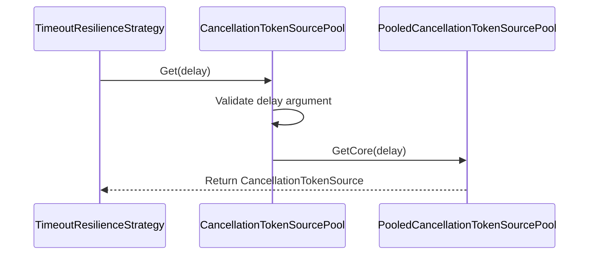
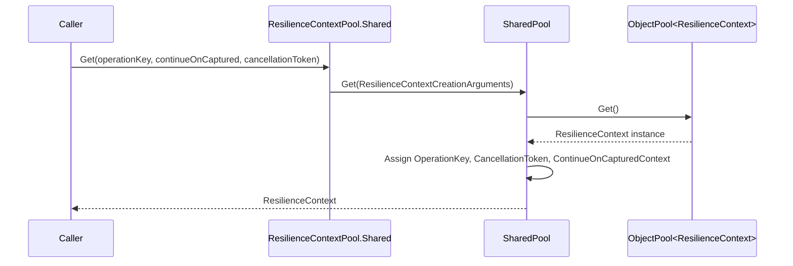
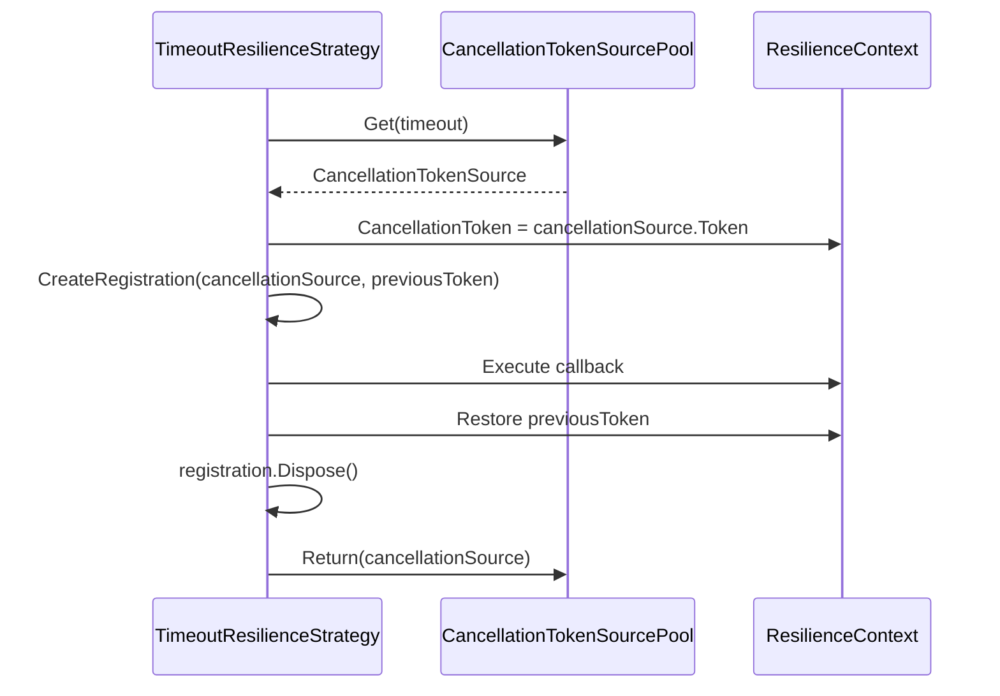

# Pooling and Utilities

Relevant source files

The following files were used as context for generating this wiki page:

- [src/Polly.Core/Hedging/Controller/TaskExecution.cs](https://github.com/App-vNext/Polly/blob/main/src/Polly.Core/Hedging/Controller/TaskExecution.cs)
- [README.md](https://github.com/App-vNext/Polly/blob/main/README.md)
- [src/Polly.Core/Timeout/TimeoutResilienceStrategy.cs](https://github.com/App-vNext/Polly/blob/main/src/Polly.Core/Timeout/TimeoutResilienceStrategy.cs)
- [src/Polly.Core/ResilienceContextPool.cs](https://github.com/App-vNext/Polly/blob/main/src/Polly.Core/ResilienceContextPool.cs)
- [src/Snippets/Docs/Performance.cs](https://github.com/App-vNext/Polly/blob/main/src/Snippets/Docs/Performance.cs)
- [src/Polly.Core/Hedging/Controller/HedgingController.cs](https://github.com/App-vNext/Polly/blob/main/src/Polly.Core/Hedging/Controller/HedgingController.cs)
- [src/Polly/Utilities/SystemClock.cs](https://github.com/App-vNext/Polly/blob/main/src/Polly/Utilities/SystemClock.cs)
- [src/Polly.Core/Utils/CancellationTokenSourcePool.Pooled.cs](https://github.com/App-vNext/Polly/blob/main/src/Polly.Core/Utils/CancellationTokenSourcePool.Pooled.cs)
- [src/Polly.Core/Utils/CancellationTokenSourcePool.Disposable.cs](https://github.com/App-vNext/Polly/blob/main/src/Polly.Core/Utils/CancellationTokenSourcePool.Disposable.cs)
- [src/Polly.Core/Utils/CancellationTokenSourcePool.cs](https://github.com/App-vNext/Polly/blob/main/src/Polly.Core/Utils/CancellationTokenSourcePool.cs)
- [src/Polly/Policy.ExecuteOverloads.cs](https://github.com/App-vNext/Polly/blob/main/src/Polly/Policy.ExecuteOverloads.cs)
- [src/Polly.Core/ResiliencePipelineBuilderBase.cs](https://github.com/App-vNext/Polly/blob/main/src/Polly.Core/ResiliencePipelineBuilderBase.cs)
- [src/Polly.Core/Utils/Pipeline/ReloadableComponent.cs](https://github.com/App-vNext/Polly/blob/main/src/Polly.Core/Utils/Pipeline/ReloadableComponent.cs)
- [src/Polly.Core/ResilienceContextPool.Shared.cs](https://github.com/App-vNext/Polly/blob/main/src/Polly.Core/ResilienceContextPool.Shared.cs)
- [src/Polly/Utilities/Wrappers/ResilienceContextFactory.cs](https://github.com/App-vNext/Polly/blob/main/src/Polly/Utilities/Wrappers/ResilienceContextFactory.cs)
- [src/Polly.Core/Utils/Pipeline/ExecutionTrackingComponent.cs](https://github.com/App-vNext/Polly/blob/main/src/Polly.Core/Utils/Pipeline/ExecutionTrackingComponent.cs)
- [docs/general.md](https://github.com/App-vNext/Polly/blob/main/docs/general.md)
- [src/Polly/Utilities/TimedLock.cs](https://github.com/App-vNext/Polly/blob/main/src/Polly/Utilities/TimedLock.cs)
- [docs/advanced/resilience-context.md](https://github.com/App-vNext/Polly/blob/main/docs/advanced/resilience-context.md)
- [src/Polly.Core/ResilienceContextCreationArguments.cs](https://github.com/App-vNext/Polly/blob/main/src/Polly.Core/ResilienceContextCreationArguments.cs)
- [src/Polly.Core/Utils/ObjectPool.cs](https://github.com/App-vNext/Polly/blob/main/src/Polly.Core/Utils/ObjectPool.cs)
- [AGENTS.md](https://github.com/App-vNext/Polly/blob/main/AGENTS.md)
- [src/Polly/Timeout/TimeoutPolicy.cs](https://github.com/App-vNext/Polly/blob/main/src/Polly/Timeout/TimeoutPolicy.cs)
- [src/Polly.Core/Utils/TimeProviderExtensions.cs](https://github.com/App-vNext/Polly/blob/main/src/Polly.Core/Utils/TimeProviderExtensions.cs)
- [docs/strategies/timeout.md](https://github.com/App-vNext/Polly/blob/main/docs/strategies/timeout.md)
- [src/Polly.Core/ResilienceContext.cs](https://github.com/App-vNext/Polly/blob/main/src/Polly.Core/ResilienceContext.cs)
- [src/Snippets/Docs/General.cs](https://github.com/App-vNext/Polly/blob/main/src/Snippets/Docs/General.cs)
- [src/Polly.Core/README.md](https://github.com/App-vNext/Polly/blob/main/src/Polly.Core/README.md)
- [src/Polly.Core/Utils/OutcomeUtilities.cs](https://github.com/App-vNext/Polly/blob/main/src/Polly.Core/Utils/OutcomeUtilities.cs)
- [docs/advanced/performance.md](https://github.com/App-vNext/Polly/blob/main/docs/advanced/performance.md)

## Overview

Polly incorporates robust pooling mechanisms and utility abstractions to minimize heap allocations and optimize performance across high-throughput resilience pipelines. By managing execution-scoped objects, cancellation token sources, and synchronization primitives internally, the framework eliminates recurring garbage collection overhead during frequent pipeline evaluations.

Sources: [src/Polly.Core/ResilienceContextPool.cs#L6-L83](https://github.com/App-vNext/Polly/blob/main/src/Polly.Core/ResilienceContextPool.cs#L6-L83), [src/Polly.Core/Utils/CancellationTokenSourcePool.cs#L5-L43](https://github.com/App-vNext/Polly/blob/main/src/Polly.Core/Utils/CancellationTokenSourcePool.cs#L5-L43), [docs/advanced/performance.md#L1-L23](https://github.com/App-vNext/Polly/blob/main/docs/advanced/performance.md#L1-L23)

These utilities support zero-allocation context reuse via `ResilienceContextPool`, zero-allocation token management across modern and legacy runtimes through `CancellationTokenSourcePool`, and safe concurrency or time-provider abstractions. Core resilience strategies such as timeout and hedging interact directly with these components to rent, track, and return resources efficiently.

Sources: [src/Polly.Core/Hedging/Controller/TaskExecution.cs#L21-L188](https://github.com/App-vNext/Polly/blob/main/src/Polly.Core/Hedging/Controller/TaskExecution.cs#L21-L188), [src/Polly.Core/Timeout/TimeoutResilienceStrategy.cs#L6-L104](https://github.com/App-vNext/Polly/blob/main/src/Polly.Core/Timeout/TimeoutResilienceStrategy.cs#L6-L104), [src/Polly.Core/Utils/CancellationTokenSourcePool.Pooled.cs#L5-L46](https://github.com/App-vNext/Polly/blob/main/src/Polly.Core/Utils/CancellationTokenSourcePool.Pooled.cs#L5-L46)

## CancellationTokenSource Pooling Infrastructure

### CancellationTokenSource Pooling Infrastructure

The `CancellationTokenSourcePool` abstract class provides zero-allocation cancellation token management across different target frameworks. By abstracting creation, reuse, and disposal logic, it prevents frequent heap allocations during timeout evaluations in resilience strategies like `TimeoutResilienceStrategy`.

Sources: [src/Polly.Core/Utils/CancellationTokenSourcePool.cs#L5-L43](https://github.com/App-vNext/Polly/blob/main/src/Polly.Core/Utils/CancellationTokenSourcePool.cs#L5-L43), [src/Polly.Core/Timeout/TimeoutResilienceStrategy.cs#L6-L18](https://github.com/App-vNext/Polly/blob/main/src/Polly.Core/Timeout/TimeoutResilienceStrategy.cs#L6-L18)

### Architecture and Concrete Variants

The factory method `CancellationTokenSourcePool.Create(TimeProvider timeProvider)` inspects the runtime environment and the provided `TimeProvider` instance to instantiate the optimal internal pooling strategy.

Sources: [src/Polly.Core/Utils/CancellationTokenSourcePool.cs#L7-L26](https://github.com/App-vNext/Polly/blob/main/src/Polly.Core/Utils/CancellationTokenSourcePool.cs#L7-L26)

| Implementation Class | Target Framework Condition | Key Characteristic / Behavior |
| :--- | :--- | :--- |
| `PooledCancellationTokenSourcePool` | `#if NET6_0_OR_GREATER` | Utilizes an internal `ObjectPool<CancellationTokenSource>` to recycle instances via `TryReset()`. |
| `DisposableCancellationTokenSourcePool` | `#if !NET8_0_OR_GREATER` (or non-system providers on .NET 6+) | Instantiates new instances or creates time-provider-bound cancellation sources without object pooling. |

Sources: [src/Polly.Core/Utils/CancellationTokenSourcePool.Pooled.cs#L5-L46](https://github.com/App-vNext/Polly/blob/main/src/Polly.Core/Utils/CancellationTokenSourcePool.Pooled.cs#L5-L46), [src/Polly.Core/Utils/CancellationTokenSourcePool.Disposable.cs#L5-L25](https://github.com/App-vNext/Polly/blob/main/src/Polly.Core/Utils/CancellationTokenSourcePool.Disposable.cs#L5-L25), [src/Polly.Core/Utils/CancellationTokenSourcePool.cs#L7-L26](https://github.com/App-vNext/Polly/blob/main/src/Polly.Core/Utils/CancellationTokenSourcePool.cs#L7-L26)

### Call-Chain Execution Walkthrough (`ExecuteCore → Get → GetCore`)

When a strategy requires a cancellation token source, execution flows through validation and core retrieval steps, executing the explicit call chain `ExecuteCore` → `Get` → `GetCore`.

1. `TimeoutResilienceStrategy.ExecuteCore` invokes `_cancellationTokenSourcePool.Get(timeout)`.
Sources: [src/Polly.Core/Timeout/TimeoutResilienceStrategy.cs#L44-L44](https://github.com/App-vNext/Polly/blob/main/src/Polly.Core/Timeout/TimeoutResilienceStrategy.cs#L44-L44)
2. `CancellationTokenSourcePool.Get` validates the delay parameter, throwing an `ArgumentOutOfRangeException` if the delay is less than or equal to `TimeSpan.Zero` while not equal to `Timeout.InfiniteTimeSpan`.
Sources: [src/Polly.Core/Utils/CancellationTokenSourcePool.cs#L28-L36](https://github.com/App-vNext/Polly/blob/main/src/Polly.Core/Utils/CancellationTokenSourcePool.cs#L28-L36)
3. `CancellationTokenSourcePool.Get` delegates execution to `GetCore(delay)`, which is implemented by concrete subclasses to either fetch a pooled instance or instantiate a new one.
Sources: [src/Polly.Core/Utils/CancellationTokenSourcePool.cs#L37-L38](https://github.com/App-vNext/Polly/blob/main/src/Polly.Core/Utils/CancellationTokenSourcePool.cs#L37-L38), [src/Polly.Core/Utils/CancellationTokenSourcePool.Pooled.cs#L23-L33](https://github.com/App-vNext/Polly/blob/main/src/Polly.Core/Utils/CancellationTokenSourcePool.Pooled.cs#L23-L33), [src/Polly.Core/Utils/CancellationTokenSourcePool.Disposable.cs#L12-L20](https://github.com/App-vNext/Polly/blob/main/src/Polly.Core/Utils/CancellationTokenSourcePool.Disposable.cs#L12-L20)

Sources: [src/Polly.Core/Timeout/TimeoutResilienceStrategy.cs#L44-L44](https://github.com/App-vNext/Polly/blob/main/src/Polly.Core/Timeout/TimeoutResilienceStrategy.cs#L44-L44), [src/Polly.Core/Utils/CancellationTokenSourcePool.cs#L28-L38](https://github.com/App-vNext/Polly/blob/main/src/Polly.Core/Utils/CancellationTokenSourcePool.cs#L28-L38), [src/Polly.Core/Utils/CancellationTokenSourcePool.Pooled.cs#L23-L33](https://github.com/App-vNext/Polly/blob/main/src/Polly.Core/Utils/CancellationTokenSourcePool.Pooled.cs#L23-L33)

> [!WARNING]
> If a pooled cancellation source fails to reset via `source.TryReset()`, it bypasses the pool return queue and calls `source.Dispose()` directly to prevent state corruption.
Sources: [src/Polly.Core/Utils/CancellationTokenSourcePool.Pooled.cs#L35-L45](https://github.com/App-vNext/Polly/blob/main/src/Polly.Core/Utils/CancellationTokenSourcePool.Pooled.cs#L35-L45)

## ResilienceContext Lifecycle and Pooling

### ResilienceContext Lifecycle and Pooling

Allocation-free context reuse is managed by `ResilienceContextPool`, featuring a shared implementation `SharedPool` that wraps an internal `ObjectPool<ResilienceContext>` initialized with a factory `static () => new ResilienceContext()` and a reset handler `static c => c.Reset()`.
Sources: [src/Polly.Core/ResilienceContextPool.cs#L9-L15](https://github.com/App-vNext/Polly/blob/main/src/Polly.Core/ResilienceContextPool.cs#L9-L15), [src/Polly.Core/ResilienceContextPool.Shared.cs#L7-L10](https://github.com/App-vNext/Polly/blob/main/src/Polly.Core/ResilienceContextPool.Shared.cs#L7-L10)

### Call-Chain Execution Walkthrough

Retrieving and configuring a context flows from overloaded retrieval methods down through creation arguments and object pool acquisition.

1. Calling `ResilienceContextPool.Shared.Get(operationKey, continueOnCapturedContext, cancellationToken)` constructs a `ResilienceContextCreationArguments` struct holding those values.
Sources: [src/Polly.Core/ResilienceContextPool.cs#L50-L52](https://github.com/App-vNext/Polly/blob/main/src/Polly.Core/ResilienceContextPool.cs#L50-L52)
2. The call is dispatched to `SharedPool.Get(ResilienceContextCreationArguments arguments)`.
Sources: [src/Polly.Core/ResilienceContextPool.Shared.cs#L11-L13](https://github.com/App-vNext/Polly/blob/main/src/Polly.Core/ResilienceContextPool.Shared.cs#L11-L13)
3. `SharedPool` calls `_pool.Get()` to fetch a recycled `ResilienceContext` instance.
Sources: [src/Polly.Core/ResilienceContextPool.Shared.cs#L13-L14](https://github.com/App-vNext/Polly/blob/main/src/Polly.Core/ResilienceContextPool.Shared.cs#L13-L14)
4. The retrieved context properties are assigned: `context.OperationKey` receives `arguments.OperationKey`, `context.CancellationToken` receives `arguments.CancellationToken`, and `context.ContinueOnCapturedContext` receives `arguments.ContinueOnCapturedContext ?? ContinueOnCapturedContextDefault` (where `ContinueOnCapturedContextDefault` is `false`).
Sources: [src/Polly.Core/ResilienceContextPool.Shared.cs#L5-L6](https://github.com/App-vNext/Polly/blob/main/src/Polly.Core/ResilienceContextPool.Shared.cs#L5-L6), [src/Polly.Core/ResilienceContextPool.Shared.cs#L15-L18](https://github.com/App-vNext/Polly/blob/main/src/Polly.Core/ResilienceContextPool.Shared.cs#L15-L18)
5. The configured `ResilienceContext` is returned to the caller.
Sources: [src/Polly.Core/ResilienceContextPool.Shared.cs#L19-L21](https://github.com/App-vNext/Polly/blob/main/src/Polly.Core/ResilienceContextPool.Shared.cs#L19-L21)

Sources: [src/Polly.Core/ResilienceContextPool.cs#L50-L52](https://github.com/App-vNext/Polly/blob/main/src/Polly.Core/ResilienceContextPool.cs#L50-L52), [src/Polly.Core/ResilienceContextPool.Shared.cs#L7-L21](https://github.com/App-vNext/Polly/blob/main/src/Polly.Core/ResilienceContextPool.Shared.cs#L7-L21)

### Context Resetting and Cleanup

When a resilience execution finishes, `ResilienceContext.Reset()` clears its internal state so it can be safely pooled again. The reset routine sets `OperationKey = null`, `IsSynchronous = false`, `ResultType = typeof(UnknownResult)`, `ContinueOnCapturedContext = false`, `CancellationToken = default`, and clears `Properties.Options`.
Sources: [src/Polly.Core/ResilienceContext.cs#L91-L101](https://github.com/App-vNext/Polly/blob/main/src/Polly.Core/ResilienceContext.cs#L91-L101)

> [!WARNING]
> Never reuse an instance of `ResilienceContext` across more than one execution without returning it to the pool. Always invoke `ResilienceContextPool.Shared.Return(context)` after execution finishes.
Sources: [src/Polly.Core/ResilienceContext.cs#L6-L13](https://github.com/App-vNext/Polly/blob/main/src/Polly.Core/ResilienceContext.cs#L6-L13)

### V7 Compatibility Wrapper

For V7 migration scenarios, `ResilienceContextFactory` bridges Polly v7 `Context` objects with v8 resilience contexts by calling `ResilienceContextPool.Shared.Get(context.OperationKey, continueOnCapturedContext, cancellationToken)` and populating properties via `resilienceContext.Properties.SetProperties(context, out oldProperties)`. During cleanup, `ResilienceContextFactory.Cleanup` restores old properties and calls `ResilienceContextPool.Shared.Return(resilienceContext)`.
Sources: [src/Polly/Utilities/Wrappers/ResilienceContextFactory.cs#L5-L22](https://github.com/App-vNext/Polly/blob/main/src/Polly/Utilities/Wrappers/ResilienceContextFactory.cs#L5-L22)

## Strategy Integration and Token Lifecycle

### Overview

The `TimeoutResilienceStrategy` and `HedgingController` integrate with `CancellationTokenSourcePool` to manage cancellation token sources without incurring per-execution allocations. Both strategies rent token sources at the start of an execution or attempt, attach them to the active `ResilienceContext`, and guarantee proper cleanup or pooling return upon completion.
Sources: [src/Polly.Core/Timeout/TimeoutResilienceStrategy.cs#L44-L46](https://github.com/App-vNext/Polly/blob/main/src/Polly.Core/Timeout/TimeoutResilienceStrategy.cs#L44-L46), [src/Polly.Core/Hedging/Controller/TaskExecution.cs#L97-L101](https://github.com/App-vNext/Polly/blob/main/src/Polly.Core/Hedging/Controller/TaskExecution.cs#L97-L101), [src/Polly.Core/Hedging/Controller/HedgingController.cs#L19-L21](https://github.com/App-vNext/Polly/blob/main/src/Polly.Core/Hedging/Controller/HedgingController.cs#L19-L21)

### Timeout Strategy Token Lifecycle

`TimeoutResilienceStrategy` evaluates the configured timeout via `DefaultTimeout` or `TimeoutGenerator`. If the timeout should apply, it rents a source from the strategy's pool, swaps the context token, and registers a callback against the caller's previous token.
Sources: [src/Polly.Core/Timeout/TimeoutResilienceStrategy.cs#L31-L48](https://github.com/App-vNext/Polly/blob/main/src/Polly.Core/Timeout/TimeoutResilienceStrategy.cs#L31-L48)

Sources: [src/Polly.Core/Timeout/TimeoutResilienceStrategy.cs#L44-L72](https://github.com/App-vNext/Polly/blob/main/src/Polly.Core/Timeout/TimeoutResilienceStrategy.cs#L44-L72)

The timeout execution follows a strict initialization and teardown sequence:
1. `CancellationTokenSourcePool.Get(timeout)` rents a source configured for the specified timeout duration.
Sources: [src/Polly.Core/Timeout/TimeoutResilienceStrategy.cs#L44-L45](https://github.com/App-vNext/Polly/blob/main/src/Polly.Core/Timeout/TimeoutResilienceStrategy.cs#L44-L45)
2. `context.CancellationToken` is reassigned to `cancellationSource.Token`.
Sources: [src/Polly.Core/Timeout/TimeoutResilienceStrategy.cs#L45-L46](https://github.com/App-vNext/Polly/blob/main/src/Polly.Core/Timeout/TimeoutResilienceStrategy.cs#L45-L46)
3. `CreateRegistration(cancellationSource, previousToken)` attaches an unsafe or safe registration (`previousToken.UnsafeRegister` on .NET, `previousToken.Register` otherwise) to propagate external caller cancellations into the timeout source.
Sources: [src/Polly.Core/Timeout/TimeoutResilienceStrategy.cs#L47-L48](https://github.com/App-vNext/Polly/blob/main/src/Polly.Core/Timeout/TimeoutResilienceStrategy.cs#L47-L48), [src/Polly.Core/Timeout/TimeoutResilienceStrategy.cs#L96-L104](https://github.com/App-vNext/Polly/blob/main/src/Polly.Core/Timeout/TimeoutResilienceStrategy.cs#L96-L104)
4. The user callback executes within a `try-catch` block that traps exceptions into an `Outcome<TResult>`.
Sources: [src/Polly.Core/Timeout/TimeoutResilienceStrategy.cs#L49-L60](https://github.com/App-vNext/Polly/blob/main/src/Polly.Core/Timeout/TimeoutResilienceStrategy.cs#L49-L60)
5. Teardown restores `context.CancellationToken` to `previousToken`, disposes of the registration, and returns `cancellationSource` to `_cancellationTokenSourcePool`.
Sources: [src/Polly.Core/Timeout/TimeoutResilienceStrategy.cs#L63-L72](https://github.com/App-vNext/Polly/blob/main/src/Polly.Core/Timeout/TimeoutResilienceStrategy.cs#L63-L72)

> [!WARNING]
> If a timeout fires and throws a `TimeoutRejectedException`, the strategy checks whether `cancellationSource.IsCancellationRequested` is true and `previousToken.IsCancellationRequested` is false before wrapping the exception; otherwise, standard outcomes or caller cancellations pass through.
Sources: [src/Polly.Core/Timeout/TimeoutResilienceStrategy.cs#L73-L75](https://github.com/App-vNext/Polly/blob/main/src/Polly.Core/Timeout/TimeoutResilienceStrategy.cs#L73-L75)

### Hedging Strategy and TaskExecution Token Management

`HedgingController` instantiates a `CancellationTokenSourcePool` bound to the provided `TimeProvider`. Each hedging attempt is wrapped in a `TaskExecution<T>` instance that rents its own cancellation token source.
Sources: [src/Polly.Core/Hedging/Controller/HedgingController.cs#L19-L26](https://github.com/App-vNext/Polly/blob/main/src/Polly.Core/Hedging/Controller/HedgingController.cs#L19-L26), [src/Polly.Core/Hedging/Controller/TaskExecution.cs#L23-L25](https://github.com/App-vNext/Polly/blob/main/src/Polly.Core/Hedging/Controller/TaskExecution.cs#L23-L25)

During `TaskExecution.InitializeAsync(...)`, the execution sets up its resources:
1. `_cancellationSource = _cancellationTokenSourcePool.Get(System.Threading.Timeout.InfiniteTimeSpan)` rents an infinite timeout source from the pool.
Sources: [src/Polly.Core/Hedging/Controller/TaskExecution.cs#L97-L98](https://github.com/App-vNext/Polly/blob/main/src/Polly.Core/Hedging/Controller/TaskExecution.cs#L97-L98)
2. `_activeContext.InitializeFrom(primaryContext, _cancellationSource!.Token)` links the cached context with the rented token.
Sources: [src/Polly.Core/Hedging/Controller/TaskExecution.cs#L99-L101](https://github.com/App-vNext/Polly/blob/main/src/Polly.Core/Hedging/Controller/TaskExecution.cs#L99-L101)
3. A cancellation registration is created against `primaryContext.CancellationToken` to trigger `_cancellationSource.Cancel()` when the parent context aborts.
Sources: [src/Polly.Core/Hedging/Controller/TaskExecution.cs#L102-L107](https://github.com/App-vNext/Polly/blob/main/src/Polly.Core/Hedging/Controller/TaskExecution.cs#L102-L107)

When a `TaskExecution` is reset via `ResetAsync()`, the disposition of the cancellation source depends entirely on whether the attempt's outcome was accepted:
- If `IsAccepted` is `false`, the execution was cancelled or discarded; `_cancellationSource!.Dispose()` is called directly instead of returning it to the pool.
Sources: [src/Polly.Core/Hedging/Controller/TaskExecution.cs#L163-L171](https://github.com/App-vNext/Polly/blob/main/src/Polly.Core/Hedging/Controller/TaskExecution.cs#L163-L171)
- If `IsAccepted` is `true`, the outcome was accepted, meaning the cancellation source was not cancelled and can be safely returned via `_cancellationTokenSourcePool.Return(_cancellationSource!)`.
Sources: [src/Polly.Core/Hedging/Controller/TaskExecution.cs#L172-L177](https://github.com/App-vNext/Polly/blob/main/src/Polly.Core/Hedging/Controller/TaskExecution.cs#L172-L177)

> [!TIP]
> `TaskExecution.Cancel()` guards against cancelling accepted tasks by checking `if (!IsAccepted)`, ensuring finished winning attempts are never subjected to post-completion cancellation signals.
Sources: [src/Polly.Core/Hedging/Controller/TaskExecution.cs#L80-L87](https://github.com/App-vNext/Polly/blob/main/src/Polly.Core/Hedging/Controller/TaskExecution.cs#L80-L87)

## Time Abstraction and Utility Wrappers

### Overview

Polly supports time abstraction and utility wrappers across both its V7 legacy codebase and V8 core architecture, providing adapters and extension methods to decouple strategies from hardcoded system clocks and synchronous thread blocking.
Sources: [src/Polly/Utilities/SystemClock.cs#L6-L10](https://github.com/App-vNext/Polly/blob/main/src/Polly/Utilities/SystemClock.cs#L6-L10), [src/Polly.Core/Utils/TimeProviderExtensions.cs#L3-L8](https://github.com/App-vNext/Polly/blob/main/src/Polly.Core/Utils/TimeProviderExtensions.cs#L3-L8)

### V7 SystemClock Adapters

The `SystemClock` static class in Polly v7 exposes swappable delegates for time retrieval, waiting, and cancellation scheduling to improve testability and accommodate different compilation targets.
Sources: [src/Polly/Utilities/SystemClock.cs#L6-L11](https://github.com/App-vNext/Polly/blob/main/src/Polly/Utilities/SystemClock.cs#L6-L11)

| Delegate Field | Default Implementation | Purpose |
| --- | --- | --- |
| `Sleep` | `(timeSpan, cancellationToken) => { if (cancellationToken.WaitHandle.WaitOne(timeSpan)) { cancellationToken.ThrowIfCancellationRequested(); } }` | Custom synchronous thread sleep implementation. |
| `SleepAsync` | `Task.Delay` | Custom asynchronous sleep implementation. |
| `UtcNow` | `() => DateTime.UtcNow` | Custom UTC date-time provider for `DateTime`. |
| `DateTimeOffsetUtcNow` | `() => DateTimeOffset.UtcNow` | Custom UTC date-time provider for `DateTimeOffset`. |
| `CancelTokenAfter` | `(tokenSource, timespan) => tokenSource.CancelAfter(timespan)` | Custom token cancellation scheduling method. |

Sources: [src/Polly/Utilities/SystemClock.cs#L16-L57](https://github.com/App-vNext/Polly/blob/main/src/Polly/Utilities/SystemClock.cs#L16-L57)

> [!NOTE]
> The `SystemClock.Reset()` method reassigns all internal delegates back to their default implementations and should be invoked during test teardowns to prevent test pollution.
Sources: [src/Polly/Utilities/SystemClock.cs#L58-L80](https://github.com/App-vNext/Polly/blob/main/src/Polly/Utilities/SystemClock.cs#L58-L80)

### V8 TimeProvider Extensions

In Polly v8, time manipulation is standardized via `TimeProvider` extensions. The `TimeProviderExtensions.DelayAsync(...)` method manages execution delays while branching based on execution synchronicity and target runtimes.
Sources: [src/Polly.Core/Utils/TimeProviderExtensions.cs#L3-L20](https://github.com/App-vNext/Polly/blob/main/src/Polly.Core/Utils/TimeProviderExtensions.cs#L3-L20)

Call-chain execution walkthrough for `TimeProviderExtensions.DelayAsync`:
1. `Guard.NotNull(timeProvider)` and `Guard.NotNull(context)` validate input parameters.
Sources: [src/Polly.Core/Utils/TimeProviderExtensions.cs#L21-L23](https://github.com/App-vNext/Polly/blob/main/src/Polly.Core/Utils/TimeProviderExtensions.cs#L21-L23)
2. `context.CancellationToken.ThrowIfCancellationRequested()` checks for pre-existing cancellation requests.
Sources: [src/Polly.Core/Utils/TimeProviderExtensions.cs#L24-L25](https://github.com/App-vNext/Polly/blob/main/src/Polly.Core/Utils/TimeProviderExtensions.cs#L24-L25)
3. If `delay == TimeSpan.MaxValue`, the delay value is normalized to `System.Threading.Timeout.InfiniteTimeSpan`.
Sources: [src/Polly.Core/Utils/TimeProviderExtensions.cs#L26-L30](https://github.com/App-vNext/Polly/blob/main/src/Polly.Core/Utils/TimeProviderExtensions.cs#L26-L30)
4. If `context.IsSynchronous` is true, the delay is executed synchronously via `.GetAwaiter().GetResult()` using either `Task.Delay(delay, timeProvider, context.CancellationToken)` on .NET 8.0+ or `timeProvider.Delay(...)` on older frameworks, returning `Task.CompletedTask`.
Sources: [src/Polly.Core/Utils/TimeProviderExtensions.cs#L31-L47](https://github.com/App-vNext/Polly/blob/main/src/Polly.Core/Utils/TimeProviderExtensions.cs#L31-L47)
5. If asynchronous, it directly returns the task created by `Task.Delay` or `timeProvider.Delay`.
Sources: [src/Polly.Core/Utils/TimeProviderExtensions.cs#L48-L54](https://github.com/App-vNext/Polly/blob/main/src/Polly.Core/Utils/TimeProviderExtensions.cs#L48-L54)

## Synchronization and Generic Object Pooling

### Overview

Polly incorporates internal synchronization primitives and generic pooling mechanisms to guarantee thread safety, minimize heap allocations, and ease deadlock detection during concurrent resilience pipeline executions.
Sources: [src/Polly/Utilities/TimedLock.cs#L15-L18](https://github.com/App-vNext/Polly/blob/main/src/Polly/Utilities/TimedLock.cs#L15-L18), [src/Polly.Core/Utils/ObjectPool.cs#L4-L7](https://github.com/App-vNext/Polly/blob/main/src/Polly.Core/Utils/ObjectPool.cs#L4-L7)

### TimedLock Concurrency Primitive

The `TimedLock` struct is an internal `IDisposable` wrapper around standard monitor locking designed to assist in deadlock debugging during development.
Sources: [src/Polly/Utilities/TimedLock.cs#L15-L18](https://github.com/App-vNext/Polly/blob/main/src/Polly/Utilities/TimedLock.cs#L15-L18)

Call-chain execution walkthrough for acquiring a timed lock:
1. `TimedLock.Lock(object o)` invokes the private overload `TimedLock.Lock(o, LockTimeout)`.
Sources: [src/Polly/Utilities/TimedLock.cs#L26-L30](https://github.com/App-vNext/Polly/blob/main/src/Polly/Utilities/TimedLock.cs#L26-L30)
2. A new `TimedLock` struct instance is instantiated with the target object and a debug sentinel tracker.
Sources: [src/Polly/Utilities/TimedLock.cs#L31-L32](https://github.com/App-vNext/Polly/blob/main/src/Polly/Utilities/TimedLock.cs#L31-L32), [src/Polly/Utilities/TimedLock.cs#L49-L56](https://github.com/App-vNext/Polly/blob/main/src/Polly/Utilities/TimedLock.cs#L49-L56)
3. `Monitor.TryEnter(o, timeout)` is evaluated against the timeout threshold.
Sources: [src/Polly/Utilities/TimedLock.cs#L32-L33](https://github.com/App-vNext/Polly/blob/main/src/Polly/Utilities/TimedLock.cs#L32-L33)
4. If the monitor cannot be acquired within the timeout window, `GC.SuppressFinalize(tl._leakDetector)` is invoked in debug mode, and a `LockTimeoutException` is thrown.
Sources: [src/Polly/Utilities/TimedLock.cs#L38-L44](https://github.com/App-vNext/Polly/blob/main/src/Polly/Utilities/TimedLock.cs#L38-L44)
5. Upon successful acquisition, the `TimedLock` struct is returned to the caller for use within a `using` block, subsequently calling `Dispose()` which invokes `Monitor.Exit(_target)`.
Sources: [src/Polly/Utilities/TimedLock.cs#L46-L47](https://github.com/App-vNext/Polly/blob/main/src/Polly/Utilities/TimedLock.cs#L46-L47), [src/Polly/Utilities/TimedLock.cs#L59-L62](https://github.com/App-vNext/Polly/blob/main/src/Polly/Utilities/TimedLock.cs#L59-L62)

> [!WARNING]
> `TimedLock` forks its timeout duration between DEBUG and RELEASE builds: debug builds enforce a strict 5-second timeout window to expose deadlocks immediately, whereas release builds disable the timeout constraint using `TimeSpan.FromMilliseconds(int.MaxValue)`.
Sources: [src/Polly/Utilities/TimedLock.cs#L17-L25](https://github.com/App-vNext/Polly/blob/main/src/Polly/Utilities/TimedLock.cs#L17-L25)

### Generic ObjectPool Abstraction

The `ObjectPool<T>` class provides a high-throughput, thread-safe object recycling implementation copied from ASP.NET Core infrastructure to manage reference-type instances without locking contention.
Sources: [src/Polly.Core/Utils/ObjectPool.cs#L3-L7](https://github.com/App-vNext/Polly/blob/main/src/Polly.Core/Utils/ObjectPool.cs#L3-L7)

| Pool Member | Type | Purpose |
| --- | --- | --- |
| `MaxCapacity` | `int` | Maximum pooled items computed as `(Environment.ProcessorCount * 2) - 1`. |
| `_createFunc` | `Func<T>` | Delegate invoked to instantiate a brand-new instance when the pool is empty. |
| `_returnFunc` | `Func<T, bool>` | Validation delegate evaluated prior to accepting a returned object. |
| `_items` | `ConcurrentQueue<T>` | Secondary overflow queue for pooled items beyond the fast item slot. |
| `_fastItem` | `T?` | Lock-free fast-path single-item slot optimized for low-contention retrieval. |
| `_numItems` | `int` | Atomic counter tracking the total number of items currently in the overflow queue. |

Sources: [src/Polly.Core/Utils/ObjectPool.cs#L8-L17](https://github.com/App-vNext/Polly/blob/main/src/Polly.Core/Utils/ObjectPool.cs#L8-L17)

Call-chain execution walkthrough for `ObjectPool<T>.Get()`:
1. It reads the reference stored in `_fastItem`.
Sources: [src/Polly.Core/Utils/ObjectPool.cs#L24-L27](https://github.com/App-vNext/Polly/blob/main/src/Polly.Core/Utils/ObjectPool.cs#L24-L27)
2. If `_fastItem` is null or `Interlocked.CompareExchange(ref _fastItem, null, item)` fails to atomically clear the slot, execution falls back to the queue.
Sources: [src/Polly.Core/Utils/ObjectPool.cs#L27-L29](https://github.com/App-vNext/Polly/blob/main/src/Polly.Core/Utils/ObjectPool.cs#L27-L29)
3. `_items.TryDequeue(out item)` attempts to retrieve an item from the overflow queue.
Sources: [src/Polly.Core/Utils/ObjectPool.cs#L29-L31](https://github.com/App-vNext/Polly/blob/main/src/Polly.Core/Utils/ObjectPool.cs#L29-L31)
4. If successful, `Interlocked.Decrement(ref _numItems)` updates the count and the item is returned.
Sources: [src/Polly.Core/Utils/ObjectPool.cs#L31-L34](https://github.com/App-vNext/Polly/blob/main/src/Polly.Core/Utils/ObjectPool.cs#L31-L34)
5. If the queue is also empty, it invokes `_createFunc()` to manufacture a new instance.
Sources: [src/Polly.Core/Utils/ObjectPool.cs#L35-L37](https://github.com/App-vNext/Polly/blob/main/src/Polly.Core/Utils/ObjectPool.cs#L35-L37)

## Related

- [[Context and Outcomes]]
- [[Performance Guidelines]]

