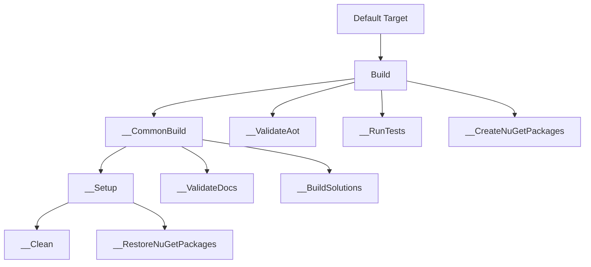

# Project Structure

<details>
<summary>Relevant source files</summary>

The following files were used as context for generating this wiki page:

- [cake.cs](https://github.com/App-vNext/Polly/blob/main/cake.cs)
- [README.md](https://github.com/App-vNext/Polly/blob/main/README.md)
- [src/Snippets/Docs/ResiliencePipelineRegistry.cs](https://github.com/App-vNext/Polly/blob/main/src/Snippets/Docs/ResiliencePipelineRegistry.cs)
- [src/Snippets/Docs/Retry.cs](https://github.com/App-vNext/Polly/blob/main/src/Snippets/Docs/Retry.cs)
- [AGENTS.md](https://github.com/App-vNext/Polly/blob/main/AGENTS.md)
- [docs/community/git-workflow.md](https://github.com/App-vNext/Polly/blob/main/docs/community/git-workflow.md)
- [src/Snippets/Docs/Migration.Context.cs](https://github.com/App-vNext/Polly/blob/main/src/Snippets/Docs/Migration.Context.cs)
- [docs/chaos/index.md](https://github.com/App-vNext/Polly/blob/main/docs/chaos/index.md)
- [src/Snippets/README.md](https://github.com/App-vNext/Polly/blob/main/src/Snippets/README.md)
- [mdsnippets.json](https://github.com/App-vNext/Polly/blob/main/mdsnippets.json)
- [src/Snippets/Docs/Migration.Registry.cs](https://github.com/App-vNext/Polly/blob/main/src/Snippets/Docs/Migration.Registry.cs)
- [docs/community/toc.yml](https://github.com/App-vNext/Polly/blob/main/docs/community/toc.yml)
- [docs/extensibility/toc.yml](https://github.com/App-vNext/Polly/blob/main/docs/extensibility/toc.yml)
- [docs/docfx.json](https://github.com/App-vNext/Polly/blob/main/docs/docfx.json)
- [docs/template/public/main.js](https://github.com/App-vNext/Polly/blob/main/docs/template/public/main.js)
- [docs/toc.yml](https://github.com/App-vNext/Polly/blob/main/docs/toc.yml)
- [docs/pipelines/toc.yml](https://github.com/App-vNext/Polly/blob/main/docs/pipelines/toc.yml)
- [docs/api/index.md](https://github.com/App-vNext/Polly/blob/main/docs/api/index.md)
- [docs/advanced/toc.yml](https://github.com/App-vNext/Polly/blob/main/docs/advanced/toc.yml)
- [docs/strategies/toc.yml](https://github.com/App-vNext/Polly/blob/main/docs/strategies/toc.yml)
- [package-readme.md](https://github.com/App-vNext/Polly/blob/main/package-readme.md)
- [docs/chaos/toc.yml](https://github.com/App-vNext/Polly/blob/main/docs/chaos/toc.yml)
- [src/Polly.Testing/README.md](https://github.com/App-vNext/Polly/blob/main/src/Polly.Testing/README.md)
- [src/Polly.Extensions/README.md](https://github.com/App-vNext/Polly/blob/main/src/Polly.Extensions/README.md)
- [docs/community/cheat-sheets.md](https://github.com/App-vNext/Polly/blob/main/docs/community/cheat-sheets.md)
- [global.json](https://github.com/App-vNext/Polly/blob/main/global.json)
- [src/Snippets/Docs/General.cs](https://github.com/App-vNext/Polly/blob/main/src/Snippets/Docs/General.cs)
- [CONTRIBUTING.md](https://github.com/App-vNext/Polly/blob/main/CONTRIBUTING.md)
- [eng/analyzers/Stylecop.json](https://github.com/App-vNext/Polly/blob/main/eng/analyzers/Stylecop.json)
</details>

## Overview

The Polly project structure is organized into a modular multi-package repository that separates core abstractions, extensions, rate limiting adapters, testing infrastructure, and legacy compatibility layers. This design ensures that consumers can depend strictly on the components they require—such as lightweight core primitives without external dependencies—while maintaining a clean architectural separation between modern v8 resilience engines and older pre-v8 APIs.
Sources: [README.md:24-32](https://github.com/App-vNext/Polly/blob/main/README.md#L24-L32)

At the heart of the repository layout is the `src/` directory, which hosts individual source projects, accompanied by `test/` for unit, specification, and AOT validation tests, and `eng/` for build engineering scripts and analyzer rules. The build lifecycle is orchestrated via a Cake script (`cake.cs`) bootstrapped through PowerShell, executing tasks ranging from solution compilation and documentation snippet validation (`mdsnippets`) to Stryker mutation testing across individual modules.
Sources: [AGENTS.md:38-94](https://github.com/App-vNext/Polly/blob/main/AGENTS.md#L38-L94)

Centralized Package Management (CPM) via `Directory.Packages.props` governs all external NuGet dependencies across the entire workspace, ensuring version uniformity. Shared MSBuild properties, including nullable annotations, treat-warnings-as-errors enforcement, and strong-name signing via `Polly.snk`, are injected globally via shared MSBuild targets and imports, keeping individual project files concise and policy-compliant.
Sources: [cake.cs:1-194](https://github.com/App-vNext/Polly/blob/main/cake.cs#L1-L194)

## Core NuGet Packages and Source Layout

The repository divides its deliverables into distinct libraries housed within the `src/` directory. Each project targets specific functional boundaries: `Polly.Core` provides the core abstractions and built-in resilience strategies; `Polly` preserves the legacy pre-v8 API surface; `Polly.Extensions` supplies dependency injection bindings and OpenTelemetry integration; `Polly.RateLimiting` bridges `System.Threading.RateLimiting` primitives; and `Polly.Testing` exposes pipeline descriptors for assertable testing.
Sources: [README.md:24-32](https://github.com/App-vNext/Polly/blob/main/README.md#L24-L32)

| Package Name | Source Directory | Primary Responsibility |
| :--- | :--- | :--- |
| `Polly.Core` | `src/Polly.Core` | Core abstractions, builders, execution context, and built-in strategies (`Retry`, `CircuitBreaker`, `Timeout`, `Hedging`, `Fallback`). |
| `Polly` | `src/Polly` | Legacy pre-v8 policy API retained for backwards compatibility. |
| `Polly.Extensions` | `src/Polly.Extensions` | `IServiceCollection` integration, telemetry mapping, and OpenTelemetry listeners. |
| `Polly.RateLimiting` | `src/Polly.RateLimiting` | Rate limiting strategy options integrating `System.Threading.RateLimiting`. |
| `Polly.Testing` | `src/Polly.Testing` | Pipeline descriptors and inspection utilities for unit testing composition. |
Sources: [cake.cs:179-186](https://github.com/App-vNext/Polly/blob/main/cake.cs#L179-L186)

The separation of these projects relies on `InternalsVisibleTo` assemblies and distinct `.csproj` definitions to enforce modular boundaries while allowing `Polly.Testing` to inspect internal builder structures.
Sources: [AGENTS.md:42-71](https://github.com/App-vNext/Polly/blob/main/AGENTS.md#L42-L71)

## Build Automation and Cake Script Architecture

The build pipeline is automated via `cake.cs`, which runs on the Cake SDK (`Cake.Sdk`) and utilizes `Cake.FileHelpers` and `Newtonsoft.Json`. The script locates all solutions (`*.slnx`), manages artifacts directories, and defines private execution tasks that sequence clean, restore, build, AOT validation, testing, and NuGet packaging steps.
Sources: [cake.cs:1-35](https://github.com/App-vNext/Polly/blob/main/cake.cs#L1-L35)


Sources: [cake.cs:206-231](https://github.com/App-vNext/Polly/blob/main/cake.cs#L206-L231)

The execution flow for the primary `Default` target proceeds through prerequisite validation stages before building solutions and executing test suites:
1. `__Clean` clears intermediate artifacts or runs `DotNetClean` across discovered solution directories.
2. `__RestoreNuGetPackages` runs `DotNetRestore` on all solution files.
3. `__ValidateDocs` executes `dotnet mdsnippets --validate-content` to ensure documentation code snippets are synchronized.
4. `__BuildSolutions` builds all solutions in the configured configuration (e.g. `Release`) with warnings treated as errors.
5. `__ValidateAot` publishes `test/Polly.AotTest/Polly.AotTest.csproj` to verify Native AOT compatibility.
6. `__RunTests` discovers test projects (`./test/**/*{Tests,Specs}.csproj`) and executes `DotNetTest` with appropriate GitHub Actions loggers when applicable.
7. `__CreateNuGetPackages` packs `Polly.Core`, `Polly`, `Polly.RateLimiting`, `Polly.Extensions`, and `Polly.Testing` into the release artifacts directory.
Sources: [cake.cs:58-194](https://github.com/App-vNext/Polly/blob/main/cake.cs#L58-L194)

The build script is bootstrapped using `global.json` which specifies the required MSBuild SDK versions such as `Cake.Sdk`.
Sources: [global.json:1-8](https://github.com/App-vNext/Polly/blob/main/global.json#L1-L8)

## Mutation Testing Architecture

The project incorporates Stryker mutation testing via dedicated Cake tasks (`MutationTestsCore`, `MutationTestsRateLimiting`, `MutationTestsExtensions`, `MutationTestsTesting`, `MutationTestsLegacy`, and the aggregate `MutationTests`).
Sources: [cake.cs:236-277](https://github.com/App-vNext/Polly/blob/main/cake.cs#L236-L277)

The helper function `RunMutationTests` reads the mutation score threshold from the target project's MSBuild properties, patches `eng/stryker-config.json` dynamically when running under GitHub Actions or when special module adjustments (such as removing ignore-mutations for `Polly.Testing`) are required, and executes the Stryker CLI tool.
Sources: [cake.cs:304-344](https://github.com/App-vNext/Polly/blob/main/cake.cs#L304-L344)

| Task Name | Target Project | Test Project |
| :--- | :--- | :--- |
| `MutationTestsCore` | `src/Polly.Core/Polly.Core.csproj` | `test/Polly.Core.Tests/Polly.Core.Tests.csproj` |
| `MutationTestsRateLimiting` | `src/Polly.RateLimiting/Polly.RateLimiting.csproj` | `test/Polly.RateLimiting.Tests/Polly.RateLimiting.Tests.csproj` |
| `MutationTestsExtensions` | `src/Polly.Extensions/Polly.Extensions.csproj` | `test/Polly.Extensions.Tests/Polly.Extensions.Tests.csproj` |
| `MutationTestsTesting` | `src/Polly.Testing/Polly.Testing.csproj` | `test/Polly.Testing.Tests/Polly.Testing.Tests.csproj` |
| `MutationTestsLegacy` | `src/Polly/Polly.csproj` | `test/Polly.Specs/Polly.Specs.csproj` |
Sources: [cake.cs:236-269](https://github.com/App-vNext/Polly/blob/main/cake.cs#L236-L269)

> [!NOTE]
> When executing mutation tests in GitHub Actions with a Stryker dashboard API key configured, `RunMutationTests` automatically appends the dashboard reporter and injects project identification metadata into a temporary JSON config file to prevent tree pollution.
Sources: [cake.cs:319-343](https://github.com/App-vNext/Polly/blob/main/cake.cs#L319-L343)

## Documentation and Snippet Synchronization

Documentation is structured using DocFX (`docs/docfx.json`) alongside Markdown files placed across `docs/`.
Sources: [docs/docfx.json:1-76](https://github.com/App-vNext/Polly/blob/main/docs/docfx.json#L1-L76)

To maintain accuracy between sample code and documentation, snippet validation is enforced via `MarkdownSnippets` and `mdsnippets.json`.
Sources: [src/Snippets/README.md:1-9](https://github.com/App-vNext/Polly/blob/main/src/Snippets/README.md#L1-L9)

The snippet configuration excludes test, artifact, bench, and engineering directories while ignoring internal snippet directories from core implementation source packages.
Sources: [mdsnippets.json:1-7](https://github.com/App-vNext/Polly/blob/main/mdsnippets.json#L1-L7)

Developers update documentation by enclosing sample logic between named region tags in C# files under `src/Snippets/`:
```csharp
public static void MySnippet()
{
    #region my-snippet

    // Your code here

    #endregion
}
```
Sources: [src/Snippets/README.md:11-27](https://github.com/App-vNext/Polly/blob/main/src/Snippets/README.md#L11-L27)

Running `dotnet mdsnippets` (or the Cake task `__ValidateDocs`) scans Markdown references and overwrites content in-place across documentation files according to `mdsnippets.json`.
Sources: [src/Snippets/README.md:28-31](https://github.com/App-vNext/Polly/blob/main/src/Snippets/README.md#L28-L31)

> [!WARNING]
> Referencing a non-existent snippet tag in documentation causes `dotnet mdsnippets` validation to fail with a `Missing snippets` error, halting CI builds.
Sources: [src/Snippets/README.md:32-36](https://github.com/App-vNext/Polly/blob/main/src/Snippets/README.md#L32-L36)

## Design Trade-Offs and Architectural Principles

The Polly repository structure and build system embody specific architectural decisions that balance developer ergonomics against execution performance and backward compatibility.
Sources: [AGENTS.md:38-40](https://github.com/App-vNext/Polly/blob/main/AGENTS.md#L38-L40)

| Design Choice | Benefit | Cost |
| :--- | :--- | :--- |
| **Modular Multi-Package Separation** (`Polly.Core`, `Polly.Extensions`, etc.) | Consumers pull only required dependencies; zero-dependency core execution. | Higher project maintenance overhead and complex cross-project reference management. |
| **Centralized Package Management (CPM)** via `Directory.Packages.props` | Guarantees version alignment across all source and test projects. | Requires updating package versions in a single global location rather than per-project. |
| **Legacy Compatibility Layer (`Polly`) via MSBuild Injection** | Allows seamless upgrade paths for v7 users adopting v8 core engines. | Additional compilation complexity and source injection mechanics during builds. |
| **Pipeline Descriptors via `Polly.Testing` with Internal Visibility** | Enables deep unit-test assertions on strategy composition without exposing internals publicly. | Relies on `InternalsVisibleTo` attributes linking production assemblies to test projects. |
Sources: [AGENTS.md:41-92](https://github.com/App-vNext/Polly/blob/main/AGENTS.md#L41-L92)

The modular design allows independent packaging of extensions and rate-limiting features, ensuring that `Polly.Core` remains lightweight and suitable for AOT compilation and trimming.
Sources: [README.md:24-32](https://github.com/App-vNext/Polly/blob/main/README.md#L24-L32)

## Related

- [[Overview]]

