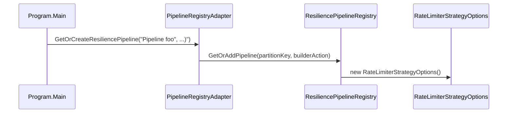
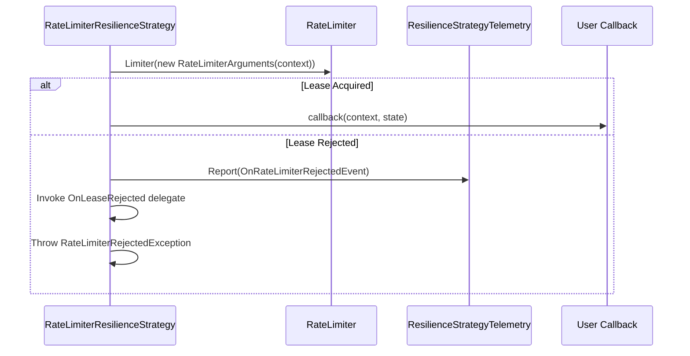

# Rate Limiting Strategy

<details>
<summary>Relevant source files</summary>

The following files were used as context for generating this wiki page:

- [docs/strategies/rate-limiter.md](https://github.com/App-vNext/Polly/blob/main/docs/strategies/rate-limiter.md)
- [README.md](https://github.com/App-vNext/Polly/blob/main/README.md)
- [src/Polly/RateLimit/RateLimitTResultSyntax.cs](https://github.com/App-vNext/Polly/blob/main/src/Polly/RateLimit/RateLimitTResultSyntax.cs)
- [src/Polly.RateLimiting/RateLimiterResiliencePipelineBuilderExtensions.cs](https://github.com/App-vNext/Polly/blob/main/src/Polly.RateLimiting/RateLimiterResiliencePipelineBuilderExtensions.cs)
- [src/Snippets/Docs/RateLimiter.cs](https://github.com/App-vNext/Polly/blob/main/src/Snippets/Docs/RateLimiter.cs)
- [src/Polly/RateLimit/AsyncRateLimitSyntax.cs](https://github.com/App-vNext/Polly/blob/main/src/Polly/RateLimit/AsyncRateLimitSyntax.cs)
- [src/Polly.RateLimiting/RateLimiterResilienceStrategy.cs](https://github.com/App-vNext/Polly/blob/main/src/Polly.RateLimiting/RateLimiterResilienceStrategy.cs)
- [src/Polly/RateLimit/RateLimitSyntax.cs](https://github.com/App-vNext/Polly/blob/main/src/Polly/RateLimit/RateLimitSyntax.cs)
- [src/Polly/RateLimit/AsyncRateLimitTResultSyntax.cs](https://github.com/App-vNext/Polly/blob/main/src/Polly/RateLimit/AsyncRateLimitTResultSyntax.cs)
- [src/Snippets/Docs/Migration.RateLimiter.cs](https://github.com/App-vNext/Polly/blob/main/src/Snippets/Docs/Migration.RateLimiter.cs)
- [src/Polly.RateLimiting/README.md](https://github.com/App-vNext/Polly/blob/main/src/Polly.RateLimiting/README.md)
- [src/Snippets/Docs/Migration.Interoperability.cs](https://github.com/App-vNext/Polly/blob/main/src/Snippets/Docs/Migration.Interoperability.cs)
- [src/Polly/RateLimit/RateLimitEngine.cs](https://github.com/App-vNext/Polly/blob/main/src/Polly/RateLimit/RateLimitEngine.cs)
- [src/Polly/RateLimit/RateLimitPolicy.cs](https://github.com/App-vNext/Polly/blob/main/src/Polly/RateLimit/RateLimitPolicy.cs)
- [src/Polly.RateLimiting/RateLimiterStrategyOptions.cs](https://github.com/App-vNext/Polly/blob/main/src/Polly.RateLimiting/RateLimiterStrategyOptions.cs)
- [src/Polly/RateLimit/IRateLimiter.cs](https://github.com/App-vNext/Polly/blob/main/src/Polly/RateLimit/IRateLimiter.cs)
- [AGENTS.md](https://github.com/App-vNext/Polly/blob/main/AGENTS.md)
- [src/Polly/RateLimit/LockFreeTokenBucketRateLimiter.cs](https://github.com/App-vNext/Polly/blob/main/src/Polly/RateLimit/LockFreeTokenBucketRateLimiter.cs)
- [docs/community/http-client-integrations.md](https://github.com/App-vNext/Polly/blob/main/docs/community/http-client-integrations.md)
- [src/Polly/RateLimit/AsyncRateLimitPolicy.cs](https://github.com/App-vNext/Polly/blob/main/src/Polly/RateLimit/AsyncRateLimitPolicy.cs)
- [src/Polly.RateLimiting/OnRateLimiterRejectedArguments.cs](https://github.com/App-vNext/Polly/blob/main/src/Polly.RateLimiting/OnRateLimiterRejectedArguments.cs)
- [src/Snippets/Docs/ResiliencePipelineRegistry.cs](https://github.com/App-vNext/Polly/blob/main/src/Snippets/Docs/ResiliencePipelineRegistry.cs)
</details>

## Overview

The rate limiting resilience strategy acts as a proactive defense mechanism within Polly pipelines, controlling the volume of inbound or outbound operational load to prevent system overload. By serving as a thin integration layer over the standard `System.Threading.RateLimiting` package, the strategy enables developers to enforce concurrency thresholds, window-based limits, and custom rate-limiting algorithms across synchronous and asynchronous execution paths.
Sources: [docs/strategies/rate-limiter.md:18-19](https://github.com/App-vNext/Polly/blob/main/docs/strategies/rate-limiter.md#L18-L19)

When permit acquisition fails, the strategy emits structured telemetry events, triggers rejection callbacks, and throws specific exceptions containing retry guidance. This design bridges modern rate-limiting primitives with Polly's flexible resilience architecture, ensuring smooth transitions from legacy rate-limiting policies and supporting advanced pipeline registry patterns.
Sources: [docs/strategies/rate-limiter.md:11-11](https://github.com/App-vNext/Polly/blob/main/docs/strategies/rate-limiter.md#L11-L11), [docs/strategies/rate-limiter.md:119-133](https://github.com/App-vNext/Polly/blob/main/docs/strategies/rate-limiter.md#L119-L133), [docs/strategies/rate-limiter.md:145-150](https://github.com/App-vNext/Polly/blob/main/docs/strategies/rate-limiter.md#L145-L150)

## Pipeline Builder Extensions and Call Chain

### Overview

The `RateLimiterResiliencePipelineBuilderExtensions` class supplies extension methods for integrating `System.Threading.RateLimiting` strategies with `ResiliencePipelineBuilderBase` instances. These extensions bridge standard rate limiters and options into Polly's resilience pipeline architecture.
Sources: [src/Polly.RateLimiting/RateLimiterResiliencePipelineBuilderExtensions.cs:8-12](https://github.com/App-vNext/Polly/blob/main/src/Polly.RateLimiting/RateLimiterResiliencePipelineBuilderExtensions.cs#L8-L12)

### Call-Chain Execution Walkthrough

The execution walkthrough for registry-based pipeline setup follows the chain: `Main()` → `GetOrCreateResiliencePipeline()` → `RateLimiterStrategyOptions()`.

1. `Main()`: The host application or program entry point initializes the pipeline adapter and triggers pipeline creation.
Sources: [src/Snippets/Docs/ResiliencePipelineRegistry.cs:179-186](https://github.com/App-vNext/Polly/blob/main/src/Snippets/Docs/ResiliencePipelineRegistry.cs#L179-L186)
2. `GetOrCreateResiliencePipeline()`: The adapter invokes `GetOrAddPipeline` on `ResiliencePipelineRegistry<string>`, passing the partition key and builder configuration callback.
Sources: [src/Snippets/Docs/ResiliencePipelineRegistry.cs:213-252](https://github.com/App-vNext/Polly/blob/main/src/Snippets/Docs/ResiliencePipelineRegistry.cs#L213-L252)
3. `RateLimiterStrategyOptions()`: Inside the configuration callback, `new RateLimiterStrategyOptions()` is instantiated to construct strategy settings with a custom lease delegate and rejection handling.
Sources: [src/Polly.RateLimiting/RateLimiterStrategyOptions.cs:13-15](https://github.com/App-vNext/Polly/blob/main/src/Polly.RateLimiting/RateLimiterStrategyOptions.cs#L13-L15), [src/Snippets/Docs/ResiliencePipelineRegistry.cs:222-244](https://github.com/App-vNext/Polly/blob/main/src/Snippets/Docs/ResiliencePipelineRegistry.cs#L222-L244)


Sources: [src/Snippets/Docs/ResiliencePipelineRegistry.cs:179-252](https://github.com/App-vNext/Polly/blob/main/src/Snippets/Docs/ResiliencePipelineRegistry.cs#L179-L252), [src/Polly.RateLimiting/RateLimiterStrategyOptions.cs:13-15](https://github.com/App-vNext/Polly/blob/main/src/Polly.RateLimiting/RateLimiterStrategyOptions.cs#L13-L15)

### Extension Methods Reference

The extension methods available on resilience pipeline builders are detailed below.

| Method Signature | Parameters | Description |
| --- | --- | --- |
| `AddConcurrencyLimiter<TBuilder>(this TBuilder builder, int permitLimit, int queueLimit = 0)` | `permitLimit`: Max concurrent permits.<br>`queueLimit`: Max queued permits (default `0`). | Adds a concurrency limiter using specified limits. |
| `AddConcurrencyLimiter<TBuilder>(this TBuilder builder, ConcurrencyLimiterOptions options)` | `options`: `ConcurrencyLimiterOptions` instance. | Adds a concurrency limiter configured via options. |
| `AddRateLimiter<TBuilder>(this TBuilder builder, RateLimiter limiter)` | `limiter`: `RateLimiter` instance. | Wraps an arbitrary `RateLimiter` to acquire leases using the execution cancellation token. |
| `AddRateLimiter<TBuilder>(this TBuilder builder, RateLimiterStrategyOptions options)` | `options`: `RateLimiterStrategyOptions` instance. | Adds a fully configured rate limiter strategy, defaulting to a concurrency limiter if no custom delegate is supplied. |

Sources: [src/Polly.RateLimiting/RateLimiterResiliencePipelineBuilderExtensions.cs:24-126](https://github.com/App-vNext/Polly/blob/main/src/Polly.RateLimiting/RateLimiterResiliencePipelineBuilderExtensions.cs#L24-L126)

> [!NOTE]
> When `options.RateLimiter` is `null` inside `AddRateLimiter`, a default `ConcurrencyLimiter` is instantiated using `options.DefaultRateLimiterOptions` and automatically managed as a wrapper resource.
Sources: [src/Polly.RateLimiting/RateLimiterResiliencePipelineBuilderExtensions.cs:110-117](https://github.com/App-vNext/Polly/blob/main/src/Polly.RateLimiting/RateLimiterResiliencePipelineBuilderExtensions.cs#L110-L117)

## Strategy Execution and Telemetry Control Flow

### Core Execution Logic Walkthrough

When an execution enters `RateLimiterResilienceStrategy`, core control flows through the `ExecuteCore` method to acquire permits, handle rejections, and emit telemetry events.

1. `ExecuteCore`: Receives the user callback, resilience context, and state, initiating an asynchronous rate limit lease acquisition via `Limiter(new RateLimiterArguments(context))`.
Sources: [src/Polly.RateLimiting/RateLimiterResilienceStrategy.cs:41-46](https://github.com/App-vNext/Polly/blob/main/src/Polly.RateLimiting/RateLimiterResilienceStrategy.cs#L41-L46)
2. `lease.IsAcquired`: Evaluates whether the lease was successfully granted. If true, `callback(context, state)` is immediately invoked and its outcome returned.
Sources: [src/Polly.RateLimiting/RateLimiterResilienceStrategy.cs:48-51](https://github.com/App-vNext/Polly/blob/main/src/Polly.RateLimiting/RateLimiterResilienceStrategy.cs#L48-L51)
3. `lease.TryGetMetadata`: When permit acquisition fails, attempts to extract `MetadataName.RetryAfter` values to determine back-off timing.
Sources: [src/Polly.RateLimiting/RateLimiterResilienceStrategy.cs:53-58](https://github.com/App-vNext/Polly/blob/main/src/Polly.RateLimiting/RateLimiterResilienceStrategy.cs#L53-L58)
4. `_telemetry.Report`: Emits an `Error`-severity event using `RateLimiterConstants.OnRateLimiterRejectedEvent` alongside an `OnRateLimiterRejectedArguments` payload.
Sources: [src/Polly.RateLimiting/RateLimiterResilienceStrategy.cs:60-62](https://github.com/App-vNext/Polly/blob/main/src/Polly.RateLimiting/RateLimiterResilienceStrategy.cs#L60-L62)
5. `OnLeaseRejected`: If a user rejection handler callback was configured, it executes asynchronously passing `OnRateLimiterRejectedArguments`.
Sources: [src/Polly.RateLimiting/RateLimiterResilienceStrategy.cs:63-66](https://github.com/App-vNext/Polly/blob/main/src/Polly.RateLimiting/RateLimiterResilienceStrategy.cs#L63-L66)
6. `RateLimiterRejectedException`: Instantiates a rejection exception with or without the extracted `retryAfterValue`, registers the exception source on telemetry, and returns an exception outcome.
Sources: [src/Polly.RateLimiting/RateLimiterResilienceStrategy.cs:68-74](https://github.com/App-vNext/Polly/blob/main/src/Polly.RateLimiting/RateLimiterResilienceStrategy.cs#L68-L74)


Sources: [src/Polly.RateLimiting/RateLimiterResilienceStrategy.cs:41-75](https://github.com/App-vNext/Polly/blob/main/src/Polly.RateLimiting/RateLimiterResilienceStrategy.cs#L41-L75)

### Strategy Lifecycle and Arguments Reference

The strategy manages resource lifecycles and provides structured arguments upon rejection events.

| Member / Method | Type | Description |
| --- | --- | --- |
| `Limiter` | `Func<RateLimiterArguments, ValueTask<RateLimitLease>>` | Delegate invoked to obtain rate limit leases. |
| `OnLeaseRejected` | `Func<OnRateLimiterRejectedArguments, ValueTask>?` | Optional callback invoked when a lease acquisition fails. |
| `Wrapper` | `RateLimiter?` | Optional underlying rate limiter instance managed by this strategy. |
| `Dispose()` | `void` | Synchronously disposes the managed `Wrapper` if present. |
| `DisposeAsync()` | `ValueTask` | Asynchronously disposes the managed `Wrapper` if present. |
| `OnRateLimiterRejectedArguments` | `struct` | Encapsulates the `ResilienceContext` and rejected `RateLimitLease`. |

Sources: [src/Polly.RateLimiting/RateLimiterResilienceStrategy.cs:10-39](https://github.com/App-vNext/Polly/blob/main/src/Polly.RateLimiting/RateLimiterResilienceStrategy.cs#L10-L39), [src/Polly.RateLimiting/OnRateLimiterRejectedArguments.cs:13-35](https://github.com/App-vNext/Polly/blob/main/src/Polly.RateLimiting/OnRateLimiterRejectedArguments.cs#L13-L35)

> [!WARNING]
> Always use the explicit constructor when instantiating `OnRateLimiterRejectedArguments` to guarantee binary compatibility across version updates, as it is structured as a readonly value type.
Sources: [src/Polly.RateLimiting/OnRateLimiterRejectedArguments.cs:13-24](https://github.com/App-vNext/Polly/blob/main/src/Polly.RateLimiting/OnRateLimiterRejectedArguments.cs#L13-L24)

## Options and Arguments Configuration Surface

The `RateLimiterStrategyOptions` class inherits from `ResilienceStrategyOptions` and provides the primary configuration surface for rate limiter execution. When constructed, its `Name` property defaults to `RateLimiterConstants.DefaultName`.
Sources: [src/Polly.RateLimiting/RateLimiterStrategyOptions.cs:9-15](https://github.com/App-vNext/Polly/blob/main/src/Polly.RateLimiting/RateLimiterStrategyOptions.cs#L9-L15)

Developers can configure custom rate-limiting behavior or fall back to built-in concurrency options. If the `RateLimiter` delegate is left `null`, the strategy constructs and uses a `ConcurrencyLimiter` governed by `DefaultRateLimiterOptions`.
Sources: [src/Polly.RateLimiting/RateLimiterStrategyOptions.cs:16-40](https://github.com/App-vNext/Polly/blob/main/src/Polly.RateLimiting/RateLimiterStrategyOptions.cs#L16-L40)

| Option Property | Type | Default Value | Description |
| --- | --- | --- | --- |
| `Name` | `string` | `RateLimiterConstants.DefaultName` | Identifies the resilience strategy instance. |
| `RateLimiter` | `Func<RateLimiterArguments, ValueTask<RateLimitLease>>?` | `null` | Custom delegate producing a `RateLimitLease`. |
| `DefaultRateLimiterOptions` | `ConcurrencyLimiterOptions` | Permits: 1000, Queue: 0 | Fallback concurrency settings when `RateLimiter` is `null`. |
| `OnRejected` | `Func<OnRateLimiterRejectedArguments, ValueTask>?` | `null` | Asynchronous callback raised when permit acquisition is rejected. |

Sources: [src/Polly.RateLimiting/RateLimiterStrategyOptions.cs:9-49](https://github.com/App-vNext/Polly/blob/main/src/Polly.RateLimiting/RateLimiterStrategyOptions.cs#L9-L49)

When permit acquisition fails, the strategy invokes the `OnRejected` callback by passing an `OnRateLimiterRejectedArguments` readonly struct. This struct packages the execution context alongside the denied lease.
Sources: [src/Polly.RateLimiting/RateLimiterStrategyOptions.cs:42-49](https://github.com/App-vNext/Polly/blob/main/src/Polly.RateLimiting/RateLimiterStrategyOptions.cs#L42-L49), [src/Polly.RateLimiting/OnRateLimiterRejectedArguments.cs:13-25](https://github.com/App-vNext/Polly/blob/main/src/Polly.RateLimiting/OnRateLimiterRejectedArguments.cs#L13-L25)

> [!WARNING]
> Always use the explicit `OnRateLimiterRejectedArguments(ResilienceContext context, RateLimitLease lease)` constructor when instantiating this struct. Direct member initialization or parameterless construction is discouraged to ensure binary compatibility across library updates.
Sources: [src/Polly.RateLimiting/OnRateLimiterRejectedArguments.cs:10-24](https://github.com/App-vNext/Polly/blob/main/src/Polly.RateLimiting/OnRateLimiterRejectedArguments.cs#L10-L24)

## Lock-Free Token Bucket Algorithm and Legacy Policy Architecture

### Overview

The classic Polly v7 rate-limiting architecture relies on the `IRateLimiter` contract and is configured via static extension methods on the `Policy` class. These extensions build synchronous and asynchronous rate-limiting policies backed by a lock-free token bucket implementation.
Sources: [src/Polly/RateLimit/IRateLimiter.cs:7-18](https://github.com/App-vNext/Polly/blob/main/src/Polly/RateLimit/IRateLimiter.cs#L7-L18), [src/Polly/RateLimit/RateLimitSyntax.cs:12-55](https://github.com/App-vNext/Polly/blob/main/src/Polly/RateLimit/RateLimitSyntax.cs#L12-L55), [src/Polly/RateLimit/LockFreeTokenBucketRateLimiter.cs:7-10](https://github.com/App-vNext/Polly/blob/main/src/Polly/RateLimit/LockFreeTokenBucketRateLimiter.cs#L7-L10)

### Syntax Builders and Policy Classes

Policy construction is exposed through overloaded `RateLimit` and `RateLimitAsync` methods on `Policy`. Each builder validates that `numberOfExecutions`, `perTimeSpan`, and `maxBurst` parameters are positive integers before instantiating a `LockFreeTokenBucketRateLimiter`.
Sources: [src/Polly/RateLimit/RateLimitSyntax.cs:28-55](https://github.com/App-vNext/Polly/blob/main/src/Polly/RateLimit/RateLimitSyntax.cs#L28-L55), [src/Polly/RateLimit/AsyncRateLimitSyntax.cs:28-55](https://github.com/App-vNext/Polly/blob/main/src/Polly/RateLimit/AsyncRateLimitSyntax.cs#L28-L55), [src/Polly/RateLimit/RateLimitTResultSyntax.cs:60-91](https://github.com/App-vNext/Polly/blob/main/src/Polly/RateLimit/RateLimitTResultSyntax.cs#L60-L91), [src/Polly/RateLimit/AsyncRateLimitTResultSyntax.cs:60-91](https://github.com/App-vNext/Polly/blob/main/src/Polly/RateLimit/AsyncRateLimitTResultSyntax.cs#L60-L91)

| Policy Class | Return Type | Supported Delegates | Key Properties |
| --- | --- | --- | --- |
| `RateLimitPolicy` | `RateLimitPolicy` | Synchronous (`Action` / `Func<T>`) | `_rateLimiter` |
| `RateLimitPolicy<TResult>` | `RateLimitPolicy<TResult>` | Synchronous with `TResult` | `_rateLimiter`, `_retryAfterFactory` |
| `AsyncRateLimitPolicy` | `AsyncRateLimitPolicy` | Asynchronous (`Func<Task>`) | `_rateLimiter` |
| `AsyncRateLimitPolicy<TResult>` | `AsyncRateLimitPolicy<TResult>` | Asynchronous returning `Task<TResult>` | `_rateLimiter`, `_retryAfterFactory` |

Sources: [src/Polly/RateLimit/RateLimitPolicy.cs:7-55](https://github.com/App-vNext/Polly/blob/main/src/Polly/RateLimit/RateLimitPolicy.cs#L7-L55), [src/Polly/RateLimit/AsyncRateLimitPolicy.cs:7-75](https://github.com/App-vNext/Polly/blob/main/src/Polly/RateLimit/AsyncRateLimitPolicy.cs#L7-L75)

### The `IRateLimiter` Interface

The `IRateLimiter` interface defines a single method, `PermitExecution`, which checks whether an operation is permitted to execute.
Sources: [src/Polly/RateLimit/IRateLimiter.cs:7-18](https://github.com/App-vNext/Polly/blob/main/src/Polly/RateLimit/IRateLimiter.cs#L7-L18)

```csharp
internal interface IRateLimiter
{
    (bool PermitExecution, TimeSpan RetryAfter) PermitExecution();
}
```
Sources: [src/Polly/RateLimit/IRateLimiter.cs:7-18](https://github.com/App-vNext/Polly/blob/main/src/Polly/RateLimit/IRateLimiter.cs#L7-L18)

Calling `PermitExecution()` consumes an execution permit if available, returning a tuple indicating success (`PermitExecution`) and the recommended wait duration (`RetryAfter`) if rate-limited.
Sources: [src/Polly/RateLimit/IRateLimiter.cs:9-17](https://github.com/App-vNext/Polly/blob/main/src/Polly/RateLimit/IRateLimiter.cs#L9-L17)

### Lock-Free Token Bucket Algorithm

The `LockFreeTokenBucketRateLimiter` implements thread-safe rate limiting without locks using atomic operations via `Interlocked` and `SpinWait`.
Sources: [src/Polly/RateLimit/LockFreeTokenBucketRateLimiter.cs:7-110](https://github.com/App-vNext/Polly/blob/main/src/Polly/RateLimit/LockFreeTokenBucketRateLimiter.cs#L7-L110)

During execution, `PermitExecution()` follows this specific call-chain and branch sequence:
1. `Interlocked.Decrement(ref _currentTokens)` attempts to grab a token atomically.
Sources: [src/Polly/RateLimit/LockFreeTokenBucketRateLimiter.cs:46-47](https://github.com/App-vNext/Polly/blob/main/src/Polly/RateLimit/LockFreeTokenBucketRateLimiter.cs#L46-L47)
2. If `tokensAfterGrabOne >= 0`, execution is immediately permitted, returning `(true, TimeSpan.Zero)`.
Sources: [src/Polly/RateLimit/LockFreeTokenBucketRateLimiter.cs:48-52](https://github.com/App-vNext/Polly/blob/main/src/Polly/RateLimit/LockFreeTokenBucketRateLimiter.cs#L48-L52)
3. If tokens are exhausted, `SystemClock.DateTimeOffsetUtcNow().Ticks` is read to calculate `ticksTillAddNextToken`.
Sources: [src/Polly/RateLimit/LockFreeTokenBucketRateLimiter.cs:55-57](https://github.com/App-vNext/Polly/blob/main/src/Polly/RateLimit/LockFreeTokenBucketRateLimiter.cs#L55-L57)
4. If `ticksTillAddNextToken > 0`, the bucket cannot be refilled yet, so execution is rejected with `(false, TimeSpan.FromTicks(ticksTillAddNextToken))`.
Sources: [src/Polly/RateLimit/LockFreeTokenBucketRateLimiter.cs:59-63](https://github.com/App-vNext/Polly/blob/main/src/Polly/RateLimit/LockFreeTokenBucketRateLimiter.cs#L59-L63)
5. If refilling is due, `tokensMissedAdding` and `tokensToAdd` are calculated against `_bucketCapacity`.
Sources: [src/Polly/RateLimit/LockFreeTokenBucketRateLimiter.cs:69-72](https://github.com/App-vNext/Polly/blob/main/src/Polly/RateLimit/LockFreeTokenBucketRateLimiter.cs#L69-L72)
6. `Interlocked.CompareExchange(ref _addNextTokenAtTicks, ...)` attempts to win the race to update the refill timestamp.
Sources: [src/Polly/RateLimit/LockFreeTokenBucketRateLimiter.cs:82-83](https://github.com/App-vNext/Polly/blob/main/src/Polly/RateLimit/LockFreeTokenBucketRateLimiter.cs#L82-L83)
7. If the thread wins the race, `Interlocked.Exchange(ref _currentTokens, tokensToAdd - 1)` updates the token count while consuming one permit, returning `(true, TimeSpan.Zero)`. If it loses the race, it invokes `SpinWait.SpinOnce()` (or `Thread.Sleep(0)` on .NET Standard 2.0) and loops to retry.
Sources: [src/Polly/RateLimit/LockFreeTokenBucketRateLimiter.cs:92-107](https://github.com/App-vNext/Polly/blob/main/src/Polly/RateLimit/LockFreeTokenBucketRateLimiter.cs#L92-L107)

> [!NOTE]
> When a thread wins the token refill race, it explicitly consumes one of the newly calculated tokens by storing `tokensToAdd - 1` into `_currentTokens`, ensuring the current thread's permit is never snatched by a concurrent competitor.
Sources: [src/Polly/RateLimit/LockFreeTokenBucketRateLimiter.cs:86-95](https://github.com/App-vNext/Polly/blob/main/src/Polly/RateLimit/LockFreeTokenBucketRateLimiter.cs#L86-L95)

## Migration Pathways and V7 Interoperability

### Overview

Transitioning from legacy v7 rate-limiting policies to the v8 `System.Threading.RateLimiter` integration requires shifting from built-in policy classes to standard rate limiters wrapped by `ResiliencePipelineBuilder`. Unlike v7, which required separate synchronous and asynchronous policy variants, v8 handles both execution models via a unified `ResiliencePipeline` or `ResiliencePipeline<TResult>`.
Sources: [src/Snippets/Docs/Migration.RateLimiter.cs:8-65](https://github.com/App-vNext/Polly/blob/main/src/Snippets/Docs/Migration.RateLimiter.cs#L8-L65)

### Syntax Migration

In Polly v7, rate limiting was configured using static methods on the `Policy` class such as `Policy.RateLimit` and `Policy.RateLimitAsync`. In Polly v8, rate limiters from the `System.Threading.RateLimiting` namespace—such as `SlidingWindowRateLimiter`—are added directly to the pipeline builder using the `AddRateLimiter` extension method.
Sources: [src/Snippets/Docs/Migration.RateLimiter.cs:11-64](https://github.com/App-vNext/Polly/blob/main/src/Snippets/Docs/Migration.RateLimiter.cs#L11-L64)

```csharp
// Polly v7 legacy syntax
ISyncPolicy syncPolicy = Policy.RateLimit(numberOfExecutions: 100, perTimeSpan: TimeSpan.FromMinutes(1));
IAsyncPolicy asyncPolicy = Policy.RateLimitAsync(numberOfExecutions: 100, perTimeSpan: TimeSpan.FromMinutes(1));

// Polly v8 resilience pipeline syntax
ResiliencePipeline pipeline = new ResiliencePipelineBuilder()
    .AddRateLimiter(new SlidingWindowRateLimiter(new SlidingWindowRateLimiterOptions
    {
        PermitLimit = 100,
        SegmentsPerWindow = 4,
        Window = TimeSpan.FromMinutes(1),
    }))
    .Build();
```
Sources: [src/Snippets/Docs/Migration.RateLimiter.cs:13-50](https://github.com/App-vNext/Polly/blob/main/src/Snippets/Docs/Migration.RateLimiter.cs#L13-L50)

### Registry Interoperability and Policy Wrapping

To maintain interoperability with legacy policy codebases during migration, a v8 resilience pipeline containing a rate limiter can be converted into synchronous or asynchronous v7 policies via extension methods. These can subsequently be combined within a policy wrap.
Sources: [src/Snippets/Docs/Migration.Interoperability.cs:8-31](https://github.com/App-vNext/Polly/blob/main/src/Snippets/Docs/Migration.Interoperability.cs#L8-L31)

```csharp
ResiliencePipeline pipeline = new ResiliencePipelineBuilder()
    .AddRateLimiter(new FixedWindowRateLimiter(new FixedWindowRateLimiterOptions
    {
        Window = TimeSpan.FromSeconds(10),
        PermitLimit = 100
    }))
    .Build();

ISyncPolicy syncPolicy = pipeline.AsSyncPolicy();
IAsyncPolicy asyncPolicy = pipeline.AsAsyncPolicy();

ISyncPolicy wrappedPolicy = Policy.Wrap(
    syncPolicy,
    Policy.Handle<SomeExceptionType>().Retry(3));
```
Sources: [src/Snippets/Docs/Migration.Interoperability.cs:13-29](https://github.com/App-vNext/Polly/blob/main/src/Snippets/Docs/Migration.Interoperability.cs#L13-L29)

### Pipeline Registry Integration

When integrating rate limiters into a `ResiliencePipelineRegistry<T>`, rate limiters require explicit manual disposal because they implement `IDisposable`. Using `context.OnPipelineDisposed(...)` inside builder registrations ensures that rate limiter instances are correctly cleaned up when pipelines are discarded or dynamically reloaded.
Sources: [src/Snippets/Docs/ResiliencePipelineRegistry.cs:216-252](https://github.com/App-vNext/Polly/blob/main/src/Snippets/Docs/ResiliencePipelineRegistry.cs#L216-L252)

> [!WARNING]
> Unlike other built-in resilience strategies that do not require explicit cleanup, rate limiter instances allocated inside registry builders must be explicitly disposed via `context.OnPipelineDisposed` to prevent resource leaks during dynamic pipeline reloads.
Sources: [src/Snippets/Docs/ResiliencePipelineRegistry.cs:246-251](https://github.com/App-vNext/Polly/blob/main/src/Snippets/Docs/ResiliencePipelineRegistry.cs#L246-L251)

## Partitioned and Chained Rate Limiting Strategies

Partitioned rate limiters allow applying rate limits dynamically based on execution context properties, such as user IDs or client IP addresses. Using `PartitionedRateLimiter.Create`, separate partitions are established on demand.
Sources: [docs/strategies/rate-limiter.md:324-352](https://github.com/App-vNext/Polly/blob/main/docs/strategies/rate-limiter.md#L324-L352), [src/Snippets/Docs/RateLimiter.cs:36-58](https://github.com/App-vNext/Polly/blob/main/src/Snippets/Docs/RateLimiter.cs#L36-L58)

Multiple partitioned limiters can be combined using `PartitionedRateLimiter.CreateChained` to enforce hierarchical constraints—such as combining a 100 request/minute limit with a 10 request/second limit.
Sources: [docs/strategies/rate-limiter.md:356-395](https://github.com/App-vNext/Polly/blob/main/docs/strategies/rate-limiter.md#L356-L395), [src/Snippets/Docs/RateLimiter.cs:63-95](https://github.com/App-vNext/Polly/blob/main/src/Snippets/Docs/RateLimiter.cs#L63-L95)

```csharp
var partitionKey = "user-id";

var firstSlidingWindow = PartitionedRateLimiter.Create<ResilienceContext, string>(context =>
    RateLimitPartition.GetSlidingWindowLimiter(partitionKey, key => new SlidingWindowRateLimiterOptions
    {
        PermitLimit = 100,
        Window = TimeSpan.FromMinutes(1),
    }));

var secondSlidingWindow = PartitionedRateLimiter.Create<ResilienceContext, string>(context =>
    RateLimitPartition.GetSlidingWindowLimiter(partitionKey, key => new SlidingWindowRateLimiterOptions
    {
        PermitLimit = 10,
        Window = TimeSpan.FromSeconds(1),
    }));

var chainedRateLimiter = PartitionedRateLimiter.CreateChained(firstSlidingWindow, secondSlidingWindow);

ResiliencePipeline pipeline = new ResiliencePipelineBuilder()
    .AddRateLimiter(new RateLimiterStrategyOptions
    {
        RateLimiter = args => chainedRateLimiter.AcquireAsync(args.Context),
    })
    .Build();
```
Sources: [src/Snippets/Docs/RateLimiter.cs:63-95](https://github.com/App-vNext/Polly/blob/main/src/Snippets/Docs/RateLimiter.cs#L63-L95)

## Design Trade-Offs and Architectural Analysis

The structural choices made in Polly's rate limiting architecture balance efficiency, resource lifecycle management, and API design flexibility.

| Design Choice | Benefit | Cost |
| --- | --- | --- |
| **Wrapper over `System.Threading.RateLimiting`** | Aligns Polly directly with standard .NET runtime rate-limiting APIs. | Introduces external object allocation overhead for `RateLimitLease`. |
| **Lock-free token bucket (`Interlocked`)** | Avoids thread blocking and lock contention under high-concurrency workloads. | Increases complexity during token refill racing conditions. |
| **Dynamic `RateLimiter` delegates** | Enables context-aware partitioning and chained limiters. | Requires manual lifecycle management (`Dispose`) for dynamic instances. |
| **Readonly struct rejection arguments** | Memory-efficient value type payload for telemetry and rejection events. | Requires constructor calls to maintain forward binary compatibility. |

Sources: [src/Polly.RateLimiting/RateLimiterResilienceStrategy.cs:10-39](https://github.com/App-vNext/Polly/blob/main/src/Polly.RateLimiting/RateLimiterResilienceStrategy.cs#L10-L39), [src/Polly/RateLimit/LockFreeTokenBucketRateLimiter.cs:41-108](https://github.com/App-vNext/Polly/blob/main/src/Polly/RateLimit/LockFreeTokenBucketRateLimiter.cs#L41-L108), [src/Polly.RateLimiting/OnRateLimiterRejectedArguments.cs:13-35](https://github.com/App-vNext/Polly/blob/main/src/Polly.RateLimiting/OnRateLimiterRejectedArguments.cs#L13-L35)

## Runnable Usage and Lifecycle Examples

### Minimal Runnable Example

The following minimal example configures a concurrency limiter pipeline allowing up to 100 concurrent requests with a queue capacity of 50.
Sources: [docs/strategies/rate-limiter.md:52-73](https://github.com/App-vNext/Polly/blob/main/docs/strategies/rate-limiter.md#L52-L73), [src/Snippets/Docs/RateLimiter.cs:138-165](https://github.com/App-vNext/Polly/blob/main/src/Snippets/Docs/RateLimiter.cs#L138-L165)

```csharp
using System;
using System.Threading;
using System.Threading.Tasks;
using Polly;
using Polly.RateLimiting;

public static class MinimalRateLimiterExample
{
    public static async Task RunAsync()
    {
        ResiliencePipeline pipeline = new ResiliencePipelineBuilder()
            .AddConcurrencyLimiter(permitLimit: 100, queueLimit: 50)
            .Build();

        try
        {
            await pipeline.ExecuteAsync(async ct =>
            {
                await Task.Delay(10, ct);
            }, CancellationToken.None);
        }
        catch (RateLimiterRejectedException ex)
        {
            if (ex.RetryAfter is TimeSpan retryAfter)
            {
                Console.WriteLine($"Throttled. Retry after: {retryAfter}");
            }
        }
    }
}
```
Sources: [docs/strategies/rate-limiter.md:54-72](https://github.com/App-vNext/Polly/blob/main/docs/strategies/rate-limiter.md#L54-L72), [src/Snippets/Docs/RateLimiter.cs:145-163](https://github.com/App-vNext/Polly/blob/main/src/Snippets/Docs/RateLimiter.cs#L145-L163)

### Full Worked Lifecycle Example

The following end-to-end example demonstrates registering a dynamically reloaded rate limiter pipeline in Dependency Injection, attaching rejection callbacks, handling `RateLimiterRejectedException`, and registering cleanup hooks using `context.OnPipelineDisposed`.
Sources: [src/Snippets/Docs/RateLimiter.cs:101-135](https://github.com/App-vNext/Polly/blob/main/src/Snippets/Docs/RateLimiter.cs#L101-L135), [src/Snippets/Docs/RateLimiter.cs:171-188](https://github.com/App-vNext/Polly/blob/main/src/Snippets/Docs/RateLimiter.cs#L171-L188)

```csharp
using System;
using System.Threading;
using System.Threading.RateLimiting;
using System.Threading.Tasks;
using Microsoft.Extensions.DependencyInjection;
using Polly;
using Polly.RateLimiting;

public static class RateLimiterLifecycleExample
{
    public static async Task ExecuteFullLifecycleAsync()
    {
        var services = new ServiceCollection();

        services.AddResiliencePipeline("custom-rate-limiter", (builder, context) =>
        {
            var limiterOptions = new ConcurrencyLimiterOptions
            {
                PermitLimit = 2,
                QueueLimit = 0
            };

            var limiter = new ConcurrencyLimiter(limiterOptions);

            builder.AddRateLimiter(new RateLimiterStrategyOptions
            {
                RateLimiter = args => limiter.AcquireAsync(cancellationToken: args.Context.CancellationToken),
                OnRejected = args =>
                {
                    Console.WriteLine($"[Rejection Handler] Request rejected for context key: {args.Context.OperationKey}");
                    return default;
                }
            });

            // Clean up rate limiter resource on pipeline disposal
            context.OnPipelineDisposed(() => limiter.Dispose());
        });

        using var provider = services.BuildServiceProvider();
        var pipelineProvider = provider.GetRequiredService<ResiliencePipelineProvider<string>>();
        ResiliencePipeline pipeline = pipelineProvider.GetPipeline("custom-rate-limiter");

        using var cts = new CancellationTokenSource();

        // Consume available permits
        var task1 = pipeline.ExecuteAsync(async ct => await Task.Delay(100, ct), cts.Token);
        var task2 = pipeline.ExecuteAsync(async ct => await Task.Delay(100, ct), cts.Token);

        // Third execution exceeds permit limit and triggers rejection
        try
        {
            await pipeline.ExecuteAsync(async ct => await Task.Delay(10, ct), cts.Token);
        }
        catch (RateLimiterRejectedException ex)
        {
            Console.WriteLine($"[Caught Exception] Operation rejected by rate limiter. RetryAfter: {ex.RetryAfter}");
        }

        await Task.WhenAll(task1.AsTask(), task2.AsTask());
    }
}
```
Sources: [src/Snippets/Docs/RateLimiter.cs:101-135](https://github.com/App-vNext/Polly/blob/main/src/Snippets/Docs/RateLimiter.cs#L101-L135), [src/Snippets/Docs/RateLimiter.cs:171-188](https://github.com/App-vNext/Polly/blob/main/src/Snippets/Docs/RateLimiter.cs#L171-L188)

## Related

- [[Timeout Strategy]]

