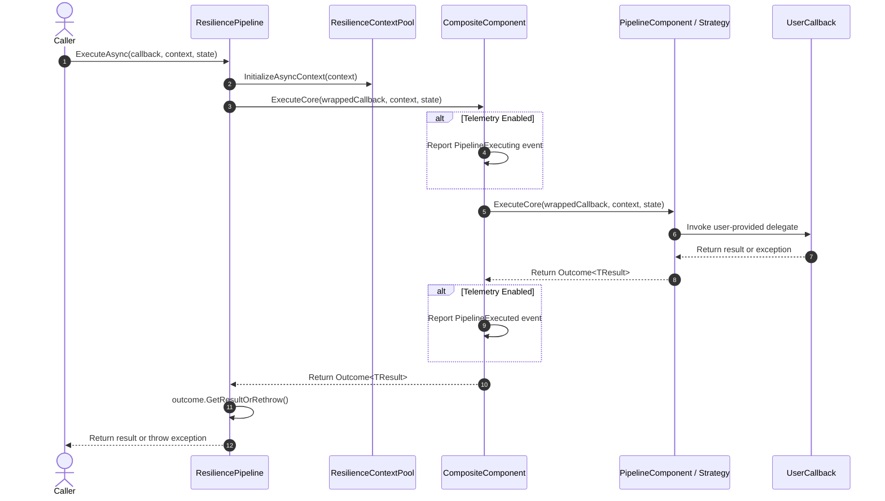

# Resilience Pipelines

<details>
<summary>Relevant source files</summary>

The following files were used as context for generating this wiki page:

- [docs/pipelines/index.md](https://github.com/App-vNext/Polly/blob/main/docs/pipelines/index.md)
- [src/Snippets/Docs/ResiliencePipelines.cs](https://github.com/App-vNext/Polly/blob/main/src/Snippets/Docs/ResiliencePipelines.cs)
- [docs/strategies/hedging.md](https://github.com/App-vNext/Polly/blob/main/docs/strategies/hedging.md)
- [README.md](https://github.com/App-vNext/Polly/blob/main/README.md)
- [src/Polly.Core/ResiliencePipelineT.Sync.cs](https://github.com/App-vNext/Polly/blob/main/src/Polly.Core/ResiliencePipelineT.Sync.cs)
- [docs/strategies/index.md](https://github.com/App-vNext/Polly/blob/main/docs/strategies/index.md)
- [src/Snippets/Docs/ResilienceStrategies.cs](https://github.com/App-vNext/Polly/blob/main/src/Snippets/Docs/ResilienceStrategies.cs)
- [src/Polly/Utilities/Wrappers/ResiliencePipelineAsyncPolicy.cs](https://github.com/App-vNext/Polly/blob/main/src/Polly/Utilities/Wrappers/ResiliencePipelineAsyncPolicy.cs)
- [docs/pipelines/resilience-pipeline-registry.md](https://github.com/App-vNext/Polly/blob/main/docs/pipelines/resilience-pipeline-registry.md)
- [src/Polly/Utilities/Wrappers/ResiliencePipelineAsyncPolicy.TResult.cs](https://github.com/App-vNext/Polly/blob/main/src/Polly/Utilities/Wrappers/ResiliencePipelineAsyncPolicy.TResult.cs)
- [src/Polly/Utilities/Wrappers/ResiliencePipelineSyncPolicy.cs](https://github.com/App-vNext/Polly/blob/main/src/Polly/Utilities/Wrappers/ResiliencePipelineSyncPolicy.cs)
- [src/Polly/Utilities/Wrappers/ResiliencePipelineSyncPolicy.TResult.cs](https://github.com/App-vNext/Polly/blob/main/src/Polly/Utilities/Wrappers/ResiliencePipelineSyncPolicy.TResult.cs)
- [src/Polly.Core/ResiliencePipelineBuilder.cs](https://github.com/App-vNext/Polly/blob/main/src/Polly.Core/ResiliencePipelineBuilder.cs)
- [src/Polly.Core/Utils/Pipeline/CompositeComponent.cs](https://github.com/App-vNext/Polly/blob/main/src/Polly.Core/Utils/Pipeline/CompositeComponent.cs)
- [src/Polly.Core/ResiliencePipelineBuilder.TResult.cs](https://github.com/App-vNext/Polly/blob/main/src/Polly.Core/ResiliencePipelineBuilder.TResult.cs)
- [src/Polly.Core/ResiliencePipelineT.Async.cs](https://github.com/App-vNext/Polly/blob/main/src/Polly.Core/ResiliencePipelineT.Async.cs)
- [src/Polly.Core/ResiliencePipeline.cs](https://github.com/App-vNext/Polly/blob/main/src/Polly.Core/ResiliencePipeline.cs)
- [src/Polly.Core/Utils/Pipeline/BridgeComponent.cs](https://github.com/App-vNext/Polly/blob/main/src/Polly.Core/Utils/Pipeline/BridgeComponent.cs)
- [src/Polly.Core/ResiliencePipelineT.cs](https://github.com/App-vNext/Polly/blob/main/src/Polly.Core/ResiliencePipelineT.cs)
- [src/Polly/ResiliencePipelineConversionExtensions.cs](https://github.com/App-vNext/Polly/blob/main/src/Polly/ResiliencePipelineConversionExtensions.cs)
- [docs/getting-started.md](https://github.com/App-vNext/Polly/blob/main/docs/getting-started.md)
- [AGENTS.md](https://github.com/App-vNext/Polly/blob/main/AGENTS.md)
- [src/Polly.Core/ResiliencePipeline.Async.cs](https://github.com/App-vNext/Polly/blob/main/src/Polly.Core/ResiliencePipeline.Async.cs)
- [src/Polly.Core/ResiliencePipeline.Sync.cs](https://github.com/App-vNext/Polly/blob/main/src/Polly.Core/ResiliencePipeline.Sync.cs)
- [src/Polly.Core/Utils/Pipeline/PipelineComponent.cs](https://github.com/App-vNext/Polly/blob/main/src/Polly.Core/Utils/Pipeline/PipelineComponent.cs)
- [src/Polly.Core/ResiliencePipelineBuilderBase.cs](https://github.com/App-vNext/Polly/blob/main/src/Polly.Core/ResiliencePipelineBuilderBase.cs)
- [src/Polly.Core/Utils/Pipeline/PipelineComponentFactory.cs](https://github.com/App-vNext/Polly/blob/main/src/Polly.Core/Utils/Pipeline/PipelineComponentFactory.cs)
</details>

## Overview

Resilience pipelines serve as the core execution engine in Polly v8, combining one or more individual resilience strategies (such as retry, circuit breaker, timeout, or rate limiter) into a unified, thread-safe composable structure. Rather than executing isolated policies around individual calls, a resilience pipeline takes arbitrary user-provided callbacks—both synchronous and asynchronous, generic and non-generic—and routes them sequentially through a chain of configured components. This design separates the definition of fault-handling policies from their runtime execution, enabling clean dependency injection, testability, and high-performance callback invocation with minimal allocations.

Sources: [docs/pipelines/index.md:1-4](https://github.com/App-vNext/Polly/blob/main/docs/pipelines/index.md#L1-L4)

At its architectural core, a `ResiliencePipeline` (and its generic counterpart `ResiliencePipeline<T>`) encapsulates a single root `PipelineComponent` instantiated via fluent builders like `ResiliencePipelineBuilder` or `ResiliencePipelineBuilder<T>`. When an execution method such as `ExecuteAsync` or `Execute` is invoked, the pipeline handles context pooling, exception safety, and telemetry reporting. Strategies added to a builder are chained sequentially; the order of registration dictates the execution hierarchy, where outer strategies envelop inner ones. This pipeline architecture allows complex cross-cutting concerns—such as overarching timeouts spanning multiple retry attempts versus inner per-attempt timeouts—to be expressed declaratively and executed reliably.

Sources: [src/Polly.Core/ResiliencePipeline.cs:5-11](https://github.com/App-vNext/Polly/blob/main/src/Polly.Core/ResiliencePipeline.cs#L5-L11), [src/Polly.Core/ResiliencePipelineT.cs:5-12](https://github.com/App-vNext/Polly/blob/main/src/Polly.Core/ResiliencePipelineT.cs#L5-L12)

---

## Pipeline Construction and Builder Architecture

Resilience pipelines are assembled using builder classes that inherit from `ResiliencePipelineBuilderBase`. The non-generic `ResiliencePipelineBuilder` produces a `ResiliencePipeline`, whereas `ResiliencePipelineBuilder<T>` produces a `ResiliencePipeline<T>`, binding the pipeline to a specific result type `T`. During the build process, the builder validates strategy options using data annotations, freezes its configuration via a `_used` flag to prevent further modifications, and compiles individual strategy entries into an optimized composite execution tree.

Sources: [src/Polly.Core/ResiliencePipelineBuilder.cs:5-21](https://github.com/App-vNext/Polly/blob/main/src/Polly.Core/ResiliencePipelineBuilder.cs#L5-L21), [src/Polly.Core/ResiliencePipelineBuilder.TResult.cs:5-34](https://github.com/App-vNext/Polly/blob/main/src/Polly.Core/ResiliencePipelineBuilder.TResult.cs#L5-L34)

The internal wiring mechanism relies on `PipelineComponentFactory` and `CompositeComponent`. If a builder has a single strategy, it wraps it directly. If it has multiple strategies, all strategies except the final one are converted into `DelegatingComponent` instances, which form a linked list pointing to successive strategies.

Sources: [src/Polly.Core/ResiliencePipelineBuilderBase.cs:102-135](https://github.com/App-vNext/Polly/blob/main/src/Polly.Core/ResiliencePipelineBuilderBase.cs#L102-L135), [src/Polly.Core/Utils/Pipeline/CompositeComponent.cs:29-59](https://github.com/App-vNext/Polly/blob/main/src/Polly.Core/Utils/Pipeline/CompositeComponent.cs#L29-L59)

> [!WARNING]
> Once `Build()` is called on a builder, the builder transitions to a used state (`_used = true`). Attempting to add subsequent strategies after building will throw an `InvalidOperationException`.

Sources: [src/Polly.Core/ResiliencePipelineBuilderBase.cs:110-116](https://github.com/App-vNext/Polly/blob/main/src/Polly.Core/ResiliencePipelineBuilderBase.cs#L110-L116)

---

## Execution Flow and Call-Chain Walkthrough

When execution is invoked on a `ResiliencePipeline`, the call flows through several precise layers before reaching the user callback. For asynchronous execution, the pipeline initializes an execution context from the context pool, wraps the user callback in outcome-handling logic to catch unhandled exceptions, and dispatches the execution into the root component.

Sources: [src/Polly.Core/ResiliencePipeline.Async.cs:17-44](https://github.com/App-vNext/Polly/blob/main/src/Polly.Core/ResiliencePipeline.Async.cs#L17-L44)

The exact asynchronous execution call chain flows as follows:
`ResiliencePipeline.ExecuteAsync()` → `InitializeAsyncContext()` → `Component.ExecuteCore()` → `CompositeComponent.ExecuteCoreWithTelemetry()` → `ExecuteCoreWithoutTelemetry()` → `FirstComponent.ExecuteCore()` → User Callback.

Sources: [src/Polly.Core/ResiliencePipeline.Async.cs:25-43](https://github.com/App-vNext/Polly/blob/main/src/Polly.Core/ResiliencePipeline.Async.cs#L25-L43), [src/Polly.Core/Utils/Pipeline/CompositeComponent.cs:71-117](https://github.com/App-vNext/Polly/blob/main/src/Polly.Core/Utils/Pipeline/CompositeComponent.cs#L71-L117)



Sources: [docs/pipelines/index.md:181-225](https://github.com/App-vNext/Polly/blob/main/docs/pipelines/index.md#L181-L225)

---

## Context Management and State Optimization

The pipeline manages execution state via `ResilienceContext`, which flows through every strategy and delegate in the pipeline. To eliminate memory allocations in high-throughput paths, contexts are rented from and returned to a shared pool (`ResilienceContextPool.Shared`).

Sources: [docs/pipelines/index.md:37-58](https://github.com/App-vNext/Polly/blob/main/docs/pipelines/index.md#L37-L58)

Additionally, Polly supports a state parameter (`TState`) across its execution overloads. This parameter allows callers to pass state variables directly into the user callback without capturing variables in closures or allocating lambda instances.

Sources: [docs/pipelines/index.md:138-148](https://github.com/App-vNext/Polly/blob/main/docs/pipelines/index.md#L138-L148)

| Parameter / Object | Scope & Lifetime | Primary Purpose |
| :--- | :--- | :--- |
| `ResilienceContext` | Per-invocation (reusable via pool) | Cross-strategy communication, property bags, cancellation token propagation, and telemetry coordination. |
| `TState` | Per-call invocation | Passing caller-local state directly to the callback without closure allocations or heap capture. |
| `Outcome<TResult>` | Internal / Advanced API boundary | Encapsulates either a successful result value or a thrown exception without forcing immediate exception unrolling. |

Sources: [docs/pipelines/index.md:149-161](https://github.com/App-vNext/Polly/blob/main/docs/pipelines/index.md#L149-L161)

> [!TIP]
> Use the `state` parameter on `ExecuteAsync` / `Execute` to pass state parameters to your decorated method, and use `ResilienceContext.Properties` to exchange information between strategy delegates (such as retry event handlers or delay generators).

Sources: [docs/pipelines/index.md:157-161](https://github.com/App-vNext/Polly/blob/main/docs/pipelines/index.md#L157-L161)

---

## Empty Resilience Pipeline

Polly provides a special construct known as the empty resilience pipeline, accessible via `ResiliencePipeline.Empty` and `ResiliencePipeline<T>.Empty`. This pipeline is backed by `PipelineComponent.Empty` (a `NullComponent`) and executes user callbacks directly without applying any resilience strategies.

Sources: [docs/pipelines/index.md:81-87](https://github.com/App-vNext/Polly/blob/main/docs/pipelines/index.md#L81-L87), [src/Polly.Core/ResiliencePipeline.cs:17-17](https://github.com/App-vNext/Polly/blob/main/src/Polly.Core/ResiliencePipeline.cs#L17), [src/Polly.Core/ResiliencePipelineT.cs:18-18](https://github.com/App-vNext/Polly/blob/main/src/Polly.Core/ResiliencePipelineT.cs#L18), [src/Polly.Core/Utils/Pipeline/PipelineComponent.cs:11-11](https://github.com/App-vNext/Polly/blob/main/src/Polly.Core/Utils/Pipeline/PipelineComponent.cs#L11)

This construct is particularly valuable in unit testing scenarios, where applying active retry, timeout, or circuit breaker strategies would unnecessarily slow down test execution, introduce non-determinism, or overcomplicate test setups.

Sources: [docs/pipelines/index.md:88-88](https://github.com/App-vNext/Polly/blob/main/docs/pipelines/index.md#L88)

---

## Outcome-Based Execution and High-Performance APIs

For high-performance scenarios requiring zero exception unrolling overhead, Polly exposes outcome-returning execution overloads such as `ExecuteOutcomeAsync(...)`. Rather than throwing exceptions when a callback fails, `ExecuteOutcomeAsync` catches exceptions internally and wraps both results and exceptions inside an `Outcome<T>` struct.

Sources: [docs/pipelines/index.md:90-92](https://github.com/App-vNext/Polly/blob/main/docs/pipelines/index.md#L90-L92), [src/Polly.Core/ResiliencePipelineT.Async.cs:86-91](https://github.com/App-vNext/Polly/blob/main/src/Polly.Core/ResiliencePipelineT.Async.cs#L86-L91)

> [!IMPORTANT]
> When using `ExecuteOutcomeAsync`, the user callback must not throw unhandled exceptions outside the outcome-handling wrapper. You must explicitly catch exceptions within your callback and return them via `Outcome.FromException<TResult>(e)`, or return successful results via `Outcome.FromResult(result)`.

Sources: [src/Polly.Core/ResiliencePipelineT.Async.cs:79-84](https://github.com/App-vNext/Polly/blob/main/src/Polly.Core/ResiliencePipelineT.Async.cs#L79-L84)

```cs
// Acquire a ResilienceContext from the pool
ResilienceContext context = ResilienceContextPool.Shared.Get();

// Execute the pipeline and store the result in an Outcome<bool>
Outcome<bool> outcome = await pipeline.ExecuteOutcomeAsync(
    static async (context, state) =>
    {
        Console.WriteLine("State: {0}", state);

        try
        {
            await MyMethodAsync(context.CancellationToken);

            // Use static utility methods from Outcome to easily create an Outcome<T> instance
            return Outcome.FromResult(true);
        }
        catch (Exception e)
        {
            // Create an Outcome<T> instance that holds the exception
            return Outcome.FromException<bool>(e);
        }
    },
    context,
    "my-state");

// Return the acquired ResilienceContext to the pool
ResilienceContextPool.Shared.Return(context);

// Evaluate the outcome
if (outcome.Exception is not null)
{
    Console.WriteLine("Execution Failed: {0}", outcome.Exception.Message);
}
else
{
    Console.WriteLine("Execution Result: {0}", outcome.Result);
}
```

Sources: [docs/pipelines/index.md:96-133](https://github.com/App-vNext/Polly/blob/main/docs/pipelines/index.md#L96-L133), [src/Snippets/Docs/ResiliencePipelines.cs:127-167](https://github.com/App-vNext/Polly/blob/main/src/Snippets/Docs/ResiliencePipelines.cs#L127-L167)

---

## Dependency Injection and Pipeline Registries

In enterprise applications, resilience pipelines are typically registered at startup using Microsoft Dependency Injection (`IServiceCollection`) via the `Polly.Extensions` package. Pipelines can be resolved dynamically by name using `ResiliencePipelineProvider<TKey>` or retrieved directly as keyed services.

Sources: [docs/pipelines/index.md:62-65](https://github.com/App-vNext/Polly/blob/main/docs/pipelines/index.md#L62-L65), [README.md:88-95](https://github.com/App-vNext/Polly/blob/main/README.md#L88-L95)

```cs
public static void ConfigureMyPipelines(IServiceCollection services)
{
    services.AddResiliencePipeline("pipeline-A", builder => builder.AddConcurrencyLimiter(100));
    services.AddResiliencePipeline("pipeline-B", builder => builder.AddRetry(new()));

    // Later, resolve the pipeline by name using ResiliencePipelineProvider<string> or ResiliencePipelineRegistry<string>
    var pipelineProvider = services.BuildServiceProvider().GetRequiredService<ResiliencePipelineProvider<string>>();
    pipelineProvider.GetPipeline("pipeline-A").Execute(() => { });
}
```

Sources: [src/Snippets/Docs/ResiliencePipelines.cs:74-82](https://github.com/App-vNext/Polly/blob/main/src/Snippets/Docs/ResiliencePipelines.cs#L74-L82)

Under the hood, registry and provider implementations cache pipeline instances thread-safely, support dynamic reloading via cancellation tokens, and manage automatic resource disposal when the underlying container or registry is disposed.

Sources: [docs/pipelines/resilience-pipeline-registry.md:5-11](https://github.com/App-vNext/Polly/blob/main/docs/pipelines/resilience-pipeline-registry.md#L5-L11)

---

## Interoperability with Legacy Policies

To ease migration from Polly v7 to v8, Polly provides conversion extension methods in `ResiliencePipelineConversionExtensions`. These extensions wrap a v8 `ResiliencePipeline` into legacy v7 policy interfaces (`IAsyncPolicy`, `ISyncPolicy`, `IAsyncPolicy<TResult>`, and `ISyncPolicy<TResult>`).

Sources: [src/Polly/ResiliencePipelineConversionExtensions.cs:5-9](https://github.com/App-vNext/Polly/blob/main/src/Polly/ResiliencePipelineConversionExtensions.cs#L5-L9)

| Conversion Extension Method | Target Interface | Description |
| :--- | :--- | :--- |
| `AsAsyncPolicy()` | `IAsyncPolicy` | Wraps a non-generic `ResiliencePipeline` into a legacy asynchronous policy. |
| `AsAsyncPolicy<TResult>()` | `IAsyncPolicy<TResult>` | Wraps a generic `ResiliencePipeline<TResult>` into a legacy generic asynchronous policy. |
| `AsSyncPolicy()` | `ISyncPolicy` | Wraps a non-generic `ResiliencePipeline` into a legacy synchronous policy. |
| `AsSyncPolicy<TResult>()` | `ISyncPolicy<TResult>` | Wraps a generic `ResiliencePipeline<TResult>` into a legacy generic synchronous policy. |

Sources: [src/Polly/ResiliencePipelineConversionExtensions.cs:16-46](https://github.com/App-vNext/Polly/blob/main/src/Polly/ResiliencePipelineConversionExtensions.cs#L16-L46), [src/Polly/Utilities/Wrappers/ResiliencePipelineAsyncPolicy.cs:3-7](https://github.com/App-vNext/Polly/blob/main/src/Polly/Utilities/Wrappers/ResiliencePipelineAsyncPolicy.cs#L3-L7)

## Related

- [[Context and Outcomes]]
- [[Pipeline Registry]]

