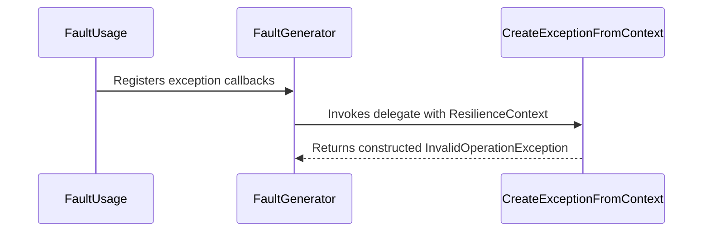

# Section Chaos Engineering Strategy

Relevant source files

The following files were used as context for generating this wiki page:

- [src/Snippets/Docs/Chaos.Fault.cs](https://github.com/App-vNext/Polly/blob/main/src/Snippets/Docs/Chaos.Fault.cs)
- [src/Snippets/Docs/Chaos.Index.cs](https://github.com/App-vNext/Polly/blob/main/src/Snippets/Docs/Chaos.Index.cs)
- [docs/chaos/index.md](https://github.com/App-vNext/Polly/blob/main/docs/chaos/index.md)
- [docs/chaos/fault.md](https://github.com/App-vNext/Polly/blob/main/docs/chaos/fault.md)
- [docs/chaos/outcome.md](https://github.com/App-vNext/Polly/blob/main/docs/chaos/outcome.md)
- [src/Snippets/Docs/Chaos.Outcome.cs](https://github.com/App-vNext/Polly/blob/main/src/Snippets/Docs/Chaos.Outcome.cs)
- [src/Polly.Core/Simmy/Fault/ChaosFaultStrategy.cs](https://github.com/App-vNext/Polly/blob/main/src/Polly.Core/Simmy/Fault/ChaosFaultStrategy.cs)
- [src/Polly.Core/Simmy/Fault/FaultGenerator.cs](https://github.com/App-vNext/Polly/blob/main/src/Polly.Core/Simmy/Fault/FaultGenerator.cs)
- [src/Polly.Core/Simmy/Fault/ChaosFaultPipelineBuilderExtensions.cs](https://github.com/App-vNext/Polly/blob/main/src/Polly.Core/Simmy/Fault/ChaosFaultPipelineBuilderExtensions.cs)
- [src/Polly.Core/Simmy/Behavior/ChaosBehaviorStrategy.cs](https://github.com/App-vNext/Polly/blob/main/src/Polly.Core/Simmy/Behavior/ChaosBehaviorStrategy.cs)
- [src/Polly.Core/Simmy/Fault/ChaosFaultStrategyOptions.cs](https://github.com/App-vNext/Polly/blob/main/src/Polly.Core/Simmy/Fault/ChaosFaultStrategyOptions.cs)
- [docs/chaos/behavior.md](https://github.com/App-vNext/Polly/blob/main/docs/chaos/behavior.md)
- [src/Polly.Core/Simmy/Fault/OnFaultInjectedArguments.cs](https://github.com/App-vNext/Polly/blob/main/src/Polly.Core/Simmy/Fault/OnFaultInjectedArguments.cs)
- [src/Polly.Core/Simmy/Fault/ChaosFaultConstants.cs](https://github.com/App-vNext/Polly/blob/main/src/Polly.Core/Simmy/Fault/ChaosFaultConstants.cs)
- [src/Polly.Core/Simmy/Behavior/ChaosBehaviorPipelineBuilderExtensions.cs](https://github.com/App-vNext/Polly/blob/main/src/Polly.Core/Simmy/Behavior/ChaosBehaviorPipelineBuilderExtensions.cs)
- [src/Polly.Core/Simmy/Latency/ChaosLatencyPipelineBuilderExtensions.cs](https://github.com/App-vNext/Polly/blob/main/src/Polly.Core/Simmy/Latency/ChaosLatencyPipelineBuilderExtensions.cs)
- [src/Polly.Core/Simmy/Latency/ChaosLatencyStrategy.cs](https://github.com/App-vNext/Polly/blob/main/src/Polly.Core/Simmy/Latency/ChaosLatencyStrategy.cs)
- [src/Polly.Core/Simmy/Outcomes/ChaosOutcomePipelineBuilderExtensions.cs](https://github.com/App-vNext/Polly/blob/main/src/Polly.Core/Simmy/Outcomes/ChaosOutcomePipelineBuilderExtensions.cs)
- [src/Polly.Core/Simmy/Outcomes/ChaosOutcomeStrategy.cs](https://github.com/App-vNext/Polly/blob/main/src/Polly.Core/Simmy/Outcomes/ChaosOutcomeStrategy.cs)
- [src/Polly.Core/Simmy/Outcomes/OutcomeGenerator.cs](https://github.com/App-vNext/Polly/blob/main/src/Polly.Core/Simmy/Outcomes/OutcomeGenerator.cs)
- [src/Snippets/Docs/Chaos.Behavior.cs](https://github.com/App-vNext/Polly/blob/main/src/Snippets/Docs/Chaos.Behavior.cs)
- [src/Snippets/Docs/Chaos.Latency.cs](https://github.com/App-vNext/Polly/blob/main/src/Snippets/Docs/Chaos.Latency.cs)
- [src/Polly.Core/ResiliencePipelineBuilder.TResult.cs](https://github.com/App-vNext/Polly/blob/main/src/Polly.Core/ResiliencePipelineBuilder.TResult.cs)

## Overview

Chaos engineering strategies in Polly (provided via the **Simmy** engine) serve as the minimum units of chaos injection within resilience pipelines. Designed around Polly v8, these strategies enable developers to intentionally subvert, delay, fault, or alter executions to validate system resilience under turbulent conditions. Rather than waiting for transient cloud outages, service degradations, or unexpected exceptions to surface in production, chaos strategies let operators control the blast radius and experiment safely.

Sources: [docs/chaos/index.md:11-16](https://github.com/App-vNext/Polly/blob/main/docs/chaos/index.md#L11-L16)

All built-in chaos strategies derive from a common foundational options model (`ChaosStrategyOptions`) and share uniform configuration features such as `InjectionRate`, `InjectionRateGenerator`, `Enabled`, and `EnabledGenerator`. In Polly v8, chaos strategies are **enabled by default** upon registration, requiring explicit opt-out via options if desired.

Sources: [docs/chaos/index.md:181-196](https://github.com/App-vNext/Polly/blob/main/docs/chaos/index.md#L181-L196)

They are typically positioned as the innermost components (the last items added) in a `ResiliencePipelineBuilder`. This placement ensures that any faults or latency injected by Simmy immediately flow outward through pre-configured resilience barriers—such as retries, circuit breakers, and timeouts—allowing teams to verify that their recovery strategies handle anomalies correctly.

Sources: [docs/chaos/index.md:124-131](https://github.com/App-vNext/Polly/blob/main/docs/chaos/index.md#L124-L131)

---

## Chaos Behavior Strategy

The behavior strategy is a proactive chaos mechanism that injects arbitrary custom operations or side effects immediately before an invocation passes through the pipeline. Controlled by `ChaosBehaviorStrategyOptions`, it accepts a required `BehaviorGenerator` delegate receiving `BehaviorGeneratorArguments` and an optional `OnBehaviorInjected` notification delegate.

Sources: [docs/chaos/behavior.md:13-15](https://github.com/App-vNext/Polly/blob/main/docs/chaos/behavior.md#L13-L15)

When `ExecuteCore` runs in `ChaosBehaviorStrategy`, the strategy first evaluates `ShouldInjectAsync(context)`. If injection is triggered, the asynchronous `Behavior` delegate executes. Upon successful completion without throwing an exception, a `Chaos.OnBehavior` telemetry event is reported via `ResilienceStrategyTelemetry`, followed by the invocation of `OnBehaviorInjected` if configured.

Sources: [src/Polly.Core/Simmy/Behavior/ChaosBehaviorStrategy.cs:23-41](https://github.com/App-vNext/Polly/blob/main/src/Polly.Core/Simmy/Behavior/ChaosBehaviorStrategy.cs#L23-L41)

Finally, cancellation is checked via `context.CancellationToken.ThrowIfCancellationRequested()` before forwarding execution to the underlying user callback.

Sources: [src/Polly.Core/Simmy/Behavior/ChaosBehaviorStrategy.cs:43-44](https://github.com/App-vNext/Polly/blob/main/src/Polly.Core/Simmy/Behavior/ChaosBehaviorStrategy.cs#L43-L44)

> [!WARNING]
> Do not use `ChaosBehaviorStrategy` to inject artificial delays using `Task.Delay`. Always use `ChaosLatencyStrategy` instead, as latency strategies correctly manage time providers, execution cancellations, and metrics integration.

Sources: [docs/chaos/behavior.md:148-179](https://github.com/App-vNext/Polly/blob/main/docs/chaos/behavior.md#L148-L179)

---

## Chaos Fault Strategy

The fault strategy is a proactive chaos mechanism designed to inject exceptions into pipeline executions, simulating unexpected dependency failures or network crashes. Configured via `ChaosFaultStrategyOptions`, it relies on a `FaultGenerator` delegate (or the fluent `FaultGenerator` helper class) and supports `OnFaultInjected` telemetry hooks.

Sources: [docs/chaos/fault.md:13-14](https://github.com/App-vNext/Polly/blob/main/docs/chaos/fault.md#L13-L14)

During `ExecuteCore` in `ChaosFaultStrategy`, the strategy checks `ShouldInjectAsync(context)`. If an injection occurs, `FaultGenerator` produces an `Exception?`. If the exception is non-null, `ChaosFaultStrategy` constructs an `OnFaultInjectedArguments` struct, reports a `Chaos.OnFault` telemetry event with `ResilienceEventSeverity.Information`, invokes `OnFaultInjected`, and immediately returns a new `Outcome<TResult>(fault)` short-circuiting the inner callback.

Sources: [src/Polly.Core/Simmy/Fault/ChaosFaultStrategy.cs:22-43](https://github.com/App-vNext/Polly/blob/main/src/Polly.Core/Simmy/Fault/ChaosFaultStrategy.cs#L22-L43)

If the generator returns `null`, the strategy checks cancellation and invokes the next component.

Sources: [src/Polly.Core/Simmy/Fault/ChaosFaultStrategy.cs:46-47](https://github.com/App-vNext/Polly/blob/main/src/Polly.Core/Simmy/Fault/ChaosFaultStrategy.cs#L46-L47)

> [!NOTE]
> The `Chaos.OnFault` telemetry event is reported *only* when an exception is successfully generated and wrapped into a `ValueTask`. If no fault is injected, no telemetry event is emitted, and the `Result` property on the telemetry event is always empty.

Sources: [docs/chaos/fault.md:112-120](https://github.com/App-vNext/Polly/blob/main/docs/chaos/fault.md#L112-L120)

To understand how fault generation workflows operate, consider the call-chain execution walkthrough where a user configures a fault generator that evaluates resilience contexts: `FaultUsage()` calls `FaultGenerator()` which invokes `CreateExceptionFromContext(context)` to construct the exception dynamically.

Sources: [src/Snippets/Docs/Chaos.Fault.cs:12-97](https://github.com/App-vNext/Polly/blob/main/src/Snippets/Docs/Chaos.Fault.cs#L12-L97), [src/Snippets/Docs/Chaos.Fault.cs:125-127](https://github.com/App-vNext/Polly/blob/main/src/Snippets/Docs/Chaos.Fault.cs#L125-L127)

---

## Chaos Latency Strategy

The latency strategy is a proactive chaos mechanism that injects artificial delays into executions before downstream calls occur. Configured via `ChaosLatencyStrategyOptions`, it uses a `LatencyGenerator` delegate (defaulting to a fixed `Latency` timespan) and interacts directly with the injected `TimeProvider`.

Sources: [src/Polly.Core/Simmy/Latency/ChaosLatencyStrategy.cs:5-22](https://github.com/App-vNext/Polly/blob/main/src/Polly.Core/Simmy/Latency/ChaosLatencyStrategy.cs#L5-L22), [docs/chaos/index.md:178-178](https://github.com/App-vNext/Polly/blob/main/docs/chaos/index.md#L178-L178)

Inside `ChaosLatencyStrategy.ExecuteCore`, the engine evaluates `ShouldInjectAsync(context)`. When injection is triggered, it awaits the `LatencyGenerator` result. If the resulting `TimeSpan` is greater than `TimeSpan.Zero`, it reports a `Chaos.OnLatency` telemetry event, pauses execution via `_timeProvider.DelayAsync(latency, context)`, and invokes `OnLatencyInjected` if provided.

Sources: [src/Polly.Core/Simmy/Latency/ChaosLatencyStrategy.cs:30-51](https://github.com/App-vNext/Polly/blob/main/src/Polly.Core/Simmy/Latency/ChaosLatencyStrategy.cs#L30-L51)

Latency injection does not short-circuit the pipeline return value; execution proceeds to call the underlying user callback after the delay finishes.

Sources: [src/Polly.Core/Simmy/Latency/ChaosLatencyStrategy.cs:53-56](https://github.com/App-vNext/Polly/blob/main/src/Polly.Core/Simmy/Latency/ChaosLatencyStrategy.cs#L53-L56)

---

## Chaos Outcome Strategy

The outcome strategy is a reactive chaos mechanism that injects or substitutes fake results or exceptions into pipeline operations. Configured via `ChaosOutcomeStrategyOptions<T>`, it uses an `OutcomeGenerator<T>` delegate to produce an `Outcome<T>?` at runtime and supports `OnOutcomeInjected` notifications.

Sources: [docs/chaos/outcome.md:13-15](https://github.com/App-vNext/Polly/blob/main/docs/chaos/outcome.md#L13-L15), [docs/chaos/outcome.md:83-87](https://github.com/App-vNext/Polly/blob/main/docs/chaos/outcome.md#L83-L87)

In `ChaosOutcomeStrategy<T>.ExecuteCore`, the strategy evaluates `ShouldInjectAsync(context)`. If injection is selected and `_outcomeGenerator` yields a non-null `Outcome<T>`, it reports a `Chaos.OnOutcome` telemetry event with `ResilienceEventSeverity.Information`, invokes `_onOutcomeInjected`, and returns the fake outcome directly without invoking the underlying callback.

Sources: [src/Polly.Core/Simmy/Outcomes/ChaosOutcomeStrategy.cs:19-35](https://github.com/App-vNext/Polly/blob/main/src/Polly.Core/Simmy/Outcomes/ChaosOutcomeStrategy.cs#L19-L35)

> [!CAUTION]
> Avoid using `ChaosOutcomeStrategy<T>` to inject exceptions (`Outcome.FromException`) as an alternative to `ChaosFaultStrategy`. Mixing faults into outcome generators complicates metric tracking and telemetry categorization because outcome strategies log all injected outcomes under the same event channels.

Sources: [docs/chaos/outcome.md:210-259](https://github.com/App-vNext/Polly/blob/main/docs/chaos/outcome.md#L210-L259)

## Related

- [[Chaos Engineering Core]]

