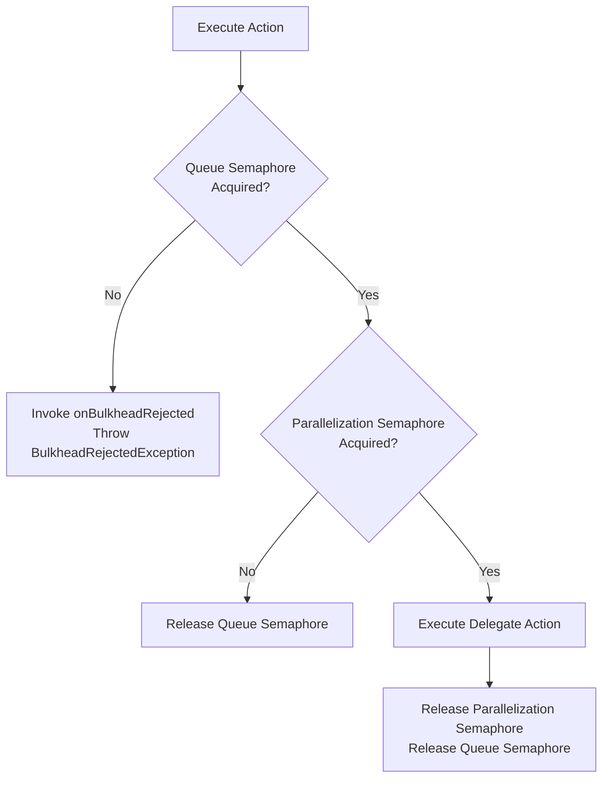
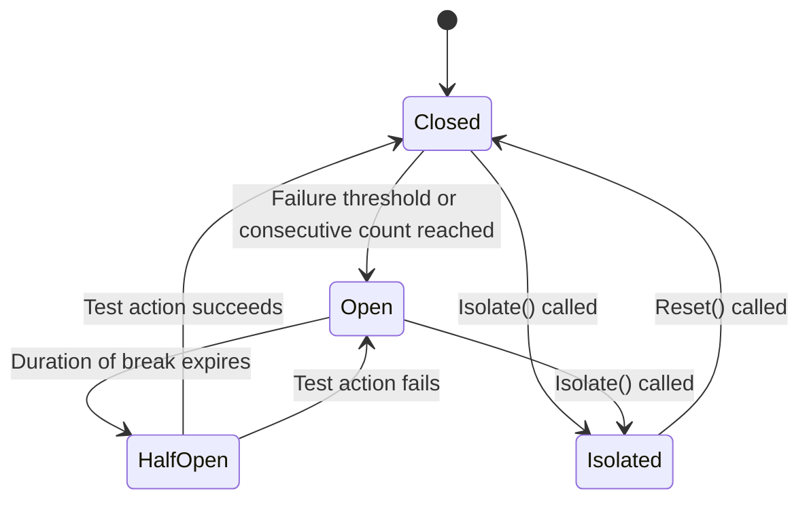
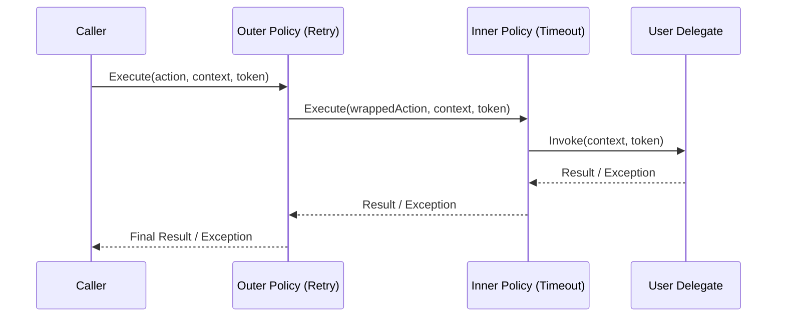

# Section Legacy Infrastructure

<details>
<summary>Relevant source files</summary>

The following files were used as context for generating this wiki page:

- [src/Polly/Policy.ExecuteOverloads.cs](https://github.com/App-vNext/Polly/blob/main/src/Polly/Policy.ExecuteOverloads.cs)
- [src/Polly/AsyncPolicy.ExecuteOverloads.cs](https://github.com/App-vNext/Polly/blob/main/src/Polly/AsyncPolicy.ExecuteOverloads.cs)
- [src/Polly/ISyncPolicy.cs](https://github.com/App-vNext/Polly/blob/main/src/Polly/ISyncPolicy.cs)
- [src/Snippets/Docs/Migration.Execute.cs](https://github.com/App-vNext/Polly/blob/main/src/Snippets/Docs/Migration.Execute.cs)
- [src/Snippets/Docs/Migration.Policies.cs](https://github.com/App-vNext/Polly/blob/main/src/Snippets/Docs/Migration.Policies.cs)
- [src/Snippets/Docs/Migration.CircuitBreaker.cs](https://github.com/App-vNext/Polly/blob/main/src/Snippets/Docs/Migration.CircuitBreaker.cs)
- [src/Polly/Policy.TResult.ExecuteOverloads.cs](https://github.com/App-vNext/Polly/blob/main/src/Polly/Policy.TResult.ExecuteOverloads.cs)
- [src/Snippets/Docs/Migration.Interoperability.cs](https://github.com/App-vNext/Polly/blob/main/src/Snippets/Docs/Migration.Interoperability.cs)
- [src/Polly/Utilities/Wrappers/ResiliencePipelineSyncPolicy.cs](https://github.com/App-vNext/Polly/blob/main/src/Polly/Utilities/Wrappers/ResiliencePipelineSyncPolicy.cs)
- [src/Polly.Core/README.md](https://github.com/App-vNext/Polly/blob/main/src/Polly.Core/README.md)
- [src/Polly/Wrap/PolicyWrapEngine.cs](https://github.com/App-vNext/Polly/blob/main/src/Polly/Wrap/PolicyWrapEngine.cs)
- [src/Polly/Policy.SyncNonGenericImplementation.cs](https://github.com/App-vNext/Polly/blob/main/src/Polly/Policy.SyncNonGenericImplementation.cs)
- [src/Polly/Wrap/AsyncPolicyWrapEngine.cs](https://github.com/App-vNext/Polly/blob/main/src/Polly/Wrap/AsyncPolicyWrapEngine.cs)
- [src/Polly/AsyncPolicy.NonGenericImplementation.cs](https://github.com/App-vNext/Polly/blob/main/src/Polly/AsyncPolicy.NonGenericImplementation.cs)
- [docs/v7/extensibility.md](https://github.com/App-vNext/Polly/blob/main/docs/v7/extensibility.md)
- [docs/general.md](https://github.com/App-vNext/Polly/blob/main/docs/general.md)
- [src/Polly/ResiliencePipelineConversionExtensions.cs](https://github.com/App-vNext/Polly/blob/main/src/Polly/ResiliencePipelineConversionExtensions.cs)
- [src/Polly/ISyncPolicy.TResult.cs](https://github.com/App-vNext/Polly/blob/main/src/Polly/ISyncPolicy.TResult.cs)
- [src/Polly/AsyncPolicy.cs](https://github.com/App-vNext/Polly/blob/main/src/Polly/AsyncPolicy.cs)
- [src/Polly/Bulkhead/BulkheadEngine.cs](https://github.com/App-vNext/Polly/blob/main/src/Polly/Bulkhead/BulkheadEngine.cs)
- [src/Polly/Bulkhead/BulkheadPolicy.cs](https://github.com/App-vNext/Polly/blob/main/src/Polly/Bulkhead/BulkheadPolicy.cs)
- [src/Polly/Caching/CacheEngine.cs](https://github.com/App-vNext/Polly/blob/main/src/Polly/Caching/CacheEngine.cs)
- [src/Polly/Caching/CachePolicy.cs](https://github.com/App-vNext/Polly/blob/main/src/Polly/Caching/CachePolicy.cs)
- [src/Polly/CircuitBreaker/AdvancedCircuitController.cs](https://github.com/App-vNext/Polly/blob/main/src/Polly/CircuitBreaker/AdvancedCircuitController.cs)
- [src/Polly/CircuitBreaker/CircuitBreakerPolicy.cs](https://github.com/App-vNext/Polly/blob/main/src/Polly/CircuitBreaker/CircuitBreakerPolicy.cs)
- [src/Polly/CircuitBreaker/CircuitStateController.cs](https://github.com/App-vNext/Polly/blob/main/src/Polly/CircuitBreaker/CircuitStateController.cs)
- [src/Polly/CircuitBreaker/ConsecutiveCountCircuitController.cs](https://github.com/App-vNext/Polly/blob/main/src/Polly/CircuitBreaker/ConsecutiveCountCircuitController.cs)
- [src/Polly/CircuitBreaker/RollingHealthMetrics.cs](https://github.com/App-vNext/Polly/blob/main/src/Polly/CircuitBreaker/RollingHealthMetrics.cs)
- [src/Polly/Context.cs](https://github.com/App-vNext/Polly/blob/main/src/Polly/Context.cs)
- [src/Polly/Fallback/FallbackEngine.cs](https://github.com/App-vNext/Polly/blob/main/src/Polly/Fallback/FallbackEngine.cs)
</details>

## Overview

The Section Legacy Infrastructure subsystem comprises Polly's v7 policy architecture (`ISyncPolicy`, `IAsyncPolicy`, and their generic `TResult` counterparts), providing object-oriented transient-fault handling constructs, execution engines, and stateful resilience wrappers. This layer underpins synchronous and asynchronous execution flows via explicit `Execute` and `ExecuteAndCapture` overloads, managing execution contexts (`Context`), thread synchronization contexts (`continueOnCapturedContext`), and policy composition (`PolicyWrap`). 

To bridge older architectures with Polly v8's allocation-free `ResiliencePipeline`, this infrastructure includes conversion extensions (`AsSyncPolicy`, `AsAsyncPolicy`) and wrapping adapters (`ResiliencePipelineSyncPolicy`, `ResiliencePipelineAsyncPolicy`) that map v8 execution models directly onto v7 policy abstractions. This design allows legacy applications to adopt modern core resilience strategies without rewriting existing call-site integrations or policy chains.

Sources: [src/Polly/ISyncPolicy.cs:3-7](https://github.com/App-vNext/Polly/blob/main/src/Polly/ISyncPolicy.cs#L3-L7), [src/Polly/ResiliencePipelineConversionExtensions.cs:8-47](https://github.com/App-vNext/Polly/blob/main/src/Polly/ResiliencePipelineConversionExtensions.cs#L8-L47), [src/Polly.Core/README.md:1-10](https://github.com/App-vNext/Polly/blob/main/src/Polly.Core/README.md#L1-L10)

## Legacy Bulkhead and Caching

The bulkhead and caching policies implement reactive and proactive constraints on delegate execution by controlling concurrent access and short-circuiting calls through cache lookups. The `BulkheadPolicy` and `BulkheadPolicy<TResult>` classes utilize two `SemaphoreSlim` instances created by `BulkheadSemaphoreFactory`: one governing maximum concurrent parallelization (`_maxParallelizationSemaphore`) and another governing maximum queued actions waiting for execution (`_maxQueuedActionsSemaphore`). 

When an action enters `BulkheadEngine.Implementation`, it first attempts to acquire a slot in the queue semaphore with a zero timeout (`TimeSpan.Zero`). If the queue is exhausted, `BulkheadEngine` invokes the `onBulkheadRejected` callback and immediately throws a `BulkheadRejectedException`. If the queue acquisition succeeds, it acquires the parallelization semaphore, executes the underlying delegate, and safely releases both semaphores within nested `try/finally` blocks (ignoring `ObjectDisposedException` during cleanup).



Sources: [src/Polly/Bulkhead/BulkheadEngine.cs:5-50](https://github.com/App-vNext/Polly/blob/main/src/Polly/Bulkhead/BulkheadEngine.cs#L5-L50), [src/Polly/Bulkhead/BulkheadPolicy.cs:15-44](https://github.com/App-vNext/Polly/blob/main/src/Polly/Bulkhead/BulkheadPolicy.cs#L15-L44)

The caching infrastructure (`CachePolicy`, `CachePolicy<TResult>`, and `CacheEngine`) intercepts execution to evaluate a dynamic cache key via `cacheKeyStrategy(context)`. If the resolved key is `null`, execution bypasses the cache entirely. Otherwise, `CacheEngine` queries `cacheProvider.TryGet(cacheKey)` inside a try-catch block; any exception thrown by the cache provider invokes `onCacheGetError` while treating the lookup as a cache miss. Upon a cache hit, `onCacheGet` is invoked and the cached value is returned directly. Upon a cache miss, the underlying action executes, its result is evaluated against `ttlStrategy.GetTtl(context, result)`, and if `ttl.Timespan > TimeSpan.Zero`, the result is written back via `cacheProvider.Put` (with errors caught and routed to `onCachePutError`).

> [!NOTE]
> The synchronous `CachePolicy` implementation for void-returning actions (`Implementation(Action<Context, CancellationToken>, ...)` validates that the action is non-null and acts as a transparent pass-through (NOOP) because void methods produce no result values to cache.

Sources: [src/Polly/Caching/CacheEngine.cs:4-72](https://github.com/App-vNext/Polly/blob/main/src/Polly/Caching/CacheEngine.cs#L4-L72), [src/Polly/Caching/CachePolicy.cs:41-73](https://github.com/App-vNext/Polly/blob/main/src/Polly/Caching/CachePolicy.cs#L41-L73)

## Legacy Circuit Breaker

The legacy circuit breaker subsystem manages automated state transitions between `Closed`, `Open`, `HalfOpen`, and `Isolated` states using controller implementations derived from `CircuitStateController<TResult>`. Circuit controllers fall into two primary types: `ConsecutiveCountCircuitController<TResult>`, which tracks sequential failures against `_exceptionsAllowedBeforeBreaking`, and `AdvancedCircuitController<TResult>`, which evaluates a sliding failure ratio against a minimum throughput threshold using either `SingleHealthMetrics` or `RollingHealthMetrics`.

When evaluating health in `AdvancedCircuitController`, sampling durations shorter than `ResolutionOfCircuitTimer * RollingHealthMetrics.WindowCount` instantiate `SingleHealthMetrics`; otherwise, they instantiate `RollingHealthMetrics`, which subdivides the sampling duration into 10 discrete time windows (`WindowCount = 10`).



Sources: [src/Polly/CircuitBreaker/AdvancedCircuitController.cs:3-28](https://github.com/App-vNext/Polly/blob/main/src/Polly/CircuitBreaker/AdvancedCircuitController.cs#L3-L28), [src/Polly/CircuitBreaker/CircuitStateController.cs:3-28](https://github.com/App-vNext/Polly/blob/main/src/Polly/CircuitBreaker/CircuitStateController.cs#L3-L28), [src/Polly/CircuitBreaker/RollingHealthMetrics.cs:4-21](https://github.com/App-vNext/Polly/blob/main/src/Polly/CircuitBreaker/RollingHealthMetrics.cs#L4-L21)

Pre-execution validation occurs in `CircuitStateController.OnActionPreExecute()`, which inspects the current `CircuitState`. If the circuit is `Open`, it checks whether the break duration has elapsed via `PermitHalfOpenCircuitTest()`. 

> [!IMPORTANT]
> `PermitHalfOpenCircuitTest()` uses `Interlocked.CompareExchange(ref BlockedTill, ...)` to ensure that exactly one concurrent thread wins the race to execute the trial call in the `HalfOpen` state, preventing race conditions where multiple threads flood a recovering dependency.

If the trial permit fails or the state is strictly `Open`, a `BrokenCircuitException` is thrown. If the state is `Isolated`, an `IsolatedCircuitException` is thrown immediately.

Sources: [src/Polly/CircuitBreaker/CircuitStateController.cs:114-165](https://github.com/App-vNext/Polly/blob/main/src/Polly/CircuitBreaker/CircuitStateController.cs#L114-L165)

During failure paths, `OnActionFailure` executes the call-chain sequence `OnActionFailure` → `Break_NeedsLock` → `BreakFor_NeedsLock`, acquiring a timed lock, setting `BlockedTill`, transitioning `InternalCircuitState` to `CircuitState.Open`, and invoking the `OnBreak` delegate callback.

Sources: [src/Polly/CircuitBreaker/AdvancedCircuitController.cs:69-101](https://github.com/App-vNext/Polly/blob/main/src/Polly/CircuitBreaker/AdvancedCircuitController.cs#L69-L101), [src/Polly/CircuitBreaker/CircuitStateController.cs:80-96](https://github.com/App-vNext/Polly/blob/main/src/Polly/CircuitBreaker/CircuitStateController.cs#L80-L96), [src/Polly/CircuitBreaker/ConsecutiveCountCircuitController.cs:47-75](https://github.com/App-vNext/Polly/blob/main/src/Polly/CircuitBreaker/ConsecutiveCountCircuitController.cs#L47-L75)

## Legacy Fallback and Rate Limit

The fallback infrastructure managed by `FallbackEngine` intercepts execution failures and evaluated results to provide substitute recovery values. When `FallbackEngine.Implementation` executes, it wraps the user delegate inside a `try` block protected by `cancellationToken.ThrowIfCancellationRequested()`. If the delegate completes successfully, its result is tested against `shouldHandleResultPredicates.AnyMatch(result)`. If matched, a `DelegateResult<TResult>` containing the result is constructed. If the delegate throws an exception, `shouldHandleExceptionPredicates.FirstMatchOrDefault(ex)` searches for a matching predicate; unhandled exceptions bypass the fallback engine entirely and are rethrown.

```csharp
// Example: Executing an action through a fallback policy in Polly v7
ISyncPolicy<int> fallbackPolicy = Policy
    .Handle<InvalidOperationException>()
    .Fallback(
        fallbackValue: -1,
        onFallback: (exception, context) => 
        {
            // Log fallback execution
        });

int result = fallbackPolicy.Execute(() => 
{
    throw new InvalidOperationException("Failure");
});
// result equals -1
```

Sources: [src/Polly/Fallback/FallbackEngine.cs:3-45](https://github.com/App-vNext/Polly/blob/main/src/Polly/Fallback/FallbackEngine.cs#L3-L45), [src/Snippets/Docs/Migration.Interoperability.cs:10-30](https://github.com/App-vNext/Polly/blob/main/src/Snippets/Docs/Migration.Interoperability.cs#L10-L30)

Interoperability with modern rate limiting and custom strategies is achieved through `ResiliencePipelineConversionExtensions`. A v8 `ResiliencePipeline` or `ResiliencePipeline<TResult>` can be converted into a v7 `ISyncPolicy`, `IAsyncPolicy`, `ISyncPolicy<TResult>`, or `IAsyncPolicy<TResult>` using `AsSyncPolicy()` or `AsAsyncPolicy()`. These conversion methods wrap the pipeline inside `ResiliencePipelineSyncPolicy` or `ResiliencePipelineAsyncPolicy`, bridging v7 context lifecycle methods (`ResilienceContextFactory.Create` and `Cleanup`) directly into v8 pipeline executions. This enables legacy policy compositions (`Policy.Wrap`) to incorporate modern core strategies like rate limiters (`FixedWindowRateLimiter`).

Sources: [src/Polly/ResiliencePipelineConversionExtensions.cs:8-47](https://github.com/App-vNext/Polly/blob/main/src/Polly/ResiliencePipelineConversionExtensions.cs#L8-L47), [src/Polly/Utilities/Wrappers/ResiliencePipelineSyncPolicy.cs:3-55](https://github.com/App-vNext/Polly/blob/main/src/Polly/Utilities/Wrappers/ResiliencePipelineSyncPolicy.cs#L3-L55), [src/Snippets/Docs/Migration.Interoperability.cs:10-30](https://github.com/App-vNext/Polly/blob/main/src/Snippets/Docs/Migration.Interoperability.cs#L10-L30)

## Legacy Policy Composition

Policy composition in Polly v7 is managed by `PolicyWrapEngine` and `AsyncPolicyWrapEngine`. These utility engines coordinate nested policy execution by executing an outer policy whose delegate invokes an inner policy. Overloads accommodate every combination of synchronous and asynchronous, generic and non-generic policy wrappers.



Sources: [src/Polly/Wrap/PolicyWrapEngine.cs:3-44](https://github.com/App-vNext/Polly/blob/main/src/Polly/Wrap/PolicyWrapEngine.cs#L3-L44), [src/Polly/Wrap/AsyncPolicyWrapEngine.cs:3-89](https://github.com/App-vNext/Polly/blob/main/src/Polly/Wrap/AsyncPolicyWrapEngine.cs#L3-L89)

During execution wrapping, context propagation relies on `SetPolicyContext` and `RestorePolicyContext` to manage `Context.PolicyKey` and `Context.PolicyWrapKey`. The outermost policy's key populates `PolicyWrapKey`, while each individual policy populates `PolicyKey`.

Sources: [src/Polly/Policy.ExecuteOverloads.cs:60-77](https://github.com/App-vNext/Polly/blob/main/src/Polly/Policy.ExecuteOverloads.cs#L60-L77), [src/Polly/Context.cs:30-40](https://github.com/App-vNext/Polly/blob/main/src/Polly/Context.cs#L30-L40)

## Legacy Policy Core

The legacy policy core establishes the base abstractions for synchronous and asynchronous execution flows via `Policy`, `AsyncPolicy`, `ISyncPolicy`, and `IAsyncPolicy`. The execution entry points provide extensive overloads accepting `Action`, `Func<TResult>`, `Context`, `IDictionary<string, object>`, and `CancellationToken`.

| Execution Method Signature | Return Type | Context Support | Description |
| :--- | :--- | :--- | :--- |
| `Execute(Action action)` | `void` | None (Default) | Executes a synchronous action without context. |
| `Execute(Action<Context, CancellationToken> action, Context context, CancellationToken token)` | `void` | Explicit `Context` & Token | Core synchronous execution template with context management. |
| `Execute<TResult>(Func<Context, CancellationToken, TResult> action, Context context, CancellationToken token)` | `TResult` | Explicit `Context` & Token | Core synchronous value-returning execution template. |
| `ExecuteAndCapture(Action action)` | `PolicyResult` | None (Default) | Executes action and captures outcome success/failure details. |
| `ExecuteAndCapture<TResult>(Func<Context, CancellationToken, TResult> action, Context context, CancellationToken token)` | `PolicyResult<TResult>` | Explicit `Context` & Token | Executes generic action and captures result or exception details. |

Sources: [src/Polly/Policy.ExecuteOverloads.cs:7-342](https://github.com/App-vNext/Polly/blob/main/src/Polly/Policy.ExecuteOverloads.cs#L7-L342), [src/Polly/AsyncPolicy.ExecuteOverloads.cs:7-540](https://github.com/App-vNext/Polly/blob/main/src/Polly/AsyncPolicy.ExecuteOverloads.cs#L7-L540), [src/Polly/ISyncPolicy.cs:8-226](https://github.com/App-vNext/Polly/blob/main/src/Polly/ISyncPolicy.cs#L8-L226)

When an execution method is invoked, validation ensures the `Context` is non-null (`ArgumentNullException`), sets up the policy context stack via `SetPolicyContext`, invokes the abstract `Implementation` or `ImplementationAsync` method, and guarantees cleanup in a `finally` block via `RestorePolicyContext`. For `ExecuteAndCapture` variants, exceptions are intercepted (disabling unhandled exception filters where appropriate) and packaged into a `PolicyResult` or `PolicyResult<TResult>` object detailing the failure type, exception, and captured result.

Sources: [src/Polly/Policy.ExecuteOverloads.cs:60-77](https://github.com/App-vNext/Polly/blob/main/src/Polly/Policy.ExecuteOverloads.cs#L60-L77), [src/Polly/AsyncPolicy.ExecuteOverloads.cs:103-111](https://github.com/App-vNext/Polly/blob/main/src/Polly/AsyncPolicy.ExecuteOverloads.cs#L103-L111), [src/Polly/Policy.SyncNonGenericImplementation.cs:3-28](https://github.com/App-vNext/Polly/blob/main/src/Polly/Policy.SyncNonGenericImplementation.cs#L3-L28)

## Legacy Policy Registry

The policy registry infrastructure operates in conjunction with execution contexts and policy keys (`PolicyKey`) to facilitate logging, telemetry, and identification across disparate call sites. Every policy instance supports setting a unique user-definable key via `WithPolicyKey(string policyKey)`, which must be assigned before the policy is first used and can only be set once.

```csharp
// Example: Configuring and utilizing policy keys and context data in v7
ISyncPolicy policy = Policy
    .Handle<Exception>()
    .Retry(3)
    .WithPolicyKey("MyRetryPolicy");

var context = new Context("MyOperationKey");
policy.Execute(() =>
{
    // Execution logic
}, context);

string policyKey = context.PolicyKey; // "MyRetryPolicy"
string operationKey = context.OperationKey; // "MyOperationKey"
```

Sources: [src/Polly/ISyncPolicy.cs:8-15](https://github.com/App-vNext/Polly/blob/main/src/Polly/ISyncPolicy.cs#L8-L15), [src/Polly/Context.cs:30-46](https://github.com/App-vNext/Polly/blob/main/src/Polly/Context.cs#L30-L46)

The `Context` class acts as the execution state bag accompanying each call. It provides a unique `CorrelationId` (a lazily initialized `Guid`), an `OperationKey` distinguishing different call sites sharing the same reusable policy instance, and string-to-object dictionary storage for user-defined properties.

Sources: [src/Polly/Context.cs:3-60](https://github.com/App-vNext/Polly/blob/main/src/Polly/Context.cs#L3-L60)

## Legacy Retry and Timeout

The retry and timeout infrastructure integrates closely with the core execution engines and cancellation tokens. As shown in migration and interop specifications, retry policies handle specified exceptions or result predicates across multiple attempts (`WaitAndRetry`, `RetryAsync`), honoring cancellation tokens passed to `Execute` or `ExecuteAsync`.

```csharp
// Example: Executing asynchronous timeout and retry strategies in v7 migration patterns
IAsyncPolicy<int> asyncPolicy = Policy
    .Handle<Exception>()
    .WaitAndRetryAsync(3, retryAttempt => TimeSpan.FromSeconds(retryAttempt));

PolicyResult<int> result = await asyncPolicy.ExecuteAndCaptureAsync(
    async (token) => await MethodAsync(token), 
    CancellationToken.None);
```

Sources: [src/Snippets/Docs/Migration.Execute.cs:12-19](https://github.com/App-vNext/Polly/blob/main/src/Snippets/Docs/Migration.Execute.cs#L12-L19), [src/Snippets/Docs/Migration.Policies.cs:12-32](https://github.com/App-vNext/Polly/blob/main/src/Snippets/Docs/Migration.Policies.cs#L12-L32)

Design trade-offs inherent in the legacy infrastructure include:

| Design Choice | Benefit | Cost |
| :--- | :--- | :--- |
| **Object-Oriented Policy Hierarchies** (`Policy`, `AsyncPolicy`) | Strongly typed fluent builders and clear separation of sync/async execution models. | Higher allocation overhead and parallel inheritance trees for generic vs. non-generic variants. |
| **Semaphore-Based Bulkhead Isolation** (`BulkheadEngine`) | Simple concurrency and queue bounding using standard BCL synchronization primitives. | Potential thread blockage and `ObjectDisposedException` race conditions if policies are disposed while actions are active. |
| **Wrapper-Based Pipeline Interoperability** (`ResiliencePipelineSyncPolicy`) | Allows legacy v7 codebases to consume modern v8 `ResiliencePipeline` instances without rewriting policy compositions. | Extra allocation overhead and wrapper abstraction layers bridging `ResilienceContext` and v7 `Context`. |

Sources: [src/Polly/Bulkhead/BulkheadEngine.cs:5-50](https://github.com/App-vNext/Polly/blob/main/src/Polly/Bulkhead/BulkheadEngine.cs#L5-L50), [src/Polly/Bulkhead/BulkheadPolicy.cs:56-67](https://github.com/App-vNext/Polly/blob/main/src/Polly/Bulkhead/BulkheadPolicy.cs#L56-L67), [src/Polly/Utilities/Wrappers/ResiliencePipelineSyncPolicy.cs:3-55](https://github.com/App-vNext/Polly/blob/main/src/Polly/Utilities/Wrappers/ResiliencePipelineSyncPolicy.cs#L3-L55)

## Related

- [[Interop Bridge Mechanics]]
- [[Pipeline Registry]]
- [[Section Reactive Strategies Strategy]]

