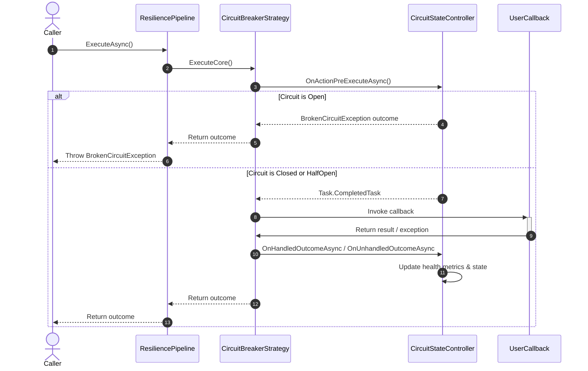
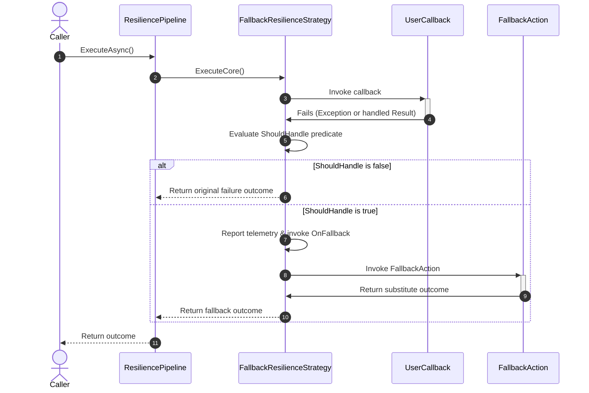
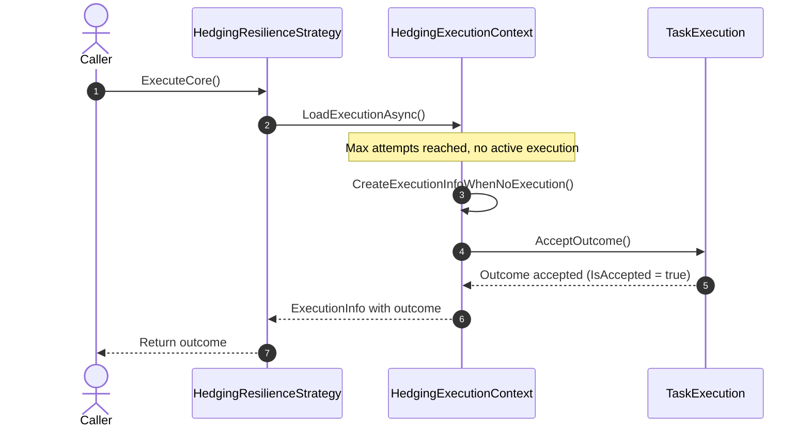
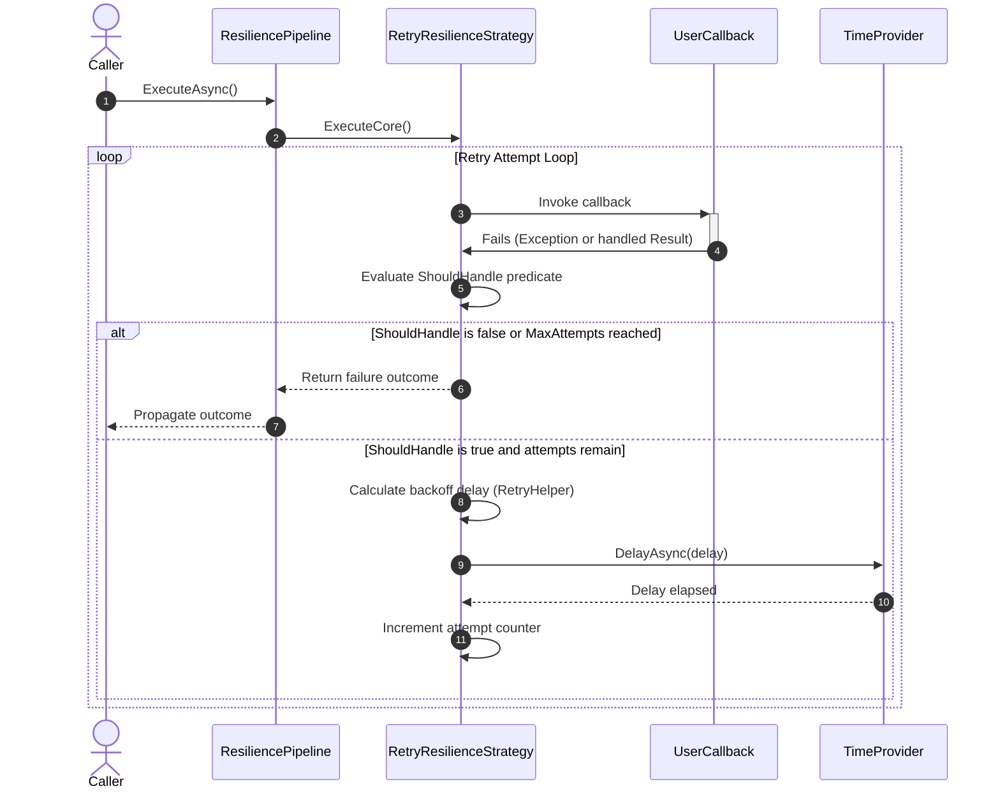

# Section Reactive Strategies Strategy

Relevant source files

The following files were used as context for generating this wiki page:

- [src/Polly.Core/CircuitBreaker/Controller/CircuitStateController.cs](https://github.com/App-vNext/Polly/blob/main/src/Polly.Core/CircuitBreaker/Controller/CircuitStateController.cs)
- [src/Polly/CircuitBreaker/AdvancedCircuitController.cs](https://github.com/App-vNext/Polly/blob/main/src/Polly/CircuitBreaker/AdvancedCircuitController.cs)
- [src/Polly/CircuitBreaker/CircuitStateController.cs](https://github.com/App-vNext/Polly/blob/main/src/Polly/CircuitBreaker/CircuitStateController.cs)
- [docs/strategies/circuit-breaker.md](https://github.com/App-vNext/Polly/blob/main/docs/strategies/circuit-breaker.md)
- [src/Polly/CircuitBreaker/ConsecutiveCountCircuitController.cs](https://github.com/App-vNext/Polly/blob/main/src/Polly/CircuitBreaker/ConsecutiveCountCircuitController.cs)
- [src/Snippets/Docs/CircuitBreaker.cs](https://github.com/App-vNext/Polly/blob/main/src/Snippets/Docs/CircuitBreaker.cs)
- [src/Snippets/Docs/Migration.CircuitBreaker.cs](https://github.com/App-vNext/Polly/blob/main/src/Snippets/Docs/Migration.CircuitBreaker.cs)
- [src/Polly.Core/CircuitBreaker/Controller/AdvancedCircuitBehavior.cs](https://github.com/App-vNext/Polly/blob/main/src/Polly.Core/CircuitBreaker/Controller/AdvancedCircuitBehavior.cs)
- [src/Polly.Core/CircuitBreaker/CircuitBreakerResilienceStrategy.cs](https://github.com/App-vNext/Polly/blob/main/src/Polly.Core/CircuitBreaker/CircuitBreakerResilienceStrategy.cs)
- [README.md](https://github.com/App-vNext/Polly/blob/main/README.md)
- [src/Polly/CircuitBreaker/CircuitBreakerEngine.cs](https://github.com/App-vNext/Polly/blob/main/src/Polly/CircuitBreaker/CircuitBreakerEngine.cs)
- [src/Polly.Core/CircuitBreaker/Controller/CircuitBehavior.cs](https://github.com/App-vNext/Polly/blob/main/src/Polly.Core/CircuitBreaker/Controller/CircuitBehavior.cs)
- [src/Polly/CircuitBreaker/ICircuitController.cs](https://github.com/App-vNext/Polly/blob/main/src/Polly/CircuitBreaker/ICircuitController.cs)
- [src/Polly/CircuitBreaker/CircuitBreakerPolicy.cs](https://github.com/App-vNext/Polly/blob/main/src/Polly/CircuitBreaker/CircuitBreakerPolicy.cs)
- [docs/strategies/index.md](https://github.com/App-vNext/Polly/blob/main/docs/strategies/index.md)
- [src/Polly.Core/CircuitBreaker/CircuitBreakerManualControl.cs](https://github.com/App-vNext/Polly/blob/main/src/Polly.Core/CircuitBreaker/CircuitBreakerManualControl.cs)
- [src/Polly.Core/CircuitBreaker/CircuitBreakerStateProvider.cs](https://github.com/App-vNext/Polly/blob/main/src/Polly.Core/CircuitBreaker/CircuitBreakerStateProvider.cs)
- [src/Polly.Core/CircuitBreaker/Health/RollingHealthMetrics.cs](https://github.com/App-vNext/Polly/blob/main/src/Polly.Core/CircuitBreaker/Health/RollingHealthMetrics.cs)
- [src/Polly.Core/Fallback/FallbackHandler.cs](https://github.com/App-vNext/Polly/blob/main/src/Polly.Core/Fallback/FallbackHandler.cs)
- [src/Polly.Core/Fallback/FallbackResiliencePipelineBuilderExtensions.cs](https://github.com/App-vNext/Polly/blob/main/src/Polly.Core/Fallback/FallbackResiliencePipelineBuilderExtensions.cs)
- [src/Polly.Core/Fallback/FallbackResilienceStrategy.cs](https://github.com/App-vNext/Polly/blob/main/src/Polly.Core/Fallback/FallbackResilienceStrategy.cs)
- [src/Polly.Core/Hedging/Controller/HedgingController.cs](https://github.com/App-vNext/Polly/blob/main/src/Polly.Core/Hedging/Controller/HedgingController.cs)
- [src/Polly.Core/Hedging/Controller/HedgingExecutionContext.cs](https://github.com/App-vNext/Polly/blob/main/src/Polly.Core/Hedging/Controller/HedgingExecutionContext.cs)
- [src/Polly.Core/Hedging/Controller/TaskExecution.cs](https://github.com/App-vNext/Polly/blob/main/src/Polly.Core/Hedging/Controller/TaskExecution.cs)
- [src/Polly.Core/Hedging/HedgingResilienceStrategy.cs](https://github.com/App-vNext/Polly/blob/main/src/Polly.Core/Hedging/HedgingResilienceStrategy.cs)
- [src/Polly.Core/Retry/RetryHelper.cs](https://github.com/App-vNext/Polly/blob/main/src/Polly.Core/Retry/RetryHelper.cs)
- [src/Polly.Core/Retry/RetryResiliencePipelineBuilderExtensions.cs](https://github.com/App-vNext/Polly/blob/main/src/Polly.Core/Retry/RetryResiliencePipelineBuilderExtensions.cs)
- [src/Polly.Core/Retry/RetryResilienceStrategy.cs](https://github.com/App-vNext/Polly/blob/main/src/Polly.Core/Retry/RetryResilienceStrategy.cs)
- [src/Polly.Core/Retry/RetryStrategyOptions.cs](https://github.com/App-vNext/Polly/blob/main/src/Polly.Core/Retry/RetryStrategyOptions.cs)

## Overview

### Overview Introduction

Reactive resilience strategies in Polly evaluate user-defined callbacks after execution, inspecting whether the returned outcome (result or exception) matches user-configured predicates (`ShouldHandle`). These strategies form the core reactive fault-handling tier of Polly's pipeline architecture, intercepting runtime failures to apply compensating behaviors like automatic re-execution, circuit breaking, fallback substitution, or parallel request hedging.
Sources: [README.md:109-121](https://github.com/App-vNext/Polly/blob/main/README.md#L109-L121)

All reactive strategies inherit from or integrate with core pipeline abstractions, sharing a common interface signature that evaluates `Outcome<T>` objects against strategy-specific parameters (`AttemptNumber`, `FailureRate`, `SamplingDuration`, etc.) inside `ExecuteCore` execution loops.
Sources: [docs/strategies/index.md:5-9](https://github.com/App-vNext/Polly/blob/main/docs/strategies/index.md#L5-L9)

By decoupling fault evaluation from proactive resource control (such as timeouts or rate limiters), reactive strategies focus strictly on operational recovery and error containment.
Sources: [docs/strategies/index.md:5-9](https://github.com/App-vNext/Polly/blob/main/docs/strategies/index.md#L5-L9)

---

## Circuit Breaker Strategy

### Overview and State Mechanics

The circuit breaker strategy monitors execution outcomes over a sampling window, tracking failure ratios or consecutive fault counts. When faults exceed configured thresholds, the strategy transitions from `Closed` to `Open`, shortcutting subsequent executions by immediately throwing a `BrokenCircuitException` containing a `RetryAfter` property. After a preset or dynamically generated break duration elapses, the circuit transitions to `HalfOpen` to execute a trial probe. Depending on whether the probe succeeds or fails, the circuit either resets back to `Closed` or returns to `Open`.
Sources: [docs/strategies/circuit-breaker.md:17-18](https://github.com/App-vNext/Polly/blob/main/docs/strategies/circuit-breaker.md#L17-L18)

The execution walkthrough begins when `CircuitBreakerResilienceStrategy.ExecuteCore` invokes `_controller.OnActionPreExecuteAsync(context)`. Inside `CircuitStateController`, thread safety is maintained via a private lock object `_lock`.
Sources: [src/Polly.Core/CircuitBreaker/CircuitBreakerResilienceStrategy.cs:30-35](https://github.com/App-vNext/Polly/blob/main/src/Polly.Core/CircuitBreaker/CircuitBreakerResilienceStrategy.cs#L30-L35), [src/Polly.Core/CircuitBreaker/Controller/CircuitStateController.cs:8-10](https://github.com/App-vNext/Polly/blob/main/src/Polly.Core/CircuitBreaker/Controller/CircuitStateController.cs#L8-L10)

1. `OnActionPreExecuteAsync` checks if the circuit state is `Open` and whether the current time exceeds `_blockedUntil` via `PermitHalfOpenCircuitTest_NeedsLock()`.
Sources: [src/Polly.Core/CircuitBreaker/Controller/CircuitStateController.cs:135-136](https://github.com/App-vNext/Polly/blob/main/src/Polly.Core/CircuitBreaker/Controller/CircuitStateController.cs#L135-L136)
2. If the break duration has expired, `_halfOpenAttempts` increments, `_circuitState` transitions to `CircuitState.HalfOpen`, and an `OnHalfOpen` telemetry event is reported.
Sources: [src/Polly.Core/CircuitBreaker/Controller/CircuitStateController.cs:138-141](https://github.com/App-vNext/Polly/blob/main/src/Polly.Core/CircuitBreaker/Controller/CircuitStateController.cs#L138-L141)
3. If the state is `Open` or `Isolated`, `CreateBrokenCircuitException()` or `IsolatedCircuitException` is generated and returned inside an outcome wrapper, shortcutting the user callback.
Sources: [src/Polly.Core/CircuitBreaker/Controller/CircuitStateController.cs:144-150](https://github.com/App-vNext/Polly/blob/main/src/Polly.Core/CircuitBreaker/Controller/CircuitStateController.cs#L144-L150)
4. If the circuit is `Closed` or successfully half-opened, the user callback executes. Upon completion, `CircuitBreakerResilienceStrategy` evaluates the outcome against `_handler(args)`.
Sources: [src/Polly.Core/CircuitBreaker/CircuitBreakerResilienceStrategy.cs:37-51](https://github.com/App-vNext/Polly/blob/main/src/Polly.Core/CircuitBreaker/CircuitBreakerResilienceStrategy.cs#L37-L51)
5. If handled, `OnHandledOutcomeAsync` invokes `_behavior.OnActionFailure` and opens the circuit if thresholds are met. If unhandled, `OnUnhandledOutcomeAsync` registers success and closes the circuit if in `HalfOpen`.
Sources: [src/Polly.Core/CircuitBreaker/Controller/CircuitStateController.cs:185-238](https://github.com/App-vNext/Polly/blob/main/src/Polly.Core/CircuitBreaker/Controller/CircuitStateController.cs#L185-L238)

Sources: [src/Polly.Core/CircuitBreaker/CircuitBreakerResilienceStrategy.cs:30-60](https://github.com/App-vNext/Polly/blob/main/src/Polly.Core/CircuitBreaker/CircuitBreakerResilienceStrategy.cs#L30-L60), [src/Polly.Core/CircuitBreaker/Controller/CircuitStateController.cs:88-238](https://github.com/App-vNext/Polly/blob/main/src/Polly.Core/CircuitBreaker/Controller/CircuitStateController.cs#L88-L238)

> [!WARNING]
> A circuit breaker rethrows all handled exceptions rather than swallowing them. Its purpose is fault detection and load shedding, not automatic retry execution; combine it with a Retry strategy if retries are required.
Sources: [docs/strategies/circuit-breaker.md:19-21](https://github.com/App-vNext/Polly/blob/main/docs/strategies/circuit-breaker.md#L19-L21)

---

## Fallback Strategy

### Execution Mechanics

The fallback strategy provides a graceful degradation mechanism when an executed operation fails or returns an unhandled result. If an execution throws an exception or returns a result that satisfies the user-defined `ShouldHandle` predicate, the strategy intercepts the failure, reports an `OnFallback` telemetry event, invokes optional user notification hooks, and executes the `FallbackAction` to return a substitute value or result.
Sources: [src/Polly.Core/Fallback/FallbackResilienceStrategy.cs:20-55](https://github.com/App-vNext/Polly/blob/main/src/Polly.Core/Fallback/FallbackResilienceStrategy.cs#L20-L55), [README.md:118-119](https://github.com/App-vNext/Polly/blob/main/README.md#L118-L119)

1. `FallbackResilienceStrategy.ExecuteCore` awaits the primary `callback(context, state)`. Any thrown exception is caught and wrapped into an `Outcome<T>` instance.
Sources: [src/Polly.Core/Fallback/FallbackResilienceStrategy.cs:20-30](https://github.com/App-vNext/Polly/blob/main/src/Polly.Core/Fallback/FallbackResilienceStrategy.cs#L20-L30)
2. The strategy instantiates `FallbackPredicateArguments<T>(context, outcome)` and evaluates `_handler.ShouldHandle`.
Sources: [src/Polly.Core/Fallback/FallbackResilienceStrategy.cs:32-33](https://github.com/App-vNext/Polly/blob/main/src/Polly.Core/Fallback/FallbackResilienceStrategy.cs#L32-L33)
3. If `ShouldHandle` returns `false`, the original outcome is returned immediately without intervention.
Sources: [src/Polly.Core/Fallback/FallbackResilienceStrategy.cs:34-36](https://github.com/App-vNext/Polly/blob/main/src/Polly.Core/Fallback/FallbackResilienceStrategy.cs#L34-L36)
4. If `ShouldHandle` returns `true`, the strategy reports a warning telemetry event (`FallbackConstants.OnFallback`) with `OnFallbackArguments<T>`.
Sources: [src/Polly.Core/Fallback/FallbackResilienceStrategy.cs:38-41](https://github.com/App-vNext/Polly/blob/main/src/Polly.Core/Fallback/FallbackResilienceStrategy.cs#L38-L41)
5. If `_onFallback` delegate is configured, it is invoked asynchronously.
Sources: [src/Polly.Core/Fallback/FallbackResilienceStrategy.cs:42-45](https://github.com/App-vNext/Polly/blob/main/src/Polly.Core/Fallback/FallbackResilienceStrategy.cs#L42-L45)
6. Finally, `_handler.ActionGenerator` is invoked with `FallbackActionArguments<T>`, returning the fallback substitute outcome. Any exception thrown during fallback generation is caught and returned as an exception outcome.
Sources: [src/Polly.Core/Fallback/FallbackResilienceStrategy.cs:47-54](https://github.com/App-vNext/Polly/blob/main/src/Polly.Core/Fallback/FallbackResilienceStrategy.cs#L47-L54)

Sources: [src/Polly.Core/Fallback/FallbackResilienceStrategy.cs:20-55](https://github.com/App-vNext/Polly/blob/main/src/Polly.Core/Fallback/FallbackResilienceStrategy.cs#L20-L55)

> [!NOTE]
> If the fallback action itself throws an exception, `FallbackResilienceStrategy` catches the exception and returns it as a wrapped failure outcome rather than letting it propagate unhandled.
Sources: [src/Polly.Core/Fallback/FallbackResilienceStrategy.cs:47-54](https://github.com/App-vNext/Polly/blob/main/src/Polly.Core/Fallback/FallbackResilienceStrategy.cs#L47-L54)

---

## Hedging Strategy

### Execution Walkthrough and Coordination

The hedging strategy mitigates tail latency and transient slowness by executing parallel fallback actions when primary execution takes longer than a configured `HedgingDelay` (or custom generator interval). It maintains a pool of `TaskExecution<T>` instances managed by `HedgingController` and `HedgingExecutionContext`.
Sources: [src/Polly.Core/Hedging/HedgingResilienceStrategy.cs:34-84](https://github.com/App-vNext/Polly/blob/main/src/Polly.Core/Hedging/HedgingResilienceStrategy.cs#L34-L84), [README.md:120-120](https://github.com/App-vNext/Polly/blob/main/README.md#L120-L120)

The verified call chain `ExecuteCore` → `LoadExecutionAsync` → `CreateExecutionInfoWhenNoExecution` → `AcceptOutcome` proceeds through the following specific steps:
1. `HedgingResilienceStrategy.ExecuteCore` invokes `hedgingContext.LoadExecutionAsync(callback, state)`.
Sources: [src/Polly.Core/Hedging/HedgingResilienceStrategy.cs:57-57](https://github.com/App-vNext/Polly/blob/main/src/Polly.Core/Hedging/HedgingResilienceStrategy.cs#L57-L57)
2. Inside `HedgingExecutionContext.LoadExecutionAsync`, if `LoadedTasks >= _maxAttempts`, the execution limit has been reached, and `CreateExecutionInfoWhenNoExecution()` is invoked.
Sources: [src/Polly.Core/Hedging/Controller/HedgingExecutionContext.cs:48-51](https://github.com/App-vNext/Polly/blob/main/src/Polly.Core/Hedging/Controller/HedgingExecutionContext.cs#L48-L51)
3. Within `CreateExecutionInfoWhenNoExecution`, if there are no executing tasks left (`_executingTasks.Count == 0`), it finds the first finished task (`_tasks.First(static t => t.ExecutionTaskSafe!.IsCompleted)`).
Sources: [src/Polly.Core/Hedging/Controller/HedgingExecutionContext.cs:154-160](https://github.com/App-vNext/Polly/blob/main/src/Polly.Core/Hedging/Controller/HedgingExecutionContext.cs#L154-L160)
4. It calls `finishedExecution.AcceptOutcome()`, asserting that `ExecutionTaskSafe?.IsCompleted == true` to set `IsAccepted = true` before returning the outcome to `ExecuteCore`.
Sources: [src/Polly.Core/Hedging/Controller/HedgingExecutionContext.cs:161-161](https://github.com/App-vNext/Polly/blob/main/src/Polly.Core/Hedging/Controller/HedgingExecutionContext.cs#L161-L161), [src/Polly.Core/Hedging/Controller/TaskExecution.cs:67-77](https://github.com/App-vNext/Polly/blob/main/src/Polly.Core/Hedging/Controller/TaskExecution.cs#L67-L77)

Sources: [src/Polly.Core/Hedging/HedgingResilienceStrategy.cs:34-84](https://github.com/App-vNext/Polly/blob/main/src/Polly.Core/Hedging/HedgingResilienceStrategy.cs#L34-L84), [src/Polly.Core/Hedging/Controller/HedgingExecutionContext.cs:44-167](https://github.com/App-vNext/Polly/blob/main/src/Polly.Core/Hedging/Controller/HedgingExecutionContext.cs#L44-L167), [src/Polly.Core/Hedging/Controller/TaskExecution.cs:67-78](https://github.com/App-vNext/Polly/blob/main/src/Polly.Core/Hedging/Controller/TaskExecution.cs#L67-L78)

| Design Choice | Benefit | Cost |
|---|---|---|
| Object pooling (`ObjectPool<TaskExecution<T>>`) | Reduces heap allocations during high-frequency hedging cycles | Requires careful resetting of internal context and cancellation state |
| Parallel task racing | Significantly lowers tail-latency impact on slow downstream dependencies | Consumes extra downstream resources (throughput amplification) |
Sources: [src/Polly.Core/Hedging/Controller/HedgingController.cs:8-12](https://github.com/App-vNext/Polly/blob/main/src/Polly.Core/Hedging/Controller/HedgingController.cs#L8-L12), [src/Polly.Core/Hedging/HedgingResilienceStrategy.cs:34-84](https://github.com/App-vNext/Polly/blob/main/src/Polly.Core/Hedging/HedgingResilienceStrategy.cs#L34-L84)

---

## Retry Strategy

### Execution Mechanics

The retry strategy catches exceptions or handled result outcomes, suspends execution for a calculated backoff duration, and re-executes the user callback up to `MaxRetryAttempts`. It supports constant, linear, and exponential backoff formulas, optional decorrelated jitter, and dynamic delay generation.
Sources: [src/Polly.Core/Retry/RetryResilienceStrategy.cs:46-135](https://github.com/App-vNext/Polly/blob/main/src/Polly.Core/Retry/RetryResilienceStrategy.cs#L46-L135), [README.md:116-117](https://github.com/App-vNext/Polly/blob/main/README.md#L116-L117)

1. `RetryResilienceStrategy.ExecuteCore` enters a `while (true)` retry loop with `attempt = 0`.
Sources: [src/Polly.Core/Retry/RetryResilienceStrategy.cs:50-53](https://github.com/App-vNext/Polly/blob/main/src/Polly.Core/Retry/RetryResilienceStrategy.cs#L50-L53)
2. The strategy invokes `callback(context, state)`, capturing any thrown exceptions into an `Outcome<T>`.
Sources: [src/Polly.Core/Retry/RetryResilienceStrategy.cs:56-65](https://github.com/App-vNext/Polly/blob/main/src/Polly.Core/Retry/RetryResilienceStrategy.cs#L56-L65)
3. It constructs `RetryPredicateArguments<T>(context, outcome, attempt)` and evaluates `ShouldHandle(shouldRetryArgs)`.
Sources: [src/Polly.Core/Retry/RetryResilienceStrategy.cs:67-68](https://github.com/App-vNext/Polly/blob/main/src/Polly.Core/Retry/RetryResilienceStrategy.cs#L67-L68)
4. It checks `IsLastAttempt(attempt, out bool incrementAttempts)`. If it is the last attempt or `handle` is false, it reports final telemetry and returns the outcome.
Sources: [src/Polly.Core/Retry/RetryResilienceStrategy.cs:71-84](https://github.com/App-vNext/Polly/blob/main/src/Polly.Core/Retry/RetryResilienceStrategy.cs#L71-L84)
5. If a retry is warranted, `RetryHelper.GetRetryDelay` calculates the backoff delay based on `BackoffType`, `UseJitter`, `BaseDelay`, and `MaxDelay`. If a `DelayGenerator` is provided, it can override the calculated delay.
Sources: [src/Polly.Core/Retry/RetryResilienceStrategy.cs:86-95](https://github.com/App-vNext/Polly/blob/main/src/Polly.Core/Retry/RetryResilienceStrategy.cs#L86-L95)
6. Telemetry (`RetryConstants.OnRetryEvent`) and `OnRetry` user callbacks are executed.
Sources: [src/Polly.Core/Retry/RetryResilienceStrategy.cs:101-107](https://github.com/App-vNext/Polly/blob/main/src/Polly.Core/Retry/RetryResilienceStrategy.cs#L101-L107)
7. Result objects implementing `IDisposable` are safely disposed if a new retry attempt proceeds.
Sources: [src/Polly.Core/Retry/RetryResilienceStrategy.cs:109-112](https://github.com/App-vNext/Polly/blob/main/src/Polly.Core/Retry/RetryResilienceStrategy.cs#L109-L112)
8. The strategy awaits `_timeProvider.DelayAsync(delay, context)` before incrementing `attempt` and repeating the loop.
Sources: [src/Polly.Core/Retry/RetryResilienceStrategy.cs:114-133](https://github.com/App-vNext/Polly/blob/main/src/Polly.Core/Retry/RetryResilienceStrategy.cs#L114-L133)

Sources: [src/Polly.Core/Retry/RetryResilienceStrategy.cs:46-135](https://github.com/App-vNext/Polly/blob/main/src/Polly.Core/Retry/RetryResilienceStrategy.cs#L46-L135), [src/Polly.Core/Retry/RetryHelper.cs:16-143](https://github.com/App-vNext/Polly/blob/main/src/Polly.Core/Retry/RetryHelper.cs#L16-L143)

| Backoff Type | Formula / Behavior | Jitter Support |
|---|---|---|
| `DelayBackoffType.Constant` | `BaseDelay` | Optional (`ApplyJitter`) |
| `DelayBackoffType.Linear` | `(attempt + 1) * BaseDelay` | Optional (`ApplyJitter`) |
| `DelayBackoffType.Exponential` | `2^attempt * BaseDelay` or `DecorrelatedJitterBackoffV2` | Built-in / Optional |
Sources: [src/Polly.Core/Retry/RetryHelper.cs:113-143](https://github.com/App-vNext/Polly/blob/main/src/Polly.Core/Retry/RetryHelper.cs#L113-L143)

> [!TIP]
> When configuring exponential backoff with jitter in production environments, prefer enabling `UseJitter = true` with `BackoffType = DelayBackoffType.Exponential`. This utilizes `DecorrelatedJitterBackoffV2` to prevent synchronized retry storms against struggling downstream services.
Sources: [README.md:150-157](https://github.com/App-vNext/Polly/blob/main/README.md#L150-L157)

## Related

- [[Resilience Pipelines]]
- [[Timeout Strategy]]

