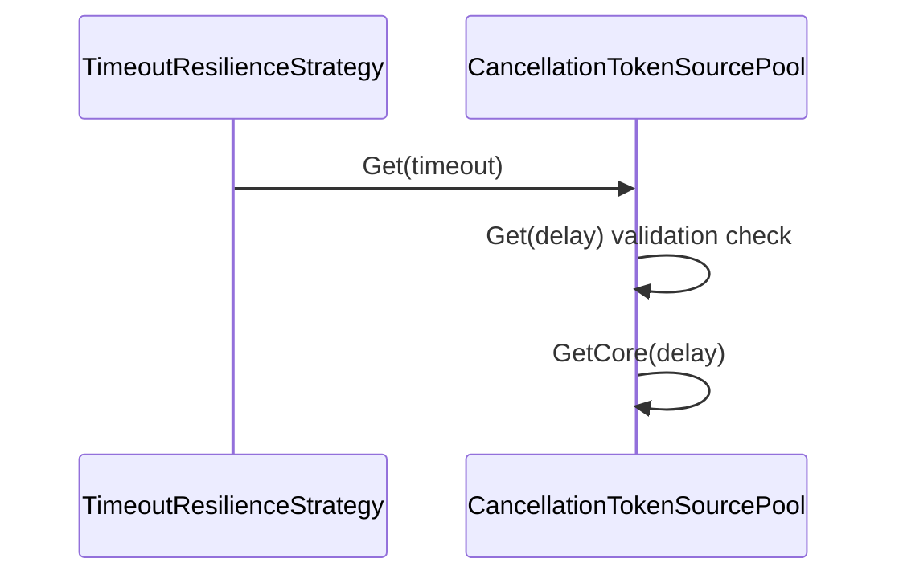
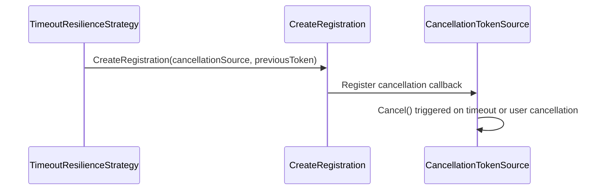

# Timeout Strategy

<details>
<summary>Relevant source files</summary>

The following files were used as context for generating this wiki page:

- [docs/strategies/timeout.md](https://github.com/App-vNext/Polly/blob/main/docs/strategies/timeout.md)
- [README.md](https://github.com/App-vNext/Polly/blob/main/README.md)
- [src/Polly.Core/Timeout/TimeoutResilienceStrategy.cs](https://github.com/App-vNext/Polly/blob/main/src/Polly.Core/Timeout/TimeoutResilienceStrategy.cs)
- [src/Polly.Core/Hedging/Controller/TaskExecution.cs](https://github.com/App-vNext/Polly/blob/main/src/Polly.Core/Hedging/Controller/TaskExecution.cs)
- [src/Polly/AsyncPolicy.ExecuteOverloads.cs](https://github.com/App-vNext/Polly/blob/main/src/Polly/AsyncPolicy.ExecuteOverloads.cs)
- [src/Polly/Timeout/AsyncTimeoutEngine.cs](https://github.com/App-vNext/Polly/blob/main/src/Polly/Timeout/AsyncTimeoutEngine.cs)
- [src/Snippets/Docs/Timeout.cs](https://github.com/App-vNext/Polly/blob/main/src/Snippets/Docs/Timeout.cs)
- [docs/strategies/hedging.md](https://github.com/App-vNext/Polly/blob/main/docs/strategies/hedging.md)
- [src/Polly/Timeout/TimeoutEngine.cs](https://github.com/App-vNext/Polly/blob/main/src/Polly/Timeout/TimeoutEngine.cs)
- [src/Polly/Timeout/AsyncTimeoutPolicy.cs](https://github.com/App-vNext/Polly/blob/main/src/Polly/Timeout/AsyncTimeoutPolicy.cs)
- [src/Polly/Timeout/TimeoutSyntax.cs](https://github.com/App-vNext/Polly/blob/main/src/Polly/Timeout/TimeoutSyntax.cs)
- [src/Polly/Policy.ExecuteOverloads.cs](https://github.com/App-vNext/Polly/blob/main/src/Polly/Policy.ExecuteOverloads.cs)
- [docs/general.md](https://github.com/App-vNext/Polly/blob/main/docs/general.md)
- [src/Polly.Core/Utils/Pipeline/ExecutionTrackingComponent.cs](https://github.com/App-vNext/Polly/blob/main/src/Polly.Core/Utils/Pipeline/ExecutionTrackingComponent.cs)
- [src/Polly/Timeout/TimeoutStrategy.cs](https://github.com/App-vNext/Polly/blob/main/src/Polly/Timeout/TimeoutStrategy.cs)
- [src/Polly/Timeout/TimeoutPolicy.cs](https://github.com/App-vNext/Polly/blob/main/src/Polly/Timeout/TimeoutPolicy.cs)
- [src/Polly.Core/Utils/CancellationTokenSourcePool.cs](https://github.com/App-vNext/Polly/blob/main/src/Polly.Core/Utils/CancellationTokenSourcePool.cs)
- [AGENTS.md](https://github.com/App-vNext/Polly/blob/main/AGENTS.md)
- [src/Polly.Core/CircuitBreaker/Controller/ScheduledTaskExecutor.cs](https://github.com/App-vNext/Polly/blob/main/src/Polly.Core/CircuitBreaker/Controller/ScheduledTaskExecutor.cs)
- [docs/pipelines/index.md](https://github.com/App-vNext/Polly/blob/main/docs/pipelines/index.md)
- [src/Snippets/Docs/General.cs](https://github.com/App-vNext/Polly/blob/main/src/Snippets/Docs/General.cs)
- [src/Polly.Core/Utils/OutcomeUtilities.cs](https://github.com/App-vNext/Polly/blob/main/src/Polly.Core/Utils/OutcomeUtilities.cs)
- [src/Polly.Core/Timeout/TimeoutResiliencePipelineBuilderExtensions.cs](https://github.com/App-vNext/Polly/blob/main/src/Polly.Core/Timeout/TimeoutResiliencePipelineBuilderExtensions.cs)
- [src/Polly.Core/Timeout/TimeoutStrategyOptions.cs](https://github.com/App-vNext/Polly/blob/main/src/Polly.Core/Timeout/TimeoutStrategyOptions.cs)
- [src/Polly.Core/Timeout/TimeoutUtil.cs](https://github.com/App-vNext/Polly/blob/main/src/Polly.Core/Timeout/TimeoutUtil.cs)
</details>

## Overview

The timeout resilience strategy serves as a proactive mechanism in Polly to ensure that executing delegates complete within a specified time window, preventing operations from hanging indefinitely and failing fast when success is unlikely. By wrapping incoming cancellation tokens and monitoring execution duration, the timeout strategy guarantees that callers are not forced to wait past pre-configured limits. When a timeout fires, the strategy cancels the underlying operation and raises a `TimeoutRejectedException`, while transparently preserving any cancellation requests initiated by the caller.

Sources: [docs/strategies/timeout.md:14-14](https://github.com/App-vNext/Polly/blob/main/docs/strategies/timeout.md#L14-L14), [README.md:128-129](https://github.com/App-vNext/Polly/blob/main/README.md#L128-L129), [src/Polly.Core/Timeout/TimeoutResilienceStrategy.cs:74-91](https://github.com/App-vNext/Polly/blob/main/src/Polly.Core/Timeout/TimeoutResilienceStrategy.cs#L74-L91)

## Timeout Configuration and Options

### Overview

The timeout strategy configuration is exposed through builder extension methods on `ResiliencePipelineBuilderBase` and structured configuration classes that define duration constraints, dynamic timeout generation, and timeout notification callbacks.

Sources: [src/Polly.Core/Timeout/TimeoutResiliencePipelineBuilderExtensions.cs:21-50](https://github.com/App-vNext/Polly/blob/main/src/Polly.Core/Timeout/TimeoutResiliencePipelineBuilderExtensions.cs#L21-L50), [src/Polly.Core/Timeout/TimeoutStrategyOptions.cs:9-49](https://github.com/App-vNext/Polly/blob/main/src/Polly.Core/Timeout/TimeoutStrategyOptions.cs#L9-L49)

### Builder Extension Methods

The `TimeoutResiliencePipelineBuilderExtensions` class provides methods to attach timeout behaviors to resilience pipelines. The `AddTimeout<TBuilder>(this TBuilder builder, TimeSpan timeout)` overload accepts a fixed `TimeSpan` duration and wraps it into a `TimeoutStrategyOptions` instance before registration. The second overload, `AddTimeout<TBuilder>(this TBuilder builder, TimeoutStrategyOptions options)`, guards against null references for both the builder and the options parameters via `Guard.NotNull`, and then invokes `builder.AddStrategy` to instantiate and register the `TimeoutResilienceStrategy` using the provided options, time provider, and telemetry sink.

Sources: [src/Polly.Core/Timeout/TimeoutResiliencePipelineBuilderExtensions.cs:21-50](https://github.com/App-vNext/Polly/blob/main/src/Polly.Core/Timeout/TimeoutResiliencePipelineBuilderExtensions.cs#L21-L50)

```csharp
public static TBuilder AddTimeout<TBuilder>(this TBuilder builder, TimeSpan timeout)
    where TBuilder : ResiliencePipelineBuilderBase
    => builder.AddTimeout(new TimeoutStrategyOptions
    {
        Timeout = timeout
    });

public static TBuilder AddTimeout<TBuilder>(this TBuilder builder, TimeoutStrategyOptions options)
    where TBuilder : ResiliencePipelineBuilderBase
{
    Guard.NotNull(builder);
    Guard.NotNull(options);

    builder.AddStrategy(context => new TimeoutResilienceStrategy(options, context.TimeProvider, context.Telemetry), options);
    return builder;
}
```
Sources: [src/Polly.Core/Timeout/TimeoutResiliencePipelineBuilderExtensions.cs:21-50](https://github.com/App-vNext/Polly/blob/main/src/Polly.Core/Timeout/TimeoutResiliencePipelineBuilderExtensions.cs#L21-L50)

### Strategy Options and Parameters

The `TimeoutStrategyOptions` class inherits from `ResilienceStrategyOptions` and initializes its name to `TimeoutConstants.DefaultName`. It exposes properties to control duration limits, asynchronous generators, and event hooks.

| Property | Type | Default Value | Validation / Range | Purpose |
| :--- | :--- | :--- | :--- | :--- |
| `Timeout` | `TimeSpan` | `30 seconds` | `00:00:00.010` to `1.00:00:00` | Defines a fixed period within which the delegate should complete. |
| `TimeoutGenerator` | `Func<TimeoutGeneratorArguments, ValueTask<TimeSpan>>?` | `null` | None | Allows dynamically calculating the timeout period per execution at runtime. |
| `OnTimeout` | `Func<OnTimeoutArguments, ValueTask>?` | `null` | None | Invoked immediately after a timeout occurs before throwing `TimeoutRejectedException`. |

Sources: [src/Polly.Core/Timeout/TimeoutStrategyOptions.cs:9-49](https://github.com/App-vNext/Polly/blob/main/src/Polly.Core/Timeout/TimeoutStrategyOptions.cs#L9-L49)

> [!NOTE]
> When `TimeoutGenerator` is specified, it takes precedence over the static `Timeout` property. If the generator returns a `TimeSpan` less than or equal to `TimeSpan.Zero`, the strategy has no effect for that execution. Returning `System.Threading.Timeout.InfiniteTimeSpan` disables the timeout entirely.

Sources: [src/Polly.Core/Timeout/TimeoutStrategyOptions.cs:27-41](https://github.com/App-vNext/Polly/blob/main/src/Polly.Core/Timeout/TimeoutStrategyOptions.cs#L27-L41), [docs/strategies/timeout.md:135-139](https://github.com/App-vNext/Polly/blob/main/docs/strategies/timeout.md#L135-L139)

## Cancellation Token Source Pooling

### Overview

To minimize allocation overhead during execution setup, the timeout strategy manages cancellation token sources via the `CancellationTokenSourcePool` utility. Rather than allocating a fresh `CancellationTokenSource` on every pipeline execution, the strategy pools and reuses instances according to the active runtime environment and time provider configuration.

Sources: [src/Polly.Core/Timeout/TimeoutResilienceStrategy.cs:17](https://github.com/App-vNext/Polly/blob/main/src/Polly.Core/Timeout/TimeoutResilienceStrategy.cs#L17), [src/Polly.Core/Utils/CancellationTokenSourcePool.cs:5-26](https://github.com/App-vNext/Polly/blob/main/src/Polly.Core/Utils/CancellationTokenSourcePool.cs#L5-L26)

### Factory Initialization and Pooling Strategy

The abstract base class `CancellationTokenSourcePool` defines a static `Create(TimeProvider timeProvider)` factory method that selects the appropriate pool implementation depending on the target framework and whether the default system time provider is active.

Sources: [src/Polly.Core/Utils/CancellationTokenSourcePool.cs:7-26](https://github.com/App-vNext/Polly/blob/main/src/Polly.Core/Utils/CancellationTokenSourcePool.cs#L7-L26)

```csharp
public static CancellationTokenSourcePool Create(TimeProvider timeProvider)
{
#if NET8_0_OR_GREATER
    if (timeProvider == TimeProvider.System)
    {
        return PooledCancellationTokenSourcePool.SystemInstance;
    }

    return new PooledCancellationTokenSourcePool(timeProvider);
#elif NET6_0_OR_GREATER
    if (timeProvider == TimeProvider.System)
    {
        return PooledCancellationTokenSourcePool.SystemInstance;
    }

    return new DisposableCancellationTokenSourcePool(timeProvider);
#else
    return new DisposableCancellationTokenSourcePool(timeProvider);
#endif
}
```
Sources: [src/Polly.Core/Utils/CancellationTokenSourcePool.cs:7-26](https://github.com/App-vNext/Polly/blob/main/src/Polly.Core/Utils/CancellationTokenSourcePool.cs#L7-L26)

### Call-Chain Execution Walkthrough

When an execution requires a timeout source, the strategy invokes the pooling mechanism through a precise invocation sequence.

1. `ExecuteCore` — Evaluates the timeout duration and calls `_cancellationTokenSourcePool.Get(timeout)` to acquire a cancellation token source.
2. `Get` — Validates that the requested delay is valid (throwing an `ArgumentOutOfRangeException` if the delay is less than or equal to `TimeSpan.Zero` while not equal to `Timeout.InfiniteTimeSpan`) before handing control to `GetCore`.
3. `GetCore` — Abstractly implemented by concrete pool subclasses to retrieve or instantiate the underlying `CancellationTokenSource`.

Sources: [src/Polly.Core/Timeout/TimeoutResilienceStrategy.cs:44](https://github.com/App-vNext/Polly/blob/main/src/Polly.Core/Timeout/TimeoutResilienceStrategy.cs#L44), [src/Polly.Core/Utils/CancellationTokenSourcePool.cs:28-38](https://github.com/App-vNext/Polly/blob/main/src/Polly.Core/Utils/CancellationTokenSourcePool.cs#L28-L38)


Sources: [src/Polly.Core/Timeout/TimeoutResilienceStrategy.cs:44](https://github.com/App-vNext/Polly/blob/main/src/Polly.Core/Timeout/TimeoutResilienceStrategy.cs#L44), [src/Polly.Core/Utils/CancellationTokenSourcePool.cs:28-38](https://github.com/App-vNext/Polly/blob/main/src/Polly.Core/Utils/CancellationTokenSourcePool.cs#L28-L38)

> [!WARNING]
> Specifying a negative or zero `TimeSpan` delay (other than `Timeout.InfiniteTimeSpan`) inside `Get` triggers an `ArgumentOutOfRangeException`. Always ensure dynamic timeout calculations yield positive durations or infinite time spans.

Sources: [src/Polly.Core/Utils/CancellationTokenSourcePool.cs:30-33](https://github.com/App-vNext/Polly/blob/main/src/Polly.Core/Utils/CancellationTokenSourcePool.cs#L30-L33)

## Timeout Execution and Cancellation Flow

### Overview

The core execution and cancellation flow is managed by `TimeoutResilienceStrategy.ExecuteCore`. When a protected operation is invoked, the strategy calculates the active timeout, evaluates whether the timeout should be applied, sets up linked cancellation tokens, executes the user callback, and cleans up associated resources.

Sources: [src/Polly.Core/Timeout/TimeoutResilienceStrategy.cs:26-94](https://github.com/App-vNext/Polly/blob/main/src/Polly.Core/Timeout/TimeoutResilienceStrategy.cs#L26-L94)

### Call-Chain Execution Walkthrough

The execution and cancellation registration sequence proceeds through the following named methods:

1. `ExecuteCore` — Resolves the timeout duration via `DefaultTimeout` or a dynamic `TimeoutGenerator`, verifies that `TimeoutUtil.ShouldApplyTimeout` returns `true`, acquires a pooled cancellation token source, overrides the context cancellation token, and delegates to `CreateRegistration`.
2. `CreateRegistration` — Registers a callback on the previous user cancellation token using either `UnsafeRegister` (on modern .NET runtimes) or `Register` (on down-level targets) to propagate external cancellations to the timeout cancellation source.
3. `Cancel` — Invoked when the timeout elapses or when the linked previous token requests cancellation, triggering the underlying `CancellationTokenSource` and aborting the active execution.

Sources: [src/Polly.Core/Timeout/TimeoutResilienceStrategy.cs:31-47](https://github.com/App-vNext/Polly/blob/main/src/Polly.Core/Timeout/TimeoutResilienceStrategy.cs#L31-L47), [src/Polly.Core/Timeout/TimeoutResilienceStrategy.cs:96-103](https://github.com/App-vNext/Polly/blob/main/src/Polly.Core/Timeout/TimeoutResilienceStrategy.cs#L96-L103), [src/Polly.Core/Hedging/Controller/TaskExecution.cs:80-86](https://github.com/App-vNext/Polly/blob/main/src/Polly.Core/Hedging/Controller/TaskExecution.cs#L80-L86)


Sources: [src/Polly.Core/Timeout/TimeoutResilienceStrategy.cs:47](https://github.com/App-vNext/Polly/blob/main/src/Polly.Core/Timeout/TimeoutResilienceStrategy.cs#L47), [src/Polly.Core/Timeout/TimeoutResilienceStrategy.cs:96-103](https://github.com/App-vNext/Polly/blob/main/src/Polly.Core/Timeout/TimeoutResilienceStrategy.cs#L96-L103), [src/Polly.Core/Hedging/Controller/TaskExecution.cs:84](https://github.com/App-vNext/Polly/blob/main/src/Polly.Core/Hedging/Controller/TaskExecution.cs#L84)

> [!NOTE]
> `TimeoutResilienceStrategy` uses `UnsafeRegister` on modern .NET targets to bypass flow context captures when linking cancellation tokens, reducing synchronization context overhead during high-frequency resilience checks.

Sources: [src/Polly.Core/Timeout/TimeoutResilienceStrategy.cs:98-100](https://github.com/App-vNext/Polly/blob/main/src/Polly.Core/Timeout/TimeoutResilienceStrategy.cs#L98-L100)

### Flow Control Logic and Verification

Before setting up a timer, `ExecuteCore` evaluates `TimeoutUtil.ShouldApplyTimeout(timeout)`, which checks if `timeout > TimeSpan.Zero`. If the timeout is zero or negative (such as `Timeout.InfiniteTimeSpan`), the timeout logic is bypassed entirely, and the callback executes immediately with the unmodified resilience context.

Sources: [src/Polly.Core/Timeout/TimeoutResilienceStrategy.cs:37-41](https://github.com/App-vNext/Polly/blob/main/src/Polly.Core/Timeout/TimeoutResilienceStrategy.cs#L37-L41), [src/Polly.Core/Timeout/TimeoutUtil.cs:7](https://github.com/App-vNext/Polly/blob/main/src/Polly.Core/Timeout/TimeoutUtil.cs#L7)

When execution completes—whether successfully or via an exception—`ExecuteCore` restores the context's original cancellation token, disposes of the cancellation token registration, and returns the source to `_cancellationTokenSourcePool`.

Sources: [src/Polly.Core/Timeout/TimeoutResilienceStrategy.cs:63-71](https://github.com/App-vNext/Polly/blob/main/src/Polly.Core/Timeout/TimeoutResilienceStrategy.cs#L63-L71)

## Legacy Timeout Policy Architecture

### Overview

The legacy Polly v7 architecture implements timeout policies across synchronous and asynchronous engines, supporting both optimistic and pessimistic enforcement strategies. The syntax extensions defined on `Policy` allow constructing `TimeoutPolicy` and `TimeoutPolicy<TResult>` instances using fixed durations, dynamic providers via `Context`, or custom timeout strategies.

Sources: [src/Polly/Timeout/TimeoutSyntax.cs:11-203](https://github.com/App-vNext/Polly/blob/main/src/Polly/Timeout/TimeoutSyntax.cs#L11-L203), [src/Polly/Timeout/TimeoutPolicy.cs:6-45](https://github.com/App-vNext/Polly/blob/main/src/Polly/Timeout/TimeoutPolicy.cs#L6-L45), [src/Polly/Timeout/AsyncTimeoutPolicy.cs:6-50](https://github.com/App-vNext/Polly/blob/main/src/Polly/Timeout/AsyncTimeoutPolicy.cs#L6-L50)

### Synchronous and Asynchronous Engine Execution

The legacy execution mechanism divides into `AsyncTimeoutEngine` and `TimeoutEngine`. Both engines initialize a linked cancellation token source combining caller cancellation and timeout signals.

1. `AsyncTimeoutEngine.ImplementationAsync` — Verifies cancellation tokens, queries the timeout provider via `timeoutProvider(context)`, creates a `CancellationTokenSource`, and links it with the incoming `cancellationToken`. Under `TimeoutStrategy.Optimistic`, it schedules token cancellation and invokes the user delegate directly. Under `TimeoutStrategy.Pessimistic`, it awaits the fastest completion between `actionTask` and a cancellation-backed `timeoutTask`.
2. `TimeoutEngine.Implementation` — Validates cancellation state, sets up linked token sources, and evaluates strategies. For pessimistic synchronous execution, it runs the delegate within `Task.Run`, waits on `timeoutCancellationTokenSource.Token`, and captures inner exceptions via `ExceptionDispatchInfo`.
3. `AsyncTimeoutPolicy` and `TimeoutPolicy` — Wrap concrete policy definitions, overriding `ImplementationAsync` and `Implementation` to invoke the respective timeout engine.

Sources: [src/Polly/Timeout/AsyncTimeoutEngine.cs:15-53](https://github.com/App-vNext/Polly/blob/main/src/Polly/Timeout/AsyncTimeoutEngine.cs#L15-L53), [src/Polly/Timeout/TimeoutEngine.cs:16-70](https://github.com/App-vNext/Polly/blob/main/src/Polly/Timeout/TimeoutEngine.cs#L16-L70), [src/Polly/Timeout/AsyncTimeoutPolicy.cs:24-43](https://github.com/App-vNext/Polly/blob/main/src/Polly/Timeout/AsyncTimeoutPolicy.cs#L24-L43), [src/Polly/Timeout/TimeoutPolicy.cs:24-38](https://github.com/App-vNext/Polly/blob/main/src/Polly/Timeout/TimeoutPolicy.cs#L24-L38)

| TimeoutStrategy | Enforcement Mechanism | Behavior on Timeout |
| :--- | :--- | :--- |
| `TimeoutStrategy.Optimistic` | Relies entirely on cooperative cancellation via `CancellationToken`. | Throws `TimeoutRejectedException` wrapping the `OperationCanceledException`. |
| `TimeoutStrategy.Pessimistic` | Assumes delegates may ignore cancellation tokens; forces abandonment by racing or waiting on task completion bounds. | Throws `TimeoutRejectedException` after invoking `onTimeout` or `onTimeoutAsync` handlers. |

Sources: [src/Polly/Timeout/TimeoutStrategy.cs:8-17](https://github.com/App-vNext/Polly/blob/main/src/Polly/Timeout/TimeoutStrategy.cs#L8-L17), [src/Polly/Timeout/AsyncTimeoutEngine.cs:26-50](https://github.com/App-vNext/Polly/blob/main/src/Polly/Timeout/AsyncTimeoutEngine.cs#L26-L50), [src/Polly/Timeout/TimeoutEngine.cs:27-66](https://github.com/App-vNext/Polly/blob/main/src/Polly/Timeout/TimeoutEngine.cs#L27-L66)

> [!WARNING]
> When executing synchronous pessimistic timeouts, `TimeoutEngine` catches `AggregateException` with a single inner exception and rethrows it using `ExceptionDispatchInfo.Capture(ex.InnerException).Throw()` to strip unnecessary `AggregateException` nesting caused by `Task.Run` and `Wait`.

Sources: [src/Polly/Timeout/TimeoutEngine.cs:50-54](https://github.com/App-vNext/Polly/blob/main/src/Polly/Timeout/TimeoutEngine.cs#L50-L54)

## Error Handling and Telemetry Events

### Overview

When an execution times out, the strategy checks whether cancellation was requested by the timeout source while the caller's original token remained uncancelled (`isCancellationRequested && outcome.Exception is OperationCanceledException e && !previousToken.IsCancellationRequested`). When this condition holds true, the strategy initiates its error handling and telemetry emission workflow before throwing a `TimeoutRejectedException`.

Sources: [src/Polly.Core/Timeout/TimeoutResilienceStrategy.cs:74-75](https://github.com/App-vNext/Polly/blob/main/src/Polly.Core/Timeout/TimeoutResilienceStrategy.cs#L74-L75)

### Error Handling and Telemetry Emission Call Sequence

1. `TimeoutResilienceStrategy.ExecuteCore` — Detects that execution timed out via `isCancellationRequested` and `OperationCanceledException`.
2. `ResilienceStrategyTelemetry.Report` — Emits an `OnTimeout` resilience event with `ResilienceEventSeverity.Error` and an `OnTimeoutArguments` payload containing the execution context and timeout duration.
3. `OnTimeout` delegate invocation — If the optional `OnTimeout` user callback is configured, it executes asynchronously before the exception is raised.
4. `TimeoutRejectedException` construction — Instantiates the exception with a message indicating the exceeded timeout, the timeout value, and the inner `OperationCanceledException`.
5. `ResilienceTelemetrySource` attachment — Binds telemetry source metadata to the exception via `_telemetry.SetTelemetrySource(timeoutException)` to identify the exact strategy instance that failed.
6. `Outcome.FromException` — Returns the wrapped exception outcome with `TrySetStackTrace()` applied.

Sources: [src/Polly.Core/Timeout/TimeoutResilienceStrategy.cs:76-90](https://github.com/App-vNext/Polly/blob/main/src/Polly.Core/Timeout/TimeoutResilienceStrategy.cs#L76-L90), [docs/strategies/timeout.md:125-126](https://github.com/App-vNext/Polly/blob/main/docs/strategies/timeout.md#L125-L126)

| Event Name | Event Severity | When? | Result Property |
| :--- | :--- | :--- | :--- |
| `OnTimeout` | `Error` | Just before the strategy calls the `OnTimeout` delegate | Always empty |

Sources: [docs/strategies/timeout.md:145-148](https://github.com/App-vNext/Polly/blob/main/docs/strategies/timeout.md#L145-L148), [docs/strategies/timeout.md:160-162](https://github.com/App-vNext/Polly/blob/main/docs/strategies/timeout.md#L160-L162)

> [!NOTE]
> The `OnTimeout` telemetry event is reported only when the timeout strategy cancels the provided callback execution. If the callback finishes successfully or throws a different exception, no timeout telemetry is emitted.

Sources: [docs/strategies/timeout.md:156-159](https://github.com/App-vNext/Polly/blob/main/docs/strategies/timeout.md#L156-L159)

## Related

- [[Rate Limiting Strategy]]

