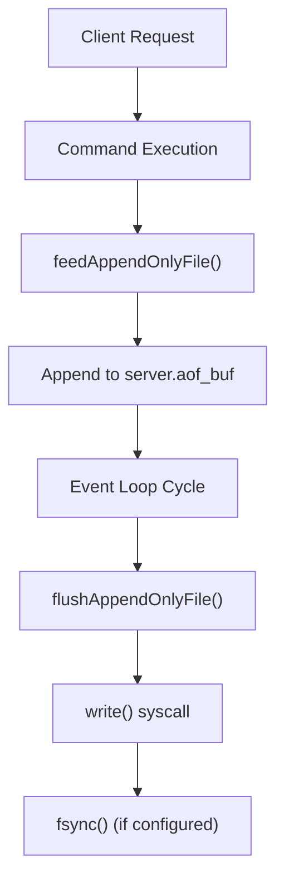
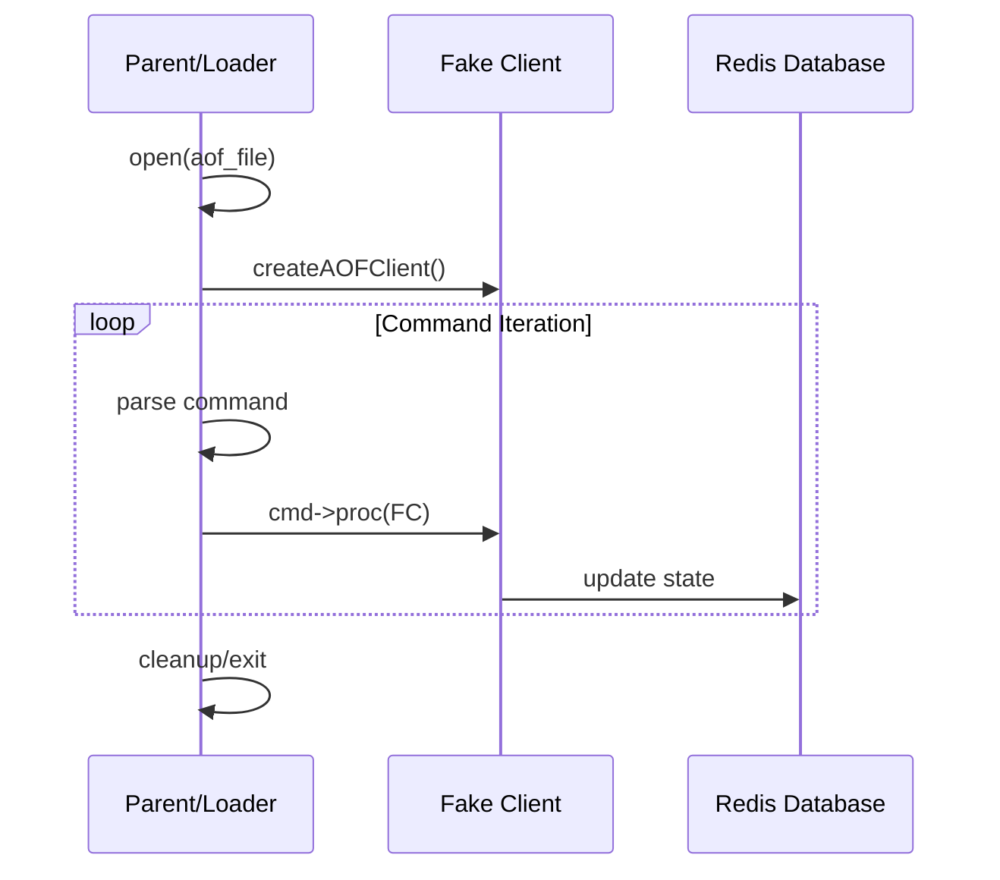

# Append Only File

Relevant source files

The following files were used as context for generating this wiki page:

- [src/aof.c](https://github.com/redis/redis/blob/main/src/aof.c)
- [redis.conf](https://github.com/redis/redis/blob/main/redis.conf)

The Append Only File (AOF) subsystem is a core Redis persistence mechanism designed to provide durability beyond the periodic snapshotting provided by RDB. While RDB snapshots the entire dataset at intervals, the AOF logs every write operation received by the server to an append-only file on disk. This approach ensures that, in the event of a crash or power failure, Redis can reconstruct its state by replaying these operations sequentially, significantly reducing the window of data loss compared to RDB.

The system manages AOF durability through a "manifest" architecture. Rather than relying on a single monolithic file, modern Redis AOF stores data across a set of files categorized into three types: **BASE** (the state of the dataset as of the last rewrite), **INCR** (incremental logs containing subsequent writes), and **HISTORY** (obsolete files awaiting garbage collection). This structure allows Redis to perform background rewrites, where the current dataset is compacted into a new BASE file without interrupting service, while still capturing ongoing changes in new INCR files.

The AOF subsystem is tightly integrated with the event loop. Writes from clients are first buffered in memory (`server.aof_buf`) and subsequently flushed to the filesystem just before the server returns to the event loop to await new requests. This design balances disk throughput with durability requirements, allowing for tunable synchronization policies (e.g., `fsync` every second, always, or never) that trade off performance for strictness.

## AOF Manifest Architecture

The `aofManifest` structure acts as the central registry for the entire AOF subsystem. It maintains references to the base file and lists of incremental and history files, ensuring that the Redis server knows exactly which files must be loaded during recovery.

| Field | Type | Purpose |
| :--- | :--- | :--- |
| `base_aof_info` | `aofInfo*` | The current snapshot file. |
| `incr_aof_list` | `list*` | Ordered list of incremental write logs. |
| `history_aof_list` | `list*` | Obsolete files marked for deletion. |
| `dirty` | `int` | Flag indicating if the manifest needs a disk update. |

The manifest file itself is written to disk as a text-based format tracking sequence numbers and file types. When the server starts, it reconstructs this `aofManifest` by parsing the manifest file, verifying file existence, and loading the AOF segments in order to achieve the most recent state.

> [!NOTE]
> The manifest file uses sequence numbers to order files correctly. During recovery, the loader processes the BASE file first, followed by all INCR files in strictly monotonic sequence order to ensure consistent state reconstruction.

Sources: [src/aof.c:43-71](https://github.com/redis/redis/blob/main/src/aof.c#L43-L71), [src/aof.c:154-163](https://github.com/redis/redis/blob/main/src/aof.c#L154-L163)

## The Persistence Workflow

The persistence flow ensures that incoming commands are durable without blocking the main event loop for every single operation.

The `feedAppendOnlyFile()` function propagates commands to the AOF buffer. Crucially, this happens after command execution, ensuring only valid writes are logged. If the configuration requires it, `flushAppendOnlyFile()` performs the actual I/O. For high-performance settings like `everysec`, the system utilizes a background thread (`bio`) to handle the expensive `fsync()` operation, preventing the main thread from stalling on disk latency.

Sources: [src/aof.c:1409-1448](https://github.com/redis/redis/blob/main/src/aof.c#L1409-L1448), [src/aof.c:1147-1355](https://github.com/redis/redis/blob/main/src/aof.c#L1147-L1355)

## AOF Rewrite (BGREWRITEAOF)

AOF files grow indefinitely as writes accumulate. To reclaim space and reduce recovery time, Redis performs background rewrites. The `rewriteAppendOnlyFileBackground()` function forks a child process to create a new, compact AOF representing the current dataset in memory.

1.  **Fork:** A child process is created, which traverses the memory dataset (`rewriteAppendOnlyFileRio()`).
2.  **Accumulation:** The parent process continues appending to a new `INCR` file while the child is busy.
3.  **Completion:** The child notifies the parent (usually via signal or pipe), and the parent updates the manifest to point to the newly generated `BASE` file, marking the old segments as `HISTORY`.

The background rewrite uses Copy-on-Write (CoW) to minimize memory usage, and modern versions include logic to `dismissObject()` (releasing memory pages) back to the OS during iteration, further reducing memory pressure.

Sources: [src/aof.c:2850-2935](https://github.com/redis/redis/blob/main/src/aof.c#L2850-L2935), [src/aof.c:2683-2778](https://github.com/redis/redis/blob/main/src/aof.c#L2683-L2778)

## Error Handling and Recovery

Data corruption or partial writes during crashes can threaten integrity. Redis provides specific strategies to mitigate these risks:

- **Short Writes:** If `aofWrite()` encounters a short write, it attempts to `ftruncate()` the file to the last known valid offset.
- **Corrupt Tails:** If a file becomes malformed at the end, the `aof-load-corrupt-tail-max-size` configuration allows the server to recover by automatically discarding the corrupted bytes and attempting to load the rest.

> [!WARNING]
> `ftruncate()` is a destructive operation. If the data integrity is critical, manual intervention using `redis-check-aof --fix` is recommended before enabling automatic truncation.

Sources: [src/aof.c:1263-1276](https://github.com/redis/redis/blob/main/src/aof.c#L1263-L1276), [src/aof.c:1751-1760](https://github.com/redis/redis/blob/main/src/aof.c#L1751-L1760)

## Design Trade-offs

| Design Choice | Benefit | Cost |
| :--- | :--- | :--- |
| **Separate Manifest File** | Enables flexible multi-file management (BASE/INCR/HIST). | Increased filesystem metadata overhead. |
| **Buffered Writes** | High performance (batching disk I/O). | Potential for data loss without explicit `fsync`. |
| **Fork-based Rewrite** | Non-blocking compaction. | Increased memory usage due to Copy-on-Write. |
| **Background Fsync** | Keeps main thread latency low. | Complexity in synchronization between I/O threads. |

## AOF Loading Mechanism

The AOF loader uses a "Fake Client" to execute commands stored in the AOF file. This ensures that the loading process uses the same code paths as regular client commands.

- `createAOFClient()`: Sets up a client marked with `CLIENT_DENY_BLOCKING`.
- `loadSingleAppendOnlyFile()`: Opens the file, initializes the fake client, and iterates over every command, invoking the command's procedure `cmd->proc(fakeClient)`.

Sources: [src/aof.c:1456-1476](https://github.com/redis/redis/blob/main/src/aof.c#L1456-L1476), [src/aof.c:1507-1606](https://github.com/redis/redis/blob/main/src/aof.c#L1507-L1606)

> [!CAUTION]
> The fake client bypasses standard `call()` or `afterCommand()` hooks. Any module relying on these hooks will not trigger during AOF replay unless specific post-command logic is manually invoked.