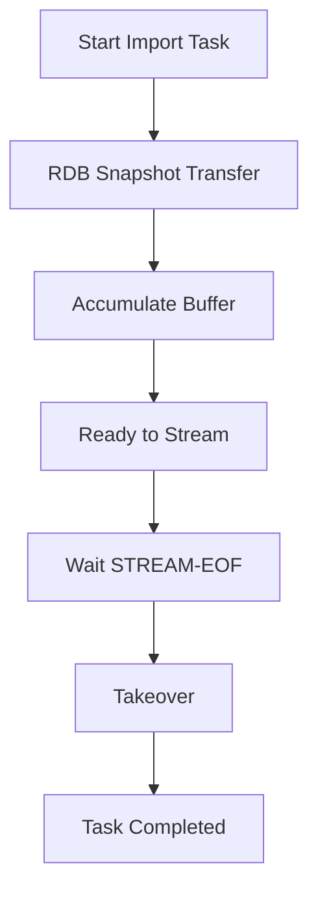
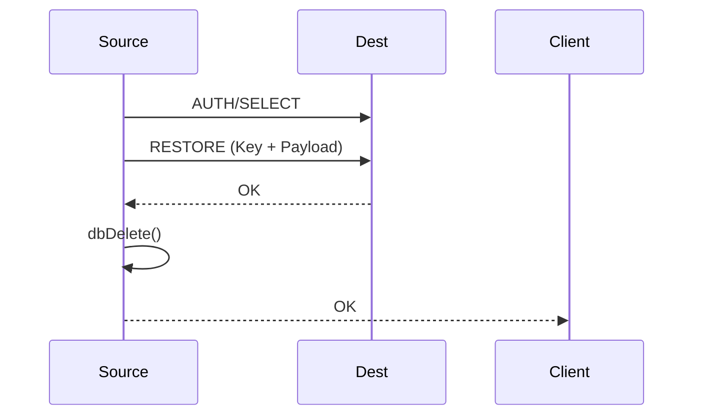

# Cluster Routing

Relevant source files

The following files were used as context for generating this wiki page:

- [src/cluster.c](https://github.com/redis/redis/blob/main/src/cluster.c)
- [src/cluster_asm.c](https://github.com/redis/redis/blob/main/src/cluster_asm.c)

Cluster Routing is the subsystem responsible for ensuring that client requests in a Redis Cluster are directed to the appropriate node that owns the data. Since Redis Cluster uses sharding, a key's location is deterministic, but dynamic cluster reconfigurations—such as resharding, node failures, or slot migration—mean that the location of a key can change over time. The routing component provides the logic for clients to discover the correct node and enables the cluster to coordinate key movement between nodes without data loss or downtime.

The subsystem manages several key responsibilities: calculating the hash slot for a given key, performing redirections when a node cannot serve a request (via `MOVED` or `ASK` errors), handling atomic slot migrations between nodes, and managing connection caching for migration-related commands. By abstracting these concerns, Cluster Routing ensures that both internal node-to-node communication and external client requests remain consistent with the current global view of the cluster state.

### Key Mechanisms and Design

The routing architecture relies on a "cluster bus" and a shared understanding of slot ownership. Nodes track which slots they are responsible for and exchange this information with others. When a command arrives at a node, the routing logic determines if the node owns the requested slot, if the slot is currently being migrated (importing/migrating state), or if the request must be redirected. This design allows for a decentralized control plane where any node can act as a gateway for any client request, improving cluster scalability.

## Key Space Mapping: The Slot Calculation

The routing logic begins with mapping keys to slots, which determines which shard "owns" the key. This is handled by the hash slot algorithm, which uses a CRC16-based calculation on the key (or the part of the key inside curly braces `{}`).

- **Mechanism:** `patternHashSlot()` identifies if a key has a hash tag `{tag}`. If found, it computes the CRC16 of the tag only; otherwise, it computes the CRC16 of the entire key. This ensures that related keys can be stored in the same slot for efficient multi-key operations.
- **Guard:** If a wildcard (`*`, `?`, `[`) is encountered, the function returns `-1`, indicating the pattern cannot be deterministically mapped to a single slot, effectively forcing cross-slot error handling if an operation attempts to use it in a cluster context.

Sources: [src/cluster.c:36-61](https://github.com/redis/redis/blob/main/src/cluster.c#L36-L61)

## Redirection Logic: MOVED and ASK

When a node receives a request for a key it does not own, it must instruct the client where to send the request next. This is the foundation of cluster routing.

- **MOVED Redirection:** Issued when a node is authoritative about its lack of ownership of a slot. The node replies with `-MOVED <slot> <ip:port>`. The client is expected to update its slot-to-node map and retry the request at the new address.
- **ASK Redirection:** Issued during migration when a slot is in the middle of being moved. The node replies with `-ASK <slot> <ip:port>`. Unlike `MOVED`, this is a temporary, one-time redirection; the client must send an `ASKING` command to the destination node before the actual request.

Sources: [src/cluster.c:1437-1487](https://github.com/redis/redis/blob/main/src/cluster.c#L1437-L1487), [src/cluster.c:1698-1705](https://github.com/redis/redis/blob/main/src/cluster.c#L1698-L1705)

## Atomic Slot Migration (ASM)

ASM is the mechanism used to move data between nodes without stopping incoming traffic. It coordinates the migration as a multi-step task on the `source` and `destination` nodes.

- **Snapshot Phase:** The source node creates a snapshot (RDB format) of the keys in the migrating slots.
- **Incremental Stream:** During and after the snapshot, the source streams incoming writes to the destination.
- **Handoff Phase:** Once the destination has applied the snapshot and caught up with the stream, the source pauses writes, streams final pending updates, and notifies the cluster of the configuration change.

Sources: [src/cluster_asm.c:19-44](https://github.com/redis/redis/blob/main/src/cluster_asm.c#L19-L44)

Sources: [src/cluster_asm.c:134-168](https://github.com/redis/redis/blob/main/src/cluster_asm.c#L134-L168)

## Slot Migration State Machine

The `asmTask` structure tracks the migration lifecycle. The state machine progresses through phases that ensure the source node doesn't stop serving the client until the destination is ready to assume control.

| State | Responsibility |
| :--- | :--- |
| `ASM_CONNECTING` | Establishing the main channel connection to the source. |
| `ASM_ACCUMULATE_BUF` | Destination is receiving the snapshot and buffering incoming writes. |
| `ASM_STREAMING_BUF` | Applying the buffered commands to the database. |
| `ASM_WAIT_STREAM_EOF` | Finalizing the handoff by waiting for the source signal. |
| `ASM_TAKEOVER` | Destination assumes slot ownership. |

Sources: [src/cluster_asm.c:70-98](https://github.com/redis/redis/blob/main/src/cluster_asm.c#L70-L98)

## Migrating Socket Cache

To optimize the `MIGRATE` command, Redis caches connections to destination nodes. This prevents the overhead of repeatedly establishing and tearing down TCP connections during migration tasks.

- **Mechanism:** `migrateGetSocket()` checks a dictionary `server.migrate_cached_sockets` keyed by `host:port`.
- **Selection:** If the cache is full (defined by `MIGRATE_SOCKET_CACHE_ITEMS`), it performs a random eviction of an entry using `dictGetRandomKey()` to make space for the new connection.
- **Lifespan:** The `migrateCloseTimedoutSockets()` function is periodically called to close connections that haven't been used for `MIGRATE_SOCKET_CACHE_TTL` seconds.

Sources: [src/cluster.c:343-408](https://github.com/redis/redis/blob/main/src/cluster.c#L343-L408), [src/cluster.c:430-445](https://github.com/redis/redis/blob/main/src/cluster.c#L430-L445)

> [!NOTE]
> When `MIGRATE` uses the `KEYS` option, the socket must remain open for all keys provided in the command, necessitating efficient connection lifecycle management to avoid socket exhaustion.

Sources: [src/cluster.c:452-453](https://github.com/redis/redis/blob/main/src/cluster.c#L452-L453)

## Flow: Migrating a Key

The following trace shows how a key is moved during a migration task:

1. `migrateCommand()` is called by the user.
2. `migrateGetSocket()` retrieves or creates the target connection.
3. `createDumpPayload()` serializes the object to RDB format.
4. The migration logic writes the command and payload directly to the socket connection using the `rio` abstraction.
5. Once the destination acknowledges the RESTORE, `dbDelete()` is called to remove the local copy (if `COPY` was not used).

Sources: [src/cluster.c:454-792](https://github.com/redis/redis/blob/main/src/cluster.c#L454-L792)

Sources: [src/cluster.c:555-753](https://github.com/redis/redis/blob/main/src/cluster.c#L555-L753)