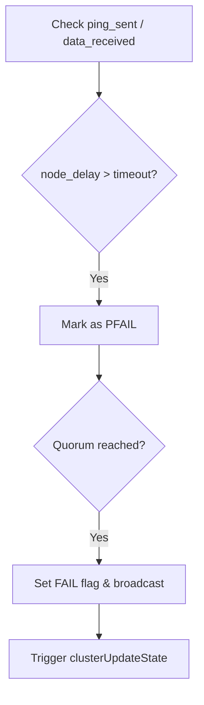

# Cluster State

Relevant source files

The following files were used as context for generating this wiki page:

- [src/cluster_legacy.c](https://github.com/redis/redis/blob/main/src/cluster_legacy.c)

The "Cluster State" subsystem is the heart of Redis Cluster's management layer. It is responsible for maintaining the global view of the cluster's topology, managing node handshakes, enforcing slot ownership, handling failure detection, and facilitating consensus through epoch-based versioning. It serves as the source of truth that allows distributed nodes to reach consistent decisions about who owns which data and which nodes are reachable.

At its core, the Cluster State subsystem functions by maintaining an in-memory registry of all nodes—including their network endpoints, flags (e.g., master/slave, failing, myself), and slot assignments—and synchronizing this view via the gossip protocol. It solves the fundamental problem of distributed partition management: ensuring that every node understands the current cluster configuration even in the presence of network failures or node transitions, without requiring a single centralized coordinator.

The subsystem is designed around a continuous loop of status observation and reactive configuration updates. It stores state in persistent local configuration files (`nodes.conf`) to ensure that, upon restart, a node can rejoin the cluster with the same identity and state it held previously. Adjacent components like the Gossip protocol, failover logic, and slot management algorithms interact with this state constantly, triggering updates and broadcasting changes to other members of the cluster.

## Global Cluster Registry
The central management structure is the `clusterState` struct (partially visible via `server.cluster` references), which provides a global registry of all cluster nodes. The registry is indexed primarily by a hash table of node IDs, allowing for O(1) lookups during packet processing and gossip updates.

When a node joins or is gossiped about, the `clusterAddNode` function registers it in the internal nodes dictionary. If a node is removed or a conflict is detected, the registry is purged to maintain consistency. The `nodes` dictionary utilizes the `clusterNodesDictType` hash function, which operates on the binary node name string. A critical design decision is the inclusion of a "blacklist" (tracked via `clusterNodesBlackListDictType`) to prevent "zombie" nodes from being prematurely re-added to the registry following a `CLUSTER FORGET` command.

| Data Structure | Purpose |
| :--- | :--- |
| `clusterNodes` | Dict mapping node IDs to `clusterNode` structs. |
| `clusterSdsToListType` | Mapping shard IDs to lists of nodes. |
| `owner_not_claiming_slot` | Bitmap tracking slots in state of uncertain ownership. |
| `nodes_black_list` | Prevents recently removed nodes from being re-added. |

Sources: [src/cluster_legacy.c:124-158](https://github.com/redis/redis/blob/main/src/cluster_legacy.c#L124-L158), [src/cluster_legacy.c:1133](https://github.com/redis/redis/blob/main/src/cluster_legacy.c#L1133)

## Configuration Persistence
Cluster State is persisted to a file (default `nodes.conf`) to ensure node identity and slot ownership survive process restarts. The logic for loading this file is handled in `clusterLoadConfig`, which parses line-by-line using `sdssplitargs`. This parser is robust, handling variable declarations (`vars`), node addresses, flags, and auxiliary fields.

> [!CAUTION]
> The `nodes.conf` file is locked using `flock()` (except on Solaris). This is mandatory. If the file cannot be locked, the node will refuse to start to prevent multiple Redis instances from claiming the same node identity and corrupted cluster state.

Saving configuration happens in `clusterSaveConfig`, which follows a specific sequence to ensure atomicity:
1. Generate the new config string in memory.
2. Open a temporary file.
3. Write the new content and issue an `fsync` (if requested).
4. `rename` the temporary file to the final destination, followed by an `fsyncFileDir` for durability.

Sources: [src/cluster_legacy.c:306-670](https://github.com/redis/redis/blob/main/src/cluster_legacy.c#L306-L670), [src/cluster_legacy.c:684-747](https://github.com/redis/redis/blob/main/src/cluster_legacy.c#L684-L747)

## Node Identity and Handshake
When a node receives a `MEET` packet from an unknown node, it creates a new entry with the `CLUSTER_NODE_HANDSHAKE` flag. This node is not yet trusted and does not participate in slot routing. The transition from handshake to a fully integrated member requires receiving a `PONG` message that verifies the node's true identity (its persistent Name ID).

The handshake logic is integrated into `clusterProcessPacket`. When an unknown node sends a message, `clusterLookupNode` searches the registry. If not found, a new `clusterNode` is created. If the incoming packet is a `MEET`, the node is initialized and `clusterDoBeforeSleep` schedules a config save to ensure the newly discovered node is registered across restarts.

Sources: [src/cluster_legacy.c:1974-2053](https://github.com/redis/redis/blob/main/src/cluster_legacy.c#L1974-L2053), [src/cluster_legacy.c:2992-3011](https://github.com/redis/redis/blob/main/src/cluster_legacy.c#L2992-3011)

## Failure Detection
Failure detection is performed through gossip and timeout tracking. `clusterCron` runs 10 times per second to iterate over all registered nodes, checking for missing heartbeats (PING/PONG timing).

A node is transitioned through states based on two conditions:
1. **`PFAIL` (Possible Failure):** Triggered when the elapsed time since the last pong (or data received) exceeds `server.cluster_node_timeout`.
2. **`FAIL` (Confirmed Failure):** A node enters the `FAIL` state when a quorum (majority) of masters have marked the node as `PFAIL`.

The function `markNodeAsFailingIfNeeded` is the core of this transition, calculating the quorum and broadcasting the `FAIL` message to the rest of the cluster to ensure global consensus on the faulty node.

Sources: [src/cluster_legacy.c:1907-1934](https://github.com/redis/redis/blob/main/src/cluster_legacy.c#L1907-L1934), [src/cluster_legacy.c:4936-4948](https://github.com/redis/redis/blob/main/src/cluster_legacy.c#L4936-L4948)

## Slot Ownership and Reconciliation
Slot ownership is managed via bitmaps stored in each node structure. Reconciling ownership is handled in `clusterUpdateSlotsConfigWith`. This occurs when a master sends an `UPDATE` packet (triggered via `clusterSendUpdate`) containing a higher `configEpoch`.

The reconciliation logic:
1. Identifies if the sender node is claiming slots assigned to a different master.
2. If the sender's `configEpoch` is greater, `clusterDelSlot` and `clusterAddSlot` are used to migrate the assignment.
3. If this instance loses ownership of slots that currently contain keys, `clusterDelKeysInSlot` is called to purge them, ensuring data consistency with the new cluster view.

Sources: [src/cluster_legacy.c:3147-3212](https://github.com/redis/redis/blob/main/src/cluster_legacy.c#L3147-L3212)

## Manual Failover Flow
The manual failover mechanism coordinates a clean migration of a master's role to a chosen slave.

1. **`MFSTART`:** The slave initiates the request. The master receives it and pauses incoming client writes.
2. **Replication Sync:** The master sends its replication offset to the slave.
3. **Synchronization:** Once the slave reaches the master's offset (checked in `clusterHandleManualFailover`), `mf_can_start` is set.
4. **Election:** The slave triggers the failover election via `clusterRequestFailoverAuth`, forcing masters to vote even if the master is technically "up".

Sources: [src/cluster_legacy.c:4666-4709](https://github.com/redis/redis/blob/main/src/cluster_legacy.c#L4666-L4709)

## Design Trade-offs

| Design Choice | Benefit | Cost |
| :--- | :--- | :--- |
| **Gossip Protocol** | High scalability, no single point of failure | Eventual consistency; delay in failure propagation |
| **Atomic Rename Save** | Crash-resistant configuration storage | Increased I/O overhead on config update |
| **O(N) Blacklist cleanup** | Simple memory management for IDs | Linear scan time during blacklist operations |
| **Epoch-based versioning** | Resolves split-brain configurations | Can lead to temporary collisions during manual resharding |

Sources: [src/cluster_legacy.c:1839-1851](https://github.com/redis/redis/blob/main/src/cluster_legacy.c#L1839-L1851), [src/cluster_legacy.c:678-683](https://github.com/redis/redis/blob/main/src/cluster_legacy.c#L678-L683)