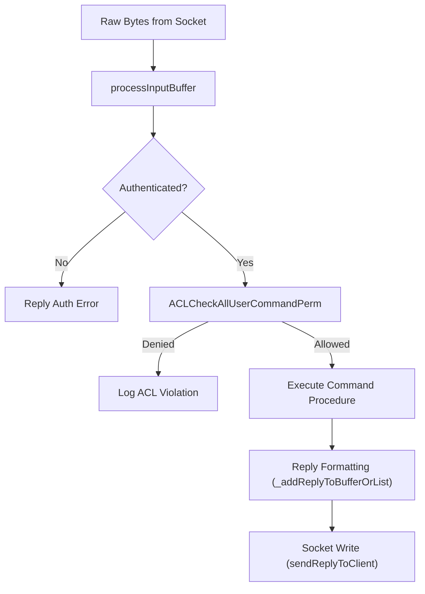
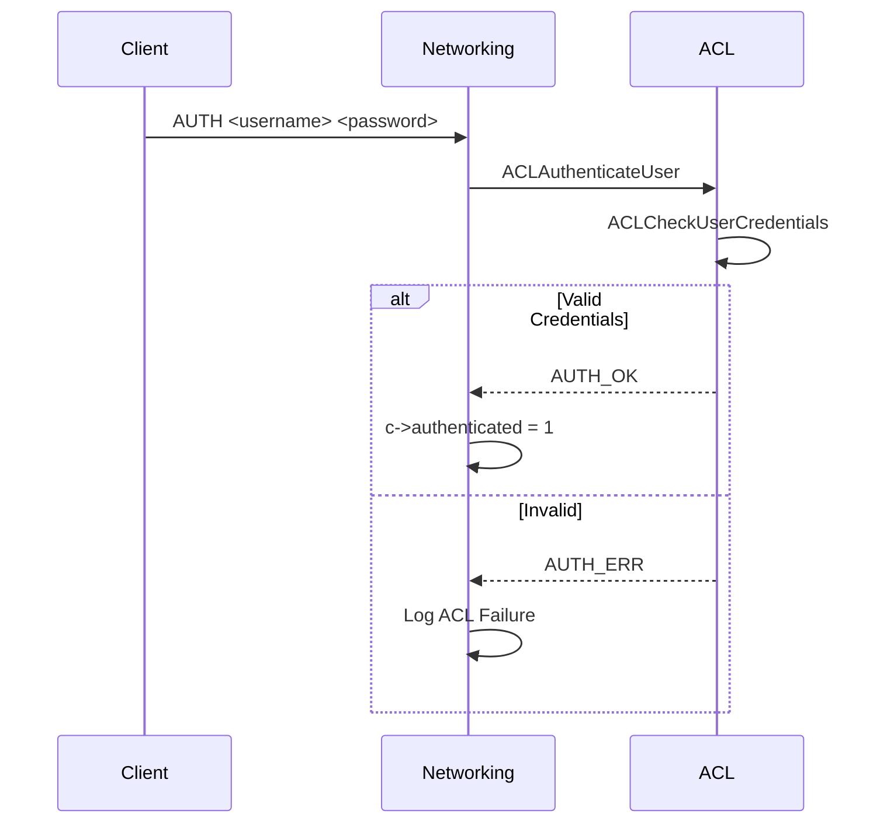

# Command Processing
<details>
<summary>Relevant source files</summary>

The following files were used as context for generating this wiki page:

- [src/acl.c](https://github.com/redis/redis/blob/main/src/acl.c)
- [src/networking.c](https://github.com/redis/redis/blob/main/src/networking.c)
</details>

Command Processing is the central mechanism in the server architecture responsible for translating incoming raw data from clients into actionable server operations. It acts as the gatekeeper for system integrity, security, and execution flow. When data arrives from a network connection, the system must parse it into structured arguments, authenticate the requesting user, authorize the specific command, and finally dispatch the execution to the appropriate logic.

The architecture is designed to handle this pipeline with high performance while maintaining strict security via an Access Control List (ACL) system. The process involves identifying the client context, verifying permissions (such as command execution, key access, and channel subscriptions), and managing output buffers to ensure that system invariants—such as output buffer limits and authentication requirements—are never violated.

This system is modular, separating low-level protocol parsing and I/O buffer management (found in `src/networking.c`) from the security policy enforcement and user permission management (found in `src/acl.c`). This separation ensures that security checks are applied consistently regardless of whether the request comes from a standard client, a module, or a script.

## Core Command Flow
The command processing lifecycle starts when a client sends a request. The system must navigate through various checks before the actual business logic of a command is invoked.

1. **Protocol Parsing:** Raw bytes are read from the network buffer via `processInputBuffer`.
2. **Context Establishment:** The command is associated with a specific client and its authenticated user.
3. **Authentication/Authorization:** The system validates that the client is authenticated (`authRequired`) and that the user has the necessary permissions to execute the command (`ACLCheckAllUserCommandPerm`).
4. **Execution Dispatch:** If all checks pass, the command procedure is executed.
5. **Reply Queuing:** The result is formatted and queued into the client's output buffers using functions like `_addReplyToBufferOrList`.
6. **Network Write:** The output buffer is flushed to the socket when the server is ready (`sendReplyToClient`).


Sources: [src/networking.c:111-120](https://github.com/redis/redis/blob/main/src/networking.c#L111-L120), [src/acl.c:1857-1908](https://github.com/redis/redis/blob/main/src/acl.c#L1857-L1908)

## Security and ACL Subsystem
The ACL subsystem is the backbone of command security, managing users, passwords, and permission selectors. It uses a radix tree (`rax`) to map usernames to `user` structures. Each `user` contains multiple `aclSelector` objects, which define specific command and key access rules.

- **Selectors:** A `user` structure can have multiple selectors (e.g., a "root" selector and additional ones). Each selector defines an allowed command bitmap and specific key patterns.
- **Bitmaps:** Commands are mapped to IDs. A bitmask (`allowed_commands`) is used to perform high-speed checks on whether a user has permission to execute a given command.
- **Key Patterns:** ACLs support fine-grained key access, allowing or restricting commands based on whether they touch specific key patterns (`~attern>`) or require read/write access (`%R~attern>`, `%W~attern>`).

| Flag | Category |
| :--- | :--- |
| `USER_FLAG_ENABLED` | User is enabled for authentication |
| `USER_FLAG_DISABLED` | User is disabled |
| `USER_FLAG_NOPASS` | User requires no password |
| `SELECTOR_FLAG_ALLKEYS` | User has full access to all keys |
| `SELECTOR_FLAG_ALLCOMMANDS` | User has full access to all commands |

Sources: [src/acl.c:23](https://github.com/redis/redis/blob/main/src/acl.c#L23), [src/acl.c:153-180](https://github.com/redis/redis/blob/main/src/acl.c#L153-L180), [src/acl.c:546-550](https://github.com/redis/redis/blob/main/src/acl.c#L546-L550)

## Authentication Mechanism
Authentication is the process of binding a client to a `user` structure. The `ACLAuthenticateUser` function acts as the entry point.

- **Authentication Check:** The system verifies the username and password pair by hashing the provided password and comparing it against stored hashes using `time_independent_strcmp` to prevent timing attacks.
- **Internal Auth:** In Cluster mode, internal connections can authenticate using a specific secret via `internalAuth` (command `internal connection`), which binds the client to the `CLIENT_INTERNAL` flag, bypassing standard ACLs for inter-node communication.


Sources: [src/acl.c:200-206](https://github.com/redis/redis/blob/main/src/acl.c#L200-L206), [src/acl.c:1445-1479](https://github.com/redis/redis/blob/main/src/acl.c#L1445-L1479), [src/acl.c:1516-1523](https://github.com/redis/redis/blob/main/src/acl.c#L1516-L1523)

## Buffer Management and Reply Generation
Data to be sent back to the client is managed via internal helpers that populate `client` output buffers. These interact with output buffers, which can be either a static internal buffer (`buf`) or a linked list of buffers (`reply`).

> [!NOTE]
> The server attempts to minimize syscalls by filling a static 16KB buffer (`PROTO_REPLY_CHUNK_BYTES`) before resorting to allocating new chunks in the linked list via `_addReplyPayloadToList`.

If a command exceeds the current static buffer, `_addReplyPayloadToList` triggers, allocating new memory chunks as needed. For efficiency, if a reply is a bulk string object that meets specific criteria (e.g., size constraints), the system may use **copy avoidance** to reference the original object directly via `_addBulkStrRefToBufferOrList` rather than copying it.

Sources: [src/networking.c:136](https://github.com/redis/redis/blob/main/src/networking.c#L136), [src/networking.c:392-448](https://github.com/redis/redis/blob/main/src/networking.c#L392-L448), [src/networking.c:568-593](https://github.com/redis/redis/blob/main/src/networking.c#L568-593)

## Design Trade-offs
The command processing architecture prioritizes security and performance through several design decisions.

| Design Choice | Benefit | Cost |
| :--- | :--- | :--- |
| **Bitmap-based ACL** | O(1) command lookup during check | Memory consumption tied to command count |
| **Static Buffer Pre-allocation** | Reduced syscalls for small replies | Fixed memory overhead per client |
| **Separated I/O Buffers** | Prevents blocking on large output | High memory usage for slow clients |
| **Copy Avoidance** | Reduced CPU/Memory latency on bulk replies | Complexity in lifecycle management (ref counting) |

Sources: [src/acl.c:161](https://github.com/redis/redis/blob/main/src/acl.c#L161), [src/networking.c:136](https://github.com/redis/redis/blob/main/src/networking.c#L136), [src/networking.c:1273-1297](https://github.com/redis/redis/blob/main/src/networking.c#L1273-L1297)

## Lifecycle and Initialization
The subsystem is initialized via `ACLInit`, which configures global user states and loads command categories.

1. **Initialization:** `ACLInit` creates the `Users` radix tree and `DefaultUser`.
2. **Category Loading:** Command categories (e.g., `read`, `write`, `admin`) are initialized.
3. **ACL Loading:** `ACLLoadUsersAtStartup` or `ACLLoadFromFile` process persisted configurations, validating syntax before modifying the `Users` global state.

> [!IMPORTANT]
> If a configuration file is malformed, the system refuses to load the new ACL state to prevent security regressions or broken permissions.

Sources: [src/acl.c:1429-1437](https://github.com/redis/redis/blob/main/src/acl.c#L1429-L1437), [src/acl.c:2306-2322](https://github.com/redis/redis/blob/main/src/acl.c#L2306-L2322), [src/acl.c:2441-2500](https://github.com/redis/redis/blob/main/src/acl.c#L2441-L2500)

## Worked Example: Checking Permissions
When checking if a command is allowed, the `ACLCheckAllUserCommandPerm` function iterates through all selectors associated with a user structure.

```c
// Example: Checking if a command is permitted
int idx;
// key_result is passed as NULL since we use the internal cache mechanism
int result = ACLCheckAllUserCommandPerm(user_ptr, cmd_ptr, argv, argc, NULL, &idx);
if (result != ACL_OK) {
    sds err = getAclErrorMessage(result, user_ptr, cmd_ptr, argv[idx]->ptr, 1);
    addReplyErrorSds(client_ptr, err);
} else {
    // Proceed to execute the command...
}
```
This demonstrates the iterative checking process where the first selector that grants access terminates the search, ensuring high performance while supporting complex user rules.

Sources: [src/acl.c:1857-1908](https://github.com/redis/redis/blob/main/src/acl.c#L1857-L1908)