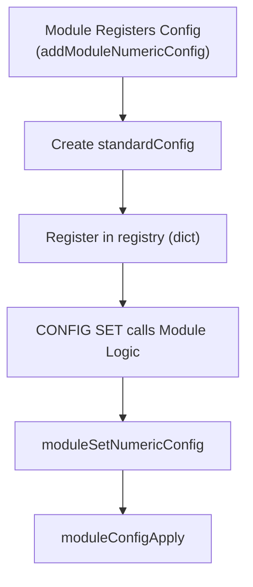

# Configuration Management
<details>
<summary>Relevant source files</summary>

The following files were used as context for generating this wiki page:

- [src/config.c](https://github.com/redis/redis/blob/main/src/config.c)
- [modules/vector-sets/vset_config.c](https://github.com/redis/redis/blob/main/modules/vector-sets/vset_config.c)
- [redis.conf](https://github.com/redis/redis/blob/main/redis.conf)
</details>

Configuration Management provides the infrastructure to define, validate, persist, and dynamically update the operating parameters of the Redis server. It acts as the bridge between the configuration file (typically `redis.conf`) and the internal `server` state, ensuring that system adjustments are applied atomically and consistently.

The system solves the problem of runtime reconfigurability by providing a unified `CONFIG SET`/`CONFIG GET` interface that maps user-facing string keys to typed internal C structures. By utilizing a common `standardConfig` metadata structure, the system abstracts away the complexities of type parsing, validation, and serialization, allowing developers to manage varied configuration types—booleans, integers, enums, and complex memory-aware types—through a consistent API surface.

At its core, Configuration Management operates as a central registry of configurations. Each entry in the registry describes not just the data, but the lifecycle management associated with it, such as initialization, validation, application logic, and persistence logic. This modular design allows the server to handle side-effect-heavy configuration changes—such as updating network listeners or resizing backlogs—without exposing the underlying architecture to the command handler.

## The `standardConfig` Registry

The foundation of the configuration subsystem is the `standardConfig` structure. This structure serves as a descriptor for every configuration parameter in the system. It maps a configuration name to a specific memory address within the `server` state (or module-defined memory), along with the interface required to manipulate that memory safely.

The registry is initialized in `initConfigValues()`, which populates a dictionary (`configs`) with `standardConfig` entries derived from a static array. Each entry provides:
- **Type Metadata**: An enum `configType` (e.g., `BOOL_CONFIG`, `NUMERIC_CONFIG`) indicating how the raw data should be treated.
- **Interface Surface**: A `typeInterface` union containing function pointers for `init`, `set`, `get`, `rewrite`, and `apply`.
- **Private Data**: A `data` union that holds type-specific parameters like bounds for numbers or enum maps for strings.

Sources: [src/config.c:260-288](https://github.com/redis/redis/blob/main/src/config.c#L260-L288), [src/config.c:3431-3447](https://github.com/redis/redis/blob/main/src/config.c#L3431-L3447)

## Configuration Lifecycle and `CONFIG SET`

The `CONFIG SET` command follows a strict sequence to ensure system stability. When a user issues a `CONFIG SET` command, the system performs a multi-phase update:

1. **Discovery & Validation**: The command iterates through provided key-value pairs, looking up each configuration in the registry and verifying if the configuration is modifiable (`IMMUTABLE_CONFIG` flag check).
2. **Backup**: Before modifying any state, the system retrieves the current values for all requested configurations and stores them in a backup array.
3. **Application**: The `performInterfaceSet` function is called, invoking the `set` method associated with the configuration's type interface. 
4. **Validation Guard**: If the `set` function returns `0` (indicating failure), the system immediately invokes `restoreBackupConfig()` to roll back to the previously captured state.
5. **Side-Effect Execution**: If the set succeeds, the system runs the `apply` phase, where the registry-associated `apply` functions are triggered to notify the server components (e.g., re-binding sockets, resizing buffers) of the change.

> [!CAUTION]
> If an `apply` function fails, the system attempts a full restoration of the state using `restoreBackupConfig()`. However, because `apply` functions may have already caused partial side effects, configuration changes that fail during the apply phase may leave the system in an inconsistent state unless explicitly handled by the restoration logic.

Sources: [src/config.c:830-972](https://github.com/redis/redis/blob/main/src/config.c#L830-L972), [src/config.c:3168-3172](https://github.com/redis/redis/blob/main/src/config.c#L3168-L3172)

## Configuration Rewriting

The `CONFIG REWRITE` mechanism allows the server to update the underlying `redis.conf` file to reflect runtime changes. This process is designed to be as non-destructive as possible, attempting to preserve user-added comments and formatting.

1. **Read & Map**: The system reads the old file and uses `rewriteConfigReadOldFile` to split the file into lines, populating an `option_to_line` dictionary that tracks which lines correspond to specific configuration options.
2. **Rewrite**: The system iterates over the `configs` registry, calling the `rewrite` interface for each configuration. This generates new content lines.
3. **Update**: `rewriteConfigRewriteLine` identifies if an existing line can be reused. If a config was present, it overwrites that specific line; if not, it appends the new value.
4. **Cleanup**: `rewriteConfigRemoveOrphaned` clears lines associated with configs that no longer exist (to prevent old, unused parameters from persisting).
5. **Atomic Commit**: Finally, `rewriteConfigOverwriteFile` uses a temporary file and `rename()` to atomically replace the original config file.

Sources: [src/config.c:1061-1071](https://github.com/redis/redis/blob/main/src/config.c#L1061-L1071), [src/config.c:1769-1812](https://github.com/redis/redis/blob/main/src/config.c#L1769-L1812)

## Module Integration

Modules can expose their own configuration parameters to the Redis `CONFIG` subsystem. This is handled through functions such as `addModuleNumericConfig` or `addModuleBoolConfig`, which create a `standardConfig` entry and attach it to the core registry.

The module configuration mechanism relies on a `privdata` pointer stored inside the `standardConfig` instance, which points to the module's internal state. When the configuration subsystem interacts with these configs, it redirects the calls through the `moduleGet...` and `moduleSet...` functions defined in `config.c`.


Sources: [src/config.c:3488-3563](https://github.com/redis/redis/blob/main/src/config.c#L3488-L3563), [modules/vector-sets/vset_config.c:39-51](https://github.com/redis/vector-sets/vset_config.c#L39-L51)

## Design Trade-offs

| Design Choice | Benefit | Cost |
| :--- | :--- | :--- |
| `typeInterface` function pointers | Highly extensible, uniform API | Indirection overhead on `CONFIG SET/GET` |
| Dictionary-based registry | $O(1)$ lookups for configuration names | Higher memory usage than static arrays |
| `rewrite` line mapping | Preserves file structure and comments | Complex logic to handle orphan lines |

Sources: [src/config.c:263-278](https://github.com/redis/redis/blob/main/src/config.c#L263-L278), [src/config.c:290](https://github.com/redis/redis/blob/main/src/config.c#L290), [src/config.c:1062](https://github.com/redis/redis/blob/main/src/config.c#L1062)

## Example: Registering a Module Configuration

A module developer registers a parameter by providing a name, a default value, and hooks for getting/setting the value.

```c
// Example from vset_config.c
int RegisterModuleConfig(RedisModuleCtx *ctx) {
  RM_TRY(
    RedisModule_RegisterBoolConfig(
      ctx, "vset-force-single-threaded-execution", 0,
      REDISMODULE_CONFIG_UNPREFIXED,
      get_bool_config, set_bool_config, NULL,
      (void *)&(VSGlobalConfig.forceSingleThreadExec)
    )
  )
  return REDISMODULE_OK;
}
```
Sources: [modules/vector-sets/vset_config.c:39-51](https://github.com/redis/vector-sets/vset_config.c#L39-L51)

> [!NOTE]
> When implementing `is_valid_fn` for a configuration, the function should return `1` for valid values and `0` for invalid ones. If returning `0`, you should populate the `err` pointer with a static error string describing the violation, as the system does not dynamically allocate these error messages.