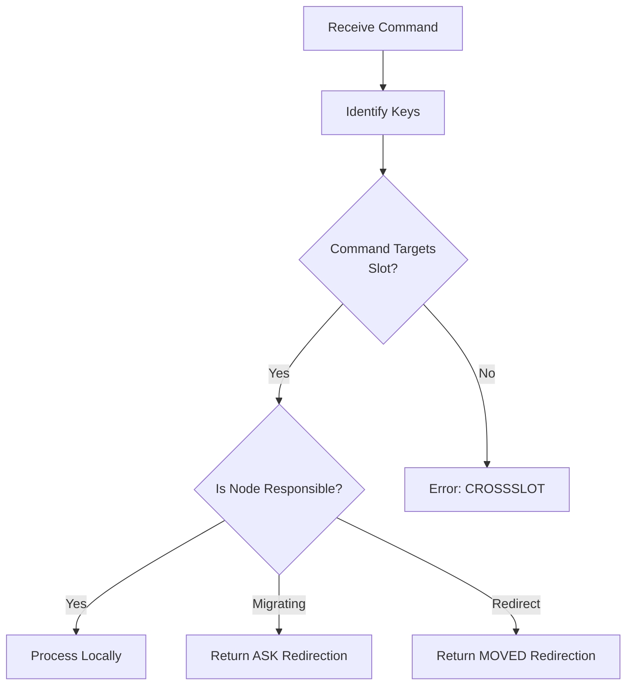

# Database Operations

Relevant source files

The following files were used as context for generating this wiki page:

- [src/cluster.c](https://github.com/redis/redis/blob/main/src/cluster.c)
- [src/db.c](https://github.com/redis/redis/blob/main/src/db.c)

Database operations define the core lifecycle of data in the Valkey/Redis system, encompassing key retrieval, storage, modification, deletion, and cross-node migration. This subsystem provides the fundamental abstractions for a multi-tenant, sharded key-value store, ensuring that data is correctly addressed, consistent across replication, and reachable via the cluster topology.

At its architectural heart, this component bridges the gap between raw data storage (handled via `kvstore`) and the networking layer that receives client commands. By abstracting storage behind a DB-aware API, the system enforces complex invariants such as key expiration, eviction policies, and cluster-aware redirection, shielding higher-level command implementations from the underlying storage complexities.

The subsystem manages the critical path for data integrity, particularly regarding command execution in a sharded environment. It ensures that every command is evaluated for slot ownership, handles the transition of data between nodes during rebalancing (via `MIGRATE` and `RESTORE`), and maintains metadata for specialized object types (like hash fields with expirations). This design allows for seamless scaling while maintaining high performance through techniques like lazy deletion and efficient slot-based key lookup.

## Key Storage and Access API

The Database Operations subsystem exposes a robust C-level API for interacting with the keyspace. The core storage is organized by `redisDb` structures, which utilize a `kvstore` to manage keys, expiration data, and secondary indices.

Key lookups are handled through `lookupKey()`, a polymorphic function that manages key retrieval, TTL expiration, access-time updates (for eviction policies like LFU/LRU), and statistical tracking.

| Function | Purpose | Usage Case |
| :--- | :--- | :--- |
| `lookupKeyRead` | Retrieve key for read-only operations | Standard read commands |
| `lookupKeyWrite` | Retrieve key for write operations | Standard write commands |
| `dbAdd` | Insert a new key into the database | Initial data population |
| `dbDelete` | Remove a key and propagate to replicas | `DEL` or `UNLINK` commands |
| `dbReplaceValue` | Update an existing key's value | In-place modifications |

> [!TIP]
> Use `lookupKeyWriteWithLink` when implementing operations that perform multiple steps on a key. Passing a `dictEntryLink` allows the API to bypass re-searching the hash table for subsequent operations, significantly reducing CPU cycles on heavily accessed keys.

Sources: [src/db.c:30-381](https://github.com/redis/redis/blob/main/src/db.c#L30-L381)

## Cluster-Aware Data Flow

In a clustered environment, the Database Operations layer ensures that data commands are either served locally or redirected to the correct node. The `getNodeByQuery` function serves as the central traffic cop for cluster-wide requests.

1.  **Extraction**: The command parses the key/channel and computes the hash slot using `keyHashSlot`.
2.  **Lookup**: `getNodeByQuery` identifies the responsible node via `getNodeBySlot`.
3.  **State Check**: It checks if the slot is undergoing migration (`migrating_slot`) or import (`importing_slot`).
4.  **Redirection Decision**:
    *   If the node is responsible, the command is allowed.
    *   If ownership is ambiguous due to migration, it might request an `ASK` or `TRYAGAIN` redirection.
    *   If another node is responsible, a `MOVED` redirection is issued.

Sources: [src/cluster.c:1197-1450](https://github.com/redis/redis/blob/main/src/cluster.c#L1197-L1450)

## Data Migration and Recovery

The subsystem provides mechanisms for inter-node data movement, specifically `DUMP`, `RESTORE`, and `MIGRATE`. These operations allow data to be transferred between instances while preserving metadata and expiration states.

*   **`createDumpPayload`**: Serializes a key and its value into an RDB-compatible stream, attaching a version and a 64-bit checksum.
*   **`restoreCommand`**: Ingests this payload, verifies the checksum, and re-injects the data into the target database.

> [!CAUTION]
> During migration, the target instance must ensure that data being imported does not violate existing schema invariants. The `RESTORE` command uses `KeyMetaSpec` to maintain atomic metadata, ensuring that if a key is restored with an expiration, that expiration is applied as a single unit with the object itself.

Sources: [src/cluster.c:87-336](https://github.com/redis/redis/blob/main/src/cluster.c#L87-L336)

## Expiration and Key Invalidation

Key lifecycle management is integrated into the storage access path through `expireIfNeeded`. This logic prevents the exposure of logically dead data to users.

- **Check**: When a key is accessed, `expireIfNeeded` checks its TTL against the current server time (`commandTimeSnapshot`).
- **Invalidation**: If the TTL has passed, the key is logically expired. Depending on the `flags` passed to `lookupKey` (e.g., `LOOKUP_WRITE`), the key is either deleted immediately or simply treated as non-existent.
- **Propagation**: Deletions triggered by expiration are propagated via `deleteKeyAndPropagate` to ensure all replicas and AOF maintain consistency with the master's view of the keyspace.

> [!NOTE]
> The subsystem uses a `kvstore` architecture. When a key is stored with expiration, it is linked in the `expires` dict. The `kvobj` itself contains an expire field, ensuring consistent metadata state across different storage types.

Sources: [src/db.c:279-307](https://github.com/redis/redis/blob/main/src/db.c#L279-L307), [src/db.c:2783-2841](https://github.com/redis/redis/blob/main/src/db.c#L2783-L2841)

## Keyspace Notifications and Watchers

Modifications to the database are tracked via `keyModified` and `notifyKeyspaceEvent`. These hooks are essential for:

1.  **Watchers**: `touchWatchedKey` invalidates transaction states if a watched key is modified.
2.  **Tracking**: `trackingInvalidateKey` notifies clients participating in cache-invalidation protocols that their cached key is no longer fresh.
3.  **Modules**: Modules can register to receive asynchronous events when keys are added, deleted, or overwritten, enabling advanced extensions like secondary indexing or external cache synchronizers.

Sources: [src/db.c:1166-1182](https://github.com/redis/redis/blob/main/src/db.c#L1166-L1182)

## Design Trade-offs

| Design Choice | Benefit | Cost |
| :--- | :--- | :--- |
| **Lazy Deletion** | Prevents blocking the main loop during large removals | Increases peak memory usage before background cleanup |
| **Separate Expiry Dict** | Allows O(1) expiration lookups and efficient scanning | Requires double bookkeeping for every expirable key |
| **Slot-Based Sharding** | Simplifies migration and rebalancing (fixed ranges) | Requires redirection logic and `MOVED` handling |

Sources: [src/cluster.c:1489-1559](https://github.com/redis/redis/blob/main/src/cluster.c#L1489-L1559), [src/db.c:844-917](https://github.com/redis/redis/blob/main/src/db.c#L844-L917)

## Call-Chain Example: Deleting a Key

When a client sends a `DEL` command, the internal flow is precisely controlled to ensure memory safety and replication consistency:

1.  **`delCommand()`**: Entry point; calls `delGenericCommand()`.
2.  **`delGenericCommand()`**: Iterates over provided keys, invoking `dbGenericDelete()` for each.
3.  **`dbGenericDelete()`**:
    *   Finds key entry via `kvstoreDictTwoPhaseUnlinkFind()`.
    *   Checks if the key is a `OBJ_HASH` or `OBJ_STREAM` to handle specialized auxiliary storage cleanup (e.g., `estoreRemove()`).
    *   Fires module notifications for unlinking.
    *   Removes key from the main dictionary using `kvstoreDictTwoPhaseUnlinkFree()`.
    *   Updates key statistics (keyspace hits/misses, histograms).
4.  **`propagateDeletion()`**: Broadcasts the `DEL` operation to AOF and replicas.

Sources: [src/db.c:844-917](https://github.com/redis/redis/blob/main/src/db.c#L844-L917), [src/db.c:1423-1444](https://github.com/redis/redis/blob/main/src/db.c#L1423-L1444)