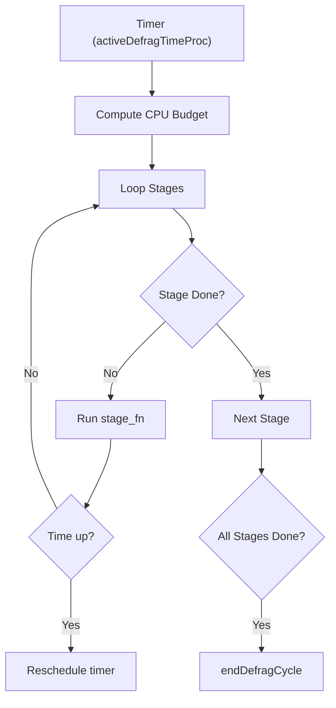

# Defragmentation
<details>
<summary>Relevant source files</summary>

The following files were used as context for generating this wiki page:

- [src/defrag.c](https://github.com/redis/redis/blob/main/src/defrag.c)
- [src/ebuckets.c](https://github.com/redis/redis/blob/main/src/ebuckets.c)
</details>

Memory fragmentation is a common challenge in long-running processes that frequently allocate and free objects of varying sizes. As memory is reclaimed, the heap becomes populated with small, non-contiguous holes, making it impossible to satisfy large allocation requests despite sufficient aggregate free memory. Redis addresses this through **Active Defragmentation**, a background mechanism that periodically scans the keyspace, identifies scattered allocations, and re-allocates them to contiguous memory blocks.

The defragmentation subsystem is designed to operate without stalling the server. It achieves this by dividing the task into small, bounded steps that fit within the event loop's time budget. This approach ensures that memory compaction is performed incrementally, allowing the system to remain responsive to incoming client commands even during heavy defragmentation activity.

At its core, the system relies on the allocator (typically `jemalloc`) providing "hints" about whether an object is worth moving. If the allocator deems a block fragmented, Redis copies the object to a new location, updates all internal pointers that reference the old address, and frees the original allocation. This process requires deep integration with various data structures (dictionaries, lists, zsets, streams) to ensure that pointer updates are atomically reflected across the entire system.

## Memory Allocation Mechanism
The defragmentation process operates on the principle of identifying fragmented allocations and moving them. The low-level mechanism relies on `je_get_defrag_hint` to query the allocator. When a move is recommended, the system performs a non-tcache allocation (`zmalloc_no_tcache`) to ensure the new block is not immediately returned from the thread-local cache, which would negate the benefits of defragmentation.

```c
/* Defrag helper for generic allocations. */
void* activeDefragAlloc(void *ptr) {
    void *newptr = activeDefragAllocWithoutFree(ptr);
    if (newptr)
        activeDefragFree(ptr);
    return newptr;
}
```
Sources: [src/defrag.c:177-182](https://github.com/redis/redis/blob/main/src/defrag.c#L177-L182)

> [!NOTE]
> The `_no_tcache` variants are critical. By bypassing the thread cache, we force the allocator to provide a fresh memory address from the heap, ensuring that we actually migrate the object rather than receiving the same address that was just freed.

## Iteration and Scheduling Architecture
To maintain low latency, defragmentation is staged using a list of `StageDescriptor` objects. Each stage function conforms to a standardized interface, receiving a deadline (`monotime endtime`) and a stage-specific context. The `activeDefragTimeProc` acts as the event-loop-driven timer, which manages the CPU duty cycle.


Sources: [src/defrag.c:48-56](https://github.com/redis/redis/blob/main/src/defrag.c#L48-L56), [src/defrag.c:1848-1906](https://github.com/redis/redis/blob/main/src/defrag.c#L1848-L1906)

## Dictionary and Key Defragmentation
The main dictionary is scanned using `kvstoreDictScanDefrag`. Because hash table operations can be expensive, the subsystem distinguishes between "one-shot" defragmentation (for small, simple objects) and incremental defragmentation (for large structures). Large items are offloaded to a `defrag_later` queue, processed in chunks to prevent latency spikes.

| Type | Defrag Handling |
| :--- | :--- |
| **String (RAW)** | SDS pointer reallocated and referenced. |
| **QuickList** | Nodes are reallocated; pointers updated in list links. |
| **ZSet** | Skiplist nodes are reallocated; skiplist pointers and dict links are updated. |
| **Hash** | Hash fields (hfield) defragged; TTL fields handled via `ebuckets`. |

Sources: [src/defrag.c:477-507](https://github.com/redis/redis/blob/main/src/defrag.c#L477-L507)

## Expiry Buckets (Ebuckets)
`ebuckets` are specialized data structures used to manage expiration metadata. They use a two-tier system: simple lists for small item counts and a `rax` tree for large sets of expirations. Defragmentation of these structures is particularly complex because pointers must be updated not just for the data itself, but for the bucket headers and the `rax` tree segments that maintain sorted order by expiration time.

When an item within a bucket is defragged, the system ensures that the bucket-key (a compressed representation of the expiration time) remains valid. The structure relies on `FirstSegHdr` and `NextSegHdr` for segments, with cyclic references that allow localized updates without full tree traversals.

Sources: [src/ebuckets.c:84-118](https://github.com/redis/redis/blob/main/src/ebuckets.c#L84-L118)

> [!CAUTION]
> The `ebDefragRax` function includes a guard `if (!*cursor)` that triggers the defrag of the `rax` struct itself. If this logic fails to update the reference, the system would continue to point to a released heap location.

## Adaptive CPU Throttle
The system continuously monitors its effectiveness via `updateDefragDecayRate`. If the number of hits (successful reallocations) is low relative to misses, the `decay_rate` is reduced, effectively slowing down the defragmentation speed for the next cycle.

| Factor | Calculation |
| :--- | :--- |
| **Efficiency** | Based on hit/miss ratio since `start_defrag_hits` at the cycle start. |
| **Decay** | Multiplied by 0.9 if performance is below 1% hit rate. |
| **Reset** | Reset to 1.0 if fragmentation percentage changes significantly (>2%). |

Sources: [src/defrag.c:1706-1723](https://github.com/redis/redis/blob/main/src/defrag.c#L1706-L1723)

## Worked Example: Defragmenting an Entry
This walkthrough illustrates the path taken when defragmenting an entry string in a hash dictionary.

1. `dbKeysScanCallback` initiates the scan.
2. `defragKey` calculates if the item is large or complex.
3. `activeDefragEntry` calls `activeDefragAlloc` on the entry.
4. `activeDefragAlloc` uses `memcpy` to create a new, contiguous memory block.
5. If successful, `activeDefragEntry` updates the pointer to the SDS value.
6. The `dictEntry` is updated via `dictSetKeyAtLink` to point to the new location.

Sources: [src/defrag.c:247-267](https://github.com/redis/redis/blob/main/src/defrag.c#L247-L267), [src/defrag.c:1213-1221](https://github.com/redis/redis/blob/main/src/defrag.c#L1213-L1221)