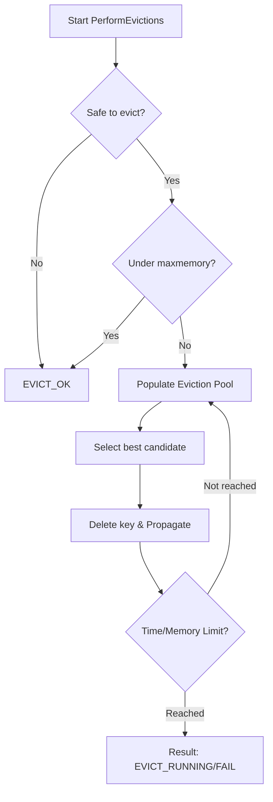

# Eviction and Expiration

Relevant source files

The following files were used as context for generating this wiki page:

- [src/evict.c](https://github.com/redis/redis/blob/main/src/evict.c)
- [src/db.c](https://github.com/redis/redis/blob/main/src/db.c)
- [src/expire.c](https://github.com/redis/redis/blob/main/src/expire.c)

Eviction and Expiration are the two fundamental mechanisms Redis employs to maintain memory bounds and data lifecycle management. While distinct in their triggers and logic, both aim to prevent the server from exceeding configured memory limits and ensure that volatile or outdated data is reclaimed efficiently without stalling the event loop.

Expiration is a policy where keys are associated with a Time-To-Live (TTL). Once the TTL expires, the key is logically invalidated. Redis employs a hybrid approach: "passive" expiration (checking the key upon access) and "active" expiration (sampling a subset of keys in the background). This ensures that memory is reclaimed even for keys that are never accessed again.

Eviction is triggered when the total memory usage exceeds the defined `maxmemory` limit. The eviction process selects "victim" keys based on the configured eviction policy (e.g., LRU, LFU, or TTL-based) and deletes them to restore memory headroom. This subsystem is architected to be highly performant, employing sampling techniques rather than exact global sorts to keep the latency impact on the command path minimal.

These components are central to Redis's operational stability. They interact deeply with the storage layer (`kvstore`), the key lookup logic in `src/db.c`, and the event loop (`ae.c`) to ensure that memory pressure is handled dynamically while maintaining consistency in a clustered, multi-replica environment.

## The Eviction Pool Architecture

To implement "approximate LRU" (and LFU) efficiently, Redis does not maintain a global sorted list of keys by their access time, which would be prohibitively expensive to update on every read/write. Instead, it uses a small, fixed-size **Eviction Pool** (`struct evictionPoolEntry`) that acts as a buffer for the best candidates for eviction.

The `evictionPoolPopulate` mechanism operates as follows:
1. It samples a small number of keys (`server.maxmemory_samples`) from the keyspace.
2. For each key, it calculates an "idle time" score (or inverted frequency for LFU).
3. It attempts to insert these sampled keys into the `EvictionPoolLRU` buffer.
4. The pool is maintained as an array of `EVPOOL_SIZE` entries, kept in ascending order of "idleness" (the score).

> [!NOTE]
> The pool does not explicitly track key deletions. If a key in the pool is deleted by a normal command, it remains as a "ghost" in the pool. When the `performEvictions` logic eventually attempts to pick the best key from the pool, it verifies the key's existence (`kvstoreDictFind`). If it no longer exists, the entry is simply ignored and the next best entry is considered.

Sources: [src/evict.c:38-44](https://github.com/redis/redis/blob/main/src/evict.c#L38-L44), [src/evict.c:91-109](https://github.com/redis/redis/blob/main/src/evict.c#L91-L109), [src/evict.c:134-225](https://github.com/redis/redis/blob/main/src/evict.c#L134-L225)

## LFU (Least Frequently Used) Mechanism

When configured for LFU policies, Redis repurposes the 24-bit field in `redisObject` that is normally used for LRU. This field is subdivided into two distinct segments:
- **Last Access Time (16 bits):** Stores the time in minutes (relative to a fixed epoch) to manage frequency decay.
- **Logarithmic Counter (8 bits):** Stores the access frequency using a logarithmic scale to map a wide range of access counts into 8 bits.

The `LFULogIncr` function performs the probabilistic increment. It saturates at 255 and uses the `lfu_log_factor` configuration to control how "difficult" it is for a counter to increase. The decay logic, handled by `LFUDecrAndReturn`, periodically subtracts from the counter based on the time elapsed since the last access, ensuring that old, high-frequency keys do not dominate the cache forever.

Sources: [src/evict.c:230-260](https://github.com/redis/redis/blob/main/src/evict.c#L230-L260), [src/evict.c:279-289](https://github.com/redis/redis/blob/main/src/evict.c#L279-L289), [src/evict.c:301-308](https://github.com/redis/redis/blob/main/src/evict.c#L301-L308)

## Memory Status and Safety Checks

Before the eviction cycle begins, the system assesses the current memory state. The `getMaxmemoryState` function reports whether the server is exceeding its limit and calculates the `tofree` memory target. Crucially, Redis excludes specific overheads from this calculation, such as AOF buffers and slave output buffers, to avoid feedback loops where the act of deleting a key causes the propagation buffer to grow, requiring more deletions.

The `isSafeToPerformEvictions` function guards the eviction process:
- It skips eviction if the server is loading an RDB file.
- It respects replication settings (some replicas ignore `maxmemory`).
- It pauses evictions during specific cluster slot migration states to ensure data safety.

Sources: [src/evict.c:318-358](https://github.com/redis/redis/blob/main/src/evict.c#L318-L358), [src/evict.c:360-420](https://github.com/redis/redis/blob/main/src/evict.c#L360-L420), [src/evict.c:468-488](https://github.com/redis/redis/blob/main/src/evict.c#L468-L488)

## The Eviction Execution Loop

The `performEvictions` function is the primary entry point for reclaiming memory. It executes a loop that continues until the memory usage is below the threshold or it hits a safety timeout.

Sources: [src/evict.c:532-764](https://github.com/redis/redis/blob/main/src/evict.c#L532-L764)

The loop utilizes `evictionTimeLimitUs` to calculate a dynamic time budget based on the `maxmemory-eviction-tenacity` configuration. This prevents the server from becoming unresponsive under heavy memory pressure. If the time limit is exceeded, a time-based event (`evictionTimeProc`) is scheduled in the reactor loop to continue the eviction process asynchronously.

Sources: [src/evict.c:491-506](https://github.com/redis/redis/blob/main/src/evict.c#L491-506), [src/evict.c:554-727](https://github.com/redis/redis/blob/main/src/evict.c#L554-L727)

## Expiration Lifecycle (`expireIfNeeded`)

The `expireIfNeeded` function is the gatekeeper for key access. Every lookup (`lookupKey`) invokes this logic to verify if a key should be considered expired.

1. **Trim Check:** It first verifies if the key is involved in an active trim job (used in cluster slot migrations).
2. **TTL Check:** If no trim, it compares the current time against the key's TTL stored in the `kvobj`.
3. **Delegation:** If the key is logically expired, it triggers the deletion via `deleteExpiredKeyAndPropagate`.

> [!WARNING]
> On replicas, expired keys are not immediately deleted unless specifically forced (e.g., via `EXPIRE_FORCE_DELETE_EXPIRED`). This behavior maintains consistency with the primary node, which controls the expiration timeline.

Sources: [src/db.c:50-51](https://github.com/redis/redis/blob/main/src/db.c#L50-L51), [src/db.c:2943-3012](https://github.com/redis/redis/blob/main/src/db.c#L2943-L3012)

## Eviction and Expiration Policies

The server's behavior is dictated by the `maxmemory-policy` configuration.

| Policy | Logic | Description |
| :--- | :--- | :--- |
| `MAXMEMORY_FLAG_LRU` | Least Recently Used | Evicts keys not accessed for the longest duration. |
| `MAXMEMORY_FLAG_LFU` | Least Frequently Used | Evicts keys with the lowest access frequency. |
| `MAXMEMORY_VOLATILE_TTL` | Volatile TTL | Evicts keys with the closest expiration time. |
| `MAXMEMORY_NO_EVICTION` | No Eviction | Rejects write commands when memory limit is reached. |

Sources: [src/evict.c:152-168](https://github.com/redis/redis/blob/main/src/evict.c#L152-L168)

### Call-chain for key deletion
When a key is evicted or expires, the propagation follows a consistent path:
1. `performEvictions` / `expireIfNeeded` detects a candidate.
2. `deleteEvictedKeyAndPropagate` / `deleteExpiredKeyAndPropagate` is called.
3. `dbGenericDelete` performs the actual removal from the dictionary and cleanup.
4. `propagateDeletion` constructs a `DEL` or `UNLINK` command and sends it to the replication stream and AOF.

Sources: [src/db.c:2783-2822](https://github.com/redis/redis/blob/main/src/db.c#L2783-L2822), [src/db.c:2862-2879](https://github.com/redis/redis/blob/main/src/db.c#L2862-L2879)

> [!TIP]
> Use `UNLINK` instead of `DEL` for large keys (like massive Sets or Hashes) to enable asynchronous memory reclamation, which offloads the `zfree` work to a background thread (`BIO_LAZY_FREE`), keeping the main thread free to handle new commands.