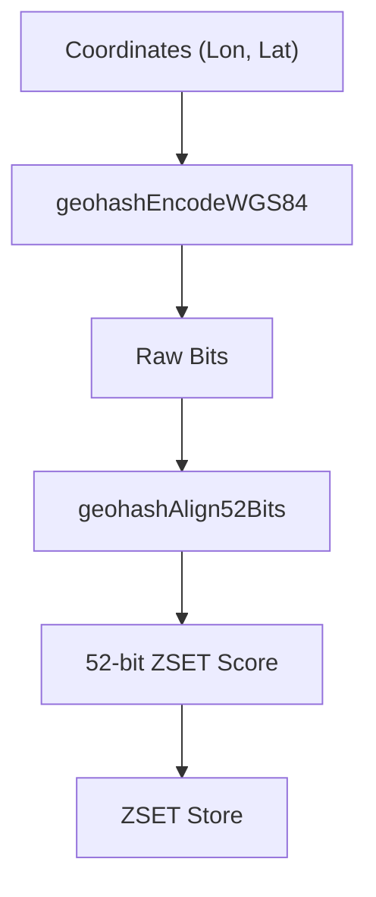

# Geospatial Queries
<details>
<summary>Relevant source files</summary>

The following files were used as context for generating this wiki page:

- [src/geo.c](https://github.com/redis/redis/blob/main/src/geo.c)
- [src/geohash_helper.c](https://github.com/redis/redis/blob/main/src/geohash_helper.c)
- [src/geohash.c](https://github.com/redis/redis/blob/main/src/geohash.c)
- [src/geohash.h](https://github.com/redis/redis/blob/main/src/geohash.h)
- [src/commands/geohash.json](https://github.com/redis/redis/blob/main/src/commands/geohash.json)
- [src/commands/georadius.json](https://github.com/redis/redis/blob/main/src/commands/georadius.json)
- [src/geohash_helper.h](https://github.com/redis/redis/blob/main/src/geohash_helper.h)
- [src/commands/georadiusbymember.json](https://github.com/redis/redis/blob/main/src/commands/georadiusbymember.json)
- [src/geo.h](https://github.com/redis/redis/blob/main/src/geo.h)
</details>

Geospatial queries in Redis allow developers to store and retrieve geographical coordinate data associated with specific identifiers. The subsystem is built on top of the existing sorted set (`ZSET`) data type. Because sorted sets maintain elements sorted by a floating-point score, Redis leverages this by encoding latitude and longitude pairs into a 52-bit integer (the "Geohash"), which is then used as the score in the underlying ZSET. This allows high-performance range queries on geographic data using standard ZSET range operations.

The architecture centers on the Geohash, an algorithm that maps two-dimensional coordinates into a one-dimensional value while preserving locality to a reasonable degree. By partitioning the globe into a grid, Redis can search for points within a specified radius by calculating which grid boxes (the central box and eight neighbors) intersect the requested area. This mechanism abstracts away the complexity of great-circle distance calculations, allowing for efficient radius and bounding box searches.

The system interacts directly with the server’s storage layer and command execution framework. When a geospatial command is executed, the subsystem parses inputs, computes the required Geohash bounds, performs range scans on the ZSET, and filters the results using accurate distance formulas. The integration with ZSETs ensures that geospatial data benefits from the same persistence, replication, and memory management features as any other key-value structure in the system.

## The Geohash Encoding Mechanism

The foundation of geospatial queries is the translation of spatial coordinates into a sortable ZSET score. Redis uses a 52-bit integer for this purpose to ensure compatibility with standard floating-point types.

- **Encoding:** Coordinates are encoded using `geohashEncodeWGS84`. The world is divided into a grid, and coordinates are interleaved bitwise into a `uint64_t` value.
- **Alignment:** The `geohashAlign52Bits` function takes the variable-length bits and left-shifts them to fill the 52-bit range, effectively creating a hierarchical spatial index where points within the same "box" (at a specific precision/step) share the same prefix.
- **Decoding:** Conversely, `geohashDecodeToLongLatWGS84` reverses this process, allowing the system to determine the original latitude and longitude from the ZSET score during result filtering.


Sources: [src/geo.c:491-494](https://github.com/redis/redis/blob/main/src/geo.c#L491-L494), [src/geohash_helper.c:213-217](https://github.com/redis/redis/blob/main/src/geohash_helper.c#L213-L217), [src/geohash.c:121-151](https://github.com/redis/redis/blob/main/src/geohash.c#L121-L151)

## Radius and Box Search Strategy

Queries operate by calculating a set of grid cells that cover the search area. The process follows a specific call chain:

1. **Calculate Areas:** `geohashCalculateAreasByShapeWGS84()` determines the grid coverage (a central Geohash box and its 8 neighbors).
2. **Retrieve Members:** `membersOfAllNeighbors()` iterates through these 9 boxes, calling `membersOfGeoHashBox()` for each.
3. **Scan Range:** `geoGetPointsInRange()` queries the sorted set using `zslNthInRange()` or `zzlFirstInRange()` to identify candidate members whose scores fall within the box bounds.
4. **Final Filtering:** `geoWithinShape()` is called on candidates to perform a precise distance check, as Geohash boxes are approximations.

> [!NOTE]
> Grid boxes are not perfect matches for circles. The filtering step in `geoWithinShape` is critical because it validates the great-circle distance between the point and the query center, discarding false positives that were returned simply because they were in the same grid cell.

Sources: [src/geo.c:358-362](https://github.com/redis/redis/blob/main/src/geo.c#L358-L362), [src/geo.c:366-422](https://github.com/redis/redis/blob/main/src/geo.c#L366-L422), [src/geohash_helper.c:121-211](https://github.com/redis/redis/blob/main/src/geohash_helper.c#L121-L211)

## Distance Calculations

Distance is calculated using the Haversine formula, which computes the great-circle distance between two points on a sphere.

- **Accuracy:** The distance logic in `geohashGetDistance` uses `EARTH_RADIUS_IN_METERS` (6372797.560856) to perform spherical trigonometry.
- **Optimization:** If the longitude difference is zero, the implementation simplifies the formula to `geohashGetLatDistance`, avoiding expensive `sin`/`cos` operations.

| Function | Formula | Complexity |
| :--- | :--- | :--- |
| `geohashGetLatDistance` | `Radius * abs(lat2 - lat1)` | O(1) |
| `geohashGetDistance` | `Haversine formula` | O(1) |

Sources: [src/geohash_helper.c:224-226](https://github.com/redis/redis/blob/main/src/geohash_helper.c#L224-L226), [src/geohash_helper.c:229-242](https://github.com/redis/redis/blob/main/src/geohash_helper.c#L229-L242)

## Result Processing and Sorting

When a search returns multiple candidates, Redis uses `geoArray` to store points and their associated distances.

- **Sorting:** The `georadiusGeneric` function coordinates sorting. If a user requests `ASC` or `DESC` ordering, `qsort` or `pqsort` is invoked using `sort_gp_asc` or `sort_gp_desc` callbacks.
- **Limit/Any:** The `any` flag (available in `COUNT` queries) allows the search to terminate early once the requested number of points is found, optimizing performance for large datasets.

> [!IMPORTANT]
> When using the `COUNT` option without explicit sorting, the system forces `SORT_ASC` to provide consistent results unless the `ANY` flag is provided.

Sources: [src/geo.c:425-439](https://github.com/redis/redis/blob/main/src/geo.c#L425-L439), [src/geo.c:741-755](https://github.com/redis/redis/blob/main/src/geo.c#L741-L755)

## API Usage Example

The following example demonstrates how to add a location and query it using the legacy `GEORADIUS` command.

```c
// Example usage snippet
// 1. Add a location:
// GEOADD Sicily 13.361389 38.115556 "Palermo"
// 2. Perform a search:
// GEORADIUS Sicily 15 37 200 km WITHDIST
```

```c
// Internal representation of the search shape configuration:
GeoShape shape = {0};
shape.type = CIRCULAR_TYPE;
shape.xy[0] = 15.0; // Longitude
shape.xy[1] = 37.0; // Latitude
shape.t.radius = 200.0;
shape.conversion = 1000.0; // Convert km to meters
```
Sources: [src/geo.c:538-540](https://github.com/redis/redis/blob/main/src/geo.c#L538-L540)

## Design Trade-offs

| Design Choice | Benefit | Cost |
| :--- | :--- | :--- |
| **ZSET backing** | Reuse existing persistence/replication logic | Higher memory overhead than dedicated spatial trees |
| **Geohash approximation** | Efficient 1D range queries on 2D data | Requires extra filtering step to eliminate false positives |
| **52-bit score constraint** | Compatible with standard IEEE 754 doubles | Limits spatial precision compared to 64-bit alternatives |

Sources: [src/geo.c:36-39](https://github.com/redis/redis/blob/main/src/geo.c#L36-L39), [src/geohash_helper.c:213-217](https://github.com/redis/redis/blob/main/src/geohash_helper.c#L213-L217)