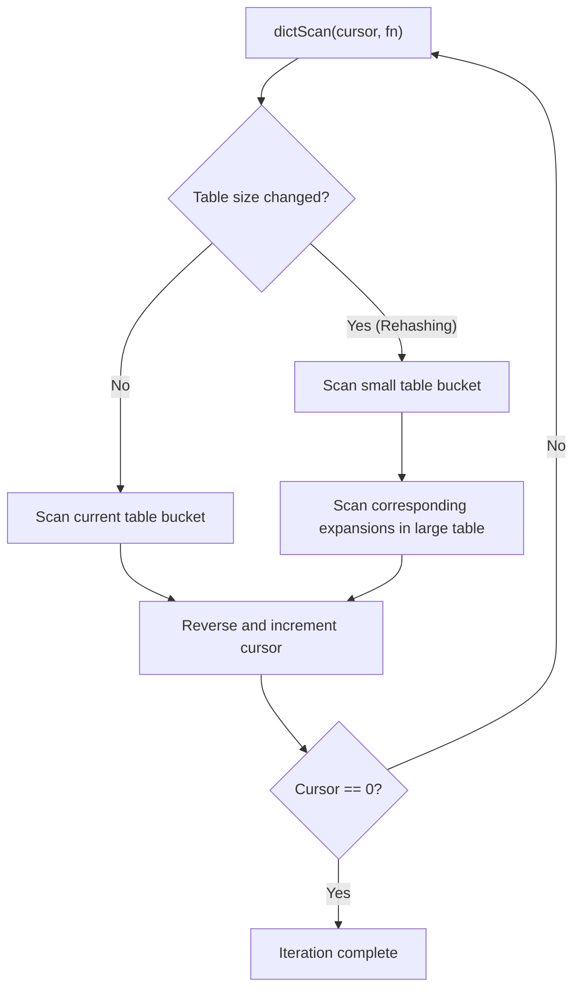

# Hash Table Dictionary
<details>
<summary>Relevant source files</summary>

The following files were used as context for generating this wiki page:

- [src/kvstore.c](https://github.com/redis/redis/blob/main/src/kvstore.c)
- [src/dict.c](https://github.com/redis/redis/blob/main/src/dict.c)
- [src/t_stream.c](https://github.com/redis/redis/blob/main/src/t_stream.c)
</details>

The Hash Table Dictionary (`dict`) is the foundational, high-performance in-memory hash table implementation powering key-value storage. Designed to provide O(1) average time complexity for primary operations, it manages dynamically resizing buckets using chained linked lists to resolve collisions. It is architected to handle millions of operations with low latency, balancing memory efficiency with throughput through strategies like incremental rehashing.

In the broader system, the dictionary does not exist in isolation. It serves as the core mapping mechanism for the database keyspace. By decoupling the hash table's storage logic from the server's business logic, the dictionary provides a flexible interface that allows various data types to be implemented atop it. It interacts closely with the `kvstore` component, which orchestrates multiple dictionaries to support advanced features like improved concurrency and cluster-specific memory management.

Key design decisions in this implementation prioritize adaptability under load. The dictionary supports incremental rehashing, which moves data between hash tables during read/write operations to avoid the latency spikes associated with massive, synchronous reallocations. This "lazy" migration allows the system to remain responsive even during significant workload changes, effectively amortizing the cost of resizing across many requests.

## Public Interface and API Surface

The dictionary exposes a comprehensive interface for data manipulation. At its core, the API provides functions for lifecycle management, entry access, and iteration. The implementation is designed to handle key-value pairs (using `dictEntry`) or key-only storage (`dictEntryNoValue`) to optimize memory usage when values are irrelevant (e.g., in a set implementation).

| Function | Signature | Purpose |
| :--- | :--- | :--- |
| `dictCreate` | `(dictType *type)` | Initializes a new hash table dictionary. |
| `dictAdd` | `(dict *d, void *key, void *val)` | Inserts a key-value pair. |
| `dictFind` | `(dict *d, const void *key)` | Retrieves the `dictEntry` for a given key. |
| `dictDelete` | `(dict *ht, const void *key)` | Removes a key from the dictionary. |
| `dictExpand` | `(dict *d, unsigned long size)` | Manually requests a table resize. |
| `dictScan` | `(dict *d, ...)` | Iterates through elements in a dictionary safely. |

Sources: [src/dict.c:198-206](https://github.com/redis/redis/blob/main/src/dict.c#L198-L206), [src/dict.c:493-500](https://github.com/redis/redis/blob/main/src/dict.c#L493-L500), [src/dict.c:800-804](https://github.com/redis/redis/blob/main/src/dict.c#L800-L804), [src/dict.c:669-671](https://github.com/redis/redis/blob/main/src/dict.c#L669-L671), [src/dict.c:314-316](https://github.com/redis/redis/blob/main/src/dict.c#L314-L316), [src/dict.c:1518-1524](https://github.com/redis/redis/blob/main/src/dict.c#L1518-L1524)

## Incremental Rehashing Mechanism

Rehashing is triggered when the dictionary load factor hits a threshold defined by `dict_can_resize`. Rather than performing the work atomically, `dictRehash` migrates buckets over multiple steps. The system maintains two tables (`ht_table[0]` and `ht_table[1]`) during the transition.

1.  **Trigger:** `dictExpandIfNeeded` or `dictShrinkIfNeeded` detects a load factor breach, setting `ht_table[1]` and initiating rehashing by setting `rehashidx = 0`.
2.  **Step-wise Execution:** Each operation (lookup, update, add) calls `_dictRehashStep`, which executes a small, constant amount of work (`dictRehash(d, 1)`).
3.  **Work Unboundness Check:** To prevent excessive blocking, `dictRehash` limits itself by checking `empty_visits` (defined as `n*10`). If a bucket is empty, it skips it but counts it towards the limit.
4.  **Completion:** `dictCheckRehashingCompleted` is called after every step. Once `ht_used[0]` drops to 0, the new table is promoted to index 0, and the old one is freed.

> [!NOTE]
> During rehashing, the hash table is in a state where data resides in both tables. Operations must be aware of `rehashidx` to determine which table to query; buckets at indices lower than `rehashidx` have already been migrated and exist only in `ht_table[1]`.

Sources: [src/dict.c:405-434](https://github.com/redis/redis/blob/main/src/dict.c#L405-L434), [src/dict.c:468-470](https://github.com/redis/redis/blob/main/src/dict.c#L468-L470), [src/dict.c:380-394](https://github.com/redis/redis/blob/main/src/dict.c#L380-L394)

## Call-Chain Execution: Adding an Entry

The process of inserting a key into the dictionary is carefully staged to handle potential resizes and existing values efficiently.

1.  **`dictAddRaw`**: This is the entry point. It calls `dictFindLinkForInsert` to check for existing keys and find the appropriate bucket index.
2.  **`dictFindLinkForInsert`**: This performs internal bookkeeping:
    *   `_dictRehashStepIfNeeded`: Triggers a step of incremental rehashing if the target index is already processed or exists in the migration path.
    *   `_dictExpandIfNeeded`: Evaluates if the dictionary needs more capacity, potentially initiating the rehashing process.
    *   The function returns a `dictEntryLink`, which is a pointer to the bucket pointer.
3.  **`dictInsertKeyAtLink`**: Once a link is obtained, this function allocates the new entry and updates the bucket's head pointer to point to the new entry, essentially inserting the new key at the start of the chain.

Sources: [src/dict.c:526-536](https://github.com/redis/redis/blob/main/src/dict.c#L526-L536), [src/dict.c:733-768](https://github.com/redis/redis/blob/main/src/dict.c#L733-L768), [src/dict.c:542-575](https://github.com/redis/redis/blob/main/src/dict.c#L542-L575)

## Design Trade-offs

The architecture reflects a conscious effort to balance memory usage against access speed.

| Design Choice | Benefit | Cost |
| :--- | :--- | :--- |
| Separate Chaining | Simple deletion and stable bucket array. | Increased cache misses due to pointer chasing. |
| Incremental Rehashing | Prevents long-latency spikes during expansion. | Increased complexity in logic and memory usage (two tables). |
| Power-of-two sizing | Fast bucket indexing via bitmask (`size - 1`). | Potentially inefficient if data distribution is not uniform. |
| No-Value Entry Type | Massive memory savings for Set-like structures. | Additional checks for type compatibility (is entry a key or entry?). |

Sources: [src/dict.c:1-6](https://github.com/redis/redis/blob/main/src/dict.c#L1-L6), [src/dict.c:405-412](https://github.com/redis/redis/blob/main/src/dict.c#L405-L412), [src/dict.c:127-133](https://github.com/redis/redis/blob/main/src/dict.c#L127-L133)

## Advanced Iteration (Scan)

The `dictScan` operation is designed to be safe even when the hash table is resizing. It uses a cursor-based approach where the cursor bits are reversed, incremented, and reversed again. This specific algorithm ensures that, even if the table size grows (doubling), the scan can continue without repeating visited items or missing keys. When rehashing, the scanner checks the smaller table and then all potential expansions of the current cursor into the larger table.


Sources: [src/dict.c:1434-1524](https://github.com/redis/redis/blob/main/src/dict.c#L1434-L1524)

## Memory Management and Defrag

The dictionary exposes mechanisms to allow active defragmentation (`dictScanDefrag`), which iterates over entries and invokes callbacks to reallocate their memory. This is critical for systems with high churn to prevent memory fragmentation. Because the dictionary uses specific bit patterns in pointers (`ENTRY_PTR_MASK`) to determine if a pointer points to an `entry` struct or a `key` directly, the defragmenter must understand these tags when reallocating.

> [!WARNING]
> `dictDefragBucket` manipulates pointers based on `ENTRY_PTR_MASK`. Incorrectly reallocating or modifying the entry metadata without preserving these tags will corrupt the bucket chain, leading to inaccessible data or segmentation faults.

Sources: [src/dict.c:1364-1396](https://github.com/redis/redis/blob/main/src/dict.c#L1364-L1396), [src/dict.c:127-133](https://github.com/redis/redis/blob/main/src/dict.c#L127-L133)

## Usage Example

Developers can integrate the dictionary as follows:

```c
// Example: Creating and populating a dictionary
dictType myType = {
    .hashFunction = myHashFunc,
    .keyCompare = myCmpFunc,
    .no_value = 0
};

dict *d = dictCreate(&myType);

// Add a value
char *k = "myKey";
char *v = "myVal";
if (dictAdd(d, k, v) == DICT_OK) {
    // Successfully added
}

// Search for value
dictEntry *de = dictFind(d, k);
if (de) {
    printf("Value: %s\n", (char *)dictGetVal(de));
}

dictRelease(d);
```
Sources: [src/dict.c:198-206](https://github.com/redis/redis/blob/main/src/dict.c#L198-L206), [src/dict.c:493-499](https://github.com/redis/redis/blob/main/src/dict.c#L493-L499), [src/dict.c:800-803](https://github.com/redis/redis/blob/main/src/dict.c#L800-L803)