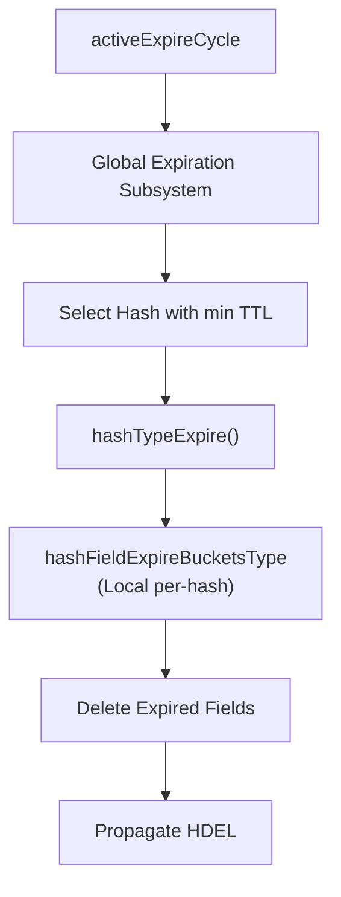
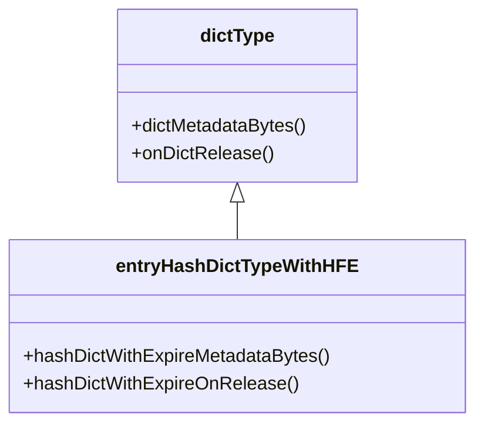

# Key Metadata
<details>
<summary>Relevant source files</summary>

The following files were used as context for generating this wiki page:

- [src/t_hash.c](https://github.com/redis/redis/blob/main/src/t_hash.c)
- [src/db.c](https://github.com/redis/redis/blob/main/src/db.c)
</details>

Key Metadata is a mechanism within the Redis architecture designed to decouple the storage of primary data objects from secondary properties such as expiration, access statistics, and module-specific metadata. Historically, these properties were often embedded directly into objects or managed by ad-hoc, type-specific structures. By centralizing metadata management, the system achieves a more uniform approach to features like Active Expiration, memory tracking, and cluster-aware trimming.

The core problem this component solves is the "state bloat" that occurs when basic data structures (like hashes, sets, or streams) must independently track complex lifecycle invariants. For instance, in `src/t_hash.c`, hashes with Hash Field Expiration (HFE) require private `ebuckets` to manage individual field TTLs while simultaneously integrating with the global database expiration system for active expiration. Metadata management provides a standardized way to attach, transition, and release these complex lifecycle state containers without polluting the primary business logic of the data structure.

The design relies on "meta-containers" or extended structures that live alongside the primary object. These structures facilitate a "lifecycle of concern" separation: the main data structure focuses on maintaining the data organization (e.g., dict or listpack), while the metadata structure manages secondary invariants. This ensures that features like memory tracking, which requires knowledge of both the structure size and its attached metadata, can be updated consistently through central API endpoints, reducing the risk of tracking errors or memory leaks during complex operations like field deletion or conversion.

## Hash Field Expiration (HFE)
The HFE system is a specialized metadata application for hash fields. Hash objects can exist as simple listpacks (standard) or as `OBJ_ENCODING_LISTPACK_EX` / `OBJ_ENCODING_HT` when expiration metadata is present. The mechanism uses an `ebuckets` data structure—a compact, time-indexed structure for expiration—attached to the individual hash object.

When a field is updated with an expiration time, the hash instance itself is registered in the database for active expiration. This enables the `activeExpireCycle()` function to trigger sub-expiration on individual hash instances rather than scanning every field of every hash, which would be prohibitively slow. 

> [!NOTE]
> Hash instances with HFE are only registered in the system-wide expiration subsystem if they have at least one field with an active expiry. Once all fields expire or are persisted, the hash should ideally be removed from the tracker to preserve cycles.

Sources: [src/t_hash.c:112-121](https://github.com/redis/redis/blob/main/src/t_hash.c#L112-L121)

## Global HFE Orchestration
The coordination between local hash-field expiration and the global active expiration cycle is managed through structured types defined within the hash module. Each database maintains this structure to quickly identify which hash objects contain expiring fields, prioritized by the minimum expiration time within that hash.

The logic flow follows these steps:
1. `activeExpireCycle` probes the database.
2. It identifies the hash instance with the earliest expiring field.
3. It calls `hashTypeExpire()` to perform local, per-field expiration.
4. `hashTypeExpire()` uses `ebExpire()` on the local hash `ebuckets` to clean up expired entries.


Sources: [src/t_hash.c:112-135](https://github.com/redis/redis/blob/main/src/t_hash.c#L112-L135)

## Hash Field Set Expiration API
Setting an expiration on a hash field (`HEXPIRE`) involves a delicate balance between local dictionary updates and global expiration management. To avoid high costs, the system uses a transactional-like buffer pattern: `hashTypeSetExInit`, `hashTypeSetEx` (called zero or more times), and `hashTypeSetExDone`.

The `HashTypeSetEx` struct acts as a transient metadata tracker that calculates whether the global expiration heap needs an update. 

| Field | Purpose |
| :--- | :--- |
| `minExpire` | The current minimum expiration time of the hash. |
| `minExpireFields` | Tracks the minimum expiration among updated fields. |
| `expireSetCond` | Bitmask for condition flags (NX, XX, GT, LT). |

> [!TIP]
> The check `ex->minExpire < ex->minExpireFields` in `hashTypeSetExDone` is a critical guard. It prevents redundant global registry updates when the hash's overall minimum expiration time remains unchanged despite individual field updates.

Sources: [src/t_hash.c:164-224](https://github.com/redis/redis/blob/main/src/t_hash.c#L164-L224), [src/t_hash.c:1244-1280](https://github.com/redis/redis/blob/main/src/t_hash.c#L1244-L1280)

## Metadata Lifecycle in `dictType`
When a hash is upgraded to support HFE, its `dictType` transitions from `entryHashDictType` to `entryHashDictTypeWithHFE`. This transition is managed by swapping the `dictType` struct, which contains hooks for memory estimation and metadata cleanup.

`hashDictWithExpireOnRelease` is the designated cleanup mechanism, ensuring that the local `ebuckets` instance attached to the dictionary is destroyed when the hash is deleted, preventing memory leaks.


Sources: [src/t_hash.c:85-109](https://github.com/redis/redis/blob/main/src/t_hash.c#L85-L109), [src/t_hash.c:261-265](https://github.com/redis/redis/blob/main/src/t_hash.c#L261-L265)

## Memory Tracking and Keysizes
Metadata components often interact with system-wide observability structures. For example, `updateSlotAllocSize` (in `src/db.c`) and `updateKeysizesHist` (in `src/db.c`) are invoked whenever hash metadata or element counts change. This ensures that system-level metrics like `INFO` output accurately reflect the impact of HFE-enabled hashes.

The `dbAddInternal` operation serves as a foundational bridge, ensuring that new keys are initialized with appropriate metadata bits, which dictates how the object is treated by the KV-store and eviction logic.

Sources: [src/db.c:121-147](https://github.com/redis/redis/blob/main/src/db.c#L121-L147), [src/db.c:416-435](https://github.com/redis/redis/blob/main/src/db.c#L416-L435)

## Implementation Example: Setting Field Expiry
To programmatically update an expiration time for a hash field while adhering to the metadata buffer pattern, perform the following:

```c
HashTypeSetEx ex;
// 1. Initialize context
hashTypeSetExInit(key, hashObj, c, c->db, HFE_NX, &ex);

// 2. Perform one or more set operations
SetExRes res = hashTypeSetEx(hashObj, field, 1729000000, &ex);

// 3. Finalize and trigger global updates
hashTypeSetExDone(&ex);
```
This pattern ensures the atomic consistency of the local dictionary metadata and the global expiration management.

Sources: [src/t_hash.c:164-176](https://github.com/redis/redis/blob/main/src/t_hash.c#L164-L176)