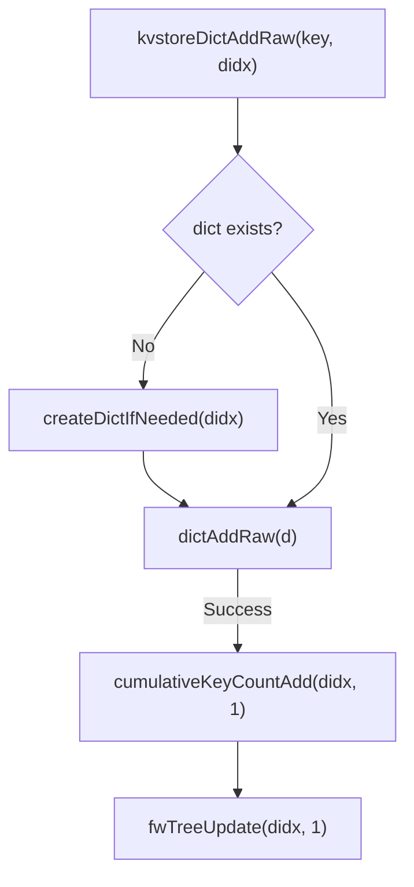

# Key Value Store
<details>
<summary>Relevant source files</summary>

The following files were used as context for generating this wiki page:

- [src/kvstore.c](https://github.com/redis/redis/blob/main/src/kvstore.c)
- [src/cluster.c](https://github.com/redis/redis/blob/main/src/cluster.c)
- [src/kvstore.h](https://github.com/redis/redis/blob/main/src/kvstore.h)
- [src/db.c](https://github.com/redis/redis/blob/main/src/db.c)
</details>

The `kvstore` is a sophisticated, index-based Key-Value store abstraction designed to manage partitioned collections of dictionaries (`dict`). By organizing keys into an array of sub-dictionaries, the system enables high-performance operations on subsets of the keyspace, most notably facilitating cluster slot management where keys mapping to specific hash-slots are co-located for efficient access and bulk operations.

Architecturally, the `kvstore` serves as a wrapper around a dynamic array of hash tables. It provides a consistent interface to perform operations across these shards (such as scanning or resizing) while allowing individual sub-dictionaries to evolve independently. This structure addresses the problem of managing large, heterogeneous datasets where specific sub-partitions require frequent administrative manipulation, such as the atomic migration or rapid flushing of keys associated with specific cluster slots.

The component is engineered for adaptability, using a `kvstoreType` structure to define operational callbacks. It integrates directly with the database layer, allowing for the automatic tracking of key counts and bucket statistics per sub-partition. This provides a robust foundation for operations like iterative rehashing and memory estimation, ensuring the store remains performant and observable as the dataset scales.

## Core Data Structures

The `kvstore` is defined by the `_kvstore` structure. It manages a `dict **dicts` array where keys are logically segmented. The use of a `fenwickTree` (Binary Indexed Tree) for `dict_sizes` is a critical design choice; it allows the system to efficiently store and query cumulative key frequencies across dicts, providing an $O(\log n)$ lookup to find which dictionary a key index belongs to.

| Field | Purpose |
| :--- | :--- |
| `dicts` | An array of pointers to `dict` instances (sub-partitions). |
| `num_dicts` | Total count of dictionary shards available. |
| `key_count` | Aggregated total count of all keys across shards. |
| `bucket_count` | Aggregated count of hash buckets across shards. |
| `dict_sizes` | Fenwick Tree for $O(\log N)$ prefix sum queries of key counts. |
| `rehashing` | A `list` containing all dicts currently undergoing incremental rehashing. |

Sources: [src/kvstore.c:28-44](https://github.com/redis/redis/blob/main/src/kvstore.c#L28-L44)

> [!NOTE]
> The Fenwick Tree (`dict_sizes`) is only initialized if `num_dicts > 1`. This optimizes for simple, single-partition cases where the overhead of the BIT is unnecessary.

Sources: [src/kvstore.c:239](https://github.com/redis/redis/blob/main/src/kvstore.c#L239)

## API and Interface Surface

The `kvstore` API is divided into global operations (scanning, statistics, management) and partition-specific operations (fetch, add, delete). Most operations accept a `didx` (dictionary index) to target a specific shard.

| Method | Purpose |
| :--- | :--- |
| `kvstoreCreate` | Initializes a new store with a specific bit-width for shards. |
| `kvstoreDictFind` | Locates an entry in a specific dictionary index. |
| `kvstoreDictAddRaw` | Adds an entry to a specific partition and triggers BIT updates. |
| `kvstoreScan` | Iterates across the entire keyspace using a cursor-based approach. |
| `kvstoreMoveDict` | Moves a whole partition between two `kvstore` instances. |

Sources: [src/kvstore.c:197-243](https://github.com/redis/redis/blob/main/src/kvstore.c#L197-L243), [src/kvstore.c:332-374](https://github.com/redis/redis/blob/main/src/kvstore.c#L332-L374)

## Execution Walkthrough: Adding an Entry

When a new key-value pair is added via `kvstoreDictAddRaw`, the system ensures both the dictionary state and the global metadata indices are updated consistently.

1.  **Creation:** `kvstoreDictAddRaw` calls `createDictIfNeeded` to ensure the target dictionary `didx` is allocated.
2.  **Insertion:** It calls `dictAddRaw` from the core dictionary implementation to insert the entry.
3.  **Index Update:** On success, `cumulativeKeyCountAdd` is triggered.
    - Increments `kvs->key_count` and `kvs->non_empty_dicts` if the dictionary transitions from empty to occupied.
    - Calls `fwTreeUpdate` on the Fenwick Tree to update the cumulative distribution of keys for the range that includes `didx`.

Sources: [src/kvstore.c:891-896](https://github.com/redis/redis/blob/main/src/kvstore.c#L891-L896)


Sources: [src/kvstore.c:891-896](https://github.com/redis/redis/blob/main/src/kvstore.c#L891-L896), [src/kvstore.c:83-99](https://github.com/redis/redis/blob/main/src/kvstore.c#L83-L99)

## Scan Mechanism and Cursor Management

The `kvstoreScan` function allows iterating over keys across multiple sub-dictionaries. The cursor is bit-packed to represent both the current dictionary index and the internal dictionary traversal state.

- **Bit Layout:** The cursor reserves bits for the dictionary index. If there are N dictionaries, `num_dicts_bits` determines how many bits are used to store the current `didx`.
- **Flow:** `getAndClearDictIndexFromCursor` extracts the current shard index. Once a shard is fully scanned (cursor returns 0), the function calls `kvstoreGetNextNonEmptyDictIndex` to locate the next active shard and updates the cursor before returning.

Sources: [src/kvstore.c:332-374](https://github.com/redis/redis/blob/main/src/kvstore.c#L332-L374)

> [!WARNING]
> The current implementation limits the number of dictionaries to 2 to the power of 16 because the scanning cursor logic is designed to pack the dict index into the lower bits, reserving the higher bits for internal dictionary traversal.

Sources: [src/kvstore.c:198-200](https://github.com/redis/redis/blob/main/src/kvstore.c#L198-L200)

## Design Trade-offs

The `kvstore` architecture makes specific trade-offs to balance multi-shard efficiency with standard dictionary performance.

| Design Choice | Benefit | Cost |
| :--- | :--- | :--- |
| **Index-Based Sharding** | Allows efficient `SFLUSH` and slot migration. | Increased memory footprint per dictionary structure. |
| **Fenwick Tree Index** | $O(\log N)$ search for target key index. | Complexity in managing BIT updates on every insert/delete. |
| **Lazy Dictionary Allocation** | Reduces startup memory usage for empty shards. | Adds branches (check for NULL) to every lookup path. |

Sources: [src/kvstore.c:102-108](https://github.com/redis/redis/blob/main/src/kvstore.c#L102-L108), [src/kvstore.c:518-524](https://github.com/redis/redis/blob/main/src/kvstore.c#L518-L524)

## Worked Example: Partitioned Access

This example demonstrates how to create a partitioned store and access specific shards, which is the primary use case in a clustered deployment.

```c
/* Setup a kvstore for a cluster-like environment with 4 slots (2 bits) */
kvstoreType type = {0};
dictType dtype = { .hashFunction = hashTestCallback };

kvstore *kvs = kvstoreCreate(&type, &dtype, 2, KVSTORE_ALLOCATE_DICTS_ON_DEMAND);

/* Adding keys to a specific slot (didx=1) */
dictEntry *de = kvstoreDictAddRaw(kvs, 1, "myKey", NULL);
kvstoreDictSetVal(kvs, 1, de, "myValue");

/* Verify the size of specific shard */
unsigned long count = kvstoreDictSize(kvs, 1);
printf("Keys in slot 1: %lu\n", count);

/* Cleanup */
kvstoreRelease(kvs);
```
Sources: [src/kvstore.c:197-243](https://github.com/redis/redis/blob/main/src/kvstore.c#L197-L243), [src/kvstore.c:891-908](https://github.com/redis/redis/blob/main/src/kvstore.c#L891-L908)