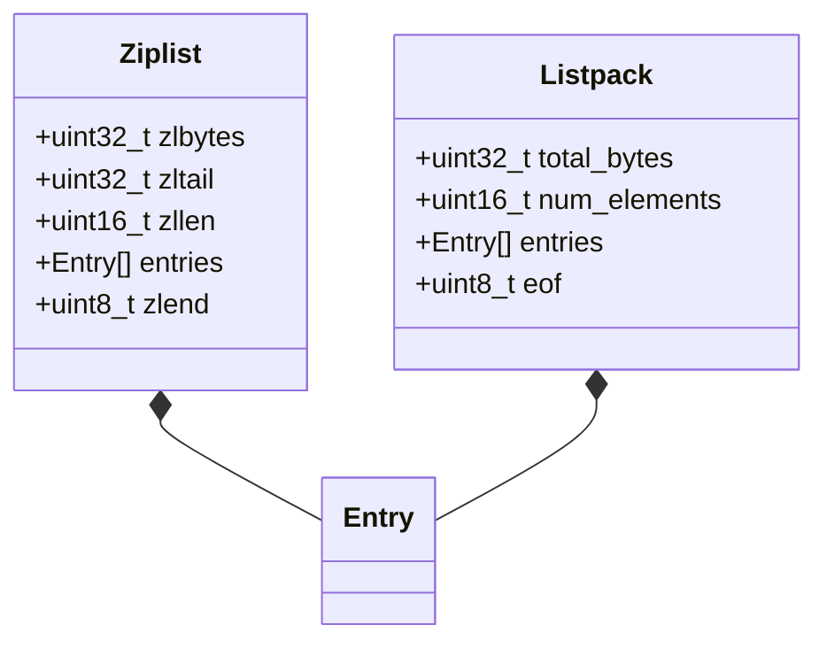
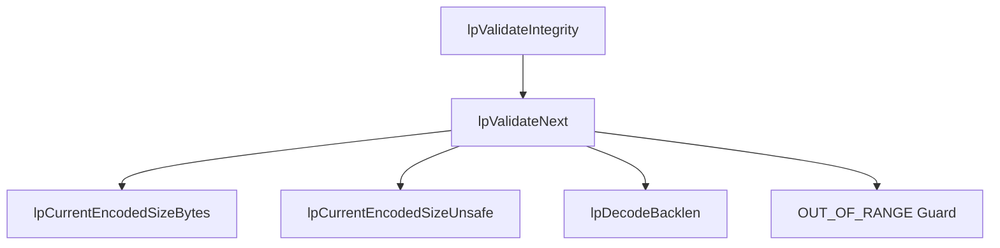

# Listpack and Ziplist
<details>
<summary>Relevant source files</summary>

The following files were used as context for generating this wiki page:

- [src/listpack.c](https://github.com/redis/redis/blob/main/src/listpack.c)
- [src/ziplist.c](https://github.com/redis/redis/blob/main/src/ziplist.c)
</details>

Listpack and Ziplist are compact, memory-efficient data serialization formats used within Redis to store small collections (lists, hashes, and sorted sets). These structures are designed to trade CPU cycles for memory savings, packing elements tightly into a single contiguous memory buffer. By avoiding the overhead of pointers and fixed-size headers associated with standard linked lists or hash tables, they significantly reduce the footprint of collections that contain a small number of elements or small data values.

The Listpack (`listpack.c`) is the modern successor to the Ziplist (`ziplist.c`). While both fulfill the same purpose, Listpack was designed to be more robust, easier to modify, and free from the "cascade update" problem that plagued Ziplists. In a Ziplist, changing the length of an element could trigger a ripple effect of metadata updates across subsequent elements, potentially leading to $O(N)$ worst-case latency for $O(1)$ operations. Listpack avoids this by using a different encoding for the metadata (storing the entry's length at the end of the entry itself).

These subsystems act as the "primitive" layer for higher-level Redis data types. When a user creates a hash or list, Redis initially represents it as a Listpack (or Ziplist, for compatibility). Once the collection exceeds a pre-defined threshold (in terms of entry count or individual element size), Redis "converts" the collection to a more scalable structure (like a `dict` or a `quicklist`). This hybrid approach allows Redis to remain memory-efficient for small datasets while providing high performance for large ones.

## Public Interface Surface

The Listpack and Ziplist APIs expose primitives for navigation, modification, and data retrieval. The Listpack API is generally cleaner, as it avoids some of the complexity introduced by Ziplist’s back-pointer handling.

| Operation | Listpack API | Ziplist API |
| :--- | :--- | :--- |
| Creation | `lpNew` | `ziplistNew` |
| Deletion | `lpDelete` | `ziplistDelete` |
| Insertion | `lpInsert` | `ziplistInsert` |
| Navigation | `lpNext`, `lpPrev` | `ziplistNext`, `ziplistPrev` |
| Retrieval | `lpGet`, `lpGetValue` | `ziplistGet` |
| Merging | `lpMerge` | `ziplistMerge` |

Sources: [src/listpack.c:216-228](https://github.com/redis/redis/blob/main/src/listpack.c#L216-L228), [src/listpack.c:976-977](https://github.com/redis/redis/blob/main/src/listpack.c#L976-L977), [src/ziplist.c:711-718](https://github.com/redis/redis/blob/main/src/ziplist.c#L711-L718), [src/ziplist.c:1259-1261](https://github.com/redis/redis/blob/main/src/ziplist.c#L1259-L1261)

## Architecture and Memory Layout

A Ziplist is a sequence of entries prefixed by a header (`zlbytes`, `zltail`, `zllen`) and terminated by `ZIP_END` (0xFF). Every entry stores the `prevlen` (the size of the previous entry) to support backward navigation. A Listpack uses a similar approach but stores the length of the entry *at the end* of the entry, allowing for simpler updates because an entry's size change doesn't immediately affect the metadata prefixing the next entry.


Sources: [src/listpack.c:27-28](https://github.com/redis/redis/blob/main/src/listpack.c#L27-L28), [src/ziplist.c:16](https://github.com/redis/redis/blob/main/src/ziplist.c#L16), [src/ziplist.c:231-238](https://github.com/redis/redis/blob/main/src/ziplist.c#L231-L238)

## Call-Chain: Listpack Integrity Validation

Listpack ensures data integrity through recursive validation. The `lpValidateIntegrity` function is the entry point for deep checks, ensuring the listpack adheres to its format constraints.

1. `lpValidateIntegrity` scans the entire listpack.
2. For every entry, it calls `lpValidateNext` to verify the entry header.
3. `lpValidateNext` calls `lpCurrentEncodedSizeBytes` to check the encoding byte.
4. `lpValidateNext` retrieves entry length via `lpCurrentEncodedSizeUnsafe`.
5. Finally, `lpValidateNext` performs boundary checks to ensure the entry doesn't exceed the buffer limit.


Sources: [src/listpack.c:1647-1693](https://github.com/redis/redis/blob/main/src/listpack.c#L1647-L1693), [src/listpack.c:1703-1749](https://github.com/redis/redis/blob/main/src/listpack.c#L1703-L1749)

## Design Trade-offs

| Design Choice | Benefit | Cost |
| :--- | :--- | :--- |
| **Contiguous Memory** | Cache locality and reduced allocation overhead | $O(N)$ insertion/deletion due to `memmove` |
| **Variable Length Encoding** | Minimal memory usage for small values | Increased complexity in accessors and decoders |
| **Integer/String Hybrid** | Avoids string conversion overhead for numeric data | More complex encoding logic (bit masking) |
| **Listpack End-Length** | Removes "cascade update" problem | Requires parsing backwards from the backlen byte |

Sources: [src/listpack.c:1057-1063](https://github.com/redis/redis/blob/main/src/listpack.c#L1057-L1063), [src/listpack.c:400-434](https://github.com/redis/redis/blob/main/src/listpack.c#L400-L434), [src/ziplist.c:750-846](https://github.com/redis/redis/blob/main/src/ziplist.c#L750-L846)

> [!TIP]
> Use `lpSafeToAdd` before adding elements to a listpack to prevent overflow, as the structure is limited to 1GB to maintain safe indexing within the 32-bit `total bytes` header field.

Sources: [src/listpack.c:121-129](https://github.com/redis/redis/blob/main/src/listpack.c#L121-L129)

> [!WARNING]
> In Ziplists, `ZIPLIST_INCR_LENGTH` caps at `UINT16_MAX`. If you reach this limit, the metadata is effectively "stuck," and subsequent operations must perform a full $O(N)$ traversal to determine the actual number of entries.

Sources: [src/ziplist.c:259-267](https://github.com/redis/redis/blob/main/src/ziplist.c#L259-L267)

## Worked Example: Listpack Creation and Appending

The following code demonstrates the lifecycle of a basic listpack: creating it, appending an integer, and appending a string.

```c
// Example: Creating and manipulating a listpack
unsigned char *lp = lpNew(0); // Initialize a new listpack

// Appending an integer (automatically encoded)
lp = lpAppendInteger(lp, 1024);

// Appending a string
lp = lpAppend(lp, (unsigned char*)"Redis", 5);

// The listpack now holds two elements. 
// Freeing is handled by lpFree.
lpFree(lp);
```
Sources: [src/listpack.c:216-228](https://github.com/redis/redis/blob/main/src/listpack.c#L216-L228), [src/listpack.c:231-233](https://github.com/redis/redis/blob/main/src/listpack.c#L231-L233), [src/listpack.c:1299-1303](https://github.com/redis/redis/blob/main/src/listpack.c#L1299-L1303), [src/listpack.c:1306-1310](https://github.com/redis/redis/blob/main/src/listpack.c#L1306-L1310)