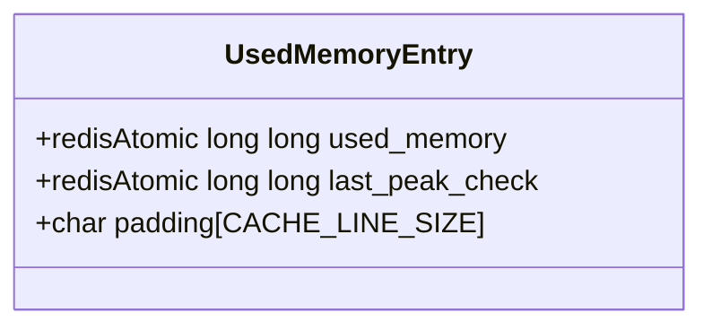
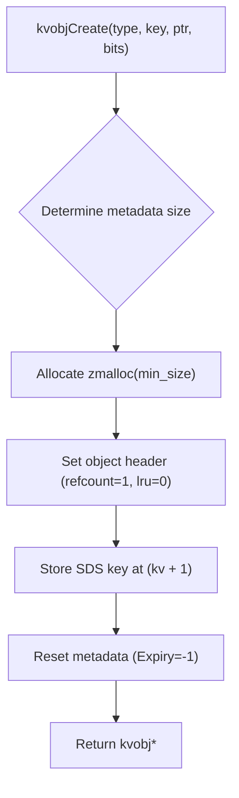

# Memory Allocator
<details>
<summary>Relevant source files</summary>

The following files were used as context for generating this wiki page:

- [src/object.c](https://github.com/redis/redis/blob/main/src/object.c)
- [src/zmalloc.c](https://github.com/redis/redis/blob/main/src/zmalloc.c)
- [src/zmalloc.h](https://github.com/redis/redis/blob/main/src/zmalloc.h)
- [src/defrag.c](https://github.com/redis/redis/blob/main/src/defrag.c)
</details>

The Memory Allocator in Redis serves as the foundational layer for all dynamic memory management, enabling the system to track usage, monitor peaks, and perform active defragmentation. Unlike standard library `malloc`, this subsystem provides a "total amount of allocated memory aware" interface, allowing Redis to maintain precise metrics on memory footprint, which is critical for eviction policies and capacity planning. By abstracting the underlying allocator (typically `jemalloc`), it provides a consistent API surface for all components to manage objects safely.

Beyond tracking, the memory allocator integrates deeply with the object layer. It enables the creation of memory-efficient objects (like `OBJ_ENCODING_EMBSTR`) where the object header and its string value are allocated within a single, continuous chunk of memory. This design decision reduces memory overhead and improves cache locality, as accessing the object's value often involves reading the same cache line as the header itself.

Finally, the memory allocator is the engine behind active defragmentation. By utilizing hooks within the allocator (specifically jemalloc's `je_get_defrag_hint`), Redis can identify allocations prone to fragmentation and move them to new, more compact locations during background cycles. This capability is managed via the `zmalloc.h` interface, ensuring that the entire system can rebalance its memory layout without stopping the event loop.

## Memory Accounting and Thread Safety

Redis uses a per-thread accounting mechanism to ensure thread safety without the heavy cost of global mutex contention. The `zmalloc.c` implementation defines `MAX_ENTRIES` (a combination of `DEDICATED_ENTRIES` and `SHARED_ENTRIES`) to track memory statistics across the main thread and I/O threads.

- **Dedicated Entries (0 to 7):** Main and primary I/O threads are assigned a dedicated `used_memory_entry`. These use atomic `load+store` operations, avoiding the cost of atomic read-modify-write (RMW) instructions.
- **Shared Entries:** Threads beyond the dedicated count hash their indices to a shared pool of entries, which use atomic RMW operations.



This design guarantees that high-traffic threads do not bottleneck on a single global counter, while still providing an accurate total memory usage calculation via `zmalloc_used_memory()`.

Sources: [src/zmalloc.c:95-127](https://github.com/redis/redis/blob/main/src/zmalloc.c#L95-L127)

## Allocation API Surface

The allocator exposes a consistent set of functions for requesting, resizing, and freeing memory. The core functions ensure that every allocation is tracked against the thread-local `used_memory` metrics.

| Function | Signature | Purpose |
| :--- | :--- | :--- |
| `zmalloc` | `void *size_t` | Allocate memory or trigger OOM panic |
| `zcalloc` | `void *size_t` | Allocate and zero-fill memory or panic |
| `zrealloc` | `void *ptr, size_t` | Resize allocation or panic |
| `ztrymalloc` | `void *size_t` | Try allocate; return `NULL` on failure |
| `zfree` | `void *ptr` | Free memory and update statistics |

The `_usable` variants (e.g., `zmalloc_usable`) are critical for performance, as they return the actual allocated size (often larger than requested due to alignment), allowing the object layer to use the full capacity of an allocation.

Sources: [src/zmalloc.c:284-307](https://github.com/redis/redis/blob/main/src/zmalloc.c#L284-L307), [src/zmalloc.h:98-113](https://github.com/redis/redis/blob/main/src/zmalloc.h#L98-L113)

## Object Embedding Mechanism

Redis achieves high memory density through object embedding, particularly for string objects and key-value objects. In `src/object.c`, `kvobjCreate` combines the `robj` header, metadata, and the key itself into a single allocation if possible.

> [!TIP]
> The `KEY_SIZE_TO_INCLUDE_EXPIRE_THRESHOLD` (128 bytes) defines the cutoff. If a key is larger than this, space for an expiry metadata field is automatically reserved, preventing the need for a re-allocation if an `EXPIRE` command is called later.



Sources: [src/object.c:48-105](https://github.com/redis/redis/blob/main/src/object.c#L48-L105)

## Active Defragmentation

Active defragmentation identifies memory allocations that contribute to external fragmentation. The `defrag.c` subsystem scans the keyspace, querying the allocator via `je_get_defrag_hint` to check if a specific pointer should be moved.

The process operates in stages to keep latency bounded. The `computeDefragCycles` function dynamically adjusts the CPU percentage allocated to defragmentation based on the current fragmentation ratio.

> [!WARNING]
> Active defragmentation is CPU-intensive. If `server.thp_enabled` (Transparent Huge Pages) is true, `dismissObject` calls are ignored, as `MADV_DONTNEED` is ineffective on THP-managed memory.

Sources: [src/defrag.c:143-166](https://github.com/redis/redis/blob/main/src/defrag.c#L143-L166), [src/defrag.c:1229-1263](https://github.com/redis/redis/blob/main/src/defrag.c#L1229-L1263)

## Memory Introspection and Monitoring

The `MEMORY` command provides observability into the internal state of the allocator. Functions like `getMemoryDoctorReport` and `getMemoryOverheadData` aggregate statistics across databases, clients, and internal caches.

The `malloc-stats` subcommand is a diagnostic tool that leverages the underlying allocator's introspection features.

```cpp
// Example of how MEMORY MALLOC-STATS is implemented
if (!strcasecmp(c->argv[1]->ptr,"malloc-stats")) {
#if defined(USE_JEMALLOC)
    sds info = sdsempty();
    je_malloc_stats_print(inputCatSds, &info, NULL);
    addReplyVerbatim(c,info,sdslen(info),"txt");
    sdsfree(info);
#endif
}
```

This interaction demonstrates the reliance on `jemalloc`'s `je_malloc_stats_print` to dump raw heap statistics directly into a Redis client response.

Sources: [src/object.c:1942-1950](https://github.com/redis/redis/blob/main/src/object.c#L1942-L1950)

## Design Trade-offs

| Design Choice | Benefit | Cost |
| :--- | :--- | :--- |
| Per-thread Accounting | Avoids mutex contention in hot paths | Higher memory overhead for accounting structures |
| Object Embedding | Significant reduction in pointer chasing/cache misses | Increased allocation complexity during creation |
| Staged Defrag | Keeps latency spikes bounded during cycles | More complex state management across cycles |
| `jemalloc` Hooks | Allows high-precision fragmentation detection | Tight coupling to allocator implementation details |

Sources: [src/zmalloc.c:95-112](https://github.com/redis/redis/blob/main/src/zmalloc.c#L95-L112), [src/object.c:158-162](https://github.com/redis/redis/blob/main/src/object.c#L158-L162), [src/defrag.c:33-47](https://github.com/redis/redis/blob/main/src/defrag.c#L33-L47)