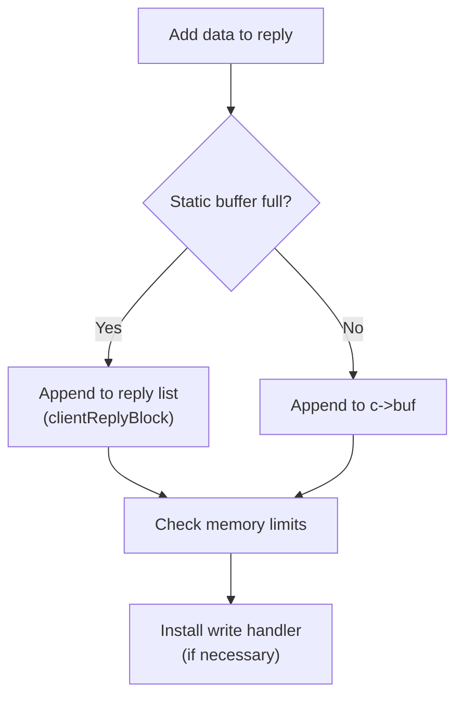
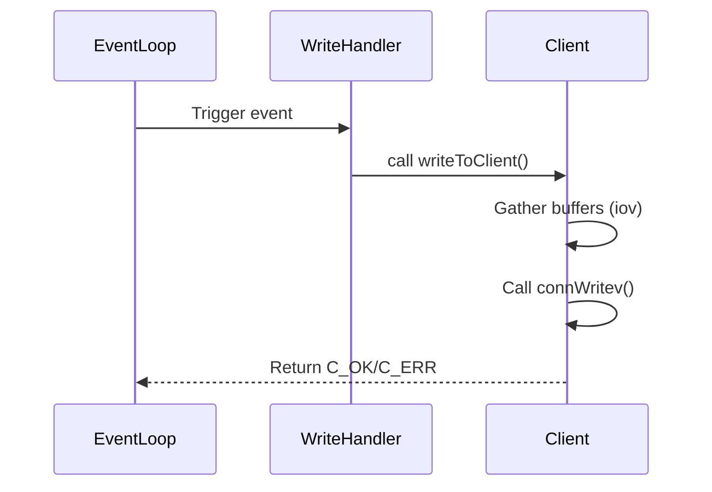

# Networking

Relevant source files

The following files were used as context for generating this wiki page:

- [src/networking.c](https://github.com/redis/redis/blob/main/src/networking.c)

The Networking subsystem acts as the primary interface between the system and its external clients. It manages connection lifecycles, parses incoming protocol data, and coordinates the delivery of outgoing command responses. Designed as a high-performance event-driven layer, it abstracts the complexity of asynchronous socket I/O, allowing the core command-execution logic to operate on a consistent client abstraction regardless of the underlying transport (TCP or Unix domain sockets).

The system centers on the `client` structure, which serves as a stateful container for each connection. This includes input buffers for parsing incoming commands, output buffers for accumulating responses, and metadata for tracking authentication, replication states, and event flags. By maintaining separate input and output pipelines, the networking layer ensures that heavy command processing does not stall the ingestion of new data, while output management mechanisms handle flow control and backpressure through configurable output buffer limits.

Integration with the broader system is achieved through a tight coupling with the event loop (`ae`). Networking functions register read/write handlers that trigger during the event loop's iteration, allowing the server to multiplex connections efficiently across multiple file descriptors. The component also coordinates with internal modules like replication and clustering, providing the necessary hooks to propagate data streams, manage migration states, and maintain client context during complex background operations.

## Connection Lifecycle and Initialization

The lifecycle begins with connection acceptance and concludes with the systematic release of resources. The `createClient` function allocates a `client` structure, sets up initial buffers, and registers the `readQueryFromClient` handler to the connection. This initialization is critical as it maps the connection to a specific client instance, enabling the server to track client state (like current database, authentication, and output buffer usage) throughout the request-response cycle.

When a client connection is terminated, `freeClient` acts as the primary cleanup engine. It ensures a safe teardown: unlinking the client from the server's global lists, releasing memory allocated for input/output buffers (including the cleanup of deferred objects queued by I/O threads), and removing file descriptors from the event loop. The `unlinkClient` function serves as a crucial gatekeeper here, performing constant-time removal from internal indices, preventing memory leaks, and ensuring that no further events are processed for the defunct connection.

Sources: [src/networking.c:122-261](https://github.com/redis/redis/blob/main/src/networking.c#L122-L261), [src/networking.c:1879-1952](https://github.com/redis/redis/blob/main/src/networking.c#L1879-L1952), [src/networking.c:2159-2349](https://github.com/redis/redis/blob/main/src/networking.c#L2159-L2349)

## Input Buffer Management

The input buffer system processes raw data arriving from the socket into a structured command format. Incoming raw data is appended to `client->querybuf`. The system distinguishes between "inline" protocol and "multi-bulk" (RESP) protocol. `processInputBuffer` drives this by checking the request type (typically `*` for RESP) and delegating to specialized parsers: `processInlineBuffer` for simple commands and `processMultibulkBuffer` for more complex ones.

A key optimization in the input flow is the use of `thread_reusable_qb`, which provides a shared, pre-allocated buffer for commands, reducing memory churn. To prevent a single client from overwhelming the server, input is gated by the `CLIENT_READ_REACHED_MAX_QUERYBUF` limit, which triggers a connection termination if the buffered input exceeds configured safety thresholds. Once a complete command is parsed, it is placed into a `pendingCommand` structure, which is then added to a list for execution by the main thread.

Sources: [src/networking.c:3300-3422](https://github.com/redis/redis/blob/main/src/networking.c#L3300-L3422), [src/networking.c:3626-3828](https://github.com/redis/redis/blob/main/src/networking.c#L3626-L3828), [src/networking.c:3830-3986](https://github.com/redis/redis/blob/main/src/networking.c#L3830-L3986)

## Output Buffer and Copy Avoidance

The output buffer management is designed for efficiency, utilizing a linked list of `clientReplyBlock` nodes. When `addReply` or similar functions are called, the system first attempts to append data to the existing static buffer `c->buf`. If full, it shifts to the linked list. A significant performance feature is "copy avoidance," where references to existing object strings (via `BULK_STR_REF`) are used instead of copying string data into output buffers.

This mechanism drastically reduces the CPU cost and memory footprint of sending large bulk data, such as `GET` results. `tryAvoidBulkStrCopyToReply` checks if copy avoidance is preferred based on server configuration and connection status before deciding whether to reference the object pointer or copy the data.

Sources: [src/networking.c:462-481](https://github.com/redis/redis/blob/main/src/networking.c#L462-L481), [src/networking.c:1273-1305](https://github.com/redis/redis/blob/main/src/networking.c#L1273-L1305)

Sources: [src/networking.c:509-544](https://github.com/redis/redis/blob/main/src/networking.c#L509-L544), [src/networking.c:1340-1345](https://github.com/redis/redis/blob/main/src/networking.c#L1340-L1345)

## Control Flow: Writing Replies

The writing mechanism uses `writeToClient`, which acts as the entry point for transmitting accumulated data. If a client is not a slave, it uses `_writeToClientNonSlave`, which leverages `_writevToClient` to perform scatter-gather I/O. This is critical for minimizing system calls by combining multiple small buffers into a single `writev` operation. 

`_writevToClient` creates a `ReplyIOV` structure, which collects data pointers from the client's static buffer and the reply list until either the buffer count limit (`IOV_MAX`) or the byte limit (`NET_MAX_WRITES_PER_EVENT`) is reached. This process balances the throughput benefits of large writes with the need for fairness, ensuring no single client dominates the event loop iteration.

Sources: [src/networking.c:2626-2689](https://github.com/redis/redis/blob/main/src/networking.c#L2626-L2689), [src/networking.c:2696-2727](https://github.com/redis/redis/blob/main/src/networking.c#L2696-L2727)

Sources: [src/networking.c:2626-2626](https://github.com/redis/redis/blob/main/src/networking.c#L2626-L2626), [src/networking.c:2888-2891](https://github.com/redis/redis/blob/main/src/networking.c#L2888-2891)

## Performance and Memory Trade-offs

| Design Choice | Benefit | Cost |
| :--- | :--- | :--- |
| **Static Buffer** | Avoids heap allocation for small replies | Fixed memory usage per client |
| **Copy Avoidance** | Low memory overhead for bulk data | Complex ref-counting; requires I/O cleanup |
| **Scatter-Gather I/O** | Fewer system calls via `writev` | Requires `iov` array management |
| **Reusable Query Buffer** | Reduced allocations for command ingestion | Limited to single client per thread |

Sources: [src/networking.c:136](https://github.com/redis/redis/blob/main/src/networking.c#L136), [src/networking.c:1273-1297](https://github.com/redis/redis/blob/main/src/networking.c#L1273-L1297), [src/networking.c:2699-2701](https://github.com/redis/redis/blob/main/src/networking.c#L2699-L2701), [src/networking.c:2884-2895](https://github.com/redis/redis/blob/main/src/networking.c#L2884-L2895)

> [!CAUTION]
> The `tryDeferFreeClientObject` mechanism is essential when freeing objects within I/O threads. Because I/O threads do not own the global allocator's memory in the same way the main thread does, freeing objects directly can lead to race conditions or segment faults. Always defer freeing to the main thread via the client's `io_deferred_objects` queue.

Sources: [src/networking.c:1731-1745](https://github.com/redis/redis/blob/main/src/networking.c#L1731-L1745)

## Client Command Processing Flow

The integration of command parsing and execution follows a strict pipeline:
1. `readQueryFromClient`: Receives data from the connection, populates `querybuf`.
2. `processInputBuffer`: Parses raw buffer into `pendingCommand` arguments.
3. `processCommandAndResetClient`: Executes the command (calls `processCommand`) and resets the command context using `commandProcessed`.
4. `prepareForNextCommand`: Triggers final cleanup of the command-specific state and potentially updates slot statistics.

This sequence is intentionally designed to be re-entrant and safe for potential pauses, ensuring that if a client is blocked during command execution, the state is held and resumed correctly without losing command context.

Sources: [src/networking.c:3431-3444](https://github.com/redis/redis/blob/main/src/networking.c#L3431-L3444), [src/networking.c:3491-3515](https://github.com/redis/redis/blob/main/src/networking.c#L3491-3515), [src/networking.c:3830-3837](https://github.com/redis/redis/blob/main/src/networking.c#L3830-L3837)