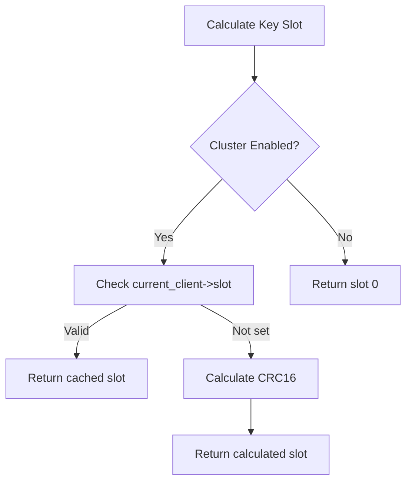

# Overview

Relevant source files

The following files were used as context for generating this wiki page:

- [src/db.c](https://github.com/redis/redis/blob/main/src/db.c)
- [src/cluster.c](https://github.com/redis/redis/blob/main/src/cluster.c)

This wiki page provides an architectural overview of the database and cluster subsystems within the source. These components form the foundation of the data storage model, facilitating key-space management, expiration logic, and data distribution across clustered nodes.

The core of the database component is the `redisDb` structure, which manages the mapping between keys and values using a `kvstore`. This abstraction allows the server to partition data efficiently (e.g., by hash slots in cluster mode) while maintaining metadata such as expiration times, access tracking for eviction policies (LRU/LFU), and key-size histograms. The database acts as the primary interface for key lookup, mutation, and deletion, enforcing data integrity and consistency across primary and replica instances.

The clustering subsystem, built around the database layer, manages data distribution through hash slots. It handles node membership, slot migration, and redirected access. By integrating closely with the `kvstore` architecture, the cluster component ensures that operations are routed to the correct shards and that data can be rebalanced or moved without violating transactional or operational invariants.

Together, these subsystems solve the problem of managing large, distributed datasets in a high-concurrency, volatile memory environment. Key design decisions include the separation of storage into specialized dictionaries (keyspace vs. expires), the use of `kvstore` to allow for slot-aware data partitioning, and the implementation of asynchronous operations (e.g., `dbAsyncDelete`, `dbAsyncFlush`) to maintain high availability during heavy write or administrative loads.

## Key-Space Access and Lookup Mechanism
The database access API is centered around `lookupKey()`, which serves as the unified entry point for all read/write operations. It resolves keys to their respective values while performing essential lifecycle checks, such as expiration handling and access statistic updates.

The mechanism follows these steps:
1.  **Lookup:** `dbFindByLink()` retrieves the key from the underlying dictionary.
2.  **Expiration Check:** `expireIfNeeded()` evaluates the TTL. If expired, it either removes the key (if `EXPIRE_FORCE_DELETE_EXPIRED` is set) or marks it as expired, potentially returning `NULL`.
3.  **Access Statistics:** Unless `LOOKUP_NOTOUCH` is provided, the function updates the object’s access metadata (LRU or LFU) and increments global keyspace hits/misses statistics.
4.  **Notification:** If the lookup misses and flags do not forbid it, `notifyKeyspaceEvent()` triggers a `keymiss` event.

> [!NOTE]
> The `LOOKUP_WRITE` flag is critical for consistency. It enables deletion of expired keys on masters but carefully prevents deletion on read-only replicas to avoid master-replica drift.

Sources: [src/db.c:279-338](https://github.com/redis/redis/blob/main/src/db.c#L279-L338)

## Key Expiration and TTL Management
Expiration is managed through a parallel structure where the database maintains an `expires` `kvstore` mapping keys to their expiry time (in milliseconds). When a key is accessed, the expiration is checked against the current time.

- **Check Flow:** `expireIfNeeded()` compares the current time (`commandTimeSnapshot()`) with the stored TTL.
- **Deletions:** If a key is found expired, `deleteExpiredKeyAndPropagate()` is invoked to remove the key, trigger notifications, and propagate the `DEL` or `UNLINK` command to replicas and the AOF file.
- **Propagation:** The `propagateDeletion()` function ensures that even if a key is deleted implicitly (e.g., via lazy expiration), the operation is synchronized globally to maintain state consistency.

Sources: [src/db.c:2885-3012](https://github.com/redis/redis/blob/main/src/db.c#L2885-L3012)

## Memory Tracking and Histograms
To support administrative monitoring and adaptive eviction policies, the system maintains a distribution of key sizes and memory allocation per slot.

- **Histogram Mechanism:** `kvsUpdateHistogram()` updates a logarithmic base-2 histogram of key sizes. It tracks 60 bins, where the i-th bin stores keys in the range `[2^i, 2^(i+1))`.
- **Slot Allocation:** `updateSlotAllocSize()` tracks `alloc_size` within the `kvstoreDictMetadata`. This ensures the server can accurately report memory usage per slot for cluster rebalancing decisions.

Sources: [src/db.c:70-147](https://github.com/redis/redis/blob/main/src/db.c#L70-L147)

## Cluster Hash Slot Distribution
Data in cluster mode is partitioned into 16,384 hash slots. The `cluster.c` file provides logic for identifying the slot of a key to route commands correctly.

- **Slot Calculation:** `getKeySlot()` determines the destination slot. If the current client is executing a command (`CLIENT_EXECUTING_COMMAND`), it uses a cached slot id; otherwise, it calculates the slot using the CRC16 hash of the key.
- **Pattern Matching:** `patternHashSlot()` provides utility for cluster-aware scanning. If a pattern (e.g., `{user:1}:name`) specifies a tag, the slot is derived from the tagged part of the string, forcing the key to reside within that specific slot.

Sources: [src/db.c:475-491](https://github.com/redis/redis/blob/main/src/db.c#L475-L491), [src/cluster.c:36-61](https://github.com/redis/redis/blob/main/src/cluster.c#L36-L61)

## Asynchronous Operations
To avoid blocking the main server thread, operations like database flushing and key deletion can be offloaded to background threads.

- **Async Delete:** `dbAsyncDelete()` triggers `freeObjAsync()`, which moves the object cleanup to a BIO (Background I/O) thread worker.
- **Async Flush:** `flushCommandCommon()` supports `EMPTYDB_ASYNC`. When triggered, `blockClientForAsyncFlush()` pauses the client while the flush job is queued via `bioCreateCompRq()`. Once the background task completes, `kvsAsyncFreeDoneCB()` triggers `unblockClientForAsyncFlush()`.

Sources: [src/db.c:1347-1377](https://github.com/redis/redis/blob/main/src/db.c#L1347-L1377)

## Summary of Key Design Trade-offs

| Design Choice | Benefit | Cost |
| :--- | :--- | :--- |
| Separate Key/Expiry Stores | Faster expiration scanning | Increased memory usage |
| Logarithmic Histograms | Efficient O(1) update | Loss of exact key-size precision |
| Lazy Expiration | Low latency on read commands | Potential memory bloat |

Sources: [src/db.c:70-124](https://github.com/redis/redis/blob/main/src/db.c#L70-L124), [src/db.c:2885-2894](https://github.com/redis/redis/blob/main/src/db.c#L2885-L2894)