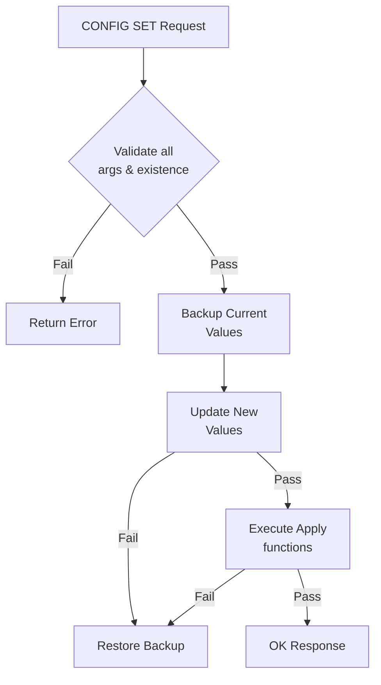
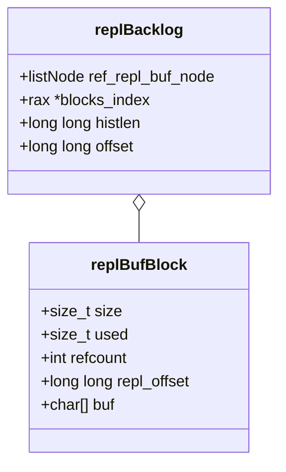

# Project Structure
<details>
<summary>Relevant source files</summary>

The following files were used as context for generating this wiki page:

- [src/config.c](https://github.com/redis/redis/blob/main/src/config.c)
- [src/replication.c](https://github.com/redis/redis/blob/main/src/replication.c)
</details>

The "Project Structure" component in Redis serves as the foundational orchestrator for server runtime configuration and synchronization state. It defines how the system discovers, validates, stores, and persists its operational parameters, while also managing the complex data flow required for master-replica consistency. By centralizing these concerns, the subsystem ensures that configuration changes are applied atomically and that replication state remains coherent across different instances.

At its core, this structure solves the "configuration drift" problem. By using a uniform interface (`standardConfig`) and a centralized registry (`configs` dictionary), the system prevents inconsistent states during runtime updates. Every configuration directive—whether a simple boolean, a complex memory limit, or a multi-argument buffer setting—must pass through this rigorous validation and application layer. This ensures that the server can safely evolve its state without requiring manual re-parsing of static files.

Adjacent to configuration management is the replication subsystem, which leverages the project's structural patterns to manage data streams. The replication logic relies on the backlog and buffer management systems defined within the same structural scope. This tight coupling allows the server to treat the replication stream as a continuous log, enabling features like Partial Resynchronization (PSYNC) and ensuring that memory consumption for buffers is tracked and managed consistently alongside global configurations.

## Configuration Registry and `standardConfig`

The system organizes all server configurations into a `standardConfig` structure. This structure acts as a common interface for different types of runtime settings. The registry is implemented as a `dict` (hash table) where keys are the configuration names (strings) and values are pointers to `standardConfig` structures.

The mechanism uses a `typeInterface` union to map specific types to behavior-defining function pointers. When a configuration is accessed or updated, the system dispatches the request through this interface:

| Field | Type | Description |
| :--- | :--- | :--- |
| `name` | `const char*` | The user-visible name used in `CONFIG GET/SET`. |
| `interface` | `typeInterface` | Contains the `set`, `get`, and `rewrite` method pointers. |
| `data` | `typeData` | A union holding the specific data storage (e.g., `boolConfigData`). |
| `type` | `configType` | Enum identifying the underlying C type (e.g., `BOOL_CONFIG`, `NUMERIC_CONFIG`). |
| `flags` | `unsigned int` | Bitmask defining mutability, sensitivity, and special access rules. |

Sources: [src/config.c:263-288](https://github.com/redis/redis/blob/main/src/config.c#L263-L288)

> [!NOTE]
> Aliases exist as entries in the same registry but are marked with the `ALIAS_CONFIG` flag. This allows multiple names to point to the same underlying storage, maintaining backward compatibility.

Sources: [src/config.c:3417-3427](https://github.com/redis/redis/blob/main/src/config.c#L3417-L3427)

## Configuration Lifecycle and `CONFIG SET`

When a client executes `CONFIG SET`, the server performs a multi-step orchestration to ensure atomicity. The process iterates over all proposed configuration pairs and ensures that no illegal state is reached before committing.

1.  **Lookup:** The server finds the `standardConfig` object for each provided key.
2.  **Validation:** The `set` function is called for every configuration. If any validation step fails, the `errstr` is populated, and the process halts.
3.  **Backup:** Current values are retrieved using the `get` interface and stored locally.
4.  **Trial Update:** Values are set in the server structure via `performInterfaceSet`.
5.  **Application:** If the config has an `apply` function (defined in `typeInterface`), it is executed to reflect the changes in the system (e.g., re-opening a port or resizing a buffer).
6.  **Rollback:** If any `apply` function fails, the system calls `restoreBackupConfig` to revert all changed values to their previous state.

Sources: [src/config.c:830-972](https://github.com/redis/redis/blob/main/src/config.c#L830-L972)


Sources: [src/config.c:830-946](https://github.com/redis/redis/blob/main/src/config.c#L830-L946)

## Replication Stream and Backlog

Replication management centers on the global replication buffer. When a master needs to propagate a command, it uses `feedReplicationBuffer`, which appends data to a series of `replBufBlock` structures.

The backlog is not a single contiguous array, but a linked list of blocks. This design prevents large, expensive memory allocations and allows the server to incrementally trim older segments of the replication stream as they exceed the `repl_backlog_size`.

> [!CAUTION]
> The `incrementalTrimReplicationBacklog` function is crucial for preventing server freezes. It enforces a maximum number of blocks that can be deleted per call, ensuring that even if a replica disconnects and frees massive amounts of buffer space, the main thread remains responsive.

Sources: [src/replication.c:384-437](https://github.com/redis/replication.c#L384-L437)

## Replication Buffer Management

The replication stream uses `replBufWriter` to batch writes. This structure maintains the state of the replication head during command propagation.


Sources: [src/replication.c:244-255](https://github.com/redis/replication.c#L244-L255), [src/replication.c:457-463](https://github.com/redis/replication.c#L457-L463)

### Key Replication Constraints

- **Atomicity of Trimming:** Backlog trimming respects the `refcount` of `replBufBlock` nodes. If a replica is still reading from a block, that block cannot be deleted, even if the backlog is full. This increases memory usage temporarily but is necessary for partial resynchronization stability.
- **Backlog Indexing:** To quickly seek to specific offsets during PSYNC, the server maintains an `rax` tree (`blocks_index`). This acts as an index for every `REPL_BACKLOG_INDEX_PER_BLOCKS` chunks, drastically reducing lookup time for master-replica handshake offsets.

Sources: [src/replication.c:294-304](https://github.com/redis/replication.c#L294-L304), [src/replication.c:397-404](https://github.com/redis/replication.c#L397-L404)

## Configuration Rewrite Mechanism

The `CONFIG REWRITE` feature is designed to update the configuration file on disk while preserving comments and structural formatting. It achieves this by creating a state representation of the current file and matching it against the active server configuration.

| Design Choice | Benefit | Cost |
| :--- | :--- | :--- |
| `dict` for mapping options | Fast lookup of file lines for specific directives | Higher memory usage during rewrite |
| `rename` atomicity | Ensures config file is never in an inconsistent state | Relies on filesystem support |
| Orphaned line preservation | Keeps user comments and formatting | Requires parsing overhead |

Sources: [src/config.c:1061-1071](https://github.com/redis/redis/blob/main/src/config.c#L1061-L1071)

The rewrite flow:
1. `rewriteConfigReadOldFile`: Loads existing lines into memory and maps them to configuration directives.
2. `rewriteConfigRewriteLine`: For each active config, it finds the lines in the rewrite state, updates them, or appends new lines.
3. `rewriteConfigRemoveOrphaned`: Identifies and blanks out lines that correspond to options no longer used or that are no longer the active setting.
4. `rewriteConfigOverwriteFile`: Writes the new content to a temporary file and uses `rename` to perform an atomic switch.

Sources: [src/config.c:1125-1812](https://github.com/redis/redis/blob/main/src/config.c#L1125-L1812)

## API for Module Configuration

Modules can register their own configurations through the runtime registry. This is managed by the `addModule*Config` functions, which convert module-specific settings into the `standardConfig` interface used by the rest of the server.

```c
// Example: Registering a module boolean configuration
addModuleBoolConfig(sdsnew("my-module-enabled"), NULL, MODIFIABLE_CONFIG, privdata, 1);
```
Sources: [src/config.c:3494-3507](https://github.com/redis/redis/blob/main/src/config.c#L3494-3507)

When a module config is set via the CLI, the call routes through `getMutableConfig`, ensuring that module configs respect the same protection flags (e.g., `IMMUTABLE_CONFIG`) as core configurations. This enforces a consistent security posture for both native and third-party settings.

Sources: [src/config.c:3571-3600](https://github.com/redis/redis/blob/main/src/config.c#L3571-3600)