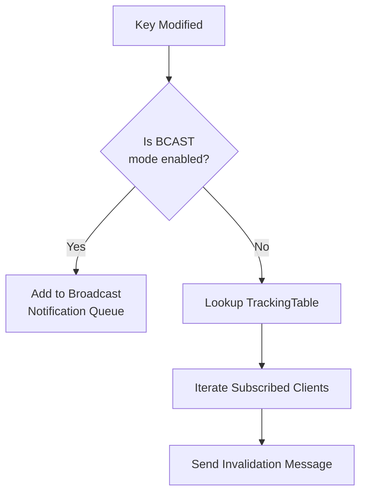

# Publish Subscribe

Relevant source files

The following files were used as context for generating this wiki page:

- [src/pubsub.c](https://github.com/redis/redis/blob/main/src/pubsub.c)
- [src/acl.c](https://github.com/redis/redis/blob/main/src/acl.c)
- [src/tracking.c](https://github.com/redis/redis/blob/main/src/tracking.c)
- [src/notify.c](https://github.com/redis/redis/blob/main/src/notify.c)

The "Publish Subscribe" subsystem provides an asynchronous messaging pattern where clients can subscribe to specific channels (or patterns) to receive messages broadcast by publishers. Unlike traditional request-response operations in the server, this component facilitates decoupling between producers and consumers by maintaining an in-memory registry of subscriptions that maps channels to the set of clients interested in them.

The system is designed to handle multiple subscription tiers: global channels, sharded channels (integrated with cluster slot partitioning), and pattern-based matching. By design, the pubsub component is lightweight but requires special client management; when a client enters "pubsub mode," it is restricted from executing most standard commands, and its connection is repurposed to stream messages directly from the server as they arrive.

This subsystem interacts heavily with the core command dispatch logic and the cluster management layer. It also serves as the transport mechanism for other notification subsystems, such as keyspace events (notifications when keys are modified) and invalidation messages (the transport for client-side caching), making it a cross-cutting utility that supports server observability and data consistency features.

## Public API and Command Interface

The pubsub interface is accessible through standard Redis commands, categorized by channel type and operation. Clients interact with this interface by toggling their connection state to receive continuous updates.

| Command | Category | Purpose |
| :--- | :--- | :--- |
| `SUBSCRIBE` | Channel | Subscribes to global channels. |
| `UNSUBSCRIBE` | Channel | Unsubscribes from global channels. |
| `PSUBSCRIBE` | Pattern | Subscribes to channels matching a glob-style pattern. |
| `PUNSUBSCRIBE` | Pattern | Unsubscribes from pattern-based subscriptions. |
| `PUBLISH` | Publisher | Broadcasts a message to a global channel. |
| `SSUBSCRIBE` | Sharded | Subscribes to shard-specific channels. |
| `SPUBLISH` | Publisher | Broadcasts a message to a sharded channel. |

Sources: [src/pubsub.c:541-755](https://github.com/redis/redis/blob/main/src/pubsub.c#L541-L755)

## Pub/Sub Client Lifecycle and State

A client is marked as being in "pubsub mode" by setting the `CLIENT_PUBSUB` flag. This state is critical because it fundamentally alters how the server processes the client's connection. Once marked, the client’s `flags` are updated, and the server increments the global `server.pubsub_clients` counter.

*   **Marking:** The `markClientAsPubSub()` function transitions a client into this mode.
*   **Unmarking:** The `unmarkClientAsPubSub()` function removes the flag and decrements the counter. This is triggered when the total number of subscriptions (global + shard) reaches zero.

> [!IMPORTANT]
> The server enforces an invariant where a client must not hold subscriptions to exit pubsub mode. The call `clientTotalPubSubSubscriptionCount(c) == 0` is the decisive check performed during `unsubscribeCommand`, `punsubscribeCommand`, and `sunsubscribeCommand` before calling `unmarkClientAsPubSub`.

Sources: [src/pubsub.c:229-241](https://github.com/redis/redis/blob/main/src/pubsub.c#L229-L241), [src/pubsub.c:570-572](https://github.com/redis/redis/blob/main/src/pubsub.c#L570-L572)

## Sharded Pub/Sub Architecture

Sharded Pub/Sub is bound to cluster slot partitioning. While standard pubsub uses a global dictionary, shard channels are stored in `kvstore` structures indexed by slot. When a client subscribes to a sharded channel, the server identifies the appropriate slot using `getKeySlot()` or `keyHashSlot()`.

The mechanism for propagating a message:
1.  `SPUBLISH` calls `pubsubPublishMessageAndPropagateToCluster()`.
2.  `pubsubPublishMessage()` resolves the `pubsubtype` as `pubSubShardType`.
3.  The lookup occurs via `kvstoreDictFind(*type.serverPubSubChannels, slot, channel)`.
4.  The server iterates over the dictionary of clients associated with that slot-channel combination and invokes `addReplyPubsubMessage()`.

Sources: [src/pubsub.c:74-82](https://github.com/redis/redis/blob/main/src/pubsub.c#L74-L82), [src/pubsub.c:469-495](https://github.com/redis/redis/blob/main/src/pubsub.c#L469-L495)

## Pattern Matching Dispatch

Pattern subscriptions (`PSUBSCRIBE`) are treated differently because they are not bound to a single hash key. Every `PUBLISH` event on a standard channel triggers a scan of all registered patterns.

The matching mechanism:
1.  The server maintains `server.pubsub_patterns`.
2.  During `pubsubPublishMessageInternal()`, if the type is not sharded, the server iterates through all entries in the patterns dictionary.
3.  The match condition: `stringmatchlen((char*)pattern->ptr, sdslen(pattern->ptr), (char*)channel->ptr, sdslen(channel->ptr), 0)`.
4.  If a match is found, the server dispatches a `pmessage` type reply via `addReplyPubsubPatMessage()`.

Sources: [src/pubsub.c:502-528](https://github.com/redis/redis/blob/main/src/pubsub.c#L502-L528)

## Security and ACL Integration

The pubsub system is tightly integrated with the ACL (Access Control List) system. When a command is dispatched, the server verifies if the user has appropriate permissions for the specific channel or pattern.

*   **Verification:** `ACLUserCheckChannelPerm()` is invoked to evaluate if a client can subscribe to or publish to a specific channel.
*   **Enforcement:** During user authentication changes (e.g., changing ACL rules via `ACL SETUSER`), the server calls `ACLKillPubsubClientsIfNeeded()`. This ensures that if a user's channel permissions are revoked, active subscriptions are terminated by calling `deauthenticateAndCloseClient()`.

> [!WARNING]
> ACL rules are sensitive. The function `ACLShouldKillPubsubClient()` is a critical security guard that iterates through a client's pubsub_patterns, pubsub_channels, and pubsubshard_channels to ensure none of the current subscriptions violate the *updated* (upcoming) permissions.

Sources: [src/acl.c:2022-2048](https://github.com/redis/redis/blob/main/src/acl.c#L2022-L2048)

## Client-Side Caching Invalidation

The `src/tracking.c` file uses the Pub/Sub framework as the transport for "invalidation messages." When client-side caching is enabled (`CLIENT TRACKING`), the server tracks which keys a client has requested.

When a key is modified:
1.  `trackingInvalidateKey()` is invoked.
2.  The server looks up the clients in `TrackingTable` that may have the key in their local cache.
3.  The invalidation message is sent either as a RESP3 `PUSH` message or as a Pub/Sub message in the `__redis__:invalidate` channel if the client is connected in RESP2 mode.

Sources: [src/tracking.c:374-424](https://github.com/redis/redis/blob/main/src/tracking.c#L374-L424)

## Keyspace Event Notifications

`notify.c` acts as a producer for the Pub/Sub system. When a key is mutated, `notifyKeyspaceEventImpl()` checks the `server.notify_keyspace_events` bitmask. If a bit is set, it composes a channel name (e.g., `__keyspace@0__:mykey`) and calls `pubsubPublishMessage()`. This allows users to treat internal database state changes as standard pubsub messages.

Sources: [src/notify.c:142-178](https://github.com/redis/notify.c#L142-L178)