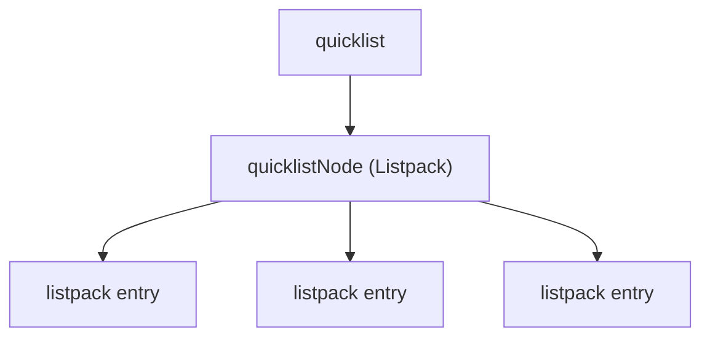

# Quick Start
<details>
<summary>Relevant source files</summary>

The following files were used as context for generating this wiki page:

- [src/debug.c](https://github.com/redis/redis/blob/main/src/debug.c)
- [utils/install_server.sh](https://github.com/redis/redis/blob/main/utils/install_server.sh)
- [src/modules/helloworld.c](https://github.com/redis/redis/blob/main/src/modules/helloworld.c)
- [src/quicklist.c](https://github.com/redis/redis/blob/main/src/quicklist.c)
</details>

The "Quick Start" subsystem encompasses the operational foundations for deploying and troubleshooting the Redis server. It serves as the bridge between raw source code and a running, debuggable, and extensible instance. By providing utility scripts for service installation, debugging tools for dataset inspection, and modular hooks for custom commands, this subsystem addresses the "Day 0" and "Day 2" operational requirements of a Redis deployment.

Architecturally, Quick Start handles the lifecycle of a service instance via `utils/install_server.sh` and provides deep introspection capabilities through `src/debug.c`. These components exist to minimize the friction of setting up a reliable persistence layer and to provide the critical diagnostics required during runtime failures, such as memory corruption or assertion violations.

The subsystem also highlights the extensibility of the Redis architecture. Through `src/modules/helloworld.c`, it demonstrates how external logic can be grafted onto the Redis core via the Redis Modules API. This ensures that operators and developers are not locked into the core codebase for specialized use cases, while `src/quicklist.c` provides the high-performance memory structure foundation that these modules—and the core itself—rely upon for efficient data storage.

## Service Installation and Lifecycle

The `utils/install_server.sh` script is designed for rapid deployment of Redis instances on Linux distributions. It automates the creation of essential directories, configuration files, and system-specific service initialization (such as `init.d`).

*   **Automation:** The script runs interactively by default but supports non-interactive execution for provisioners by checking for environment variables like `REDIS_PORT`, `REDIS_CONFIG_FILE`, and `REDIS_DATA_DIR`.
*   **Safety Guards:** The script includes explicit checks for root privileges (`id -u`) and detects modern service managers like `systemd` to prevent installation conflicts, providing an early exit if the system environment is incompatible.
*   **Template Rendering:** It utilizes the `redis.conf` as a template, using `sed` to inject instance-specific configuration (ports, paths, daemonization settings) without manual editing.

Sources: [utils/install_server.sh:44-49](https://github.com/redis/redis/blob/main/utils/install_server.sh#L44-L49), [utils/install_server.sh:71-74](https://github.com/redis/redis/blob/main/utils/install_server.sh#L71-L74), [utils/install_server.sh:183-190](https://github.com/redis/redis/blob/main/utils/install_server.sh#L183-L190)

## Debugging and Dataset Introspection

The `src/debug.c` file provides a suite of administrative commands accessible via the `DEBUG` interface. These tools are critical for post-mortem analysis and operational validation.

| Command | Purpose |
| :--- | :--- |
| `DEBUG DIGEST` | Generates a 20-byte hex signature of the entire dataset. |
| `DEBUG OBJECT` | Introspects internal representation of a key (encoding, refcount, idle time). |
| `DEBUG RELOAD` | Forces an RDB save/load cycle to verify persistence integrity. |
| `DEBUG SEGFAULT` | Induces a deliberate crash for testing signal handling and crash reporting. |

The `computeDatasetDigest` function employs an `xor` strategy for unordered aggregate types (Sets, Hashes) to ensure the digest is commutative, while using a sequential mixing strategy for Lists to maintain ordering sensitivity.

Sources: [src/debug.c:303-308](https://github.com/redis/redis/blob/main/src/debug.c#L303-L308), [src/debug.c:420-554](https://github.com/redis/redis/blob/main/src/debug.c#L420-L554), [src/debug.c:609-655](https://github.com/redis/redis/blob/main/src/debug.c#L609-L655)

## Crash Handling and Diagnostic Reporting

When a catastrophic failure occurs, `src/debug.c` manages the crash reporting process. It ensures that critical diagnostics are captured before the process terminates.

*   **Signal Handlers:** `sigsegvHandler` registers with the OS to capture segmentation faults. It uses `pthread_mutex_lock` with `PTHREAD_MUTEX_ERRORCHECK` to prevent recursive deadlocks if the signal handler itself crashes.
*   **Stack Traces:** The subsystem leverages `backtrace()` and custom logic to dump register states and stack content into the Redis log. On Linux, it uses `/proc/self/task` to iterate through all active threads and collect stack traces, ensuring the full process state is captured.
*   **Memory Integrity:** The `doFastMemoryTest` function performs non-destructive integrity checks on anonymous memory regions by scanning the `/proc/self/maps` file.

> [!CAUTION]
> If a second thread crashes while the signal handler is already active, the `signal_handler_lock` deadlock check will trigger a "reduced" report mode to prevent an infinite recursive loop.

Sources: [src/debug.c:2081-2093](https://github.com/redis/redis/blob/main/src/debug.c#L2081-L2093), [src/debug.c:2460-2475](https://github.com/redis/redis/blob/main/src/debug.c#L2460-L2475), [src/debug.c:2619-2652](https://github.com/redis/redis/blob/main/src/debug.c#L2619-L2652)

## Redis Modules API

The `helloworld.c` file serves as a canonical reference for extending Redis. It demonstrates the interaction between the module and the Redis core.

*   **Initialization:** `RedisModule_OnLoad` acts as the entry point, registering commands and handling the module lifecycle.
*   **Command Implementation:** Commands can be simple, interact with the database via low-level key operations (e.g., `HelloPushNative_RedisCommand`), or dispatch to existing Redis commands (e.g., `HelloPushCall_RedisCommand`).
*   **Memory Management:** The API supports `RedisModule_AutoMemory`, which simplifies developer overhead by tracking and freeing allocated memory when the command callback exits.

```c
// Example: Registering a command in a module
if (RedisModule_CreateCommand(ctx, "hello.simple",
    HelloSimple_RedisCommand, "readonly", 0, 0, 0) == REDISMODULE_ERR)
    return REDISMODULE_ERR;
```
Sources: [src/modules/helloworld.c:525-537](https://github.com/redis/redis/blob/main/src/modules/helloworld.c#L525-L537), [src/modules/helloworld.c:159-196](https://github.com/redis/redis/blob/main/src/modules/helloworld.c#L159-L196)

## Quicklist Foundation

`src/quicklist.c` provides the underlying data structure for lists. It is a doubly-linked list of listpacks, designed to balance memory efficiency (by packing multiple small entries into one node) and performance.

*   **Fill Levels:** `quicklistSetFill` controls the `fill` parameter, where positive values denote a fixed number of items per node, and negative values denote a size limit in bytes.
*   **Compression:** To reduce memory footprint, `__quicklistCompress` can compress nodes using LZF compression based on a configured "compress depth."
*   **Memory Safety:** The `quicklistNodeLimit` function calculates hard limits, ensuring nodes do not grow indefinitely and avoiding memory fragmentation.


Sources: [src/quicklist.c:134-147](https://github.com/redis/redis/blob/main/src/quicklist.c#L134-L147), [src/quicklist.c:332-403](https://github.com/redis/redis/blob/main/src/quicklist.c#L332-L403), [src/quicklist.c:497-507](https://github.com/redis/redis/blob/main/src/quicklist.c#L497-L507)

## Design Trade-offs Table

| Design Choice | Benefit | Cost |
| :--- | :--- | :--- |
| Quicklist (Listpack of nodes) | Memory-efficient for lists | Increased complexity in iteration/splitting |
| LZF Compression | Reduced RAM usage | CPU overhead on access/recompression |
| `pthread_mutex_lock` in signals | Prevents crash loop deadlocks | Slightly higher complexity in signal handling |

Sources: [src/debug.c:2619-2652](https://github.com/redis/redis/blob/main/src/debug.c#L2619-L2652), [src/quicklist.c:332-403](https://github.com/redis/redis/blob/main/src/quicklist.c#L332-L403)