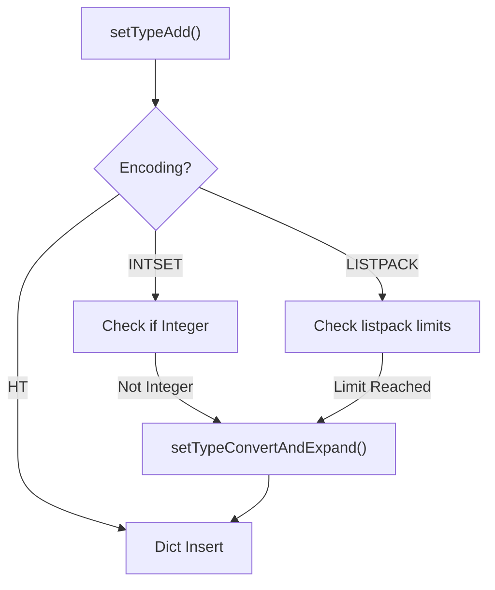

# Quicklist and Intset
<details>
<summary>Relevant source files</summary>

The following files were used as context for generating this wiki page:

- [src/quicklist.c](https://github.com/redis/redis/blob/main/src/quicklist.c)
- [src/t_set.c](https://github.com/redis/redis/blob/main/src/t_set.c)
</details>

Redis utilizes two sophisticated, memory-optimized data structures for handling collections: the `quicklist` for sequences and the `intset` for compact, integer-only sets. While these components serve different primary purposes—the former as a doubly linked list of packed memory buffers (listpacks) and the latter as an array of integers—they share the design objective of minimizing memory fragmentation and cache misses by avoiding the overhead of traditional pointer-heavy structures.

The `quicklist` exists because a standard doubly linked list incurs significant per-node overhead (two pointers per entry). By "zipping" these nodes into `listpacks`, Redis significantly reduces the total metadata size and improves cache locality, as related elements are stored in contiguous memory blocks. The `intset` is even more specialized: it maintains a sorted array of integers with variable-width encoding (16, 32, or 64 bits), allowing it to store integers at the minimum possible bit-depth required to represent the range of the current elements.

These structures represent a core trade-off: they are more computationally expensive to update than standard linked lists or hash tables due to the potential for memory movement during insertion or deletion. However, this cost is offset by the massive reduction in RAM footprint and improved CPU cache performance, which is vital for high-throughput, memory-bound workloads in Redis.

## The Quicklist Mechanism

The `quicklist` is a linked list of nodes, where each node contains a `listpack`. Unlike a standard `list`, it is optimized for high-density storage. When an element is added, the `quicklist` evaluates the fill factor and the size of the new element to decide whether to append it to the current listpack or instantiate a new `quicklistNode`.

Key functions and flow:
- `quicklistCreate`: Initializes the list structure, setting default `fill` (container size limit) and `compress` (depth limit for LZF compression).
- `quicklistPushHead` / `quicklistPushTail`: These functions determine if the element fits within the current listpack. If it does not, they trigger the creation of a new `quicklistNode`.
- `_quicklistNodeAllowInsert`: This helper encapsulates the decision logic. It returns 0 if the node is a "plain" (large element) node or if adding the new entry would exceed the `fill` limit.

> [!NOTE]
> The `fill` parameter determines the threshold for packing. A positive value defines the maximum number of entries per listpack, while a negative value defines the maximum size (in bytes) of a listpack node.

Sources: [src/quicklist.c:134-147](https://github.com/redis/redis/blob/main/src/quicklist.c#L134-L134), [src/quicklist.c:610-634](https://github.com/redis/redis/blob/main/src/quicklist.c#L610-L634), [src/quicklist.c:541-558](https://github.com/redis/redis/blob/main/src/quicklist.c#L541-L558)

## Compression Logic

To further optimize memory, `quicklist` supports LZF compression for "interior" nodes. The `quicklist->compress` depth parameter determines how many nodes at the head and tail remain uncompressed to ensure fast access for standard queue operations.

Mechanism for compression:
- `__quicklistCompress`: The central gatekeeper. It iterates from both ends of the list until it reaches the specified compression depth, ensuring head and tail nodes are never compressed.
- `__quicklistCompressNode`: Performs the actual LZF compression using the `lzf_compress` library. The node's encoding is updated to `QUICKLIST_NODE_ENCODING_LZF`.
- `quicklistDecompressNode`: Inverse operation that restores a node to raw listpack format for iteration or modification.

Sources: [src/quicklist.c:332-403](https://github.com/redis/redis/blob/main/src/quicklist.c#L332-L403), [src/quicklist.c:236-267](https://github.com/redis/redis/blob/main/src/quicklist.c#L236-L267), [src/quicklist.c:279-298](https://github.com/redis/redis/blob/main/src/quicklist.c#L279-L298)

## Intset Architecture

The `intset` is an abstract data structure managed by `src/t_set.c` for specific Redis sets containing only integers. It stores elements in a sorted array, which enables `O(log N)` search via binary search.

Key implementation details:
- `intsetAdd`: Adds a value. If the value fits in the current `encoding` (e.g., `INT16_BIT`), it is inserted into the sorted array. If the value is too large, it upgrades the entire array to a wider bit-depth (e.g., to `INT32_BIT`) and re-inserts everything.
- `intsetRemove`: Removes an element and, if possible, shrinks the array to save memory.
- `intsetFind`: Performs binary search, a critical operation that allows membership checks to be significantly faster than linear scans of string buffers.

Sources: [src/t_set.c:129-134](https://github.com/redis/redis/blob/main/src/t_set.c#L129-L134), [src/t_set.c:253-257](https://github.com/redis/redis/blob/main/src/t_set.c#L253-257), [src/t_set.c:306-307](https://github.com/redis/redis/blob/main/src/t_set.c#L306-L307)

## Set Encoding Conversion

Sets in Redis are polymorphic. They start as `intset` or `listpack` for small datasets and promote to `dict` (hash table) if they exceed thresholds (`set-max-intset-entries` or `set-max-listpack-entries`).


Sources: [src/t_set.c:116-118](https://github.com/redis/redis/blob/main/src/t_set.c#L116-L118), [src/t_set.c:129-231](https://github.com/redis/redis/blob/main/src/t_set.c#L129-L231)

## Data Structure Lifecycle

The lifecycles for both are managed by factory methods and `Type` conversion utilities within `t_set.c`.

| Structure | Trigger for Creation | Trigger for Promotion |
| :--- | :--- | :--- |
| `intset` | Integer input + low count | N/A (Demoted to HT) |
| `listpack` | Default small set | Exceeds `set_max_listpack_entries` |
| `dict` | Exceeds memory/count limits | Never promoted |

Sources: [src/t_set.c:46-57](https://github.com/redis/redis/blob/main/src/t_set.c#L46-L57), [src/t_set.c:61-67](https://github.com/redis/redis/blob/main/src/t_set.c#L61-L67)

## Worked Example: Quicklist Insertion

Adding an element to a `quicklist` follows a strict procedural path:

1. `quicklistPushHead()`: Entry point for adding to the front.
2. `isLargeElement()`: Guard to check if the data should skip listpack packing (i.e., "plain" node).
3. `_quicklistNodeAllowInsert()`: Checks the fill limit of the current head node.
4. `lpPrepend()`: If allowed, the `listpack` entry is prepended to the existing node buffer.
5. `quicklistUpdateAllocSize()`: Synchronizes the internal accounting of bytes managed by the quicklist.

Sources: [src/quicklist.c:610-634](https://github.com/redis/redis/blob/main/src/quicklist.c#L610-L634)

```c
// Example: Adding an item to a list
// The API is clean and handles memory allocation internally.
quicklist *ql = quicklistNew(-2, 0); // Create with default settings
quicklistPushHead(ql, "new-item", 8); // Add element, manages listpack automatically
```
Sources: [src/quicklist.c:175-179](https://github.com/redis/redis/blob/main/src/quicklist.c#L175-L179), [src/quicklist.c:610-634](https://github.com/redis/redis/blob/main/src/quicklist.c#L610-L634)