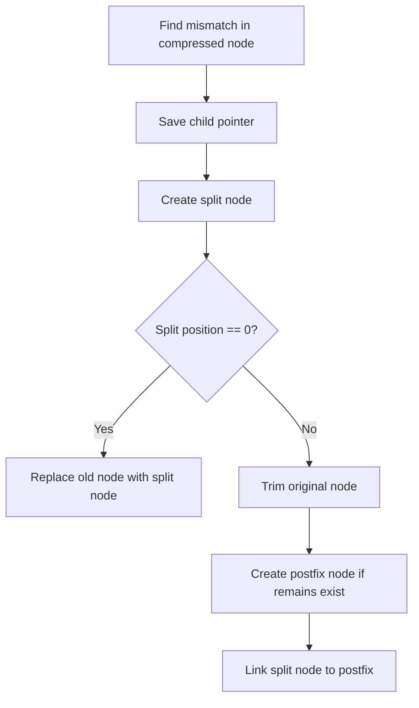
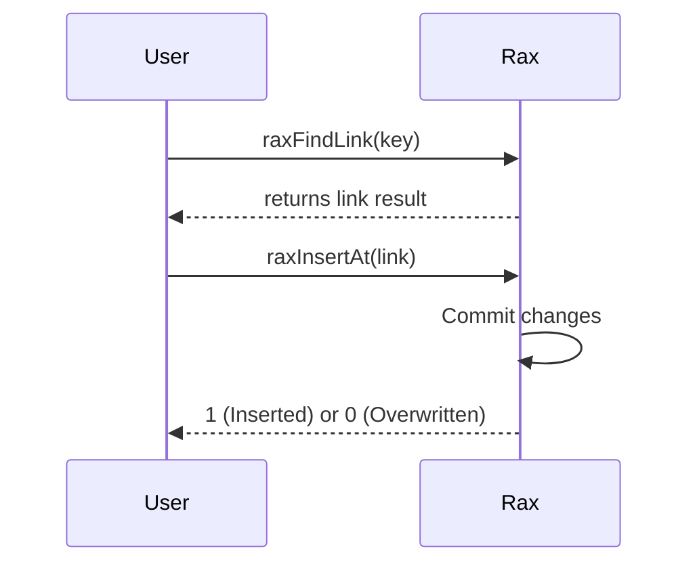

# Radix Tree Rax
<details>
<summary>Relevant source files</summary>

The following files were used as context for generating this wiki page:

- [src/rax.c](https://github.com/redis/redis/blob/main/src/rax.c)
- [src/rax.h](https://github.com/redis/redis/blob/main/src/rax.h)
- [src/rax_malloc.h](https://github.com/redis/redis/blob/main/src/rax_malloc.h)
- [src/t_stream.c](https://github.com/redis/redis/blob/main/src/t_stream.c)
</details>

Radix Tree Rax is a compact, cache-friendly radix tree implementation used extensively within Redis. It is designed to store key-value mappings where keys are byte strings and values are pointers to arbitrary data. By compressing paths of nodes that have a single child, Rax significantly reduces memory overhead compared to traditional prefix trees, especially when the tree contains many keys sharing common prefixes.

The subsystem exists to provide a generic, efficient ordered dictionary that supports both point lookups and range-based scans. In the context of Redis, it acts as the primary data structure for Stream objects, consumer groups, and tracking invalidation tables. Its architecture emphasizes memory efficiency through node compression and, optionally, "fixed-length" key inlining, which allows values to be stored directly in leaf nodes, bypassing the memory overhead of a dedicated child node for every entry.

The design embodies a balance between space optimization and operational speed. It handles node reallocations and memory accounting dynamically. Components are structured with a header followed by an array of children/data, and padding is explicitly calculated to ensure memory alignment, which is critical for the tree's performance on various architectures.

## Core Data Structures

The tree is anchored by the `struct rax` (typedef'd as `rax`), which contains the tree head, counts, and an optional memory allocator/tracker. Internal structural elements are defined by `struct raxNode` (typedef'd as `raxNode`).

| Field | Type | Description |
| :--- | :--- | :--- |
| `head` | `raxNode*` | The root node of the radix tree. |
| `numele` | `uint64_t` | Total number of elements currently stored. |
| `numnodes` | `uint64_t` | Total number of nodes allocated in the tree. |
| `keyFixedLen` | `uint32_t` | If > 0, all keys have this exact length; enables leaf-inlining optimization. |

Sources: [src/rax.h:123-136](https://github.com/redis/redis/blob/main/src/rax.h#L123-L136)

## Node Layout Mechanism

Each `raxNode` consists of a header and a flexible `data[]` array. The header fields (`iskey`, `isnull`, `iscompr`, `size`) dictate how the `data` section is parsed. In non-compressed nodes, the section stores edge bytes followed by child pointers. In compressed nodes, the data section stores the compressed string, followed by a single child pointer.

> [!TIP]
> The `raxPadding` macro (calculated via `((sizeof(void*)-(((nodesize)+4) % sizeof(void*))) & (sizeof(void*)-1))`) is crucial. It ensures that child pointers always begin at word-aligned memory addresses, which prevents performance penalties on alignment-sensitive CPUs.

Sources: [src/rax.c:130-155](https://github.com/redis/redis/blob/main/src/rax.c#L130-L155), [src/rax.h:88-121](https://github.com/redis/redis/blob/main/src/rax.h#L88-L121)

## Path Compression and Node Splitting

When an insertion causes a node path to diverge, the tree performs a "node splitting" operation. If the walk stops in the middle of a compressed node (where a byte mismatch occurs), the algorithm creates a "split node" and potentially a "postfix node" to represent the remaining string.


Sources: [src/rax.c:868-940](https://github.com/redis/redis/blob/main/src/rax.c#L868-L940)

## Fixed-Length Key Inlining

When `keyFixedLen > 0` is set, the tree enters an optimized leaf-parent mode. Instead of allocating a terminal `raxNode` at the depth of the key, the tree stops at `depth == keyFixedLen - 1`. The value is then stored directly in the "slot" previously reserved for a child pointer.

*   **Leaf Parent:** A node at `depth == keyFixedLen - 1`.
*   **Inlined Slot:** A pointer-sized location in the node that holds a `void*` value rather than a `raxNode*` pointer.

> [!CAUTION]
> The leaf-parent invariant is strict: leaf parents are never themselves keys, and they never store an `AUXP` (auxiliary pointer) tail. The `raxLeafParentReadSlot` function performs a raw memory copy to extract these values directly from the node's memory block.

Sources: [src/rax.c:424-442](https://github.com/redis/redis/blob/main/src/rax.c#L424-L442)

## Iterator Mechanism

The interface for scanning the tree is defined via structures managing state and auxiliary buffers, such as `struct raxStack` (typedef'd as `raxStack`, which tracks parent nodes for upward navigation during traversal).

1.  **Seek (`raxSeek`)**: Uses `raxLowWalk` to position the traversal state.
2.  **Step (`raxNext`/`raxPrev`)**: If the current node has children, it descends. If not, it pops from the internal stack to ascend until it finds a sibling branch.
3.  **Leaf Inlining**: During iteration, if the walk hits a virtual leaf (a slot holding a value instead of a node), it marks this state to prevent attempting to dereference the value as a pointer.

Sources: [src/rax.c:1759-1809](https://github.com/redis/redis/blob/main/src/rax.c#L1759-L1809)

## Insertion and Find-Link Flow

To optimize performance, Rax separates the "search" from the "commit". `raxFindLink` locates the potential insertion point and populates a result structure. If the result is a miss, `raxInsertAt` uses that link to commit the changes without re-walking the tree.

*   **Lookup**: `raxLowWalk` traverses the tree, updating `parentlink` (a pointer-to-pointer to the child link).
*   **Commit**: `raxInsertAt` utilizes the `parentlink` to replace a child pointer if a re-allocation is necessary (e.g., node split).


Sources: [src/rax.c:633-640](https://github.com/redis/redis/blob/main/src/rax.c#L633-L640), [src/rax.c:751-784](https://github.com/redis/redis/blob/main/src/rax.c#L751-L784)

## Design Trade-offs

| Design Choice | Benefit | Cost |
| :--- | :--- | :--- |
| Compressed Nodes | Significant memory savings for shared prefixes | Complex split/merge logic |
| Leaf Inlining | Zero allocation for leaf nodes | Restricted to fixed-length keys |
| Explicit Stack | Avoids stack overflow for deep trees | Heap allocation for path tracking |
| Memory Alignment | CPU cache efficiency | Padding bytes increase node size |

Sources: [src/rax.c:58-64](https://github.com/redis/redis/blob/main/src/rax.c#L58-L64), [src/rax.h:75-85](https://github.com/redis/redis/blob/main/src/rax.h#L75-L85)

## Practical Usage Example

The following example demonstrates creating a fixed-length tree and performing a lookup.

```c
#include "rax.h"

void example() {
    // Create tree with fixed length keys of 8 bytes
    rax *r = raxNewEx(0, NULL, 8);
    unsigned char key[8] = "key00001";
    void *val = "data_ptr";

    // Insert
    raxInsert(r, key, 8, val, NULL);

    // Find
    void *found_val = NULL;
    if (raxFind(r, key, 8, &found_val)) {
        // found_val is "data_ptr"
    }

    raxFree(r);
}
```
Sources: [src/rax.c:2688-2733](https://github.com/redis/redis/blob/main/src/rax.c#L2688-L2733)