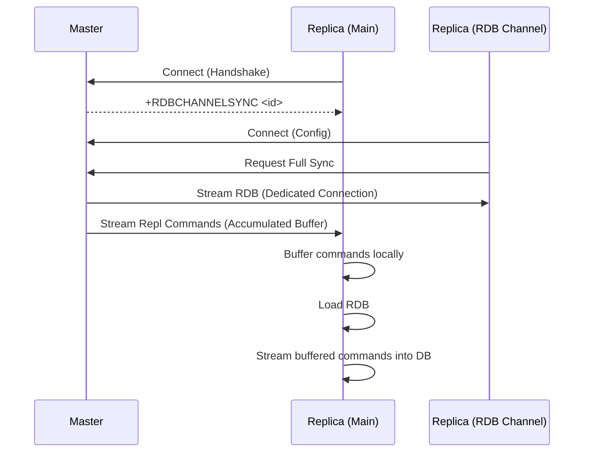
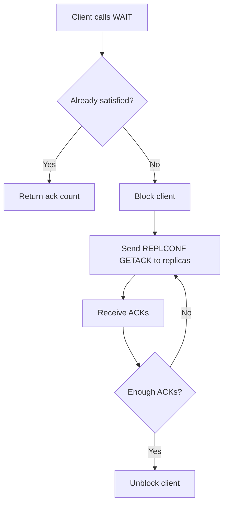

# Replication

Relevant source files

The following files were used as context for generating this wiki page:

- [src/replication.c](https://github.com/redis/redis/blob/main/src/replication.c)

Replication is a core component of the system that ensures data availability and redundancy by maintaining exact copies of data across multiple instances. By enabling one instance (the master) to propagate its command stream to one or more replicas, it solves the critical problem of single-point failure, allowing read-scalability and automatic failover capabilities. The architecture relies on an asynchronous replication stream where the master captures write commands, logs them to a replication buffer, and streams them to connected replicas.

A key design decision in this implementation is the duality of the synchronization mechanism: "Full Resynchronization" (for initial setup or when the replica lags too far behind) and "Partial Resynchronization" (for resuming streams after transient disconnections). The system manages a replication backlog—a ring buffer of recent commands—that allows replicas to catch up on missed data without requiring a full database snapshot, which is computationally expensive and network-intensive.

The implementation handles complex edge cases like diskless replication (where snapshots are streamed over the network to avoid I/O blocking) and "RDB Channel" replication (which optimizes CPU usage by separating data snapshots from the incremental command stream). This subsystem integrates closely with networking, AOF (Append Only File) logging, and the event loop to ensure that replication remains transparent and performant while maintaining data consistency across nodes.

## Replication Backlog Management

The replication backlog is the heart of the partial resynchronization (PSYNC) mechanism. It acts as a circular buffer that holds recent writes, allowing a reconnecting replica to request only the missing segment of the replication stream rather than re-downloading the entire database.

The mechanism uses internal structures to track an offset indicating the next expected replication byte. When a replica connects, it provides its last processed offset; the master then uses the backlog to determine if the requested data still exists within the current history.

> [!NOTE]
> The backlog is managed using a list of buffer nodes. If the backlog grows beyond the configured size, `incrementalTrimReplicationBacklog` is invoked to release old, unreferenced blocks. This ensures the master does not suffer from uncontrolled memory growth.

### Call Chain: Trimming the Backlog
When the backlog is too large, it must be reclaimed incrementally to prevent freezing the server:
1. `incrementalTrimReplicationBacklog()`: Iterates through blocks from the head of the buffer.
2. `refcount--`: Checks if the block is held by any active replica; if `refcount == 1`, it is safe to remove.
3. `listDelNode()`: Removes the block from `server.repl_buffer_blocks`.
4. `raxRemove()`: Updates the `blocks_index` to maintain fast lookup for future PSYNC requests.

Sources: [src/replication.c:384-437](https://github.com/redis/redis/blob/main/src/replication.c#L384-L437)

## Master-Replica Handshake and PSYNC

The connection lifecycle between a master and a replica begins with a handshake where the replica announces its capabilities (e.g., `eof`, `psync2`). The decision to perform a Full or Partial resynchronization occurs during the processing of the `PSYNC` command.

If a `PSYNC` is requested with a known replication ID and offset, `masterTryPartialResynchronization` attempts to satisfy it by invoking `addReplyReplicationBacklog`. If the offset is outside the current history or the replication ID has changed, the master forces a full resynchronization.

| PSYNC Result | Condition | Outcome |
| :--- | :--- | :--- |
| `PSYNC_CONTINUE` | Offset in backlog, IDs match | Stream backlog from offset |
| `PSYNC_FULLRESYNC` | ID mismatch or offset too old | Trigger BGSAVE, send snapshot |
| `PSYNC_TRY_LATER` | Master loading or busy | Retry later |

Sources: [src/replication.c:986-1083](https://github.com/redis/redis/blob/main/src/replication.c#L986-L1083)

## Diskless Replication

Diskless replication is an optimization that avoids writing the full RDB snapshot to disk. Instead, the master forks a child process that streams the snapshot directly to the connected replicas over a socket.

The mechanism is managed by `startBgsaveForReplication`. When `socket_target` is true, the master bypasses `rdbSaveBackground` (file-based) and calls `rdbSaveToSlavesSockets`, allowing for near-instant initiation of the full synchronization process without waiting for disk I/O.

> [!WARNING]
> If a replica does not support the `EOF` capability, it cannot perform diskless replication. The system enforces this via `serverAssert` logic in `startBgsaveForReplication` to prevent protocol mismatches.

Sources: [src/replication.c:1103-1185](https://github.com/redis/redis/blob/main/src/replication.c#L1103-L1185)

## RDB Channel Replication

Introduced to improve scalability, RDB Channel replication allows a replica to utilize two separate connections: one for the heavy RDB snapshot (RDB Channel) and one for the ongoing command stream (Main Channel). This prevents the command stream buffer from inflating during long RDB transfers, which would otherwise trigger output buffer limits and lead to connection drops.

### Data Flow during RDB Channel Sync

Sources: [src/replication.c:3712-3761](https://github.com/redis/redis/blob/main/src/replication.c#L3712-L3761)

## Synchronous Replication (WAIT)

The `WAIT` command implements synchronous replication by ensuring a write command has been acknowledged by a specified number of replicas. This guarantees that data is not lost in case of a master crash, albeit with a latency cost.

The mechanism uses an internal blocked-client state. When a client calls `WAIT`, the master records the replication offset and blocks the client until the replicas send `REPLCONF ACK` messages that confirm they have processed up to that offset.

Sources: [src/replication.c:4708-4784](https://github.com/redis/redis/blob/main/src/replication.c#L4708-L4784)

## Design Trade-offs

| Design Choice | Benefit | Cost |
| :--- | :--- | :--- |
| **Async Replication** | High performance, non-blocking | Potential for data loss on master failure |
| **Replication Backlog** | Enables partial resync | Consumes memory on master |
| **Diskless Sync** | Faster full sync, avoids disk I/O | More complex streaming protocol |
| **RDB Channel** | Parallelizes RDB and Command Stream | Maintains two connections, more complex state |

Sources: [src/replication.c:19-27](https://github.com/redis/redis/blob/main/src/replication.c#L19-L27), [src/replication.c:3669-3711](https://github.com/redis/redis/blob/main/src/replication.c#L3669-L3711)