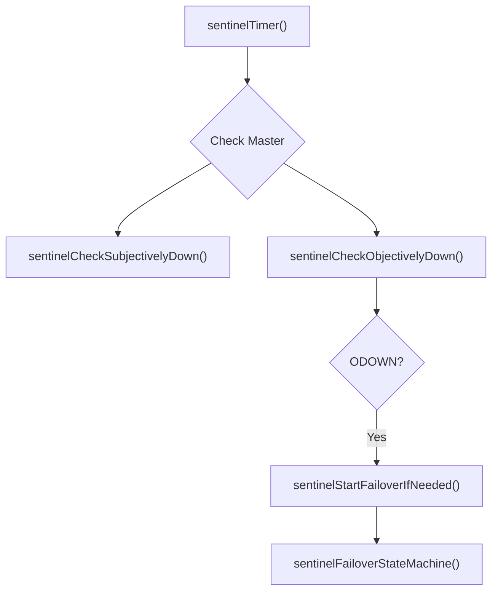

# Sentinel Monitor
<details>
<summary>Relevant source files</summary>

The following files were used as context for generating this wiki page:

- [src/sentinel.c](https://github.com/redis/redis/blob/main/src/sentinel.c)
</details>

## Introduction

Sentinel Monitor is the high-availability management component within the Redis ecosystem, responsible for monitoring, notification, and automatic failover. It enables a cluster of Redis instances to achieve "automatic failover," where the system detects when a primary (master) node is unreachable and promotes an eligible replica (slave) to take its place. By design, Sentinel operates as an out-of-band management service that runs as a separate process, interacting with Redis instances via the standard RESP (Redis Serialization Protocol) and Pub/Sub mechanism to gossip topology information among other Sentinel nodes.

The core problem Sentinel solves is the lack of automated failover in standard Redis replication. Without Sentinel, if a master node fails, a human administrator must manually reconfigure replicas as the new master. Sentinel automates this by maintaining a persistent "source of truth" regarding the cluster topology, which it constantly updates through `INFO` command polling and inter-Sentinel communication. It employs a "quorum" mechanism to avoid "split-brain" scenarios, ensuring that a failover only occurs when a majority of configured Sentinels agree the master is objectively unreachable.

Architecturally, Sentinel is a reactive state machine. It maintains the state of masters, replicas, and peer Sentinels using a specialized dictionary-based data structure (`sentinelRedisInstance`). It uses the `hiredis` library to manage non-blocking, asynchronous connections to all monitored instances. Its design emphasizes decentralized consensus and robust persistence—ensuring that even if all Sentinel processes restart, they recover their state from a user-provided configuration file updated dynamically by the internal `rewriteConfig` engine.

## Core Data Structures

The internal state of the Sentinel subsystem is anchored by a global `sentinel` struct and a series of `sentinelRedisInstance` objects. These structures represent the hierarchical relationships between monitored masters, their associated replicas, and the peer Sentinels that share the responsibility of observing them.

| Structure | Purpose |
| :--- | :--- |
| `sentinelState` | The global singleton containing the epoch, list of masters, and configuration state. |
| `sentinelRedisInstance` | Represents a single monitored entity (Master, Slave, or Sentinel). |
| `instanceLink` | Manages the Hiredis async connections (`cc` for commands, `pc` for Pub/Sub). |
| `sentinelAddr` | Encapsulates network addressing (hostname/IP and port) for cluster nodes. |

> [!NOTE]
> `instanceLink` objects are ref-counted and shared across multiple `sentinelRedisInstance` entities when the same physical Sentinel monitors multiple masters. This architectural decision prevents an exponential explosion in file descriptors, as each Sentinel maintains one connection per master/slave it observes.

Sources: [src/sentinel.c:135-160](https://github.com/redis/redis/blob/main/src/sentinel.c#L135-L160), [src/sentinel.c:162-232](https://github.com/redis/redis/blob/main/src/sentinel.c#L162-L232), [src/sentinel.c:235-258](https://github.com/redis/redis/blob/main/src/sentinel.c#L235-L258)

## Failure Detection Mechanisms

Sentinel distinguishes between two states of unreachability: Subjective Down (SDOWN) and Objective Down (ODOWN). These are governed by the `down_after_period` configuration.

*   **SDOWN**: An instance is considered subjectively down when it fails to reply to PINGs or other commands within the `down_after_period` window. Each Sentinel makes this determination locally.
*   **ODOWN**: An instance reaches the ODOWN state when a Sentinel, having determined it is in SDOWN, successfully queries a quorum of other Sentinels via the `IS-MASTER-DOWN-BY-ADDR` command and receives confirmation that they also perceive the instance as unreachable.

The following logic in `sentinelCheckSubjectivelyDown` determines the SDOWN state:

```c
if (elapsed > ri->down_after_period || ...) {
    if ((ri->flags & SRI_S_DOWN) == 0) {
        sentinelEvent(LL_WARNING,"+sdown",ri,"%@");
        ri->s_down_since_time = mstime();
        ri->flags |= SRI_S_DOWN;
    }
}
```

Sources: [src/sentinel.c:4580-4646](https://github.com/redis/redis/blob/main/src/sentinel.c#L4580-L4646), [src/sentinel.c:4654-4687](https://github.com/redis/redis/blob/main/src/sentinel.c#L4654-L4687)

> [!IMPORTANT]
> The `SRI_S_DOWN` flag is the prerequisite for checking `SRI_O_DOWN`. A master cannot become objectively down unless the local Sentinel has already flagged it as subjectively down.

## Failover Control Flow

When a master is marked ODOWN, the Sentinel initiates a failover state machine. The transition sequence is as follows:

1.  **WAIT_START**: Sentinel waits to see if it can reach the required consensus to become the failover leader.
2.  **SELECT_SLAVE**: The leader invokes `sentinelSelectSlave` to find a replica with the lowest `slave_priority` and largest replication offset.
3.  **SEND_SLAVEOF_NOONE**: The leader sends `SLAVEOF NO ONE` to the target slave.
4.  **WAIT_PROMOTION**: Sentinel monitors the slave via `INFO` until it confirms the role change to `master`.
5.  **RECONF_SLAVES**: Sentinel notifies remaining slaves to switch to the new master via `SLAVEOF`.
6.  **UPDATE_CONFIG**: The new configuration is persisted to disk using `sentinelFlushConfig`.

Sources: [src/sentinel.c:90-96](https://github.com/redis/redis/blob/main/src/sentinel.c#L90-L96), [src/sentinel.c:5151-5238](https://github.com/redis/redis/blob/main/src/sentinel.c#L5151-L5238)

## Configuration Persistence

Sentinel maintains its state in a text-based configuration file. Whenever the topology changes (e.g., a failover, a new sentinel is discovered), the Sentinel overwrites this file to ensure that upon a process crash and restart, it retains its view of the cluster (epochs, known sentinels, master-slave relations).

The `rewriteConfigSentinelOption` function iterates over the `sentinel.masters` dictionary and serializes the current cluster state into the config format.

Sources: [src/sentinel.c:2031-2284](https://github.com/redis/redis/blob/main/src/sentinel.c#L2031-L2284)

> [!CAUTION]
> Because Sentinel updates its own configuration file, the process must have write permissions to the file on disk. If the file is not writable, the Sentinel will log a fatal error and exit to prevent inconsistent state transitions.

## Networking and Event Handling

Sentinel relies on `hiredis` coupled with the `ae` event loop to perform non-blocking I/O. The `redisAeAttach` function bridges the gap between Hiredis async contexts and Redis server's `aeEventLoop`.



Sources: [src/sentinel.c:342-366](https://github.com/redis/redis/blob/main/src/sentinel.c#L342-L366)

## Sentinel Commands

The `sentinel` command provides the primary API surface for external interaction. Notable endpoints include:

| Command | Usage |
| :--- | :--- |
| `SENTINEL MASTERS` | Returns all monitored master groups and their current state. |
| `SENTINEL GET-MASTER-ADDR-BY-NAME` | Resolves a master name to the current active IP and port. |
| `SENTINEL FAILOVER` | Manually triggers the failover state machine for a master. |
| `SENTINEL RESET` | Resets master state, effectively clearing internal cache and history. |

Sources: [src/sentinel.c:3878-4261](https://github.com/redis/redis/blob/main/src/sentinel.c#L3878-L4261)