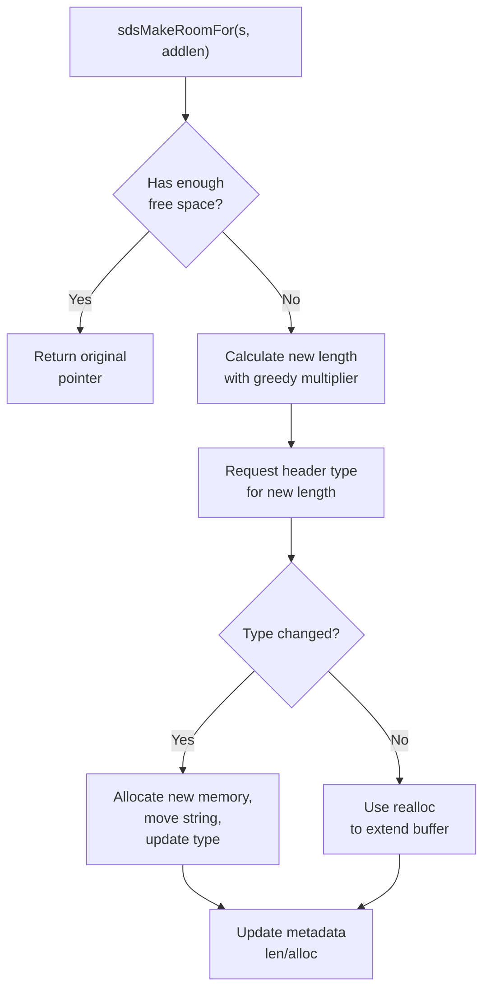

# Simple Dynamic Strings
<details>
<summary>Relevant source files</summary>

The following files were used as context for generating this wiki page:

- [src/sds.c](https://github.com/redis/redis/blob/main/src/sds.c)
- [src/sds.h](https://github.com/redis/redis/blob/main/src/sds.h)
- [src/t_string.c](https://github.com/redis/redis/blob/main/src/t_string.c)
- [src/bitops.c](https://github.com/redis/redis/blob/main/src/bitops.c)
</details>

Simple Dynamic Strings (SDS) is a string representation library designed for memory efficiency and high performance in C-based systems like Redis. Unlike standard C strings (`char*`), which rely on null-termination and have limited metadata, SDS stores the string length and capacity explicitly within a header that precedes the actual string data. This structure ensures that operations like length retrieval, concatenation, and memory resizing can be performed in constant time, $O(1)$, or with significantly reduced overhead compared to the $O(n)$ cost associated with `strlen` in traditional C.

The architecture of SDS centers on a polymorphic header approach. By using multiple header structures (`sdshdr8`, `sdshdr16`, `sdshdr32`, `sdshdr64`), the library minimizes metadata overhead based on the actual size of the stored data. This design allows it to store very small strings with only 1 byte of header overhead while supporting strings up to gigabytes in size. Furthermore, SDS is fully binary-safe, meaning it does not rely on null characters to signal end-of-string; the stored `len` field defines the string bounds, allowing it to hold arbitrary binary data.

SDS is the foundational component for string objects in the broader system. Because it keeps track of its own capacity, it facilitates optimized buffer management, particularly in append-heavy scenarios. When a string needs to grow, the `sdsMakeRoomFor` mechanism can perform over-allocation ("greedy" growth), reducing the frequency of reallocations and memory fragmentation. The system also supports "placement" initialization, allowing components to embed SDS headers directly within pre-allocated memory buffers, providing maximum flexibility for architectural performance.

## Core Data Structures

SDS implements its metadata using a series of packed structures. Each header includes a `len` field (the number of bytes currently used) and an `alloc` field (total bytes available). A critical design feature is the inclusion of a `flags` byte at the end of the header, which stores the SDS type and provides space for 5 auxiliary bits that can be utilized by parent objects (such as strings in the database) to store metadata without requiring extra memory.

| Header Type | Metadata Fields | Capacity Limit |
| :--- | :--- | :--- |
| `sdshdr5` | 1 byte flags | 31 bytes |
| `sdshdr8` | 1 byte len, 1 byte alloc, 1 byte flags | 255 bytes |
| `sdshdr16` | 2 bytes len, 2 bytes alloc, 1 byte flags | 65,535 bytes |
| `sdshdr32` | 4 bytes len, 4 bytes alloc, 1 byte flags | 4,294,967,295 bytes |
| `sdshdr64` | 8 bytes len, 8 bytes alloc, 1 byte flags | 18,446,744,073,709,551,615 bytes |

Sources: [src/sds.h:28-55](https://github.com/redis/redis/blob/main/src/sds.h#L28-L55)

> [!NOTE]
> The `sdshdr5` header is a special case: it stores the string length within the high 5 bits of the `flags` byte. Consequently, it lacks an `alloc` field and cannot track free space, making it unsuitable for strings that are expected to grow.

Sources: [src/sds.h:26-31](https://github.com/redis/redis/blob/main/src/sds.h#L26-L31)

## Type Selection and Lifecycle

The `sdsReqType` function determines the minimal header size required for a given string length. This logic ensures the system doesn't waste memory on oversized headers while ensuring sufficient capacity.

```c
char sdsReqType(size_t string_size) {
    if (string_size < 1 << 5) return SDS_TYPE_5;
    if (string_size <= (1 << 8) - sizeof(struct sdshdr8) - 1) return SDS_TYPE_8;
    if (string_size <= (1 << 16) - sizeof(struct sdshdr16) - 1) return SDS_TYPE_16;
#if (LONG_MAX == LLONG_MAX)
    if (string_size <= (1ll << 32) - sizeof(struct sdshdr32) - 1) return SDS_TYPE_32;
    return SDS_TYPE_64;
#else
    return SDS_TYPE_32;
#endif
}
```
Sources: [src/sds.c:33-43](https://github.com/redis/redis/blob/main/src/sds.c#L33-L43)

When creating or resizing an SDS string, the `adjustTypeIfNeeded` function is invoked to reconcile the logical length with the actual memory allocated by the underlying allocator (e.g., `jemalloc`). If the allocated buffer is larger than what the current SDS header type can address, the function transitions the header to a larger type.

Sources: [src/sds.c:75-83](https://github.com/redis/redis/blob/main/src/sds.c#L75-L83)

## Call-chain: SDS String Creation

To create a new string, the system typically calls `sdsnewlen`. The following chain illustrates the path of ensuring a correctly-typed header is initialized for the requested length.

1. `sdsnewlen` (src/sds.c:194-196) [Entry point]
2. `_sdsnewlen` (src/sds.c:97-122) [Logic handling initial size and type selection]
3. `adjustTypeIfNeeded` (src/sds.c:74-82) [Verification of header fit for physical memory]
4. `sdsReqType` (src/sds.c:32-42) [Selection logic]

Sources: [src/sds.c:194-196](https://github.com/redis/redis/blob/main/src/sds.c#L194-L196), [src/sds.c:97-122](https://github.com/redis/redis/blob/main/src/sds.c#L97-L122), [src/sds.c:74-82](https://github.com/redis/redis/blob/main/src/sds.c#L74-L82), [src/sds.c:32-42](https://github.com/redis/redis/blob/main/src/sds.c#L32-L42)

## Memory Management

SDS is designed to minimize reallocation costs using a "greedy" allocation strategy during append operations. The `_sdsMakeRoomFor` function implements this logic. When `greedy` is true, the allocated space is doubled (up to a 1MB limit) to amortize the cost of future growth.


Sources: [src/sds.c:278-337](https://github.com/redis/redis/blob/main/src/sds.c#L278-L337)

| Design Choice | Benefit | Cost |
| :--- | :--- | :--- |
| **Packed Headers** | No memory alignment padding; saves bytes | Requires unaligned pointer access or masking |
| **Header Precedence** | Pointer arithmetic allows accessing metadata via `s - hdrlen` | Requires strictly maintained header type integrity |
| **Greedy Growth** | Amortizes $O(N)$ allocation costs over multiple appends | Wastes temporary memory (internal fragmentation) |

Sources: [src/sds.c:140-183](https://github.com/redis/redis/blob/main/src/sds.c#L140-L183), [src/sds.c:294-299](https://github.com/redis/redis/blob/main/src/sds.c#L294-L299)

## Usage Example

The following code demonstrates creating an SDS string, appending data, and cleaning up:

```c
#include "sds.h"
#include <stdio.h>

void example() {
    // Create an initial SDS string
    sds s = sdsnew("Hello");

    // Append binary-safe data
    s = sdscatlen(s, " World", 6);

    // Print the result
    printf("SDS String: %s, Length: %zu\n", s, sdslen(s));

    // Release memory
    sdsfree(s);
}
```
Sources: [src/sds.c:210-213](https://github.com/redis/redis/blob/main/src/sds.c#L210-L213), [src/sds.c:534-543](https://github.com/redis/redis/blob/main/src/sds.c#L534-L543)

> [!WARNING]
> SDS strings are *not* valid pointers to the base allocation (the start of the `sdshdr` struct). They are pointers to the `buf` member. Always pass the original `sds` pointer to `sdsfree` or `sdsAllocPtr`, as the library performs internal pointer arithmetic to find the true header start.

Sources: [src/sds.c:442-446](https://github.com/redis/redis/blob/main/src/sds.c#L442-L446)