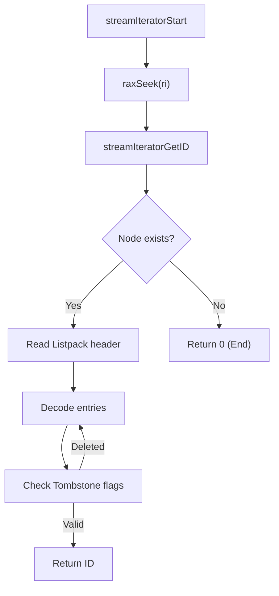

# Streams

Relevant source files

The following files were used as context for generating this wiki page:

- [src/t_stream.c](https://github.com/redis/redis/blob/main/src/t_stream.c)

Streams in Redis provide a powerful, append-only, log-like data structure that is designed to support message streaming and consumer group patterns. Unlike standard lists, which are often used for simple queuing, Streams allow for more complex message persistence, indexing, and multi-consumer coordination. They are optimized for high-throughput ingestion while maintaining strict order via 128-bit identifiers, which combine a millisecond-level timestamp and a sequence number.

The primary problem Streams solve is the need for durable, indexed event logs within a single Redis instance. They support features like consumer groups, which allow multiple consumers to process a shared stream of data, and acknowledgement mechanisms to ensure at-least-once delivery semantics. The design relies on a radix tree storing listpacks, which achieves a balance between efficient memory usage and fast range queries.

Streams integrate deeply with other Redis subsystems such as replication, AOF (Append Only File) persistence, and the blocking client mechanism. By providing fine-grained control over message deletion and reference tracking through Pending Entries Lists (PEL), Streams offer robust support for both real-time message distribution and long-term event storage.

## Core Data Architecture: Radix Tree and Listpacks

The core architecture of a stream is a radix tree where keys are the 128-bit stream IDs and values are `listpack` structures. A listpack acts as a memory-efficient container for multiple stream entries. Each listpack node starts with a "master entry" which contains metadata about the entries it holds, including the total field count and field names.

When an entry is added, it is "delta-encoded" relative to the master entry's information. If an entry shares the same field names as the master entry, the `STREAM_ITEM_FLAG_SAMEFIELDS` flag is set, allowing the system to omit the field names in the individual entry storage, significantly reducing the memory footprint.

> [!NOTE]
> The `STREAM_LISTPACK_MAX_PRE_ALLOCATE` (4096 bytes) and `STREAM_LISTPACK_MAX_SIZE` (1GB) define the bounds for listpack growth, preventing single-stream nodes from consuming unbounded memory or overflowing the internal 32-bit length fields of the listpack header.

Sources: [src/t_stream.c:65-66, 16-21, 30, 36, 575-605, 702-717](https://github.com/redis/redis/blob/main/src/t_stream.c#L65-L717)

## Identifier Generation and Comparison

Stream IDs are crucial for indexing and ordering. Each ID is a 128-bit value comprising a 64-bit millisecond timestamp and a 64-bit sequence number. The `streamNextID` function ensures monotonicity by comparing the current command time with the last ID's timestamp. If the current time is greater, the sequence starts at zero; otherwise, the previous sequence is incremented.

- `streamIncrID`: Increments the ID, potentially carrying the sequence into the timestamp.
- `streamCompareID`: Performs a lexicographical comparison, returning -1, 0, or 1.
- `streamEncodeID`/`streamDecodeID`: Translate IDs to/from big-endian buffers for radix tree key compatibility.

| Function | Signature | Purpose |
| :--- | :--- | :--- |
| `streamIncrID` | `(streamID *id)` | Move to the next sequence or time-step. |
| `streamDecrID` | `(streamID *id)` | Move to the previous sequence or time-step. |
| `streamCompareID` | `(streamID *a, streamID *b)` | Standard 3-way comparator for ordering. |

Sources: [src/t_stream.c:126-179, 441-467](https://github.com/redis/redis/blob/main/src/t_stream.c#L126-L467)

## Consumer Groups and Pending Entries List (PEL)

Consumer groups allow multiple clients to share the consumption of a single stream. Each group tracks its `last_id` (the last entry read by any member) and maintains a PEL, which stores all messages delivered to consumers but not yet acknowledged. 

- **PEL Structure**: A `rax` tree indexed by the stream ID. Each entry holds a `streamNACK` (Negative Acknowledgement) structure containing the consumer, delivery time, and delivery count.
- **PEL Time List**: A doubly-linked list (`pel_time_head/tail`) tracks entries by their delivery time, enabling the system to efficiently handle timeouts and "claim" orphaned messages using `XCLAIM` or `XAUTOCLAIM`.

Sources: [src/t_stream.c:272-333, 40-42, 60-62, 3339-3351](https://github.com/redis/redis/blob/main/src/t_stream.c#L272-L3351)

## XADD: Appending Data

The `streamAppendItem` operation is the primary entry point for ingesting data into a Stream.

1. **ID Generation**: If no explicit ID is provided, `streamNextID` is called.
2. **Bounds Checking**: Ensures the new ID is strictly greater than the last ID in the stream (guard: `streamCompareID(&id,&s->last_id) <= 0`).
3. **Capacity Check**: Validates that the entry size does not exceed `STREAM_LISTPACK_MAX_SIZE`.
4. **Insertion**: The function seeks the tail listpack node in the radix tree. If it is full (based on `stream_node_max_bytes` or `stream_node_max_entries`), it initializes a new node.
5. **Encoding**: Adds the entry to the listpack with appropriate compression flags.

> [!WARNING]
> `streamAppendItem` uses `EDOM` to indicate an ID conflict and `ERANGE` for sizing errors. These are critical signals to the command handler to stop processing and return an error to the user.

Sources: [src/t_stream.c:505-758](https://github.com/redis/redis/blob/main/src/t_stream.c#L505-L758)

## Iteration Mechanism

The `streamIterator` provides a cursor-based approach to traverse entries. `streamIteratorStart` seeks the radix tree for the correct starting node, and `streamIteratorGetID` retrieves the next valid ID, filtering out deleted entries (tombstones) if configured.

Sources: [src/t_stream.c:1346-1546](https://github.com/redis/redis/blob/main/src/t_stream.c#L1346-L1546)

## Trimming Logic

Trimming (e.g., via `MAXLEN` or `MINID`) allows bounding the stream size. The `streamTrim` function iterates through radix tree nodes and removes them if they are entirely outside the range. If only a portion of a node needs to be trimmed, the iterator marks individual entries as deleted using `STREAM_ITEM_FLAG_DELETED` rather than modifying the underlying radix tree immediately.

- **`TRIM_STRATEGY_MAXLEN`**: Trims based on the total stream length.
- **`TRIM_STRATEGY_MINID`**: Trims all entries with IDs smaller than a given threshold.

> [!TIP]
> The `approx_trim` flag allows for O(1) node removal at the cost of precision. When enabled, only complete radix tree nodes are removed, meaning the stream size might remain slightly above the requested target.

Sources: [src/t_stream.c:851-1050](https://github.com/redis/redis/blob/main/src/t_stream.c#L851-L1050)