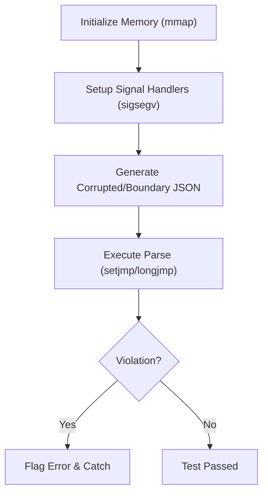
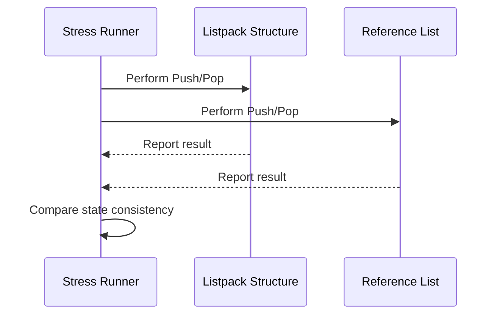

# Testing Harness
<details>
<summary>Relevant source files</summary>

The following files were used as context for generating this wiki page:

- [src/listpack.c](https://github.com/redis/redis/blob/main/src/listpack.c)
- [modules/vector-sets/fastjson_test.c](https://github.com/redis/redis/blob/main/modules/vector-sets/fastjson_test.c)
- [src/ebuckets.c](https://github.com/redis/redis/blob/main/src/ebuckets.c)
</details>

The "Testing Harness" refers to the suite of internal debugging, validation, and benchmarking mechanisms embedded directly within the Redis codebase. Rather than existing as a standalone external framework, this harness is implemented as tightly coupled logic within the core data structures (like `listpack.c` and `ebuckets.c`) and specialized modules. It serves to verify internal data integrity, performance characteristics, and robustness under stress or boundary conditions.

The purpose of these harnesses is twofold: to ensure that complex, performance-optimized data structures maintain their internal invariants during mutation, and to provide repeatable measurement points for developers. By embedding these checks—such as the integrity validation in `listpack` or the stress-testing memory logic in `fastjson`—Redis can perform self-checks in development and testing environments, preventing silent data corruption or undefined behavior that might otherwise be difficult to detect.

Design decisions for the testing harness focus on minimal production overhead. In many cases, these checks are guarded by conditional compilation flags (e.g., `REDIS_TEST`), ensuring that they remain inactive during production builds. When active, they provide a mechanism to trace control flows, enforce invariant safety, and perform comparative analysis of data structure performance, acting as a "living" specification of the subsystem's intended behavior.

## Core Integrity Validation (Listpack)

The listpack implementation provides a deep integrity verification mechanism designed to detect structural corruption. The mechanism works by traversing the entire structure and enforcing byte-level invariants, such as checking that every entry's encoded size matches its back-reference length.

The fundamental validation logic is defined in `lpValidateIntegrity`:

```c
/* Validate the integrity of the data structure. */
int lpValidateIntegrity(unsigned char *lp, size_t size, int deep, 
                        int (*entry_cb)(unsigned char *p, unsigned int head_count, void *userdata), 
                        void *cb_userdata) {
    /* Check that we can actually read the header. (and EOF) */
    if (size < LP_HDR_SIZE + 1) return 0;
    /* ... additional checks for header consistency ... */
}
```
Sources: [src/listpack.c:1703-1749](https://github.com/redis/redis/blob/main/src/listpack.c#L1703-L1749)

### Key Validation Mechanisms
- **Header Integrity:** Validates that the listpack total length matches the provided buffer size and that the trailing byte is always the designated `LP_EOF` marker.
- **Entry Scanning:** In "deep" mode, the harness iterates through every entry, calling `lpValidateNext` to confirm the encoding is valid and that the entry does not exceed the boundaries of the listpack structure.
- **Back-reference Verification:** Ensures the `backlen` field correctly points to the start of the current entry, allowing for reliable bi-directional traversal.

> [!IMPORTANT]
> The `lpValidateIntegrity` function guarantees that no entry resides outside the listpack's allocated memory. If any check fails, the data structure is considered corrupted, signaling an immediate need for recovery.

## Memory Boundary Stress Testing (FastJSON)

For modules like `fastjson`, the harness focuses on memory safety. Since JSON parsing involves buffer scanning and potential out-of-bounds access, the harness utilizes a "guard page" strategy.

The system maps two adjacent memory pages: a writable "safe" page containing the JSON input and an inaccessible "unsafe" page immediately following it. If the parser makes an out-of-bounds access beyond the end of the JSON payload, it triggers a `SIGSEGV`, which the testing harness catches to flag a boundary violation.


Sources: [modules/vector-sets/fastjson_test.c:78-105](https://github.com/redis/vector-sets/fastjson_test.c#L78-L105)

## Performance Benchmarking (ebuckets)

The `ebuckets` component includes an integrated benchmarking harness triggered at compile-time via `EB_TEST_BENCHMARK`. This mechanism allows developers to test distribution performance with large datasets directly within the Redis binary.

| Benchmark Target | Methodology | Goal |
| :--- | :--- | :--- |
| **Creation** | Initialize bucket structure | Validate O(1) insertion efficiency |
| **Active-Expire** | Run with 10M items | Measure CPU overhead during expiration |
| **Distribution** | Varying `EB_TEST_BENCHMARK` | Simulate different object TTL profiles |

Sources: [src/ebuckets.c:34-42](https://github.com/redis/ebuckets.c#L34-L42)

## Automated Stress Testing (Listpack)

The listpack stress tester executes mass push and pop operations at both the `HEAD` and `TAIL` of a list, specifically measuring timing and memory behavior under high-pressure scenarios. It validates that even with randomized, variable-sized payloads, the structure maintains its sequence integrity when compared against a reference structure.


Sources: [src/listpack.c:2112-2138](https://github.com/redis/redis/blob/main/src/listpack.c#L2112-L2138)

## Invariants and Safety Guards

The testing harness relies on explicit guards to maintain structural coherence.

- **Integrity Assertion:** Macros like `ASSERT_INTEGRITY(lp, p)` prevent invalid pointers from propagating by checking that `p` remains within the memory bounds of the listpack.
- **Safety Limits:** `lpSafeToAdd` prevents listpacks from growing beyond 1GB to prevent header field overflows.
- **Signal Handling:** In module-level testing, `setjmp/longjmp` are used to gracefully recover from deliberate memory errors, allowing the harness to report the failure without crashing the entire test run.

> [!WARNING]
> When implementing custom entry callbacks in `lpValidateIntegrity`, ensure the callback does not modify the listpack, as the validator expects a read-only structure during the full-scan traversal.