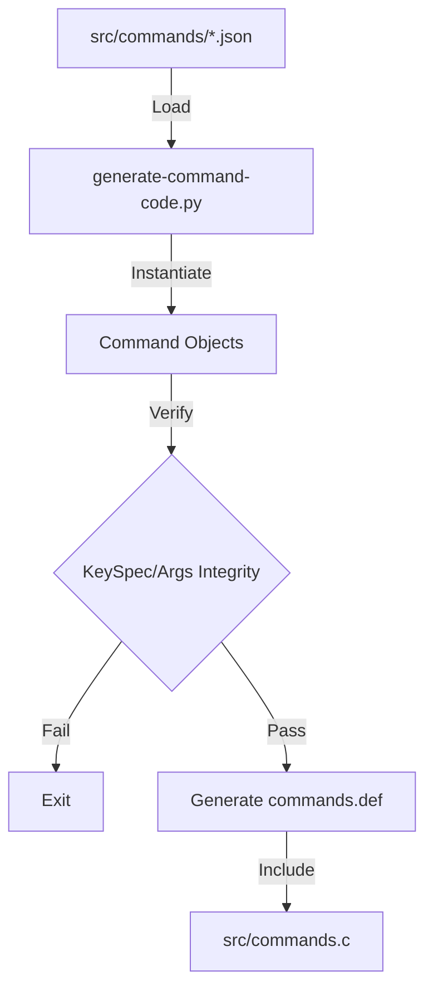
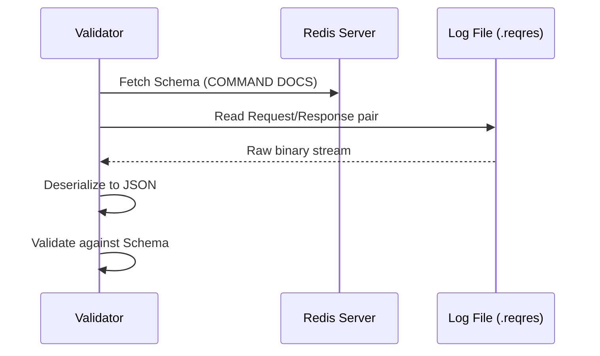

# Utility Scripts

Relevant source files

The following files were used as context for generating this wiki page:

- [utils/generate-command-code.py](https://github.com/redis/redis/blob/main/utils/generate-command-code.py)
- [src/commands/command-info.json](https://github.com/redis/redis/blob/main/src/commands/command-info.json)
- [src/commands/command-docs.json](https://github.com/redis/redis/blob/main/src/commands/command-docs.json)
- [src/functions.c](https://github.com/redis/redis/blob/main/src/functions.c)
- [src/commands/role.json](https://github.com/redis/redis/blob/main/src/commands/role.json)
- [utils/req-res-log-validator.py](https://github.com/redis/redis/blob/main/utils/req-res-log-validator.py)
- [src/commands/function-list.json](https://github.com/redis/redis/blob/main/src/commands/function-list.json)
- [utils/generate-commands-json.py](https://github.com/redis/redis/blob/main/utils/generate-commands-json.py)
- [utils/reply_schema_linter.js](https://github.com/redis/redis/blob/main/utils/reply_schema_linter.js)
- [src/commands/README.md](https://github.com/redis/redis/blob/main/src/commands/README.md)
- [src/commands/hello.json](https://github.com/redis/redis/blob/main/src/commands/hello.json)
- [src/cli_commands.c](https://github.com/redis/redis/blob/main/src/cli_commands.c)
- [src/commands/function-stats.json](https://github.com/redis/redis/blob/main/src/commands/function-stats.json)
- [src/commands/cluster-migration.json](https://github.com/redis/redis/blob/main/src/commands/cluster-migration.json)
- [src/commands/lolwut.json](https://github.com/redis/redis/blob/main/src/commands/lolwut.json)
- [src/commands/function-help.json](https://github.com/redis/redis/blob/main/src/commands/function-help.json)
- [src/commands.c](https://github.com/redis/redis/blob/main/src/commands.c)
- [src/commands/function-dump.json](https://github.com/redis/redis/blob/main/src/commands/function-dump.json)
- [src/commands/cluster-slots.json](https://github.com/redis/redis/blob/main/src/commands/cluster-slots.json)
- [src/commands/script-help.json](https://github.com/redis/redis/blob/main/src/commands/script-help.json)
- [src/commands/script.json](https://github.com/redis/redis/blob/main/src/commands/script.json)
- [src/commands/object-help.json](https://github.com/redis/redis/blob/main/src/commands/object-help.json)
- [src/commands/hotkeys-get.json](https://github.com/redis/redis/blob/main/src/commands/hotkeys-get.json)
- [src/commands/argrep.json](https://github.com/redis/redis/blob/main/src/commands/argrep.json)
- [src/commands/geosearchstore.json](https://github.com/redis/redis/blob/main/src/commands/geosearchstore.json)
- [utils/install_server.sh](https://github.com/redis/redis/blob/main/utils/install_server.sh)

Utility Scripts represent a critical layer of the Redis development ecosystem, serving as the bridge between declarative definitions (JSON command specifications) and the low-level C source code required for server operation. These scripts automate the complex, error-prone task of translating schema-based command documentation into efficient internal structs, ensuring that command registration, key-specifications, and reply schemas remain synchronized across the entire codebase.

By moving the "source of truth" to JSON files, the system enforces a uniform structure for command metadata. The scripts then process these files, validating internal consistency (such as duplicate names or mismatched key-spec indices) and generating the C header/definition files that initialize the command table at server boot time. This architectural choice prevents divergence between the actual command implementation and the documentation exposed via `COMMAND` or `COMMAND DOCS`.

Beyond build-time generation, these utility scripts provide essential validation and deployment tooling. They include linters for schema verification, log validators for integration testing, and automated installers for managing multi-instance server deployments. Together, they form a robust framework for maintaining code quality, ensuring that even complex requirements like reply-schema serialization or cluster migration states are handled systematically.

## Command Definition Generation
The command generation system, primarily centered in `utils/generate-command-code.py`, transforms the `src/commands/*.json` files into `commands.def`. This script acts as a compiler for command descriptors, resolving dependencies and mapping higher-level JSON abstractions to C macros.

The mechanism follows a strict object-oriented structure where `Command`, `Subcommand`, `Argument`, and `KeySpec` classes parse the source JSON. The `write_internal_structs` method facilitates this, traversing the tree of commands to write out C tables.

Sources: [utils/generate-command-code.py:544-580](https://github.com/redis/redis/blob/main/utils/generate-command-code.py#L544-L580)

## Schema Validation and Linting
Reliability of documentation is enforced by `utils/reply_schema_linter.js`, which uses the `ajv` validator to ensure all command reply schemas defined in JSON match the expected JSON Schema specification.

The validation routine iterates over the directory `./src/commands`, compiling schemas individually. If any schema fails compilation, it logs the specific error and forces a non-zero exit code, effectively acting as a unit test for metadata correctness.

Sources: [utils/reply_schema_linter.js:1-18](https://github.com/redis/redis/blob/main/utils/reply_schema_linter.js#L1-L18)

## Request/Response Log Validation
The `utils/req-res-log-validator.py` script validates the server's runtime behavior against the documented `reply_schema`. It processes `.reqres` files generated during test runs (via `--log-req-res`).

The flow operates by reading binary-protocol log files, deserializing RESP3 responses, and validating them against the command schemas fetched from a running Redis instance via `COMMAND DOCS`. This mechanism bridges the gap between static definitions and actual server output, ensuring that documented responses reflect real-world implementation.

Sources: [utils/req-res-log-validator.py:121-249](https://github.com/redis/redis/blob/main/utils/req-res-log-validator.py#L121-L249)

## Deployment Tooling: Server Installation
`utils/install_server.sh` is a shell-based utility for bootstrapping Redis instances. It automates file system setup, log rotation configuration, and service manager integration (SysV-init compatibility).

The script performs a series of environment-based injections into `redis.conf` templates and generates an `init.d` script based on the chosen instance port. It explicitly guards against systemd-managed systems, advising manual configuration for those modern environments to ensure local administrator control.

Sources: [utils/install_server.sh:76-83](https://github.com/redis/redis/blob/main/utils/install_server.sh#L76-L83)

## Command Information Synthesis
`utils/generate-commands-json.py` aggregates `COMMAND` and `COMMAND DOCS` output into a consolidated `commands.json`. This provides a flattened representation for third-party tools.

The normalization logic uses `convert_entry_to_objects_array`, which recursively transforms nested command/subcommand structures into a normalized map, applying booleans to flags and cleaning empty values.

> [!TIP]
> Use `redis-cli --json` to extract command metadata in a format compatible with this generator, ensuring that you obtain the full suite of metadata, including documentation and arity, in one pass.

Sources: [utils/generate-commands-json.py:35-103](https://github.com/redis/redis/blob/main/utils/generate-commands-json.py#L35-L103)

## Execution Walkthrough: Command Initialization
The registration of commands via utility scripts follows a linear but strict initialization path:
1. `generate-command-code.py` traverses `src/commands/*.json` files and executes `create_command(name, desc)`.
2. Commands and subcommands are stored in a global map.
3. Once all files are parsed, `commands.values()` are linked to subcommands via `command.subcommands.append(subcommand)`.
4. `check_command_key_specs` ensures all `key_spec` entries are valid and that indices correlate correctly with arguments.
5. The `write_internal_structs` method then emits the C code into `commands.def`, allowing `src/commands.c` to compile them into the final `redisCommandTable`.

Sources: [utils/generate-command-code.py:544-576](https://github.com/redis/redis/blob/main/utils/generate-command-code.py#L544-L576), [src/commands.c:10-13](https://github.com/redis/redis/blob/main/src/commands.c#L10-L13)