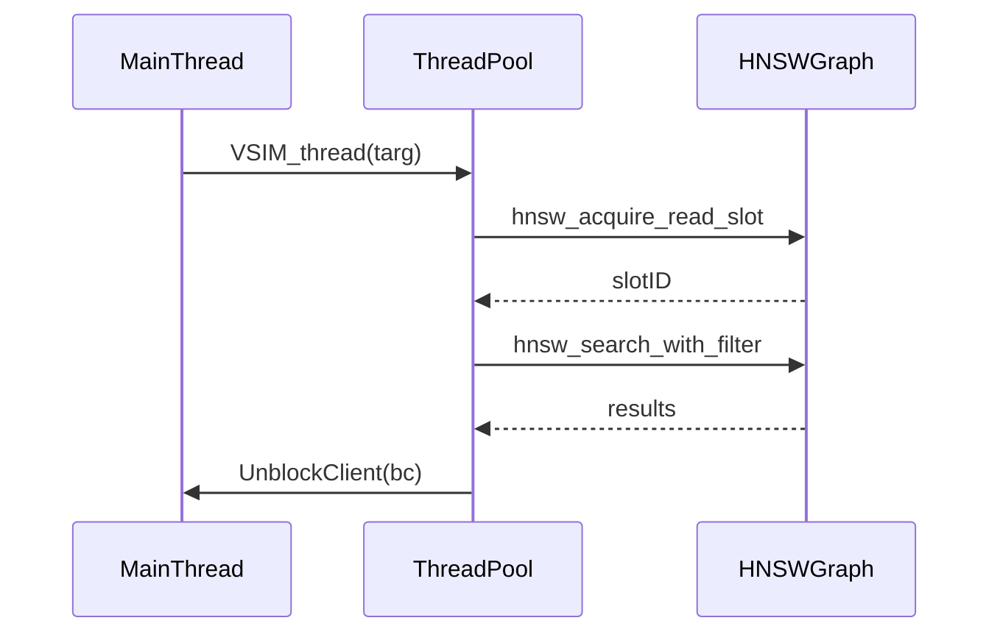

# Vector Similarity
<details>
<summary>Relevant source files</summary>

The following files were used as context for generating this wiki page:

- [modules/vector-sets/vset.c](https://github.com/redis/redis/blob/main/modules/vector-sets/vset.c)
- [modules/vector-sets/hnsw.c](https://github.com/redis/redis/blob/main/modules/vector-sets/hnsw.c)
</details>

Vector Similarity provides a high-performance vector search engine embedded within Redis, primarily powered by the Hierarchical Navigable Small World (HNSW) algorithm. The component addresses the need to manage large collections of vectors and perform efficient proximity-based queries (k-Nearest Neighbors) in a database context. By bridging the gap between high-dimensional vector data and Redis-style key-based storage, it enables complex search operations while maintaining compatibility with standard Redis operations like key deletion and updates.

The architecture centers on two primary data representations for every Vector Set: the HNSW proximity graph, which accelerates search, and an `element` → `graph-node` map (using a Redis dictionary). This dual representation is essential for supporting operations that act on identifiers rather than vectors directly, such as updating an existing vector or removing a specific element from the set. Design decisions reflect a focus on performance: HNSW allows logarithmic search complexity in practice, while local node quantization (int8) and SIMD-accelerated distance calculations ensure that the CPU-intensive similarity checks are performed efficiently.

The system is designed for a multi-threaded environment where standard Redis commands run on the main event loop while search queries and candidate collection can be offloaded to background threads. This is managed through a sophisticated locking strategy involving read-write locks for the Vector Set object and protected "read slots" in the HNSW graph metadata. The interplay between the main thread (for write-heavy operations) and background workers (for long-running search calculations) ensures that high-concurrency vector search does not stall the primary Redis event loop.

## Data Structures and Memory Layout

The core of the subsystem is the `vsetObject`, which encapsulates the entire Vector Set state. This structure acts as the bridge between Redis storage and the underlying C-based HNSW implementation.

| Field | Purpose |
| :--- | :--- |
| `hnsw` | The primary proximity graph and HNSW state (see `hnsw.h`). |
| `dict` | A mapping of element strings to nodes for O(1) lookups. |
| `proj_matrix` | Deterministic random projection matrix for dimensionality reduction. |
| `in_use_lock` | A read-write lock for synchronizing object deletion and updates. |
| `thread_creation_pending` | Atomic counter preventing object destruction while threads are spawning. |

The `vsetNodeVal` struct holds the user-facing metadata associated with each node, specifically the element string and an optional JSON string for attribute-based filtering (`VSIM` with `FILTER`).

Sources: [modules/vector-sets/vset.c:146-159](https://github.com/redis/redis/blob/main/modules/vector-sets/vset.c#L146-L159), [modules/vector-sets/vset.c:164-167](https://github.com/redis/redis/blob/main/modules/vector-sets/vset.c#L164-L167)

## Threading Model and Synchronization

Vector Similarity uses a hybrid locking mechanism. Background threads performing `VSIM` queries acquire the `in_use_lock` in read mode. This allows multiple concurrent searches to proceed. When the main Redis thread needs to perform a structural change (like a `DEL` command), it triggers `vectorSetWaitAllBackgroundClients()`, which acquires a write lock briefly to wait for all background workers to exit.

> [!CAUTION]
> The race condition between `thread_creation_pending` and object destruction is critical. The system uses an atomic `thread_creation_pending` counter to prevent `DEL` operations from destroying the `vsetObject` while a thread is attempting to acquire the `in_use_lock`.

Sources: [modules/vector-sets/vset.c:36-41](https://github.com/redis/redis/blob/main/modules/vector-sets/vset.c#L36-L41), [modules/vector-sets/vset.c:66-72](https://github.com/redis/redis/blob/main/modules/vector-sets/vset.c#L66-L72)

## Search Mechanism and Execution Flow

The `VSIM` command supports both blocking (synchronous) and non-blocking (threaded) execution. When a threaded search is performed, the control flow follows a specialized pattern to offload the expensive search while remaining safe for the Redis event loop.


Sources: [modules/vector-sets/vset.c:912-948](https://github.com/redis/redis/blob/main/modules/vector-sets/vset.c#L912-L948)

## Dimensionality Reduction

Vector sets can be created with dimensionality reduction using a Hadamard-based projection matrix. This deterministic approach ensures consistent mapping across replicas, as the weights are derived from bitwise operations rather than pseudo-random number generation.

The projection matrix is filled using the following Hadamard pattern logic:
`matrix[i][j] = (bit_count(i & j) % 2 == 0) ? 1 : -1`
The matrix is scaled by `1/sqrt(input_dim)` to normalize the output vectors, ensuring that distance calculations remain meaningful after the projection.

Sources: [modules/vector-sets/vset.c:181-217](https://github.com/redis/redis/blob/main/modules/vector-sets/vset.c#L181-L217)

## Quantization and Similarity Calculations

The system supports `f32`, `int8` (Q8), and `bin` quantization. The distance calculations are optimized using SIMD where available. For Q8, the library uses integer accumulation to perform dot products, which are then scaled back to floating-point representation.

| Quantization Type | Underlying Mechanism |
| :--- | :--- |
| `HNSW_QUANT_NONE` | Full precision float32 dot product. |
| `HNSW_QUANT_Q8` | int8 dot product with per-vector range scaling. |
| `HNSW_QUANT_BIN` | bitwise XOR followed by `popcount`. |

> [!TIP]
> The binary distance implementation uses hardware `POPCNT` via `__builtin_popcountll` where supported, significantly accelerating distance comparisons compared to manual shift-and-add approaches.

Sources: [modules/vector-sets/hnsw.c:287-297](https://github.com/redis/redis/blob/main/modules/vector-sets/hnsw.c#L287-L297), [modules/vector-sets/hnsw.c:559-612](https://github.com/redis/redis/blob/main/modules/vector-sets/hnsw.c#L559-L612)

## Insertion and Node Management

Adding a node to a Vector Set involves either a direct synchronous insertion or a Check-And-Set (CAS) flow that gathers neighbors in a background thread before performing the actual commit in the main thread.

**Call-chain: Threaded CAS Insertion**
1. `VADD_RedisCommand`: Initiates and spawns `VADD_thread` if CAS is enabled.
2. `VADD_thread`: Acquires `in_use_lock` (read), runs `hnsw_prepare_insert` to find candidates.
3. `VADD_CASReply`: Executed on the main thread after `VADD_thread` unblocks the client.
4. `hnsw_try_commit_insert`: Attempts to apply the HNSW graph update if the graph version has not changed.
5. If `try_commit` fails, it falls back to a full `hnsw_insert` operation on the main thread.

Sources: [modules/vector-sets/vset.c:493-571](https://github.com/redis/redis/blob/main/modules/vector-sets/vset.c#L493-L571), [modules/vector-sets/vset.c:763-790](https://github.com/redis/redis/blob/main/modules/vector-sets/vset.c#L763-L790)

## Worked Example: Inserting a Vector

To insert a vector into a `my_vectors` set with a specific attribute, a developer would use the following command structure. This command effectively handles the conversion to floating point (if using `VALUES` format) and integrates with the HNSW indexing process:

```bash
# Add a 4-dimensional vector using VALUES format with an attribute
VADD my_vectors VALUES 4 0.1 0.2 0.3 0.4 "element_1" SETATTR "{\"category\": \"test\"}"
```

This operation performs the following steps:
1. Validates input and parses arguments via `parseVector`.
2. Checks for `CAS` flag; if absent, initiates synchronous insertion into the `vsetObject` using `vectorSetInsert`.
3. `vectorSetInsert` performs dictionary lookup, updates the dictionary entry if it exists, and then calls `hnsw_insert` to update the HNSW graph.

Sources: [modules/vector-sets/vset.c:575-635](https://github.com/redis/redis/blob/main/modules/vector-sets/vset.c#L575-L635), [modules/vector-sets/vset.c:794-800](https://github.com/redis/redis/blob/main/modules/vector-sets/vset.c#L794-L800)