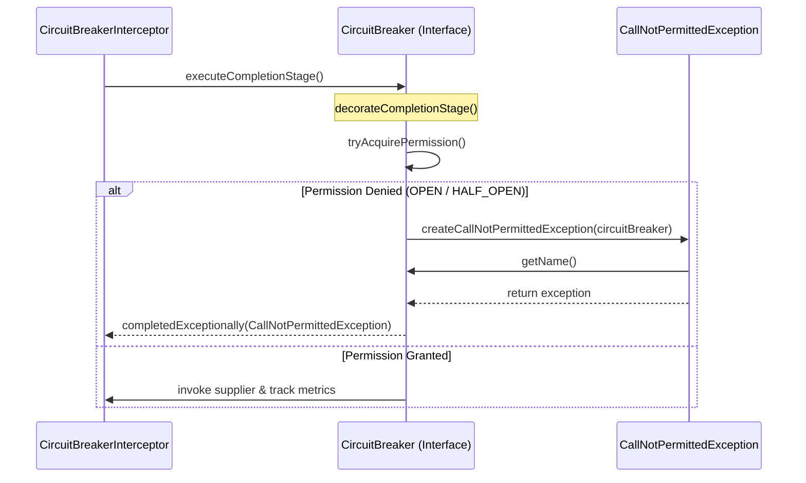
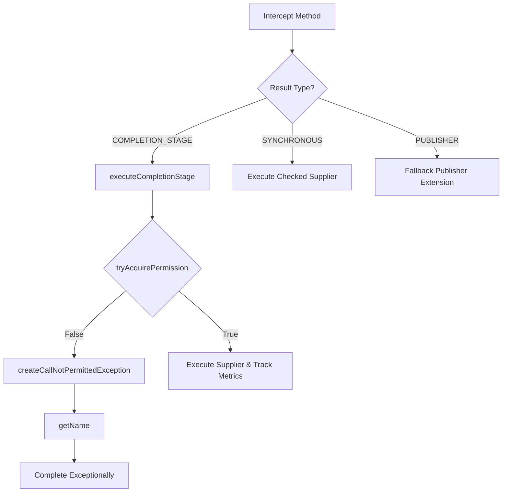

# Circuit Breaker Interceptor Execution

Relevant source files

The following files were used as context for generating this wiki page:

- [resilience4j-micronaut/src/main/java/io/github/resilience4j/micronaut/circuitbreaker/CircuitBreakerInterceptor.java](https://github.com/resilience4j/resilience4j/blob/main/resilience4j-micronaut/src/main/java/io/github/resilience4j/micronaut/circuitbreaker/CircuitBreakerInterceptor.java)
- [resilience4j-circuitbreaker/src/main/java/io/github/resilience4j/circuitbreaker/CircuitBreaker.java](https://github.com/resilience4j/resilience4j/blob/main/resilience4j-circuitbreaker/src/main/java/io/github/resilience4j/circuitbreaker/CircuitBreaker.java)
- [resilience4j-circuitbreaker/src/main/java/io/github/resilience4j/circuitbreaker/CallNotPermittedException.java](https://github.com/resilience4j/resilience4j/blob/main/resilience4j-circuitbreaker/src/main/java/io/github/resilience4j/circuitbreaker/CallNotPermittedException.java)

## Overview

### Overview

The **Intercept -> GetName** execution flow illustrates how a Micronaut AOP method interceptor coordinates with Resilience4j's core circuit breaker abstractions to guard asynchronous reactive or asynchronous future operations (`CompletionStage`). When a client invokes a method annotated with `@CircuitBreaker`, the interceptor inspects the return type, acquires or creates the appropriate circuit breaker instance, and delegates execution handling. If the circuit breaker is open or refuses permission, a rejection exception carrying the breaker's name is instantiated and propagated.

> [!NOTE]
> This flow specifically targets asynchronous execution types (`COMPLETION_STAGE`), bridging Micronaut's interception model with Resilience4j's state machine and decoration mechanisms.

Sources: [resilience4j-micronaut/src/main/java/io/github/resilience4j/micronaut/circuitbreaker/CircuitBreakerInterceptor.java:73-103](https://github.com/resilience4j/resilience4j/blob/main/resilience4j-micronaut/src/main/java/io/github/resilience4j/micronaut/circuitbreaker/CircuitBreakerInterceptor.java#L73-L103)

---

## Step-by-Step Execution Flow

### Step 1: Intercept Method Invocation
The execution begins in `CircuitBreakerInterceptor.intercept(MethodInvocationContext)`, which intercepts any method annotated with `@CircuitBreaker`. It extracts the configured circuit breaker name from the annotation (defaulting to `"default"`), fetches or creates the corresponding `CircuitBreaker` instance from the registry, and checks the method's result type via Micronaut's `InterceptedMethod`.

Sources: [resilience4j-micronaut/src/main/java/io/github/resilience4j/micronaut/circuitbreaker/CircuitBreakerInterceptor.java:73-83](https://github.com/resilience4j/resilience4j/blob/main/resilience4j-micronaut/src/main/java/io/github/resilience4j/micronaut/circuitbreaker/CircuitBreakerInterceptor.java#L73-L83)

### Step 2: Execute Completion Stage
Upon determining that the result type is `COMPLETION_STAGE`, the interceptor invokes `CircuitBreaker.executeCompletionStage(Supplier)`. This default interface method wraps the supplier invocation using `decorateCompletionStage`, attempting to acquire a permission from the underlying state machine before running the asynchronous operation.

Sources: [resilience4j-circuitbreaker/src/main/java/io/github/resilience4j/circuitbreaker/CircuitBreaker.java:714-716](https://github.com/resilience4j/resilience4j/blob/main/resilience4j-circuitbreaker/src/main/java/io/github/resilience4j/circuitbreaker/CircuitBreaker.java#L714-L716)

### Step 3: Decorate Completion Stage
Inside `CircuitBreaker.decorateCompletionStage(...)`, the circuit breaker checks if a call permission can be acquired via `tryAcquirePermission()`. If permissions are denied (e.g., the circuit breaker is `OPEN` or `HALF_OPEN` and test call limits are exceeded), it creates and completes a future exceptionally.

Sources: [resilience4j-circuitbreaker/src/main/java/io/github/resilience4j/circuitbreaker/CircuitBreaker.java:92-104](https://github.com/resilience4j/resilience4j/blob/main/resilience4j-circuitbreaker/src/main/java/io/github/resilience4j/circuitbreaker/CircuitBreaker.java#L92-L104)

### Step 4: Create Call Not Permitted Exception
When a call is rejected due to circuit breaker state constraints, `CallNotPermittedException.createCallNotPermittedException(CircuitBreaker)` is invoked. It inspects the circuit breaker configuration to determine whether writable stack traces are enabled and formats an explanatory exception message.

Sources: [resilience4j-circuitbreaker/src/main/java/io/github/resilience4j/circuitbreaker/CallNotPermittedException.java:39-49](https://github.com/resilience4j/resilience4j/blob/main/resilience4j-circuitbreaker/src/main/java/io/github/resilience4j/circuitbreaker/CallNotPermittedException.java#L39-L49)

### Step 5: Initialize Exception and Extract Breaker Name
The private constructor `CallNotPermittedException(...)` is executed, initializing the parent `RuntimeException` with the formatted message and recording the failing circuit breaker's identity by invoking `circuitBreaker.getName()`.

Sources: [resilience4j-circuitbreaker/src/main/java/io/github/resilience4j/circuitbreaker/CallNotPermittedException.java:29-32](https://github.com/resilience4j/resilience4j/blob/main/resilience4j-circuitbreaker/src/main/java/io/github/resilience4j/circuitbreaker/CallNotPermittedException.java#L29-L32)

### Step 6: Retrieve Circuit Breaker Name
Finally, `CircuitBreaker.getName()` returns the string identifier of the circuit breaker instance, which is stored within the exception for telemetry, logging, and error handling.

Sources: [resilience4j-circuitbreaker/src/main/java/io/github/resilience4j/circuitbreaker/CircuitBreaker.java:586-590](https://github.com/resilience4j/resilience4j/blob/main/resilience4j-circuitbreaker/src/main/java/io/github/resilience4j/circuitbreaker/CircuitBreaker.java#L586-L590)

---

## Sequence Diagram

Sources: [resilience4j-micronaut/src/main/java/io/github/resilience4j/micronaut/circuitbreaker/CircuitBreakerInterceptor.java:95-101](https://github.com/resilience4j/resilience4j/blob/main/resilience4j-micronaut/src/main/java/io/github/resilience4j/micronaut/circuitbreaker/CircuitBreakerInterceptor.java#L95-L101), [resilience4j-circuitbreaker/src/main/java/io/github/resilience4j/circuitbreaker/CircuitBreaker.java:92-103](https://github.com/resilience4j/resilience4j/blob/main/resilience4j-circuitbreaker/src/main/java/io/github/resilience4j/circuitbreaker/CircuitBreaker.java#L92-L103), [resilience4j-circuitbreaker/src/main/java/io/github/resilience4j/circuitbreaker/CallNotPermittedException.java:39-48](https://github.com/resilience4j/resilience4j/blob/main/resilience4j-circuitbreaker/src/main/java/io/github/resilience4j/circuitbreaker/CallNotPermittedException.java#L39-L48), [resilience4j-circuitbreaker/src/main/java/io/github/resilience4j/circuitbreaker/CircuitBreaker.java:586-590](https://github.com/resilience4j/resilience4j/blob/main/resilience4j-circuitbreaker/src/main/java/io/github/resilience4j/circuitbreaker/CircuitBreaker.java#L586-L590)

---

## Flowchart

Sources: [resilience4j-micronaut/src/main/java/io/github/resilience4j/micronaut/circuitbreaker/CircuitBreakerInterceptor.java:83-112](https://github.com/resilience4j/resilience4j/blob/main/resilience4j-micronaut/src/main/java/io/github/resilience4j/micronaut/circuitbreaker/CircuitBreakerInterceptor.java#L83-L112), [resilience4j-circuitbreaker/src/main/java/io/github/resilience4j/circuitbreaker/CircuitBreaker.java:92-104](https://github.com/resilience4j/resilience4j/blob/main/resilience4j-circuitbreaker/src/main/java/io/github/resilience4j/circuitbreaker/CircuitBreaker.java#L92-L104), [resilience4j-circuitbreaker/src/main/java/io/github/resilience4j/circuitbreaker/CallNotPermittedException.java:39-49](https://github.com/resilience4j/resilience4j/blob/main/resilience4j-circuitbreaker/src/main/java/io/github/resilience4j/circuitbreaker/CallNotPermittedException.java#L39-L49)

---

## Key Observations

- **Cross-Module Integration:** This execution flow bridges the `resilience4j-micronaut` AOP integration module with the framework-agnostic `resilience4j-circuitbreaker` core module.
- **Fail-Fast Behaviour:** When a circuit breaker is tripped, requests are rejected immediately without invoking the underlying bean method, preventing downstream resource exhaustion.
- **Configurable Diagnostics:** The `CallNotPermittedException` respects the user's configuration regarding stack trace generation (`isWritableStackTraceEnabled`), optimizing performance under high load by avoiding expensive stack trace allocations when disabled.

Sources: [resilience4j-micronaut/src/main/java/io/github/resilience4j/micronaut/circuitbreaker/CircuitBreakerInterceptor.java:73-117](https://github.com/resilience4j/resilience4j/blob/main/resilience4j-micronaut/src/main/java/io/github/resilience4j/micronaut/circuitbreaker/CircuitBreakerInterceptor.java#L73-L117), [resilience4j-circuitbreaker/src/main/java/io/github/resilience4j/circuitbreaker/CallNotPermittedException.java:39-49](https://github.com/resilience4j/resilience4j/blob/main/resilience4j-circuitbreaker/src/main/java/io/github/resilience4j/circuitbreaker/CallNotPermittedException.java#L39-L49)
