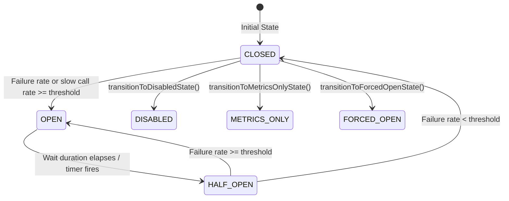
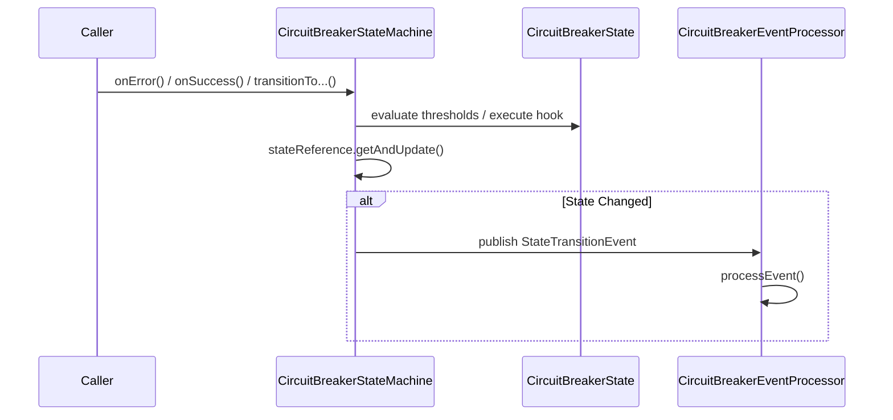

# Circuit Breaker State Machine

<details>
<summary>Relevant source files</summary>

The following files were used as context for generating this wiki page:

- [resilience4j-circuitbreaker/src/main/java/io/github/resilience4j/circuitbreaker/internal/CircuitBreakerStateMachine.java](https://github.com/resilience4j/resilience4j/blob/main/resilience4j-circuitbreaker/src/main/java/io/github/resilience4j/circuitbreaker/internal/CircuitBreakerStateMachine.java)
- [resilience4j-spring-boot4/src/main/java/io/github/resilience4j/springboot/circuitbreaker/monitoring/endpoint/CircuitBreakerEndpoint.java](https://github.com/resilience4j/resilience4j/blob/main/resilience4j-springboot/circuitbreaker/monitoring/endpoint/CircuitBreakerEndpoint.java)
- [resilience4j-spring-boot3/src/main/java/io/github/resilience4j/springboot3/circuitbreaker/monitoring/endpoint/CircuitBreakerEndpoint.java](https://github.com/resilience4j/resilience4j/blob/main/resilience4j-spring-boot3/src/main/java/io/github/resilience4j/springboot3/circuitbreaker/monitoring/endpoint/CircuitBreakerEndpoint.java)
- [resilience4j-circuitbreaker/src/main/java/io/github/resilience4j/circuitbreaker/CircuitBreaker.java](https://github.com/resilience4j/resilience4j/blob/main/resilience4j-circuitbreaker/src/main/java/io/github/resilience4j/circuitbreaker/CircuitBreaker.java)
- [resilience4j-framework-common/src/main/java/io/github/resilience4j/common/circuitbreaker/configuration/CommonCircuitBreakerConfigurationProperties.java](https://github.com/resilience4j/resilience4j/blob/main/resilience4j-framework-common/src/main/java/io/github/resilience4j/common/circuitbreaker/configuration/CommonCircuitBreakerConfigurationProperties.java)
- [resilience4j-circuitbreaker/src/main/java/io/github/resilience4j/circuitbreaker/CircuitBreakerConfig.java](https://github.com/resilience4j/resilience4j/blob/main/resilience4j-circuitbreaker/src/main/java/io/github/resilience4j/circuitbreaker/CircuitBreakerConfig.java)
- [resilience4j-circuitbreaker/src/main/java/io/github/resilience4j/circuitbreaker/internal/CircuitBreakerMetrics.java](https://github.com/resilience4j/resilience4j/blob/main/resilience4j-circuitbreaker/src/main/java/io/github/resilience4j/circuitbreaker/internal/CircuitBreakerMetrics.java)
- [resilience4j-vavr/src/main/java/io/github/resilience4j/circuitbreaker/VavrCircuitBreaker.java](https://github.com/resilience4j/resilience4j/blob/main/resilience4j-vavr/src/main/java/io/github/resilience4j/circuitbreaker/VavrCircuitBreaker.java)
- [resilience4j-spring-boot3/src/main/java/io/github/resilience4j/springboot3/circuitbreaker/monitoring/health/CircuitBreakersHealthIndicator.java](https://github.com/resilience4j/resilience4j/blob/main/resilience4j-spring-boot3/src/main/java/io/github/resilience4j/springboot3/circuitbreaker/monitoring/health/CircuitBreakersHealthIndicator.java)
- [resilience4j-rxjava3/src/main/java/io/github/resilience4j/rxjava3/circuitbreaker/operator/FlowableCircuitBreaker.java](https://github.com/resilience4j/rxjava3/circuitbreaker/operator/FlowableCircuitBreaker.java)
- [grafana_dashboard.json](https://github.com/resilience4j/grafana_dashboard.json)
</details>

## Overview

The `CircuitBreakerStateMachine` is the core internal engine implementing the `CircuitBreaker` interface in Resilience4j. It provides a thread-safe finite state machine governing remote or local backend calls, preventing cascading failures by short-circuiting requests when failure rates or slow-call rates breach configured thresholds.
Sources: [resilience4j-circuitbreaker/src/main/java/io/github/resilience4j/circuitbreaker/internal/CircuitBreakerStateMachine.java:54-57](https://github.com/resilience4j/resilience4j/blob/main/resilience4j-circuitbreaker/src/main/java/io/github/resilience4j/circuitbreaker/internal/CircuitBreakerStateMachine.java#L54-L57)

Rather than managing backend health directly, the state machine reacts to execution outcomes (`onSuccess`, `onError`, `onResult`) and permission requests (`tryAcquirePermission`, `acquirePermission`) mediated by decorated function wrappers or reactive operators.
Sources: [resilience4j-circuitbreaker/src/main/java/io/github/resilience4j/circuitbreaker/CircuitBreaker.java:37-45](https://github.com/resilience4j/resilience4j/blob/main/resilience4j-circuitbreaker/src/main/java/io/github/resilience4j/circuitbreaker/CircuitBreaker.java#L37-L45)

Architecturally, the state machine decouples state behavior into separate package-private inner implementations of the `CircuitBreakerState` interface (`ClosedState`, `OpenState`, `HalfOpenState`, `DisabledState`, `MetricsOnlyState`, and `ForcedOpenState`). State references are stored inside an `AtomicReference<CircuitBreakerState>`, allowing lock-free reads and atomic state transitions via `getAndUpdate`. Configuration parameters—such as sliding window types, failure rate thresholds, wait durations, and interval functions—are encapsulated by `CircuitBreakerConfig` and evaluated by `CircuitBreakerMetrics`.
Sources: [resilience4j-circuitbreaker/src/main/java/io/github/resilience4j/circuitbreaker/internal/CircuitBreakerStateMachine.java:61-93](https://github.com/resilience4j/resilience4j/blob/main/resilience4j-circuitbreaker/src/main/java/io/github/resilience4j/circuitbreaker/internal/CircuitBreakerStateMachine.java#L61-L93)

## State Machine Architecture & States

The finite state machine supports six distinct operating states defined in the `CircuitBreaker.State` enumeration. Each state dictates whether invocation permissions are granted, whether events are published, and how incoming success or failure metrics alter internal counters.
Sources: [resilience4j-circuitbreaker/src/main/java/io/github/resilience4j/circuitbreaker/CircuitBreaker.java:40-42](https://github.com/resilience4j/resilience4j/blob/main/resilience4j-circuitbreaker/src/main/java/io/github/resilience4j/circuitbreaker/CircuitBreaker.java#L40-L42), [resilience4j-circuitbreaker/src/main/java/io/github/resilience4j/circuitbreaker/CircuitBreaker.java:810-837](https://github.com/resilience4j/resilience4j/blob/main/resilience4j-circuitbreaker/src/main/java/io/github/resilience4j/circuitbreaker/CircuitBreaker.java#L810-L837)


Sources: [resilience4j-circuitbreaker/src/main/java/io/github/resilience4j/circuitbreaker/CircuitBreaker.java:46-54](https://github.com/resilience4j/resilience4j/blob/main/resilience4j-circuitbreaker/src/main/java/io/github/resilience4j/circuitbreaker/CircuitBreaker.java#L46-L54), [resilience4j-circuitbreaker/src/main/java/io/github/resilience4j/circuitbreaker/internal/CircuitBreakerStateMachine.java:340-381](https://github.com/resilience4j/resilience4j/blob/main/resilience4j-circuitbreaker/src/main/java/io/github/resilience4j/circuitbreaker/internal/CircuitBreakerStateMachine.java#L340-L381)

The states and their associated properties are summarized below:

| State | Order | Allow Publish | Description |
| :--- | :--- | :--- | :--- |
| `CLOSED` | 0 | `true` | Normal operation. Collects metrics via sliding windows and trips to `OPEN` if thresholds are exceeded. |
| `OPEN` | 1 | `true` | Short-circuits calls. Denies permission until wait duration elapses or manual reset. |
| `HALF_OPEN` | 2 | `true` | Permits a limited number of test calls to verify backend recovery. |
| `DISABLED` | 3 | `false` | Bypasses all controls, allows all calls, and disables metrics and event publishing. |
| `FORCED_OPEN` | 4 | `false` | Forcefully denies all calls, short-circuiting without metric recording or event emission. |
| `METRICS_ONLY` | 5 | `true` | Collects metrics and publishes events while allowing all calls to pass through. |
Sources: [resilience4j-circuitbreaker/src/main/java/io/github/resilience4j/circuitbreaker/CircuitBreaker.java:810-861](https://github.com/resilience4j/resilience4j/blob/main/resilience4j-circuitbreaker/src/main/java/io/github/resilience4j/circuitbreaker/CircuitBreaker.java#L810-L861)

> [!NOTE]
> The `Order` field on `State` is a fixed integer rather than an ordinal value, ensuring backward stability if new states are inserted into the enumeration later.
Sources: [resilience4j-circuitbreaker/src/main/java/io/github/resilience4j/circuitbreaker/CircuitBreaker.java:840-860](https://github.com/resilience4j/resilience4j/blob/main/resilience4j-circuitbreaker/src/main/java/io/github/resilience4j/circuitbreaker/CircuitBreaker.java#L840-L860)

## State Transitions & Event Processing

State transitions are managed centrally by the `stateTransition` method in `CircuitBreakerStateMachine`. When a transition occurs, `stateReference.getAndUpdate` executes a lambda that invokes `preTransitionHook()` on the outgoing state object, generates the new state object, and publishes a `CircuitBreakerOnStateTransitionEvent` unless it is an internal transition (`isInternalTransition`).
Sources: [resilience4j-circuitbreaker/src/main/java/io/github/resilience4j/circuitbreaker/internal/CircuitBreakerStateMachine.java:328-337](https://github.com/resilience4j/resilience4j/blob/main/resilience4j-circuitbreaker/src/main/java/io/github/resilience4j/circuitbreaker/internal/CircuitBreakerStateMachine.java#L328-L337)


Sources: [resilience4j-circuitbreaker/src/main/java/io/github/resilience4j/circuitbreaker/internal/CircuitBreakerStateMachine.java:226-230](https://github.com/resilience4j/resilience4j/blob/main/resilience4j-circuitbreaker/src/main/java/io/github/resilience4j/circuitbreaker/internal/CircuitBreakerStateMachine.java#L226-L230), [resilience4j-circuitbreaker/src/main/java/io/github/resilience4j/circuitbreaker/internal/CircuitBreakerStateMachine.java:327-337](https://github.com/resilience4j/resilience4j/blob/main/resilience4j-circuitbreaker/src/main/java/io/github/resilience4j/circuitbreaker/internal/CircuitBreakerStateMachine.java#L327-L337)

The event subsystem uses `CircuitBreakerEventProcessor`, which extends core `EventProcessor` and implements `EventPublisher`. Consumers can register callbacks for success, error, state transition, reset, ignored error, call not permitted, failure rate exceeded, and slow call rate exceeded events.
Sources: [resilience4j-circuitbreaker/src/main/java/io/github/resilience4j/circuitbreaker/internal/CircuitBreakerStateMachine.java:520-592](https://github.com/resilience4j/resilience4j/blob/main/resilience4j-circuitbreaker/src/main/java/io/github/resilience4j/circuitbreaker/internal/CircuitBreakerStateMachine.java#L520-L592)

```java
circuitBreaker.getEventPublisher()
    .onStateTransition(event -> logger.info("State changed: {}", event.getStateTransition()))
    .onError(event -> logger.warn("Call failed: {}", event.getThrowable().getMessage()));
```
Sources: [resilience4j-circuitbreaker/src/main/java/io/github/resilience4j/circuitbreaker/CircuitBreaker.java:943-966](https://github.com/resilience4j/resilience4j/blob/main/resilience4j-circuitbreaker/src/main/java/io/github/resilience4j/circuitbreaker/CircuitBreaker.java#L943-L966)

> [!CAUTION]
> Internal state transitions (where `toState == fromState`) automatically short-circuit and suppress state transition event publication to prevent log and event stream pollution.
Sources: [resilience4j-circuitbreaker/src/main/java/io/github/resilience4j/circuitbreaker/internal/CircuitBreakerStateMachine.java:409-414](https://github.com/resilience4j/resilience4j/blob/main/resilience4j-circuitbreaker/src/main/java/io/github/resilience4j/circuitbreaker/internal/CircuitBreakerStateMachine.java#L409-L414), [resilience4j-circuitbreaker/src/main/java/io/github/resilience4j/circuitbreaker/CircuitBreaker.java:930-933](https://github.com/resilience4j/resilience4j/blob/main/resilience4j-circuitbreaker/src/main/java/io/github/resilience4j/circuitbreaker/CircuitBreaker.java#L930-L933)

## Execution Walkthrough & Call-Chain Execution

When threshold violations force a state transition, the execution flow follows an explicit call chain: `checkIfThresholdsExceeded()` evaluates metrics and invokes `transitionToOpenState()`, which executes `stateTransition()`, which in turn calls `getName()` to construct and publish the state transition event.
Sources: [resilience4j-circuitbreaker/src/main/java/io/github/resilience4j/circuitbreaker/internal/CircuitBreakerStateMachine.java:283-286](https://github.com/resilience4j/resilience4j/blob/main/resilience4j-circuitbreaker/src/main/java/io/github/resilience4j/circuitbreaker/internal/CircuitBreakerStateMachine.java#L283-L286), [resilience4j-circuitbreaker/src/main/java/io/github/resilience4j/circuitbreaker/internal/CircuitBreakerStateMachine.java:327-336](https://github.com/resilience4j/resilience4j/blob/main/resilience4j-circuitbreaker/src/main/java/io/github/resilience4j/circuitbreaker/internal/CircuitBreakerStateMachine.java#L327-L336), [resilience4j-circuitbreaker/src/main/java/io/github/resilience4j/circuitbreaker/internal/CircuitBreakerStateMachine.java:359-363](https://github.com/resilience4j/resilience4j/blob/main/resilience4j-circuitbreaker/src/main/java/io/github/resilience4j/circuitbreaker/internal/CircuitBreakerStateMachine.java#L359-L363), [resilience4j-circuitbreaker/src/main/java/io/github/resilience4j/circuitbreaker/internal/CircuitBreakerStateMachine.java:1187-1194](https://github.com/resilience4j/resilience4j/blob/main/resilience4j-circuitbreaker/src/main/java/io/github/resilience4j/circuitbreaker/internal/CircuitBreakerStateMachine.java#L1187-L1194)

Before executing a protected operation, a caller must acquire execution permission via `tryAcquirePermission()` or `acquirePermission()`.
Sources: [resilience4j-circuitbreaker/src/main/java/io/github/resilience4j/circuitbreaker/internal/CircuitBreakerStateMachine.java:171-192](https://github.com/resilience4j/resilience4j/blob/main/resilience4j-circuitbreaker/src/main/java/io/github/resilience4j/circuitbreaker/internal/CircuitBreakerStateMachine.java#L171-L192)

1. **Permission Acquisition:** `tryAcquirePermission()` delegates to the active `CircuitBreakerState`. In `CLOSED`, `DISABLED`, and `METRICS_ONLY` states, it returns `true`. In `FORCED_OPEN`, it returns `false` and records a denied call. In `OPEN`, it checks if the wait duration has elapsed against the clock; if expired, it transitions to `HALF_OPEN`. In `HALF_OPEN`, it atomically decrements `permittedNumberOfCalls` using `getAndUpdate(current -> current == 0 ? current : --current)`.
Sources: [resilience4j-circuitbreaker/src/main/java/io/github/resilience4j/circuitbreaker/internal/CircuitBreakerStateMachine.java:610-612](https://github.com/resilience4j/resilience4j/blob/main/resilience4j-circuitbreaker/src/main/java/io/github/resilience4j/circuitbreaker/internal/CircuitBreakerStateMachine.java#L610-L612), [resilience4j-circuitbreaker/src/main/java/io/github/resilience4j/circuitbreaker/internal/CircuitBreakerStateMachine.java:740-755](https://github.com/resilience4j/resilience4j/blob/main/resilience4j-circuitbreaker/src/main/java/io/github/resilience4j/circuitbreaker/internal/CircuitBreakerStateMachine.java#L740-L755), [resilience4j-circuitbreaker/src/main/java/io/github/resilience4j/circuitbreaker/internal/CircuitBreakerStateMachine.java:1117-1124](https://github.com/resilience4j/resilience4j/blob/main/resilience4j-circuitbreaker/src/main/java/io/github/resilience4j/circuitbreaker/internal/CircuitBreakerStateMachine.java#L1117-L1124)

2. **Execution & Result Recording:** Once permitted, the caller executes the supplier, runnable, or reactive stream. Upon completion, `onSuccess`, `onError`, or `onResult` is invoked.
Sources: [resilience4j-circuitbreaker/src/main/java/io/github/resilience4j/circuitbreaker/CircuitBreaker.java:66-82](https://github.com/resilience4j/resilience4j/blob/main/resilience4j-circuitbreaker/src/main/java/io/github/resilience4j/circuitbreaker/CircuitBreaker.java#L66-L82)

3. **Threshold Evaluation:** `CircuitBreakerMetrics` records the duration and outcome into a sliding window (either count-based or time-based). If buffered calls meet `minimumNumberOfCalls`, failure and slow call percentages are evaluated against configured thresholds.
Sources: [resilience4j-circuitbreaker/src/main/java/io/github/resilience4j/circuitbreaker/internal/CircuitBreakerMetrics.java:42-65](https://github.com/resilience4j/resilience4j/blob/main/resilience4j-circuitbreaker/src/main/java/io/github/resilience4j/circuitbreaker/internal/CircuitBreakerMetrics.java#L42-L65), [resilience4j-circuitbreaker/src/main/java/io/github/resilience4j/circuitbreaker/internal/CircuitBreakerMetrics.java:109-160](https://github.com/resilience4j/resilience4j/blob/main/resilience4j-circuitbreaker/src/main/java/io/github/resilience4j/circuitbreaker/internal/CircuitBreakerMetrics.java#L109-L160)

```java
Supplier<String> restrictedSupplier = CircuitBreaker.decorateSupplier(circuitBreaker, () -> remoteService.call());
String result = restrictedSupplier.get();
```
Sources: [resilience4j-circuitbreaker/src/main/java/io/github/resilience4j/circuitbreaker/CircuitBreaker.java:189-205](https://github.com/resilience4j/resilience4j/blob/main/resilience4j-circuitbreaker/src/main/java/io/github/resilience4j/circuitbreaker/CircuitBreaker.java#L189-L205)

## Configuration & Sliding Window Mechanics

`CircuitBreakerConfig` defines the operational parameters governing thresholds, sliding windows, and backoff policies. Sliding windows aggregate call outcomes to compute failure and slow-call rates.
Sources: [resilience4j-circuitbreaker/src/main/java/io/github/resilience4j/circuitbreaker/CircuitBreakerConfig.java:37-101](https://github.com/resilience4j/resilience4j/blob/main/resilience4j-circuitbreaker/src/main/java/io/github/resilience4j/circuitbreaker/CircuitBreakerConfig.java#L37-L101)

| Configuration Parameter | Default Value | Description |
| :--- | :--- | :--- |
| `failureRateThreshold` | `50` (%) | Percentage of failures required to trip the circuit breaker to `OPEN`. |
| `slowCallRateThreshold` | `100` (%) | Percentage of slow calls required to trip the circuit breaker to `OPEN`. |
| `slowCallDurationThreshold` | `60` (Seconds) | Duration threshold above which a call is classified as slow. |
| `slidingWindowSize` | `100` | Size of the sliding window (count or seconds). |
| `minimumNumberOfCalls` | `100` | Minimum calls required in the window before failure rate calculations run. |
Sources: [resilience4j-circuitbreaker/src/main/java/io/github/resilience4j/circuitbreaker/CircuitBreakerConfig.java:43-52](https://github.com/resilience4j/resilience4j/blob/main/resilience4j-circuitbreaker/src/main/java/io/github/resilience4j/circuitbreaker/CircuitBreakerConfig.java#L43-L52)

| Configuration Parameter | Default Value | Description |
| :--- | :--- | :--- |
| `slidingWindowType` | `COUNT_BASED` | Type of window: `COUNT_BASED` or `TIME_BASED`. |
| `slidingWindowSynchronizationStrategy` | `SYNCHRONIZED` | Thread safety strategy: `SYNCHRONIZED` (blocking) or `LOCK_FREE` (CAS). |
| `permittedNumberOfCallsInHalfOpenState` | `10` | Number of test calls permitted in `HALF_OPEN` state. |
| `waitDurationInOpenState` | `60` (Seconds) | Fixed wait duration before transitioning from `OPEN` to `HALF_OPEN`. |
| `automaticTransitionFromOpenToHalfOpenEnabled` | `false` | Whether a background executor automatically transitions `OPEN` to `HALF_OPEN`. |
Sources: [resilience4j-circuitbreaker/src/main/java/io/github/resilience4j/circuitbreaker/CircuitBreakerConfig.java:52-88](https://github.com/resilience4j/resilience4j/blob/main/resilience4j-circuitbreaker/src/main/java/io/github/resilience4j/circuitbreaker/CircuitBreakerConfig.java#L52-L88)

> [!WARNING]
> When `slidingWindowType` is `TIME_BASED` and `slidingWindowSynchronizationStrategy` is `LOCK_FREE`, the `slidingWindowSize` must be at least `2`, otherwise an `IllegalArgumentException` is thrown during configuration building.
Sources: [resilience4j-circuitbreaker/src/main/java/io/github/resilience4j/circuitbreaker/CircuitBreakerConfig.java:680-683](https://github.com/resilience4j/resilience4j/blob/main/resilience4j-circuitbreaker/src/main/java/io/github/resilience4j/circuitbreaker/CircuitBreakerConfig.java#L680-L683)

## Error Handling & Exception Predicates

Exception handling distinguishes between recorded failures, ignored errors, and successful outcomes. When an exception occurs during execution, `handleThrowable` evaluates user-supplied predicates.
Sources: [resilience4j-circuitbreaker/src/main/java/io/github/resilience4j/circuitbreaker/internal/CircuitBreakerStateMachine.java:206-223](https://github.com/resilience4j/resilience4j/blob/main/resilience4j-circuitbreaker/src/main/java/io/github/resilience4j/circuitbreaker/internal/CircuitBreakerStateMachine.java#L206-L223)

```java
private void handleThrowable(long duration, TimeUnit durationUnit, Throwable throwable) {
    if (evaluatePredicate(circuitBreakerConfig.getIgnoreExceptionPredicate(), throwable)) {
        LOG.debug("CircuitBreaker '{}' ignored an exception:", name, throwable);
        releasePermission();
        publishCircuitIgnoredErrorEvent(name, duration, durationUnit, throwable);
        return;
    }
    if (evaluatePredicate(circuitBreakerConfig.getRecordExceptionPredicate(), throwable)) {
        LOG.debug("CircuitBreaker '{}' recorded an exception as failure:", name, throwable);
        publishCircuitErrorEvent(name, duration, durationUnit, throwable);
        stateReference.get().onError(duration, durationUnit, throwable);
    } else {
        LOG.debug("CircuitBreaker '{}' recorded an exception as success:", name, throwable);
        publishSuccessEvent(duration, durationUnit);
        stateReference.get().onSuccess(duration, durationUnit);
    }
    handlePossibleTransition(Either.right(throwable));
}
```
Sources: [resilience4j-circuitbreaker/src/main/java/io/github/resilience4j/circuitbreaker/internal/CircuitBreakerStateMachine.java:206-223](https://github.com/resilience4j/resilience4j/blob/main/resilience4j-circuitbreaker/src/main/java/io/github/resilience4j/circuitbreaker/internal/CircuitBreakerStateMachine.java#L206-L223)

> [!TIP]
> The helper method `evaluatePredicate` wraps predicate execution in a `try-catch` block to guarantee `releasePermission()` is called if a custom predicate throws an exception, preventing permanently leaked permits in `HALF_OPEN` state.
Sources: [resilience4j-circuitbreaker/src/main/java/io/github/resilience4j/circuitbreaker/internal/CircuitBreakerStateMachine.java:254-261](https://github.com/resilience4j/resilience4j/blob/main/resilience4j-circuitbreaker/src/main/java/io/github/resilience4j/circuitbreaker/internal/CircuitBreakerStateMachine.java#L254-L261)

## Design Trade-Offs

| Design Choice | Benefit | Cost |
| :--- | :--- | :--- |
| **AtomicReference State Management** | Eliminates global locks on read-heavy permission checks (`tryAcquirePermission`), yielding high throughput under concurrency. | Requires careful CAS loops (`compareAndSet`) during state transitions and timer races. |
Sources: [resilience4j-circuitbreaker/src/main/java/io/github/resilience4j/circuitbreaker/internal/CircuitBreakerStateMachine.java:62-71](https://github.com/resilience4j/resilience4j/blob/main/resilience4j-circuitbreaker/src/main/java/io/github/resilience4j/circuitbreaker/internal/CircuitBreakerStateMachine.java#L62-L71)

| Design Choice | Benefit | Cost |
| :--- | :--- | :--- |
| **Pluggable Sliding Window Strategies (`SYNCHRONIZED` vs `LOCK_FREE`)** | Allows tuning for memory footprint (blocking) versus lock contention reduction (lock-free CAS). | Lock-free strategy allocates additional immutable wrapper objects per recording. |
Sources: [resilience4j-circuitbreaker/src/main/java/io/github/resilience4j/circuitbreaker/CircuitBreakerConfig.java:228-246](https://github.com/resilience4j/resilience4j/blob/main/resilience4j-circuitbreaker/src/main/java/io/github/resilience4j/circuitbreaker/CircuitBreakerConfig.java#L228-L246)

| Design Choice | Benefit | Cost |
| :--- | :--- | :--- |
| **Automated Scheduled Transitions in `OPEN` State** | Enables proactive transition to `HALF_OPEN` without requiring incoming request traffic to check expiration. | Requires background scheduler thread pools managed via `SchedulerFactory`. |
Sources: [resilience4j-circuitbreaker/src/main/java/io/github/resilience4j/circuitbreaker/internal/CircuitBreakerStateMachine.java:67-68](https://github.com/resilience4j/resilience4j/blob/main/resilience4j-circuitbreaker/src/main/java/io/github/resilience4j/circuitbreaker/internal/CircuitBreakerStateMachine.java#L67-L68), [resilience4j-circuitbreaker/src/main/java/io/github/resilience4j/circuitbreaker/internal/CircuitBreakerStateMachine.java:722-726](https://github.com/resilience4j/resilience4j/blob/main/resilience4j-circuitbreaker/src/main/java/io/github/resilience4j/circuitbreaker/internal/CircuitBreakerStateMachine.java#L722-L726)

## Related

- [[Circuit Breakers]]
- [[Sliding Window Metrics]]

