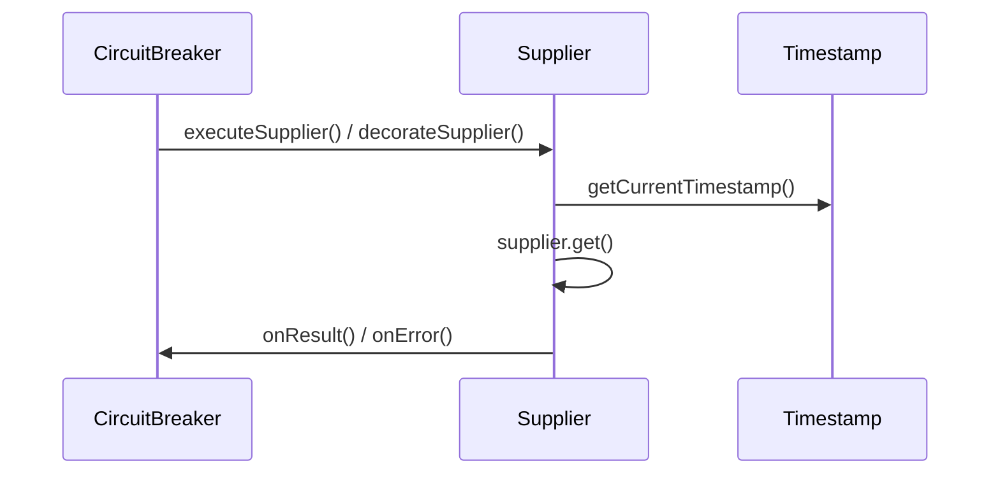

# Circuit Breakers

Relevant source files

The following files were used as context for generating this wiki page:

- [resilience4j-circuitbreaker/src/main/java/io/github/resilience4j/circuitbreaker/internal/CircuitBreakerStateMachine.java](https://github.com/resilience4j/resilience4j/blob/main/resilience4j-circuitbreaker/src/main/java/io/github/resilience4j/circuitbreaker/internal/CircuitBreakerStateMachine.java)
- [resilience4j-framework-common/src/main/java/io/github/resilience4j/common/circuitbreaker/configuration/CommonCircuitBreakerConfigurationProperties.java](https://github.com/resilience4j/resilience4j/blob/main/resilience4j-framework-common/src/main/java/io/github/resilience4j/common/circuitbreaker/configuration/CommonCircuitBreakerConfigurationProperties.java)
- [resilience4j-circuitbreaker/src/main/java/io/github/resilience4j/circuitbreaker/CircuitBreaker.java](https://github.com/resilience4j/resilience4j/blob/main/resilience4j-circuitbreaker/src/main/java/io/github/resilience4j/circuitbreaker/CircuitBreaker.java)
- [resilience4j-circuitbreaker/src/main/java/io/github/resilience4j/circuitbreaker/CircuitBreakerConfig.java](https://github.com/resilience4j/resilience4j/blob/main/resilience4j-circuitbreaker/src/main/java/io/github/resilience4j/circuitbreaker/CircuitBreakerConfig.java)
- [README.adoc](https://github.com/resilience4j/resilience4j/blob/main/README.adoc)
- [resilience4j-spring6/src/main/java/io/github/resilience4j/spring6/circuitbreaker/configure/CircuitBreakerConfiguration.java](https://github.com/resilience4j/resilience4j/blob/main/resilience4j-spring6/src/main/java/io/github/resilience4j/spring6/circuitbreaker/configure/CircuitBreakerConfiguration.java)
- [resilience4j-spring6/src/main/java/io/github/resilience4j/spring6/circuitbreaker/configure/CircuitBreakerAspect.java](https://github.com/resilience4j/resilience4j/blob/main/resilience4j-spring6/src/main/java/io/github/resilience4j/spring6/circuitbreaker/configure/CircuitBreakerAspect.java)
- [resilience4j-circuitbreaker/src/main/java/io/github/resilience4j/circuitbreaker/internal/CircuitBreakerMetrics.java](https://github.com/resilience4j/resilience4j/blob/main/resilience4j-circuitbreaker/src/main/java/io/github/resilience4j/circuitbreaker/internal/CircuitBreakerMetrics.java)
- [resilience4j-spring-boot3/src/main/java/io/github/resilience4j/springboot3/circuitbreaker/monitoring/health/CircuitBreakersHealthIndicator.java](https://github.com/resilience4j/resilience4j/blob/main/resilience4j-spring-boot3/src/main/java/io/github/resilience4j/springboot3/circuitbreaker/monitoring/health/CircuitBreakersHealthIndicator.java)
- [resilience4j-vavr/src/main/java/io/github/resilience4j/circuitbreaker/VavrCircuitBreaker.java](https://github.com/resilience4j/resilience4j/blob/main/resilience4j-vavr/src/main/java/io/github/resilience4j/circuitbreaker/VavrCircuitBreaker.java)

## Overview

The Resilience4j Circuit Breaker module provides robust fault tolerance and failure management for distributed Java applications through a low-overhead, thread-safe finite state machine. By tracking execution outcomes via sliding windows and configurable thresholds, it prevents cascading failures, allows failing downstream services to recover gracefully, and short-circuits calls when error rates spike.

Sources: [resilience4j-circuitbreaker/src/main/java/io/github/resilience4j/circuitbreaker/internal/CircuitBreakerStateMachine.java#L54-L57](https://github.com/resilience4j/resilience4j/blob/main/resilience4j-circuitbreaker/src/main/java/io/github/resilience4j/circuitbreaker/internal/CircuitBreakerStateMachine.java#L54-L57), [resilience4j-circuitbreaker/src/main/java/io/github/resilience4j/circuitbreaker/CircuitBreaker.java#L37-L55](https://github.com/resilience4j/resilience4j/blob/main/resilience4j-circuitbreaker/src/main/java/io/github/resilience4j/circuitbreaker/CircuitBreaker.java#L37-L55)

## Public API and Functional Decorators

### Overview

The `CircuitBreaker` interface defines a comprehensive public API and a rich suite of static and default methods designed to decorate standard Java functional interfaces as well as Vavr functional constructs. These decorators intercept execution calls, manage permission acquisition through `tryAcquirePermission()` and `acquirePermission()`, record execution durations via `getCurrentTimestamp()`, and report outcomes to the underlying metrics engine using `onSuccess()`, `onError()`, or `onResult()`.

Sources: [resilience4j-circuitbreaker/src/main/java/io/github/resilience4j/circuitbreaker/CircuitBreaker.java#L56-L502](https://github.com/resilience4j/resilience4j/blob/main/resilience4j-circuitbreaker/src/main/java/io/github/resilience4j/circuitbreaker/CircuitBreaker.java#L56-L502)

### Functional Decorators and Execution Walkthroughs

CircuitBreaker provides multiple decorators for wrapping lambdas, suppliers, runnables, callables, consumers, and asynchronous completion stages. When executing a supplier via `executeSupplier`, the call traverses a precise execution sequence.

1. `executeSupplier` invokes `decorateSupplier` to wrap the original lambda.
2. `get` on the returned supplier acquires a permission via `circuitBreaker.acquirePermission()`.
3. `getCurrentTimestamp()` captures the start time before invoking `supplier.get()`.
4. `onResult()` or `onError()` records the duration and outcome using `getTimestampUnit()`.

Sources: [resilience4j-circuitbreaker/src/main/java/io/github/resilience4j/circuitbreaker/CircuitBreaker.java#L189-L205](https://github.com/resilience4j/resilience4j/blob/main/resilience4j-circuitbreaker/src/main/java/io/github/resilience4j/circuitbreaker/CircuitBreaker.java#L189-L205), [resilience4j-circuitbreaker/src/main/java/io/github/resilience4j/circuitbreaker/CircuitBreaker.java#L644-L652](https://github.com/resilience4j/resilience4j/blob/main/resilience4j-circuitbreaker/src/main/java/io/github/resilience4j/circuitbreaker/CircuitBreaker.java#L644-L652)

> [!NOTE]
> Decorators for `CompletionStage` and `Future` utilize `tryAcquirePermission()` instead of `acquirePermission()`, completing the returned promise exceptionally with a `CallNotPermittedException` if the breaker is open.

Sources: [resilience4j-circuitbreaker/src/main/java/io/github/resilience4j/circuitbreaker/CircuitBreaker.java#L92-L129](https://github.com/resilience4j/resilience4j/blob/main/resilience4j-circuitbreaker/src/main/java/io/github/resilience4j/circuitbreaker/CircuitBreaker.java#L92-L129), [resilience4j-circuitbreaker/src/main/java/io/github/resilience4j/circuitbreaker/CircuitBreaker.java#L412-L431](https://github.com/resilience4j/resilience4j/blob/main/resilience4j-circuitbreaker/src/main/java/io/github/resilience4j/circuitbreaker/CircuitBreaker.java#L412-L431)

### State Machine Enumeration

The `CircuitBreaker.State` enum defines the core operating modes of the state machine, each with a fixed order and publish permission flag.

| State Name | Order | Allow Publish | Description |
| :--- | :--- | :--- | :--- |
| `DISABLED` | 3 | `false` | Breaker is non-operating, allowing all requests through without state transitions or events. |
| `METRICS_ONLY` | 5 | `true` | Collecting metrics and publishing events while allowing all requests through. |
| `CLOSED` | 0 | `true` | Normal operating state allowing requests through. |
| `OPEN` | 1 | `true` | Tripped state rejecting all requests. |
| `FORCED_OPEN` | 4 | `false` | Manually forced open state rejecting all requests without events. |
| `HALF_OPEN` | 2 | `true` | Testing state allowing a limited number of test calls after wait duration elapses. |

Sources: [resilience4j-circuitbreaker/src/main/java/io/github/resilience4j/circuitbreaker/CircuitBreaker.java#L810-L861](https://github.com/resilience4j/resilience4j/blob/main/resilience4j-circuitbreaker/src/main/java/io/github/resilience4j/circuitbreaker/CircuitBreaker.java#L810-L861)

### Design Trade-Offs

| Design Choice | Benefit | Cost |
| :--- | :--- | :--- |
| **Fixed State Order Constants** (`State` enum `order` field) | Preserves logical state ordering even if enum constants are reordered or added. | Requires manual maintenance of integer mapping values. |
| **OnceConsumer Wrapping in Futures** (`CircuitBreakerFuture`) | Ensures permissions and metrics are recorded exactly once per async invocation. | Additional object allocation overhead per future wrapper. |
| **Default Interface Methods for Decorators** | Minimizes boilerplate when wrapping suppliers, callables, and runnables. | Blurs boundary between interface contracts and default utility implementations. |

Sources: [resilience4j-circuitbreaker/src/main/java/io/github/resilience4j/circuitbreaker/CircuitBreaker.java#L644-L805](https://github.com/resilience4j/resilience4j/blob/main/resilience4j-circuitbreaker/src/main/java/io/github/resilience4j/circuitbreaker/CircuitBreaker.java#L644-L805), [resilience4j-circuitbreaker/src/main/java/io/github/resilience4j/circuitbreaker/CircuitBreaker.java#L840-L861](https://github.com/resilience4j/resilience4j/blob/main/resilience4j-circuitbreaker/src/main/java/io/github/resilience4j/circuitbreaker/CircuitBreaker.java#L840-L861), [resilience4j-circuitbreaker/src/main/java/io/github/resilience4j/circuitbreaker/CircuitBreaker.java#L1047-L1117](https://github.com/resilience4j/resilience4j/blob/main/resilience4j-circuitbreaker/src/main/java/io/github/resilience4j/circuitbreaker/CircuitBreaker.java#L1047-L1117)

## State Machine and Transition Mechanics

### Overview

Managing state transitions in Resilience4j is orchestrated by `CircuitBreakerStateMachine`, which delegates execution behavior to active `CircuitBreakerState` implementations via an `AtomicReference<CircuitBreakerState>`. State transitions are governed by metrics thresholds, configured wait durations, or manual interventions, utilizing atomic compare-and-set loops and reentrant locking to ensure thread safety across asynchronous calls.

Sources: [resilience4j-circuitbreaker/src/main/java/io/github/resilience4j/circuitbreaker/internal/CircuitBreakerStateMachine.java#L62-L70](https://github.com/resilience4j/resilience4j/blob/main/resilience4j-circuitbreaker/src/main/java/io/github/resilience4j/circuitbreaker/internal/CircuitBreakerStateMachine.java#L62-L70), [resilience4j-circuitbreaker/src/main/java/io/github/resilience4j/circuitbreaker/internal/CircuitBreakerStateMachine.java#L328-L337](https://github.com/resilience4j/resilience4j/blob/main/resilience4j-circuitbreaker/src/main/java/io/github/resilience4j/circuitbreaker/internal/CircuitBreakerStateMachine.java#L328-L337)

### State Transition Execution Walkthrough

When an exception or recorded result reaches the state machine, it follows a strict execution path through state evaluation and atomic updates:
1. `CircuitBreakerStateMachine.onError()` or `onResult()` receives the execution outcome.
2. `handleThrowable()` evaluates user-defined record and ignore predicates using `evaluatePredicate()`, ensuring that if a predicate throws an exception, `releasePermission()` is called to prevent permit leaks.
3. `stateReference.get().onError()` or `onSuccess()` updates the underlying `CircuitBreakerMetrics` and checks if thresholds are exceeded.
4. `checkIfThresholdsExceeded()` evaluates the `Result` enum (`BELOW_THRESHOLDS`, `EXCEEDED_FAILURE_RATE`, etc.); if thresholds are breached, `isClosed.compareAndSet(true, false)` (or `isHalfOpen.compareAndSet(true, false)`) atomically claims the transition.
5. `transitionToOpenState()` invokes `stateTransition()`, which executes `stateReference.getAndUpdate()`, runs `preTransitionHook()` on the outgoing state to cancel pending scheduled futures, updates the state reference, and publishes a `CircuitBreakerOnStateTransitionEvent`.

Sources: [resilience4j-circuitbreaker/src/main/java/io/github/resilience4j/circuitbreaker/internal/CircuitBreakerStateMachine.java#L195-L267](https://github.com/resilience4j/resilience4j/blob/main/resilience4j-circuitbreaker/src/main/java/io/github/resilience4j/circuitbreaker/internal/CircuitBreakerStateMachine.java#L195-L267), [resilience4j-circuitbreaker/src/main/java/io/github/resilience4j/circuitbreaker/internal/CircuitBreakerStateMachine.java#L328-L337](https://github.com/resilience4j/resilience4j/blob/main/resilience4j-circuitbreaker/src/main/java/io/github/resilience4j/circuitbreaker/internal/CircuitBreakerStateMachine.java#L328-L337), [resilience4j-circuitbreaker/src/main/java/io/github/resilience4j/circuitbreaker/internal/CircuitBreakerStateMachine.java#L663-L668](https://github.com/resilience4j/resilience4j/blob/main/resilience4j-circuitbreaker/src/main/java/io/github/resilience4j/circuitbreaker/internal/CircuitBreakerStateMachine.java#L663-L668), [resilience4j-circuitbreaker/src/main/java/io/github/resilience4j/circuitbreaker/internal/CircuitBreakerStateMachine.java#L816-L818](https://github.com/resilience4j/resilience4j/blob/main/resilience4j-circuitbreaker/src/main/java/io/github/resilience4j/circuitbreaker/internal/CircuitBreakerStateMachine.java#L816-L818), [resilience4j-circuitbreaker/src/main/java/io/github/resilience4j/circuitbreaker/internal/CircuitBreakerStateMachine.java#L1135-L1143](https://github.com/resilience4j/resilience4j/blob/main/resilience4j-circuitbreaker/src/main/java/io/github/resilience4j/circuitbreaker/internal/CircuitBreakerStateMachine.java#L1135-L1143)

### Internal State Implementations

| State Class | Default Permission Behavior | Threshold / Transition Trigger |
| :--- | :--- | :--- |
| `ClosedState` | Always permits calls (`tryAcquirePermission` returns `true`). | Transitions to `OPEN` when failure or slow call rates exceed configured thresholds. |
| `OpenState` | Denies calls until `retryAfterWaitDuration` elapses; evaluates clock and auto-transitions to `HALF_OPEN`. | Automatically schedules transition to `HALF_OPEN` via `schedulerFactory` if enabled. |
| `HalfOpenState` | Permits up to `permittedNumberOfCallsInHalfOpenState` test requests using `AtomicInteger`. | Transitions back to `OPEN` if thresholds are exceeded, or to `CLOSED` if results remain below thresholds. |
| `ForcedOpenState` | Always denies calls and increments rejected call metrics. | Does not react to metrics; requires manual transition reset via API. |
| `DisabledState` | Always permits calls without recording metrics or evaluating thresholds. | Terminal control state; ignores all error and success callbacks. |
| `MetricsOnlyState` | Always permits calls while recording sliding window metrics and evaluating thresholds. | Fires threshold exceeded events without rejecting traffic or changing operational state. |

Sources: [resilience4j-circuitbreaker/src/main/java/io/github/resilience4j/circuitbreaker/internal/CircuitBreakerStateMachine.java#L594-L1209](https://github.com/resilience4j/resilience4j/blob/main/resilience4j-circuitbreaker/src/main/java/io/github/resilience4j/circuitbreaker/internal/CircuitBreakerStateMachine.java#L594-L1209)

> [!WARNING]
> If a user-supplied record or ignore exception predicate throws an unchecked exception during `evaluatePredicate()`, `releasePermission()` is explicitly invoked before rethrowing the exception. Without this safeguard, an exception escaping the predicate would bypass permission release and wedge the `HALF_OPEN` state counter permanently.

Sources: [resilience4j-circuitbreaker/src/main/java/io/github/resilience4j/circuitbreaker/internal/CircuitBreakerStateMachine.java#L254-L261](https://github.com/resilience4j/resilience4j/blob/main/resilience4j-circuitbreaker/src/main/java/io/github/resilience4j/circuitbreaker/internal/CircuitBreakerStateMachine.java#L254-L261)

> [!TIP]
> In `OpenState.tryAcquirePermission()`, when the clock's current instant passes `retryAfterWaitDuration`, the breaker executes `toHalfOpenState()` under a `ReentrantLock` and immediately delegates to the newly instantiated `HalfOpenState` to determine if the test request is permitted.

Sources: [resilience4j-circuitbreaker/src/main/java/io/github/resilience4j/circuitbreaker/internal/CircuitBreakerStateMachine.java#L740-L755](https://github.com/resilience4j/resilience4j/blob/main/resilience4j-circuitbreaker/src/main/java/io/github/resilience4j/circuitbreaker/internal/CircuitBreakerStateMachine.java#L740-L755), [resilience4j-circuitbreaker/src/main/java/io/github/resilience4j/circuitbreaker/internal/CircuitBreakerStateMachine.java#L821-L830](https://github.com/resilience4j/resilience4j/blob/main/resilience4j-circuitbreaker/src/main/java/io/github/resilience4j/circuitbreaker/internal/CircuitBreakerStateMachine.java#L821-L830)

### Design Trade-Offs in State Management

| Design Choice | Benefit | Cost |
| :--- | :--- | :--- |
| **Polymorphic State Objects** (`CircuitBreakerState` interface implementations) | Eliminates conditional switch-case logic inside call permission checks and metrics recording. | Increases class count and object allocation overhead upon every state transition. |
| **AtomicReference State Swapping** (`stateReference.getAndUpdate()`) | Thread-safe lock-free state reads and atomic transitions under concurrent execution. | Potential contention under heavy multi-threaded workloads during frequent state flapping. |
| **Explicit Pre-Transition Hooks** (`preTransitionHook()`) | Ensures scheduled background transition futures are safely canceled before state object replacement. | Requires state implementations to coordinate manual cleanup of scheduler handles. |

Sources: [resilience4j-circuitbreaker/src/main/java/io/github/resilience4j/circuitbreaker/internal/CircuitBreakerStateMachine.java#L62-L70](https://github.com/resilience4j/resilience4j/blob/main/resilience4j-circuitbreaker/src/main/java/io/github/resilience4j/circuitbreaker/internal/CircuitBreakerStateMachine.java#L62-L70), [resilience4j-circuitbreaker/src/main/java/io/github/resilience4j/circuitbreaker/internal/CircuitBreakerStateMachine.java#L328-L337](https://github.com/resilience4j/resilience4j/blob/main/resilience4j-circuitbreaker/src/main/java/io/github/resilience4j/circuitbreaker/internal/CircuitBreakerStateMachine.java#L328-L337), [resilience4j-circuitbreaker/src/main/java/io/github/resilience4j/circuitbreaker/internal/CircuitBreakerStateMachine.java#L483-L518](https://github.com/resilience4j/resilience4j/blob/main/resilience4j-circuitbreaker/src/main/java/io/github/resilience4j/circuitbreaker/internal/CircuitBreakerStateMachine.java#L483-L518), [resilience4j-circuitbreaker/src/main/java/io/github/resilience4j/circuitbreaker/internal/CircuitBreakerStateMachine.java#L816-L818](https://github.com/resilience4j/resilience4j/blob/main/resilience4j-circuitbreaker/src/main/java/io/github/resilience4j/circuitbreaker/internal/CircuitBreakerStateMachine.java#L816-L818)

## Sliding Window Metrics and Thresholds

### Overview

Sliding window metrics track incoming call outcomes and execution durations to calculate failure rates and slow call rates. The `CircuitBreakerMetrics` class manages underlying storage via count-based or time-based metrics builders, supporting both synchronized and lock-free sliding window implementations.

Sources: [resilience4j-circuitbreaker/src/main/java/io/github/resilience4j/circuitbreaker/internal/CircuitBreakerMetrics.java#L33-L59](https://github.com/resilience4j/resilience4j/blob/main/resilience4j-circuitbreaker/src/main/java/io/github/resilience4j/circuitbreaker/internal/CircuitBreakerMetrics.java#L33-L59)

### Call-Chain Execution Walkthrough

When a call completes successfully or throws an error, execution flows through the metrics subsystem to record outcomes and evaluate thresholds. The call-chain order for a successful call is:
`onSuccess()` → compares duration against `slowCallDurationThresholdInNanos` → `metrics.record()` with either `Outcome.SUCCESS` or `Outcome.SLOW_SUCCESS` → `checkIfThresholdsExceeded()` → `getFailureRate()` and `getSlowCallRate()` using `snapshot`.

Sources: [resilience4j-circuitbreaker/src/main/java/io/github/resilience4j/circuitbreaker/internal/CircuitBreakerMetrics.java#L109-L117](https://github.com/resilience4j/resilience4j/blob/main/resilience4j-circuitbreaker/src/main/java/io/github/resilience4j/circuitbreaker/internal/CircuitBreakerMetrics.java#L109-L117), [resilience4j-circuitbreaker/src/main/java/io/github/resilience4j/circuitbreaker/internal/CircuitBreakerMetrics.java#L141-L176](https://github.com/resilience4j/resilience4j/blob/main/resilience4j-circuitbreaker/src/main/java/io/github/resilience4j/circuitbreaker/internal/CircuitBreakerMetrics.java#L141-L176)

For a failed call, the execution path is identical except for the initial method:
`onError()` → compares duration against `slowCallDurationThresholdInNanos` → `metrics.record()` with either `Outcome.ERROR` or `Outcome.SLOW_ERROR` → `checkIfThresholdsExceeded()` → `getFailureRate()` and `getSlowCallRate()` using `snapshot`.

Sources: [resilience4j-circuitbreaker/src/main/java/io/github/resilience4j/circuitbreaker/internal/CircuitBreakerMetrics.java#L124-L132](https://github.com/resilience4j/resilience4j/blob/main/resilience4j-circuitbreaker/src/main/java/io/github/resilience4j/circuitbreaker/internal/CircuitBreakerMetrics.java#L124-L132), [resilience4j-circuitbreaker/src/main/java/io/github/resilience4j/circuitbreaker/internal/CircuitBreakerMetrics.java#L141-L176](https://github.com/resilience4j/resilience4j/blob/main/resilience4j-circuitbreaker/src/main/java/io/github/resilience4j/circuitbreaker/internal/CircuitBreakerMetrics.java#L141-L176)

> [!WARNING]
> If the total number of buffered calls in a snapshot is zero or falls below `minimumNumberOfCalls`, both `getFailureRate()` and `getSlowCallRate()` return `-1.0f`. This short-circuits threshold evaluation and returns `Result.BELOW_MINIMUM_CALLS_THRESHOLD` to prevent premature state transitions from sparse data.

Sources: [resilience4j-circuitbreaker/src/main/java/io/github/resilience4j/circuitbreaker/internal/CircuitBreakerMetrics.java#L145-L147](https://github.com/resilience4j/resilience4j/blob/main/resilience4j-circuitbreaker/src/main/java/io/github/resilience4j/circuitbreaker/internal/CircuitBreakerMetrics.java#L145-L147), [resilience4j-circuitbreaker/src/main/java/io/github/resilience4j/circuitbreaker/internal/CircuitBreakerMetrics.java#L162-L176](https://github.com/resilience4j/resilience4j/blob/main/resilience4j-circuitbreaker/src/main/java/io/github/resilience4j/circuitbreaker/internal/CircuitBreakerMetrics.java#L162-L176)

### Threshold Evaluation Results

The `CircuitBreakerMetrics.Result` enum defines the distinct evaluation states returned after recording call outcomes.

| Result Constant | Condition | Meaning |
| :--- | :--- | :--- |
| `BELOW_THRESHOLDS` | Failure rate and slow call rate are below configured thresholds. | Call rates are healthy; no threshold violations occurred. |
| `FAILURE_RATE_ABOVE_THRESHOLDS` | Failure rate $\ge$ `failureRateThreshold` (slow call rate is below its threshold). | Failure rate limit exceeded. |
| `SLOW_CALL_RATE_ABOVE_THRESHOLDS` | Slow call rate $\ge$ `slowCallRateThreshold` (failure rate is below its threshold). | Slow call rate limit exceeded. |
| `ABOVE_THRESHOLDS` | Both failure rate and slow call rate exceed their respective thresholds. | Both limits violated simultaneously. |
| `BELOW_MINIMUM_CALLS_THRESHOLD` | Total buffered calls < `minimumNumberOfCalls`. | Insufficient sample size to evaluate rates. |

Sources: [resilience4j-circuitbreaker/src/main/java/io/github/resilience4j/circuitbreaker/internal/CircuitBreakerMetrics.java#L148-L160](https://github.com/resilience4j/resilience4j/blob/main/resilience4j-circuitbreaker/src/main/java/io/github/resilience4j/circuitbreaker/internal/CircuitBreakerMetrics.java#L148-L160), [resilience4j-circuitbreaker/src/main/java/io/github/resilience4j/circuitbreaker/internal/CircuitBreakerMetrics.java#L260-L265](https://github.com/resilience4j/resilience4j/blob/main/resilience4j-circuitbreaker/src/main/java/io/github/resilience4j/circuitbreaker/internal/CircuitBreakerMetrics.java#L260-L265)

### Sliding Window Strategy and Builder Methods

`CircuitBreakerMetrics` instantiates underlying metric structures based on sliding window type and synchronization strategy. Count-based windows select between `FixedSizeSlidingWindowMetrics` and `LockFreeFixedSizeSlidingWindowMetrics`, while time-based windows choose between `SlidingTimeWindowMetrics` and `LockFreeSlidingTimeWindowMetrics`.

Sources: [resilience4j-circuitbreaker/src/main/java/io/github/resilience4j/circuitbreaker/internal/CircuitBreakerMetrics.java#L45-L59](https://github.com/resilience4j/resilience4j/blob/main/resilience4j-circuitbreaker/src/main/java/io/github/resilience4j/circuitbreaker/internal/CircuitBreakerMetrics.java#L45-L59), [resilience4j-circuitbreaker/src/main/java/io/github/resilience4j/circuitbreaker/internal/CircuitBreakerMetrics.java#L178-L199](https://github.com/resilience4j/resilience4j/blob/main/resilience4j-circuitbreaker/src/main/java/io/github/resilience4j/circuitbreaker/internal/CircuitBreakerMetrics.java#L178-L199)

## Customizing Circuit Breaker Properties

### Overview

Circuit breaker configurations are managed via `CircuitBreakerConfig` and its inner `Builder`, allowing fine-grained control over failure thresholds, wait intervals, sliding window algorithms, and exception management. Framework integrations also utilize `CommonCircuitBreakerConfigurationProperties` to bind properties from configuration files.

Sources: [resilience4j-circuitbreaker/src/main/java/io/github/resilience4j/circuitbreaker/CircuitBreakerConfig.java#L39-L103](https://github.com/resilience4j/resilience4j/blob/main/resilience4j-circuitbreaker/src/main/java/io/github/resilience4j/circuitbreaker/CircuitBreakerConfig.java#L39-L103), [resilience4j-framework-common/src/main/java/io/github/resilience4j/common/circuitbreaker/configuration/CommonCircuitBreakerConfigurationProperties.java#L304-L842](https://github.com/resilience4j/resilience4j/blob/main/resilience4j-framework-common/src/main/java/io/github/resilience4j/common/circuitbreaker/configuration/CommonCircuitBreakerConfigurationProperties.java#L304-L842)

### Configuring Thresholds and Sliding Windows

The sliding window records outcomes when the circuit breaker is closed. The window type can be configured as either `SlidingWindowType.COUNT_BASED` or `SlidingWindowType.TIME_BASED`. Furthermore, synchronization strategies are dictated by `SlidingWindowSynchronizationStrategy.SYNCHRONIZED` or `SlidingWindowSynchronizationStrategy.LOCK_FREE`.

Sources: [resilience4j-circuitbreaker/src/main/java/io/github/resilience4j/circuitbreaker/CircuitBreakerConfig.java#L224-L246](https://github.com/resilience4j/resilience4j/blob/main/resilience4j-circuitbreaker/src/main/java/io/github/resilience4j/circuitbreaker/CircuitBreakerConfig.java#L224-L246), [resilience4j-circuitbreaker/src/main/java/io/github/resilience4j/circuitbreaker/CircuitBreakerConfig.java#L663-L689](https://github.com/resilience4j/resilience4j/blob/main/resilience4j-circuitbreaker/src/main/java/io/github/resilience4j/circuitbreaker/CircuitBreakerConfig.java#L663-L689)

> [!WARNING]
> For a time-based sliding window using the `LOCK_FREE` synchronization strategy, the `slidingWindowSize` must be at least 2. Violating this check during builder configuration throws an `IllegalArgumentException`.

Sources: [resilience4j-circuitbreaker/src/main/java/io/github/resilience4j/circuitbreaker/CircuitBreakerConfig.java#L681-L683](https://github.com/resilience4j/resilience4j/blob/main/resilience4j-circuitbreaker/src/main/java/io/github/resilience4j/circuitbreaker/CircuitBreakerConfig.java#L681-L683)

### Configuration Options Reference

| Option | Default Value | Purpose |
| :--- | :--- | :--- |
| `failureRateThreshold` | `50` (percentage) | Percentage threshold of failures required to open the circuit breaker. |
| `slowCallRateThreshold` | `100` (percentage) | Percentage threshold of slow calls required to open the circuit breaker. |
| `slowCallDurationThreshold` | `60` (seconds) | Duration above which a call is categorized as a slow call. |
| `waitDurationInOpenState` | `60` (seconds) | Wait duration the circuit breaker stays open before switching to half-open. |
| `slidingWindowSize` | `100` | Size of the sliding window used to record call outcomes. |
| `minimumNumberOfCalls` | `100` | Minimum calls required per window period before calculating error rates. |
| `slidingWindowType` | `SlidingWindowType.COUNT_BASED` | Type of sliding window (`COUNT_BASED` or `TIME_BASED`). |
| `slidingWindowSynchronizationStrategy` | `SlidingWindowSynchronizationStrategy.SYNCHRONIZED` | Thread-safety synchronization strategy (`SYNCHRONIZED` or `LOCK_FREE`). |
| `permittedNumberOfCallsInHalfOpenState` | `10` | Permitted number of calls allowed when the circuit breaker is half-open. |

Sources: [resilience4j-circuitbreaker/src/main/java/io/github/resilience4j/circuitbreaker/CircuitBreakerConfig.java#L43-L54](https://github.com/resilience4j/resilience4j/blob/main/resilience4j-circuitbreaker/src/main/java/io/github/resilience4j/circuitbreaker/CircuitBreakerConfig.java#L43-L54)

### Exception Predicates and Precedence

Exception handling can be customized using `recordExceptions(Class[])`, `ignoreExceptions(Class[])`, `recordException(Predicate)`, and `ignoreException(Predicate)`. When evaluating exceptions, `ignoreExceptions` can be given precedence over `recordExceptions` by enabling `ignoreExceptionsPrecedenceEnabled(true)` or calling `enableIgnoreExceptionsPrecedence()`.

Sources: [resilience4j-circuitbreaker/src/main/java/io/github/resilience4j/circuitbreaker/CircuitBreakerConfig.java#L988-L1004](https://github.com/resilience4j/resilience4j/blob/main/resilience4j-circuitbreaker/src/main/java/io/github/resilience4j/circuitbreaker/CircuitBreakerConfig.java#L988-L1004)

> [!TIP]
> When `ignoreExceptionsPrecedenceEnabled` is set to true, `createRecordExceptionPredicate()` explicitly filters out exceptions matching `createIgnoreFailurePredicate()` before testing the base recording predicate.

Sources: [resilience4j-circuitbreaker/src/main/java/io/github/resilience4j/circuitbreaker/CircuitBreakerConfig.java#L1051-L1055](https://github.com/resilience4j/resilience4j/blob/main/resilience4j-circuitbreaker/src/main/java/io/github/resilience4j/circuitbreaker/CircuitBreakerConfig.java#L1051-L1055)

## Spring Integration and AOP Aspects

### Overview

Spring integration provides automatic configuration and AOP-based method interception for resilience4j-circuitbreaker. The `CircuitBreakerConfiguration` class sets up foundational beans including the `CircuitBreakerRegistry`, composite customizers, event consumer registries, and conditional AOP aspect extensions for Reactor, RxJava2, and RxJava3.

Sources: [resilience4j-spring6/src/main/java/io/github/resilience4j/spring6/circuitbreaker/configure/CircuitBreakerConfiguration.java#L51-L121](https://github.com/resilience4j/resilience4j/blob/main/resilience4j-spring6/src/main/java/io/github/resilience4j/spring6/circuitbreaker/configure/CircuitBreakerConfiguration.java#L51-L121)

### AOP Interception and Invocation Walkthrough

The `CircuitBreakerAspect` intercepts methods annotated with `@CircuitBreaker` using an `@Around` advice matching `matchAnnotatedClassOrMethod`. When a method is invoked, execution flows through a precise resolution and execution chain:

`circuitBreakerAroundAdvice()` → resolves backend name via `SpelResolver#resolve()` → resolves configuration key (`backend` or explicit configuration) → `getOrCreateCircuitBreaker()` → `proceed()` → checks registered `CircuitBreakerAspectExt` extensions via `canHandleReturnType()` and `handle()` → if a `CompletionStage` return type is detected, dispatches to `handleJoinPointCompletableFuture()` calling `circuitBreaker.executeCompletionStage()` → otherwise defaults to `defaultHandling()` executing `circuitBreaker.executeCheckedSupplier()` wrapped by `FallbackExecutor`.

Sources: [resilience4j-spring6/src/main/java/io/github/resilience4j/spring6/circuitbreaker/configure/CircuitBreakerAspect.java#L94-L182](https://github.com/resilience4j/resilience4j/blob/main/resilience4j-spring6/src/main/java/io/github/resilience4j/spring6/circuitbreaker/configure/CircuitBreakerAspect.java#L94-L182)

> [!NOTE]
> If the `@CircuitBreaker` annotation is placed on an interface acting as a proxy, `getCircuitBreakerAnnotation()` falls back to `AnnotationExtractor.extractAnnotationFromProxy()` to retrieve the annotation metadata from the target proxy.

Sources: [resilience4j-spring6/src/main/java/io/github/resilience4j/spring6/circuitbreaker/configure/CircuitBreakerAspect.java#L147-L160](https://github.com/resilience4j/resilience4j/blob/main/resilience4j-spring6/src/main/java/io/github/resilience4j/spring6/circuitbreaker/configure/CircuitBreakerAspect.java#L147-L160)

### Configuration and Aspect Components

| Component / Bean | Return Type / Class | Condition / Qualifier | Purpose |
| :--- | :--- | :--- | :--- |
| `compositeCircuitBreakerCustomizer` | `CompositeCustomizer<CircuitBreakerConfigCustomizer>` | `@Qualifier("compositeCircuitBreakerCustomizer")` | Manages customizers for circuit breaker instances and configurations. |
| `circuitBreakerRegistry` | `CircuitBreakerRegistry` | Primary registry bean | Creates, registers, and initializes circuit breaker instances and registry event consumers. |
| `circuitBreakerRegistryEventConsumer` | `RegistryEventConsumer<CircuitBreaker>` | `@Primary` | Aggregates optional registry event consumers into a composite consumer. |
| `circuitBreakerAspect` | `CircuitBreakerAspect` | `@Conditional(AspectJOnClasspathCondition.class)` | Intercepts annotated methods to apply circuit breaker logic. |
| `rxJava2CircuitBreakerAspect` | `RxJava2CircuitBreakerAspectExt` | `@Conditional({RxJava2OnClasspathCondition.class, AspectJOnClasspathCondition.class})` | Handles RxJava2 reactive return types. |
| `rxJava3CircuitBreakerAspect` | `RxJava3CircuitBreakerAspectExt` | `@Conditional({RxJava3OnClasspathCondition.class, AspectJOnClasspathCondition.class})` | Handles RxJava3 reactive return types. |
| `reactorCircuitBreakerAspect` | `ReactorCircuitBreakerAspectExt` | `@Conditional({ReactorOnClasspathCondition.class, AspectJOnClasspathCondition.class})` | Handles Spring Reactor reactive return types. |
| `eventConsumerRegistry` | `EventConsumerRegistry<CircuitBreakerEvent>` | Default implementation | Manages event consumer buffers for health indicators and event listeners. |

Sources: [resilience4j-spring6/src/main/java/io/github/resilience4j/spring6/circuitbreaker/configure/CircuitBreakerConfiguration.java#L62-L132](https://github.com/resilience4j/resilience4j/blob/main/resilience4j-spring6/src/main/java/io/github/resilience4j/spring6/circuitbreaker/configure/CircuitBreakerConfiguration.java#L62-L132)

## Health Indicators and Health Monitoring

### Overview

`CircuitBreakersHealthIndicator` implements Spring Boot's `HealthIndicator` interface to expose circuit breaker states, execution metrics, and thresholds to Actuator health endpoints.

Sources: [resilience4j-spring-boot3/src/main/java/io/github/resilience4j/springboot3/circuitbreaker/monitoring/health/CircuitBreakersHealthIndicator.java#L37-L37](https://github.com/resilience4j/resilience4j/blob/main/resilience4j-spring-boot3/src/main/java/io/github/resilience4j/springboot3/circuitbreaker/monitoring/health/CircuitBreakersHealthIndicator.java#L37-L37)

### Health Indicator Execution Walkthrough

When an Actuator health check runs, execution flows through a precise aggregation and mapping sequence:

`health()` → `circuitBreakerRegistry.getAllCircuitBreakers()` → filters each instance using `isRegisterHealthIndicator()` → maps each active circuit breaker via `mapBackendMonitorState()` → evaluates `circuitBreaker.getState()` → branches to `CLOSED`, `OPEN`, `HALF_OPEN`, or `UNKNOWN` → calls `addDetails()` to populate metric and configuration details → aggregates individual health statuses using `statusAggregator.getAggregateStatus()` → builds the final composite `Health` response.

Sources: [resilience4j-spring-boot3/src/main/java/io/github/resilience4j/springboot3/circuitbreaker/monitoring/health/CircuitBreakersHealthIndicator.java#L106-L115](https://github.com/resilience4j/resilience4j/blob/main/resilience4j-spring-boot3/src/main/java/io/github/resilience4j/springboot3/circuitbreaker/monitoring/health/CircuitBreakersHealthIndicator.java#L106-L115)

> [!NOTE]
> If a circuit breaker is in the `OPEN` state, `mapBackendMonitorState()` checks `allowHealthIndicatorToFail()`. If enabled via instance properties, it marks the health builder as `Health.down()`; otherwise, it reports a custom status of `CIRCUIT_OPEN`.

Sources: [resilience4j-spring-boot3/src/main/java/io/github/resilience4j/springboot3/circuitbreaker/monitoring/health/CircuitBreakersHealthIndicator.java#L89-L92](https://github.com/resilience4j/resilience4j/blob/main/resilience4j-spring-boot3/src/main/java/io/github/resilience4j/springboot3/circuitbreaker/monitoring/health/CircuitBreakersHealthIndicator.java#L89-L92)

### Exposed Health Detail Metrics

| Detail Key Constant | Metric or Configuration Source | Description |
| :--- | :--- | :--- |
| `failureRate` | `metrics.getFailureRate() + "%"` | Percentage of failed calls recorded in the current sliding window. |
| `failureRateThreshold` | `config.getFailureRateThreshold() + "%"` | Configured failure rate threshold percentage required to trip the breaker. |
| `slowCallRate` | `metrics.getSlowCallRate() + "%"` | Percentage of slow calls recorded in the current sliding window. |
| `slowCallRateThreshold` | `config.getSlowCallRateThreshold() + "%"` | Configured slow call rate threshold percentage required to trip the breaker. |
| `bufferedCalls` | `metrics.getNumberOfBufferedCalls()` | Total number of calls currently buffered in the sliding window. |
| `failedCalls` | `metrics.getNumberOfFailedCalls()` | Total number of failed calls currently recorded. |
| `slowCalls` | `metrics.getNumberOfSlowCalls()` | Total number of slow calls currently recorded. |
| `slowFailedCalls` | `metrics.getNumberOfSlowFailedCalls()` | Total number of calls that were both slow and failed. |
| `notPermittedCalls` | `metrics.getNumberOfNotPermittedCalls()` | Total number of calls rejected because the circuit breaker was open. |
| `state` | `circuitBreaker.getState()` | Current operational state (`CLOSED`, `OPEN`, `HALF_OPEN`, `FORCED_OPEN`, `DISABLED`, `METRICS_ONLY`). |

Sources: [resilience4j-spring-boot3/src/main/java/io/github/resilience4j/springboot3/circuitbreaker/monitoring/health/CircuitBreakersHealthIndicator.java#L39-L76](https://github.com/resilience4j/resilience4j/blob/main/resilience4j-spring-boot3/src/main/java/io/github/resilience4j/springboot3/circuitbreaker/monitoring/health/CircuitBreakersHealthIndicator.java#L39-L76)

## Related

- [[Circuit Breaker State Machine]]
- [[Registry Management]]

