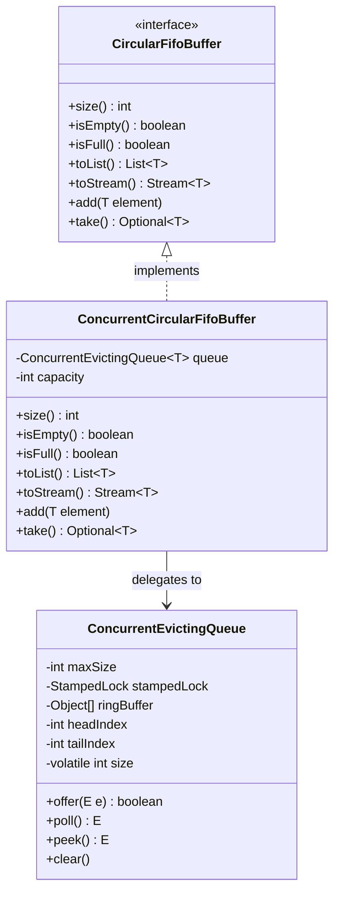
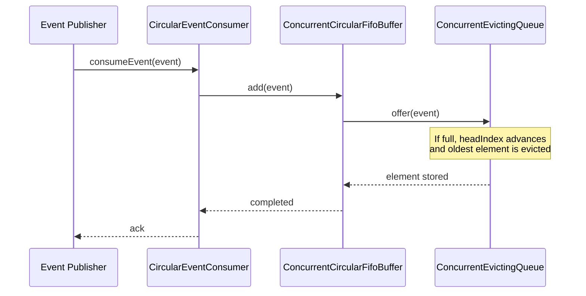
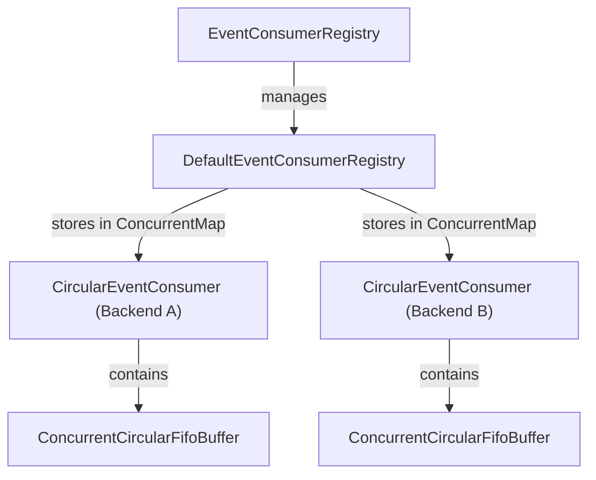

# Circular Buffers

<details>
<summary>Relevant source files</summary>

The following files were used as context for generating this wiki page:

- [resilience4j-circularbuffer/src/main/java/io/github/resilience4j/circularbuffer/ConcurrentEvictingQueue.java](https://github.com/resilience4j/resilience4j/blob/main/resilience4j-circularbuffer/src/main/java/io/github/resilience4j/circularbuffer/ConcurrentEvictingQueue.java)
- [resilience4j-core/src/main/java/io/github/resilience4j/core/metrics/LockFreeSlidingTimeWindowMetrics.java](https://github.com/resilience4j/resilience4j/blob/main/resilience4j-core/src/main/java/io/github/resilience4j/core/metrics/LockFreeSlidingTimeWindowMetrics.java)
- [resilience4j-spring6/src/main/java/io/github/resilience4j/spring6/timelimiter/configure/TimeLimiterConfiguration.java](https://github.com/resilience4j/resilience4j/blob/main/resilience4j-spring6/src/main/java/io/github/resilience4j/spring6/timelimiter/configure/TimeLimiterConfiguration.java)
- [resilience4j-consumer/src/main/java/io/github/resilience4j/consumer/CircularEventConsumer.java](https://github.com/resilience4j/resilience4j/blob/main/resilience4j-consumer/src/main/java/io/github/resilience4j/consumer/CircularEventConsumer.java)
- [resilience4j-core/src/main/java/io/github/resilience4j/core/metrics/FixedSizeSlidingWindowMetrics.java](https://github.com/resilience4j/resilience4j/blob/main/resilience4j-core/src/main/java/io/github/resilience4j/core/metrics/FixedSizeSlidingWindowMetrics.java)
- [resilience4j-bulkhead/src/main/java/io/github/resilience4j/bulkhead/internal/FixedThreadPoolBulkhead.java](https://github.com/resilience4j/resilience4j/blob/main/resilience4j-bulkhead/src/main/java/io/github/resilience4j/bulkhead/internal/FixedThreadPoolBulkhead.java)
- [resilience4j-core/src/main/java/io/github/resilience4j/core/metrics/LockFreeFixedSizeSlidingWindowMetrics.java](https://github.com/resilience4j/resilience4j/blob/main/resilience4j-core/src/main/java/io/github/resilience4j/core/metrics/LockFreeFixedSizeSlidingWindowMetrics.java)
- [resilience4j-circularbuffer/src/main/java/io/github/resilience4j/circularbuffer/ConcurrentCircularFifoBuffer.java](https://github.com/resilience4j/resilience4j/blob/main/resilience4j-circularbuffer/src/main/java/io/github/resilience4j/circularbuffer/ConcurrentCircularFifoBuffer.java)
- [resilience4j-core/src/main/java/io/github/resilience4j/core/metrics/SlidingTimeWindowMetrics.java](https://github.com/resilience4j/resilience4j/blob/main/resilience4j-core/src/main/java/io/github/resilience4j/core/metrics/SlidingTimeWindowMetrics.java)
- [resilience4j-circularbuffer/src/main/java/io/github/resilience4j/circularbuffer/CircularFifoBuffer.java](https://github.com/resilience4j/resilience4j/blob/main/resilience4j-circularbuffer/src/main/java/io/github/resilience4j/circularbuffer/CircularFifoBuffer.java)
- [resilience4j-consumer/src/main/java/io/github/resilience4j/consumer/DefaultEventConsumerRegistry.java](https://github.com/resilience4j/resilience4j/blob/main/resilience4j-consumer/src/main/java/io/github/resilience4j/consumer/DefaultEventConsumerRegistry.java)
- [resilience4j-circularbuffer/src/jmh/java/io/github/resilience4j/circularbuffer/CircularBufferBenchmark.java](https://github.com/resilience4j/resilience4j/blob/main/resilience4j-circularbuffer/src/jmh/java/io/github/resilience4j/circularbuffer/CircularBufferBenchmark.java)
- [resilience4j-consumer/src/main/java/io/github/resilience4j/consumer/EventConsumerRegistry.java](https://github.com/resilience4j/resilience4j/blob/main/resilience4j-consumer/src/main/java/io/github/resilience4j/consumer/EventConsumerRegistry.java)
- [resilience4j-circuitbreaker/src/main/java/io/github/resilience4j/circuitbreaker/internal/CircuitBreakerMetrics.java](https://github.com/resilience4j/resilience4j/blob/main/resilience4j-circuitbreaker/src/main/java/io/github/resilience4j/circuitbreaker/internal/CircuitBreakerMetrics.java)
- [resilience4j-hedge/src/main/java/io/github/resilience4j/hedge/internal/HedgeImpl.java](https://github.com/resilience4j/resilience4j/blob/main/resilience4j-hedge/src/main/java/io/github/resilience4j/hedge/internal/HedgeImpl.java)
- [resilience4j-ratelimiter/src/main/java/io/github/resilience4j/ratelimiter/internal/RateLimiterEventProcessor.java](https://github.com/resilience4j/resilience4j/blob/main/resilience4j-ratelimiter/src/main/java/io/github/resilience4j/ratelimiter/internal/RateLimiterEventProcessor.java)
- [resilience4j-hedge/src/main/java/io/github/resilience4j/hedge/internal/HedgeEventProcessor.java](https://github.com/resilience4j/resilience4j/blob/main/resilience4j-hedge/src/main/java/io/github/resilience4j/hedge/internal/HedgeEventProcessor.java)
- [resilience4j-circularbuffer/src/jmh/java/io/github/resilience4j/circularbuffer/ConcurrentEvictingQueueBenchmark.java](https://github.com/resilience4j/resilience4j/blob/main/resilience4j-circularbuffer/src/jmh/java/io/github/resilience4j/circularbuffer/ConcurrentEvictingQueueBenchmark.java)
- [resilience4j-hedge/src/main/java/io/github/resilience4j/hedge/internal/AverageDurationSupplier.java](https://github.com/resilience4j/resilience4j/blob/main/resilience4j-hedge/src/main/java/io/github/resilience4j/hedge/internal/AverageDurationSupplier.java)
- [resilience4j-core/src/jmh/java/io/github/resilience4j/core/MetricsBenchmark.java](https://github.com/resilience4j/resilience4j/blob/main/resilience4j-core/src/jmh/java/io/github/resilience4j/core/MetricsBenchmark.java)
- [resilience4j-spring-boot4/src/main/java/io/github/resilience4j/springboot/bulkhead/monitoring/endpoint/BulkheadEventsEndpoint.java](https://github.com/resilience4j/resilience4j/blob/main/resilience4j-spring-boot4/src/main/java/io/github/resilience4j/springboot/bulkhead/monitoring/endpoint/BulkheadEventsEndpoint.java)
- [resilience4j-spring-boot3/src/main/java/io/github/resilience4j/springboot3/bulkhead/monitoring/endpoint/BulkheadEventsEndpoint.java](https://github.com/resilience4j/resilience4j/blob/main/resilience4j-spring-boot3/src/main/java/io/github/resilience4j/springboot3/bulkhead/monitoring/endpoint/BulkheadEventsEndpoint.java)
- [resilience4j-spring-boot4/src/main/java/io/github/resilience4j/springboot/circuitbreaker/monitoring/endpoint/CircuitBreakerEventsEndpoint.java](https://github.com/resilience4j/resilience4j/blob/main/resilience4j-spring-boot4/src/main/java/io/github/resilience4j/springboot/circuitbreaker/monitoring/endpoint/CircuitBreakerEventsEndpoint.java)
- [resilience4j-spring-boot3/src/main/java/io/github/resilience4j/springboot3/circuitbreaker/monitoring/endpoint/CircuitBreakerEventsEndpoint.java](https://github.com/resilience4j/resilience4j/blob/main/resilience4j-spring-boot3/src/main/java/io/github/resilience4j/springboot3/circuitbreaker/monitoring/endpoint/CircuitBreakerEventsEndpoint.java)
- [resilience4j-spring-boot3/src/main/java/io/github/resilience4j/springboot3/ratelimiter/monitoring/endpoint/RateLimiterEventsEndpoint.java](https://github.com/resilience4j/resilience4j/blob/main/resilience4j-spring-boot3/src/main/java/io/github/resilience4j/springboot3/ratelimiter/monitoring/endpoint/RateLimiterEventsEndpoint.java)
- [resilience4j-spring-boot4/src/main/java/io/github/resilience4j/springboot/ratelimiter/monitoring/endpoint/RateLimiterEventsEndpoint.java](https://github.com/resilience4j/resilience4j/blob/main/resilience4j-spring-boot4/src/main/java/io/github/resilience4j/springboot/ratelimiter/monitoring/endpoint/RateLimiterEventsEndpoint.java)
- [resilience4j-core/src/main/java/io/github/resilience4j/core/registry/AbstractRegistry.java](https://github.com/resilience4j/resilience4j/blob/main/resilience4j-core/src/main/java/io/github/resilience4j/core/registry/AbstractRegistry.java)
- [resilience4j-spring-boot3/src/main/java/io/github/resilience4j/springboot3/timelimiter/monitoring/endpoint/TimeLimiterEventsEndpoint.java](https://github.com/resilience4j/resilience4j/blob/main/resilience4j-spring-boot3/src/main/java/io/github/resilience4j/springboot3/timelimiter/monitoring/endpoint/TimeLimiterEventsEndpoint.java)
- [resilience4j-spring-boot4/src/main/java/io/github/resilience4j/springboot/timelimiter/monitoring/endpoint/TimeLimiterEventsEndpoint.java](https://github.com/resilience4j/resilience4j/blob/main/resilience4j-spring-boot4/src/main/java/io/github/resilience4j/springboot/timelimiter/monitoring/endpoint/TimeLimiterEventsEndpoint.java)
- [resilience4j-spring-boot4/src/main/java/io/github/resilience4j/springboot/micrometer/monitoring/endpoint/TimerEventsEndpoint.java](https://github.com/resilience4j/resilience4j/blob/main/resilience4j-spring-boot4/src/main/java/io/github/resilience4j/springboot/micrometer/monitoring/endpoint/TimerEventsEndpoint.java)
</details>

## Overview

Circular buffers in Resilience4j serve as a high-performance, fixed-capacity data structure designed to retain the $N$ most recently recorded runtime events or items without unbounded memory growth. In reactive and fault-tolerant architectures, components like CircuitBreakers, RateLimiters, Bulkheads, and TimeLimiters continuously generate execution events. Storing these events indefinitely would risk OutOfMemoryError exceptions in long-running services, while traditional unbounded collections lack automatic eviction guarantees.

Sources: [resilience4j-circularbuffer/src/main/java/io/github/resilience4j/circularbuffer/ConcurrentEvictingQueue.java:28-32](https://github.com/resilience4j/resilience4j/blob/main/resilience4j-circularbuffer/src/main/java/io/github/resilience4j/circularbuffer/ConcurrentEvictingQueue.java#L28-L32)

To solve this, Resilience4j implements fixed-size circular FIFO buffers backed by array ring structures. When a buffer reaches capacity, incoming items automatically overwrite or evict the oldest elements at the head position. This subsystem bridges low-level thread-safe queue primitives with high-level event consumers and Actuator monitoring endpoints, providing real-time visibility into resilience metrics and operational state transitions.

Sources: [resilience4j-circularbuffer/src/main/java/io/github/resilience4j/circularbuffer/ConcurrentEvictingQueue.java:29-31](https://github.com/resilience4j/resilience4j/blob/main/resilience4j-circularbuffer/src/main/java/io/github/resilience4j/circularbuffer/ConcurrentEvictingQueue.java#L29-L31), [resilience4j-circularbuffer/src/main/java/io/github/resilience4j/circularbuffer/CircularFifoBuffer.java:25-27](https://github.com/resilience4j/resilience4j/blob/main/resilience4j-circularbuffer/src/main/java/io/github/resilience4j/circularbuffer/CircularFifoBuffer.java#L25-L27)

The architecture emphasizes concurrent safety, low allocation overhead, and strict null-safety. Null elements are strictly rejected across all buffer implementations. Depending on the concurrency requirement, buffers wrap lock-free or stamped-lock-protected backing queues, ensuring predictable latency profiles during high-throughput metric collection and event emission.

Sources: [resilience4j-circularbuffer/src/main/java/io/github/resilience4j/circularbuffer/ConcurrentEvictingQueue.java:33-50](https://github.com/resilience4j/resilience4j/blob/main/resilience4j-circularbuffer/src/main/java/io/github/resilience4j/circularbuffer/ConcurrentEvictingQueue.java#L33-L50), [resilience4j-consumer/src/main/java/io/github/resilience4j/consumer/CircularEventConsumer.java:28-31](https://github.com/resilience4j/resilience4j/blob/main/resilience4j-consumer/src/main/java/io/github/resilience4j/consumer/CircularEventConsumer.java#L28-L31)

---

## Core Interfaces and Contract

The circular buffer subsystem exposes its core contract through the `CircularFifoBuffer<T>` interface, which defines standard queue operations tailored for fixed-size, auto-evicting ring storage. Implementations of this interface guarantee that element insertion maintains fixed capacity limits by discarding the oldest entry upon overflow.



Sources: [resilience4j-circularbuffer/src/main/java/io/github/resilience4j/circularbuffer/CircularFifoBuffer.java:29-83](https://github.com/resilience4j/resilience4j/blob/main/resilience4j-circularbuffer/src/main/java/io/github/resilience4j/circularbuffer/CircularFifoBuffer.java#L29-L83), [resilience4j-circularbuffer/src/main/java/io/github/resilience4j/circularbuffer/ConcurrentCircularFifoBuffer.java:25-100](https://github.com/resilience4j/resilience4j/blob/main/resilience4j-circularbuffer/src/main/java/io/github/resilience4j/circularbuffer/ConcurrentCircularFifoBuffer.java#L25-L100)

The interface methods and their operational semantics are detailed below:

| Method Signature | Return Type | Operational Semantics |
| :--- | :--- | :--- |
| `size()` | `int` | Returns the current number of elements currently stored in the buffer. |
| `isEmpty()` | `boolean` | Returns `true` if the buffer contains zero elements. |
| `isFull()` | `boolean` | Returns `true` when `size() == capacity`. |
| `toList()` | `List<T>` | Returns a snapshot list copy of all buffered elements in proper FIFO sequence. |
| `toStream()` | `Stream<T>` | Returns a sequential stream over the buffered elements. |
| `add(T element)` | `void` | Inserts an element, overwriting the oldest entry if the buffer is full. |
| `take()` | `Optional<T>` | Retrieves and removes the head element, or returns `Optional.empty()` if empty. |

Sources: [resilience4j-circularbuffer/src/main/java/io/github/resilience4j/circularbuffer/CircularFifoBuffer.java:30-83](https://github.com/resilience4j/resilience4j/blob/main/resilience4j-circularbuffer/src/main/java/io/github/resilience4j/circularbuffer/CircularFifoBuffer.java#L30-L83)

---

## Thread-Safe Implementation: `ConcurrentEvictingQueue`

Thread safety in the circular buffer storage layer is achieved through `ConcurrentEvictingQueue<E>`, which extends `AbstractQueue<E>` and manages internal array indices (`headIndex`, `tailIndex`) under a `StampedLock`. 

> [!IMPORTANT]
> `ConcurrentEvictingQueue` strictly prohibits `null` elements. Passing a `null` argument to `offer()` immediately throws a `NullPointerException` governed by `requireNonNull(e, ILLEGAL_ELEMENT)`.

Sources: [resilience4j-circularbuffer/src/main/java/io/github/resilience4j/circularbuffer/ConcurrentEvictingQueue.java:51-114](https://github.com/resilience4j/resilience4j/blob/main/resilience4j-circularbuffer/src/main/java/io/github/resilience4j/circularbuffer/ConcurrentEvictingQueue.java#L51-L114)

The concurrency mechanism encapsulates locking into three helper functions that prevent race conditions during concurrent reads and writes:
- `readConcurrently(Supplier)`: Attempts an optimistic read up to 5 times (`RETRIES = 5`). If the validation stamp fails, it falls back to a pessimistic read lock.
- `readConcurrentlyWithoutSpin(Supplier)`: Directly acquires a pessimistic read lock (`stampedLock.readLock()`), used for operations like `toArray()` where iteration safety is paramount.
- `writeConcurrently(Supplier)`: Acquires an exclusive write lock (`stampedLock.writeLock()`) for state-mutating operations such as `offer()`, `poll()`, and `clear()`.

Sources: [resilience4j-circularbuffer/src/main/java/io/github/resilience4j/circularbuffer/ConcurrentEvictingQueue.java:57-78](https://github.com/resilience4j/resilience4j/blob/main/resilience4j-circularbuffer/src/main/java/io/github/resilience4j/circularbuffer/ConcurrentEvictingQueue.java#L57-L78), [resilience4j-circularbuffer/src/main/java/io/github/resilience4j/circularbuffer/ConcurrentEvictingQueue.java:265-308](https://github.com/resilience4j/resilience4j/blob/main/resilience4j-circularbuffer/src/main/java/io/github/resilience4j/circularbuffer/ConcurrentEvictingQueue.java#L265-L308)

---

## Event Consumer Integration

The `CircularEventConsumer<T>` class connects circular buffers to Resilience4j event publishers, implementing the `EventConsumer<T>` interface. Each instance wraps a `ConcurrentCircularFifoBuffer<T>` initialized with a configurable buffer capacity.



Sources: [resilience4j-consumer/src/main/java/io/github/resilience4j/consumer/CircularEventConsumer.java:28-48](https://github.com/resilience4j/resilience4j/blob/main/resilience4j-consumer/src/main/java/io/github/resilience4j/consumer/CircularEventConsumer.java#L28-L48), [resilience4j-circularbuffer/src/main/java/io/github/resilience4j/circularbuffer/ConcurrentCircularFifoBuffer.java:85-91](https://github.com/resilience4j/resilience4j/blob/main/resilience4j-circularbuffer/src/main/java/io/github/resilience4j/circularbuffer/ConcurrentCircularFifoBuffer.java#L85-L91)

When an event occurs in a resilience component (such as a CircuitBreaker state transition or a RateLimiter acquisition), the event is passed to `consumeEvent(T event)`, which delegates to `eventCircularFifoBuffer.add(event)`. Clients can subsequently retrieve buffered events via `getBufferedEvents()` or `getBufferedEventsStream()`.

Sources: [resilience4j-consumer/src/main/java/io/github/resilience4j/consumer/CircularEventConsumer.java:45-66](https://github.com/resilience4j/resilience4j/blob/main/resilience4j-consumer/src/main/java/io/github/resilience4j/consumer/CircularEventConsumer.java#L45-L66)

---

## Registry Management and Configuration

Event consumers backed by circular buffers are managed centrally through implementations of `EventConsumerRegistry<T>`, notably `DefaultEventConsumerRegistry<T>`. This registry maintains a thread-safe mapping of backend identifiers to `CircularEventConsumer` instances using a `ConcurrentHashMap`.



Sources: [resilience4j-consumer/src/main/java/io/github/resilience4j/consumer/DefaultEventConsumerRegistry.java:22-35](https://github.com/resilience4j/resilience4j/blob/main/resilience4j-consumer/src/main/java/io/github/resilience4j/consumer/DefaultEventConsumerRegistry.java#L22-L35), [resilience4j-consumer/src/main/java/io/github/resilience4j/consumer/DefaultEventConsumerRegistry.java:37-56](https://github.com/resilience4j/resilience4j/blob/main/resilience4j-consumer/src/main/java/io/github/resilience4j/consumer/DefaultEventConsumerRegistry.java#L37-L56)

During Spring configuration (e.g., in `TimeLimiterConfiguration`), event consumer buffers are automatically wired when registry entries are added or replaced. If instance-specific properties define an `eventConsumerBufferSize`, that capacity is used; otherwise, a default capacity of `100` is applied.

```java
private static void registerEventConsumer(EventConsumerRegistry<TimeLimiterEvent> eventConsumerRegistry, TimeLimiter timeLimiter,
                                          TimeLimiterConfigurationProperties timeLimiterConfigurationProperties) {
    int eventConsumerBufferSize = Optional.ofNullable(timeLimiterConfigurationProperties.getInstanceProperties(timeLimiter.getName()))
            .map(InstanceProperties::getEventConsumerBufferSize)
            .orElse(100);
    timeLimiter.getEventPublisher().onEvent(
        eventConsumerRegistry.createEventConsumer(timeLimiter.getName(), eventConsumerBufferSize));
}
```

Sources: [resilience4j-spring6/src/main/java/io/github/resilience4j/spring6/timelimiter/configure/TimeLimiterConfiguration.java:191-198](https://github.com/resilience4j/resilience4j/blob/main/resilience4j-spring6/src/main/java/io/github/resilience4j/spring6/timelimiter/configure/TimeLimiterConfiguration.java#L191-L198), [resilience4j-consumer/src/main/java/io/github/resilience4j/consumer/DefaultEventConsumerRegistry.java:37-42](https://github.com/resilience4j/resilience4j/blob/main/resilience4j-consumer/src/main/java/io/github/resilience4j/consumer/DefaultEventConsumerRegistry.java#L37-L42)

---

## Monitoring Endpoints Integration

Spring Boot Actuator endpoints rely on `CircularEventConsumer` buffers to expose historical runtime events over HTTP REST APIs. Endpoints such as `CircuitBreakerEventsEndpoint`, `RateLimiterEventsEndpoint`, `TimeLimiterEventsEndpoint`, `TimerEventsEndpoint`, and `BulkheadEventsEndpoint` query the `EventConsumerRegistry` to fetch buffered events.

```java
@ReadOperation
public CircuitBreakerEventsEndpointResponse getAllCircuitBreakerEvents() {
    return new CircuitBreakerEventsEndpointResponse(eventConsumerRegistry.getAllEventConsumer().stream()
        .flatMap(eventConsumer -> eventConsumer.getBufferedEvents().stream())
        .sorted(Comparator.comparing(CircuitBreakerEvent::getCreationTime))
        .map(CircuitBreakerEventDTOFactory::createCircuitBreakerEventDTO)
        .collect(Collectors.toList()));
}
```

Sources: [resilience4j-spring-boot4/src/main/java/io/github/resilience4j/springboot/circuitbreaker/monitoring/endpoint/CircuitBreakerEventsEndpoint.java:44-51](https://github.com/resilience4j/resilience4j/blob/main/resilience4j-spring-boot4/src/main/java/io/github/resilience4j/springboot/circuitbreaker/monitoring/endpoint/CircuitBreakerEventsEndpoint.java#L44-L51), [resilience4j-spring-boot4/src/main/java/io/github/resilience4j/springboot/bulkhead/monitoring/endpoint/BulkheadEventsEndpoint.java:43-51](https://github.com/resilience4j/resilience4j/blob/main/resilience4j-spring-boot4/src/main/java/io/github/resilience4j/springboot/bulkhead/monitoring/endpoint/BulkheadEventsEndpoint.java#L43-L51)

Supported Actuator event endpoints and their corresponding routing identifiers are summarized below:

| Actuator Endpoint ID | Event Generic Type | Target Source Registry / Consumer |
| :--- | :--- | :--- |
| `circuitbreakerevents` | `CircuitBreakerEvent` | `EventConsumerRegistry<CircuitBreakerEvent>` |
| `ratelimiterevents` | `RateLimiterEvent` | `EventConsumerRegistry<RateLimiterEvent>` |
| `timelimiterevents` | `TimeLimiterEvent` | `EventConsumerRegistry<TimeLimiterEvent>` |
| `timerevents` | `TimerEvent` | `EventConsumerRegistry<TimerEvent>` |
| `bulkheadevents` | `BulkheadEvent` | `EventConsumerRegistry<BulkheadEvent>` |

Sources: [resilience4j-spring-boot4/src/main/java/io/github/resilience4j/springboot/circuitbreaker/monitoring/endpoint/CircuitBreakerEventsEndpoint.java:34-35](https://github.com/resilience4j/resilience4j/blob/main/resilience4j-spring-boot4/src/main/java/io/github/resilience4j/springboot/circuitbreaker/monitoring/endpoint/CircuitBreakerEventsEndpoint.java#L34-L35), [resilience4j-spring-boot4/src/main/java/io/github/resilience4j/springboot/ratelimiter/monitoring/endpoint/RateLimiterEventsEndpoint.java:32-33](https://github.com/resilience4j/resilience4j/blob/main/resilience4j-spring-boot4/src/main/java/io/github/resilience4j/springboot/ratelimiter/monitoring/endpoint/RateLimiterEventsEndpoint.java#L32-L33), [resilience4j-spring-boot4/src/main/java/io/github/resilience4j/springboot/timelimiter/monitoring/endpoint/TimeLimiterEventsEndpoint.java:33-34](https://github.com/resilience4j/resilience4j/blob/main/resilience4j-spring-boot4/src/main/java/io/github/resilience4j/springboot/timelimiter/monitoring/endpoint/TimeLimiterEventsEndpoint.java#L33-L34), [resilience4j-spring-boot4/src/main/java/io/github/resilience4j/springboot/micrometer/monitoring/endpoint/TimerEventsEndpoint.java:35-36](https://github.com/resilience4j/resilience4j/blob/main/resilience4j-spring-boot4/src/main/java/io/github/resilience4j/springboot/micrometer/monitoring/endpoint/TimerEventsEndpoint.java#L35-L36), [resilience4j-spring-boot4/src/main/java/io/github/resilience4j/springboot/bulkhead/monitoring/endpoint/BulkheadEventsEndpoint.java:34-35](https://github.com/resilience4j/resilience4j/blob/main/resilience4j-spring-boot4/src/main/java/io/github/resilience4j/springboot/bulkhead/monitoring/endpoint/BulkheadEventsEndpoint.java#L34-L35)

---

## Performance and Design Trade-offs

JMH benchmarks for circular buffers evaluate average execution time and throughput under concurrent contention. `ConcurrentEvictingQueueBenchmark` and `CircularBufferBenchmark` demonstrate that buffer operations execute in sub-microsecond timeframes.

Sources: [resilience4j-circularbuffer/src/jmh/java/io/github/resilience4j/circularbuffer/ConcurrentEvictingQueueBenchmark.java:34-101](https://github.com/resilience4j/resilience4j/blob/main/resilience4j-circularbuffer/src/jmh/java/io/github/resilience4j/circularbuffer/ConcurrentEvictingQueueBenchmark.java#L34-L101), [resilience4j-circularbuffer/src/jmh/java/io/github/resilience4j/circularbuffer/CircularBufferBenchmark.java:36-103](https://github.com/resilience4j/resilience4j/blob/main/resilience4j-circularbuffer/src/jmh/java/io/github/resilience4j/circularbuffer/CircularBufferBenchmark.java#L36-L103)

| Design Choice | Benefit | Cost |
| :--- | :--- | :--- |
| **Array-backed Ring Buffer** | $O(1)$ constant time insertion and eviction; zero dynamic object allocation during steady-state writes. | Fixed memory footprint allocated upfront based on capacity. |
| **StampedLock Concurrency** | Optimistic reading avoids lock acquisition overhead on read-heavy workloads (e.g., monitoring snapshots). | Write operations acquire exclusive locks, causing serialization under high write contention. |
| **Fail-Fast Iterators** | `ConcurrentModificationException` is thrown if concurrent modifications occur during iteration (`modificationsCount != expectedModificationsCount`). | Iterators do not support concurrent element removal. |

Sources: [resilience4j-circularbuffer/src/main/java/io/github/resilience4j/circularbuffer/ConcurrentEvictingQueue.java:81-91](https://github.com/resilience4j/resilience4j/blob/main/resilience4j-circularbuffer/src/main/java/io/github/resilience4j/circularbuffer/ConcurrentEvictingQueue.java#L81-L91), [resilience4j-circularbuffer/src/main/java/io/github/resilience4j/circularbuffer/ConcurrentEvictingQueue.java:341-345](https://github.com/resilience4j/resilience4j/blob/main/resilience4j-circularbuffer/src/main/java/io/github/resilience4j/circularbuffer/ConcurrentEvictingQueue.java#L341-L345)

---

## Runnable Example

The following standalone Java example demonstrates how to initialize a `CircularEventConsumer`, push events into its internal circular buffer, and query the buffered history:

```java
package io.github.resilience4j.example;

import io.github.resilience4j.consumer.CircularEventConsumer;
import io.github.resilience4j.circuitbreaker.event.CircuitBreakerOnStateTransitionEvent;
import io.github.resilience4j.circuitbreaker.CircuitBreaker;

import java.util.List;

public class CircularBufferDemo {
    public static void main(String[] args) {
        // Create a circular event consumer with a capacity of 3 events
        CircularEventConsumer<CircuitBreakerOnStateTransitionEvent> eventConsumer = 
            new CircularEventConsumer<>(3);

        // Simulate publishing events
        eventConsumer.consumeEvent(new CircuitBreakerOnStateTransitionEvent(
            "testService", CircuitBreaker.StateTransition.CLOSED_TO_OPEN));
        eventConsumer.consumeEvent(new CircuitBreakerOnStateTransitionEvent(
            "testService", CircuitBreaker.StateTransition.OPEN_TO_HALF_OPEN));
        eventConsumer.consumeEvent(new CircuitBreakerOnStateTransitionEvent(
            "testService", CircuitBreaker.StateTransition.HALF_OPEN_TO_CLOSED));

        // Pushing a 4th event will evict the oldest event (CLOSED_TO_OPEN)
        eventConsumer.consumeEvent(new CircuitBreakerOnStateTransitionEvent(
            "testService", CircuitBreaker.StateTransition.CLOSED_TO_FORCED_OPEN));

        // Retrieve buffered events
        List<CircuitBreakerOnStateTransitionEvent> bufferedEvents = eventConsumer.getBufferedEvents();
        
        System.out.println("Buffered event count: " + bufferedEvents.size());
        bufferedEvents.forEach(event -> 
            System.out.println("Event state transition: " + event.getStateTransition())
        );
    }
}
```

Sources: [resilience4j-consumer/src/main/java/io/github/resilience4j/consumer/CircularEventConsumer.java:35-57](https://github.com/resilience4j/resilience4j/blob/main/resilience4j-consumer/src/main/java/io/github/resilience4j/consumer/CircularEventConsumer.java#L35-L57), [resilience4j-consumer/src/main/java/io/github/resilience4j/consumer/CircularEventConsumer.java:45-48](https://github.com/resilience4j/resilience4j/blob/main/resilience4j-consumer/src/main/java/io/github/resilience4j/consumer/CircularEventConsumer.java#L45-L48)

## Related

- [[Sliding Window Metrics]]
- [[Event Consumer Registries]]

