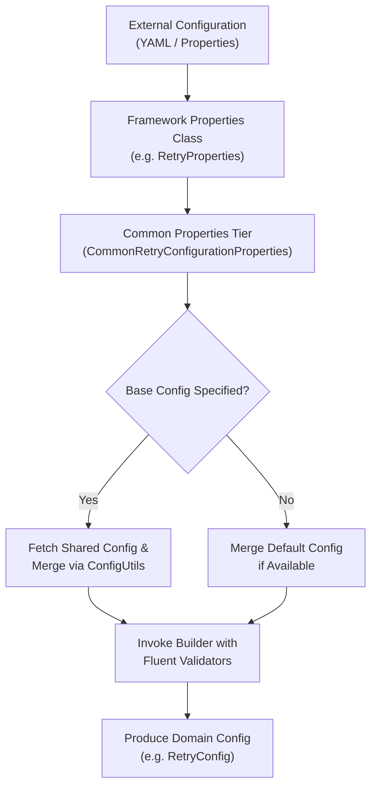
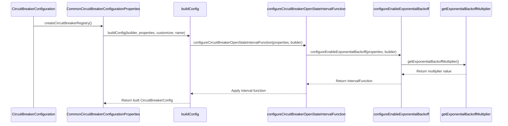

# Common Configuration Properties

<details>
<summary>Relevant source files</summary>

The following files were used as context for generating this wiki page:

- [resilience4j-framework-common/src/main/java/io/github/resilience4j/common/retry/configuration/CommonRetryConfigurationProperties.java](https://github.com/resilience4j/resilience4j/blob/main/resilience4j-framework-common/src/main/java/io/github/resilience4j/common/retry/configuration/CommonRetryConfigurationProperties.java)
- [resilience4j-framework-common/src/main/java/io/github/resilience4j/common/circuitbreaker/configuration/CommonCircuitBreakerConfigurationProperties.java](https://github.com/resilience4j/resilience4j/blob/main/resilience4j-framework-common/src/main/java/io/github/resilience4j/common/circuitbreaker/configuration/CommonCircuitBreakerConfigurationProperties.java)
- [resilience4j-framework-common/src/main/java/io/github/resilience4j/common/ratelimiter/configuration/CommonRateLimiterConfigurationProperties.java](https://github.com/resilience4j/resilience4j/blob/main/resilience4j-framework-common/src/main/java/io/github/resilience4j/common/ratelimiter/configuration/CommonRateLimiterConfigurationProperties.java)
- [resilience4j-framework-common/src/main/java/io/github/resilience4j/common/micrometer/configuration/CommonTimerConfigurationProperties.java](https://github.com/resilience4j/resilience4j/blob/main/resilience4j-framework-common/src/main/java/io/github/resilience4j/common/micrometer/configuration/CommonTimerConfigurationProperties.java)
- [resilience4j-framework-common/src/main/java/io/github/resilience4j/common/bulkhead/configuration/CommonThreadPoolBulkheadConfigurationProperties.java](https://github.com/resilience4j/resilience4j/blob/main/resilience4j-framework-common/src/main/java/io/github/resilience4j/common/bulkhead/configuration/CommonThreadPoolBulkheadConfigurationProperties.java)
- [resilience4j-spring6/src/main/java/io/github/resilience4j/spring6/circuitbreaker/configure/CircuitBreakerConfiguration.java](https://github.com/resilience4j/spring6/circuitbreaker/configure/CircuitBreakerConfiguration.java)
- [resilience4j-framework-common/src/main/java/io/github/resilience4j/common/utils/ConfigUtils.java](https://github.com/resilience4j/common/utils/ConfigUtils.java)
- [resilience4j-spring6/src/main/java/io/github/resilience4j/spring6/retry/configure/RetryConfiguration.java](https://github.com/resilience4j/spring6/retry/configure/RetryConfiguration.java)
- [resilience4j-spring6/src/main/java/io/github/resilience4j/spring6/timelimiter/configure/TimeLimiterConfiguration.java](https://github.com/resilience4j/spring6/timelimiter/configure/TimeLimiterConfiguration.java)
- [resilience4j-framework-common/src/main/java/io/github/resilience4j/common/bulkhead/configuration/CommonBulkheadConfigurationProperties.java](https://github.com/resilience4j/resilience4j/blob/main/resilience4j-framework-common/src/main/java/io/github/resilience4j/common/bulkhead/configuration/CommonBulkheadConfigurationProperties.java)
- [resilience4j-spring-boot3/src/main/resources/META-INF/additional-spring-configuration-metadata.json](https://github.com/resilience4j/resilience4j/blob/main/resilience4j-spring-boot3/src/main/resources/META-INF/additional-spring-configuration-metadata.json)
- [resilience4j-framework-common/src/main/java/io/github/resilience4j/common/timelimiter/configuration/CommonTimeLimiterConfigurationProperties.java](https://github.com/resilience4j/resilience4j/blob/main/resilience4j-framework-common/src/main/java/io/github/resilience4j/common/timelimiter/configuration/CommonTimeLimiterConfigurationProperties.java)
- [gradle/libs.versions.toml](https://github.com/resilience4j/resilience4j/blob/main/gradle/libs.versions.toml)
- [resilience4j-micronaut/src/main/java/io/github/resilience4j/micronaut/ratelimiter/RateLimiterProperties.java](https://github.com/resilience4j/micronaut/src/main/java/io/github/resilience4j/micronaut/ratelimiter/RateLimiterProperties.java)
- [resilience4j-spring-boot3/src/main/java/io/github/resilience4j/springboot3/ratelimiter/autoconfigure/RateLimiterProperties.java](https://github.com/resilience4j/springboot3/ratelimiter/autoconfigure/RateLimiterProperties.java)
- [resilience4j-spring-boot4/src/main/resources/META-INF/additional-spring-configuration-metadata.json](https://github.com/resilience4j/resilience4j/blob/main/resilience4j-spring-boot4/src/main/resources/META-INF/additional-spring-configuration-metadata.json)
- [resilience4j-spring-boot4/src/main/java/io/github/resilience4j/springboot/ratelimiter/autoconfigure/RateLimiterProperties.java](https://github.com/resilience4j/resilience4j/blob/main/resilience4j-spring-boot4/src/main/java/io/github/resilience4j/springboot/ratelimiter/autoconfigure/RateLimiterProperties.java)
- [resilience4j-framework-common/src/main/java/io/github/resilience4j/common/CommonProperties.java](https://github.com/resilience4j/resilience4j/blob/main/resilience4j-framework-common/src/main/java/io/github/resilience4j/common/CommonProperties.java)
- [resilience4j-spring-boot3/src/main/java/io/github/resilience4j/springboot3/circuitbreaker/autoconfigure/CircuitBreakerProperties.java](https://github.com/resilience4j/spring-boot3/src/main/java/io/github/resilience4j/springboot3/circuitbreaker/autoconfigure/CircuitBreakerProperties.java)
- [resilience4j-spring-boot3/src/main/java/io/github/resilience4j/springboot3/retry/autoconfigure/RetryProperties.java](https://github.com/resilience4j/spring-boot3/src/main/java/io/github/resilience4j/springboot3/retry/autoconfigure/RetryProperties.java)
- [resilience4j-spring-boot3/src/main/java/io/github/resilience4j/springboot3/timelimiter/autoconfigure/TimeLimiterProperties.java](https://github.com/resilience4j/spring-boot3/src/main/java/io/github/resilience4j/springboot3/timelimiter/autoconfigure/TimeLimiterProperties.java)
- [resilience4j-spring-boot4/src/main/java/io/github/resilience4j/springboot/timelimiter/autoconfigure/TimeLimiterProperties.java](https://github.com/resilience4j/springboot/timelimiter/autoconfigure/TimeLimiterProperties.java)
- [resilience4j-spring6/src/main/java/io/github/resilience4j/spring6/micrometer/configure/TimerConfigurationProperties.java](https://github.com/resilience4j/spring6/micrometer/configure/TimerConfigurationProperties.java)
- [resilience4j-spring-boot4/src/main/java/io/github/resilience4j/springboot/retry/autoconfigure/RetryProperties.java](https://github.com/resilience4j/springboot/retry/autoconfigure/RetryProperties.java)
- [resilience4j-spring-boot4/src/main/java/io/github/resilience4j/springboot/circuitbreaker/autoconfigure/CircuitBreakerProperties.java](https://github.com/resilience4j/springboot/circuitbreaker/autoconfigure/CircuitBreakerProperties.java)
- [resilience4j-spring-boot3/src/main/java/io/github/resilience4j/springboot3/scheduled/threadpool/autoconfigure/ContextAwareScheduledThreadPoolProperties.java](https://github.com/resilience4j/springboot3/scheduled/threadpool/autoconfigure/ContextAwareScheduledThreadPoolProperties.java)
- [resilience4j-spring-boot3/src/main/java/io/github/resilience4j/springboot3/thread/autoconfigure/ThreadTypeProperties.java](https://github.com/resilience4j/springboot3/thread/autoconfigure/ThreadTypeProperties.java)
- [resilience4j-spring6/src/main/java/io/github/resilience4j/spring6/timelimiter/configure/TimeLimiterConfigurationProperties.java](https://github.com/resilience4j/spring6/timelimiter/configure/TimeLimiterConfigurationProperties.java)
- [resilience4j-commons-configuration/src/main/java/io/github/resilience4j/commons/configuration/util/Constants.java](https://github.com/resilience4j/commons-configuration/src/main/java/io/github/resilience4j/commons/configuration/util/Constants.java)
- [resilience4j-spring-boot4/src/main/java/io/github/resilience4j/springboot/thread/autoconfigure/ThreadTypeProperties.java](https://github.com/resilience4j/springboot/thread/autoconfigure/ThreadTypeProperties.java)
</details>

## Overview

### Overview Sub-section

The Common Configuration Properties module (`resilience4j-framework-common`) forms the foundational property-binding and configuration-translation tier across Resilience4j integration frameworks such as Spring Boot (v3/v4), Micronaut, and Apache Commons Configuration. By decoupling low-level domain builders (`CircuitBreakerConfig`, `RetryConfig`, `RateLimiterConfig`, `BulkheadConfig`, `ThreadPoolBulkheadConfig`, `TimeLimiterConfig`, and `TimerConfig`) from framework-specific externalized configuration structures, this layer standardizes how resilient instances, shared configuration templates, and global metrics tags are parsed, merged, and validated.

Sources: [resilience4j-framework-common/src/main/java/io/github/resilience4j/common/retry/configuration/CommonRetryConfigurationProperties.java#L38-L110](https://github.com/resilience4j/resilience4j/blob/main/resilience4j-framework-common/src/main/java/io/github/resilience4j/common/retry/configuration/CommonRetryConfigurationProperties.java#L38-L110)

Architecturally, each resilience pattern extends `CommonProperties` or specialized parent classes that manage two primary maps: `instances` (mapping named execution targets to their custom parameters) and `configs` (defining reusable shared configuration templates referenced via `baseConfig`). When application contexts initialize, configuration properties undergo a strict resolution cascade: default templates are merged into shared configurations, instance-level properties inherit and override shared defaults via utility helpers like `ConfigUtils.mergePropertiesIfAny()`, and builder validation constraints enforce correct domain ranges (such as failure rate thresholds between 1 and 100 or non-negative wait durations).

Sources: [resilience4j-framework-common/src/main/java/io/github/resilience4j/common/utils/ConfigUtils.java#L40-L59](https://github.com/resilience4j/resilience4j/blob/main/resilience4j-framework-common/src/main/java/io/github/resilience4j/common/utils/ConfigUtils.java#L40-L59)



Sources: [resilience4j-framework-common/src/main/java/io/github/resilience4j/common/retry/configuration/CommonRetryConfigurationProperties.java#L38-L110](https://github.com/resilience4j/resilience4j/blob/main/resilience4j-framework-common/src/main/java/io/github/resilience4j/common/retry/configuration/CommonRetryConfigurationProperties.java#L38-L110)

## Core Architecture and Property Mapping Hierarchy

### Hierarchy Details

The configuration binding architecture relies on abstracting common properties into shared parent classes while providing static nested `InstanceProperties` classes inside each resilience domain. The root `CommonProperties` class defines global registry tags (`Map<String, String> tags`) that attach metadata to exported metrics. Specific pattern configuration managers inherit these capabilities and maintain separated dictionaries for `instances` and `configs`.

Sources: [resilience4j-framework-common/src/main/java/io/github/resilience4j/common/CommonProperties.java#L24-L46](https://github.com/resilience4j/resilience4j/blob/main/resilience4j-framework-common/src/main/java/io/github/resilience4j/common/CommonProperties.java#L24-L46)

Framework-specific runtimes extend these common properties classes, exposing them under external property prefixes like `resilience4j.retry`, `resilience4j.circuitbreaker`, and `resilience4j.ratelimiter`.

Sources: [resilience4j-spring-boot3/src/main/java/io/github/resilience4j/springboot3/circuitbreaker/autoconfigure/CircuitBreakerProperties.java#L21-L24](https://github.com/resilience4j/resilience4j/blob/main/resilience4j-spring-boot3/src/main/java/io/github/resilience4j/springboot3/circuitbreaker/autoconfigure/CircuitBreakerProperties.java#L21-L24)

```mermaid
classDiagram
<<abstract>> CommonProperties
    CommonProperties <|-- CommonRetryConfigurationProperties
    CommonProperties <|-- CommonCircuitBreakerConfigurationProperties
    CommonProperties <|-- CommonRateLimiterConfigurationProperties
    CommonProperties <|-- CommonBulkheadConfigurationProperties
    CommonProperties <|-- CommonThreadPoolBulkheadConfigurationProperties
    CommonProperties <|-- CommonTimeLimiterConfigurationProperties
    CommonProperties <|-- CommonTimerConfigurationProperties

    class CommonProperties {
        Map<String, String> tags
        Map<String, String> getTags()
        void setTags(Map<String, String> tags)
    }
    class CommonRetryConfigurationProperties {
        Map instances
        Map configs
        RetryConfig createRetryConfig(...)
    }
    class CommonCircuitBreakerConfigurationProperties {
        Map instances
        Map configs
        CircuitBreakerConfig createCircuitBreakerConfig(...)
    }
```

Sources: [resilience4j-framework-common/src/main/java/io/github/resilience4j/common/CommonProperties.java#L24-L46](https://github.com/resilience4j/resilience4j/blob/main/resilience4j-framework-common/src/main/java/io/github/resilience4j/common/CommonProperties.java#L24-L46), [resilience4j-framework-common/src/main/java/io/github/resilience4j/common/retry/configuration/CommonRetryConfigurationProperties.java#L38-L88](https://github.com/resilience4j/resilience4j/blob/main/resilience4j-framework-common/src/main/java/io/github/resilience4j/common/retry/configuration/CommonRetryConfigurationProperties.java#L38-L88)

## Configuration Inheritance and Merging Mechanics

### Inheritance Details

When an instance configuration specifies a `baseConfig` property, the configuration loading mechanism executes a hierarchical lookup and property merge phase. If `baseConfig` references another configuration template defined in the `configs` map, the system recursively retrieves the base properties, merges unassigned parameters using helper methods in `ConfigUtils`, and validates references against circular dependencies.

Sources: [resilience4j-framework-common/src/main/java/io/github/resilience4j/common/circuitbreaker/configuration/CommonCircuitBreakerConfigurationProperties.java#L71-L87](https://github.com/resilience4j/resilience4j/blob/main/resilience4j-framework-common/src/main/java/io/github/resilience4j/common/circuitbreaker/configuration/CommonCircuitBreakerConfigurationProperties.java#L71-L87)

For instance, in `CommonCircuitBreakerConfigurationProperties`, circular references between an instance name and its `baseConfig` are explicitly intercepted:

```java
String baseConfigName = instanceProperties.getBaseConfig();
if (instanceName.equals(baseConfigName)) {
    throw new IllegalStateException("Circular reference detected in instance config: " + instanceName);
}
```

Sources: [resilience4j-framework-common/src/main/java/io/github/resilience4j/common/circuitbreaker/configuration/CommonCircuitBreakerConfigurationProperties.java#L75-L78](https://github.com/resilience4j/resilience4j/blob/main/resilience4j-framework-common/src/main/java/io/github/resilience4j/common/circuitbreaker/configuration/CommonCircuitBreakerConfigurationProperties.java#L75-L78)

If a base configuration name points to a non-existent entry, a `ConfigurationNotFoundException` is thrown. Properties left `null` at the instance level inherit values from the `default` configuration template if present.

Sources: [resilience4j-framework-common/src/main/java/io/github/resilience4j/common/circuitbreaker/configuration/CommonCircuitBreakerConfigurationProperties.java#L80-L83](https://github.com/resilience4j/resilience4j/blob/main/resilience4j-framework-common/src/main/java/io/github/resilience4j/common/circuitbreaker/configuration/CommonCircuitBreakerConfigurationProperties.java#L80-L83)

> [!WARNING]
> Setting an instance's `baseConfig` to match its own instance name will immediately trigger an `IllegalStateException` during configuration registry initialization.

Sources: [resilience4j-framework-common/src/main/java/io/github/resilience4j/common/circuitbreaker/configuration/CommonCircuitBreakerConfigurationProperties.java#L75-L78](https://github.com/resilience4j/resilience4j/blob/main/resilience4j-framework-common/src/main/java/io/github/resilience4j/common/circuitbreaker/configuration/CommonCircuitBreakerConfigurationProperties.java#L75-L78)

## Execution Walkthrough: Creating a Circuit Breaker Configuration & Backoff Multiplier

### Walkthrough Details

The transformation of raw configuration properties into immutable domain configurations follows a deterministic call chain governed by registry configuration factories and interval builder logic. The verified call chain `BuildConfig -> GetExponentialBackoffMultiplier` (`buildConfig` → `configureCircuitBreakerOpenStateIntervalFunction` → `configureEnableExponentialBackoff` → `getExponentialBackoffMultiplier`) executes according to the following steps:

1. **Registry Initialization**: `CircuitBreakerConfiguration.circuitBreakerRegistry()` receives configuration properties and invokes `createCircuitBreakerRegistry(...)`.
2. **Builder Construction & Validation**: `CommonCircuitBreakerConfigurationProperties.buildConfig()` invokes `configureCircuitBreakerOpenStateIntervalFunction()` to establish open-state delay policies.
3. **Interval Function Dispatch**: `configureCircuitBreakerOpenStateIntervalFunction()` inspects whether `enableExponentialBackoff` is true, delegating directly to `configureEnableExponentialBackoff()`.
4. **Multiplier Resolution**: `configureEnableExponentialBackoff()` queries `properties.getExponentialBackoffMultiplier()` (alongside max wait duration and initial wait duration) to construct an exponential `IntervalFunction` via Resilience4j's core library.
5. **Customization & Build**: Registered customizers are applied via `CompositeCustomizer`, culminating in `builder.build()`.

Sources: [resilience4j-spring6/src/main/java/io/github/resilience4j/spring6/circuitbreaker/configure/CircuitBreakerConfiguration.java#L70-L81](https://github.com/resilience4j/spring6/blob/main/resilience4j-spring6/src/main/java/io/github/resilience4j/spring6/circuitbreaker/configure/CircuitBreakerConfiguration.java#L70-L81), [resilience4j-framework-common/src/main/java/io/github/resilience4j/common/circuitbreaker/configuration/CommonCircuitBreakerConfigurationProperties.java#L108-L240](https://github.com/resilience4j/resilience4j/blob/main/resilience4j-framework-common/src/main/java/io/github/resilience4j/common/circuitbreaker/configuration/CommonCircuitBreakerConfigurationProperties.java#L108-L240), [resilience4j-framework-common/src/main/java/io/github/resilience4j/common/circuitbreaker/configuration/CommonCircuitBreakerConfigurationProperties.java#L778-L781](https://github.com/resilience4j/resilience4j/blob/main/resilience4j-framework-common/src/main/java/io/github/resilience4j/common/circuitbreaker/configuration/CommonCircuitBreakerConfigurationProperties.java#L778-L781)



Sources: [resilience4j-spring6/src/main/java/io/github/resilience4j/spring6/circuitbreaker/configure/CircuitBreakerConfiguration.java#L70-L81](https://github.com/resilience4j/spring6/blob/main/resilience4j-spring6/src/main/java/io/github/resilience4j/spring6/circuitbreaker/configure/CircuitBreakerConfiguration.java#L70-L81), [resilience4j-framework-common/src/main/java/io/github/resilience4j/common/circuitbreaker/configuration/CommonCircuitBreakerConfigurationProperties.java#L108-L240](https://github.com/resilience4j/resilience4j/blob/main/resilience4j-framework-common/src/main/java/io/github/resilience4j/common/circuitbreaker/configuration/CommonCircuitBreakerConfigurationProperties.java#L108-L240), [resilience4j-framework-common/src/main/java/io/github/resilience4j/common/circuitbreaker/configuration/CommonCircuitBreakerConfigurationProperties.java#L778-L781](https://github.com/resilience4j/resilience4j/blob/main/resilience4j-framework-common/src/main/java/io/github/resilience4j/common/circuitbreaker/configuration/CommonCircuitBreakerConfigurationProperties.java#L778-L781)

## Configuration Properties Reference Tables

### Reference Details

Each pattern defines specific validation rules and parameters inside its `InstanceProperties` nested class. The following tables detail the core configuration parameters across the primary resilience modules.

Sources: [resilience4j-framework-common/src/main/java/io/github/resilience4j/common/circuitbreaker/configuration/CommonCircuitBreakerConfigurationProperties.java#L304-L842](https://github.com/resilience4j/resilience4j/blob/main/resilience4j-framework-common/src/main/java/io/github/resilience4j/common/circuitbreaker/configuration/CommonCircuitBreakerConfigurationProperties.java#L304-L842)

### Circuit Breaker Instance Properties

| Property Setter | Type | Default / Constraint | Description |
| :--- | :--- | :--- | :--- |
| `setFailureRateThreshold` | `Float` | `[1..100]` | Failure rate threshold percentage required to transition into OPEN state. |
| `setWaitDurationInOpenState` | `Duration` | `>= 1 ms` | Wait duration the circuit breaker stays open before transitioning to half-open. |
| `setSlidingWindowSize` | `Integer` | `>= 1` | Size of the sliding window used to record call results. |
| `setSlidingWindowType` | `SlidingWindowType` | `COUNT_BASED` / `TIME_BASED` | Type of sliding window (COUNT_BASED or TIME_BASED). |
| `setMinimumNumberOfCalls` | `Integer` | `>= 1` | Minimum number of calls required in each sliding window period before evaluating failure rate. |
| `setPermittedNumberOfCallsInHalfOpenState` | `Integer` | `>= 1` | Number of permitted calls when the circuit breaker is half-open. |
| `setSlowCallRateThreshold` | `Float` | `[1..100]` | Slow call rate threshold percentage. |
| `setSlowCallDurationThreshold` | `Duration` | `>= 1 ns` | Duration threshold above which calls are considered slow. |

Sources: [resilience4j-framework-common/src/main/java/io/github/resilience4j/common/circuitbreaker/configuration/CommonCircuitBreakerConfigurationProperties.java#L417-L757](https://github.com/resilience4j/resilience4j/blob/main/resilience4j-framework-common/src/main/java/io/github/resilience4j/common/circuitbreaker/configuration/CommonCircuitBreakerConfigurationProperties.java#L417-L757)

### Retry Instance Properties

| Property Setter | Type | Default / Constraint | Description |
| :--- | :--- | :--- | :--- |
| `setMaxAttempts` | `Integer` | `>= 1` | Maximum number of retry attempts (including initial call). |
| `setWaitDuration` | `Duration` | `>= 0` (non-negative) | Fixed wait duration between retry attempts. |
| `setEnableExponentialBackoff` | `Boolean` | `false` | Enables exponential backoff intervals between retries. |
| `setExponentialBackoffMultiplier` | `Double` | `> 0` | Multiplier factor for exponential backoff delay calculation. |
| `setExponentialMaxWaitDuration` | `Duration` | `>= 0` | Maximum wait duration allowed during exponential backoff. |
| `setEnableRandomizedWait` | `Boolean` | `false` | Enables randomized wait intervals. |
| `setRandomizedWaitFactor` | `Double` | `[0..1)` | Randomized wait factor multiplier range. |
| `setFailAfterMaxAttempts` | `Boolean` | `false` | Throws `MaxRetriesExceededException` explicitly after max attempts are exhausted. |

Sources: [resilience4j-framework-common/src/main/java/io/github/resilience4j/common/retry/configuration/CommonRetryConfigurationProperties.java#L339-L509](https://github.com/resilience4j/resilience4j/blob/main/resilience4j-framework-common/src/main/java/io/github/resilience4j/common/retry/configuration/CommonRetryConfigurationProperties.java#L339-L509)

### Rate Limiter Instance Properties

| Property Setter | Type | Default / Constraint | Description |
| :--- | :--- | :--- | :--- |
| `setLimitForPeriod` | `Integer` | `>= 1` | Number of permissions available during one refresh period. |
| `setLimitRefreshPeriod` | `Duration` | - | Duration of the rate limiter refresh period. |
| `setTimeoutDuration` | `Duration` | - | Maximum time a thread is willing to wait for permissions. |
| `setSubscribeForEvents` | `Boolean` | `false` | Flag indicating whether event consumption is enabled. |

Sources: [resilience4j-framework-common/src/main/java/io/github/resilience4j/common/ratelimiter/configuration/CommonRateLimiterConfigurationProperties.java#L168-L218](https://github.com/resilience4j/resilience4j/blob/main/resilience4j-framework-common/src/main/java/io/github/resilience4j/common/ratelimiter/configuration/CommonRateLimiterConfigurationProperties.java#L168-L218)

## Validation Rules and Guard Conditions

### Validation Details

Property setters enforce strict domain validation guard conditions upon binding. Attempting to assign out-of-range or negative values triggers `IllegalArgumentException` or `NullPointerException` instances.

Sources: [resilience4j-framework-common/src/main/java/io/github/resilience4j/common/circuitbreaker/configuration/CommonCircuitBreakerConfigurationProperties.java#L417-L425](https://github.com/resilience4j/resilience4j/blob/main/resilience4j-framework-common/src/main/java/io/github/resilience4j/common/circuitbreaker/configuration/CommonCircuitBreakerConfigurationProperties.java#L417-L425)

> [!CAUTION]
> In `CommonCircuitBreakerConfigurationProperties`, enabling both exponential backoff (`enableExponentialBackoff`) and randomized wait (`enableRandomizedWait`) simultaneously on open-state interval functions throws an `IllegalStateException` during configuration building.

Sources: [resilience4j-framework-common/src/main/java/io/github/resilience4j/common/circuitbreaker/configuration/CommonCircuitBreakerConfigurationProperties.java#L113-L117](https://github.com/resilience4j/resilience4j/blob/main/resilience4j-framework-common/src/main/java/io/github/resilience4j/common/circuitbreaker/configuration/CommonCircuitBreakerConfigurationProperties.java#L113-L117)

```java
if (properties.enableExponentialBackoff != null && properties.enableExponentialBackoff
    && properties.enableRandomizedWait != null && properties.enableRandomizedWait) {
    throw new IllegalStateException(
        "you can not enable Exponential backoff policy and randomized delay at the same time , please enable only one of them");
}
```

Sources: [resilience4j-framework-common/src/main/java/io/github/resilience4j/common/circuitbreaker/configuration/CommonCircuitBreakerConfigurationProperties.java#L113-L117](https://github.com/resilience4j/resilience4j/blob/main/resilience4j-framework-common/src/main/java/io/github/resilience4j/common/circuitbreaker/configuration/CommonCircuitBreakerConfigurationProperties.java#L113-L117)

Similarly, retry backoff multipliers must strictly exceed zero (`exponentialBackoffMultiplier > 0`), and randomized wait factors must fall within the half-open interval `[0..1)`.

Sources: [resilience4j-framework-common/src/main/java/io/github/resilience4j/common/retry/configuration/CommonRetryConfigurationProperties.java#L457-L464](https://github.com/resilience4j/resilience4j/blob/main/resilience4j-framework-common/src/main/java/io/github/resilience4j/common/retry/configuration/CommonRetryConfigurationProperties.java#L457-L464)

## Extension Points and Customization

### Extension Details

Framework integrations leverage `CompositeCustomizer` alongside customizer interfaces (such as `CircuitBreakerConfigCustomizer`, `RetryConfigCustomizer`, `RateLimiterConfigCustomizer`, `BulkheadConfigCustomizer`, `ThreadPoolBulkheadConfigCustomizer`, `TimeLimiterConfigCustomizer`, and `TimerConfigCustomizer`) to allow programmatic overrides of built configurations.

Sources: [resilience4j-spring6/src/main/java/io/github/resilience4j/spring6/circuitbreaker/configure/CircuitBreakerConfiguration.java#L63-L67](https://github.com/resilience4j/resilience4j/blob/main/resilience4j-spring6/src/main/java/io/github/resilience4j/spring6/circuitbreaker/configure/CircuitBreakerConfiguration.java#L63-L67)

After properties are mapped and builder defaults are applied, the builder instance is passed to matching customizers:

```java
compositeCircuitBreakerCustomizer.getCustomizer(instanceName).ifPresent(
    circuitBreakerConfigCustomizer -> circuitBreakerConfigCustomizer.customize(builder));
```

Sources: [resilience4j-framework-common/src/main/java/io/github/resilience4j/common/circuitbreaker/configuration/CommonCircuitBreakerConfigurationProperties.java#L195-L196](https://github.com/resilience4j/resilience4j/blob/main/resilience4j-framework-common/src/main/java/io/github/resilience4j/common/circuitbreaker/configuration/CommonCircuitBreakerConfigurationProperties.java#L195-L196)

Additionally, event buffer sizing for monitoring and actuator health indicators is dynamically registered during registry initialization. For instance, `CircuitBreakerConfiguration` queries `findCircuitBreakerProperties()` to determine the buffer size for `EventConsumerRegistry`:

```java
int eventConsumerBufferSize = circuitBreakerProperties
    .findCircuitBreakerProperties(circuitBreaker.getName())
    .map(InstanceProperties::getEventConsumerBufferSize)
    .orElse(100);
```

Sources: [resilience4j-spring6/src/main/java/io/github/resilience4j/spring6/circuitbreaker/configure/CircuitBreakerConfiguration.java#L190-L198](https://github.com/resilience4j/resilience4j/blob/main/resilience4j-spring6/src/main/java/io/github/resilience4j/spring6/circuitbreaker/configure/CircuitBreakerConfiguration.java#L190-L198)

## Worked Example: Spring Boot Configuration Binding

### Example Details

The following YAML snippet and corresponding Java setup demonstrate how common configuration properties are structured in a Spring Boot application (`application.yml`) and processed by Resilience4j configuration properties classes.

Sources: [resilience4j-spring-boot3/src/main/java/io/github/resilience4j/springboot3/circuitbreaker/autoconfigure/CircuitBreakerProperties.java#L21-L24](https://github.com/resilience4j/resilience4j/blob/main/resilience4j-spring-boot3/src/main/java/io/github/resilience4j/springboot3/circuitbreaker/autoconfigure/CircuitBreakerProperties.java#L21-L24)

```yaml
resilience4j:
  circuitbreaker:
    configs:
      default:
        sliding-window-size: 100
        failure-rate-threshold: 50.0
        wait-duration-in-open-state: 10000ms
    instances:
      backendA:
        base-config: default
        permitted-number-of-calls-in-half-open-state: 10
      backendB:
        sliding-window-size: 50
        failure-rate-threshold: 30.0
        wait-duration-in-open-state: 5000ms
```

Sources: [resilience4j-spring-boot3/src/main/java/io/github/resilience4j/springboot3/circuitbreaker/autoconfigure/CircuitBreakerProperties.java#L21-L24](https://github.com/resilience4j/resilience4j/blob/main/resilience4j-spring-boot3/src/main/java/io/github/resilience4j/springboot3/circuitbreaker/autoconfigure/CircuitBreakerProperties.java#L21-L24)

When the Spring application context starts, `CircuitBreakerProperties` (extending `CircuitBreakerConfigurationProperties`) binds these values into `instances` and `configs` maps. The `CircuitBreakerConfiguration` bean processes `backendA` by inheriting settings from the `default` configuration template, merging missing attributes, and building a fully validated `CircuitBreakerConfig` instance.

Sources: [resilience4j-spring6/src/main/java/io/github/resilience4j/spring6/circuitbreaker/configure/CircuitBreakerConfiguration.java#L70-L81](https://github.com/resilience4j/resilience4j/blob/main/resilience4j-spring6/src/main/java/io/github/resilience4j/spring6/circuitbreaker/configure/CircuitBreakerConfiguration.java#L70-L81)

## Related

- [[Spring Boot 3 Configuration]]
- [[Spring 6 Aspects]]

