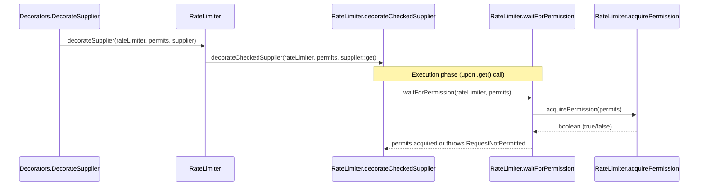
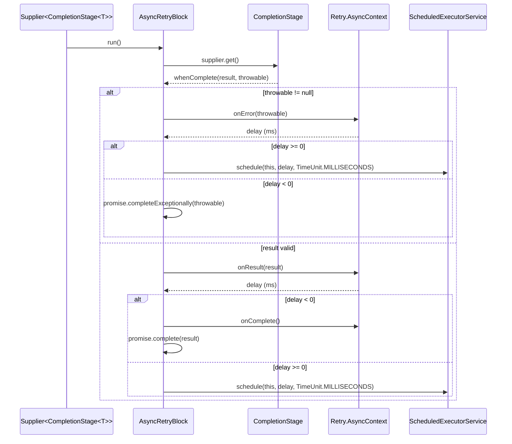

# Decorator Chains

<details>
<summary>Relevant source files</summary>

The following files were used as context for generating this wiki page:

- [resilience4j-all/src/main/java/io/github/resilience4j/decorators/Decorators.java](https://github.com/resilience4j/resilience4j/blob/main/resilience4j-all/src/main/java/io/github/resilience4j/decorators/Decorators.java)
- [README.adoc](https://github.com/resilience4j/resilience4j/blob/main/README.adoc)
- [resilience4j-retry/src/main/java/io/github/resilience4j/retry/Retry.java](https://github.com/resilience4j/resilience4j/blob/main/resilience4j-retry/src/main/java/io/github/resilience4j/retry/Retry.java)
- [resilience4j-vavr/src/main/java/io/github/resilience4j/circuitbreaker/VavrCircuitBreaker.java](https://github.com/resilience4j/resilience4j/blob/main/resilience4j-vavr/src/main/java/io/github/resilience4j/circuitbreaker/VavrCircuitBreaker.java)
- [resilience4j-circuitbreaker/src/main/java/io/github/resilience4j/circuitbreaker/CircuitBreaker.java](https://github.com/resilience4j/resilience4j/blob/main/resilience4j-circuitbreaker/src/main/java/io/github/resilience4j/circuitbreaker/CircuitBreaker.java)
- [resilience4j-vavr/src/main/java/io/github/resilience4j/decorators/VavrDecorators.java](https://github.com/resilience4j/resilience4j/blob/main/resilience4j-vavr/src/main/java/io/github/resilience4j/decorators/VavrDecorators.java)
- [resilience4j-feign/src/main/java/io/github/resilience4j/feign/FeignDecorators.java](https://github.com/resilience4j/resilience4j/blob/main/resilience4j-feign/src/main/java/io/github/resilience4j/feign/FeignDecorators.java)
- [resilience4j-feign/README.adoc](https://github.com/resilience4j/resilience4j/blob/main/resilience4j-feign/README.adoc)
- [resilience4j-core/src/main/java/io/github/resilience4j/core/CompletionStageUtils.java](https://github.com/resilience4j/resilience4j/blob/main/resilience4j-core/src/main/java/io/github/resilience4j/core/CompletionStageUtils.java)
- [resilience4j-vavr/src/main/java/io/github/resilience4j/retry/VavrRetry.java](https://github.com/resilience4j/resilience4j/blob/main/resilience4j-vavr/src/main/java/io/github/resilience4j/retry/VavrRetry.java)
- [resilience4j-hedge/src/main/java/io/github/resilience4j/hedge/internal/HedgeImpl.java](https://github.com/resilience4j/resilience4j/blob/main/resilience4j-hedge/src/main/java/io/github/resilience4j/hedge/internal/HedgeImpl.java)
- [resilience4j-ratelimiter/src/main/java/io/github/resilience4j/ratelimiter/RateLimiter.java](https://github.com/resilience4j/resilience4j/blob/main/resilience4j-ratelimiter/src/main/java/io/github/resilience4j/ratelimiter/RateLimiter.java)
- [resilience4j-core/src/main/java/io/github/resilience4j/core/ContextPropagator.java](https://github.com/resilience4j/resilience4j/blob/main/resilience4j-core/src/main/java/io/github/resilience4j/core/ContextPropagator.java)
</details>

## Overview

Decorator chains in Resilience4j provide a powerful compositional mechanism for wrapping functional interfaces, lambda expressions, and method references with multiple fault tolerance behaviors. By stacking higher-order functions in a defined sequence, developers can selectively combine patterns such as circuit breaking, rate limiting, retries, bulkheads, and timeouts without adopting an all-or-nothing approach. The execution order of these decorators is vital, as each wrapper determines its own failure conditions and handles results or exceptions sequentially from the innermost execution outward to fallback and recovery layers.

Sources: [README.adoc:32-36](https://github.com/resilience4j/resilience4j/blob/main/README.adoc#L32-L36), [resilience4j-all/src/main/java/io/github/resilience4j/decorators/Decorators.java:22-42](https://github.com/resilience4j/resilience4j/blob/main/resilience4j-all/src/main/java/io/github/resilience4j/decorators/Decorators.java#L22-L42), [resilience4j-feign/src/main/java/io/github/resilience4j/feign/FeignDecorators.java:34-56](https://github.com/resilience4j/resilience4j/blob/main/resilience4j-feign/src/main/java/io/github/resilience4j/feign/FeignDecorators.java#L34-L56)

## Core Fluent Decorators API

### Overview

The `Decorators` interface in `resilience4j-all` and `VavrDecorators` in `resilience4j-vavr` provide fluent builder APIs designed to wrap standard Java and Vavr functional primitives with resilience patterns. Rather than manually nesting static helper calls, developers initialize a builder using factory methods corresponding to target functional types—such as `ofSupplier`, `ofFunction`, `ofRunnable`, `ofCallable`, `ofCompletionStage`, `ofConsumer`, and their checked or Vavr equivalents—and progressively attach behaviors via chaining methods.

Sources: [resilience4j-all/src/main/java/io/github/resilience4j/decorators/Decorators.java:43-85](https://github.com/resilience4j/resilience4j/blob/main/resilience4j-all/src/main/java/io/github/resilience4j/decorators/Decorators.java#L43-L85), [resilience4j-vavr/src/main/java/io/github/resilience4j/decorators/VavrDecorators.java:41-53](https://github.com/resilience4j/resilience4j/blob/main/resilience4j-vavr/src/main/java/io/github/resilience4j/decorators/VavrDecorators.java#L41-L53)

### Builder Execution and Composition Order

Decorators are applied sequentially in the exact order specified by the builder chain. When building a chain like `Decorators.ofSupplier(supplier).withCircuitBreaker(cb).withRetry(retry).decorate()`, the underlying functional interface is wrapped iteratively: the supplier is first decorated by the circuit breaker, and that resulting supplier is subsequently wrapped by the retry instance. Upon execution, calls flow from the outermost decorator inward to the base supplier and propagate results or exceptions back outward.

Sources: [resilience4j-all/src/main/java/io/github/resilience4j/decorators/Decorators.java:22-42](https://github.com/resilience4j/resilience4j/blob/main/resilience4j-all/src/main/java/io/github/resilience4j/decorators/Decorators.java#L22-L42)

The inner builder classes encapsulate specific functional arities and expose tailored configuration methods. For instance, `DecorateSupplier` and `DecorateCheckedSupplier` provide cache integration via `withCache(Cache)`, thread pool bulkhead execution returning completion stages via `withThreadPoolBulkhead(ThreadPoolBulkhead)`, and comprehensive fallback handlers.

Sources: [resilience4j-all/src/main/java/io/github/resilience4j/decorators/Decorators.java:86-171](https://github.com/resilience4j/resilience4j/blob/main/resilience4j-all/src/main/java/io/github/resilience4j/decorators/Decorators.java#L86-171), [resilience4j-all/src/main/java/io/github/resilience4j/decorators/Decorators.java:401-484](https://github.com/resilience4j/resilience4j/blob/main/resilience4j-all/src/main/java/io/github/resilience4j/decorators/Decorators.java#L401-484)

> [!NOTE]
> Attaching a `ThreadPoolBulkhead` to a supplier, runnable, or callable builder immediately terminates the standard synchronous chain and transitions the return type to a `DecorateCompletionStage`, routing execution through the bulkhead's task queue.

Sources: [resilience4j-all/src/main/java/io/github/resilience4j/decorators/Decorators.java:147-162](https://github.com/resilience4j/resilience4j/blob/main/resilience4j-all/src/main/java/io/github/resilience4j/decorators/Decorators.java#L147-162), [resilience4j-all/src/main/java/io/github/resilience4j/decorators/Decorators.java:287-302](https://github.com/resilience4j/resilience4j/blob/main/resilience4j-all/src/main/java/io/github/resilience4j/decorators/Decorators.java#L287-302)

## Rate Limiter Pipeline Execution

### Overview

When integrating a rate limiter into a fluent decorator chain, requests must successfully acquire execution permits before invoking the underlying functional primitive. The rate limiting pipeline coordinates permission checks, thread blocking behavior, and metric updates through a sequence of static delegations spanning `Decorators` and `RateLimiter`.

Sources: [resilience4j-all/src/main/java/io/github/resilience4j/decorators/Decorators.java:113-120](https://github.com/resilience4j/resilience4j/blob/main/resilience4j-all/src/main/java/io/github/resilience4j/decorators/Decorators.java#L113-L120), [resilience4j-ratelimiter/src/main/java/io/github/resilience4j/ratelimiter/RateLimiter.java:387-403](https://github.com/resilience4j/resilience4j/blob/main/resilience4j-ratelimiter/src/main/java/io/github/resilience4j/ratelimiter/RateLimiter.java#L387-L403)

### Call-Chain Execution Walkthrough

The execution sequence for rate limiter decoration follows a precise delegation path from fluent builder invocation down to permit acquisition:

1. `withRateLimiter` — Invoked on a builder instance like `DecorateSupplier`, capturing the target `RateLimiter` instance and permit count (defaulting to `1`) to wrap the current supplier.
Sources: [resilience4j-all/src/main/java/io/github/resilience4j/decorators/Decorators.java:113-120](https://github.com/resilience4j/resilience4j/blob/main/resilience4j-all/src/main/java/io/github/resilience4j/decorators/Decorators.java#L113-L120)

2. `decorateSupplier` — Delegates creation to `RateLimiter.decorateSupplier(rateLimiter, permits, supplier)`, which wraps the supplier logic.
Sources: [resilience4j-ratelimiter/src/main/java/io/github/resilience4j/ratelimiter/RateLimiter.java:400-403](https://github.com/resilience4j/ratelimiter/src/main/java/io/github/resilience4j/ratelimiter/RateLimiter.java#L400-L403)

3. `decorateCheckedSupplier` — Bridges standard and checked suppliers by passing a method reference `supplier::get` into the checked supplier decorator factory.
Sources: [resilience4j-ratelimiter/src/main/java/io/github/resilience4j/ratelimiter/RateLimiter.java:401-402](https://github.com/resilience4j/ratelimiter/src/main/java/io/github/resilience4j/ratelimiter/RateLimiter.java#L401-L402)

4. `waitForPermission` — Executed immediately upon invocation of the decorated wrapper before calling the target function; it invokes `rateLimiter.acquirePermission(permits)` and inspects thread interruption status.
Sources: [resilience4j-ratelimiter/src/main/java/io/github/resilience4j/ratelimiter/RateLimiter.java:239-240](https://github.com/resilience4j/resilience4j/blob/main/resilience4j-ratelimiter/src/main/java/io/github/resilience4j/ratelimiter/RateLimiter.java#L239-L240), [resilience4j-ratelimiter/src/main/java/io/github/resilience4j/ratelimiter/RateLimiter.java:572-580](https://github.com/resilience4j/resilience4j/blob/main/resilience4j-ratelimiter/src/main/java/io/github/resilience4j/ratelimiter/RateLimiter.java#L572-L580)

5. `acquirePermission` — Evaluates current limit state on the underlying `AtomicRateLimiter`, blocking the calling thread up to `timeoutDuration` if permits are exhausted.
Sources: [resilience4j-ratelimiter/src/main/java/io/github/resilience4j/ratelimiter/RateLimiter.java:666-666](https://github.com/resilience4j/resilience4j/blob/main/resilience4j-ratelimiter/src/main/java/io/github/resilience4j/ratelimiter/RateLimiter.java#L666-L666)



Sources: [resilience4j-all/src/main/java/io/github/resilience4j/decorators/Decorators.java:117-119](https://github.com/resilience4j/resilience4j/blob/main/resilience4j-all/src/main/java/io/github/resilience4j/decorators/Decorators.java#L117-L119), [resilience4j-ratelimiter/src/main/java/io/github/resilience4j/ratelimiter/RateLimiter.java:239-250](https://github.com/resilience4j/resilience4j/blob/main/resilience4j-ratelimiter/src/main/java/io/github/resilience4j/ratelimiter/RateLimiter.java#L239-L250), [resilience4j-ratelimiter/src/main/java/io/github/resilience4j/ratelimiter/RateLimiter.java:400-403](https://github.com/resilience4j/resilience4j/blob/main/resilience4j-ratelimiter/src/main/java/io/github/resilience4j/ratelimiter/RateLimiter.java#L400-L403), [resilience4j-ratelimiter/src/main/java/io/github/resilience4j/ratelimiter/RateLimiter.java:572-580](https://github.com/resilience4j/resilience4j/blob/main/resilience4j-ratelimiter/src/main/java/io/github/resilience4j/ratelimiter/RateLimiter.java#L572-L580)

> [!WARNING]
> If a thread is interrupted while waiting inside `waitForPermission`, the method checks `Thread.currentThread().isInterrupted()` and immediately throws an `AcquirePermissionCancelledException` rather than returning a standard timeout failure.

Sources: [resilience4j-ratelimiter/src/main/java/io/github/resilience4j/ratelimiter/RateLimiter.java:574-576](https://github.com/resilience4j/resilience4j/blob/main/resilience4j-ratelimiter/src/main/java/io/github/resilience4j/ratelimiter/RateLimiter.java#L574-L576)

### Design Trade-Offs

| Design Choice | Benefit | Cost |
| :--- | :--- | :--- |
| Synchronous blocking via `waitForPermission` | Simple pipeline integration without requiring asynchronous callback handling for standard suppliers and runtimes | Threads block on permit acquisition, consuming OS thread resources under high contention |
| Unchecked conversion wrappers (`.unchecked()`) | Seamless integration between checked functional interfaces and standard Java functional APIs | Obscures checked exception signatures behind runtime exception throwing wrappers |
| CompletionStage promise wrapping | Asynchronous rate-limiter composition for non-blocking reactive pipelines via `decorateCompletionStage` | Added heap allocation overhead for `CompletableFuture` promise wrapping per asynchronous call |

Sources: [resilience4j-ratelimiter/src/main/java/io/github/resilience4j/ratelimiter/RateLimiter.java:159-182](https://github.com/resilience4j/resilience4j/blob/main/resilience4j-ratelimiter/src/main/java/io/github/resilience4j/ratelimiter/RateLimiter.java#L159-L182), [resilience4j-ratelimiter/src/main/java/io/github/resilience4j/ratelimiter/RateLimiter.java:400-403](https://github.com/resilience4j/ratelimiter/src/main/java/io/github/resilience4j/ratelimiter/RateLimiter.java#L400-L403)

## Circuit Breaker and Retry Wrapping

### Overview

Integrating `CircuitBreaker` and `Retry` mechanisms requires managing state validation and execution lifecycles across both synchronous loops and asynchronous completion stages. The `CircuitBreaker` interface provides permission acquisition methods such as `acquirePermission()` and `tryAcquirePermission()` alongside metrics and recording APIs like `onSuccess()`, `onError()`, and `onResult()`. Concurrently, `Retry` provides synchronous decorators (such as `decorateSupplier()`, `decorateCallable()`, and `decorateCheckedSupplier()`) and asynchronous helpers (such as `decorateCompletionStage()`) that execute iterations inside retry blocks.

Sources: [resilience4j-retry/src/main/java/io/github/resilience4j/retry/Retry.java:99-121](https://github.com/resilience4j/resilience4j/blob/main/resilience4j-retry/src/main/java/io/github/resilience4j/retry/Retry.java#L99-L121), [resilience4j-retry/src/main/java/io/github/resilience4j/retry/Retry.java:146-163](https://github.com/resilience4j/resilience4j/blob/main/resilience4j-retry/src/main/java/io/github/resilience4j/retry/Retry.java#L146-L163), [resilience4j-circuitbreaker/src/main/java/io/github/resilience4j/circuitbreaker/CircuitBreaker.java:66-82](https://github.com/resilience4j/resilience4j/blob/main/resilience4j-circuitbreaker/src/main/java/io/github/resilience4j/circuitbreaker/CircuitBreaker.java#L66-82), [resilience4j-circuitbreaker/src/main/java/io/github/resilience4j/circuitbreaker/CircuitBreaker.java:473-501](https://github.com/resilience4j/resilience4j/blob/main/resilience4j-circuitbreaker/src/main/java/io/github/resilience4j/circuitbreaker/CircuitBreaker.java#L473-501)

### Synchronous Decoration and Execution Flow

Synchronous retry decoration uses `do-while` loops paired with `Retry.Context` to evaluate attempts. When wrapping a supplier via `Retry.decorateSupplier()`, the decorated lambda fetches a retry context, invokes the target supplier, and validates the result via `context.onResult(result)`. If an exception occurs, `context.onError()` or `context.onRuntimeError()` processes the failure.

Sources: [resilience4j-retry/src/main/java/io/github/resilience4j/retry/Retry.java:296-312](https://github.com/resilience4j/resilience4j/blob/main/resilience4j-retry/src/main/java/io/github/resilience4j/retry/Retry.java#L296-312), [resilience4j-retry/src/main/java/io/github/resilience4j/retry/Retry.java:640-672](https://github.com/resilience4j/resilience4j/blob/main/resilience4j-retry/src/main/java/io/github/resilience4j/retry/Retry.java#L640-672)

Similarly, `CircuitBreaker` decoration methods—such as `CircuitBreaker.decorateSupplier()`—acquire permissions before execution and record durations upon completion:

```java
static <T> Supplier<T> decorateSupplier(CircuitBreaker circuitBreaker, Supplier<T> supplier) {
    return () -> {
        circuitBreaker.acquirePermission();
        final long start = circuitBreaker.getCurrentTimestamp();
        try {
            T result = supplier.get();
            long duration = circuitBreaker.getCurrentTimestamp() - start;
            circuitBreaker.onResult(duration, circuitBreaker.getTimestampUnit(), result);
            return result;
        } catch (Exception exception) {
            long duration = circuitBreaker.getCurrentTimestamp() - start;
            circuitBreaker.onError(duration, circuitBreaker.getTimestampUnit(), exception);
            throw exception;
        }
    };
}
```

Sources: [resilience4j-circuitbreaker/src/main/java/io/github/resilience4j/circuitbreaker/CircuitBreaker.java:189-205](https://github.com/resilience4j/resilience4j/blob/main/resilience4j-circuitbreaker/src/main/java/io/github/resilience4j/circuitbreaker/CircuitBreaker.java#L189-205)

> [!WARNING]
> When combining `CircuitBreaker` and `Retry`, the order of decorators changes behavior. Placing `Retry` outside `CircuitBreaker` means every retry attempt triggers a separate permission check and state update on the circuit breaker. Placing `CircuitBreaker` outside `Retry` protects the entire retry sequence as a single operation.

Sources: [resilience4j-retry/src/main/java/io/github/resilience4j/retry/Retry.java:296-312](https://github.com/resilience4j/resilience4j/blob/main/resilience4j-retry/src/main/java/io/github/resilience4j/circuitbreaker/CircuitBreaker.java:189-205)

### Asynchronous Execution via CompletionStage and AsyncRetryBlock

Asynchronous retry decoration uses `Retry.decorateCompletionStage()` alongside `AsyncRetryBlock`, which implements `Runnable` to schedule retries via a `ScheduledExecutorService`.

Sources: [resilience4j-retry/src/main/java/io/github/resilience4j/retry/Retry.java:99-121](https://github.com/resilience4j/retry/src/main/java/io/github/resilience4j/retry/Retry.java#L99-121), [resilience4j-retry/src/main/java/io/github/resilience4j/retry/Retry.java:692-756](https://github.com/resilience4j/retry/src/main/java/io/github/resilience4j/retry/Retry.java#L692-756)



Sources: [resilience4j-retry/src/main/java/io/github/resilience4j/retry/Retry.java:712-755](https://github.com/resilience4j/retry/src/main/java/io/github/resilience4j/retry/Retry.java#L712-755)

Similarly, `CircuitBreaker.decorateCompletionStage()` evaluates permissions asynchronously, completing the returned `CompletableFuture` exceptionally with a `CallNotPermittedException` if permits are denied:

```java
static <T> Supplier<CompletionStage<T>> decorateCompletionStage(
    CircuitBreaker circuitBreaker,
    Supplier<CompletionStage<T>> supplier
) {
    return () -> {
        final CompletableFuture<T> promise = new CompletableFuture<>();
        if (!circuitBreaker.tryAcquirePermission()) {
            promise.completeExceptionally(
                CallNotPermittedException.createCallNotPermittedException(circuitBreaker));
        } else {
            final long start = circuitBreaker.getCurrentTimestamp();
            try {
                supplier.get().whenComplete((result, throwable) -> {
                    long duration = circuitBreaker.getCurrentTimestamp() - start;
                    if (throwable != null) {
                        if (throwable instanceof Exception) {
                            circuitBreaker.onError(duration, circuitBreaker.getTimestampUnit(), throwable);
                        }
                        promise.completeExceptionally(throwable);
                    } else {
                        circuitBreaker.onResult(duration, circuitBreaker.getTimestampUnit(), result);
                        promise.complete(result);
                    }
                });
            } catch (Exception exception) {
                long duration = circuitBreaker.getCurrentTimestamp() - start;
                circuitBreaker.onError(duration, circuitBreaker.getTimestampUnit(), exception);
                promise.completeExceptionally(exception);
            }
        }
        return promise;
    };
}
```

Sources: [resilience4j-circuitbreaker/src/main/java/io/github/resilience4j/circuitbreaker/CircuitBreaker.java:92-129](https://github.com/resilience4j/circuitbreaker/src/main/java/io/github/resilience4j/circuitbreaker/CircuitBreaker.java#L92-129)

### Circuit Breaker States and Transitions

The `CircuitBreaker` state machine manages execution permissions and telemetry via six states defined in `CircuitBreaker.State`:

| State Name | Order Value | Allows Publishing / Execution | Behavior Description |
| :--- | :--- | :--- | :--- |
| `CLOSED` | 0 | Yes | Operating normally; requests are permitted and failure rates are tracked. |
| `OPEN` | 1 | Yes | Tripped due to excessive failure rate; requests are rejected immediately. |
| `HALF_OPEN` | 2 | Yes | Test interval elapsed; a limited number of test calls are permitted to check backend recovery. |
| `DISABLED` | 3 | No | Inactive state; all requests pass through without state transitions or metrics. |
| `FORCED_OPEN` | 4 | No | Manually forced open; all requests are rejected without state transitions or metrics. |
| `METRICS_ONLY` | 5 | Yes | Collecting metrics and publishing events while allowing all requests through without transitions. |

Sources: [resilience4j-circuitbreaker/src/main/java/io/github/resilience4j/circuitbreaker/CircuitBreaker.java:810-861](https://github.com/resilience4j/circuitbreaker/src/main/java/io/github/resilience4j/circuitbreaker/CircuitBreaker.java#L810-861)

> [!TIP]
> The `order` property on `CircuitBreaker.State` is a fixed integer that remains stable even if new enum constants are inserted, avoiding reliance on vulnerable `.ordinal()` indexes.

Sources: [resilience4j-circuitbreaker/src/main/java/io/github/resilience4j/circuitbreaker/CircuitBreaker.java:840-860](https://github.com/resilience4j/circuitbreaker/src/main/java/io/github/resilience4j/circuitbreaker/CircuitBreaker.java#L840-860)

## Vavr Functional Data Structure Extensions

### Overview

Resilience4j provides specialized integration for Vavr functional constructs through `VavrCircuitBreaker` and `VavrRetry`, enabling developers to decorate functional primitives such as `CheckedFunction0`, `CheckedFunction1`, `CheckedRunnable`, `Either`, and `Try`. These integrations allow resilience policies to wrap functional containers naturally without breaking monad chains or forcing imperative try-catch blocks.

Sources: [resilience4j-vavr/src/main/java/io/github/resilience4j/circuitbreaker/VavrCircuitBreaker.java:30-194](https://github.com/resilience4j/vavr/src/main/java/io/github/resilience4j/circuitbreaker/VavrCircuitBreaker.java#L30-L194), [resilience4j-vavr/src/main/java/io/github/resilience4j/retry/VavrRetry.java:29-172](https://github.com/resilience4j/vavr/src/main/java/io/github/resilience4j/retry/VavrRetry.java#L29-L172)

### Functional Decorator Signatures

The extension modules define a variety of static decoration methods for both circuit breakers and retry contexts. These methods transform input functional interfaces into resilience-aware equivalents that handle permission checks, duration measurement, and state updates automatically.

| Target Class | Decorator Method | Input Type | Return Type | Purpose |
| :--- | :--- | :--- | :--- | :--- |
| `VavrCircuitBreaker` | `decorateCheckedSupplier` | `CheckedFunction0<T>` | `CheckedFunction0<T>` | Wraps a zero-argument checked supplier with circuit breaker logic. |
| `VavrCircuitBreaker` | `decorateCheckedRunnable` | `CheckedRunnable` | `CheckedRunnable` | Wraps a checked runnable with circuit breaker enforcement. |
| `VavrCircuitBreaker` | `decorateEitherSupplier` | `Supplier<Either<? extends Exception, T>>` | `Supplier<Either<Exception, T>>` | Intercepts Vavr `Either` structures, recording success or failure based on the Left/Right split. |
| `VavrCircuitBreaker` | `decorateTrySupplier` | `Supplier<Try<T>>` | `Supplier<Try<T>>` | Intercepts Vavr `Try` structures, evaluating success or failure from the Try outcome. |
| `VavrRetry` | `decorateCheckedSupplier` | `CheckedFunction0<T>` | `CheckedFunction0<T>` | Retries a checked supplier based on retry context rules and result validation. |
| `VavrRetry` | `decorateEitherSupplier` | `Supplier<Either<E, T>>` | `Supplier<Either<E, T>>` | Retries a supplier returning an `Either` monad until success or exhaustion. |

Sources: [resilience4j-vavr/src/main/java/io/github/resilience4j/circuitbreaker/VavrCircuitBreaker.java:39-140](https://github.com/resilience4j/vavr/src/main/java/io/github/resilience4j/circuitbreaker/VavrCircuitBreaker.java#L39-L140), [resilience4j-vavr/src/main/java/io/github/resilience4j/retry/VavrRetry.java:38-172](https://github.com/resilience4j/vavr/src/main/java/io/github/resilience4j/retry/VavrRetry.java#L38-L172)

### Call-Chain Execution Walkthrough

When executing a decorated `Either` supplier through `VavrCircuitBreaker.decorateEitherSupplier`, the execution follows a strict permission and inspection flow:

1. `circuitBreaker.tryAcquirePermission()` is evaluated. If permissions are denied, execution bypasses the supplier entirely and immediately returns `Either.left(CallNotPermittedException.createCallNotPermittedException(circuitBreaker))`.
2. If permitted, `circuitBreaker.getCurrentTimestamp()` captures the start time.
3. The underlying supplier executes via `supplier.get()`, returning an `Either<? extends Exception, T>` result.
4. Duration is calculated by subtracting the start timestamp from the current timestamp.
5. The monad branch is inspected via `result.isRight()`. If true, `circuitBreaker.onSuccess(duration, circuitBreaker.getTimestampUnit())` is invoked. If false, `result.getLeft()` extracts the exception, and `circuitBreaker.onError(duration, circuitBreaker.getTimestampUnit(), exception)` is invoked.
6. Finally, `Either.narrow(result)` returns the casted monad outcome.

```java
static <T> Supplier<Either<Exception, T>> decorateEitherSupplier(CircuitBreaker circuitBreaker,
                                                                 Supplier<Either<? extends Exception, T>> supplier) {
    return () -> {
        if (circuitBreaker.tryAcquirePermission()) {
            final long start = circuitBreaker.getCurrentTimestamp();
            Either<? extends Exception, T> result = supplier.get();
            long duration = circuitBreaker.getCurrentTimestamp() - start;
            if (result.isRight()) {
                circuitBreaker.onSuccess(duration, circuitBreaker.getTimestampUnit());
            } else {
                Exception exception = result.getLeft();
                circuitBreaker.onError(duration, circuitBreaker.getTimestampUnit(), exception);
            }
            return Either.narrow(result);
        } else {
            return Either.left(
                CallNotPermittedException.createCallNotPermittedException(circuitBreaker));
        }
    };
}
```

Sources: [resilience4j-vavr/src/main/java/io/github/resilience4j/circuitbreaker/VavrCircuitBreaker.java:91-110](https://github.com/resilience4j/vavr/src/main/java/io/github/resilience4j/circuitbreaker/VavrCircuitBreaker.java#L91-L110)

> [!NOTE]
> Unlike standard suppliers that throw checked exceptions directly, `decorateEitherSupplier` and `decorateTrySupplier` capture failure states directly from the monad's `Left` or `Failure` projections without raising runtime exceptions to the caller.

Sources: [resilience4j-vavr/src/main/java/io/github/resilience4j/circuitbreaker/VavrCircuitBreaker.java:98-107](https://github.com/resilience4j/vavr/src/main/java/io/github/resilience4j/circuitbreaker/VavrCircuitBreaker.java#L98-L107), [resilience4j-vavr/src/main/java/io/github/resilience4j/circuitbreaker/VavrCircuitBreaker.java:127-137](https://github.com/resilience4j/vavr/src/main/java/io/github/resilience4j/circuitbreaker/VavrCircuitBreaker.java#L127-L137)

### Retry Mechanics with Try and Either

`VavrRetry` provides specialized decorators for `Try` and `Either` suppliers that loop execution within a `do-while` construct driven by `Retry.context()`. For `decorateTrySupplier`, the retry loop inspects whether the returned `Try` instance is a success or failure:

```java
static <T> Supplier<Try<T>> decorateTrySupplier(Retry retry, Supplier<Try<T>> supplier) {
    return () -> {
        Retry.Context<T> context = retry.context();
        do {
            Try<T> result = supplier.get();
            if (result.isSuccess()) {
                final boolean validationOfResult = context.onResult(result.get());
                if (!validationOfResult) {
                    context.onComplete();
                    return result;
                }
            } else {
                Throwable cause = result.getCause();
                if (cause instanceof Exception) {
                    try {
                        context.onError((Exception) result.getCause());
                    } catch (Exception e) {
                        return result;
                    }
                } else {
                    return result;
                }
            }
        } while (true);
    };
}
```

Sources: [resilience4j-vavr/src/main/java/io/github/resilience4j/retry/VavrRetry.java:147-172](https://github.com/resilience4j/retry/src/main/java/io/github/resilience4j/retry/VavrRetry.java#L147-L172)

## Feign Decorators and Context Propagation

### Overview

Resilience4j provides specialized integration modules for OpenFeign clients, asynchronous speculative hedging, and cross-thread context propagation. The `resilience4j-feign` module uses a builder-based decorator chain via `FeignDecorators` to stack fault tolerance primitives onto Feign interfaces. Concurrently, the hedging engine (`HedgeImpl`) manages speculative backup executions, while `ContextPropagator` coordinates `ThreadLocal` values across thread boundaries.

Sources: [resilience4j-feign/src/main/java/io/github/resilience4j/feign/FeignDecorators.java:34-58](https://github.com/resilience4j/resilience4j/blob/main/resilience4j-feign/src/main/java/io/github/resilience4j/feign/FeignDecorators.java#L34-L58), [resilience4j-hedge/src/main/java/io/github/resilience4j/hedge/internal/HedgeImpl.java:38-68](https://github.com/resilience4j/resilience4j/blob/main/resilience4j-hedge/src/main/java/io/github/resilience4j/hedge/internal/HedgeImpl.java#L38-L68), [resilience4j-core/src/main/java/io/github/resilience4j/core/ContextPropagator.java:28-41](https://github.com/resilience4j/resilience4j/blob/main/resilience4j-core/src/main/java/io/github/resilience4j/core/ContextPropagator.java#L28-L41)

### Feign Decorator Chain and Method Filtering

`FeignDecorators` maintains an ordered list of `FeignDecorator` instances. During decoration, `FeignDecorators.decorate(...)` iterates through the registered decorators, wrapping the underlying checked function sequentially:

```java
@Override
public CheckedFunction<Object[], Object> decorate(CheckedFunction<Object[], Object> fn,
                                                  Method method, MethodHandler methodHandler, Target<?> target) {
    CheckedFunction<Object[], Object> decoratedFn = fn;
    for (final FeignDecorator decorator : decorators) {
        decoratedFn = decorator.decorate(decoratedFn, method, methodHandler, target);
    }
    return decoratedFn;
}
```

Sources: [resilience4j-feign/src/main/java/io/github/resilience4j/feign/FeignDecorators.java:70-78](https://github.com/resilience4j/resilience4j/blob/main/resilience4j-feign/src/main/java/io/github/resilience4j/feign/FeignDecorators.java#L70-L78)

> [!WARNING]
> Default interface methods on Feign interfaces are automatically excluded from decoration (`m.isDefault()`) because they do not participate in actual web requests.

Sources: [resilience4j-feign/src/main/java/io/github/resilience4j/feign/FeignDecorators.java:223-230](https://github.com/resilience4j/resilience4j/blob/main/resilience4j-feign/src/main/java/io/github/resilience4j/feign/FeignDecorators.java#L223-L230)

The `FeignDecorators.Builder` class exposes methods for configuring retry, circuit breakers, rate limiters, bulkheads, and fallback handlers.

| Builder Method | Argument Type | Purpose |
| :--- | :--- | :--- |
| `withRetry(Retry)` | `Retry` | Adds retry logic to the Feign invocation chain |
| `withCircuitBreaker(CircuitBreaker)` | `CircuitBreaker` | Protects downstream calls using circuit breaker states |
| `withRateLimiter(RateLimiter)` | `RateLimiter` | Restricts call throughput per time window |
| `withBulkhead(Bulkhead)` | `Bulkhead` | Isolates concurrent resource consumption |
| `withFallback(Object)` | `Object` | Registers a fallback instance implementing the Feign interface |
| `withFallbackFactory(Function)` | `Function<Exception, ?>` | Registers a fallback factory consuming the root cause exception |

Sources: [resilience4j-feign/src/main/java/io/github/resilience4j/feign/FeignDecorators.java:80-218](https://github.com/resilience4j/resilience4j/blob/main/resilience4j-feign/src/main/java/io/github/resilience4j/feign/FeignDecorators.java#L80-L218)

### Speculative Hedging Execution Flow

`HedgeImpl` implements speculative hedging by dispatching a primary asynchronous call and scheduling a hedged secondary call if the primary execution does not complete within the configured duration.

The hedging execution follows this call chain:
1. `submit(Callable, ExecutorService)` invokes `decorateCaller()` with primary and hedged suppliers built via `callableFuture()`.
2. `decorateCaller()` launches the primary supplier immediately as `supplied` (`CompletableFuture<HedgeResult<T>>`) and creates a `timedCompletable` promise.
3. A scheduled future (`sf`) is registered on `configuredHedgeExecutor` to complete `timedCompletable` exceptionally or normally after `durationSupplier.get()` nanoseconds.
4. When `timedCompletable` completes, `hedgedSupplier.get()` is invoked on the scheduled executor pool, producing the `hedged` future.
5. `CompletableFuture.anyOf(hedged, supplied)` races both futures. Whichever completes first wins, triggering cancellation of the losing future and the scheduling token.

```java
ScheduledFuture<Boolean> sf = configuredHedgeExecutor.schedule(() -> timedCompletable.complete(null), durationSupplier.get().toNanos(), TimeUnit.NANOSECONDS);
return CompletableFuture.anyOf(hedged, supplied)
    .thenApply(s -> {
        HedgeResult<T> t = (HedgeResult<T>) s;
        long duration = System.nanoTime() - start;
        if (t.fromPrimary) {
            sf.cancel(true);
            hedged.cancel(false);
            if (t.throwable.isPresent()) {
                onPrimaryFailure(Duration.ofNanos(duration), t.throwable.get());
                throw (RuntimeException) t.throwable.get();
            } else {
                onPrimarySuccess(Duration.ofNanos(duration));
            }
        } else {
            supplied.cancel(false);
            if (t.throwable.isPresent()) {
                onSecondaryFailure(Duration.ofNanos(duration), t.throwable.get());
                throw (RuntimeException) t.throwable.get();
            } else {
                onSecondarySuccess(Duration.ofNanos(duration));
            }
        }
        return t.value;
    });
```

Sources: [resilience4j-hedge/src/main/java/io/github/resilience4j/hedge/internal/HedgeImpl.java:80-136](https://github.com/resilience4j/resilience4j/blob/main/resilience4j-hedge/src/main/java/io/github/resilience4j/hedge/internal/HedgeImpl.java#L80-L136)

### Thread Context Propagation Across Boundaries

`ContextPropagator` abstracts the retrieval, copying, and clearing of `ThreadLocal` context across thread boundaries. When executing decorated suppliers, callables, or runnables with a list of propagators, Resilience4j builds an identity map capturing current context values and restores them during execution:

```java
static <T> Supplier<T> decorateSupplier(List<? extends ContextPropagator> propagators,
                                        Supplier<T> supplier) {

    Objects.requireNonNull(propagators, CONTEXT_PROPAGATOR_LIST_SHOULD_BE_NON_NULL);

    final Map<? extends ContextPropagator, Object> values = propagators.stream()
        .collect(toMap(
            p -> p,
            p -> p.retrieve().get(),
            (first, second) -> second,
            HashMap::new));

    return () -> {
        try {
            values.forEach((p, v) -> p.copy().accept(v));
            return supplier.get();
        } finally {
            values.forEach((p, v) -> p.clear().accept(v));
        }
    };
}
```

Sources: [resilience4j-core/src/main/java/io/github/resilience4j/core/ContextPropagator.java:99-120](https://github.com/resilience4j/resilience4j/blob/main/resilience4j-core/src/main/java/io/github/resilience4j/core/ContextPropagator.java#L99-L120)

> [!NOTE]
> For Java 21 and above with virtual threads, consider using Scoped Values (JEP 429) instead of `ThreadLocal` to avoid virtual thread pinning and high memory overhead when multiple virtual threads maintain individual copies.

Sources: [resilience4j-core/src/main/java/io/github/resilience4j/core/ContextPropagator.java:31-39](https://github.com/resilience4j/resilience4j/blob/main/resilience4j-core/src/main/java/io/github/resilience4j/core/ContextPropagator.java#L31-L39)

## Related

- [[Quick Start]]
- [[Circuit Breakers]]

