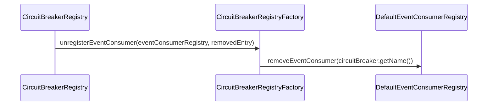

# Event Consumer Registries

<details>
<summary>Relevant source files</summary>

The following files were used as context for generating this wiki page:

- [resilience4j-spring6/src/main/java/io/github/resilience4j/spring6/timelimiter/configure/TimeLimiterConfiguration.java](https://github.com/resilience4j/resilience4j/blob/main/resilience4j-spring6/src/main/java/io/github/resilience4j/spring6/timelimiter/configure/TimeLimiterConfiguration.java)
- [resilience4j-spring6/src/main/java/io/github/resilience4j/spring6/ratelimiter/configure/RateLimiterConfiguration.java](https://github.com/resilience4j/resilience4j/blob/main/resilience4j-spring6/src/main/java/io/github/resilience4j/spring6/ratelimiter/configure/RateLimiterConfiguration.java)
- [resilience4j-spring6/src/main/java/io/github/resilience4j/spring6/bulkhead/configure/threadpool/ThreadPoolBulkheadConfiguration.java](https://github.com/resilience4j/resilience4j/blob/main/resilience4j-spring6/src/main/java/io/github/resilience4j/spring6/bulkhead/configure/threadpool/ThreadPoolBulkheadConfiguration.java)
- [resilience4j-micronaut/src/main/java/io/github/resilience4j/micronaut/circuitbreaker/CircuitBreakerRegistryFactory.java](https://github.com/resilience4j/resilience4j/blob/main/resilience4j-micronaut/src/main/java/io/github/resilience4j/micronaut/circuitbreaker/CircuitBreakerRegistryFactory.java)
- [resilience4j-core/src/main/java/io/github/resilience4j/core/registry/AbstractRegistry.java](https://github.com/resilience4j/resilience4j/blob/main/resilience4j-core/src/main/java/io/github/resilience4j/core/registry/AbstractRegistry.java)
- [resilience4j-core/src/main/java/io/github/resilience4j/core/metrics/MetricsPublisher.java](https://github.com/resilience4j/resilience4j/blob/main/resilience4j-core/src/main/java/io/github/resilience4j/core/metrics/MetricsPublisher.java)
- [resilience4j-bulkhead/src/main/java/io/github/resilience4j/bulkhead/internal/FixedThreadPoolBulkhead.java](https://github.com/resilience4j/resilience4j/blob/main/resilience4j-bulkhead/src/main/java/io/github/resilience4j/bulkhead/internal/FixedThreadPoolBulkhead.java)
- [resilience4j-consumer/src/main/java/io/github/resilience4j/consumer/DefaultEventConsumerRegistry.java](https://github.com/resilience4j/resilience4j/blob/main/resilience4j-consumer/src/main/java/io/github/resilience4j/consumer/DefaultEventConsumerRegistry.java)
- [resilience4j-consumer/src/main/java/io/github/resilience4j/consumer/CircularEventConsumer.java](https://github.com/resilience4j/resilience4j/blob/main/resilience4j-consumer/src/main/java/io/github/resilience4j/consumer/CircularEventConsumer.java)
- [resilience4j-consumer/src/main/java/io/github/resilience4j/consumer/EventConsumerRegistry.java](https://github.com/resilience4j/resilience4j/blob/main/resilience4j-consumer/src/main/java/io/github/resilience4j/consumer/EventConsumerRegistry.java)
- [resilience4j-hedge/src/main/java/io/github/resilience4j/hedge/internal/HedgeEventProcessor.java](https://github.com/resilience4j/resilience4j/blob/main/resilience4j-hedge/src/main/java/io/github/resilience4j/hedge/internal/HedgeEventProcessor.java)
- [resilience4j-spring-boot4/src/main/java/io/github/resilience4j/springboot/bulkhead/monitoring/endpoint/BulkheadEventsEndpoint.java](https://github.com/resilience4j/resilience4j/blob/main/resilience4j-spring-boot4/src/main/java/io/github/resilience4j/springboot/bulkhead/monitoring/endpoint/BulkheadEventsEndpoint.java)
- [resilience4j-spring-boot3/src/main/java/io/github/resilience4j/springboot3/bulkhead/monitoring/endpoint/BulkheadEventsEndpoint.java](https://github.com/resilience4j/resilience4j/blob/main/resilience4j-spring-boot3/src/main/java/io/github/resilience4j/springboot3/bulkhead/monitoring/endpoint/BulkheadEventsEndpoint.java)
- [resilience4j-bulkhead/src/main/java/io/github/resilience4j/bulkhead/internal/InMemoryThreadPoolBulkheadRegistry.java](https://github.com/resilience4j/resilience4j/blob/main/resilience4j-bulkhead/src/main/java/io/github/resilience4j/bulkhead/internal/InMemoryThreadPoolBulkheadRegistry.java)
- [resilience4j-ratelimiter/src/main/java/io/github/resilience4j/ratelimiter/internal/RateLimiterEventProcessor.java](https://github.com/resilience4j/ratelimiter/src/main/java/io/github/resilience4j/ratelimiter/internal/RateLimiterEventProcessor.java)
- [resilience4j-spring-boot4/src/main/java/io/github/resilience4j/springboot/circuitbreaker/monitoring/endpoint/CircuitBreakerEventsEndpoint.java](https://github.com/resilience4j/resilience4j/blob/main/resilience4j-spring-boot4/src/main/java/io/github/resilience4j/springboot/circuitbreaker/monitoring/endpoint/CircuitBreakerEventsEndpoint.java)
- [resilience4j-spring-boot3/src/main/java/io/github/resilience4j/springboot3/circuitbreaker/monitoring/endpoint/CircuitBreakerEventsEndpoint.java](https://github.com/resilience4j/resilience4j/blob/main/resilience4j-spring-boot3/src/main/java/io/github/resilience4j/springboot3/circuitbreaker/monitoring/endpoint/CircuitBreakerEventsEndpoint.java)
- [resilience4j-timelimiter/src/main/java/io/github/resilience4j/timelimiter/internal/TimeLimiterEventProcessor.java](https://github.com/resilience4j/timelimiter/src/main/java/io/github/resilience4j/timelimiter/internal/TimeLimiterEventProcessor.java)
- [resilience4j-spring-boot4/src/main/java/io/github/resilience4j/springboot/ratelimiter/monitoring/endpoint/RateLimiterEventsEndpoint.java](https://github.com/resilience4j/resilience4j/blob/main/resilience4j-spring-boot4/src/main/java/io/github/resilience4j/springboot/ratelimiter/monitoring/endpoint/RateLimiterEventsEndpoint.java)
- [resilience4j-spring-boot4/src/main/java/io/github/resilience4j/springboot/timelimiter/monitoring/endpoint/TimeLimiterEventsEndpoint.java](https://github.com/resilience4j/resilience4j/blob/main/resilience4j-spring-boot4/src/main/java/io/github/resilience4j/springboot/timelimiter/monitoring/endpoint/TimeLimiterEventsEndpoint.java)
- [resilience4j-spring-boot3/src/main/java/io/github/resilience4j/springboot3/timelimiter/monitoring/endpoint/TimeLimiterEventsEndpoint.java](https://github.com/resilience4j/resilience4j/blob/main/resilience4j-spring-boot3/src/main/java/io/github/resilience4j/springboot3/timelimiter/monitoring/endpoint/TimeLimiterEventsEndpoint.java)
- [resilience4j-spring-boot4/src/main/java/io/github/resilience4j/springboot/retry/monitoring/endpoint/RetryEventsEndpoint.java](https://github.com/resilience4j/resilience4j/blob/main/resilience4j-spring-boot4/src/main/java/io/github/resilience4j/springboot/retry/monitoring/endpoint/RetryEventsEndpoint.java)
- [resilience4j-spring-boot3/src/main/java/io/github/resilience4j/springboot3/ratelimiter/monitoring/endpoint/RateLimiterEventsEndpoint.java](https://github.com/resilience4j/resilience4j/blob/main/resilience4j-spring-boot3/src/main/java/io/github/resilience4j/springboot3/ratelimiter/monitoring/endpoint/RateLimiterEventsEndpoint.java)
- [resilience4j-spring-boot4/src/main/java/io/github/resilience4j/springboot/micrometer/monitoring/endpoint/TimerEventsEndpoint.java](https://github.com/resilience4j/resilience4j/blob/main/resilience4j-spring-boot4/src/main/java/io/github/resilience4j/springboot/micrometer/monitoring/endpoint/TimerEventsEndpoint.java)
- [resilience4j-spring-boot3/src/main/java/io/github/resilience4j/springboot3/retry/monitoring/endpoint/RetryEventsEndpoint.java](https://github.com/resilience4j/resilience4j/blob/main/resilience4j-spring-boot3/src/main/java/io/github/resilience4j/springboot3/retry/monitoring/endpoint/RetryEventsEndpoint.java)
- [resilience4j-core/src/main/java/io/github/resilience4j/core/registry/CompositeRegistryEventConsumer.java](https://github.com/resilience4j/resilience4j/blob/main/resilience4j-core/src/main/java/io/github/resilience4j/core/registry/CompositeRegistryEventConsumer.java)
- [resilience4j-spring-boot3/src/main/java/io/github/resilience4j/springboot3/micrometer/monitoring/endpoint/TimerEventsEndpoint.java](https://github.com/resilience4j/resilience4j/blob/main/resilience4j-springboot3/src/main/java/io/github/resilience4j/springboot3/micrometer/monitoring/endpoint/TimerEventsEndpoint.java)
- [resilience4j-micrometer/src/main/java/io/github/resilience4j/micrometer/internal/TimerEventProcessor.java](https://github.com/resilience4j/micrometer/src/main/java/io/github/resilience4j/micrometer/internal/TimerEventProcessor.java)
- [resilience4j-core/src/main/java/io/github/resilience4j/core/EventProcessor.java](https://github.com/resilience4j/core/EventProcessor.java)
- [resilience4j-core/src/main/java/io/github/resilience4j/core/registry/RegistryEventConsumer.java](https://github.com/resilience4j/core/registry/RegistryEventConsumer.java)
</details>

## Overview

Event consumer registries in Resilience4j provide robust abstractions for managing, storing, and querying runtime event logs produced by resilience components such as circuit breakers, rate limiters, time limiters, bulkheads, retries, and timers. By utilizing thread-safe concurrent maps and circular FIFO buffer data structures, these registries ensure that high-throughput telemetry data can be stored with bounded memory overhead and queried efficiently across different execution backends.

Sources: [resilience4j-consumer/src/main/java/io/github/resilience4j/consumer/DefaultEventConsumerRegistry.java#L22-L35](https://github.com/resilience4j/resilience4j/blob/main/resilience4j-consumer/src/main/java/io/github/resilience4j/consumer/DefaultEventConsumerRegistry.java#L22-L35), [resilience4j-consumer/src/main/java/io/github/resilience4j/consumer/CircularEventConsumer.java#L31-L43](https://github.com/resilience4j/resilience4j/blob/main/resilience4j-consumer/src/main/java/io/github/resilience4j/consumer/CircularEventConsumer.java#L31-L43)

## Event Consumer Registry Abstractions

### Overview

The `EventConsumerRegistry<T>` interface and its backing implementations define the core contract for managing component event logs. The generic registry manages named `CircularEventConsumer<T>` instances, each backed by a concurrent circular FIFO buffer (`ConcurrentCircularFifoBuffer<T>`) designed to maintain a fixed capacity of telemetry items without unbounded memory growth.

Sources: [resilience4j-consumer/src/main/java/io/github/resilience4j/consumer/EventConsumerRegistry.java#L23-L57](https://github.com/resilience4j/resilience4j/blob/main/resilience4j-consumer/src/main/java/io/github/resilience4j/consumer/EventConsumerRegistry.java#L23-L57), [resilience4j-consumer/src/main/java/io/github/resilience4j/consumer/CircularEventConsumer.java#L31-L43](https://github.com/resilience4j/resilience4j/blob/main/resilience4j-consumer/src/main/java/io/github/resilience4j/consumer/CircularEventConsumer.java#L31-L43)

### Registry Contract and Implementation

The `DefaultEventConsumerRegistry<T>` class implements `EventConsumerRegistry<T>` utilizing a `ConcurrentMap<String, CircularEventConsumer<T>>` initialized as a `ConcurrentHashMap<>`. This structure optimizes lookup and insertion operations for concurrent execution environments and virtual thread usage.

| Method Signature | Return Type | Description |
| :--- | :--- | :--- |
| `createEventConsumer(String id, int bufferSize)` | `CircularEventConsumer<T>` | Instantiates a new consumer with the specified buffer capacity and stores it under the provided identifier. |
| `removeEventConsumer(String id)` | `CircularEventConsumer<T>` | Removes the consumer mapped to the specified identifier from the registry and returns it. |
| `getEventConsumer(String id)` | `@Nullable CircularEventConsumer<T>` | Retrieves the consumer mapped to the given identifier, or `null` if absent. |
| `getAllEventConsumer()` | `List<CircularEventConsumer<T>>` | Returns an unmodifiable copy (`List.copyOf`) of all registered consumer instances. |

Sources: [resilience4j-consumer/src/main/java/io/github/resilience4j/consumer/DefaultEventConsumerRegistry.java#L22-L56](https://github.com/resilience4j/resilience4j/blob/main/resilience4j-consumer/src/main/java/io/github/resilience4j/consumer/DefaultEventConsumerRegistry.java#L22-L56)

### Circular Event Consumer Mechanics

`CircularEventConsumer<T>` implements the `EventConsumer<T>` functional interface. When an event is dispatched to the consumer via `consumeEvent(T event)`, it delegates directly to the underlying circular FIFO buffer's `add(event)` method. Buffered events can be extracted either as a `List<T>` via `getBufferedEvents()` or as a `Stream<T>` via `getBufferedEventsStream()`.

Sources: [resilience4j-consumer/src/main/java/io/github/resilience4j/consumer/CircularEventConsumer.java#L31-L66](https://github.com/resilience4j/resilience4j/blob/main/resilience4j-consumer/src/main/java/io/github/resilience4j/consumer/CircularEventConsumer.java#L31-L66)

> [!NOTE]
> Instantiating a `CircularEventConsumer` with a capacity strictly less than `1` triggers an `IllegalArgumentException` thrown by the underlying `ConcurrentCircularFifoBuffer` constructor.

Sources: [resilience4j-consumer/src/main/java/io/github/resilience4j/consumer/CircularEventConsumer.java#L35-L43](https://github.com/resilience4j/resilience4j/blob/main/resilience4j-consumer/src/main/java/io/github/resilience4j/consumer/CircularEventConsumer.java#L35-L43)

## Event Processor Dispatching Architecture

### Overview

The resilience4j event dispatching architecture relies on the `EventProcessor<T>` class, which serves as the core base engine for managing event consumers and routing runtime events to them across different modules. Specific resilience components—such as rate limiters, time limiters, bulkheads, circuit breakers, hedged calls, micrometer timers, and general registries—extend or implement module-specific event processors (`RateLimiterEventProcessor`, `TimeLimiterEventProcessor`, `FixedThreadPoolBulkhead.BulkheadEventProcessor`, `HedgeEventProcessor`, `TimerEventProcessor`, and `AbstractRegistry.RegistryEventProcessor`) while conforming to corresponding `EventPublisher` interfaces.

Sources: [resilience4j-core/src/main/java/io/github/resilience4j/core/EventProcessor.java#L26-L27](https://github.com/resilience4j/resilience4j/blob/main/resilience4j-core/src/main/java/io/github/resilience4j/core/EventProcessor.java#L26-L27), [resilience4j-core/src/main/java/io/github/resilience4j/core/registry/AbstractRegistry.java#L180-L192](https://github.com/resilience4j/resilience4j/blob/main/resilience4j-core/src/main/java/io/github/resilience4j/core/registry/AbstractRegistry.java#L180-L192), [resilience4j-bulkhead/src/main/java/io/github/resilience4j/bulkhead/internal/FixedThreadPoolBulkhead.java#L264-L294](https://github.com/resilience4j/resilience4j/blob/main/resilience4j-bulkhead/src/main/java/io/github/resilience4j/bulkhead/internal/FixedThreadPoolBulkhead.java#L264-L294), [resilience4j-hedge/src/main/java/io/github/resilience4j/hedge/internal/HedgeEventProcessor.java#L27-L61](https://github.com/resilience4j/resilience4j/blob/main/resilience4j-hedge/src/main/java/io/github/resilience4j/hedge/internal/HedgeEventProcessor.java#L27-L61), [resilience4j-ratelimiter/src/main/java/io/github/resilience4j/ratelimiter/internal/RateLimiterEventProcessor.java#L28-L49](https://github.com/resilience4j/resilience4j/blob/main/resilience4j-ratelimiter/src/main/java/io/github/resilience4j/ratelimiter/internal/RateLimiterEventProcessor.java#L28-L49), [resilience4j-timelimiter/src/main/java/io/github/resilience4j/timelimiter/internal/TimeLimiterEventProcessor.java#L30-L57](https://github.com/resilience4j/resilience4j/blob/main/resilience4j-timelimiter/src/main/java/io/github/resilience4j/timelimiter/internal/TimeLimiterEventProcessor.java#L30-L57), [resilience4j-micrometer/src/main/java/io/github/resilience4j/micrometer/internal/TimerEventProcessor.java#L28-L51](https://github.com/resilience4j/resilience4j/blob/main/resilience4j-micrometer/src/main/java/io/github/resilience4j/micrometer/internal/TimerEventProcessor.java#L28-L51)

### Event Processing and Dispatch Walkthrough

When a runtime event occurs within a resilience module, it is published by invoking an event processor method. The event propagation follows an explicit call chain through `EventProcessor`:

1. `publishBulkheadEvent()` (or a module equivalent) calls `eventProcessor.consumeEvent(event)`.
2. `consumeEvent(event)` delegates directly to `super.processEvent(event)` within `EventProcessor`.
3. `processEvent(event)` checks `onEventConsumers` and iterates through global consumers via `c.consumeEvent(event)`.
4. `processEvent(event)` retrieves specific type sets from `eventConsumerMap.get(event.getClass().getName())`.
5. If the class-specific consumer set is not null or empty, it iterates through each consumer and executes `c.consumeEvent(event)`.

Sources: [resilience4j-core/src/main/java/io/github/resilience4j/core/EventProcessor.java#L61-L75](https://github.com/resilience4j/resilience4j/blob/main/resilience4j-core/src/main/java/io/github/resilience4j/core/EventProcessor.java#L61-L75), [resilience4j-bulkhead/src/main/java/io/github/resilience4j/bulkhead/internal/FixedThreadPoolBulkhead.java#L238-L242](https://github.com/resilience4j/resilience4j/blob/main/resilience4j-bulkhead/src/main/java/io/github/resilience4j/bulkhead/internal/FixedThreadPoolBulkhead.java#L238-L242)

> [!NOTE]
> `EventProcessor` maintains consumers using concurrent data structures (`CopyOnWriteArraySet` for global/type-specific lists and `ConcurrentHashMap` for class name lookups), making event registration and dispatch thread-safe without explicit locking during read-heavy processing phases.

Sources: [resilience4j-core/src/main/java/io/github/resilience4j/core/EventProcessor.java#L26-L29](https://github.com/resilience4j/resilience4j/blob/main/resilience4j-core/src/main/java/io/github/resilience4j/core/EventProcessor.java#L26-L29)

### Module Event Processors and Event Types

Each resilience module defines specific processor subclasses that register particular event types using fully-qualified class names as keys in the internal `eventConsumerMap`.

| Module Event Processor | Base Event Type | Key Registered Event Classes / Methods |
| :--- | :--- | :--- |
| `RateLimiterEventProcessor` | `RateLimiterEvent` | `RateLimiterOnSuccessEvent`, `RateLimiterOnFailureEvent` via `onSuccess()`, `onFailure()` |
| `TimeLimiterEventProcessor` | `TimeLimiterEvent` | `TimeLimiterOnSuccessEvent`, `TimeLimiterOnErrorEvent`, `TimeLimiterOnTimeoutEvent` via `onSuccess()`, `onError()`, `onTimeout()` |
| `FixedThreadPoolBulkhead.BulkheadEventProcessor` | `BulkheadEvent` | `BulkheadOnCallPermittedEvent`, `BulkheadOnCallRejectedEvent`, `BulkheadOnCallFinishedEvent` via `onCallPermitted()`, `onCallRejected()`, `onCallFinished()` |
| `HedgeEventProcessor` | `HedgeEvent` | `HedgeOnPrimarySuccessEvent`, `HedgeOnPrimaryFailureEvent`, `HedgeOnSecondarySuccessEvent`, `HedgeOnSecondaryFailureEvent` via primary/secondary callbacks |
| `TimerEventProcessor` | `TimerEvent` | `TimerOnStartEvent`, `TimerOnSuccessEvent`, `TimerOnFailureEvent` via `onStart()`, `onSuccess()`, `onFailure()` |
| `AbstractRegistry.RegistryEventProcessor` | `RegistryEvent` | `EntryAddedEvent`, `EntryRemovedEvent`, `EntryReplacedEvent` via `onEntryAdded()`, `onEntryRemoved()`, `onEntryReplaced()` |

Sources: [resilience4j-core/src/main/java/io/github/resilience4j/core/registry/AbstractRegistry.java#L195-L213](https://github.com/resilience4j/resilience4j/blob/main/resilience4j-core/src/main/java/io/github/resilience4j/core/registry/AbstractRegistry.java#L195-L213), [resilience4j-bulkhead/src/main/java/io/github/resilience4j/bulkhead/internal/FixedThreadPoolBulkhead.java#L268-L289](https://github.com/resilience4j/resilience4j/blob/main/resilience4j-bulkhead/src/main/java/io/github/resilience4j/bulkhead/internal/FixedThreadPoolBulkhead.java#L268-L289), [resilience4j-hedge/src/main/java/io/github/resilience4j/hedge/internal/HedgeEventProcessor.java#L36-L61](https://github.com/resilience4j/resilience4j/blob/main/resilience4j-hedge/src/main/java/io/github/resilience4j/hedge/internal/HedgeEventProcessor.java#L36-L61), [resilience4j-ratelimiter/src/main/java/io/github/resilience4j/ratelimiter/internal/RateLimiterEventProcessor.java#L38-L49](https://github.com/resilience4j/ratelimiter/src/main/java/io/github/resilience4j/ratelimiter/internal/RateLimiterEventProcessor.java#L38-L49), [resilience4j-timelimiter/src/main/java/io/github/resilience4j/timelimiter/internal/TimeLimiterEventProcessor.java#L39-L56](https://github.com/resilience4j/resilience4j/blob/main/resilience4j-timelimiter/src/main/java/io/github/resilience4j/timelimiter/internal/TimeLimiterEventProcessor.java#L39-L56), [resilience4j-micrometer/src/main/java/io/github/resilience4j/micrometer/internal/TimerEventProcessor.java#L36-L51](https://github.com/resilience4j/micrometer/src/main/java/io/github/resilience4j/micrometer/internal/TimerEventProcessor.java#L36-L51)

## Consumer Lifecycle and Registry Customization

### Overview

Framework integration modules such as Spring 6 and Micronaut configure event consumer registration hooks to bind component registries with event consumer registries. When resilience components are dynamically added, replaced, or removed in a registry, lifecycle event listeners automatically register or unregister the corresponding event consumers to capture telemetry without manual intervention.

Sources: [resilience4j-spring6/src/main/java/io/github/resilience4j/spring6/timelimiter/configure/TimeLimiterConfiguration.java#L64-L76](https://github.com/resilience4j/resilience4j/blob/main/resilience4j-spring6/src/main/java/io/github/resilience4j/spring6/timelimiter/configure/TimeLimiterConfiguration.java#L64-L76), [resilience4j-spring6/src/main/java/io/github/resilience4j/spring6/ratelimiter/configure/RateLimiterConfiguration.java#L67-L78](https://github.com/resilience4j/resilience4j/blob/main/resilience4j-spring6/src/main/java/io/github/resilience4j/spring6/ratelimiter/configure/RateLimiterConfiguration.java#L67-L78), [resilience4j-spring6/src/main/java/io/github/resilience4j/spring6/bulkhead/configure/threadpool/ThreadPoolBulkheadConfiguration.java#L62-L74](https://github.com/resilience4j/resilience4j/blob/main/resilience4j-spring6/src/main/java/io/github/resilience4j/spring6/bulkhead/configure/threadpool/ThreadPoolBulkheadConfiguration.java#L62-L74), [resilience4j-micronaut/src/main/java/io/github/resilience4j/micronaut/circuitbreaker/CircuitBreakerRegistryFactory.java#L57-L68](https://github.com/resilience4j/resilience4j/blob/main/resilience4j-micronaut/src/main/java/io/github/resilience4j/micronaut/circuitbreaker/CircuitBreakerRegistryFactory.java#L57-L68)

### Lifecycle Registration Call Chain and Walkthrough

The registration and cleanup of event consumers follow a verified execution path through explicit method calls in framework configuration factories, starting from `registerEventConsumer` down to `unregisterEventConsumer` and finally `removeEventConsumer`:

1. `registerEventConsumer` (e.g. in `CircuitBreakerRegistryFactory`) hooks into the registry event publisher via `onEntryAdded`, `onEntryReplaced`, and `onEntryRemoved`.
Sources: [resilience4j-micronaut/src/main/java/io/github/resilience4j/micronaut/circuitbreaker/CircuitBreakerRegistryFactory.java#L133-L139](https://github.com/resilience4j/resilience4j/blob/main/resilience4j-micronaut/src/main/java/io/github/resilience4j/micronaut/circuitbreaker/CircuitBreakerRegistryFactory.java#L133-L139)

2. `unregisterEventConsumer` extracts the component name and calls `eventConsumerRegistry.removeEventConsumer(circuitBreaker.getName())`.
Sources: [resilience4j-micronaut/src/main/java/io/github/resilience4j/micronaut/circuitbreaker/CircuitBreakerRegistryFactory.java#L140-L142](https://github.com/resilience4j/resilience4j/blob/main/resilience4j-micronaut/src/main/java/io/github/resilience4j/micronaut/circuitbreaker/CircuitBreakerRegistryFactory.java#L140-L142)

3. `removeEventConsumer` executes on the `EventConsumerRegistry` interface (`DefaultEventConsumerRegistry`), purging the `CircularEventConsumer` instance mapped to the specified identifier string from the backing `ConcurrentMap`.
Sources: [resilience4j-consumer/src/main/java/io/github/resilience4j/consumer/EventConsumerRegistry.java#L39-L41](https://github.com/resilience4j/resilience4j/blob/main/resilience4j-consumer/src/main/java/io/github/resilience4j/consumer/EventConsumerRegistry.java#L39-L41), [resilience4j-consumer/src/main/java/io/github/resilience4j/consumer/DefaultEventConsumerRegistry.java#L44-L47](https://github.com/resilience4j/resilience4j/blob/main/resilience4j-consumer/src/main/java/io/github/resilience4j/consumer/DefaultEventConsumerRegistry.java#L44-L47)



Sources: [resilience4j-micronaut/src/main/java/io/github/resilience4j/micronaut/circuitbreaker/CircuitBreakerRegistryFactory.java#L138-L143](https://github.com/resilience4j/resilience4j/blob/main/resilience4j-micronaut/src/main/java/io/github/resilience4j/micronaut/circuitbreaker/CircuitBreakerRegistryFactory.java#L138-L143), [resilience4j-consumer/src/main/java/io/github/resilience4j/consumer/DefaultEventConsumerRegistry.java#L44-L47](https://github.com/resilience4j/resilience4j/blob/main/resilience4j-consumer/src/main/java/io/github/resilience4j/consumer/DefaultEventConsumerRegistry.java#L44-L47)

> [!WARNING]
> When `onEntryRemoved` fires on a resilience registry, failure to invoke `removeEventConsumer` leaks memory by retaining historical circular event buffers inside the `EventConsumerRegistry` for instances that no longer exist.
Sources: [resilience4j-spring6/src/main/java/io/github/resilience4j/spring6/timelimiter/configure/TimeLimiterConfiguration.java#L184-L189](https://github.com/resilience4j/resilience4j/blob/main/resilience4j-spring6/src/main/java/io/github/resilience4j/spring6/timelimiter/configure/TimeLimiterConfiguration.java#L184-L189), [resilience4j-consumer/src/main/java/io/github/resilience4j/consumer/EventConsumerRegistry.java#L35-L40](https://github.com/resilience4j/resilience4j/blob/main/resilience4j-consumer/src/main/java/io/github/resilience4j/consumer/EventConsumerRegistry.java#L35-L40)

### Registry Event Consumer Components

| Component Class / Interface | Target Resilience Type | Default Buffer Size | Composite Support |
| :--- | :--- | :--- | :--- |
| `TimeLimiterConfiguration` | `TimeLimiter` | 100 | Via `CompositeRegistryEventConsumer` |
| `RateLimiterConfiguration` | `RateLimiter` | 100 | Via `CompositeRegistryEventConsumer` |
| `ThreadPoolBulkheadConfiguration` | `ThreadPoolBulkhead` | 100 | Via `CompositeRegistryEventConsumer` |
| `CircuitBreakerRegistryFactory` | `CircuitBreaker` | 100 | Via `CompositeRegistryEventConsumer` |
| `CompositeRegistryEventConsumer` | Generic `<E>` | N/A | Delegates to `List<RegistryEventConsumer<E>>` |

Sources: [resilience4j-spring6/src/main/java/io/github/resilience4j/spring6/timelimiter/configure/TimeLimiterConfiguration.java#L80-L83](https://github.com/resilience4j/resilience4j/blob/main/resilience4j-spring6/src/main/java/io/github/resilience4j/spring6/timelimiter/configure/TimeLimiterConfiguration.java#L80-L83), [resilience4j-spring6/src/main/java/io/github/resilience4j/spring6/timelimiter/configure/TimeLimiterConfiguration.java#L193-L195](https://github.com/resilience4j/resilience4j/blob/main/resilience4j-spring6/src/main/java/io/github/resilience4j/spring6/timelimiter/configure/TimeLimiterConfiguration.java#L193-L195), [resilience4j-spring6/src/main/java/io/github/resilience4j/spring6/ratelimiter/configure/RateLimiterConfiguration.java#L103-L107](https://github.com/resilience4j/resilience4j/blob/main/resilience4j-spring6/src/main/java/io/github/resilience4j/spring6/ratelimiter/configure/RateLimiterConfiguration.java#L103-L107), [resilience4j-spring6/src/main/java/io/github/resilience4j/spring6/ratelimiter/configure/RateLimiterConfiguration.java#L158-L161](https://github.com/resilience4j/resilience4j/blob/main/resilience4j-spring6/src/main/java/io/github/resilience4j/spring6/ratelimiter/configure/RateLimiterConfiguration.java#L158-L161), [resilience4j-spring6/src/main/java/io/github/resilience4j/spring6/bulkhead/configure/threadpool/ThreadPoolBulkheadConfiguration.java#L98-L102](https://github.com/resilience4j/resilience4j/blob/main/resilience4j-spring6/src/main/java/io/github/resilience4j/spring6/bulkhead/configure/threadpool/ThreadPoolBulkheadConfiguration.java#L98-L102), [resilience4j-spring6/src/main/java/io/github/resilience4j/spring6/bulkhead/configure/threadpool/ThreadPoolBulkheadConfiguration.java#L149-L151](https://github.com/resilience4j/resilience4j/blob/main/resilience4j-spring6/src/main/java/io/github/resilience4j/spring6/bulkhead/configure/threadpool/ThreadPoolBulkheadConfiguration.java#L149-L151), [resilience4j-micronaut/src/main/java/io/github/resilience4j/micronaut/circuitbreaker/CircuitBreakerRegistryFactory.java#L74-L80](https://github.com/resilience4j/resilience4j/blob/main/resilience4j-micronaut/src/main/java/io/github/resilience4j/micronaut/circuitbreaker/CircuitBreakerRegistryFactory.java#L74-L80), [resilience4j-micronaut/src/main/java/io/github/resilience4j/micronaut/circuitbreaker/CircuitBreakerRegistryFactory.java#L148-L152](https://github.com/resilience4j/resilience4j/blob/main/resilience4j-micronaut/src/main/java/io/github/resilience4j/micronaut/circuitbreaker/CircuitBreakerRegistryFactory.java#L148-L152), [resilience4j-core/src/main/java/io/github/resilience4j/core/registry/CompositeRegistryEventConsumer.java#L24-L30](https://github.com/resilience4j/resilience4j/blob/main/resilience4j-core/src/main/java/io/github/resilience4j/core/registry/CompositeRegistryEventConsumer.java#L24-L30)

### Framework Integration Architecture Design Trade-offs

| Design Choice | Benefit | Cost |
| :--- | :--- | :--- |
| `CompositeRegistryEventConsumer` wrapping `List<RegistryEventConsumer<E>>` | Allows multiple independent custom registry event listeners to execute without overriding each other. | Additional indirection overhead when dispatching lifecycle events across multiple listeners. |
| Automatic event subscription via registry event publishers (`onEntryAdded`, `onEntryReplaced`) | Zero-boilerplate configuration for monitoring beans and health indicators. | Requires property checks (`subscribeForEvents`) to prevent unintended memory consumption on idle instances. |
| Fallback default buffer size of 100 events | Prevents unbounded memory growth when explicit buffer size properties are omitted. | May truncate diagnostic data under high-throughput scenarios if not explicitly tuned. |

Sources: [resilience4j-core/src/main/java/io/github/resilience4j/core/registry/CompositeRegistryEventConsumer.java#L33-L45](https://github.com/resilience4j/resilience4j/blob/main/resilience4j-core/src/main/java/io/github/resilience4j/core/registry/CompositeRegistryEventConsumer.java#L33-L45), [resilience4j-spring6/src/main/java/io/github/resilience4j/spring6/ratelimiter/configure/RateLimiterConfiguration.java#L140-L144](https://github.com/resilience4j/resilience4j/blob/main/resilience4j-spring6/src/main/java/io/github/resilience4j/spring6/ratelimiter/configure/RateLimiterConfiguration.java#L140-L144), [resilience4j-spring6/src/main/java/io/github/resilience4j/spring6/ratelimiter/configure/RateLimiterConfiguration.java#L158-L161](https://github.com/resilience4j/resilience4j/blob/main/resilience4j-spring6/src/main/java/io/github/resilience4j/spring6/ratelimiter/configure/RateLimiterConfiguration.java#L158-L161), [resilience4j-spring6/src/main/java/io/github/resilience4j/spring6/timelimiter/configure/TimeLimiterConfiguration.java#L193-L195](https://github.com/resilience4j/resilience4j/blob/main/resilience4j-spring6/src/main/java/io/github/resilience4j/spring6/timelimiter/configure/TimeLimiterConfiguration.java#L193-L195)

## Actuator Endpoints for Buffered Events

### Overview

Spring Boot Actuator endpoints bridge resilience4j circular event consumer registries with monitoring dashboards and administrative UIs. These endpoints expose read operations (`@ReadOperation`) annotated with Spring Boot Actuator `@Endpoint` identifiers, allowing operators to extract, sort, and filter buffered event logs across circuit breakers, rate limiters, bulkheads, retries, time limiters, and Micrometer timers. Each endpoint injects an `EventConsumerRegistry` generic type and maps raw domain events into Data Transfer Objects via specialized factories.

Sources: [resilience4j-spring-boot4/src/main/java/io/github/resilience4j/springboot/circuitbreaker/monitoring/endpoint/CircuitBreakerEventsEndpoint.java#L34-L42](https://github.com/resilience4j/resilience4j/blob/main/resilience4j-spring-boot4/src/main/java/io/github/resilience4j/springboot/circuitbreaker/monitoring/endpoint/CircuitBreakerEventsEndpoint.java#L34-L42), [resilience4j-spring-boot4/src/main/java/io/github/resilience4j/springboot/bulkhead/monitoring/endpoint/BulkheadEventsEndpoint.java#L34-L42](https://github.com/resilience4j/resilience4j/blob/main/resilience4j-spring-boot4/src/main/java/io/github/resilience4j/springboot/bulkhead/monitoring/endpoint/BulkheadEventsEndpoint.java#L34-L42)

### Endpoint Routing and Filtering Mechanics

Endpoints support three distinct retrieval patterns: fetching all buffered events globally, filtering by component name via `@Selector`, and filtering by both component name and event type. For example, `CircuitBreakerEventsEndpoint` exposes the `circuitbreakerevents` endpoint ID, retrieving all buffered events across every registered circuit breaker by invoking `eventConsumerRegistry.getAllEventConsumer()`, streaming their buffered events, sorting them by creation timestamp using `Comparator.comparing(CircuitBreakerEvent::getCreationTime)`, and collecting them into a `CircuitBreakerEventsEndpointResponse`.

```java
@ReadOperation
public CircuitBreakerEventsEndpointResponse getAllCircuitBreakerEvents() {
    return new CircuitBreakerEventsEndpointResponse(eventConsumerRegistry.getAllEventConsumer().stream()
        .flatMap(eventConsumer -> eventConsumer.getBufferedEvents().stream())
        .sorted(Comparator.comparing(CircuitBreakerEvent::getCreationTime))
        .map(CircuitBreakerEventDTOFactory::createCircuitBreakerEventDTO)
        .collect(Collectors.toList()));
}
```
Sources: [resilience4j-spring-boot4/src/main/java/io/github/resilience4j/springboot/circuitbreaker/monitoring/endpoint/CircuitBreakerEventsEndpoint.java#L34-L51](https://github.com/resilience4j/resilience4j/blob/main/resilience4j-spring-boot4/src/main/java/io/github/resilience4j/springboot/circuitbreaker/monitoring/endpoint/CircuitBreakerEventsEndpoint.java#L34-L51)

When filtering by name and event type, the selector string for the event type is converted to uppercase and parsed against the respective enum `Type` using `valueOf()`. For instance, `RateLimiterEventsEndpoint` parses `RateLimiterEvent.Type.valueOf(eventType.toUpperCase())` to filter event streams before mapping them to DTOs.

```java
@ReadOperation
public RateLimiterEventsEndpointResponse getEventsFilteredByRateLimiterNameAndEventType(
    @Selector String name,
    @Selector String eventType) {
    RateLimiterEvent.Type targetType = RateLimiterEvent.Type.valueOf(eventType.toUpperCase());
    return new RateLimiterEventsEndpointResponse(getRateLimiterEvents(name).stream()
        .filter(event -> event.getEventType() == targetType)
        .map(RateLimiterEventDTO::createRateLimiterEventDTO)
        .collect(Collectors.toList()));
}
```
Sources: [resilience4j-spring-boot4/src/main/java/io/github/resilience4j/springboot/ratelimiter/monitoring/endpoint/RateLimiterEventsEndpoint.java#L60-L68](https://github.com/resilience4j/resilience4j/blob/main/resilience4j-spring-boot4/src/main/java/io/github/resilience4j/springboot/ratelimiter/monitoring/endpoint/RateLimiterEventsEndpoint.java#L60-L68)

> [!NOTE]
> Bulkhead events require dual-consumer fallback logic because thread pool bulkheads register under a composite name format (`ThreadPoolBulkhead-<name>`), whereas semaphore bulkheads register directly under the bulkhead name. `BulkheadEventsEndpoint` inspects the direct consumer first, falling back to the thread-pool prefixed consumer key before returning empty lists.
Sources: [resilience4j-spring-boot4/src/main/java/io/github/resilience4j/springboot/bulkhead/monitoring/endpoint/BulkheadEventsEndpoint.java#L75-L94](https://github.com/resilience4j/resilience4j/blob/main/resilience4j-spring-boot4/src/main/java/io/github/resilience4j/springboot/bulkhead/monitoring/endpoint/BulkheadEventsEndpoint.java#L75-L94)

### Actuator Endpoint Catalog

| Endpoint Class | Spring Boot Endpoint ID | Target Event Type | DTO Factory / Class |
| :--- | :--- | :--- | :--- |
| `CircuitBreakerEventsEndpoint` | `circuitbreakerevents` | `CircuitBreakerEvent` | `CircuitBreakerEventDTOFactory` |
| `RateLimiterEventsEndpoint` | `ratelimiterevents` | `RateLimiterEvent` | `RateLimiterEventDTO` |
| `BulkheadEventsEndpoint` | `bulkheadevents` | `BulkheadEvent` | `BulkheadEventDTOFactory` |
| `RetryEventsEndpoint` | `retryevents` | `RetryEvent` | `RetryEventDTOFactory` |
| `TimeLimiterEventsEndpoint` | `timelimiterevents` | `TimeLimiterEvent` | `TimeLimiterEventDTO` |
| `TimerEventsEndpoint` | `timerevents` | `TimerEvent` | `TimerEventDTOFactory` |

Sources: [resilience4j-spring-boot4/src/main/java/io/github/resilience4j/springboot/circuitbreaker/monitoring/endpoint/CircuitBreakerEventsEndpoint.java#L34-L51](https://github.com/resilience4j/resilience4j/blob/main/resilience4j-spring-boot4/src/main/java/io/github/resilience4j/springboot/circuitbreaker/monitoring/endpoint/CircuitBreakerEventsEndpoint.java#L34-L51), [resilience4j-spring-boot4/src/main/java/io/github/resilience4j/springboot/ratelimiter/monitoring/endpoint/RateLimiterEventsEndpoint.java#L32-L49](https://github.com/resilience4j/resilience4j/blob/main/resilience4j-spring-boot4/src/main/java/io/github/resilience4j/springboot/ratelimiter/monitoring/endpoint/RateLimiterEventsEndpoint.java#L32-L49), [resilience4j-spring-boot4/src/main/java/io/github/resilience4j/springboot/bulkhead/monitoring/endpoint/BulkheadEventsEndpoint.java#L34-L51](https://github.com/resilience4j/resilience4j/blob/main/resilience4j-spring-boot4/src/main/java/io/github/resilience4j/springboot/bulkhead/monitoring/endpoint/BulkheadEventsEndpoint.java#L34-L51), [resilience4j-spring-boot4/src/main/java/io/github/resilience4j/springboot/retry/monitoring/endpoint/RetryEventsEndpoint.java#L37-L56](https://github.com/resilience4j/resilience4j/blob/main/resilience4j-spring-boot4/src/main/java/io/github/resilience4j/springboot/retry/monitoring/endpoint/RetryEventsEndpoint.java#L37-L56), [resilience4j-spring-boot4/src/main/java/io/github/resilience4j/springboot/timelimiter/monitoring/endpoint/TimeLimiterEventsEndpoint.java#L33-L49](https://github.com/resilience4j/resilience4j/blob/main/resilience4j-spring-boot4/src/main/java/io/github/resilience4j/springboot/timelimiter/monitoring/endpoint/TimeLimiterEventsEndpoint.java#L33-L49), [resilience4j-spring-boot4/src/main/java/io/github/resilience4j/springboot/micrometer/monitoring/endpoint/TimerEventsEndpoint.java#L35-L54](https://github.com/resilience4j/resilience4j/blob/main/resilience4j-spring-boot4/src/main/java/io/github/resilience4j/springboot/micrometer/monitoring/endpoint/TimerEventsEndpoint.java#L35-L54)

## Metrics Publisher and Registry Integration

### Overview

The `MetricsPublisher<E>` interface extends `RegistryEventConsumer<E>` to connect resilience component registries with underlying metrics targets. By implementing the registry event consumer contract, publishers intercept lifecycle changes such as entry additions, removals, and replacements, translating them directly into metric publication or de-registration calls.
Sources: [resilience4j-core/src/main/java/io/github/resilience4j/core/metrics/MetricsPublisher.java#L24-L44](https://github.com/resilience4j/resilience4j/blob/main/resilience4j-core/src/main/java/io/github/resilience4j/core/metrics/MetricsPublisher.java#L24-L44)

### Metrics Publisher Event Handling

When components are added, removed, or replaced within a registry, default interface methods in `MetricsPublisher` route the events to specific publisher operations:

- `onEntryAddedEvent(EntryAddedEvent<E> entryAddedEvent)` invokes `publishMetrics(entryAddedEvent.getAddedEntry())`.
- `onEntryRemovedEvent(EntryRemovedEvent<E> entryRemoveEvent)` invokes `removeMetrics(entryRemoveEvent.getRemovedEntry())`.
- `onEntryReplacedEvent(EntryReplacedEvent<E> entryReplacedEvent)` invokes `removeMetrics(entryReplacedEvent.getOldEntry())` followed by `publishMetrics(entryReplacedEvent.getNewEntry())`.
Sources: [resilience4j-core/src/main/java/io/github/resilience4j/core/metrics/MetricsPublisher.java#L30-L44](https://github.com/resilience4j/resilience4j/blob/main/resilience4j-core/src/main/java/io/github/resilience4j/core/metrics/MetricsPublisher.java#L30-L44)

> [!NOTE]
> During an entry replacement event, `MetricsPublisher` guarantees that the old entry's metrics are removed before publishing metrics for the new entry, preventing metric key collisions in monitoring backends.
Sources: [resilience4j-core/src/main/java/io/github/resilience4j/core/metrics/MetricsPublisher.java#L40-L44](https://github.com/resilience4j/resilience4j/blob/main/resilience4j-core/src/main/java/io/github/resilience4j/core/metrics/MetricsPublisher.java#L40-L44)

### Registry Integration and Bulkhead Management

`InMemoryThreadPoolBulkheadRegistry` integrates event consumers and metrics publishers during instance creation by accepting single consumers, lists of consumers, or custom `RegistryStore` configurations via `AbstractRegistry`. When bulkheads are instantiated via methods like `bulkhead(String name, ThreadPoolBulkheadConfig config, Map<String, String> tags)`, they are computed and stored, which subsequently triggers registry event notifications handled by publishers.
Sources: [resilience4j-bulkhead/src/main/java/io/github/resilience4j/bulkhead/internal/InMemoryThreadPoolBulkheadRegistry.java#L58-L84](https://github.com/resilience4j/resilience4j/blob/main/resilience4j-bulkhead/src/main/java/io/github/resilience4j/bulkhead/internal/InMemoryThreadPoolBulkheadRegistry.java#L58-L84), [resilience4j-bulkhead/src/main/java/io/github/resilience4j/bulkhead/internal/InMemoryThreadPoolBulkheadRegistry.java#L167-L171](https://github.com/resilience4j/resilience4j/blob/main/resilience4j-bulkhead/src/main/java/io/github/resilience4j/bulkhead/internal/InMemoryThreadPoolBulkheadRegistry.java#L167-L171)

Additionally, the registry lifecycle includes a `close()` method that iterates through all managed bulkheads returned by `getAllBulkheads()` and invokes `close()` on each instance to release underlying thread pools and resources.
Sources: [resilience4j-bulkhead/src/main/java/io/github/resilience4j/bulkhead/internal/InMemoryThreadPoolBulkheadRegistry.java#L210-L215](https://github.com/resilience4j/resilience4j/blob/main/resilience4j-bulkhead/src/main/java/io/github/resilience4j/bulkhead/internal/InMemoryThreadPoolBulkheadRegistry.java#L210-L215)

## Related

- [[Event Processor Model]]
- [[Circular Buffers]]

