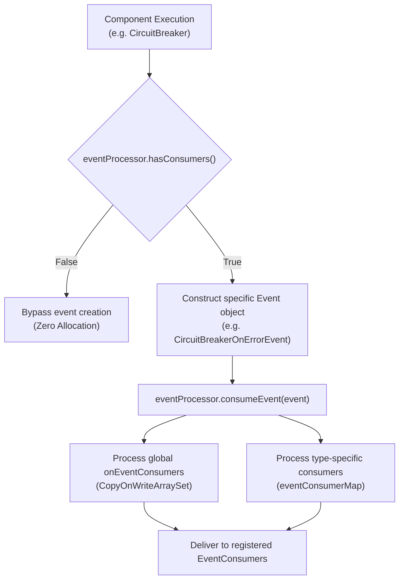
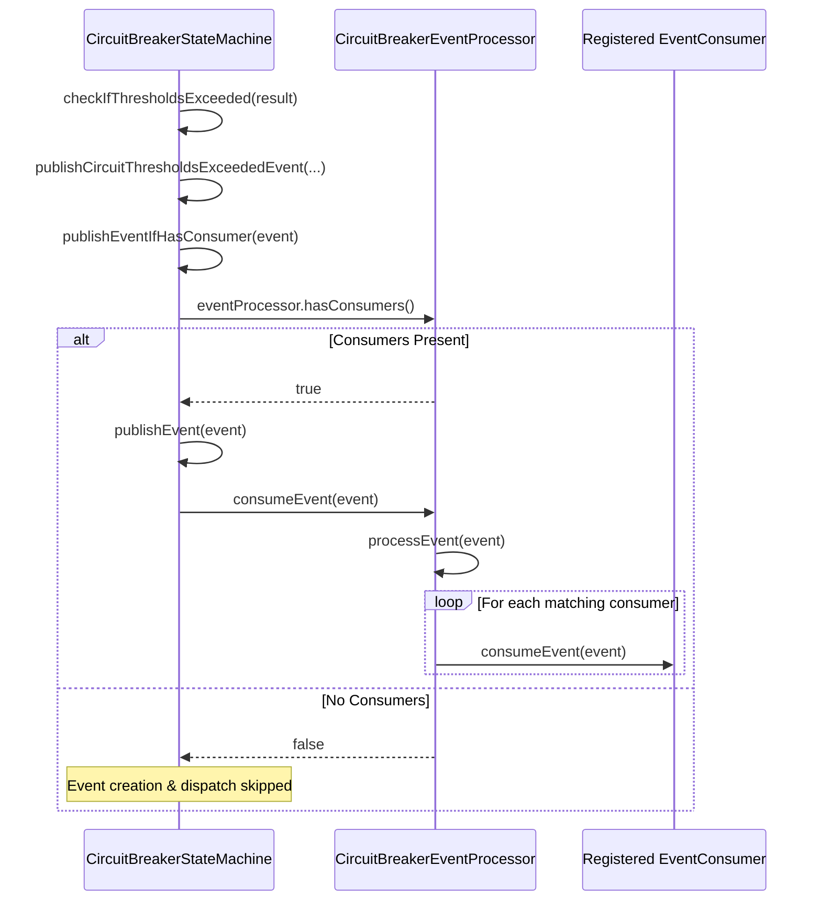

# Event Processor Model

<details>
<summary>Relevant source files</summary>

The following files were used as context for generating this wiki page:

- [resilience4j-circuitbreaker/src/main/java/io/github/resilience4j/circuitbreaker/internal/CircuitBreakerStateMachine.java](https://github.com/resilience4j/resilience4j/blob/main/resilience4j-circuitbreaker/src/main/java/io/github/resilience4j/circuitbreaker/internal/CircuitBreakerStateMachine.java)
- [README.adoc](https://github.com/resilience4j/resilience4j/blob/main/README.adoc)
- [resilience4j-retry/src/main/java/io/github/resilience4j/retry/internal/RetryImpl.java](https://github.com/resilience4j/resilience4j/blob/main/resilience4j-retry/src/main/java/io/github/resilience4j/retry/internal/RetryImpl.java)
- [resilience4j-bulkhead/src/main/java/io/github/resilience4j/bulkhead/internal/FixedThreadPoolBulkhead.java](https://github.com/resilience4j/resilience4j/blob/main/resilience4j-bulkhead/src/main/java/io/github/resilience4j/bulkhead/internal/FixedThreadPoolBulkhead.java)
- [resilience4j-spring6/src/main/java/io/github/resilience4j/spring6/timelimiter/configure/TimeLimiterConfiguration.java](https://github.com/resilience4j/spring6/src/main/java/io/github/resilience4j/spring6/timelimiter/configure/TimeLimiterConfiguration.java)
- [resilience4j-micronaut/src/main/java/io/github/resilience4j/micronaut/bulkhead/ThreadPoolBulkheadFactory.java](https://github.com/resilience4j/resilience4j/blob/main/resilience4j-micronaut/src/main/java/io/github/resilience4j/micronaut/bulkhead/ThreadPoolBulkheadFactory.java)
- [resilience4j-spring6/src/main/java/io/github/resilience4j/spring6/bulkhead/configure/threadpool/ThreadPoolBulkheadConfiguration.java](https://github.com/resilience4j/spring6/src/main/java/io/github/resilience4j/spring6/bulkhead/configure/threadpool/ThreadPoolBulkheadConfiguration.java)
- [resilience4j-micronaut/src/main/java/io/github/resilience4j/micronaut/circuitbreaker/CircuitBreakerRegistryFactory.java](https://github.com/resilience4j/resilience4j/blob/main/resilience4j-micronaut/src/main/java/io/github/resilience4j/micronaut/circuitbreaker/CircuitBreakerRegistryFactory.java)
- [resilience4j-hedge/src/main/java/io/github/resilience4j/hedge/internal/HedgeImpl.java](https://github.com/resilience4j/resilience4j/blob/main/resilience4j-hedge/src/main/java/io/github/resilience4j/hedge/internal/HedgeImpl.java)
- [resilience4j-spring6/src/main/java/io/github/resilience4j/spring6/ratelimiter/configure/RateLimiterConfiguration.java](https://github.com/resilience4j/spring6/ratelimiter/configure/RateLimiterConfiguration.java)
- [resilience4j-hedge/src/main/java/io/github/resilience4j/hedge/internal/HedgeEventProcessor.java](https://github.com/resilience4j/hedge/internal/HedgeEventProcessor.java)
- [resilience4j-core/src/main/java/io/github/resilience4j/core/metrics/MetricsPublisher.java](https://github.com/resilience4j/resilience4j/blob/main/resilience4j-core/src/main/java/io/github/resilience4j/core/metrics/MetricsPublisher.java)
- [resilience4j-timelimiter/src/main/java/io/github/resilience4j/timelimiter/internal/TimeLimiterEventProcessor.java](https://github.com/resilience4j/resilience4j/blob/main/resilience4j-timelimiter/src/main/java/io/github/resilience4j/timelimiter/internal/TimeLimiterEventProcessor.java)
- [resilience4j-ratelimiter/src/main/java/io/github/resilience4j/ratelimiter/internal/RateLimiterEventProcessor.java](https://github.com/resilience4j/resilience4j/blob/main/resilience4j-ratelimiter/src/main/java/io/github/resilience4j/ratelimiter/internal/RateLimiterEventProcessor.java)
- [resilience4j-core/src/main/java/io/github/resilience4j/core/EventProcessor.java](https://github.com/resilience4j/resilience4j/blob/main/resilience4j-core/src/main/java/io/github/resilience4j/core/EventProcessor.java)
- [resilience4j-micrometer/src/main/java/io/github/resilience4j/micrometer/internal/TimerEventProcessor.java](https://github.com/resilience4j/resilience4j/blob/main/resilience4j-micrometer/src/main/java/io/github/resilience4j/micrometer/internal/TimerEventProcessor.java)
- [resilience4j-spring-boot4/src/main/java/io/github/resilience4j/springboot/circuitbreaker/monitoring/endpoint/CircuitBreakerServerSideEvent.java](https://github.com/resilience4j/resilience4j/blob/main/resilience4j-spring-boot4/src/main/java/io/github/resilience4j/springboot/circuitbreaker/monitoring/endpoint/CircuitBreakerServerSideEvent.java)
- [resilience4j-spring-boot3/src/main/java/io/github/resilience4j/springboot3/circuitbreaker/monitoring/endpoint/CircuitBreakerServerSideEvent.java](https://github.com/resilience4j/resilience4j/blob/main/resilience4j-spring-boot3/src/main/java/io/github/resilience4j/springboot3/circuitbreaker/monitoring/endpoint/CircuitBreakerServerSideEvent.java)
- [resilience4j-spring-boot3/src/main/java/io/github/resilience4j/springboot3/circuitbreaker/monitoring/endpoint/CircuitBreakerHystrixServerSideEvent.java](https://github.com/resilience4j/resilience4j/blob/main/resilience4j-spring-boot3/src/main/java/io/github/resilience4j/springboot3/circuitbreaker/monitoring/endpoint/CircuitBreakerHystrixServerSideEvent.java)
- [resilience4j-spring-boot4/src/main/java/io/github/resilience4j/springboot/circuitbreaker/monitoring/endpoint/CircuitBreakerHystrixServerSideEvent.java](https://github.com/resilience4j/resilience4j/blob/main/resilience4j-spring-boot4/src/main/java/io/github/resilience4j/springboot/circuitbreaker/monitoring/endpoint/CircuitBreakerHystrixServerSideEvent.java)
- [resilience4j-core/src/main/java/io/github/resilience4j/core/registry/CompositeRegistryEventConsumer.java](https://github.com/resilience4j/resilience4j/blob/main/resilience4j-core/src/main/java/io/github/resilience4j/core/registry/CompositeRegistryEventConsumer.java)
- [resilience4j-core/src/main/java/io/github/resilience4j/core/registry/AbstractRegistry.java](https://github.com/resilience4j/resilience4j/blob/main/resilience4j-core/src/main/java/io/github/resilience4j/core/registry/AbstractRegistry.java)
- [resilience4j-core/src/main/java/io/github/resilience4j/core/EventPublisher.java](https://github.com/resilience4j/resilience4j/blob/main/resilience4j-core/src/main/java/io/github/resilience4j/core/EventPublisher.java)
- [resilience4j-core/src/main/java/io/github/resilience4j/core/registry/RegistryEventConsumer.java](https://github.com/resilience4j/resilience4j/blob/main/resilience4j-core/src/main/java/io/github/resilience4j/core/registry/RegistryEventConsumer.java)
- [resilience4j-spring-boot3/src/main/java/io/github/resilience4j/springboot3/bulkhead/autoconfigure/AbstractBulkheadConfigurationOnMissingBean.java](https://github.com/resilience4j/resilience4j/blob/main/resilience4j-spring-boot3/src/main/java/io/github/resilience4j/springboot3/bulkhead/autoconfigure/AbstractBulkheadConfigurationOnMissingBean.java)
- [resilience4j-core/src/main/java/io/github/resilience4j/core/EventConsumer.java](https://github.com/resilience4j/resilience4j/blob/main/resilience4j-core/src/main/java/io/github/resilience4j/core/EventConsumer.java)
- [resilience4j-rxjava3/src/main/java/io/github/resilience4j/rxjava3/adapter/RxJava3Adapter.java](https://github.com/resilience4j/resilience4j/blob/main/resilience4j-rxjava3/src/main/java/io/github/resilience4j/rxjava3/adapter/RxJava3Adapter.java)
- [resilience4j-consumer/src/main/java/io/github/resilience4j/consumer/CircularEventConsumer.java](https://github.com/resilience4j/resilience4j/blob/main/resilience4j-consumer/src/main/java/io/github/resilience4j/consumer/CircularEventConsumer.java)
- [resilience4j-rxjava2/src/main/java/io/github/resilience4j/adapter/RxJava2Adapter.java](https://github.com/resilience4j/resilience4j/blob/main/resilience4j-rxjava2/src/main/java/io/github/resilience4j/adapter/RxJava2Adapter.java)
- [resilience4j-consumer/src/main/java/io/github/resilience4j/consumer/DefaultEventConsumerRegistry.java](https://github.com/resilience4j/resilience4j/blob/main/resilience4j-consumer/src/main/java/io/github/resilience4j/consumer/DefaultEventConsumerRegistry.java)
</details>

## Overview

The Event Processor Model forms the core event-driven monitoring and telemetry architecture across Resilience4j core resilience components such as CircuitBreaker, Retry, Bulkhead, TimeLimiter, RateLimiter, and Hedge. It provides a non-blocking, thread-safe publishing and subscription mechanism that allows applications to observe operational state transitions, execution successes, failures, rejections, and timeouts in real time without impacting execution performance.

Sources: [README.adoc:564-587](https://github.com/resilience4j/resilience4j/blob/main/README.adoc#L564-L587)

At the center of this model is `EventProcessor<T>`, a generic infrastructure class implemented in `resilience4j-core`. Each resilience component subclasses `EventProcessor` to specialize event routing for its domain-specific event types while implementing module-specific `EventPublisher` interfaces. For instance, `CircuitBreakerStateMachine` embeds a `CircuitBreakerEventProcessor` that implements both `EventConsumer<CircuitBreakerEvent>` and `EventPublisher`, exposing fluent methods like `onSuccess()`, `onError()`, and `onStateTransition()`.

Sources: [resilience4j-circuitbreaker/src/main/java/io/github/resilience4j/circuitbreaker/internal/CircuitBreakerStateMachine.java:520-592](https://github.com/resilience4j/resilience4j/blob/main/resilience4j-circuitbreaker/src/main/java/io/github/resilience4j/circuitbreaker/internal/CircuitBreakerStateMachine.java#L520-L592)

A critical design decision in the Resilience4j event model is avoiding performance overhead when no consumers are registered. Before instantiating or publishing any event, resilience components invoke `eventProcessor.hasConsumers()`. If no consumers are registered, event object creation and allocation are completely bypassed. When consumers are active, events are dispatched concurrently using lock-free data structures (`CopyOnWriteArraySet` and `ConcurrentHashMap`), ensuring thread safety and preventing consumer registration deadlocks during high-throughput failure recovery operations.

Sources: [resilience4j-core/src/main/java/io/github/resilience4j/core/EventProcessor.java:26-75](https://github.com/resilience4j/resilience4j/blob/main/resilience4j-core/src/main/java/io/github/resilience4j/core/EventProcessor.java#L26-L75), [resilience4j-circuitbreaker/src/main/java/io/github/resilience4j/circuitbreaker/internal/CircuitBreakerStateMachine.java:386-394](https://github.com/resilience4j/resilience4j/blob/main/resilience4j-circuitbreaker/src/main/java/io/github/resilience4j/circuitbreaker/internal/CircuitBreakerStateMachine.java#L386-L394)



Sources: [resilience4j-core/src/main/java/io/github/resilience4j/core/EventProcessor.java:26-75](https://github.com/resilience4j/resilience4j/blob/main/resilience4j-core/src/main/java/io/github/resilience4j/core/EventProcessor.java#L26-L75)

## Core Base Architecture: `EventProcessor<T>`

The `io.github.resilience4j.core.EventProcessor<T>` class manages two distinct sets of event listeners: global listeners registered via `onEvent(EventConsumer<T>)` that receive every emitted event, and type-specific listeners indexed by the fully qualified class name of the event type.

Sources: [resilience4j-core/src/main/java/io/github/resilience4j/core/EventProcessor.java:26-30](https://github.com/resilience4j/resilience4j/blob/main/resilience4j-core/src/main/java/io/github/resilience4j/core/EventProcessor.java#L26-L30)

The internal data structures are optimized for concurrent read-heavy access patterns common in monitoring: `onEventConsumers` is a `CopyOnWriteArraySet<EventConsumer<T>>` storing global consumers, and `eventConsumerMap` is a `ConcurrentHashMap<String, CopyOnWriteArraySet<EventConsumer<T>>>` mapping event class names to specific consumer sets.

Sources: [resilience4j-core/src/main/java/io/github/resilience4j/core/EventProcessor.java:28-29](https://github.com/resilience4j/resilience4j/blob/main/resilience4j-core/src/main/java/io/github/resilience4j/core/EventProcessor.java#L28-L29)

When `processEvent(E event)` executes, it checks `onEventConsumers` and iterates through them if non-empty. Next, it looks up `event.getClass().getName()` in `eventConsumerMap` and dispatches the event to any matching type-specific consumers.

Sources: [resilience4j-core/src/main/java/io/github/resilience4j/core/EventProcessor.java:61-75](https://github.com/resilience4j/resilience4j/blob/main/resilience4j-core/src/main/java/io/github/resilience4j/core/EventProcessor.java#L61-L75)

```java
public class EventProcessor<T> implements EventPublisher<T> {
    final Set<EventConsumer<T>> onEventConsumers = new CopyOnWriteArraySet<>();
    final ConcurrentHashMap<String, CopyOnWriteArraySet<EventConsumer<T>>> eventConsumerMap = new ConcurrentHashMap<>();

    public boolean hasConsumers() {
        return !onEventConsumers.isEmpty() || !eventConsumerMap.isEmpty();
    }

    public <E extends T> boolean processEvent(E event) {
        boolean consumed = false;

        if (!onEventConsumers.isEmpty()) {
            for (EventConsumer<T> c : onEventConsumers) c.consumeEvent(event);
            consumed = true;
        }

        CopyOnWriteArraySet<EventConsumer<T>> set = eventConsumerMap.get(event.getClass().getName());
        if (set != null && !set.isEmpty()) {
            for (EventConsumer<T> c : set) c.consumeEvent(event);
            consumed = true;
        }
        return consumed;
    }
}
```

Sources: [resilience4j-core/src/main/java/io/github/resilience4j/core/EventProcessor.java:26-75](https://github.com/resilience4j/resilience4j/blob/main/resilience4j-core/src/main/java/io/github/resilience4j/core/EventProcessor.java#L26-L75)

> [!NOTE]
> `hasConsumers()` directly inspects `onEventConsumers.isEmpty()` and `eventConsumerMap.isEmpty()` rather than using a cached boolean flag. This guarantees accuracy even if runtime registration or unregistration occurs concurrently.

Sources: [resilience4j-core/src/main/java/io/github/resilience4j/core/EventProcessor.java:38-41](https://github.com/resilience4j/resilience4j/blob/main/resilience4j-core/src/main/java/io/github/resilience4j/core/EventProcessor.java#L38-L41)

## Component-Specific Event Processors

Each resilience module defines a private or internal subclass of `EventProcessor` that implements module-specific publisher interfaces and registers consumers against event class names.

Sources: [resilience4j-circuitbreaker/src/main/java/io/github/resilience4j/circuitbreaker/internal/CircuitBreakerStateMachine.java:520-522](https://github.com/resilience4j/resilience4j/blob/main/resilience4j-circuitbreaker/src/main/java/io/github/resilience4j/circuitbreaker/internal/CircuitBreakerStateMachine.java#L520-L522), [resilience4j-retry/src/main/java/io/github/resilience4j/retry/internal/RetryImpl.java:440-441](https://github.com/resilience4j/resilience4j/blob/main/resilience4j-retry/src/main/java/io/github/resilience4j/retry/internal/RetryImpl.java#L440-L441)

- **CircuitBreaker**: `CircuitBreakerEventProcessor` registers listeners for success, error, state transition, reset, ignored error, call not permitted, failure rate exceeded, and slow call rate exceeded events.
- **Retry**: `RetryEventProcessor` registers listeners for retry attempts, successes, errors, and ignored errors.

Sources: [resilience4j-circuitbreaker/src/main/java/io/github/resilience4j/circuitbreaker/internal/CircuitBreakerStateMachine.java:524-587](https://github.com/resilience4j/resilience4j/blob/main/resilience4j-circuitbreaker/src/main/java/io/github/resilience4j/circuitbreaker/internal/CircuitBreakerStateMachine.java#L524-L587), [resilience4j-retry/src/main/java/io/github/resilience4j/retry/internal/RetryImpl.java:449-471](https://github.com/resilience4j/resilience4j/blob/main/resilience4j-retry/src/main/java/io/github/resilience4j/retry/internal/RetryImpl.java#L449-L471)

- **Bulkhead**: `BulkheadEventProcessor` manages permitted, rejected, and finished call events.
- **TimeLimiter**: `TimeLimiterEventProcessor` manages success, error, and timeout events.

Sources: [resilience4j-bulkhead/src/main/java/io/github/resilience4j/bulkhead/internal/FixedThreadPoolBulkhead.java:264-289](https://github.com/resilience4j/resilience4j/blob/main/resilience4j-bulkhead/src/main/java/io/github/resilience4j/bulkhead/internal/FixedThreadPoolBulkhead.java#L264-L289), [resilience4j-timelimiter/src/main/java/io/github/resilience4j/timelimiter/internal/TimeLimiterEventProcessor.java:30-57](https://github.com/resilience4j/resilience4j/blob/main/resilience4j-timelimiter/src/main/java/io/github/resilience4j/timelimiter/internal/TimeLimiterEventProcessor.java#L30-L57)

- **RateLimiter**: `RateLimiterEventProcessor` manages success and failure acquisition events.
- **Hedge**: `HedgeEventProcessor` tracks primary and secondary successes and failures.

Sources: [resilience4j-ratelimiter/src/main/java/io/github/resilience4j/ratelimiter/internal/RateLimiterEventProcessor.java:28-49](https://github.com/resilience4j/resilience4j/blob/main/resilience4j-ratelimiter/src/main/java/io/github/resilience4j/ratelimiter/internal/RateLimiterEventProcessor.java#L28-L49), [resilience4j-hedge/src/main/java/io/github/resilience4j/hedge/internal/HedgeEventProcessor.java:27-61](https://github.com/resilience4j/hedge/internal/HedgeEventProcessor.java#L27-L61)

The following table details the event processors across core modules:

| Module | Event Processor Class | Implemented Publisher Interface | Key Event Types |
| :--- | :--- | :--- | :--- |
| **CircuitBreaker** | `CircuitBreakerEventProcessor` | `EventPublisher` | `CircuitBreakerOnSuccessEvent`, `CircuitBreakerOnErrorEvent`, `CircuitBreakerOnStateTransitionEvent` |
| **Retry** | `RetryEventProcessor` | `EventPublisher` | `RetryOnRetryEvent`, `RetryOnSuccessEvent`, `RetryOnErrorEvent`, `RetryOnIgnoredErrorEvent` |
| **Bulkhead** | `BulkheadEventProcessor` | `ThreadPoolBulkheadEventPublisher` | `BulkheadOnCallPermittedEvent`, `BulkheadOnCallRejectedEvent`, `BulkheadOnCallFinishedEvent` |
| **TimeLimiter** | `TimeLimiterEventProcessor` | `TimeLimiter.EventPublisher` | `TimeLimiterOnSuccessEvent`, `TimeLimiterOnErrorEvent`, `TimeLimiterOnTimeoutEvent` |
| **RateLimiter** | `RateLimiterEventProcessor` | `RateLimiter.EventPublisher` | `RateLimiterOnSuccessEvent`, `RateLimiterOnFailureEvent` |
| **Hedge** | `HedgeEventProcessor` | `Hedge.EventPublisher` | `HedgeOnPrimarySuccessEvent`, `HedgeOnPrimaryFailureEvent`, `HedgeOnSecondarySuccessEvent`, `HedgeOnSecondaryFailureEvent` |

Sources: [resilience4j-circuitbreaker/src/main/java/io/github/resilience4j/circuitbreaker/internal/CircuitBreakerStateMachine.java:520-592](https://github.com/resilience4j/resilience4j/blob/main/resilience4j-circuitbreaker/src/main/java/io/github/resilience4j/circuitbreaker/internal/CircuitBreakerStateMachine.java#L520-L592), [resilience4j-retry/src/main/java/io/github/resilience4j/retry/internal/RetryImpl.java:440-472](https://github.com/resilience4j/retry/internal/RetryImpl.java#L440-L472), [resilience4j-bulkhead/src/main/java/io/github/resilience4j/bulkhead/internal/FixedThreadPoolBulkhead.java:264-295](https://github.com/resilience4j/resilience4j/blob/main/resilience4j-bulkhead/src/main/java/io/github/resilience4j/bulkhead/internal/FixedThreadPoolBulkhead.java#L264-L295), [resilience4j-timelimiter/src/main/java/io/github/resilience4j/timelimiter/internal/TimeLimiterEventProcessor.java:30-58](https://github.com/resilience4j/timelimiter/internal/TimeLimiterEventProcessor.java#L30-L58), [resilience4j-ratelimiter/src/main/java/io/github/resilience4j/ratelimiter/internal/RateLimiterEventProcessor.java:28-50](https://github.com/resilience4j/ratelimiter/internal/RateLimiterEventProcessor.java#L28-L50), [resilience4j-hedge/src/main/java/io/github/resilience4j/hedge/internal/HedgeEventProcessor.java:27-62](https://github.com/resilience4j/hedge/internal/HedgeEventProcessor.java#L27-L62)

## Event Publication Control Flow & Execution Walkthrough

When an operation executes and completes or fails within a resilience component, the event publishing check follows a strict execution path to avoid object allocation overhead when telemetry consumers are absent.

Sources: [resilience4j-circuitbreaker/src/main/java/io/github/resilience4j/circuitbreaker/internal/CircuitBreakerStateMachine.java:386-394](https://github.com/resilience4j/resilience4j/blob/main/resilience4j-circuitbreaker/src/main/java/io/github/resilience4j/circuitbreaker/internal/CircuitBreakerStateMachine.java#L386-L394)

The verified call chain for publishing threshold-exceeded events traces through `checkIfThresholdsExceeded` → `publishCircuitThresholdsExceededEvent` → `publishCircuitFailureRateExceededEvent` → `publishEventIfHasConsumer` → `hasConsumers`:

Sources: [resilience4j-circuitbreaker/src/main/java/io/github/resilience4j/circuitbreaker/internal/CircuitBreakerStateMachine.java:447-463](https://github.com/resilience4j/resilience4j/blob/main/resilience4j-circuitbreaker/src/main/java/io/github/resilience4j/circuitbreaker/internal/CircuitBreakerStateMachine.java#L447-L463), [resilience4j-circuitbreaker/src/main/java/io/github/resilience4j/circuitbreaker/internal/CircuitBreakerStateMachine.java:1187-1194](https://github.com/resilience4j/circuitbreaker/internal/CircuitBreakerStateMachine.java#L1187-L1194)

1. **Threshold Evaluation**: `checkIfThresholdsExceeded` determines that failure rate or slow call rate thresholds have been breached.
2. **Event Publishing Helper**: `publishCircuitThresholdsExceededEvent` checks `Result.hasFailureRateExceededThreshold(result)` and calls `publishCircuitFailureRateExceededEvent`.
3. **Consumer Guard**: `publishEventIfHasConsumer` executes `eventProcessor.hasConsumers()` to verify listener registration before allocating event instances.
4. **Dispatch**: If active consumers exist, `publishEvent` forwards the event to `eventProcessor.consumeEvent(event)`.

Sources: [resilience4j-circuitbreaker/src/main/java/io/github/resilience4j/circuitbreaker/internal/CircuitBreakerStateMachine.java:386-407](https://github.com/resilience4j/resilience4j/blob/main/resilience4j-circuitbreaker/src/main/java/io/github/resilience4j/circuitbreaker/internal/CircuitBreakerStateMachine.java#L386-L407), [resilience4j-circuitbreaker/src/main/java/io/github/resilience4j/circuitbreaker/internal/CircuitBreakerStateMachine.java:447-464](https://github.com/resilience4j/circuitbreaker/internal/CircuitBreakerStateMachine.java#L447-L464)



Sources: [resilience4j-circuitbreaker/src/main/java/io/github/resilience4j/circuitbreaker/internal/CircuitBreakerStateMachine.java:386-407](https://github.com/resilience4j/resilience4j/blob/main/resilience4j-circuitbreaker/src/main/java/io/github/resilience4j/circuitbreaker/internal/CircuitBreakerStateMachine.java#L386-L407), [resilience4j-circuitbreaker/src/main/java/io/github/resilience4j/circuitbreaker/internal/CircuitBreakerStateMachine.java:447-464](https://github.com/resilience4j/circuitbreaker/internal/CircuitBreakerStateMachine.java#L447-L464)

## Integration with Event Consumer Registries and Circular Buffers

To support monitoring endpoints (such as Spring Boot Actuator and Micrometer endpoints), Resilience4j integrates `EventProcessor` with `EventConsumerRegistry` and `CircularEventConsumer`.

Sources: [resilience4j-consumer/src/main/java/io/github/resilience4j/consumer/CircularEventConsumer.java:28-48](https://github.com/resilience4j/consumer/CircularEventConsumer.java#L28-L48), [resilience4j-spring6/src/main/java/io/github/resilience4j/spring6/timelimiter/configure/TimeLimiterConfiguration.java:116-126](https://github.com/resilience4j/spring6/timelimiter/configure/TimeLimiterConfiguration.java#L116-L126)

When registries are initialized in frameworks like Spring Boot or Micronaut (e.g., `TimeLimiterConfiguration` or `ThreadPoolBulkheadFactory`), registry event publishers listen for entry additions, replacements, and removals. When a new resilience instance is added to a registry, an `EntryAddedEvent` fires.

Sources: [resilience4j-spring6/src/main/java/io/github/resilience4j/spring6/timelimiter/configure/TimeLimiterConfiguration.java:178-185](https://github.com/resilience4j/spring6/timelimiter/configure/TimeLimiterConfiguration.java#L178-L185)

The configuration retrieves or defaults the `eventConsumerBufferSize` (typically 100) and creates a `CircularEventConsumer` via `EventConsumerRegistry.createEventConsumer()`, registering it against the instance's `EventPublisher`.

Sources: [resilience4j-spring6/src/main/java/io/github/resilience4j/spring6/timelimiter/configure/TimeLimiterConfiguration.java:191-198](https://github.com/resilience4j/spring6/timelimiter/configure/TimeLimiterConfiguration.java#L191-L198)

```java
private static void registerEventConsumer(TimeLimiterRegistry timeLimiterRegistry,
                                          EventConsumerRegistry<TimeLimiterEvent> eventConsumerRegistry,
                                          TimeLimiterConfigurationProperties properties) {
    timeLimiterRegistry.getEventPublisher()
        .onEntryAdded(event -> registerEventConsumer(eventConsumerRegistry, event.getAddedEntry(), properties))
        .onEntryReplaced(event -> registerEventConsumer(eventConsumerRegistry, event.getNewEntry(), properties))
        .onEntryRemoved(event -> unregisterEventConsumer(eventConsumerRegistry, event.getRemovedEntry()));
}
```

Sources: [resilience4j-spring6/src/main/java/io/github/resilience4j/spring6/timelimiter/configure/TimeLimiterConfiguration.java:178-185](https://github.com/resilience4j/spring6/timelimiter/configure/TimeLimiterConfiguration.java#L178-L185)

> [!WARNING]
> If `eventConsumerBufferSize` is set too low under high concurrency, older telemetry events will be evicted from the `CircularFifoBuffer` before actuator endpoints or monitoring tools poll them. Ensure sizing matches scraping intervals.

Sources: [resilience4j-spring6/src/main/java/io/github/resilience4j/spring6/timelimiter/configure/TimeLimiterConfiguration.java:191-198](https://github.com/resilience4j/spring6/timelimiter/configure/TimeLimiterConfiguration.java#L191-L198)

## Reactive Streams Adapters

Resilience4j provides adapters for RxJava2, RxJava3, and Project Reactor (`resilience4j-reactor`), allowing event streams to be seamlessly transformed into reactive publishers (`Observable`, `Flowable`, or `Flux`).

Sources: [README.adoc:589-598](https://github.com/resilience4j/resilience4j/blob/main/README.adoc#L589-L598), [resilience4j-spring-boot4/src/main/java/io/github/resilience4j/springboot/circuitbreaker/monitoring/endpoint/CircuitBreakerServerSideEvent.java:60-65](https://github.com/resilience4j/spring-boot4/src/main/java/io/github/resilience4j/springboot/circuitbreaker/monitoring/endpoint/CircuitBreakerServerSideEvent.java#L60-L65)

The adapter bridges `EventPublisher` by registering an `onEvent` consumer that pushes incoming events into a serialized processor (such as `PublishProcessor` or `PublishSubject`).

Sources: [resilience4j-rxjava3/src/main/java/io/github/resilience4j/rxjava3/adapter/RxJava3Adapter.java:20-25](https://github.com/resilience4j/rxjava3/java/io/github/resilience4j/rxjava3/adapter/RxJava3Adapter.java#L20-L25), [resilience4j-rxjava2/src/main/java/io/github/resilience4j/adapter/RxJava2Adapter.java:20-25](https://github.com/resilience4j/rxjava2/java/io/github/resilience4j/adapter/RxJava2Adapter.java#L20-L25)

```java
public class RxJava3Adapter {
    public static <T> Flowable<T> toFlowable(EventPublisher<T> eventPublisher) {
        PublishProcessor<T> publishProcessor = PublishProcessor.create();
        FlowableProcessor<T> flowableProcessor = publishProcessor.toSerialized();
        eventPublisher.onEvent(flowableProcessor::onNext);
        return flowableProcessor;
    }
}
```

Sources: [resilience4j-rxjava3/src/main/java/io/github/resilience4j/rxjava3/adapter/RxJava3Adapter.java:11-25](https://github.com/resilience4j/rxjava3/java/io/github/resilience4j/rxjava3/adapter/RxJava3Adapter.java#L11-L25)

Spring Boot Actuator endpoints use these reactive adapters to stream events over Server-Sent Events (SSE). For instance, `CircuitBreakerServerSideEvent` converts a circuit breaker's event publisher into a Reactor `Flux`, filtering by name or event type and merging with heartbeat ping streams:

Sources: [resilience4j-spring-boot4/src/main/java/io/github/resilience4j/springboot/circuitbreaker/monitoring/endpoint/CircuitBreakerServerSideEvent.java:58-65](https://github.com/resilience4j/spring-boot4/src/main/java/io/github/resilience4j/springboot/circuitbreaker/monitoring/endpoint/CircuitBreakerServerSideEvent.java#L58-L65)

```java
@ReadOperation(produces = TEXT_EVENT_STREAM_VALUE)
public Flux<ServerSentEvent<String>> getEventsFilteredByCircuitBreakerName(@Selector String name) {
    CircuitBreaker circuitBreaker = getCircuitBreaker(name);
    Flux<CircuitBreakerEvent> eventStream = toFlux(circuitBreaker.getEventPublisher());
    return Flux.merge(publishEvents(eventStream), getHeartbeatStream());
}
```

Sources: [resilience4j-spring-boot4/src/main/java/io/github/resilience4j/springboot/circuitbreaker/monitoring/endpoint/CircuitBreakerServerSideEvent.java:67-73](https://github.com/resilience4j/spring-boot4/src/main/java/io/github/resilience4j/springboot/circuitbreaker/monitoring/endpoint/CircuitBreakerServerSideEvent.java#L67-L73)

## Design Trade-Offs

The following table summarizes the architectural design choices inherent in the Resilience4j Event Processor Model:

| Design Choice | Benefit | Cost |
| :--- | :--- | :--- |
| **`hasConsumers()` Guard Check** | Zero object allocation overhead when telemetry listeners are absent. | Minor branching overhead during method completion. |
| **`CopyOnWriteArraySet` for Listeners** | Thread-safe iteration without locking during event dispatch. | Higher memory write overhead when registering or unregistering consumers frequently. |
| **`ConcurrentHashMap` for Type Mapping** | Concurrent registration of type-specific consumers across threads. | Minor map lookup overhead per event emission. |
| **Circular Buffer Buffering** | Bounded memory consumption for actuator and health indicator event histories. | Events beyond buffer capacity are silently dropped (lossy history). |

Sources: [resilience4j-core/src/main/java/io/github/resilience4j/core/EventProcessor.java:26-75](https://github.com/resilience4j/resilience4j/blob/main/resilience4j-core/src/main/java/io/github/resilience4j/core/EventProcessor.java#L26-L75), [resilience4j-consumer/src/main/java/io/github/resilience4j/consumer/CircularEventConsumer.java:31-48](https://github.com/resilience4j/consumer/CircularEventConsumer.java#L31-L48)

## Full Worked Usage Example

The following complete example demonstrates how to create a CircuitBreaker, attach event consumers directly to its event publisher, and convert the event stream into a reactive stream using RxJava:

Sources: [README.adoc:576-598](https://github.com/resilience4j/resilience4j/blob/main/README.adoc#L576-L598)

```java
import io.github.resilience4j.circuitbreaker.CircuitBreaker;
import io.github.resilience4j.circuitbreaker.event.CircuitBreakerOnSuccessEvent;
import io.github.resilience4j.circuitbreaker.event.CircuitBreakerOnErrorEvent;
import io.github.resilience4j.adapter.RxJava2Adapter;
import io.reactivex.Observable;
import org.slf4j.Logger;
import org.slf4j.LoggerFactory;

public class EventProcessorDemo {
    private static final Logger logger = LoggerFactory.getLogger(EventProcessorDemo.class);

    public static void runDemo() {
        // 1. Create a CircuitBreaker instance
        CircuitBreaker circuitBreaker = CircuitBreaker.ofDefaults("myService");

        // 2. Register lambda consumers via the EventPublisher interface
        circuitBreaker.getEventPublisher()
            .onSuccess(event -> logger.info("Successful call duration: {} ms", event.getElapsedDuration().toMillis()))
            .onError(event -> logger.warn("Failed call with exception: {}", event.getThrowable().getMessage()))
            .onStateTransition(event -> logger.info("State changed from {} to {}", event.getStateTransition().getFromState(), event.getStateTransition().getToState()));

        // 3. Convert EventPublisher to an RxJava Observable for reactive filtering
        Observable<io.github.resilience4j.circuitbreaker.event.CircuitBreakerEvent> eventObservable = 
            RxJava2Adapter.toObservable(circuitBreaker.getEventPublisher());

        eventObservable
            .filter(event -> event.getEventType() == io.github.resilience4j.circuitbreaker.event.CircuitBreakerEvent.Type.ERROR)
            .subscribe(event -> logger.error("Reactive stream caught error event for: {}", event.getCircuitBreakerName()));

        // 4. Execute a protected supplier
        String result = circuitBreaker.executeSupplier(() -> "Hello from backend");
        logger.info("Execution result: {}", result);
    }
}
```

Sources: [README.adoc:578-598](https://github.com/resilience4j/resilience4j/blob/main/README.adoc#L578-L598), [resilience4j-circuitbreaker/src/main/java/io/github/resilience4j/circuitbreaker/internal/CircuitBreakerStateMachine.java:524-547](https://github.com/resilience4j/resilience4j/blob/main/resilience4j-circuitbreaker/src/main/java/io/github/resilience4j/circuitbreaker/internal/CircuitBreakerStateMachine.java#L524-L547), [resilience4j-rxjava2/src/main/java/io/github/resilience4j/adapter/RxJava2Adapter.java:34-39](https://github.com/resilience4j/resilience4j/blob/main/resilience4j-rxjava2/src/main/java/io/github/resilience4j/adapter/RxJava2Adapter.java#L34-L39)

## Related

- [[Event Consumer Registries]]

