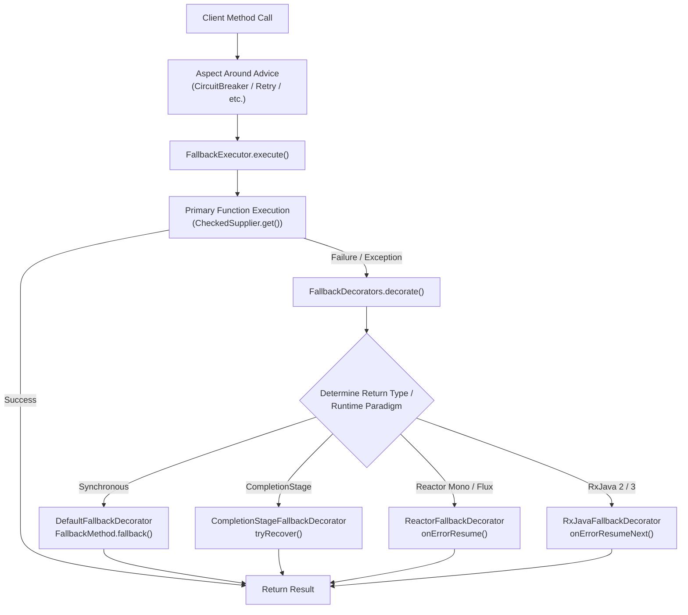
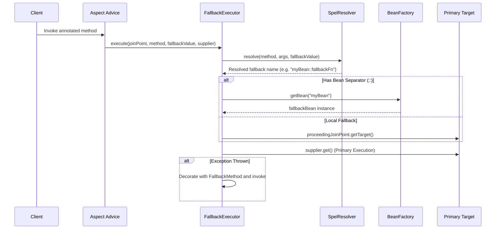

# Fallback Method Execution

<details>
<summary>Relevant source files</summary>

The following files were used as context for generating this wiki page:

- [resilience4j-spring6/src/main/java/io/github/resilience4j/spring6/fallback/FallbackMethod.java](https://github.com/resilience4j/resilience4j/blob/main/resilience4j-spring6/src/main/java/io/github/resilience4j/spring6/fallback/FallbackMethod.java)
- [resilience4j-spring6/src/main/java/io/github/resilience4j/spring6/bulkhead/configure/BulkheadAspect.java](https://github.com/resilience4j/resilience4j/blob/main/resilience4j-spring6/src/main/java/io/github/resilience4j/spring6/bulkhead/configure/BulkheadAspect.java)
- [resilience4j-spring6/src/main/java/io/github/resilience4j/spring6/retry/configure/RetryAspect.java](https://github.com/resilience4j/resilience4j/blob/main/resilience4j-spring6/src/main/java/io/github/resilience4j/spring6/retry/configure/RetryAspect.java)
- [resilience4j-spring6/src/main/java/io/github/resilience4j/spring6/circuitbreaker/configure/CircuitBreakerAspect.java](https://github.com/resilience4j/resilience4j/blob/main/resilience4j-spring6/src/main/java/io/github/resilience4j/spring6/circuitbreaker/configure/CircuitBreakerAspect.java)
- [resilience4j-feign/README.adoc](https://github.com/resilience4j/resilience4j/blob/main/resilience4j-feign/README.adoc)
- [resilience4j-spring6/src/main/java/io/github/resilience4j/spring6/ratelimiter/configure/RateLimiterAspect.java](https://github.com/resilience4j/resilience4j/blob/main/resilience4j-spring6/src/main/java/io/github/resilience4j/spring6/ratelimiter/configure/RateLimiterAspect.java)
- [resilience4j-micronaut/src/main/java/io/github/resilience4j/micronaut/circuitbreaker/CircuitBreakerInterceptor.java](https://github.com/resilience4j/resilience4j/blob/main/resilience4j-micronaut/src/main/java/io/github/resilience4j/micronaut/circuitbreaker/CircuitBreakerInterceptor.java)
- [resilience4j-micronaut/src/main/java/io/github/resilience4j/micronaut/retry/RetryInterceptor.java](https://github.com/resilience4j/resilience4j/blob/main/resilience4j-micronaut/src/main/java/io/github/resilience4j/micronaut/retry/RetryInterceptor.java)
- [resilience4j-feign/src/main/java/io/github/resilience4j/feign/FallbackFactory.java](https://github.com/resilience4j/resilience4j/blob/main/resilience4j-feign/src/main/java/io/github/resilience4j/feign/FallbackFactory.java)
- [resilience4j-spring6/src/main/java/io/github/resilience4j/spring6/fallback/FallbackExecutor.java](https://github.com/resilience4j/resilience4j/blob/main/resilience4j-spring6/src/main/java/io/github/resilience4j/spring6/fallback/FallbackExecutor.java)
- [resilience4j-spring6/src/main/java/io/github/resilience4j/spring6/fallback/RxJava3FallbackDecorator.java](https://github.com/resilience4j/resilience4j/blob/main/resilience4j-spring6/src/main/java/io/github/resilience4j/spring6/fallback/RxJava3FallbackDecorator.java)
- [resilience4j-feign/src/main/java/io/github/resilience4j/feign/DefaultFallbackHandler.java](https://github.com/resilience4j/resilience4j/blob/main/resilience4j-feign/src/main/java/io/github/resilience4j/feign/DefaultFallbackHandler.java)
- [resilience4j-spring6/src/main/java/io/github/resilience4j/spring6/fallback/ReactorFallbackDecorator.java](https://github.com/resilience4j/spring6/fallback/ReactorFallbackDecorator.java)
- [resilience4j-spring6/src/main/java/io/github/resilience4j/spring6/fallback/DefaultFallbackDecorator.java](https://github.com/resilience4j/spring6/fallback/DefaultFallbackDecorator.java)
- [resilience4j-spring6/src/main/java/io/github/resilience4j/spring6/fallback/RxJava2FallbackDecorator.java](https://github.com/resilience4j/spring6/fallback/RxJava2FallbackDecorator.java)
- [resilience4j-spring6/src/main/java/io/github/resilience4j/spring6/fallback/configure/FallbackConfiguration.java](https://github.com/resilience4j/resilience4j/blob/main/resilience4j-spring6/src/main/java/io/github/resilience4j/spring6/fallback/configure/FallbackConfiguration.java)
- [resilience4j-spring6/src/main/java/io/github/resilience4j/spring6/fallback/CompletionStageFallbackDecorator.java](https://github.com/resilience4j/spring6/fallback/CompletionStageFallbackDecorator.java)
- [resilience4j-spring6/src/main/java/io/github/resilience4j/spring6/fallback/FallbackDecorators.java](https://github.com/resilience4j/spring6/fallback/FallbackDecorators.java)
- [resilience4j-reactor/src/main/java/io/github/resilience4j/reactor/ReactorOperatorFallbackDecorator.java](https://github.com/resilience4j/reactor/src/main/java/io/github/resilience4j/reactor/ReactorOperatorFallbackDecorator.java)
- [resilience4j-spring-boot3/src/main/java/io/github/resilience4j/springboot3/fallback/autoconfigure/FallbackConfigurationOnMissingBean.java](https://github.com/resilience4j/resilience4j/blob/main/resilience4j-spring-boot3/src/main/java/io/github/resilience4j/springboot3/fallback/autoconfigure/FallbackConfigurationOnMissingBean.java)
- [resilience4j-spring-boot4/src/main/java/io/github/resilience4j/springboot/fallback/autoconfigure/FallbackConfigurationOnMissingBean.java](https://github.com/resilience4j/resilience4j/blob/main/resilience4j-spring-boot4/src/main/java/io/github/resilience4j/springboot/fallback/autoconfigure/FallbackConfigurationOnMissingBean.java)
- [resilience4j-spring6/src/main/java/io/github/resilience4j/spring6/circuitbreaker/configure/RxJava3CircuitBreakerAspectExt.java](https://github.com/resilience4j/resilience4j/blob/main/resilience4j-spring6/src/main/java/io/github/resilience4j/spring6/circuitbreaker/configure/RxJava3CircuitBreakerAspectExt.java)
- [resilience4j-micronaut/src/main/java/io/github/resilience4j/micronaut/BaseInterceptor.java](https://github.com/resilience4j/resilience4j/blob/main/resilience4j-micronaut/src/main/java/io/github/resilience4j/micronaut/BaseInterceptor.java)
- [resilience4j-feign/src/main/java/io/github/resilience4j/feign/FallbackDecorator.java](https://github.com/resilience4j/feign/src/main/java/io/github/resilience4j/feign/FallbackDecorator.java)
- [resilience4j-spring6/src/main/java/io/github/resilience4j/spring6/retry/configure/RxJava3RetryAspectExt.java](https://github.com/resilience4j/spring6/retry/configure/RxJava3RetryAspectExt.java)
- [resilience4j-core/src/main/java/io/github/resilience4j/core/CallableUtils.java](https://github.com/resilience4j/core/CallableUtils.java)
- [resilience4j-feign/src/main/java/io/github/resilience4j/feign/FallbackHandler.java](https://github.com/resilience4j/feign/src/main/java/io/github/resilience4j/feign/FallbackHandler.java)
- [resilience4j-feign/src/main/java/io/github/resilience4j/feign/FeignDecorators.java](https://github.com/resilience4j/feign/src/main/java/io/github/resilience4j/feign/FeignDecorators.java)
- [resilience4j-spring6/src/main/java/io/github/resilience4j/spring6/fallback/FallbackDecorator.java](https://github.com/resilience4j/resilience4j/blob/main/resilience4j-spring6/src/main/java/io/github/resilience4j/spring6/fallback/FallbackDecorator.java)
- [resilience4j-micronaut/src/main/java/io/github/resilience4j/micronaut/util/ReactorPublisherExtension.java](https://github.com/resilience4j/micronaut/util/ReactorPublisherExtension.java)
</details>

## Overview

Fallback Method Execution in Resilience4j provides a seamless recovery mechanism when decorated operations fail due to exceptions, circuit breaker rejections, rate limiting, retries exhaustion, or bulkhead rejections. Rather than letting unhandled failures propagate directly to callers, Resilience4j intercepts execution exceptions and routes control to user-defined fallback handlers, fallback methods, or reactive recovery streams. This subsystem decouples core business logic from failure recovery strategies across multiple integration modules, including Spring AOP (`resilience4j-spring6`), Micronaut interceptors (`resilience4j-micronaut`), and OpenFeign decorators (`resilience4j-feign`).

Sources: [FallbackMethod.java:31-46](https://github.com/resilience4j/resilience4j/blob/main/resilience4j-spring6/src/main/java/io/github/resilience4j/spring6/fallback/FallbackMethod.java#L31-L46)

At its core, the fallback execution subsystem coordinates target method invocation contexts, signature matching reflection utilities, bean resolution syntax (`beanName::methodName`), and runtime-specific decorators capable of handling synchronous values, Java `CompletionStage`/`CompletableFuture` asynchronous promises, Project Reactor types (`Mono`, `Flux`), and RxJava reactive sources (`Observable`, `Single`, `Completable`, `Maybe`, `Flowable`). By integrating directly into aspect-oriented around-advice chains and feign capability pipes, fallback methods execute transparently while preserving parameter signatures and matching the most specific exception hierarchy available.

Sources: [BulkheadAspect.java:103-125](https://github.com/resilience4j/resilience4j/blob/main/resilience4j-spring6/src/main/java/io/github/resilience4j/spring6/bulkhead/configure/BulkheadAspect.java#L103-L125)

The design relies on specialized decorators (`FallbackDecorator` implementations) and executors (`FallbackExecutor`, `FallbackMethod`) that inspect return types and exception types at runtime, caching reflective method lookups in concurrent reference maps to maintain high throughput during failure conditions.

Sources: [FallbackConfiguration.java:32-71](https://github.com/resilience4j/resilience4j/blob/main/resilience4j-spring6/src/main/java/io/github/resilience4j/spring6/fallback/configure/FallbackConfiguration.java#L32-L71)

## Architecture and Execution Flow

The fallback mechanism operates as a wrapper layer surrounding primary business execution. When an annotated method (e.g., `@CircuitBreaker`, `@Retry`, `@RateLimiter`, `@Bulkhead`) is invoked, the surrounding aspect delegates primary execution to `FallbackExecutor.execute()`. If an exception or rejection occurs, the executor leverages `FallbackDecorators` to locate a matching `FallbackMethod` or reactive stream operator.

Sources: [FallbackExecutor.java:42-95](https://github.com/resilience4j/resilience4j/blob/main/resilience4j-spring6/src/main/java/io/github/resilience4j/spring6/fallback/FallbackExecutor.java#L42-L95)



Sources: [FallbackDecorators.java:42-46](https://github.com/resilience4j/resilience4j/blob/main/resilience4j-spring6/src/main/java/io/github/resilience4j/spring6/fallback/FallbackDecorators.java#L42-L46)

The fallback decorator chain evaluates the return type of the primary method at runtime to select the correct interception strategy.

Sources: [DefaultFallbackDecorator.java:32-43](https://github.com/resilience4j/resilience4j/blob/main/resilience4j-spring6/src/main/java/io/github/resilience4j/spring6/fallback/DefaultFallbackDecorator.java#L32-L43)

## `FallbackExecutor` and SpEL Resolution

`FallbackExecutor` serves as the central orchestration component in Spring applications. It resolves fallback method names dynamically using Spring Expression Language (SpEL) via `SpelResolver` and inspects the method signature for bean referencing syntax using the `::` separator.

Sources: [FallbackExecutor.java:42-47](https://github.com/resilience4j/resilience4j/blob/main/resilience4j-spring6/src/main/java/io/github/resilience4j/spring6/fallback/FallbackExecutor.java#L42-L47)

If a fallback method name contains `beanName::methodName`, `FallbackExecutor` retrieves the target bean from the Spring `BeanFactory`, supporting cross-bean fallback routing where the recovery logic resides in a separate helper component. 

Sources: [FallbackExecutor.java:56-77](https://github.com/resilience4j/resilience4j/blob/main/resilience4j-spring6/src/main/java/io/github/resilience4j/spring6/fallback/FallbackExecutor.java#L56-L77)

If no fallback method name is specified or resolved, the primary function executes directly without decoration.

Sources: [FallbackExecutor.java:90-94](https://github.com/resilience4j/resilience4j/blob/main/resilience4j-spring6/src/main/java/io/github/resilience4j/spring6/fallback/FallbackExecutor.java#L90-L94)

```java
String fallbackMethodName = spelResolver.resolve(method, proceedingJoinPoint.getArgs(), fallbackMethodValue);
```

Sources: [FallbackExecutor.java:43-43](https://github.com/resilience4j/resilience4j/blob/main/resilience4j-spring6/src/main/java/io/github/resilience4j/spring6/fallback/FallbackExecutor.java#L43-L43)



Sources: [FallbackExecutor.java:42-95](https://github.com/resilience4j/resilience4j/blob/main/resilience4j-spring6/src/main/java/io/github/resilience4j/spring6/fallback/FallbackExecutor.java#L42-L95)

## Reflection and Signature Matching (`FallbackMethod`)

The `FallbackMethod` class manages reflective invocation of fallback methods. It enforces strict signature compatibility between the original method and its fallback counterpart. 

Sources: [FallbackMethod.java:31-46](https://github.com/resilience4j/resilience4j/blob/main/resilience4j-spring6/src/main/java/io/github/resilience4j/spring6/fallback/FallbackMethod.java#L31-L46)

A valid fallback method must match the original method's return type (or a compatible assignable type) and accept identical parameter types, with an optional final parameter that is a subclass of `Throwable`. 

Sources: [FallbackMethod.java:132-152](https://github.com/resilience4j/resilience4j/blob/main/resilience4j-spring6/src/main/java/io/github/resilience4j/spring6/fallback/FallbackMethod.java#L132-L152)

When multiple fallback methods share the same name, `FallbackMethod` selects the most specific exception handler by walking up the exception's class hierarchy (`thrownClass != Object.class`).

Sources: [FallbackMethod.java:171-184](https://github.com/resilience4j/resilience4j/blob/main/resilience4j-spring6/src/main/java/io/github/resilience4j/spring6/fallback/FallbackMethod.java#L171-L184)

```java
        Method fallback = null;
        Class<?> thrownClass = thrown.getClass();
        while (fallback == null && thrownClass != Object.class) {
            fallback = fallbackMethods.get(thrownClass);
            thrownClass = thrownClass.getSuperclass();
        }
```

Sources: [FallbackMethod.java:171-177](https://github.com/resilience4j/resilience4j/blob/main/resilience4j-spring6/src/main/java/io/github/resilience4j/spring6/fallback/FallbackMethod.java#L171-L177)

> [!NOTE]
> `FallbackMethod` caches extracted fallback methods inside a static `ConcurrentReferenceHashMap` keyed by `MethodMeta` (`fallbackMethodName`, parameter types, return type, and target class) to prevent expensive reflection lookups on hot execution paths.

Sources: [FallbackMethod.java:49-54](https://github.com/resilience4j/resilience4j/blob/main/resilience4j-spring6/src/main/java/io/github/resilience4j/spring6/fallback/FallbackMethod.java#L49-L54)

## Reactive and Asynchronous Fallback Decorators

Resilience4j provides specialized `FallbackDecorator` implementations that adapt to asynchronous and reactive programming models. Each decorator inspects the return type of the primary invocation via `supports(Class<?> target)` and applies non-blocking error recovery operators.

Sources: [FallbackDecorators.java:25-56](https://github.com/resilience4j/resilience4j/blob/main/resilience4j-spring6/src/main/java/io/github/resilience4j/spring6/fallback/FallbackDecorators.java#L25-L56)

| Decorator Class | Supported Return Types | Recovery Operator / Mechanism |
| :--- | :--- | :--- |
| `DefaultFallbackDecorator` | All types (fallback) | `try-catch` block capturing synchronous `Throwable` |
| `CompletionStageFallbackDecorator` | `CompletionStage` / `CompletableFuture` | `CompletionStage.whenComplete()` & `tryRecover()` |
| `ReactorFallbackDecorator` | `Mono`, `Flux` | Reactor `onErrorResume()` |
| `RxJava2FallbackDecorator` | `ObservableSource`, `SingleSource`, `CompletableSource`, `MaybeSource`, `Flowable` | RxJava2 `onErrorResumeNext()` |
| `RxJava3FallbackDecorator` | `ObservableSource`, `SingleSource`, `CompletableSource`, `MaybeSource`, `Flowable` | RxJava3 `onErrorResumeNext()` |

Sources: [DefaultFallbackDecorator.java:24-44](https://github.com/resilience4j/resilience4j/blob/main/resilience4j-spring6/src/main/java/io/github/resilience4j/spring6/fallback/DefaultFallbackDecorator.java#L24-L44), [CompletionStageFallbackDecorator.java:29-75](https://github.com/resilience4j/resilience4j/blob/main/resilience4j-spring6/src/main/java/io/github/resilience4j/spring6/fallback/CompletionStageFallbackDecorator.java#L29-L75), [ReactorFallbackDecorator.java:31-72](https://github.com/resilience4j/resilience4j/blob/main/resilience4j-spring6/src/main/java/io/github/resilience4j/spring6/fallback/ReactorFallbackDecorator.java#L31-L72), [RxJava3FallbackDecorator.java:15-66](https://github.com/resilience4j/resilience4j/blob/main/resilience4j-spring6/src/main/java/io/github/resilience4j/spring6/fallback/RxJava3FallbackDecorator.java#L15-66)

> [!CAUTION]
> When using `CompletionStageFallbackDecorator`, if the fallback method itself throws an exception or returns a exceptionally completed future, the resulting promise will complete exceptionally with the fallback failure (`promise.completeExceptionally(fallbackThrowable)`).

Sources: [CompletionStageFallbackDecorator.java:60-74](https://github.com/resilience4j/resilience4j/blob/main/resilience4j-spring6/src/main/java/io/github/resilience4j/spring6/fallback/CompletionStageFallbackDecorator.java#L60-L74)

## OpenFeign Fallback Integration

In `resilience4j-feign`, fallbacks are integrated via `FeignDecorators`, `FallbackDecorator`, and `FallbackHandler` implementations (`DefaultFallbackHandler` and `FallbackFactory`).

Sources: [FallbackDecorator.java:31-59](https://github.com/resilience4j/feign/src/main/java/io/github/resilience4j/feign/FallbackDecorator.java#L31-L59), [DefaultFallbackHandler.java:29-54](https://github.com/resilience4j/feign/src/main/java/io/github/resilience4j/feign/DefaultFallbackHandler.java#L29-L54)

Users can attach fallback instances or factories to Feign interfaces. `FallbackHandler` validates that the fallback object implements the required interface and extracts the matching fallback method via reflection (`fallbackInstance.getClass().getMethod(method.getName(), method.getParameterTypes())`).

Sources: [FallbackHandler.java:34-60](https://github.com/resilience4j/feign/src/main/java/io/github/resilience4j/feign/FallbackHandler.java#L34-L60)

```java
        public interface MyService {
            @RequestLine("GET /greeting")
            String greeting();
        }

        MyService requestFailedFallback = () -> "fallback greeting";
        CircuitBreaker circuitBreaker = CircuitBreaker.ofDefaults("backendName");
        FeignDecorators decorators = FeignDecorators.builder()
                                         .withFallback(requestFailedFallback, FeignException.class)
                                         .build();
        MyService myService = Resilience4jFeign.builder(decorators)
                                .target(MyService.class, "http://localhost:8080/");
```

Sources: [README.adoc:72-91](https://github.com/resilience4j/feign/README.adoc#L72-L91)

## Micronaut Interceptor Fallback Execution

In `resilience4j-micronaut`, interceptors such as `CircuitBreakerInterceptor` and `RetryInterceptor` extend `BaseInterceptor`. When an execution fails synchronously, asynchronously (`CompletionStage`), or reactively (`Publisher`), the interceptor delegates to `BaseInterceptor.fallback()` or `BaseInterceptor.fallbackForFuture()`.

Sources: [CircuitBreakerInterceptor.java:73-117](https://github.com/resilience4j/micronaut/src/main/java/io/github/resilience4j/micronaut/circuitbreaker/CircuitBreakerInterceptor.java#L73-L117), [RetryInterceptor.java:84-128](https://github.com/resilience4j/micronaut/src/main/java/io/github/resilience4j/micronaut/retry/RetryInterceptor.java#L84-L128)

`BaseInterceptor` resolves the fallback method handle using Micronaut's `ExecutionHandleLocator`:

Sources: [BaseInterceptor.java:30-68](https://github.com/resilience4j/micronaut/src/main/java/io/github/resilience4j/micronaut/BaseInterceptor.java#L30-L68)

```java
    @Override
    public Optional<? extends MethodExecutionHandle<?, Object>> findFallbackMethod(MethodInvocationContext<Object, Object> context) {
        ExecutableMethod executableMethod = context.getExecutableMethod();
        final String fallbackMethod = executableMethod.stringValue(io.github.resilience4j.micronaut.annotation.CircuitBreaker.class, "fallbackMethod").orElse("");
        Class<?> declaringType = context.getDeclaringType();
        return executionHandleLocator.findExecutionHandle(declaringType, fallbackMethod, context.getArgumentTypes());
    }
```

Sources: [CircuitBreakerInterceptor.java:64-70](https://github.com/resilience4j/micronaut/src/main/java/io/github/resilience4j/micronaut/circuitbreaker/CircuitBreakerInterceptor.java#L64-70)

## Configuration and Auto-Configuration

Fallback infrastructure beans are configured via `FallbackConfiguration` in Spring 6 and auto-configured conditional on missing beans in Spring Boot 3 and Spring Boot 4 (`FallbackConfigurationOnMissingBean`).

Sources: [FallbackConfiguration.java:32-71](https://github.com/resilience4j/spring6/src/main/java/io/github/resilience4j/spring6/fallback/configure/FallbackConfiguration.java#L32-L71), [FallbackConfigurationOnMissingBean.java:38-88](https://github.com/resilience4j/spring-boot3/src/main/java/io/github/resilience4j/springboot3/fallback/autoconfigure/FallbackConfigurationOnMissingBean.java#L38-L88)

| Bean Name | Class | Condition / Activation |
| :--- | :--- | :--- |
| `rxJava2FallbackDecorator` | `RxJava2FallbackDecorator` | `RxJava2OnClasspathCondition.class` |
| `rxJava3FallbackDecorator` | `RxJava3FallbackDecorator` | `RxJava3OnClasspathCondition.class` |
| `reactorFallbackDecorator` | `ReactorFallbackDecorator` | `ReactorOnClasspathCondition.class` |
| `completionStageFallbackDecorator` | `CompletionStageFallbackDecorator` | Always available |
| `fallbackDecorators` | `FallbackDecorators` | `AspectJOnClasspathCondition.class` |
| `fallbackExecutor` | `FallbackExecutor` | `AspectJOnClasspathCondition.class` |

Sources: [FallbackConfiguration.java:39-70](https://github.com/resilience4j/spring6/src/main/java/io/github/resilience4j/spring6/fallback/configure/FallbackConfiguration.java#L39-L70)

## Related

- [[Spring 6 Aspects]]

