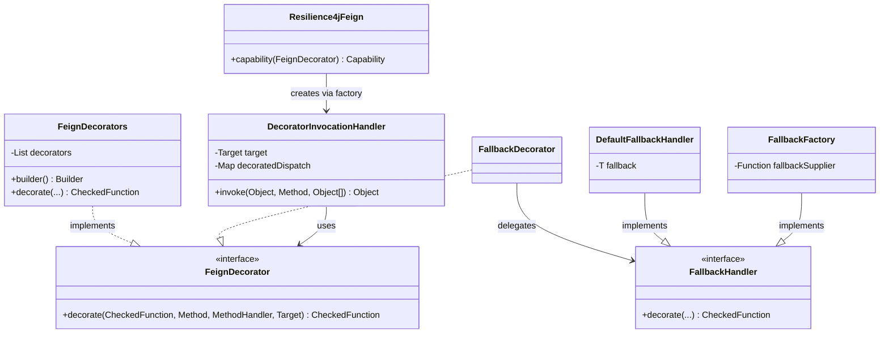
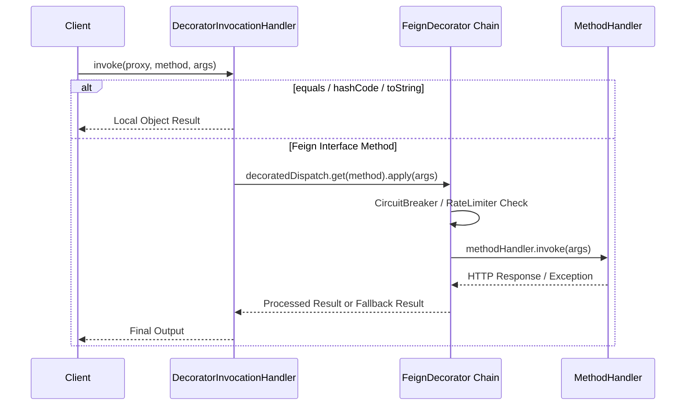
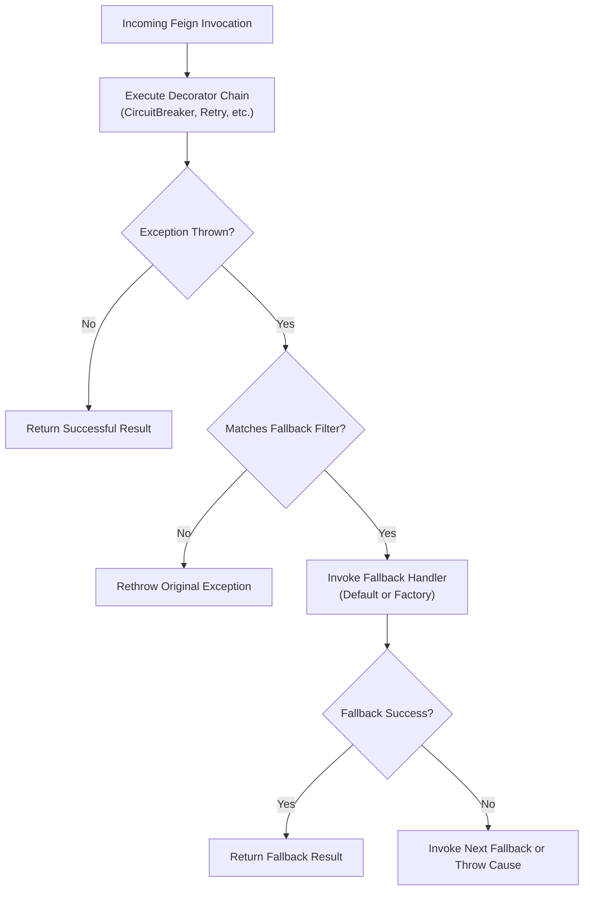

# Feign Integration

<details>
<summary>Relevant source files</summary>

The following files were used as context for generating this wiki page:

- [resilience4j-feign/README.adoc](https://github.com/resilience4j/resilience4j/blob/main/resilience4j-feign/README.adoc)
- [README.adoc](https://github.com/resilience4j/resilience4j/blob/main/README.adoc)
- [resilience4j-all/src/main/java/io/github/resilience4j/decorators/Decorators.java](https://github.com/resilience4j/resilience4j/blob/main/resilience4j-all/src/main/java/io/github/resilience4j/decorators/Decorators.java)
- [resilience4j-feign/src/main/java/io/github/resilience4j/feign/FeignDecorators.java](https://github.com/resilience4j/resilience4j/blob/main/resilience4j-feign/src/main/java/io/github/resilience4j/feign/FeignDecorators.java)
- [resilience4j-micronaut/src/main/java/io/github/resilience4j/micronaut/circuitbreaker/CircuitBreakerInterceptor.java](https://github.com/resilience4j/resilience4j/blob/main/resilience4j-micronaut/src/main/java/io/github/resilience4j/micronaut/circuitbreaker/CircuitBreakerInterceptor.java)
- [resilience4j-circuitbreaker/src/main/java/io/github/resilience4j/circuitbreaker/CircuitBreaker.java](https://github.com/resilience4j/resilience4j/blob/main/resilience4j-circuitbreaker/src/main/java/io/github/resilience4j/circuitbreaker/CircuitBreaker.java)
- [resilience4j-spring6/src/main/java/io/github/resilience4j/spring6/circuitbreaker/configure/CircuitBreakerAspect.java](https://github.com/resilience4j/resilience4j/blob/main/resilience4j-spring6/src/main/java/io/github/resilience4j/spring6/circuitbreaker/configure/CircuitBreakerAspect.java)
- [resilience4j-vavr/src/main/java/io/github/resilience4j/circuitbreaker/VavrCircuitBreaker.java](https://github.com/resilience4j/resilience4j/blob/main/resilience4j-vavr/src/main/java/io/github/resilience4j/circuitbreaker/VavrCircuitBreaker.java)
- [resilience4j-feign/src/main/java/io/github/resilience4j/feign/FallbackFactory.java](https://github.com/resilience4j/resilience4j/blob/main/resilience4j-feign/src/main/java/io/github/resilience4j/feign/FallbackFactory.java)
- [resilience4j-feign/src/main/java/io/github/resilience4j/feign/DefaultFallbackHandler.java](https://github.com/resilience4j/resilience4j/blob/main/resilience4j-feign/src/main/java/io/github/resilience4j/feign/DefaultFallbackHandler.java)
- [resilience4j-feign/src/main/java/io/github/resilience4j/feign/Resilience4jFeign.java](https://github.com/resilience4j/resilience4j/blob/main/resilience4j-feign/src/main/java/io/github/resilience4j/feign/Resilience4jFeign.java)
- [resilience4j-feign/src/main/java/io/github/resilience4j/feign/DecoratorInvocationHandler.java](https://github.com/resilience4j/resilience4j/blob/main/resilience4j-feign/src/main/java/io/github/resilience4j/feign/DecoratorInvocationHandler.java)
- [resilience4j-feign/src/main/java/io/github/resilience4j/feign/FallbackDecorator.java](https://github.com/resilience4j/resilience4j/blob/main/resilience4j-feign/src/main/java/io/github/resilience4j/feign/FallbackDecorator.java)
- [resilience4j-vavr/src/main/java/io/github/resilience4j/decorators/VavrDecorators.java](https://github.com/resilience4j/resilience4j/blob/main/resilience4j-vavr/src/main/java/io/github/resilience4j/decorators/VavrDecorators.java)
- [resilience4j-reactor/src/main/java/io/github/resilience4j/reactor/ReactorOperatorFallbackDecorator.java](https://github.com/resilience4j/resilience4j/blob/main/resilience4j-reactor/src/main/java/io/github/resilience4j/reactor/ReactorOperatorFallbackDecorator.java)
- [resilience4j-feign/src/main/java/io/github/resilience4j/feign/FeignDecorator.java](https://github.com/resilience4j/resilience4j/blob/main/resilience4j-feign/src/main/java/io/github/resilience4j/feign/FeignDecorator.java)
- [resilience4j-spring6/src/main/java/io/github/resilience4j/spring6/fallback/RxJava3FallbackDecorator.java](https://github.com/resilience4j/resilience4j/blob/main/resilience4j-spring6/src/main/java/io/github/resilience4j/spring6/fallback/RxJava3FallbackDecorator.java)
- [resilience4j-spring6/src/main/java/io/github/resilience4j/spring6/fallback/configure/FallbackConfiguration.java](https://github.com/resilience4j/resilience4j/blob/main/resilience4j-spring6/src/main/java/io/github/resilience4j/spring6/fallback/configure/FallbackConfiguration.java)
- [resilience4j-feign/src/main/java/io/github/resilience4j/feign/FallbackHandler.java](https://github.com/resilience4j/resilience4j/blob/main/resilience4j-feign/src/main/java/io/github/resilience4j/feign/FallbackHandler.java)
- [resilience4j-spring-boot3/src/main/java/io/github/resilience4j/springboot3/fallback/autoconfigure/FallbackConfigurationOnMissingBean.java](https://github.com/resilience4j/resilience4j/blob/main/resilience4j-spring-boot3/src/main/java/io/github/resilience4j/springboot3/fallback/autoconfigure/FallbackConfigurationOnMissingBean.java)
- [resilience4j-spring6/src/main/java/io/github/resilience4j/spring6/fallback/FallbackDecorators.java](https://github.com/resilience4j/resilience4j/blob/main/resilience4j-spring6/src/main/java/io/github/resilience4j/spring6/fallback/FallbackDecorators.java)
- [resilience4j-spring-boot4/src/main/java/io/github/resilience4j/springboot/fallback/autoconfigure/FallbackConfigurationOnMissingBean.java](https://github.com/resilience4j/resilience4j/blob/main/resilience4j-springboot/src/main/java/io/github/resilience4j/springboot/fallback/autoconfigure/FallbackConfigurationOnMissingBean.java)
- [resilience4j-feign/src/main/java/io/github/resilience4j/feign/package-info.java](https://github.com/resilience4j/resilience4j/blob/main/resilience4j-feign/src/main/java/io/github/resilience4j/feign/package-info.java)
- [RELEASENOTES.adoc](https://github.com/resilience4j/resilience4j/blob/main/RELEASENOTES.adoc)
- [resilience4j-micronaut/src/main/java/io/github/resilience4j/micronaut/util/ReactorPublisherExtension.java](https://github.com/resilience4j/resilience4j/blob/main/resilience4j-micronaut/src/main/java/io/github/resilience4j/micronaut/util/ReactorPublisherExtension.java)
- [resilience4j-micronaut/src/main/java/io/github/resilience4j/micronaut/util/RxJava3PublisherExtension.java](https://github.com/resilience4j/resilience4j/blob/main/resilience4j-micronaut/src/main/java/io/github/resilience4j/micronaut/util/RxJava3PublisherExtension.java)
- [resilience4j-micrometer/src/main/java/io/github/resilience4j/micrometer/internal/TimerImpl.java](https://github.com/resilience4j/micrometer/src/main/java/io/github/resilience4j/micrometer/internal/TimerImpl.java)
</details>

## Overview

### Overview Details
The `resilience4j-feign` module provides native fault tolerance integration for OpenFeign clients, bridging resilience patterns—such as Circuit Breakers, Rate Limiters, Retries, Bulkheads, and Fallbacks—directly into Feign interface method invocations. Historically, integrating resilience libraries with Feign relied on custom `InvocationHandlerFactory` builders. However, starting with Feign 12.5+, those legacy mechanisms became incompatible, prompting the adoption of Feign's modern `Capability` API introduced in Feign 10.9.

The core architecture intercepts dynamic proxy method dispatches via `DecoratorInvocationHandler`, wrapping underlying `MethodHandler` executions in stacked `FeignDecorator` chains built via `FeignDecorators`. This design permits developers to apply multiple fault-tolerance primitives in a deterministic order while supporting robust fallback mechanisms, including static fallback instances and dynamic fallback factories that consume execution exceptions.

Sources: [resilience4j-feign/README.adoc:1-20](https://github.com/resilience4j/resilience4j/blob/main/resilience4j-feign/README.adoc#L1-L20)

Sources: [resilience4j-feign/src/main/java/io/github/resilience4j/feign/Resilience4jFeign.java:26-42](https://github.com/resilience4j/resilience4j/blob/main/resilience4j-feign/src/main/java/io/github/resilience4j/feign/Resilience4jFeign.java#L26-L42)

Sources: [RELEASENOTES.adoc:462-463](https://github.com/resilience4j/resilience4j/blob/main/RELEASENOTES.adoc#L462-L463)

---

## Core Components and Public API

### Components Architecture
The Feign integration subsystem revolves around a few central classes and interfaces located in the `io.github.resilience4j.feign` package:

- `Resilience4jFeign`: The main entry point containing factory methods `capability(FeignDecorator)` and the deprecated `builder(FeignDecorator)`. It implements Feign's `Capability` and `InvocationHandlerFactory` interfaces to inject custom invocation handling.
- `FeignDecorator`: A functional interface defining the contract `CheckedFunction<Object[], Object> decorate(CheckedFunction<Object[], Object> invocationCall, Method method, MethodHandler methodHandler, Target<?> target)`.
- `FeignDecorators`: A builder utility that accumulates ordered decorators (CircuitBreaker, RateLimiter, Retry, Bulkhead, Fallback) into a unified `FeignDecorator` chain.
- `DecoratorInvocationHandler`: An `InvocationHandler` implementation that maps interface methods to pre-decorated `CheckedFunction` chains and intercepts standard Object methods (`equals`, `hashCode`, `toString`).



Sources: [resilience4j-feign/src/main/java/io/github/resilience4j/feign/FeignDecorators.java:34-78](https://github.com/resilience4j/resilience4j/blob/main/resilience4j-feign/src/main/java/io/github/resilience4j/feign/FeignDecorators.java#L34-L78)

Sources: [resilience4j-feign/src/main/java/io/github/resilience4j/feign/Resilience4jFeign.java:26-85](https://github.com/resilience4j/resilience4j/blob/main/resilience4j-feign/src/main/java/io/github/resilience4j/feign/Resilience4jFeign.java#L26-L85)

Sources: [resilience4j-feign/src/main/java/io/github/resilience4j/feign/FallbackDecorator.java:28-34](https://github.com/resilience4j/resilience4j/blob/main/resilience4j-feign/src/main/java/io/github/resilience4j/feign/FallbackDecorator.java#L28-L34)

---

## Invocation Handling and Decorator Chaining Flow

### Execution Pipeline
When a developer invokes a method on a Feign-generated client interface, control enters `DecoratorInvocationHandler.invoke()`. The handler first checks for standard Java object methods (`equals`, `hashCode`, `toString`) and delegates them directly. For all other methods, it looks up the pre-computed `CheckedFunction<Object[], Object>` in `decoratedDispatch` and applies the arguments.



The load-bearing guard inside `FeignDecorators.Builder.addFeignDecorator()` ensures that default interface methods are excluded from interception:

```java
if (m.isDefault()) {
    return fn;
} else {
    return decorator.apply(fn);
}
```

> [!NOTE]
> Default methods on Feign interfaces do not participate in actual network requests and are explicitly bypassed by `FeignDecorators` to prevent unnecessary overhead or state mutations.

Sources: [resilience4j-feign/src/main/java/io/github/resilience4j/feign/DecoratorInvocationHandler.java:35-96](https://github.com/resilience4j/resilience4j/blob/main/resilience4j-feign/src/main/java/io/github/resilience4j/feign/DecoratorInvocationHandler.java#L35-L96)

Sources: [resilience4j-feign/src/main/java/io/github/resilience4j/feign/FeignDecorators.java:220-231](https://github.com/resilience4j/resilience4j/blob/main/resilience4j-feign/src/main/java/io/github/resilience4j/feign/FeignDecorators.java#L220-L231)

---

## Decorator Ordering and Execution Semantics

### Ordering Rules
The order in which decorators are declared in `FeignDecorators.Builder` dictates the nesting structure and execution order. Because decorators wrap inward, the first decorator added is executed outermost.

For example, if a `RateLimiter` is added before a `CircuitBreaker`, the `RateLimiter` intercepts calls first. If the `CircuitBreaker` is open, the `RateLimiter` will still consume permits before the `CallNotPermittedException` is thrown. Conversely, placing the `CircuitBreaker` first means that once the circuit trips, calls short-circuit immediately without consuming rate limiter tokens.

| Decorator Order | Outer Layer | Inner Layer | Behavioral Consequence |
| :--- | :--- | :--- | :--- |
| `RateLimiter` then `CircuitBreaker` | `RateLimiter` | `CircuitBreaker` | Rate limiting executes before state checks; permits are consumed even if circuit is open. |
| `CircuitBreaker` then `RateLimiter` | `CircuitBreaker` | `RateLimiter` | Circuit state is checked first; open circuits bypass rate limiting entirely. |

Sources: [resilience4j-feign/README.adoc:51-70](https://github.com/resilience4j/resilience4j/blob/main/resilience4j-feign/README.adoc#L51-L70)

Sources: [resilience4j-feign/src/main/java/io/github/resilience4j/feign/FeignDecorators.java:34-57](https://github.com/resilience4j/resilience4j/blob/main/resilience4j-feign/src/main/java/io/github/resilience4j/feign/FeignDecorators.java#L34-L57)

---

## Fallback Mechanisms and Exception Handling

### Fallback Processing
`resilience4j-feign` supports fallbacks via `FallbackDecorator`, which delegates to either `DefaultFallbackHandler` (static fallback instance) or `FallbackFactory` (dynamic instance created per exception). 

Fallbacks can be filtered by specific exception classes or predicates. If multiple fallbacks are registered, subsequent fallbacks are invoked when a preceding fallback execution fails.



### Fallback Validation Rules

During initialization, `FallbackHandler` validates that the fallback object complies with the target interface:

```java
default void validateFallback(T fallback, Method method) {
    if (fallback.getClass().isAssignableFrom(method.getDeclaringClass())) {
        throw new IllegalArgumentException("Cannot use the fallback ["
            + fallback.getClass() + "] for ["
            + method.getDeclaringClass() + "]!");
    }
}
```

> [!WARNING]
> All fallback instances must implement the exact Feign interface specified in the target method (`Resilience4jFeign.Capability` / `Feign.Builder`), otherwise an `IllegalArgumentException` is thrown at runtime.

Sources: [resilience4j-feign/README.adoc:72-127](https://github.com/resilience4j/resilience4j/blob/main/resilience4j-feign/README.adoc#L72-L127)

Sources: [resilience4j-feign/src/main/java/io/github/resilience4j/feign/FallbackHandler.java:29-60](https://github.com/resilience4j/resilience4j/blob/main/resilience4j-feign/src/main/java/io/github/resilience4j/feign/FallbackHandler.java#L29-L60)

---

## Runnable Example

### Usage Demonstration
The following complete, runnable example demonstrates how to configure a Feign client with both a `CircuitBreaker` and a `RateLimiter` using the modern Feign `Capability` API.

```java
import feign.Feign;
import feign.RequestLine;
import io.github.resilience4j.circuitbreaker.CircuitBreaker;
import io.github.resilience4j.feign.FeignDecorators;
import io.github.resilience4j.feign.Resilience4jFeign;
import io.github.resilience4j.ratelimiter.RateLimiter;

public class FeignIntegrationExample {

    public interface MyService {
        @RequestLine("GET /greeting")
        String getGreeting();
    }

    public static void main(String[] args) {
        CircuitBreaker circuitBreaker = CircuitBreaker.ofDefaults("backendName");
        RateLimiter rateLimiter = RateLimiter.ofDefaults("backendName");

        FeignDecorators decorators = FeignDecorators.builder()
                .withRateLimiter(rateLimiter)
                .withCircuitBreaker(circuitBreaker)
                .build();

        MyService myService = Feign.builder()
                .addCapability(Resilience4jFeign.capability(decorators))
                .target(MyService.class, "http://localhost:8080/");

        String greeting = myService.getGreeting();
        System.out.println(greeting);
    }
}
```

Sources: [resilience4j-feign/README.adoc:23-42](https://github.com/resilience4j/resilience4j/blob/main/resilience4j-feign/README.adoc#L23-L42)

Sources: [resilience4j-feign/src/main/java/io/github/resilience4j/feign/Resilience4jFeign.java:53-56](https://github.com/resilience4j/resilience4j/blob/main/resilience4j-feign/src/main/java/io/github/resilience4j/feign/Resilience4jFeign.java#L53-L56)

---

## Design Trade-Offs

### Architectural Decisions
| Design Choice | Benefit | Cost |
| :--- | :--- | :--- |
| **Capability API Integration (`feign.Capability`)** | Ensures full compatibility with modern Feign releases (12.5+) without breaking proxy generation. | Requires Feign 10.9+ runtime dependencies. |
| **Decorator Chaining via `FeignDecorators`** | Highly modular and customizable; allows arbitrary stacking of rate limiters, circuit breakers, and retries. | Order sensitivity requires careful configuration planning by the developer. |
| **Reflection-Based Fallback Invocation** | Eliminates boilerplate by automatically mapping interface methods to fallback implementations via reflection. | Minor runtime reflection overhead per invocation when fallbacks trigger. |

Sources: [resilience4j-feign/README.adoc:15-22](https://github.com/resilience4j/resilience4j/blob/main/resilience4j-feign/README.adoc#L15-L22), [resilience4j-feign/README.adoc:51-70](https://github.com/resilience4j/resilience4j/blob/main/resilience4j-feign/README.adoc#L51-L70)

Sources: [resilience4j-feign/src/main/java/io/github/resilience4j/feign/DefaultFallbackHandler.java:37-53](https://github.com/resilience4j/resilience4j/blob/main/resilience4j-feign/src/main/java/io/github/resilience4j/feign/DefaultFallbackHandler.java#L37-L53)

## Related

- [[Circuit Breakers]]
- [[Retry Mechanism]]

