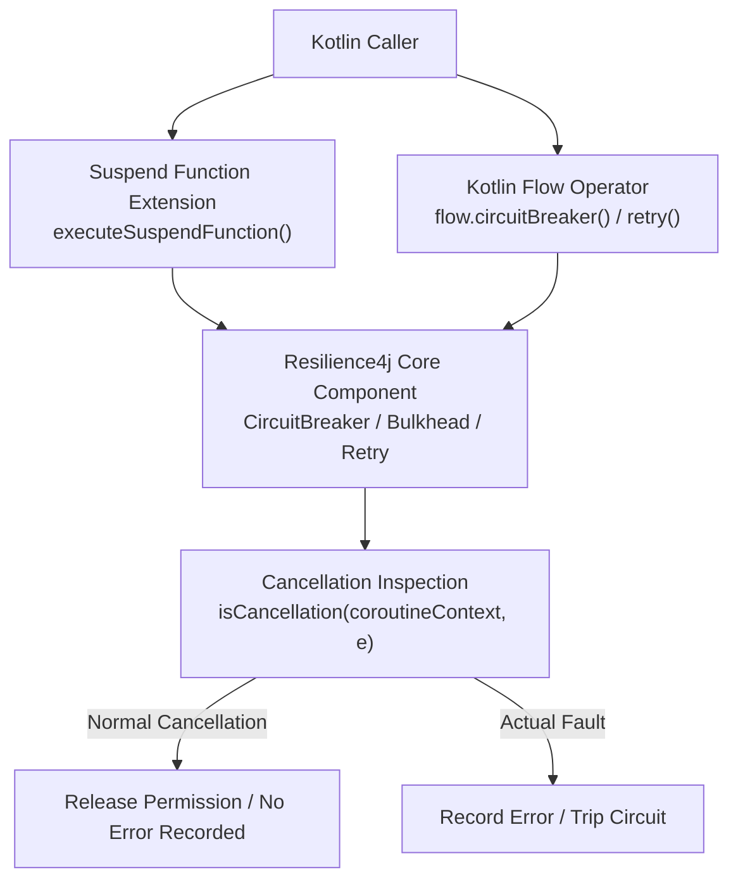
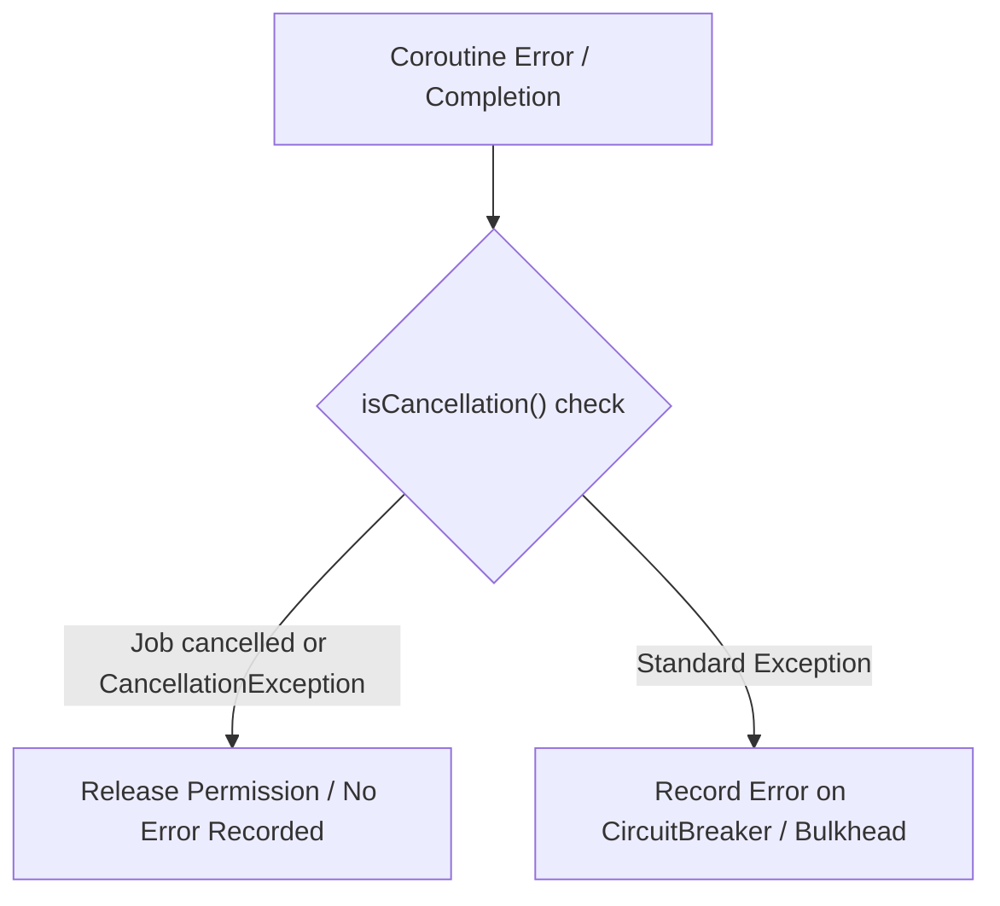

# Kotlin Coroutines Support

<details>
<summary>Relevant source files</summary>

The following files were used as context for generating this wiki page:

- [README.adoc](https://github.com/resilience4j/resilience4j/blob/main/README.adoc)
- [resilience4j-kotlin/src/main/kotlin/io/github/resilience4j/kotlin/circuitbreaker/CircuitBreaker.kt](https://github.com/resilience4j/resilience4j/blob/main/resilience4j-kotlin/src/main/kotlin/io/github/resilience4j/kotlin/circuitbreaker/CircuitBreaker.kt)
- [resilience4j-kotlin/src/main/kotlin/io/github/resilience4j/kotlin/bulkhead/Bulkhead.kt](https://github.com/resilience4j/resilience4j/blob/main/resilience4j-kotlin/src/main/kotlin/io/github/resilience4j/kotlin/bulkhead/Bulkhead.kt)
- [resilience4j-kotlin/src/main/kotlin/io/github/resilience4j/kotlin/circuitbreaker/FlowCircuitBreaker.kt](https://github.com/resilience4j/resilience4j/blob/main/resilience4j-kotlin/src/main/kotlin/io/github/resilience4j/kotlin/circuitbreaker/FlowCircuitBreaker.kt)
- [resilience4j-kotlin/src/main/kotlin/io/github/resilience4j/kotlin/timelimiter/TimeLimiter.kt](https://github.com/resilience4j/resilience4j/blob/main/resilience4j-kotlin/src/main/kotlin/io/github/resilience4j/kotlin/timelimiter/TimeLimiter.kt)
- [resilience4j-kotlin/src/main/kotlin/io/github/resilience4j/kotlin/bulkhead/FlowBulkhead.kt](https://github.com/resilience4j/resilience4j/blob/main/resilience4j-kotlin/src/main/kotlin/io/github/resilience4j/kotlin/bulkhead/FlowBulkhead.kt)
- [resilience4j-vavr/src/main/java/io/github/resilience4j/circuitbreaker/VavrCircuitBreaker.java](https://github.com/resilience4j/resilience4j/blob/main/resilience4j-vavr/src/main/java/io/github/resilience4j/circuitbreaker/VavrCircuitBreaker.java)
- [resilience4j-circuitbreaker/src/main/java/io/github/resilience4j/circuitbreaker/CircuitBreaker.java](https://github.com/resilience4j/resilience4j/blob/main/resilience4j-circuitbreaker/src/main/java/io/github/resilience4j/circuitbreaker/CircuitBreaker.java)
- [resilience4j-kotlin/src/main/kotlin/io/github/resilience4j/kotlin/ratelimiter/RateLimiter.kt](https://github.com/resilience4j/resilience4j/blob/main/resilience4j-kotlin/src/main/kotlin/io/github/resilience4j/kotlin/ratelimiter/RateLimiter.kt)
- [resilience4j-rxjava3/src/main/java/io/github/resilience4j/rxjava3/circuitbreaker/operator/FlowableCircuitBreaker.java](https://github.com/resilience4j/resilience4j/blob/main/resilience4j-rxjava3/src/main/java/io/github/resilience4j/rxjava3/circuitbreaker/operator/FlowableCircuitBreaker.java)
- [resilience4j-rxjava2/src/main/java/io/github/resilience4j/circuitbreaker/operator/FlowableCircuitBreaker.java](https://github.com/resilience4j/resilience4j/blob/main/resilience4j-rxjava2/src/main/java/io/github/resilience4j/circuitbreaker/operator/FlowableCircuitBreaker.java)
- [resilience4j-reactor/src/main/java/io/github/resilience4j/reactor/circuitbreaker/operator/CircuitBreakerSubscriber.java](https://github.com/resilience4j/resilience4j/blob/main/resilience4j-reactor/src/main/java/io/github/resilience4j/reactor/circuitbreaker/operator/CircuitBreakerSubscriber.java)
- [resilience4j-kotlin/src/main/kotlin/io/github/resilience4j/kotlin/ratelimiter/FlowRateLimiter.kt](https://github.com/resilience4j/resilience4j/blob/main/resilience4j-kotlin/src/main/kotlin/io/github/resilience4j/kotlin/ratelimiter/FlowRateLimiter.kt)
- [resilience4j-kotlin/src/main/kotlin/io/github/resilience4j/kotlin/retry/FlowRetry.kt](https://github.com/resilience4j/resilience4j/blob/main/resilience4j-kotlin/src/main/kotlin/io/github/resilience4j/kotlin/retry/FlowRetry.kt)
- [resilience4j-kotlin/src/main/kotlin/io/github/resilience4j/kotlin/retry/Retry.kt](https://github.com/resilience4j/resilience4j/blob/main/resilience4j-kotlin/src/main/kotlin/io/github/resilience4j/kotlin/retry/Retry.kt)
- [resilience4j-kotlin/src/main/kotlin/io/github/resilience4j/kotlin/timelimiter/FlowTimeLimiter.kt](https://github.com/resilience4j/resilience4j/blob/main/resilience4j-kotlin/src/main/kotlin/io/github/resilience4j/kotlin/timelimiter/FlowTimeLimiter.kt)
- [resilience4j-kotlin/src/main/kotlin/io/github/resilience4j/kotlin/micrometer/FlowTimer.kt](https://github.com/resilience4j/resilience4j/blob/main/resilience4j-kotlin/src/main/kotlin/io/github/resilience4j/kotlin/micrometer/FlowTimer.kt)
- [resilience4j-kotlin/src/main/kotlin/io/github/resilience4j/kotlin/micrometer/Timer.kt](https://github.com/resilience4j/resilience4j/blob/main/resilience4j-kotlin/src/main/kotlin/io/github/resilience4j/kotlin/micrometer/Timer.kt)
- [resilience4j-reactor/src/main/java/io/github/resilience4j/reactor/circuitbreaker/operator/FluxCircuitBreaker.java](https://github.com/resilience4j/resilience4j/blob/main/resilience4j-reactor/src/main/java/io/github/resilience4j/reactor/circuitbreaker/operator/FluxCircuitBreaker.java)
- [resilience4j-reactor/src/main/java/io/github/resilience4j/reactor/ratelimiter/operator/CorePublisherRateLimiterOperator.java](https://github.com/resilience4j/resilience4j/blob/main/resilience4j-reactor/src/main/java/io/github/resilience4j/reactor/ratelimiter/operator/CorePublisherRateLimiterOperator.java)
- [resilience4j-rxjava3/src/main/java/io/github/resilience4j/rxjava3/ratelimiter/operator/FlowableRateLimiter.java](https://github.com/resilience4j/resilience4j/blob/main/resilience4j-rxjava3/src/main/java/io/github/resilience4j/rxjava3/ratelimiter/operator/FlowableRateLimiter.java)
- [resilience4j-spring6/src/main/java/io/github/resilience4j/spring6/circuitbreaker/configure/ReactorCircuitBreakerAspectExt.java](https://github.com/resilience4j/spring6/circuitbreaker/configure/ReactorCircuitBreakerAspectExt.java)
- [resilience4j-vavr/src/main/java/io/github/resilience4j/decorators/VavrDecorators.java](https://github.com/resilience4j/resilience4j/blob/main/resilience4j-vavr/src/main/java/io/github/resilience4j/decorators/VavrDecorators.java)
- [resilience4j-micronaut/src/main/java/io/github/resilience4j/micronaut/util/RxJava3PublisherExtension.java](https://github.com/resilience4j/micronaut/src/main/java/io/github/resilience4j/micronaut/util/RxJava3PublisherExtension.java)
- [resilience4j-micronaut/src/main/java/io/github/resilience4j/micronaut/util/ReactorPublisherExtension.java](https://github.com/resilience4j/micronaut/src/main/java/io/github/resilience4j/micronaut/util/ReactorPublisherExtension.java)
- [resilience4j-micronaut/src/main/java/io/github/resilience4j/micronaut/util/RxJava2PublisherExtension.java](https://github.com/resilience4j/micronaut/src/main/java/io/github/resilience4j/micronaut/util/RxJava2PublisherExtension.java)
- [resilience4j-kotlin/src/main/kotlin/io/github/resilience4j/kotlin/Cancellation.kt](https://github.com/resilience4j/resilience4j/blob/main/resilience4j-kotlin/src/main/kotlin/io/github/resilience4j/kotlin/Cancellation.kt)
- [resilience4j-rxjava3/src/main/java/io/github/resilience4j/rxjava3/circuitbreaker/operator/CircuitBreakerOperator.java](https://github.com/resilience4j/rxjava3/circuitbreaker/operator/CircuitBreakerOperator.java)
- [resilience4j-rxjava2/src/main/java/io/github/resilience4j/circuitbreaker/operator/CircuitBreakerOperator.java](https://github.com/resilience4j/rxjava2/src/main/java/io/github/resilience4j/circuitbreaker/operator/CircuitBreakerOperator.java)
- [resilience4j-micronaut/src/main/java/io/github/resilience4j/micronaut/util/PublisherExtension.java](https://github.com/resilience4j/micronaut/src/main/java/io/github/resilience4j/micronaut/util/PublisherExtension.java)
</details>

## Overview

The `resilience4j-kotlin` module bridges Resilience4j's functional fault tolerance mechanisms with Kotlin's asynchronous programming primitives—specifically **suspend functions** and **Kotlin Flows**. While standard Resilience4j is built around Java functional interfaces, CompletableFutures, and reactive streams (RxJava/Reactor), Kotlin applications require idiomatic non-blocking execution models that integrate seamlessly with coroutine contexts and structured concurrency.

Sources: [README.adoc:30-37](https://github.com/resilience4j/resilience4j/blob/main/README.adoc#L30-L37)

This module provides Kotlin extension functions and Flow operators for core Resilience4j components: Circuit Breaker, Rate Limiter, Retry, Bulkhead, Time Limiter, and Micrometer Timers. A central design challenge solved in this module is distinguishing between genuine backend failures and normal coroutine cancellations. Because Kotlin coroutines use `CancellationException` (and job cancellations) to signal control-flow departures rather than faults, wrapping blocks naive to coroutine semantics would erroneously record cancellations as failures and trip circuit breakers.

Sources: [resilience4j-kotlin/src/main/kotlin/io/github/resilience4j/kotlin/circuitbreaker/CircuitBreaker.kt:31-60](https://github.com/resilience4j/resilience4j/blob/main/resilience4j-kotlin/src/main/kotlin/io/github/resilience4j/kotlin/circuitbreaker/CircuitBreaker.kt#L31-L60)

The Kotlin support module implements explicit cancellation predicates and context inspections to ensure coroutine lifecycle events release acquired permissions or propagate timeouts correctly without corrupting metrics.

Sources: [resilience4j-kotlin/src/main/kotlin/io/github/resilience4j/kotlin/Cancellation.kt:25-31](https://github.com/resilience4j/resilience4j/blob/main/resilience4j-kotlin/src/main/kotlin/io/github/resilience4j/kotlin/Cancellation.kt#L25-L31)



Sources: [resilience4j-kotlin/src/main/kotlin/io/github/resilience4j/kotlin/circuitbreaker/CircuitBreaker.kt:31-60](https://github.com/resilience4j/resilience4j/blob/main/resilience4j-kotlin/src/main/kotlin/io/github/resilience4j/kotlin/circuitbreaker/CircuitBreaker.kt#L31-L60)

---

## Coroutine Cancellation Handling

A foundational requirement for coroutine resilience integration is differentiating between a thrown runtime exception (which represents an operation failure) and a coroutine cancellation (which is part of structured concurrency control, such as a timeout or parent job cancellation). The `isCancellation` utility inspects the active `CoroutineContext` and any thrown `Throwable` to make this determination.

Sources: [resilience4j-kotlin/src/main/kotlin/io/github/resilience4j/kotlin/Cancellation.kt:25-31](https://github.com/resilience4j/resilience4j/blob/main/resilience4j-kotlin/src/main/kotlin/io/github/resilience4j/kotlin/Cancellation.kt#L25-L31)

```kotlin
internal fun isCancellation(coroutineContext: CoroutineContext, error: Throwable? = null): Boolean {
    val job = coroutineContext[Job] ?: return false
    return job.isCancelled || (error != null && error is CancellationException)
}
```

Sources: [resilience4j-kotlin/src/main/kotlin/io/github/resilience4j/kotlin/Cancellation.kt:25-31](https://github.com/resilience4j/resilience4j/blob/main/resilience4j-kotlin/src/main/kotlin/io/github/resilience4j/kotlin/Cancellation.kt#L25-L31)

> [!IMPORTANT]
> If a coroutine job is cancelled or throws a `CancellationException`, resilience patterns such as Circuit Breakers and Bulkheads must release their acquired permissions or skip recording failure metrics. Treating structured concurrency cancellations as backend faults would cause erratic circuit breaker tripping.

Sources: [resilience4j-kotlin/src/main/kotlin/io/github/resilience4j/kotlin/Cancellation.kt:25-31](https://github.com/resilience4j/resilience4j/blob/main/resilience4j-kotlin/src/main/kotlin/io/github/resilience4j/kotlin/Cancellation.kt#L25-L31)



Sources: [resilience4j-kotlin/src/main/kotlin/io/github/resilience4j/kotlin/Cancellation.kt:25-31](https://github.com/resilience4j/resilience4j/blob/main/resilience4j-kotlin/src/main/kotlin/io/github/resilience4j/kotlin/Cancellation.kt#L25-L31)

---

## CircuitBreaker Coroutine Extensions and Flow Operators

The `CircuitBreaker` extensions provide `executeSuspendFunction` and `decorateSuspendFunction` alongside reactive `Flow` operators. When executing a suspend function, the circuit breaker acquires a permission, records the starting timestamp, executes the block within a `try-catch` block, and records either success or error duration.

Sources: [resilience4j-kotlin/src/main/kotlin/io/github/resilience4j/kotlin/circuitbreaker/CircuitBreaker.kt:31-60](https://github.com/resilience4j/resilience4j/blob/main/resilience4j-kotlin/src/main/kotlin/io/github/resilience4j/kotlin/circuitbreaker/CircuitBreaker.kt#L31-L60)

```kotlin
suspend fun <T> CircuitBreaker.executeSuspendFunction(
    ignoreThrowablePredicate: (Throwable, CoroutineContext) -> Boolean,
    block: suspend () -> T
): T {
    acquirePermission()
    val start = getCurrentTimestamp()
    try {
        val result = block()
        val durationInNanos = getCurrentTimestamp() - start
        onResult(durationInNanos, TimeUnit.NANOSECONDS, result)
        return result
    } catch (exception: Throwable) {
        if (ignoreThrowablePredicate(exception, coroutineContext)) {
            releasePermission()
        } else {
            val durationInNanos = getCurrentTimestamp() - start
            onError(durationInNanos, TimeUnit.NANOSECONDS, exception)
        }
        throw exception
    }
}
```

Sources: [resilience4j-kotlin/src/main/kotlin/io/github/resilience4j/kotlin/circuitbreaker/CircuitBreaker.kt:40-60](https://github.com/resilience4j/resilience4j/blob/main/resilience4j-kotlin/src/main/kotlin/io/github/resilience4j/kotlin/circuitbreaker/CircuitBreaker.kt#L40-L60)

For Kotlin `Flow` collections, the `.circuitBreaker(circuitBreaker)` operator wraps upstream collection by acquiring permission prior to emission and attaching an `onCompletion` handler to inspect completion status and cancellation states.

Sources: [resilience4j-kotlin/src/main/kotlin/io/github/resilience4j/kotlin/circuitbreaker/FlowCircuitBreaker.kt:33-68](https://github.com/resilience4j/resilience4j/blob/main/resilience4j-kotlin/src/main/kotlin/io/github/resilience4j/kotlin/circuitbreaker/FlowCircuitBreaker.kt#L33-L68)

```kotlin
fun <T> Flow<T>.circuitBreaker(circuitBreaker: CircuitBreaker): Flow<T> =
    flow {
        circuitBreaker.acquirePermission()

        val start = System.nanoTime()
        val source = this@circuitBreaker.onCompletion { e ->
            when {
                isCancellation(coroutineContext, e) -> circuitBreaker
                    .releasePermission()

                e == null -> circuitBreaker
                    .onSuccess(System.nanoTime() - start, TimeUnit.NANOSECONDS)

                else -> circuitBreaker
                    .onError(System.nanoTime() - start, TimeUnit.NANOSECONDS, e)
            }
        }

        emitAll(source)
    }
```

Sources: [resilience4j-kotlin/src/main/kotlin/io/github/resilience4j/kotlin/circuitbreaker/FlowCircuitBreaker.kt:49-68](https://github.com/resilience4j/resilience4j/blob/main/resilience4j-kotlin/src/main/kotlin/io/github/resilience4j/kotlin/circuitbreaker/FlowCircuitBreaker.kt#L49-L68)

---

## Bulkhead Coroutine Extensions and Flow Operators

Bulkhead support manages concurrent call limits for suspend functions and flows. The internal `acquirePermissionSuspend()` helper checks whether `BulkheadConfig.maxWaitDuration` is zero. If zero, it acquires permission immediately on the fast path; if non-zero, it switches to `Dispatchers.IO` to block safely without starving the coroutine dispatcher.

Sources: [resilience4j-kotlin/src/main/kotlin/io/github/resilience4j/kotlin/bulkhead/Bulkhead.kt:78-92](https://github.com/resilience4j/resilience4j/blob/main/resilience4j-kotlin/src/main/kotlin/io/github/resilience4j/kotlin/bulkhead/Bulkhead.kt#L78-L92)

```kotlin
internal suspend fun Bulkhead.acquirePermissionSuspend() {
    if (bulkheadConfig.maxWaitDuration.isZero) {
        acquirePermission()
    } else {
        withContext(Dispatchers.IO) { acquirePermission() }
    }
}
```

Sources: [resilience4j-kotlin/src/main/kotlin/io/github/resilience4j/kotlin/bulkhead/Bulkhead.kt:85-92](https://github.com/resilience4j/resilience4j/blob/main/resilience4j-kotlin/src/main/kotlin/io/github/resilience4j/kotlin/bulkhead/Bulkhead.kt#L85-L92)

When executing a suspend function under a bulkhead:

Sources: [resilience4j-kotlin/src/main/kotlin/io/github/resilience4j/kotlin/bulkhead/Bulkhead.kt:34-46](https://github.com/resilience4j/resilience4j/blob/main/resilience4j-kotlin/src/main/kotlin/io/github/resilience4j/kotlin/bulkhead/Bulkhead.kt#L34-L46)

```kotlin
suspend fun <T> Bulkhead.executeSuspendFunction(block: suspend () -> T): T {
    acquirePermissionSuspend()
    return try {
        block().also { onComplete() }
    } catch (e: Throwable) {
        if (isCancellation(coroutineContext, e)) {
            releasePermission()
        } else {
            onComplete()
        }
        throw e
    }
}
```

Sources: [resilience4j-kotlin/src/main/kotlin/io/github/resilience4j/kotlin/bulkhead/Bulkhead.kt:34-46](https://github.com/resilience4j/resilience4j/blob/main/resilience4j-kotlin/src/main/kotlin/io/github/resilience4j/kotlin/bulkhead/Bulkhead.kt#L34-L46)

---

## Retry Coroutine Extensions and Flow Operators

Retry mechanisms for coroutines iterate in a `while(true)` loop, capturing results and errors via `retry.asyncContext<T>()`. Between attempts, it suspends execution according to the configured interval function by invoking `delay(delayMs)`.

Sources: [resilience4j-kotlin/src/main/kotlin/io/github/resilience4j/kotlin/retry/Retry.kt:29-51](https://github.com/resilience4j/resilience4j/blob/main/resilience4j-kotlin/src/main/kotlin/io/github/resilience4j/kotlin/retry/Retry.kt#L29-L51)

```kotlin
suspend fun <T> Retry.executeSuspendFunction(block: suspend () -> T): T {
    val retryContext = asyncContext<T>()
    while (true) {
        try {
            val result = block()
            val delayMs = retryContext.onResult(result)
            if (delayMs >= 0) {
                delay(delayMs)
                continue
            }
            retryContext.onComplete()
            return result
        } catch (e: Exception) {
            val delayMs = retryContext.onError(e)

            if (delayMs >= 0) {
                delay(delayMs)
                continue
            }
            throw e
        }
    }
}
```

Sources: [resilience4j-kotlin/src/main/kotlin/io/github/resilience4j/kotlin/retry/Retry.kt:29-51](https://github.com/resilience4j/resilience4j/blob/main/resilience4j-kotlin/src/main/kotlin/io/github/resilience4j/kotlin/retry/Retry.kt#L29-L51)

The Flow `retry` operator uses `onEach` to inspect emission results against retry predicates, throwing an internal `RetryDueToResultException` when a result triggers a retry, which is subsequently caught and handled by `retryWhen`.

Sources: [resilience4j-kotlin/src/main/kotlin/io/github/resilience4j/kotlin/retry/FlowRetry.kt:30-61](https://github.com/resilience4j/resilience4j/blob/main/resilience4j-kotlin/src/main/kotlin/io/github/resilience4j/kotlin/retry/FlowRetry.kt#L30-L61)

---

## TimeLimiter and Micrometer Timer Coroutine Integration

TimeLimiter integration wraps suspend functions using Kotlin's built-in `withTimeout`, pulling duration settings directly from `timeLimiterConfig.timeoutDuration`. If a timeout occurs, a `TimeoutCancellationException` is caught, transformed into Resilience4j's `TimeoutException` (which extends `CancellationException`), recorded via `onError`, and rethrown.

Sources: [resilience4j-kotlin/src/main/kotlin/io/github/resilience4j/kotlin/timelimiter/TimeLimiter.kt:44-61](https://github.com/resilience4j/resilience4j/blob/main/resilience4j-kotlin/src/main/kotlin/io/github/resilience4j/kotlin/timelimiter/TimeLimiter.kt#L44-L61)

```kotlin
suspend fun <T> TimeLimiter.executeSuspendFunction(block: suspend () -> T): T =
    try {
        withTimeout(timeLimiterConfig.timeoutDuration.toMillis()) {
            block().also { onSuccess() }
        }
    } catch (t: Throwable) {
        if (isCancellation(coroutineContext, t)) {
            if (t is TimeoutCancellationException) {
                val timeoutException = TimeLimiter.createdTimeoutExceptionWithName(name, t)
                onError(timeoutException)
                throw timeoutException
            }
        } else {
            onError(t)
        }
        throw t
    }
```

Sources: [resilience4j-kotlin/src/main/kotlin/io/github/resilience4j/kotlin/timelimiter/TimeLimiter.kt:44-61](https://github.com/resilience4j/resilience4j/blob/main/resilience4j-kotlin/src/main/kotlin/io/github/resilience4j/kotlin/timelimiter/TimeLimiter.kt#L44-L61)

Similarly, Micrometer `Timer` extensions create a measurement context on start and record success or failure upon completion of suspend functions and flows.

Sources: [resilience4j-kotlin/src/main/kotlin/io/github/resilience4j/kotlin/micrometer/Timer.kt:26-39](https://github.com/resilience4j/resilience4j/blob/main/resilience4j-kotlin/src/main/kotlin/io/github/resilience4j/kotlin/micrometer/Timer.kt#L26-L39)

---

## Usage Example

The following complete example demonstrates how to create resilience instances (CircuitBreaker, Retry, Bulkhead) and apply them to Kotlin suspend functions and Flows.

Sources: [README.adoc:42-72](https://github.com/resilience4j/resilience4j/blob/main/README.adoc#L42-L72)

```kotlin
import io.github.resilience4j.circuitbreaker.CircuitBreaker
import io.github.resilience4j.retry.Retry
import io.github.resilience4j.bulkhead.Bulkhead
import io.github.resilience4j.kotlin.circuitbreaker.executeSuspendFunction
import io.github.resilience4j.kotlin.retry.executeSuspendFunction
import io.github.resilience4j.kotlin.bulkhead.executeSuspendFunction
import io.github.resilience4j.kotlin.circuitbreaker.circuitBreaker
import kotlinx.coroutines.flow.flowOf
import kotlinx.coroutines.runBlocking

class CoroutineBackendService {
    suspend fun fetchData(): String {
        return "Resilience4j Kotlin Support"
    }
}

fun main() = runBlocking {
    val service = CoroutineBackendService()
    
    val circuitBreaker = CircuitBreaker.ofDefaults("backendService")
    val retry = Retry.ofDefaults("backendService")
    val bulkhead = Bulkhead.ofDefaults("backendService")

    // Execute a suspend function protected by a CircuitBreaker
    val result = circuitBreaker.executeSuspendFunction {
        retry.executeSuspendFunction {
            bulkhead.executeSuspendFunction {
                service.fetchData()
            }
        }
    }
    println("Result: $result")

    // Apply Resilience4j operators to Kotlin Flows
    flowOf("data1", "data2")
        .circuitBreaker(circuitBreaker)
        .collect { println("Flow emission: $it") }
}
```

Sources: [resilience4j-kotlin/src/main/kotlin/io/github/resilience4j/kotlin/circuitbreaker/CircuitBreaker.kt:31-33](https://github.com/resilience4j/resilience4j/blob/main/resilience4j-kotlin/src/main/kotlin/io/github/resilience4j/kotlin/circuitbreaker/CircuitBreaker.kt#L31-L33)

## Related

- [[Circuit Breakers]]
- [[Project Reactor Operators]]

