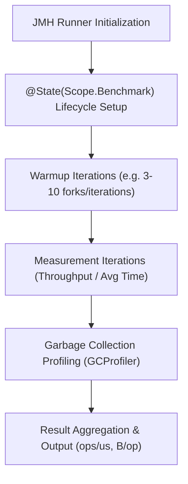
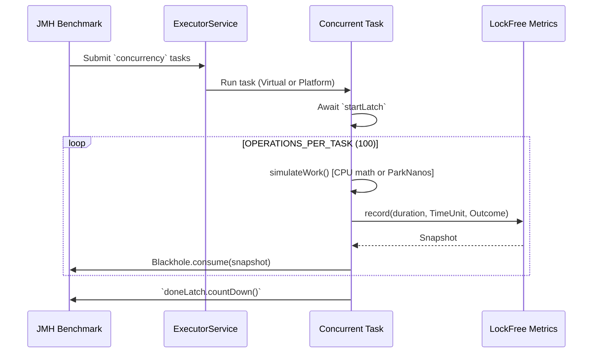

# Microbenchmarking Suite

<details>
<summary>Relevant source files</summary>

The following files were used as context for generating this wiki page:

- [resilience4j-core/src/jmh/java/io/github/resilience4j/core/MetricsBenchmark.java](https://github.com/resilience4j/resilience4j/blob/main/resilience4j-core/src/jmh/java/io/github/resilience4j/core/MetricsBenchmark.java)
- [resilience4j-micrometer/src/main/java/io/github/resilience4j/micrometer/Timer.java](https://github.com/resilience4j/resilience4j/blob/main/resilience4j-micrometer/src/main/java/io/github/resilience4j/micrometer/Timer.java)
- [resilience4j-circuitbreaker/src/jmh/resources/resultsWithGCProfiling.txt](https://github.com/resilience4j/resilience4j/blob/main/resilience4j-circuitbreaker/src/jmh/resources/resultsWithGCProfiling.txt)
- [resilience4j-core/src/main/java/io/github/resilience4j/core/metrics/LockFreeSlidingTimeWindowMetrics.java](https://github.com/resilience4j/resilience4j/blob/main/resilience4j-core/src/main/java/io/github/resilience4j/core/metrics/LockFreeSlidingTimeWindowMetrics.java)
- [resilience4j-core/src/jmh/java/io/github/resilience4j/core/VirtualThreadMetricsBenchmark.java](https://github.com/resilience4j/resilience4j/blob/main/resilience4j-core/src/jmh/java/io/github/resilience4j/core/VirtualThreadMetricsBenchmark.java)
- [resilience4j-micronaut/src/main/java/io/github/resilience4j/micronaut/bulkhead/BulkheadInterceptor.java](https://github.com/resilience4j/resilience4j/blob/main/resilience4j-micronaut/src/main/java/io/github/resilience4j/micronaut/bulkhead/BulkheadInterceptor.java)
- [resilience4j-spring6/src/main/java/io/github/resilience4j/spring6/micrometer/configure/TimerAspect.java](https://github.com/resilience4j/spring6/src/main/java/io/github/resilience4j/spring6/micrometer/configure/TimerAspect.java)
- [resilience4j-micrometer/src/main/java/io/github/resilience4j/micrometer/TimerRegistry.java](https://github.com/resilience4j/resilience4j/blob/main/resilience4j-micrometer/src/main/java/io/github/resilience4j/micrometer/TimerRegistry.java)
- [resilience4j-ratelimiter/src/jmh/java/io/github/resilience4j/ratelimiter/RateLimiterBenchmark.java](https://github.com/resilience4j/ratelimiter/src/jmh/java/io/github/resilience4j/ratelimiter/RateLimiterBenchmark.java)
- [resilience4j-circularbuffer/src/jmh/java/io/github/resilience4j/circularbuffer/CircularBufferBenchmark.java](https://github.com/resilience4j/circularbuffer/src/jmh/java/io/github/resilience4j/circularbuffer/CircularBufferBenchmark.java)
- [resilience4j-circularbuffer/src/jmh/java/io/github/resilience4j/circularbuffer/ConcurrentEvictingQueueBenchmark.java](https://github.com/resilience4j/circularbuffer/src/jmh/java/io/github/resilience4j/circularbuffer/ConcurrentEvictingQueueBenchmark.java)
- [resilience4j-bulkhead/src/jmh/java/io/github/resilience4j/bulkhead/BulkheadBenchmark.java](https://github.com/resilience4j/bulkhead/src/jmh/java/io/github/resilience4j/bulkhead/BulkheadBenchmark.java)
- [resilience4j-micrometer/src/main/java/io/github/resilience4j/micrometer/internal/InMemoryTimerRegistry.java](https://github.com/resilience4j/resilience4j/blob/main/resilience4j-micrometer/src/main/java/io/github/resilience4j/micrometer/internal/InMemoryTimerRegistry.java)
- [resilience4j-circuitbreaker/src/jmh/java/io/github/resilience4j/circuitbreaker/CircuitBreakerBenchmark.java](https://github.com/resilience4j/circuitbreaker/src/jmh/java/io/github/resilience4j/circuitbreaker/CircuitBreakerBenchmark.java)
- [resilience4j-core/src/main/java/io/github/resilience4j/core/metrics/LockFreeFixedSizeSlidingWindowMetrics.java](https://github.com/resilience4j/resilience4j/blob/main/resilience4j-core/src/main/java/io/github/resilience4j/core/metrics/LockFreeFixedSizeSlidingWindowMetrics.java)
- [resilience4j-metrics/src/main/java/io/github/resilience4j/metrics/Timer.java](https://github.com/resilience4j/metrics/src/main/java/io/github/resilience4j/metrics/Timer.java)
- [resilience4j-circuitbreaker/src/main/java/io/github/resilience4j/circuitbreaker/internal/CircuitBreakerMetrics.java](https://github.com/resilience4j/circuitbreaker/src/main/java/io/github/resilience4j/circuitbreaker/internal/CircuitBreakerMetrics.java)
- [resilience4j-micrometer/src/main/java/io/github/resilience4j/micrometer/internal/TimerImpl.java](https://github.com/resilience4j/micrometer/internal/TimerImpl.java)
- [resilience4j-micrometer/src/main/java/io/github/resilience4j/micrometer/Observations.java](https://github.com/resilience4j/micrometer/Observations.java)
- [resilience4j-core/src/main/java/io/github/resilience4j/core/metrics/FixedSizeSlidingWindowMetrics.java](https://github.com/resilience4j/resilience4j/blob/main/resilience4j-core/src/main/java/io/github/resilience4j/core/metrics/FixedSizeSlidingWindowMetrics.java)
- [resilience4j-micrometer/src/testFixtures/java/io/github/resilience4j/micrometer/TimerAssertions.java](https://github.com/resilience4j/resilience4j/blob/main/resilience4j-micrometer/src/testFixtures/java/io/github/resilience4j/micrometer/TimerAssertions.java)
- [resilience4j-core/src/main/java/io/github/resilience4j/core/metrics/SlidingTimeWindowMetrics.java](https://github.com/resilience4j/resilience4j/blob/main/resilience4j-core/src/main/java/io/github/resilience4j/core/metrics/SlidingTimeWindowMetrics.java)
- [resilience4j-core/src/testFixtures/java/io/github/resilience4j/core/ThreadModeExtension.java](https://github.com/resilience4j/resilience4j/blob/main/resilience4j-core/src/testFixtures/java/io/github/resilience4j/core/ThreadModeExtension.java)
- [resilience4j-metrics/src/main/java/io/github/resilience4j/metrics/internal/TimerImpl.java](https://github.com/resilience4j/metrics/internal/TimerImpl.java)
- [resilience4j-core/src/main/java/io/github/resilience4j/core/metrics/PackedAggregation.java](https://github.com/resilience4j/resilience4j/blob/main/resilience4j-core/src/main/java/io/github/resilience4j/core/metrics/PackedAggregation.java)
- [resilience4j-micrometer/src/main/java/io/github/resilience4j/micrometer/tagged/ThreadMetrics.java](https://github.com/resilience4j/micrometer/tagged/ThreadMetrics.java)
- [resilience4j-reactor/src/main/java/io/github/resilience4j/reactor/micrometer/operator/TimerSubscriber.java](https://github.com/resilience4j/reactor/micrometer/operator/TimerSubscriber.java)
- [resilience4j-rxjava3/src/main/java/io/github/resilience4j/rxjava3/micrometer/transformer/FlowableTimer.java](https://github.com/resilience4j/rxjava3/micrometer/transformer/FlowableTimer.java)
- [resilience4j-core/src/main/java/io/github/resilience4j/core/metrics/Measurement.java](https://github.com/resilience4j/core/metrics/Measurement.java)
- [resilience4j-core/src/main/java/io/github/resilience4j/core/metrics/MeasurementData.java](https://github.com/resilience4j/core/metrics/MeasurementData.java)
</details>

## Overview

The Resilience4j microbenchmarking suite is built upon the Java Microbenchmark Harness (JMH) to rigorously evaluate, profile, and prevent performance regressions across foundational components such as core sliding windows, circuit breakers, rate limiters, bulkheads, and circular buffers. Because resilience mechanisms intercept execution flows on critical enterprise code paths, understanding nanosecond-scale latency, object allocation rates, and thread contention is critical to ensuring that the library imposes minimal overhead on host applications.

Sources: [resilience4j-core/src/jmh/java/io/github/resilience4j/core/MetricsBenchmark.java:1-214](https://github.com/resilience4j/resilience4j/blob/main/resilience4j-core/src/jmh/java/io/github/resilience4j/core/MetricsBenchmark.java#L1-L214)

The benchmarking architecture exercises both synchronized implementations (backed by locks) and advanced lock-free counterparts using Java `VarHandle` operations and custom CAS backoff routines. By isolating specific workloads—such as CPU-bound mathematical calculations or simulated I/O blocking via virtual and platform threads—the suite captures precise metrics including operation throughput, average execution times, GC allocation rates, and memory churn.

Sources: [resilience4j-core/src/jmh/java/io/github/resilience4j/core/VirtualThreadMetricsBenchmark.java:1-187](https://github.com/resilience4j/resilience4j/blob/main/resilience4j-core/src/jmh/java/io/github/resilience4j/core/VirtualThreadMetricsBenchmark.java#L1-L187)

---

## JMH Configuration & Benchmark Design

The microbenchmarks across Resilience4j modules utilize standard JMH annotations to control forks, warmup phases, measurement iterations, and concurrency thread groups. Each benchmark class defines explicit measurement parameters to guarantee statistical significance and reproducible performance profiles.



Sources: [resilience4j-core/src/jmh/java/io/github/resilience4j/core/MetricsBenchmark.java:13-19](https://github.com/resilience4j/resilience4j/blob/main/resilience4j-core/src/jmh/java/io/github/resilience4j/core/MetricsBenchmark.java#L13-L19), [resilience4j-ratelimiter/src/jmh/java/io/github/resilience4j/ratelimiter/RateLimiterBenchmark.java:35-44](https://github.com/resilience4j/resilience4j/blob/main/resilience4j-ratelimiter/src/jmh/java/io/github/resilience4j/ratelimiter/RateLimiterBenchmark.java#L35-L44), [resilience4j-circuitbreaker/src/jmh/java/io/github/resilience4j/circuitbreaker/CircuitBreakerBenchmark.java:32-41](https://github.com/resilience4j/resilience4j/blob/main/resilience4j-circuitbreaker/src/jmh/java/io/github/resilience4j/circuitbreaker/CircuitBreakerBenchmark.java#L32-L41)

The following table summarizes the configuration parameters used across the primary module benchmark suites:

| Benchmark Class | Benchmark Mode | Output Unit | Fork Count | Warmup Iterations | Measurement Iterations | Thread Count / Levels |
| :--- | :--- | :--- | :--- | :--- | :--- | :--- |
| `MetricsBenchmark` | `Mode.Throughput` | `MILLISECONDS` | `1` | `3` | `3` | `1, 4, 8, 16` |
| `VirtualThreadMetricsBenchmark` | `Mode.Throughput`, `Mode.AverageTime` | `MILLISECONDS` | `1` | `1` | `1` | `@Param({"4", "32", "128"})` |
| `RateLimiterBenchmark` | `Mode.All` | `MICROSECONDS` | `2` | `10` | `10` | `2` |
| `CircuitBreakerBenchmark` | `Mode.Throughput` | `MICROSECONDS` | `2` | `3` | `10` | `2` |
| `BulkheadBenchmark` | `Mode.Throughput` | `MICROSECONDS` | `2` | `10` | `10` | `2` |
| `CircularBufferBenchmark` | `Mode.AverageTime` | `NANOSECONDS` | `2` | `10` | `10` | `GroupThreads(1)` |

Sources: [resilience4j-core/src/jmh/java/io/github/resilience4j/core/MetricsBenchmark.java:13-19](https://github.com/resilience4j/resilience4j/blob/main/resilience4j-core/src/jmh/java/io/github/resilience4j/core/MetricsBenchmark.java#L13-L19), [resilience4j-core/src/jmh/java/io/github/resilience4j/core/VirtualThreadMetricsBenchmark.java:51-58](https://github.com/resilience4j/resilience4j/blob/main/resilience4j-core/src/jmh/java/io/github/resilience4j/core/VirtualThreadMetricsBenchmark.java#L51-L58), [resilience4j-ratelimiter/src/jmh/java/io/github/resilience4j/ratelimiter/RateLimiterBenchmark.java:35-43](https://github.com/resilience4j/resilience4j/blob/main/resilience4j-ratelimiter/src/jmh/java/io/github/resilience4j/ratelimiter/RateLimiterBenchmark.java#L35-L43), [resilience4j-circuitbreaker/src/jmh/java/io/github/resilience4j/circuitbreaker/CircuitBreakerBenchmark.java:32-40](https://github.com/resilience4j/resilience4j/blob/main/resilience4j-circuitbreaker/src/jmh/java/io/github/resilience4j/circuitbreaker/CircuitBreakerBenchmark.java#L32-L40), [resilience4j-bulkhead/src/jmh/java/io/github/resilience4j/bulkhead/BulkheadBenchmark.java:33-41](https://github.com/resilience4j/resilience4j/blob/main/resilience4j-bulkhead/src/jmh/java/io/github/resilience4j/bulkhead/BulkheadBenchmark.java#L33-L41), [resilience4j-circularbuffer/src/jmh/java/io/github/resilience4j/circularbuffer/CircularBufferBenchmark.java:36-44](https://github.com/resilience4j/resilience4j/blob/main/resilience4j-circularbuffer/src/jmh/java/io/github/resilience4j/circularbuffer/CircularBufferBenchmark.java#L36-L44)

---

## Core Metrics Sliding Window Microbenchmarks

The `MetricsBenchmark` suite evaluates four distinct metrics window implementations across varying thread contention levels (`1`, `4`, `8`, and `16` threads):
1. `FixedSizeSlidingWindowMetrics` (synchronized with `ReentrantLock`)
2. `LockFreeFixedSizeSlidingWindowMetrics` (`VarHandle`-driven CAS loop)
3. `SlidingTimeWindowMetrics` (time-based synchronized circular buffer)
4. `LockFreeSlidingTimeWindowMetrics` (time-slice based lock-free list)

Each benchmark iteration executes `simulateWork()` to generate a synthetic duration value before recording a successful outcome against the metrics window.

```java
@Benchmark
@Warmup(iterations = WARMUP_COUNT)
@Fork(value = FORK_COUNT)
@Measurement(iterations = ITERATION_COUNT)
@Threads(16)
public Snapshot benchmarkLFSW16Threads() throws InterruptedException {
    long duration = simulateWork();
    return lockFreeSlidingWindow.record(duration, TimeUnit.MILLISECONDS, Metrics.Outcome.SUCCESS);
}
```

Sources: [resilience4j-core/src/jmh/java/io/github/resilience4j/core/MetricsBenchmark.java:75-84](https://github.com/resilience4j/resilience4j/blob/main/resilience4j-core/src/jmh/java/io/github/resilience4j/core/MetricsBenchmark.java#L75-L84), [resilience4j-core/src/jmh/java/io/github/resilience4j/core/MetricsBenchmark.java:205-213](https://github.com/resilience4j/resilience4j/blob/main/resilience4j-core/src/jmh/java/io/github/resilience4j/core/MetricsBenchmark.java#L205-L213)

> [!NOTE]
> Lock-free metrics classes rely on `CASBackoffUtil.performBackoff(spinCount)` during contended compare-and-swap loops. This backoff strategy is optimized for both virtual and platform threads to prevent CPU burning during high concurrency spikes.

Sources: [resilience4j-core/src/main/java/io/github/resilience4j/core/metrics/LockFreeFixedSizeSlidingWindowMetrics.java:101-122](https://github.com/resilience4j/resilience4j/blob/main/resilience4j-core/src/main/java/io/github/resilience4j/core/metrics/LockFreeFixedSizeSlidingWindowMetrics.java#L101-L122), [resilience4j-core/src/main/java/io/github/resilience4j/core/metrics/LockFreeSlidingTimeWindowMetrics.java:98-122](https://github.com/resilience4j/resilience4j/blob/main/resilience4j-core/src/main/java/io/github/resilience4j/core/metrics/LockFreeSlidingTimeWindowMetrics.java#L98-L122)

---

## Virtual Thread vs Platform Thread Performance Analysis

`VirtualThreadMetricsBenchmark` explores the performance characteristics of lock-free metric structures under virtual versus platform threads. It parametrizes workloads across three dimensions: `workloadType` (`cpu` vs `io`), `threadMode` (`virtual` vs `platform`), and `concurrency` (`4`, `32`, `128`).



Sources: [resilience4j-core/src/jmh/java/io/github/resilience4j/core/VirtualThreadMetricsBenchmark.java:63-74](https://github.com/resilience4j/resilience4j/blob/main/resilience4j-core/src/jmh/java/io/github/resilience4j/core/VirtualThreadMetricsBenchmark.java#L63-L74), [resilience4j-core/src/jmh/java/io/github/resilience4j/core/VirtualThreadMetricsBenchmark.java:129-158](https://github.com/resilience4j/resilience4j/blob/main/resilience4j-core/src/jmh/java/io/github/resilience4j/core/VirtualThreadMetricsBenchmark.java#L129-L158)

The workload simulation branches based on the configured parameter:
- **CPU workload**: Executes a tight loop computing square roots (`Math.sqrt`), stressing CAS loops under high CPU contention.
- **I/O workload**: Executes `LockSupport.parkNanos(100_000)` (100 microseconds), demonstrating how virtual threads handle blocking operations without starving carrier threads.

Sources: [resilience4j-core/src/jmh/java/io/github/resilience4j/core/VirtualThreadMetricsBenchmark.java:167-186](https://github.com/resilience4j/resilience4j/blob/main/resilience4j-core/src/jmh/java/io/github/resilience4j/core/VirtualThreadMetricsBenchmark.java#L167-L186)

---

## Circuit Breaker & GC Profiling Benchmarks

`CircuitBreakerBenchmark` and its associated GC profiling results (`resultsWithGCProfiling.txt`) quantify the memory allocation overhead introduced by wrapping method execution in decorator chains and event publishers.

The benchmark compares four supplier execution modes:
1. `directSupplier`: Unprotected lambda invocation (`stringSupplier.get()`).
2. `protectedSupplier`: Decorated with a default `CircuitBreaker` instance.
3. `protectedSupplierWithOneConsumer`: Decorated with a circuit breaker having a registered event consumer (`onEvent`).
4. `protectedSupplierWithDiffConsumer`: Decorated with multiple event consumers listening for success, error, ignored errors, and rejected calls.

Sources: [resilience4j-circuitbreaker/src/jmh/java/io/github/resilience4j/circuitbreaker/CircuitBreakerBenchmark.java:55-76](https://github.com/resilience4j/resilience4j/blob/main/resilience4j-circuitbreaker/src/jmh/java/io/github/resilience4j/circuitbreaker/CircuitBreakerBenchmark.java#L55-L76)

The output profile highlights the memory trade-off of state management and event emission:

| Benchmark Scenario | Mode | Score (ops/us) | Allocation Rate (MB/sec) | Norm Allocation (B/op) | GC Count |
| :--- | :--- | :--- | :--- | :--- | :--- |
| `CircuitBreakerBenchmark.directSupplier` | `thrpt` | `12.258` | `≈ 10⁻⁴` | `≈ 10⁻⁵` | `≈ 0` |
| `CircuitBreakerBenchmark.protectedSupplier` | `thrpt` | `4.122` | `1017.650` | `272.000` | `2871` |
| `CircuitBreakerBenchmark.protectedSupplierWithOneConsumer` | `thrpt` | `4.021` | `1037.001` | `284.000` | `2936` |
| `CircuitBreakerBenchmark.protectedSupplierWithDiffConsumer` | `thrpt` | `3.970` | `894.224` | `248.000` | `2912` |

Sources: [resilience4j-circuitbreaker/src/jmh/resources/resultsWithGCProfiling.txt:1-32](https://github.com/resilience4j/resilience4j/blob/main/resilience4j-circuitbreaker/src/jmh/resources/resultsWithGCProfiling.txt#L1-L32)

> [!CAUTION]
> Registering event consumers on high-throughput circuit breaker paths incurs measurable allocation overhead (approx. 248–284 bytes per operation) due to event object instantiation and reactive dispatching.

Sources: [resilience4j-circuitbreaker/src/jmh/resources/resultsWithGCProfiling.txt:1-32](https://github.com/resilience4j/resilience4j/blob/main/resilience4j-circuitbreaker/src/jmh/resources/resultsWithGCProfiling.txt#L1-L32)

---

## Rate Limiter & Bulkhead Concurrency Benchmarks

`RateLimiterBenchmark` measures the performance differential between semaphore-based rate limiting (`SemaphoreBasedRateLimiter`) and atomic token-bucket rate limiting (`AtomicRateLimiter`). Both are configured with `Integer.MAX_VALUE` limits and a 10-nanosecond refresh period, executed across 2 concurrent threads with the `GCProfiler` attached.

```java
@Setup
public void setUp() {
    RateLimiterConfig rateLimiterConfig = RateLimiterConfig.custom()
        .limitForPeriod(Integer.MAX_VALUE)
        .limitRefreshPeriod(Duration.ofNanos(10))
        .timeoutDuration(Duration.ofSeconds(5))
        .build();
    semaphoreBasedRateLimiter = new SemaphoreBasedRateLimiter("semaphoreBased", rateLimiterConfig);
    atomicRateLimiter = new AtomicRateLimiter("atomicBased", rateLimiterConfig);
    // ...
}
```

Sources: [resilience4j-ratelimiter/src/jmh/java/io/github/resilience4j/ratelimiter/RateLimiterBenchmark.java:58-76](https://github.com/resilience4j/resilience4j/blob/main/resilience4j-ratelimiter/src/jmh/java/io/github/resilience4j/ratelimiter/RateLimiterBenchmark.java#L58-L76)

Similarly, `BulkheadBenchmark` contrasts direct execution against semaphore bulkheads configured with `maxConcurrentCalls(2)`, testing both plain suppliers and subscribers hooked up via `RxJava2Adapter`.

Sources: [resilience4j-bulkhead/src/jmh/java/io/github/resilience4j/bulkhead/BulkheadBenchmark.java:55-72](https://github.com/resilience4j/resilience4j/blob/main/resilience4j-bulkhead/src/jmh/java/io/github/resilience4j/bulkhead/BulkheadBenchmark.java#L55-L72)

---

## Circular Buffer & Evicting Queue Benchmarks

The `resilience4j-circularbuffer` JMH suite evaluates low-level ring buffer and queue data structures designed for event storage and sliding window aggregations.
- `CircularBufferBenchmark`: Exercises `ConcurrentCircularFifoBuffer` measuring operations like `circularBufferAddEvent`, `circularBufferToList`, `circularBufferSize`, and `circularBufferTakeEvent`.
- `ConcurrentEvictingQueueBenchmark`: Tests `ConcurrentEvictingQueue` under multi-threaded group configurations (`GroupThreads(2)` for add, `GroupThreads(1)` for size, poll, and peek).

Sources: [resilience4j-circularbuffer/src/jmh/java/io/github/resilience4j/circularbuffer/CircularBufferBenchmark.java:36-103](https://github.com/resilience4j/resilience4j/blob/main/resilience4j-circularbuffer/src/jmh/java/io/github/resilience4j/circularbuffer/CircularBufferBenchmark.java#L36-L103), [resilience4j-circularbuffer/src/jmh/java/io/github/resilience4j/circularbuffer/ConcurrentEvictingQueueBenchmark.java:34-101](https://github.com/resilience4j/resilience4j/blob/main/resilience4j-circularbuffer/src/jmh/java/io/github/resilience4j/circularbuffer/ConcurrentEvictingQueueBenchmark.java#L34-L101)

---

## Running the Benchmarks

To execute the microbenchmarks locally, invoke the corresponding Gradle JMH task for the target module.

```bash
# Run core metrics benchmarks
./gradlew :resilience4j-core:jmh -Pjmh.includes='MetricsBenchmark'

# Run virtual thread metrics benchmarks
./gradlew :resilience4j-core:jmh -Pjmh.includes='VirtualThreadMetricsBenchmark'

# Run circuit breaker benchmarks with GC profiling
./gradlew :resilience4j-circuitbreaker:jmh -Pjmh.includes='CircuitBreakerBenchmark'
```

Sources: [resilience4j-core/src/jmh/java/io/github/resilience4j/core/VirtualThreadMetricsBenchmark.java:44-46](https://github.com/resilience4j/resilience4j/blob/main/resilience4j-core/src/jmh/java/io/github/resilience4j/core/VirtualThreadMetricsBenchmark.java#L44-L46)

## Related

- [[Sliding Window Metrics]]

